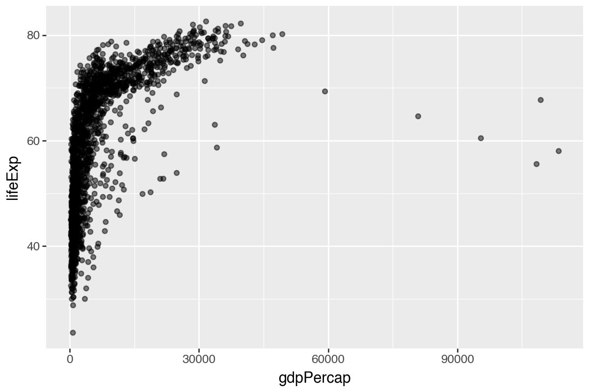
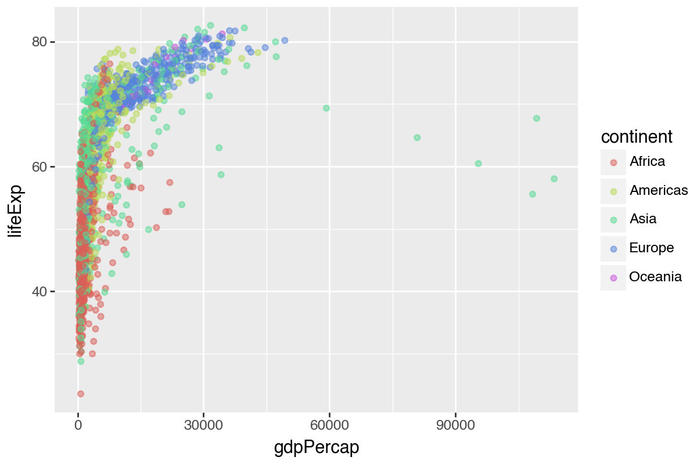
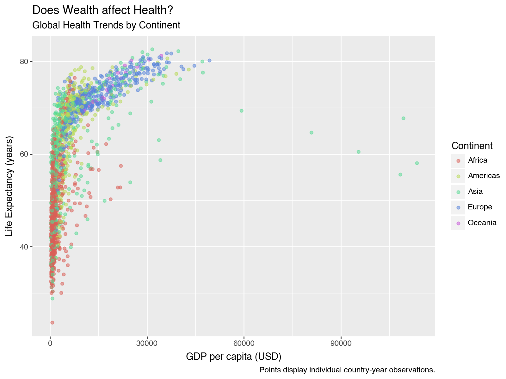
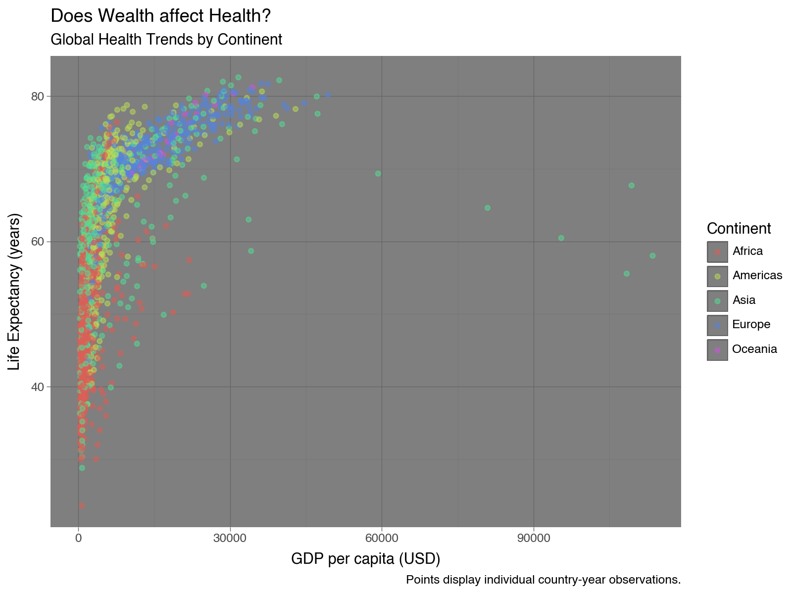
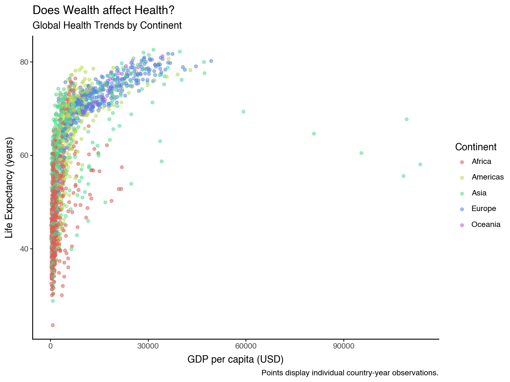
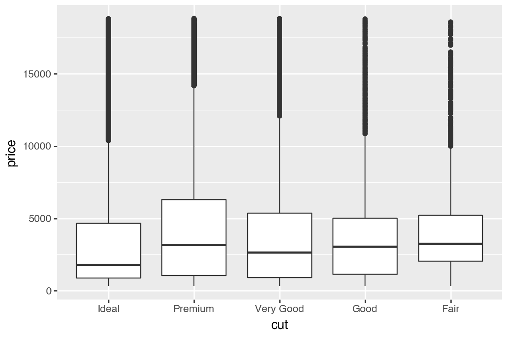
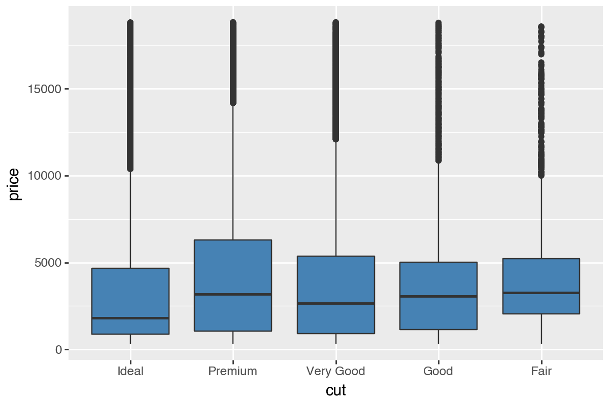
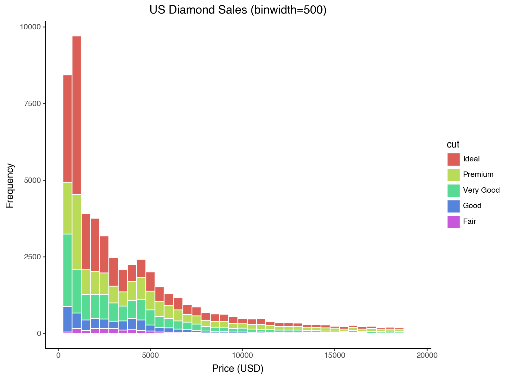

# Visualization with `plotnine` in `Python`

```{r setup_skill_plotnine, include=FALSE}
## Global options
knitr::opts_chunk$set(cache = FALSE, message = FALSE, warning = FALSE)

# Fix graphics API version mismatch issues by avoiding ragg
knitr::opts_chunk$set(dev = "png")
library(knitr)
library(kableExtra)
## Configure reticulate to use existing Python
library(reticulate)

# Use your specific Python installation
# python_path <- "C:/Python312/python.exe"
# if (file.exists(python_path)) {
#   use_python(python_path, required = FALSE)
#   cat("Using Python at:", python_path, "\n")
# } else {
#   # Fallback to system Python
#   system_python <- Sys.which("python")
#   if (system_python != "") {
#     use_python(system_python, required = FALSE)
#     cat("Using system Python at:", system_python, "\n")
#   } else {
#     cat("Warning: No Python installation found\n")
#   }
# }

# Try common Python paths (uncomment/modify for your system)
python_path <- NULL

# Try macOS common paths first
mac_paths <- c(
  "/opt/anaconda3/bin/python3",
  "/usr/local/bin/python3",
  "/opt/homebrew/bin/python3"
)

for (path in mac_paths) {
  if (file.exists(path)) {
    python_path <- path
    break
  }
}

# If no common path found, try system Python
if (is.null(python_path)) {
  system_python <- Sys.which("python3")
  if (system_python != "" && file.exists(system_python)) {
    python_path <- system_python
  }
}

# Configure Python if found, otherwise let reticulate auto-discover
if (!is.null(python_path) && file.exists(python_path)) {
  use_python(python_path, required = FALSE)
  Sys.setenv(RETICULATE_PYTHON = python_path)
  cat("Using Python at:", python_path, "\n")
} else {
  cat("No specific Python path found, letting reticulate auto-discover\n")
  # Don't set invalid paths - let reticulate handle it
}

# Disable automatic environment creation and downloads
Sys.unsetenv("RETICULATE_PYTHON_ENV")
Sys.unsetenv("RETICULATE_PYTHON") 
Sys.unsetenv("RETICULATE_AUTOCONFIGURE")
Sys.unsetenv("RETICULATE_PYTHON_FALLBACK")

# Set the Python path explicitly
Sys.setenv(RETICULATE_PYTHON = python_path)

# Prevent reticulate from downloading Python
options(reticulate.conda_binary = NULL)
```

Visualization is a key part of statistical analyses, especially in systems engineering. In this tutorial, we'll learn to visualize data with `plotnine` (the Python port of `ggplot2`).

**Please follow along using the code below!**

<br> <br>

## Getting Started {.unnumbered}

### Loading Packages {.unnumbered}

```{python}
import pandas as p
from plotnine import *
from gapminder import gapminder as gapminder
from seaborn import load_dataset

# diamonds from seaborn
diamonds = load_dataset('diamonds')
```

### Gapminder data {.unnumbered}

```{python}
# View it in the console
gapminder
```

```{python}
# Glimpse-like summary
gapminder.dtypes, gapminder.shape
```

## Your first scatterplot

```{python}
p1 = ggplot(data=gapminder, mapping=aes(x='gdpPercap', y='lifeExp'))
p1.save("plotnine_figures/01_scatter_base.png", dpi=200, width=6, height=4)
```

```{r, echo=FALSE, out.width="100%"}
knitr::include_graphics("plotnine_figures/01_scatter_base.png")
```

Add points with `+ geom_point()`.

```{python}
p2 = (ggplot(gapminder, aes(x='gdpPercap', y='lifeExp')) + geom_point())
p2.save("plotnine_figures/01_scatter_points.png", dpi=200, width=6, height=4)
```

```{r, echo=FALSE, out.width="100%"}

```

------------------------------------------------------------------------

## Learning Check 1 {.unnumbered .LC}

**Question**

What kind of relationship does this graph show? Why might it matter to policymakers?

<details>

<summary>**[View Answer!]**</summary>

As wealth per person (GDP per capita) increases, life expectancy rises quickly then tapers off. This shows a strong relationship between wealth and health.

</details>

------------------------------------------------------------------------

## Transparency (alpha)

```{python}
p3 = (ggplot(gapminder, aes(x='gdpPercap', y='lifeExp')) + geom_point(alpha=0.2))
p3.save("plotnine_figures/01_scatter_alpha02.png", dpi=200, width=6, height=4)
p4 = (ggplot(gapminder, aes(x='gdpPercap', y='lifeExp')) + geom_point(alpha=0.5))
p4.save("plotnine_figures/01_scatter_alpha05.png", dpi=200, width=6, height=4)
p5 = (ggplot(gapminder, aes(x='gdpPercap', y='lifeExp')) + geom_point(alpha=1))
p5.save("plotnine_figures/01_scatter_alpha1.png", dpi=200, width=6, height=4)
```

```{r, echo=FALSE, out.width="100%"}
knitr::include_graphics("plotnine_figures/01_scatter_alpha02.png")
```

```{r, echo=FALSE, out.width="100%"}

```

```{r, echo=FALSE, out.width="100%"}
knitr::include_graphics("plotnine_figures/01_scatter_alpha1.png")
```

------------------------------------------------------------------------

## Learning Check 2 {.unnumbered .LC}

**Question**

What happens when you change `alpha` across the three visuals above?

<details>

<summary>**[View Answer!]**</summary>

`alpha` controls transparency from 0 to 1. Higher values are more opaque; lower values are more transparent.

</details>

------------------------------------------------------------------------

## Color: constant vs mapped

```{python}
# Single color
p6 = (ggplot(gapminder, aes(x='gdpPercap', y='lifeExp')) +
  geom_point(alpha=0.5, color='steelblue'))
p6.save("plotnine_figures/01_scatter_single_color.png", dpi=200, width=6, height=4)

# Color mapped by continent
p7 = (ggplot(gapminder, aes(x='gdpPercap', y='lifeExp', color='continent')) +
  geom_point(alpha=0.5))
p7.save("plotnine_figures/01_scatter_mapped_color.png", dpi=200, width=6, height=4)
```

```{r, echo=FALSE, out.width="100%"}
knitr::include_graphics("plotnine_figures/01_scatter_single_color.png")
```

```{r, echo=FALSE, out.width="100%"}

```

------------------------------------------------------------------------

## Learning Check 3 {.unnumbered .LC}

**Question**

Where do you place `color` for a single color vs. multiple colors based on a variable?

<details>

<summary>**[View Answer!]**</summary>

Single color: set `color` inside `geom_point(color='...')` (outside `aes`). Mapped colors: set `color` inside `aes(color='variable')`.

</details>

------------------------------------------------------------------------

## Improving our visualizations

```{python}
p8 = (ggplot(gapminder, aes(x='gdpPercap', y='lifeExp', color='continent')) +
  geom_point(alpha=0.5) +
  labs(x='GDP per capita (USD)',
       y='Life Expectancy (years)',
       color='Continent',
       title='Does Wealth affect Health?',
       subtitle='Global Health Trends by Continent',
       caption='Points display individual country-year observations.'))
p8.save("plotnine_figures/01_scatter_improved.png", dpi=200, width=8, height=6)
```

```{r, echo=FALSE, out.width="100%"}
knitr::include_graphics("plotnine_figures/01_scatter_improved.png")
```

You can save visuals as objects to reuse them.

```{python}
myviz = (ggplot(gapminder, aes(x='gdpPercap', y='lifeExp', color='continent')) +
  geom_point(alpha=0.5) +
  labs(x='GDP per capita (USD)', y='Life Expectancy (years)', color='Continent',
       title='Does Wealth affect Health?', subtitle='Global Health Trends by Continent',
       caption='Points display individual country-year observations.'))

myviz.save("plotnine_figures/01_myviz_default.png", dpi=200, width=8, height=6)
(myviz + theme_bw()).save("plotnine_figures/01_myviz_bw.png", dpi=200, width=8, height=6)
(myviz + theme_dark()).save("plotnine_figures/01_myviz_dark.png", dpi=200, width=8, height=6)
(myviz + theme_classic()).save("plotnine_figures/01_myviz_classic.png", dpi=200, width=8, height=6)
```

```{r, echo=FALSE, out.width="100%"}

```

```{r, echo=FALSE, out.width="100%"}
knitr::include_graphics("plotnine_figures/01_myviz_bw.png")
```

```{r, echo=FALSE, out.width="100%"}

```

```{r, echo=FALSE, out.width="100%"}

```

<br> <br>

## Visualizing `diamonds` data

```{python}
diamonds.head(3)
```

```{python}
diamonds.dtypes, diamonds.shape
```

### Boxplots by cut

```{python}
p9 = (ggplot(diamonds, aes(x='cut', y='price', group='cut')) + geom_boxplot())
p9.save("plotnine_figures/01_boxplot_default.png", dpi=200, width=6, height=4)
```

```{r, echo=FALSE, out.width="100%"}

```

```{python}
p10 = (ggplot(diamonds, aes(x='cut', y='price', group='cut')) +
  geom_boxplot(fill='steelblue'))
p10.save("plotnine_figures/01_boxplot_fill.png", dpi=200, width=6, height=4)
```

```{r, echo=FALSE, out.width="100%"}

```

```{python}
p11 = (ggplot(diamonds, aes(x='cut', y='price', group='cut', fill='cut')) +
  geom_boxplot())
p11.save("plotnine_figures/01_boxplot_mapped_fill.png", dpi=200, width=6, height=4)
```

```{r, echo=FALSE, out.width="100%"}
knitr::include_graphics("plotnine_figures/01_boxplot_mapped_fill.png")
```

------------------------------------------------------------------------

## Learning Check 4 {.unnumbered .LC}

**Question**

Why do the two boxplot versions look different? What changed in the code to create those effects?

<details>

<summary>**[View Answer!]**</summary>

Constant fill uses `geom_boxplot(fill='steelblue')`. Mapped fill uses `aes(fill='cut')` to color by variable.

</details>

------------------------------------------------------------------------

## Visualizing Distributions

```{python}
p12 = (ggplot(diamonds, aes(x='price', fill='cut')) +
  geom_histogram(color='white') +
  labs(x='Price (USD)', y='Frequency', title='US Diamond Sales'))
p12.save("plotnine_figures/01_histogram_default.png", dpi=200, width=8, height=6)
```

```{r, echo=FALSE, out.width="100%"}
knitr::include_graphics("plotnine_figures/01_histogram_default.png")
```

### Try adjusting binwidth and theme

```{python}
p13 = (ggplot(diamonds, aes(x='price', fill='cut')) +
  geom_histogram(color='white', binwidth=500) +
  theme_classic() +
  labs(x='Price (USD)', y='Frequency', title='US Diamond Sales (binwidth=500)'))
p13.save("plotnine_figures/01_histogram_binwidth.png", dpi=200, width=8, height=6)
```

```{r, echo=FALSE, out.width="100%"}

```

------------------------------------------------------------------------

## Learning Check 5 {.unnumbered .LC}

**Question**

Make a histogram of `price` with a narrower binwidth and apply a different theme. Which choices improve readability?

<details>

<summary>**[View Answer!]**</summary>

```{python}
p14 = (ggplot(diamonds, aes(x='price', fill='cut')) +
  geom_histogram(color='white', binwidth=250) +
  theme_bw() +
  labs(x='Price (USD)', y='Frequency'))
p14.save("plotnine_figures/01_histogram_answer.png", dpi=200, width=8, height=6)
```

```{r, echo=FALSE, out.width="100%"}
knitr::include_graphics("plotnine_figures/01_histogram_answer.png")
```

</details>

------------------------------------------------------------------------

## Conclusion {.unnumbered}

You learned how to build scatterplots, boxplots, and histograms with `plotnine` and how to control transparency, color mapping, labels, and themes.

```{python, include=FALSE}
globals().clear()
```
