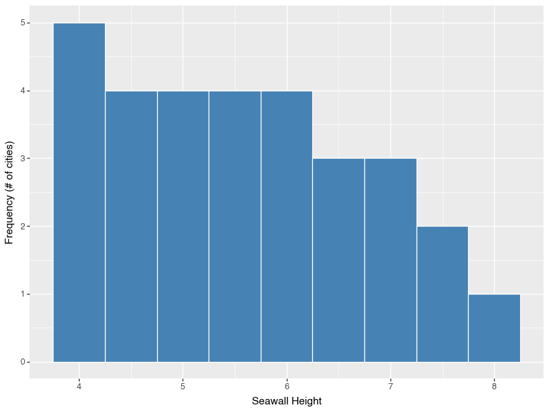
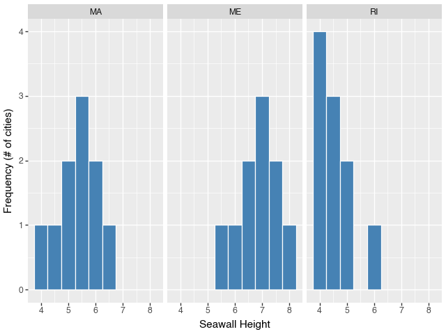

# Coding in Python
```{r setup_python_workshop_1, include=FALSE}
## Global options
knitr::opts_chunk$set(cache = FALSE, message = FALSE, warning = FALSE)

# Fix graphics API version mismatch issues by avoiding ragg
knitr::opts_chunk$set(dev = "png")
dir.create("figs", showWarnings = FALSE)
library(knitr)
library(kableExtra)
## Configure reticulate to use existing Python
library(reticulate)

# Use your specific Python installation
# Try common Python paths (uncomment/modify for your system)
python_path <- NULL

# Try macOS common paths first
mac_paths <- c(
  "/opt/anaconda3/bin/python3",
  "/usr/local/bin/python3",
  "/opt/homebrew/bin/python3"
)

for (path in mac_paths) {
  if (file.exists(path)) {
    python_path <- path
    break
  }
}

# If no common path found, try system Python
if (is.null(python_path)) {
  system_python <- Sys.which("python3")
  if (system_python != "" && file.exists(system_python)) {
    python_path <- system_python
  }
}

# Configure Python if found, otherwise let reticulate auto-discover
if (!is.null(python_path) && file.exists(python_path)) {
  use_python(python_path, required = FALSE)
  Sys.setenv(RETICULATE_PYTHON = python_path)
  cat("Using Python at:", python_path, "\n")
} else {
  cat("No specific Python path found, letting reticulate auto-discover\n")
  # Don't set invalid paths - let reticulate handle it
}

# Prevent reticulate from downloading Python
options(reticulate.conda_binary = NULL)

# Create folder to store the figures created by plotnine and matplotlib
dir.create("plotnine_figures", showWarnings = FALSE)
dir.create("matplotlib_figures", showWarnings = FALSE)
```

Welcome to Posit Cloud! You made it! This document will introduce you to how to start coding in Python using Posit Cloud. We will use the Python language frequently to conduct analyses and visualization.

```
Hello world! We are coding in Python!

```

<br>
<br>

## Getting Started {-}

### Making a Posit Cloud account {-}

We'll be using Posit Cloud, a browser-based environment you can access from any computer. To get set up, follow your course setup guide, then open the project for this workshop.

### Using Python for the First Time {-}

1. For a quick visual orientation, take a peek at the image below.
2. Read and follow along with the instructions on this page. Type the tutorial code and run it in your Python session.

```{r graphic_py_1, echo = FALSE, out.width = "100%", fig.align='center', fig.cap= "Visual Intro to Using Posit Cloud"}
knitr::include_graphics(path = "images/1_0.png")
```

<br>
<br>

## Introduction to `Python`

Your project includes a Python script file (its name ends in `.py`). It contains two kinds of text:

1. code - instructions to our calculator
2. comments - any text that immediately follows a `#` sign

```{python example_comment_py}
# For example,
# Comments are ignored by the calculator, so we can write notes.
```

Notice: the IDE has four panes, including the editor, console, environment/history, and files. The console shows outputs from Python (or R).

To create a new script, go to File >> New File >> Text File (or Python Script), then save it and name it.

```{r image_py_1_1, echo = FALSE, out.width = "49%", fig.align = 'center', fig.cap="Open New Script"}
knitr::include_graphics(path = "images/1_1.png")
```
```{r image_py_1_2, echo = FALSE, out.width = "49%", fig.align='center', fig.cap="Save New Script as a .py file!"}
knitr::include_graphics(path = "images/1_2.png")
```

Let's learn to use Python!

## Basic Calculations in Python

Try highlighting the following and pressing Ctrl+Enter, or click Run.

Addition:

```{python chunk_addition_py}
1 + 5
```

Subtraction:

```{python chunk_subtraction_py}
5 - 2
```

Multiplication:

```{python chunk_multiplication_py}
2 * 3
```

Division:

```{python chunk_division_py}
15 / 5
```

Exponents:

```{python chunk_exponents_py}
2 ** 2
```

Square roots:

```{python chunk_squareroots_py}
16 ** 0.5
```

Order of operations still applies. Use parentheses to control order:

```{python chunk_order_py}
2 * 2 - 5
```

```{python chunk_parentheses_py}
2 * (2 - 5)
```

<br>
<br>

---

## Learning Check 1 {.unnumbered .LC}

**Question**

Try calculating something wild in Python! Solve for `x` below using the commands above.

1. \( x = \sqrt{ (\frac{2 - 5}{5})^{4} } \)
2. \( x = (1 - 7)^{2} \times 5 - \sqrt{49} \)
3. \( x = 2^{2} + 2^{2} \times 2^{2} - 2^{2} \div 2^{2} \)

<br>
<br>

<details><summary>**[View Answer!]**</summary>

```{python chunk_statement1_py}
((2 - 5) / 5) ** 4
(( (2 - 5) / 5) ** 4) ** 0.5
```

```{python chunk_statement2_py}
(1 - 7) ** 2 * 5 - 49 ** 0.5
```

```{python chunk_statement3_py}
2**2 + 2**2 * 2**2 - 2**2 / 2**2
```

</details>

---

<br>
<br>
<br>

## Types of Values in Python

Python commonly uses numeric values and character strings.

```{python chunk_numeric_py}
15000
0.0005
-8222
```

and

```{python chunk_character_py}
"Coding!"
"Corgis!"
"Coffee!"
```

<br>
<br>

## Types of Data in Python

### Values and Variables

Save a value as a named variable in memory.

```{python chunk_values_py}
2
"x"
```

```{python chunk_object_py}
myvalue = 2
```

```{python chunk_enter_py}
myvalue
```

Do operations too!

```{python chunk_operations_py}
secondvalue = myvalue + 2
secondvalue
```

Overwrite variables as needed.

```{python chunk_overwrite_py}
myvalue = "I overwrote it!"
myvalue
```

Remove variables from memory if needed.

```{python chunk_remove_py}
del myvalue
del secondvalue
```

### Lists (like R vectors)

Lists hold multiple values.

```{python chunk_vector_py}
[1, 4, 8]
```

and

```{python chunk_char_vector_py}
["Boston", "New York", "Los Angeles"]
```

Python will coerce types inside a list only if you mix them when converting to arrays or series. Keep types consistent when possible.

Do math element-wise using pandas Series:

```{python chunk_vector_math_py, eval=FALSE}
import pandas as p
p.Series([1,2,3,4]) * 2
p.Series([1,2,3,4]) + 2
```

### DataFrames with pandas

Bundle columns into a table using pandas DataFrame.

```{python chunk_dataframe_py, eval=FALSE}
import pandas as p
myheights = [4, 4.5, 5, 5, 5, 5.5, 5.5, 6, 6.5, 6.5]
mytowns = ["Gloucester", "Newburyport", "Provincetown", 
           "Plymouth", "Marblehead", "Chatham", "Salem", 
           "Ipswich", "Falmouth", "Boston"]
myyears = [1990, 1980, 1970, 1930, 1975, 1975, 1980, 1920, 1995, 2000]

sw = p.DataFrame({
  'height': myheights,
  'town': mytowns,
  'year': myyears
})
sw
```

Access a column (Series) with dot or bracket notation and do operations.

```{python chunk_sw_height_py, eval=FALSE}
sw.height
sw.height + 1
```

Update values as needed.

```{python chunk_sw_height_update_py, eval=FALSE}
# sw["height"] = sw["height"] + 1
```

<br>
<br>

---

## Learning Check 2 {.unnumbered .LC}

**Question**

How would you make your own DataFrame? Make a DataFrame with 3 columns and 4 rows. Make 1 numeric column and 2 character columns. How many rows are in that DataFrame?

<details><summary>**[View Answer!]**</summary>

```{python chunk_mayhem_py, eval=FALSE, echo=TRUE}
import pandas as p
mayhem = p.DataFrame({
  'dogs': ["Mocha", "Domino", "Latte", "Dot"],
  'types': ["corgi", "dalmatian", "corgi", "dalmatian"],
  'treats_per_year': [5000, 3000, 2000, 10000]
})
mayhem
```

</details>

---

<br>
<br>

## Common Functions in Python

We can compute descriptive statistics using pandas Series methods.

```{r image_py_1_4, include = FALSE,echo = FALSE, out.width = "100%", fig.cap = "Descriptive Stats Cheatsheet!"}
knitr::include_graphics(path = "images/1_4.png")
```

### Measures of Central Tendency

```{python chunk_central_tendency_py, eval=FALSE}
sw.height.mean()
sw.height.median()
sw.height.sum()
```

### Measures of Dispersion

```{python chunk_dispersion_py, eval=FALSE}
sw.height.min()
sw.height.max()
sw.height.quantile(q=0.25)
sw.height.quantile(q=0.75)
sw.height.std()
sw.height.var()
```

### Other Good Functions

```{python chunk_length_py, eval=FALSE}
len(sw.height)
sw.shape[1]  # number of columns
```

<br>

## Missing Data

Sometimes data include missing values. In pandas these are `NaN`. Many pandas functions ignore `NaN` by default.

```{python chunk_sw_missing_py}
import pandas as p
mysw = p.Series([4, 4.5, 5, 5, 5, 5.5, 5.5, 6, 6.5, 6.5, None])
```

```{python chunk_sw_missing_mean_py}
mysw.mean()  # returns 5.35, skips None/NaN by default
```

If you need to include missing values in a calculation, convert them or use numpy functions explicitly, but usually skipping them is desired.

<br>
<br>

---

## Learning Check 3 {.unnumbered .LC}

**Question**

Recreate the table below as a pandas DataFrame named `jp`, then answer the questions.

```{r chunk_lc_jp_py, echo = FALSE, fig.height=2}
knitr::kable(data.frame(
  town = c("Kuji South", "Fudai", "Taro", "Miyako", "Yamada", "Ohtsuchi", "Tohni", "Yoshihama", "Hirota", "Karakuwa East", "Onagawa", "Souma", "Nakoso"),
  seawall_m = c(12.0, 15.5, 13.7, 8.5, 6.6, 6.4, 11.8, 14.3, 6.5, 6.1, 5.8, 6.2, 6.2),
  wave_m = c(14.5, 18.4, 16.3, 11.8, 10.9, 15.1, 21.0, 17.2, 18.3, 14.4, 18.0, 14.5, 7.7)
))
```

1. Reproduce this table as a DataFrame named `jp`.
2. How much greater was the mean tsunami height than the mean seawall height?
3. Which varied more across towns: seawall height or tsunami height? By how much?

<br>
<br>

<details><summary>**[View Answer!]**</summary>

```{python chunk_lc_jp_1_py, eval=FALSE, echo=TRUE}
import pandas as p
jp = p.DataFrame({
  'town': ["Kuji South", "Fudai", "Taro", "Miyako", "Yamada", "Ohtsuchi", "Tohni", 
           "Yoshihama", "Hirota", "Karakuwa East", "Onagawa", "Souma", "Nakoso"],
  'seawall_m': [12.0, 15.5, 13.7, 8.5, 6.6, 6.4, 11.8, 14.3, 6.5, 6.1, 5.8, 6.2, 6.2],
  'wave_m': [14.5, 18.4, 16.3, 11.8, 10.9, 15.1, 21.0, 17.2, 18.3, 14.4, 18.0, 14.5, 7.7]
})
jp
```

```{python chunk_lc_jp_2_py, eval=FALSE}
jp.wave_m.mean()
jp.seawall_m.mean()
jp.wave_m.mean() - jp.seawall_m.mean()
```

```{python chunk_lc_jp_3_py, eval=FALSE}
jp.wave_m.std()
jp.seawall_m.std()
jp.wave_m.std() - jp.seawall_m.std()
```

</details>

---

<br>
<br>

## Packages

### Installing packages

Use `pip` to install packages. Do this once per environment.

```{python chunk_packages_install_py, eval=FALSE}
import ensurepip
ensurepip.bootstrap()
%pip install pandas plotnine dfply
```

### Importing packages

```{python chunk_packages_import_py, eval}
import pandas as p
from plotnine import *
from dfply import *
import matplotlib.pyplot as plt
```

<br>
<br>

## The Pipeline {-}

In Python we can use dfply's pipeline operator `>>` to connect data to functions. This reduces parentheses and keeps sequences readable. *But it is not as usable as the pipe operator in R. It can only pipe dataframes to common dfply / dplyr functions like `select`, `mutate`, `summarize`, etc.*

```{python chunk_pipeline_py, eval=FALSE}
from dfply import *
sw >> select(X.height)
sw >> mutate(y = X.height ** X.height)
sw >> summarize(mean_value = mean(X.height))
```

<br>
<br>

## Visualizing Data with Histograms

We can visualize with `matplotlib`/`pandas`, or use `plotnine` (a Python port of `R`'s `ggplot2`) to develop detailed, customized visuals.

### pandas/matplotlib

```{python chunk_allsw_py, echo=TRUE}
import pandas as p
import matplotlib.pyplot as pltI 
allsw = p.DataFrame({
  'height': [4, 4.5, 5, 5, 5.5, 5.5, 5.5, 6, 6, 6.5,
             4, 4, 4, 4, 4.5, 4.5, 4.5, 5, 5, 6,
             5.5, 6, 6.5, 6.5, 7, 7, 7, 7.5, 7.5, 8],
  'states': ["MA"]*10 + ["RI"]*10 + ["ME"]*10
})
allsw.hist()
```
```{python include=FALSE}
# Save the plot
plt.gcf().savefig("matplotlib_figures/allsw.png")
```

```{r echo=FALSE, out.width = "100%"}
# Display
knitr::include_graphics("matplotlib_figures/allsw.png")
```

<br>
<br>

### `geom_histogram()` in `plotnine`

```{python plot1_py, echo=TRUE}
from plotnine import *
g = (ggplot(allsw, aes(x='height')) +
  geom_histogram(color="white", fill="steelblue", binwidth=0.5) +
  labs(x="Seawall Height", y="Frequency (# of cities)")
)
g
```

```{python include=FALSE}
# Save the plot
g.save(filename = "plotnine_figures/plot1_py.png")
```


```{r echo=FALSE, out.width = "100%"}
# Display

```

Facet by state:

```{python plot2_py, echo=TRUE}
g = (ggplot(allsw, aes(x='height')) +
 geom_histogram(color="white", fill="steelblue", binwidth=0.5) +
 labs(x="Seawall Height", y="Frequency (# of cities)") +
 facet_wrap('~states'))
g
```

```{python include=FALSE}
# Save the plot
g.save(filename = "plotnine_figures/plot2_py.png")
```

```{r echo=FALSE, out.width = "100%"}
# Display

```


<br>
<br>

---

## Learning Check 4 {.unnumbered .LC}

**Question**

Using a list named `sw`, draw a histogram of the seawall heights: 4.5, 5, 5.5, 5, 5.5, 6.5, 6.5, 6, 5, 4. Use pandas or plotnine.

<details><summary>**[View Answer!]**</summary>

```{python sw_hist_py, echo=TRUE}
import pandas as p
sw = [4.5, 5, 5.5, 5, 5.5, 6.5, 6.5, 6, 5, 4]
g = p.Series(sw).hist()
g

# or you could do it like this!
# hist(sw)
```

```{python include=FALSE}
# Save the plot
plt.gcf().savefig("matplotlib_figures/sw_hist_py.png")
```

```{r echo=FALSE, out.width = "100%"}
# Display
knitr::include_graphics("matplotlib_figures/sw_hist_py.png")
```


</details>

---

## Learning Check 5 {.unnumbered .LC}

**Question**

Make a histogram of `jp['seawall_m']` from Learning Check 3 using (1) pandas and (2) plotnine.

<details><summary>**[View Answer!]**</summary>

```{python include=FALSE}
import pandas as p
jp = p.DataFrame({
  'town': ["Kuji South", "Fudai", "Taro", "Miyako", "Yamada", "Ohtsuchi", "Tohni", 
           "Yoshihama", "Hirota", "Karakuwa East", "Onagawa", "Souma", "Nakoso"],
  'seawall_m': [12.0, 15.5, 13.7, 8.5, 6.6, 6.4, 11.8, 14.3, 6.5, 6.1, 5.8, 6.2, 6.2],
  'wave_m': [14.5, 18.4, 16.3, 11.8, 10.9, 15.1, 21.0, 17.2, 18.3, 14.4, 18.0, 14.5, 7.7]
})
```

```{python seawall_m_py, echo=TRUE}
g = jp.seawall_m.hist()
g
```

```{python include=FALSE}
# Save the plot
plt.gcf().savefig("matplotlib_figures/seawall_m_py.png")
```

```{r echo=FALSE, out.width = "100%"}
# Display
knitr::include_graphics("matplotlib_figures/seawall_m_py.png")
```

```{python plot3_py, echo=TRUE}
g = (ggplot(jp, aes(x='seawall_m')) + 
# adjust binwidth for clearer visualization
geom_histogram(binwidth=0.5))
g
```

```{python include=FALSE}
# Save the plot
g.save("plotnine_figures/plot3_py.png")
```

```{r echo=FALSE, out.width = "100%"}
# Display
knitr::include_graphics("plotnine_figures/plot3_py.png")
```


</details>

---

<br>
<br>
<br>

## Conclusion {-}

### Next Steps {-}

We'll keep building skills:

- working with data types in Python
- calculating meaningful statistics in Python
- visualizing meaningful trends in Python

<br>

### Advice {-}

- Clear variables as needed with `del` or restart the session.
- Clear console outputs and save often.
- Download or upload files from the Files pane as needed.

You'll be a rockstar at using Python in no time! Stay tuned for our next Workshop!

<br>

### Troubleshooting {-}

- If your session freezes, use Session >> Restart Session.
- If that doesn't work, relaunch the project from the top banner menu.
- If that doesn't work, let me know!

```{python, include = FALSE}
# Clear variables
globals().clear()
```

