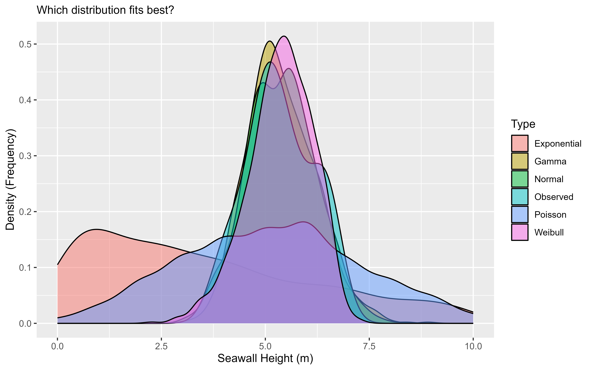

# Distributions and Visualization in Python

```{r setup_workshop_2_python, include=FALSE}
## Global options
knitr::opts_chunk$set(cache = FALSE, message = FALSE, warning = FALSE)
```

```{r header_py, echo = FALSE, out.width="100%", fig.cap="Yay Distributions!"}

```

This tutorial will introduce you to visualizing distributions and basic plots in Python using plotnine (a Python port of ggplot2) and pandas.

## Getting Started {-}

Please open up your Posit.Cloud project. Start a new Python script (File >> New File >> Text File). Save the script as `workshop_2_python.py`. And let's get started!

### Install and Import Packages {-}

We're going to use a few Python packages today: `pandas` (data), `plotnine` (visualization), `gapminder` (example data), and `seaborn` (example data).

```{python, eval=FALSE}
%pip install pandas plotnine seaborn gapminder
```

```{python}
import pandas as p
from plotnine import *
from gapminder import gapminder as gapminder
from seaborn import load_dataset

# Load diamonds dataset from seaborn
diamonds = load_dataset('diamonds')
```

## Your First Scatterplot

Let's make a scatterplot with the `gapminder` dataset: GDP per capita on the x-axis and life expectancy on the y-axis.

```{python, eval=FALSE}
ggplot(data=gapminder, mapping=aes(x='gdpPercap', y='lifeExp'))
```

We made an empty graph! Add `+ geom_point()` to plot points.

```{python, eval=FALSE}
(ggplot(data=gapminder, mapping=aes(x='gdpPercap', y='lifeExp')) +
  geom_point())
```

### Transparency (alpha)

What happens when you change `alpha`? Try a few values:

```{python, eval=FALSE}
(ggplot(gapminder, aes(x='gdpPercap', y='lifeExp')) + geom_point(alpha=0.2))
```

```{python, eval=FALSE}
(ggplot(gapminder, aes(x='gdpPercap', y='lifeExp')) + geom_point(alpha=0.5))
```

```{python, eval=FALSE}
(ggplot(gapminder, aes(x='gdpPercap', y='lifeExp')) + geom_point(alpha=1))
```

### Color: constant vs mapped

If you want a single color, set `color` inside `geom_point()`. If you want colors based on a variable, map `color` inside `aes()`.

```{python, eval=FALSE}
# Single color
(ggplot(gapminder, aes(x='gdpPercap', y='lifeExp')) +
  geom_point(alpha=0.5, color='steelblue'))
```

```{python, eval=FALSE}
# Color mapped by continent
(ggplot(gapminder, aes(x='gdpPercap', y='lifeExp', color='continent')) +
  geom_point(alpha=0.5))
```

### Labels and Themes

Add informative labels and explore themes.

```{python, eval=FALSE}
(ggplot(gapminder, aes(x='gdpPercap', y='lifeExp', color='continent')) +
  geom_point(alpha=0.5) +
  labs(x='GDP per capita (USD)',
       y='Life Expectancy (years)',
       color='Continent',
       title='Does Wealth affect Health?',
       subtitle='Global Health Trends by Continent',
       caption='Points display individual country-year observations.') )
```

You can save a plot as an object and add to it.

```{python, eval=FALSE}
myviz = (ggplot(gapminder, aes(x='gdpPercap', y='lifeExp', color='continent')) +
  geom_point(alpha=0.5) +
  labs(x='GDP per capita (USD)', y='Life Expectancy (years)', color='Continent',
       title='Does Wealth affect Health?', subtitle='Global Health Trends by Continent',
       caption='Points display individual country-year observations.'))

myviz
myviz + theme_bw()
myviz + theme_dark()
myviz + theme_classic()
```

---

## Learning Check 1 {.unnumbered .LC}

**Question**

Try both color approaches on the `gapminder` scatterplot. Which code assigns a single color? Which maps color by continent?

<details><summary>**[View Answer!]**</summary>

```{python, eval=FALSE}
# Single color
(ggplot(gapminder, aes(x='gdpPercap', y='lifeExp')) +
  geom_point(alpha=0.5, color='steelblue'))
```

```{python, eval=FALSE}
# Color mapped by continent
(ggplot(gapminder, aes(x='gdpPercap', y='lifeExp', color='continent')) +
  geom_point(alpha=0.5))
```

</details>

---

<br>
<br>

## Visualizing diamonds data

`diamonds` is a dataset of 50,000+ diamond sales available via seaborn.

```{python}
# Peek at the data
diamonds.head(3)
```

```{python}
diamonds.columns
```

```{python}
diamonds.shape
```

### Boxplots by cut

`cut` is ordinal while `price` is numeric. Let's make boxplots.

```{python, eval=FALSE}
(ggplot(diamonds, aes(x='cut', y='price', group='cut')) +
  geom_boxplot())
```

We can change fill either to a single color or map it by `cut`.

```{python, eval=FALSE}
(ggplot(diamonds, aes(x='cut', y='price', group='cut')) +
  geom_boxplot(fill='steelblue'))
```

```{python, eval=FALSE}
(ggplot(diamonds, aes(x='cut', y='price', group='cut', fill='cut')) +
  geom_boxplot())
```

---

## Learning Check 2 {.unnumbered .LC}

**Question**

Why do the two boxplot versions above look different? What changed in the code to create those different effects?

<details><summary>**[View Answer!]**</summary>

```{python}
# Answer:
# Constant fill: set inside geom_boxplot(fill='steelblue').
# Mapped fill: set inside aes(..., fill='cut') to color by variable.
```

</details>

---

<br>
<br>

## Visualizing Distributions

Histograms approximate the distribution of values. Let's visualize `price` by `cut`.

```{python, eval=FALSE}
(ggplot(diamonds, aes(x='price', group='cut', fill='cut')) +
  geom_histogram(color='white') +
  labs(x='Price (USD)', y='Frequency of Price (Count)', title='US Diamond Sales'))
```

### Try adjusting binwidth and theme

```{python, eval=FALSE}
(ggplot(diamonds, aes(x='price', fill='cut')) +
  geom_histogram(color='white', binwidth=500) +
  theme_classic() +
  labs(x='Price (USD)', y='Frequency', title='US Diamond Sales (binwidth=500)'))
```

---

## Learning Check 3 {.unnumbered .LC}

**Question**

Using `diamonds`, make a histogram of `price` with a narrower binwidth and apply a different theme. Which choices improve readability?

<details><summary>**[View Answer!]**</summary>

```{python, eval=FALSE}
(ggplot(diamonds, aes(x='price', fill='cut')) +
  geom_histogram(color='white', binwidth=250) +
  theme_bw() +
  labs(x='Price (USD)', y='Frequency'))
```

</details>

---

<br>
<br>

## Conclusion {.unnumbered}

You learned how to build scatterplots, boxplots, and histograms with `plotnine` and how to control transparency, color mapping, labels, and themes. These tools help you explore and present distributions effectively in Python.

```{python, include=FALSE}
# Clear variables
globals().clear()
```

