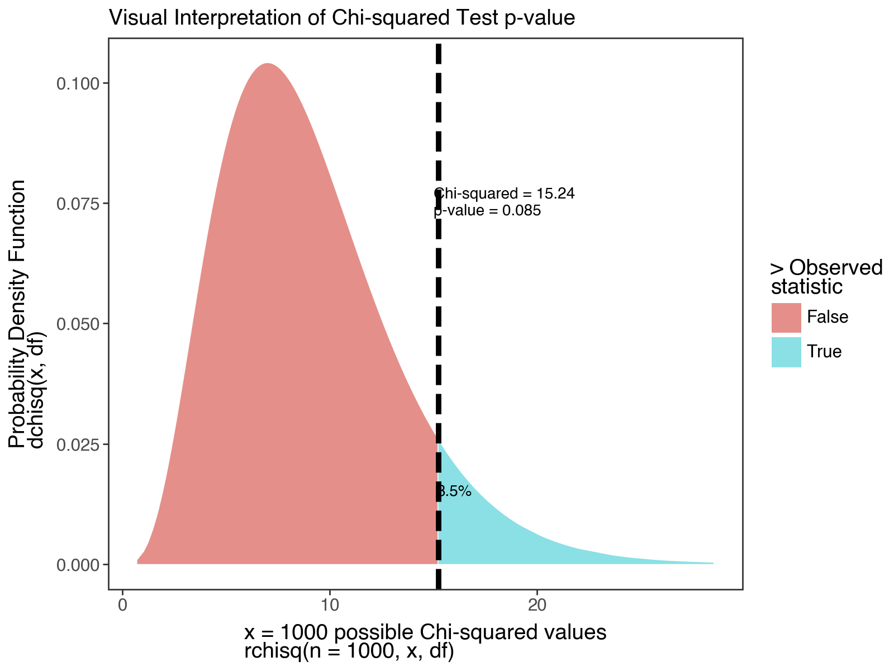

# Statistical Techniques for Exponential Distributions in `Python`

```{r setup_workshop_7b, include = FALSE}
library(tidyverse)
library(knitr)
library(kableExtra)
knitr::opts_chunk$set(cache = FALSE, message = FALSE, warning = FALSE)

# Fix graphics API version mismatch issues by avoiding ragg
knitr::opts_chunk$set(dev = "png")

## Configure reticulate to use existing Python
library(reticulate)

# Use your specific Python installation
# Try common Python paths (uncomment/modify for your system)
python_path <- NULL

# Try macOS common paths first
mac_paths <- c(
  "/opt/anaconda3/bin/python3",
  "/usr/local/bin/python3",
  "/opt/homebrew/bin/python3"
)

for (path in mac_paths) {
  if (file.exists(path)) {
    python_path <- path
    break
  }
}

# If no common path found, try system Python
if (is.null(python_path)) {
  system_python <- Sys.which("python3")
  if (system_python != "" && file.exists(system_python)) {
    python_path <- system_python
  }
}

# Configure Python if found, otherwise let reticulate auto-discover
if (!is.null(python_path) && file.exists(python_path)) {
  use_python(python_path, required = FALSE)
  Sys.setenv(RETICULATE_PYTHON = python_path)
  cat("Using Python at:", python_path, "\n")
} else {
  cat("No specific Python path found, letting reticulate auto-discover\n")
  # Don't set invalid paths - let reticulate handle it
}

# Create folder to store the figures created by plotnine and matplotlib
dir.create("plotnine_figures", showWarnings = FALSE)
dir.create("matplotlib_figures", showWarnings = FALSE)

# Prevent reticulate from downloading Python
options(reticulate.conda_binary = NULL)
```

## Getting Started

In this workshop, we're going to examine several key tools that will help you (1) cross-tabulate failure data over time, (2) use statistics to determine whether an archetypal distribution (eg. exponential) fits your data sufficiently, (3) how to estimate the failure rate $\lambda$ from tabulated data, and (4) how to plan experiments for product testing. Here we go!

### Load Packages

Let's start by loading the necessary Python packages. We'll use `pandas` for data manipulation, `plotnine` for visualization, and `scipy.stats` for statistical functions.

```{python}
# Load packages
import pandas as pd
import numpy as np
from scipy.stats import chi2, expon, weibull_min
from plotnine import *
import os, sys
sys.path.append(os.path.abspath('functions'))
```

###  Our Data

In this workshop, we're going to continue working with a data.frame called `masks`. Let's examine a hypothetical sample of `n = 50` masks produced by Company X to measure how many hours it took for each part of the mask to break.

Please import the `masks.csv` DataFrame below. Each row is a mask, with its own unique `id`. Columns describe how many hours it took for the `left_earloop` to snap, the `right_earloop` to snap, the nose `wire` to snap, and the `fabric` of the mask to tear.


```{python}
masks = pd.read_csv("workshops/masks.csv")

# Let's glimpse its contents!
# masks.info()
masks.head()
```


<br>
<br>


## Factors in Python

For the next section, you'll need to understand categorical data in pandas.

- Categorical data in pandas is similar to factors in R. They are helpful for telling Python what order to interpret things in.

- You can make your own Series into a categorical using `pd.Categorical(vector, categories = ["first", "second", "etc"], ordered=True)`.

```{python}
# Make character list
myvector = ["surgical", "KN-95", "KN-95", "N-95", "surgical"]
# Turn it into a factor (categorical)!
myfactor = pd.Categorical(myvector, categories = ["N-95", "KN-95", "surgical"])
# check it
myfactor
```

Categorical data can be converted to numeric codes using `.codes`. This returns the level for each value in the factor.

```{python}
# Turn the categorical to numeric codes
mynum = myfactor.codes
# Compare
pd.DataFrame({'myfactor': myfactor, 'mynum': mynum})
# for example, N-95, which was ranked first in the factor, receives a 0 (Python uses 0-based indexing)
```

<br>
<br>

## Crosstabulation

Sometimes, we might want to tabulate failures in terms of meaningful units of time, counting the total failures every 5 hours, every 24 hours, etc. Let's learn how!

```{python}
# Take the left_earloop values and put them into a new DataFrame
d1 = pd.DataFrame({
    "t": masks["left_earloop"]
})

# classify each value into 5-point width bins (0 to 5, 6-10, 11-15, etc.)
# then convert it to a numeric ranking of categories from 1  to n bins
d1["label"] = pd.cut(
    d1["t"],
    bins = range(0, int(d1["t"].max()) + 6, 5),    # creates 0–5, 5–10, ...
)

# Let's take a peek
d1.head()
```

**Step 2**: Tabulate Observations per Bin.

```{python}
# Get total observed rows in each bin
d2 = (
    d1
    # group by each interval/bin
    # dropna=False keeps empty categories
    .groupby("label", dropna=False)
    # count rows in each bin
    .size()
    # rename count column to r_obs
    .reset_index(name="r_obs")
)

d2.head()
```

**Step 3**: Get bounds and midpoint of Bins

Last, we might need the bounds (upper and lower value), or the midpoint. Here's how!

```{python}
d3 = d2.copy()
# Get the bin numbers (1, 2, 3, ...)
d3['bin'] = d3['label'].cat.codes + 1
# Lower and Upper bounds with width of 5
d3['lower'] = (d3['bin'] - 1) * 5
d3['upper'] = d3['bin'] * 5
# Computes the mid point for each bin
d3['midpoint'] = (d3['lower'] + d3['upper']) / 2

# Check it!
d3
```

---

<br>
<br>


## Learning Check 1 {.unnumbered .LC}

**Question**
  
A small start-up is product testing a new super-effective mask. They product tested 25 masks over 60 days. They contract you to analyze the masks' lifespan data, recorded below as the number of days to failure. 

```{python}
# Lifespan in days
supermasks = [1, 2, 2, 2, 3, 3, 4, 4, 5, 9, 13, 15, 17, 19, 
            20, 21, 23, 24, 24, 24, 32, 33, 33, 34, 54]
```

1. Cross-tabulate the lifespan distribution in intervals of `7 days`.

2. What's the last 7-day interval?

3. How many masks are expected to fail within that interval?

4. What percentage of masks are expected to fail *within 28 days*?

<details><summary>**[View Answer!]**</summary>
  
1. Cross-tabulate the lifespan distribution in intervals of 7 days.

```{python, echo = FALSE}
import pandas as pd
import numpy as np

# Lifespan in days
supermasks = [1, 2, 2, 2, 3, 3, 4, 4, 5, 9, 13, 15, 17, 19,
              20, 21, 23, 24, 24, 24, 32, 33, 33, 34, 54]

# Convert to a DataFrame
a = pd.DataFrame({"t": supermasks})

# Step 1: Cut into 7-day bins (0–7, 7–14, ...)
max_t = a["t"].max()
# Create bins with width = 7
bins = np.arange(0, max_t + 7, 7)

a["label"] = pd.cut(a["t"], bins=bins)

# Step 2: Count observations per bin
d = (
    a
    .groupby("label", dropna=False)
    .size()
    .reset_index(name="r_obs")
)

# Step 3: Add bin number, lower bound, upper bound, midpoint
d["bin"] = d["label"].cat.codes + 1
d["lower"] = (d["bin"] - 1) * 7
d["upper"] = d["bin"] * 7
d["midpoint"] = (d["lower"] + d["upper"]) / 2

# Final result
d
```

2. What's the last 7-day interval?

```{python}
# Find the bin with the highest bin id
d[d["bin"] == d["bin"].max()]
```

```{python}
# or
d.tail(1)
```

```{python}
# or find the bin with the highest midpoint
d[d["midpoint"] == d["midpoint"].max()]
```


3. How many masks are expected to fail within that interval?

```{python}
# Find the count of masks to fail `r_obs` within that interval
d.loc[d["bin"] == d["bin"].max(), ["label", "r_obs"]]
```

4. What percentage of masks are expected to fail *within 28 days*?

```{python}
result = (
  d.assign(
    # Calculate cumulative failures
    r_cumulative = d["r_obs"].cumsum(),
    # Calculate cumulative percentage
    percent = d["r_obs"].cumsum() / d["r_obs"].sum()
)
# Filter to adjust our failures within 28 days
.loc[d["midpoint"] <= 28]
)

result
```

</details>

<br>
<br>
<br>

## Estimating Lambda

Sometimes, we don't have access to the full raw data of times to failure for a product. Often, we only have access to cross-tabulated data released by companies. How then are we supposed to analyze product failure and reliability, if we cannot compute it directly? Even if we do not have *raw* data, we can still estimate the **failure rate** $\lambda$ for a component. Here's a few ways!

### Lambda from Complete Sample

If we have a complete sample of data (eg. not censored), then we can just calculate: $\hat{\lambda} = \frac{no. \ of \ failures}{total \ unit \ test \ hours} $.

```{python}
# Eg.
1 / masks['left_earloop'].mean()
```

### $\hat{\lambda}$ from Cross-Tabulation

Alternatively, if our data is censored or pre-tabulated into groups, we may need to use the `midpoint` and `count` of failures in each `bin` to calculate the failure rate $\lambda$. But, because this is an *estimate*, subject to error, we call it $\hat{\lambda}$ (said "lambda-hat"). Here are the 3 kinds of cross-tabulated samples you might encounter.

1. **Tabulated, No Censoring**: tallied up in equally sized bins. All products eventually fail, yielding complete sample of times to failure.

2. **Tabulated, Type I Censoring**: experiment stops when time $t$ reaches $limit$.

3. **Tabulated, Type II Censoring**: experiment stops when number of units failed $n_{failed}$ reaches $limit$.

For example, if we receive just the `d3` DataFrame we made above, how do we estimate $\lambda$ from it? 

We will need:

- $r$: total failures (`sum(r_obs)`)

- $n$: total observations (failed or not) (provided; otherwise, $n = r$)

- $\sum_{i=1}^{r}{t_i}$: total unit-hours (`sum(midpoint*r_obs)`)

- $T$: timestep of (1) last failure observed (sometimes written $t_r$)  or (2) last timestep recorded; usually obtained by `max(midpoint)`.

- Unless some cases do not fail, $(n - r)t_z$ will cancel out as `0`.

$$ \hat{\lambda} = \frac{ r  }{ \sum_{i=1}^{r}{t_i}  +  (n - r)t_z} $$

```{python}
# Let's calculate it!

r = d3["r_obs"].sum() # total failures
hours = (d3["midpoint"] * d3["r_obs"]).sum()  # total failure-hours
n = r  # in this case, total failures = total obs
tz = d3["midpoint"].max() # end of study period

# Calculate lambda hat!
lambda_hat = r / (hours + (n - r) * tz)

# Combine the results!
d4 = pd.DataFrame({
  "r": [r],
  "hours": [hours],
  "tz": [tz],
  "lambda_hat": [lambda_hat]
})
d4
```

```{python}
# Let's compare
1 / (masks["left_earloop"]).mean()
```

---

<br>
<br>


## Learning Check 2 {.unnumbered .LC}

**Question**
  
The same startup testing that super-effective mask needs to estimate their failure rate, but they only have crosstabulated data. They've provided it to you below, using a dictionary (similar to R's `tribble()`).

Estimate $\hat{\lambda}$ from the cross-tabulated data, knowing that they tested 25 masks over 60 days.

```{python}
# Days to failure - note: corrected the data (bin 4 should have lower=21)
a = pd.DataFrame({
    'bin': [1, 2, 3, 4, 5, 6, 7, 8],
    'label': ['[0,7]', '(7,14]', '(14,21]', '(21,28]', '(28,35]', '(35,42]', '(42,49]', '(49,56]'],
    'r_obs': [9, 2, 5, 4, 4, 0, 0, 1],
    'lower': [0, 7, 14, 21, 28, 35, 42, 49],
    'upper': [7, 14, 21, 28, 35, 42, 49, 56]
})

a
```


<details><summary>**[View Answer!]**</summary>
  
Estimate $\hat{\lambda}$ from the cross-tabulated data, knowing that they tested 25 masks over 60 days.

```{python, echo = FALSE}
# Days to failure
a = pd.DataFrame({
    'bin': [1, 2, 3, 4, 5, 6, 7, 8],
    'label': ['[0,7]', '(7,14]', '(14,21]', '(21,28]', '(28,35]', '(35,42]', '(42,49]', '(49,56]'],
    'r_obs': [9, 2, 5, 4, 4, 0, 0, 1],
    'lower': [0, 7, 14, 21, 28, 35, 42, 49],
    'upper': [7, 14, 21, 28, 35, 42, 49, 56]
})

# Step 1: Compute the midpoint of each bin
a["midpoint"] = (a["upper"] - a["lower"]) / 2 + a["lower"]

# Step 2: Summaries (same as your summarize() in R)
r = a["r_obs"].sum()                          # total failures
days = (a["midpoint"] * a["r_obs"]).sum()     # failure-days
n = r                                         # same as R
tz = a["midpoint"].max()                      # end of study period

# Step 3: Calculate lambda-hat
lambda_hat = r / (days + (n - r) * tz)

# Step 4: Return results in a one-row DataFrame like R
b = pd.DataFrame({
    "r": [r],
    "days": [days],
    "n": [n],
    "tz": [tz],
    "lambda_hat": [lambda_hat]
})

b
```

</details>

<br>
<br>

### Confidence Intervals for $\hat{\lambda}$

Also, our estimate of lambda might be slightly off due to random sampling error. (Every time you take a random sample, there's a little change, right?) That's why we call it $\hat{\lambda}$. So, let's build a **confidence interval** around our estimate.

#### $k$ factor

We can build confidence intervals around our point estimate $\hat{\lambda}$ using something called a **$k$ factor.** We will **weight** $\hat{\lambda}$ by a factor $k$, to get a slightly higher/slightly lower estimated failure rate that shows our confidence interval. 

- This factor $k$ may be greater depending on (1) the total number of failures $r$ and (2) our level of acceptable error ($alpha$). 

- Like any statistic, our estimate $\hat{\lambda}$ has a full *sampling distribution* of $\hat{\lambda}$ values we could get due to random sampling error, with some of them occurring more frequently than others. 

- We want to find the upper and lower bounds around the 90%, 95%, or perhaps 99% *most common* (middle-most) values in that sampling distribution. So, if $alpha = 0.10$, we're going to get a 90% confidence interval (dubbed $interval$) spanning from the 5%~95% of that sampling distribution.

```{python}
# To calculate a 'one-tailed' 90% CI (eg. we only care if above 90%)
alpha = 0.10
ci = 1 - alpha
ci
```

```{python}
# To adjust this to be 'two-tailed' 90% CI (eg. we care if below 5% or above 95%)...
0.5 + (ci / 2)
0.5 - ci / 2
```

#### $k$ factor by Type of Data

- **No Censoring**: If we have complete data (all observations failed!), using this formula to calculate factor $k$:

```{python, eval = FALSE}
# For example, let's say r = 50
r = 50
k = chi2.ppf(ci, df=2*r) / (2*r)
```

- **Time-Censoring**: If we only record up to a specific time (eg. planning an experiment), use **this** formula to calculate factor $k$, setting as the degrees of freedom $df = 2(r+1)$. 

```{python, eval = FALSE}
# For example, let's say r = 50
r = 50
k = chi2.ppf(ci, df=2*(r+1)) / (2*r)
```


So, since we do not have time censoring in our `d4` dataset, we can go ahead an calculate the `df = 2*r` and compute the 90% `lower` and `upper` confidence intervals.

```{python}
result = pd.DataFrame({
    'lambda_hat': [d4['lambda_hat'].iloc[0]],
    'r': [d4['r'].iloc[0]],
    'k_upper': [chi2.ppf(0.95, df=2*d4['r'].iloc[0]) / (2*d4['r'].iloc[0])],
    'k_lower': [chi2.ppf(0.05, df=2*d4['r'].iloc[0]) / (2*d4['r'].iloc[0])],
})
result['lower'] = result['lambda_hat'] * result['k_lower']
result['upper'] = result['lambda_hat'] * result['k_upper']
print(round(result, 4))
```

#### $k$ factor functions

🧮 Here are some helper functions from `functions.functions_kfactors.py` that make it easy to calculate and visualize k-factors used in confidence intervals for failure rates!

This `qk` function is useful when you need the upper and lower k-factor for a given probability *p* and number of failures *r*.

```{python}
from functions.functions_kfactors import qk
"""
k-factor Quantiles

Function to return quantiles for k-factors.
Intended for estimating confidence intervals for failure rates.

Parameters:
p: float or array of probabilities / percentile(s)
r: int number of failures (non-negative integers; can include zero)
time: bool logical; is case time-censored data?
failure: bool logical; is case failure-censored data?
"""

# Let's try an example of 95th percentile k-factor for a sample with 20 failures
qk(p=0.95, r=20)
```

This `rk` function generates random samples of k-factor values. It's useful when you want to run simulations and make plots to visualize the spread.

```{python}
from functions.functions_kfactors import rk
"""
k-factor Random Deviates

Get a random sample of k-factor values for simulating sampling distributions of failure rates.

Parameters:
n: int number of observations.
r: int number of failures (non-negative integers; can include zero)
time: bool logical; is case time-censored data?
failure: bool logical; is case failure-censored data?
"""
k_samples = rk(n=1000, r=20)
```

```{python}
# Visualize 1000 random k-factors and save
import matplotlib
matplotlib.use('Agg')  # Use non-interactive backend for rendering
import matplotlib.pyplot as plt

fig = plt.figure(figsize=(8, 6))
plt.hist(k_samples)
plt.tight_layout()
# Save the plot
plt.savefig("matplotlib_figures/k_samples.png", dpi=100, bbox_inches='tight')
plt.close(fig)
```

```{r, echo=FALSE, out.width="100%"}

```

If you already have the k-factor value and want to know what percentile it is, use this `pk` function to find out!
 
```{python}
from functions.functions_kfactors import pk
"""
k-factor Cumulative Distribution Function

Function to return cumulative probabilities / percentiles given a supplied k-factor quantile `q`.
Intended for confidence intervals for failure rates.

Parameters:
q: float or array of quantiles (k-factors)
r: int number of failures (non-negative integers; can include zero)
time: bool logical; is case time-censored data?
failure: bool logical; is case failure-censored data?
"""

# Probability that k-factor value <= 2 with 20 failures
pk(q=2, r=20)
```

This function below estimates the probability densities for a given set of k-factor values. It is useful to visualize and compare distributions under different conditions.

```{python}
from functions.functions_kfactors import dk
"""
k-factor Probability Density Function

Function to return probability densities given a supplied k-factor quantile `x`.
Intended for visualizing sampling distributions of failure rates.

Parameters:
x: float or array of quantiles (k-factors)
r: int number of failures (non-negative integers; can include zero)
time: bool logical; is case time-censored data?
failure: bool logical; is case failure-censored data?
"""

# Example
dk(x=[0, 1, 2, 3], r=21, time=True, failure=False)
```


---

<br>
<br>


## Learning Check 3 {.unnumbered .LC}

**Question**
  
A small start-up is product testing a new super-effective mask. They product tested 25 masks over 60 days. They contracted you to analyze the cross-tabulated data, tabulated in intervals of 7 days. You have an estimate for $\hat{\lambda}$, provided below.

```{python}
# Your estimate
b = pd.DataFrame({
    'r': [25],
    'days': [416.5],
    'n': [25],
    'tz': [52.5],
    'lambda_hat': [0.06002401]
})
```

Estimate a 95% confidence interval for $\hat{\lambda}$.


<details><summary>**[View Answer!]**</summary>
  
Estimate a 95% confidence interval for $\hat{\lambda}$.

```{python}
# Get data...
b = pd.DataFrame({
    'r': [25],
    'days': [416.5],
    'n': [25],
    'tz': [52.5],
    'lambda_hat': [0.06002401]
})

# And estimate lambda hat!
c = pd.DataFrame({
    'lambda_hat': [b['lambda_hat'].iloc[0]],
    'r': [b['r'].iloc[0]],
    'k_upper': [chi2.ppf(0.975, df=2*b['r'].iloc[0]) / (2*b['r'].iloc[0])],
    'k_lower': [chi2.ppf(0.025, df=2*b['r'].iloc[0]) / (2*b['r'].iloc[0])],
})
c['lower'] = c['lambda_hat'] * c['k_lower']
c['upper'] = c['lambda_hat'] * c['k_upper']
# Check it
c
```


## Planning Experiments

When developing a new product, you often need to make that product meet regulatory standards, eg. meet a specific $\lambda$ failure rate requirement. But as we just learned, estimated failure rates are dependent on the sample size of products and time range evaluated, and are subject to error. Even if we have a product whose *true failure rate* should be within range, our experiment might yield a $\hat{\lambda}$ that varies from it by chance and exceeds regulatory requirements. Further, (most) all experiments cost time and money! So we probably want to keep our experiment *as short as possible* (timely results) and use *as few products as possible* (less expensive). We often need to answer the following questions:

- *What's the minimum time we should run our test* to produce a failure rate $\hat{\lambda}$ that we can say *with confidence* is within limits?

- *What's the minimum sample size we can run our test on* to produce a failure rate $\hat{\lambda}$ that we can say *with confidence* is within limits? 

- *How confident are we* that our product has a failure rate within a specific limit $\hat{\lambda}$?

When planning an experiment, we can use the following formula to determine the necessary values of $r$, $t$, $lambda$, $k$, or $n$ for our experiment to function:

$$ \frac{r}{n \ t} \times k_{r, 1 - \alpha} = \hat{\lambda} $$ 

*Note*: Experiment planning by definition makes time-censored datasets, so you'll need your adjusted $k$ formula so that $df = 2(r+1)$.


### Example: Minimum Sample Size

Let's try an example. Imagine a company wants to test a new line of masks. Your company can budget `500` hours to test these masks' elastic bands, and they accept that up to `10` of these masks may break in the process. Company policy anticipates a failure rate of just `0.00002` masks per hour, and we want to be `90`% confidence that the failure rate will not *exceed* this level. (But it's fine if it goes below that level.) 

If we aim to fit within these constraints, how many masks need to be tested in this product trial?

```{python}
# Max failures
r = 10
# Number of hours
t = 500
# Max acceptable failure rate
lambda_val = 0.00002

# Calculate a one-tailed confidence interval
alpha = 0.10
ci = 1 - alpha

# Use these ingredients to calculate the factor k, using time-censored rule df = 2*(r+1)
k = chi2.ppf(ci, df=2*(r+1)) / (2*r)

# Reformat 
# r / (t*n) * k = lambda
n = k * r / (lambda_val * t)

# Check it!
n
```

Looks like you'll need a sample of about `python round(n, 0)` masks to be able to fit those constraints.


<br>
<br>


## Chi-squared

**Chi-squared** ($\chi^{2}$) is a special statistic used frequently to evaluate the relationship between two categorical variables. In this case, the first variable is the `type` of data (`observed` vs. `model`), while the second variable is `bin`.

### Compute Chi-squared from scratch

Back in Workshop 2, we *visually* compared several distributions to an observed distribution, to determine which fits best. But can we do that statistically? One way to do this is to chop our observed data into bins of `length` equal width using `pd.cut()`. We must specify:

**Step 1** Crosstabulate Observed Values into Bins.

```{python}
# Let's repeat our process from before!
c1 = pd.DataFrame({'t': masks['left_earloop']})
# Part 1.1: Split into bins
# Create all bins first (including empty ones)
max_t = int(c1['t'].max())
bins = list(range(0, max_t + 6, 5))
# Use right=True, include_lowest=True to include 0, and precision=0 for clean labels
c1['interval'] = pd.cut(c1['t'], bins=bins, right=True, include_lowest=True, precision=0)

# Fix the first interval label to show (0, 5] instead of (-0.001, 5.0]
cats = list(c1['interval'].cat.categories)
if len(cats) > 0:
    # Convert first category to string to check and manipulate
    first_cat_str = str(cats[0])
    if first_cat_str.startswith('(-'):
        # Extract the upper bound from the first category (e.g., "5.0]" from "(-0.001, 5.0]")
        upper = first_cat_str.split(', ')[1]  # Get "5.0]" part
        # Create new category name: (0, upper]
        new_first = f'(0, {upper}'
        # Create mapping for renaming
        rename_map = {cats[0]: new_first}
        c1['interval'] = c1['interval'].cat.rename_categories(rename_map)

# Part 1.2: Tally up observed failures 'r_obs' by bin
# Get all interval categories AFTER renaming (including empty bins)
all_categories = c1['interval'].cat.categories

# Count observations per bin
c1_grouped = c1.groupby('interval', dropna=False, observed=True).size().reset_index(name='r_obs')

# Create a DataFrame with all categories and merge counts (filling 0 for empty bins)
c1 = pd.DataFrame({'interval': pd.Categorical(all_categories, categories=all_categories)})
c1 = c1.merge(c1_grouped, on='interval', how='left')
c1['r_obs'] = c1['r_obs'].fillna(0).astype(int)

# Add bin information first (so we can sort by bin number)
c1['bin'] = range(1, len(c1) + 1)
c1['lower'] = (c1['bin'] - 1) * 5
c1['upper'] = c1['bin'] * 5
c1['midpoint'] = (c1['lower'] + c1['upper']) / 2

# Sort by bin number (which is already in order, but ensures consistency)
c1 = c1.sort_values('bin').reset_index(drop=True)
```

**Step 2**: Calculate Observed and Expected Values per Bin.

Sometimes you might only receive **tabulated data**, meaning a table of bins, not the original vector. In that case, start from **Step 2**!

```{python}
# Get any parameters you need (might need to be provided if only tabulated data)
mystat = pd.DataFrame({
    'lambda': [1 / masks['left_earloop'].mean()],
    'n': [len(masks)]  # total number of units under test
})
# Get your 'model' function
def f(t, lambda_val):
    return 1 - np.exp(-1 * lambda_val * t)
# Note: expon.cdf(t, scale=1/lambda) is equivalent to f(t, lambda) for exponential distribution

# Now calculate expected units to fail per interval, r_exp
c2 = c1.copy()
c2['p_upper'] = f(t=c2['upper'], lambda_val=mystat['lambda'].iloc[0])
c2['p_lower'] = f(t=c2['lower'], lambda_val=mystat['lambda'].iloc[0])
c2['p_fail'] = c2['p_upper'] - c2['p_lower']
c2['n_total'] = mystat['n'].iloc[0]
c2['r_exp'] = c2['n_total'] * c2['p_fail']
# Check it!
c2
```

```{python}
# We only need a few of these columns; let's look at them:
c2[['interval', 'r_obs', 'r_exp', 'n_total']]
```


**Step 3**: Calculate Chi-squared Statistic

- **Chi-squared** here represents the sum of ratios for each bin. Each ratio is the (1) squared difference between the observed and expected value over (2) the expected value. Ranges from 0 to infinity. The bigger (more positive) the statistic, the greater difference between the observed and expected data.

- **Degrees of Freedom (df)** is used as the standard deviation in the chi-squared distribution, to help evaluate *how extreme is our chi-squared statistic?*

- **Chi-squared Distribution** is a distribution of squared deviations from a normal distribution centered at 0. This means it only has positive values.

```{python}
c3 = pd.DataFrame({
  # Calculate Chi-squared statistic
  'chisq': [((c2['r_obs'] - c2['r_exp'])**2 / c2['r_exp']).sum()],
  # Calculate number of bins (rows)
  'nbin': [len(c2)],
   # Record number of parameters used (just lambda)
  'np': [1],
  # Calculate degree of freedom
  'df': [len(c2) - 1 - 1]  # Calculate degree of freedom
})
# Check it!
c3
```

**Step 4**: Calculate p-values and confidence intervals

Last, let's use the `chi2.sf()` function (survival function, equivalent to 1 - CDF) to evaluate the Chi-squared distribution. We'll find out:

- `p_value`: what's the probability of getting a value **greater than or equal to** (more extreme than) our observed chi-squared statistic?

- **"statistically significant"**: if our observed statistic is more extreme than most possible chi-squared statistics (eg. >95% of the distribution), it's probably not due to chance! We call it 'statistically significant.'

```{python}
# Calculate area remaining under the curve (survival function = 1 - CDF)
c4 = c3.copy()
c4['p_value'] = chi2.sf(x=c3['chisq'].iloc[0], df=c3['df'].iloc[0])
# Check
c4
```

For a visual representation:

```{python, echo = FALSE}
import matplotlib.pyplot as plt
from plotnine import *

# Generate null distribution
null_samples = chi2.rvs(size=1000, df=c4['df'].iloc[0])
dnull = chi2.pdf(null_samples, df=c4['df'].iloc[0])
obs_chisq = c4['chisq'].iloc[0]
p_val = c4['p_value'].iloc[0]

# Create DataFrame for plotting
plot_df = pd.DataFrame({
    'null': null_samples,
    'dnull': dnull,
    'type': null_samples > obs_chisq
})

# Create plot
p1 = (ggplot(plot_df, aes(x='null', y='dnull', fill='type'))
      + geom_area(position='identity', alpha=0.7)
      + geom_vline(xintercept=obs_chisq, linetype='dashed', size=2)
      + annotate('text', x=15, y=0.075, 
                 label=f"Chi-squared = {obs_chisq:.2f}\np-value = {p_val:.3f}", 
                 size=10, fontweight='bold', ha='left')
      + annotate('text', x=16, y=0.015, 
                 label=f"{p_val*100:.1f}%", 
                 size=10, fontweight='bold')
      + labs(y='Probability Density Function\ndchisq(x, df)',
             x='x = 1000 possible Chi-squared values\nrchisq(n = 1000, x, df)',
             fill='> Observed\nstatistic',
             subtitle='Visual Interpretation of Chi-squared Test p-value')
      + theme_classic(base_size=14)
      + theme(panel_border=element_rect(fill='none', color='#373737'),
              axis_line=element_blank())
)
# Save the plot
ggsave(p1, filename="plotnine_figures/chi-squared.png", dpi=100, width=8, height=6)
```

```{r, echo=FALSE, out.width="100%"}

```

<br>
<br>

### Building a Chi-squared function

That was a lot of work! It might be more helpful for us to build our own `function` doing all those steps. Here's a function I built, which should work pretty flexibly. You can improve it, tweak it, or use it for your own purposes. Our function `get_chisq()` is going to need several kinds of information.

- Our exponential failure function `f`
- Our parameters, eg. failure rate `lambda`
- Total number of parameters (if exponential, 1)
- Our total number of units under test `n`
- Then, we'll need a observed vector of times to failure `t`, plus a constant `binwidth` (previously, 5). 
- Or, if our data is pre-crosstabulated, we can ignore `t` and `binwidth` and just supply a DataFrame `data` of crosstabulated vectors `lower`, `upper`, and `r_obs`.

For example, these inputs might look like this:

```{python}
# Get your 'model' function
def f(t, lambda_val):
    return 1 - np.exp(-1 * lambda_val * t)
# Parameters
# lambda = 1 / masks['left_earloop'].mean()
# number of parameters
# np = 1
# total number of units (sometimes provided, if the data is time-censored)
# n_total = len(masks['left_earloop'])

# AND

# Raw observed data + binwidth
# t = masks['left_earloop']
# binwidth = 5
# OR
# Crosstabulated data (c1 is an example we made before)
# data = c1[['lower', 'upper', 'r_obs']]
```

Then, we could write out the function like this! I've added some docstring comments below just for notation, but you can simplify them if you prefer. This is a fairly complex function! I've shared it with you as an example to help you build your own for your projects.

```{python}
def get_chisq(t=None, binwidth=5, data=None, n_total=None, f=None, np=1, **kwargs):
    """
    Function to Get Chi-Squared!
    
    If observed vector...
    t: a vector of times to failure
    binwidth: size of intervals (eg. 5 hours) (Only if t is provided)
    If cross-tabulated data...
    data: a DataFrame with the vectors 'lower', 'upper', and 'r_obs'
    Common Parameters:
    n_total: total number of units.
    f: specific failure function, such as f = f(t, lambda)
    np: total number of parameters in your function (eg. if exponential, 1 (lambda))
    **kwargs: fill in here any named parameters you need, like lambda=2.4 or rate=2.3 or mean=0, sd=2
    """
    
    # If vector `t` is NOT None
    # Do the raw data route
    if t is not None:
        # Make a DataFrame called 'tab'
        tab = pd.DataFrame({'t': t})
        # Part 1.1: Split into bins
        # Create all bins first (including empty ones)
        max_t = int(tab['t'].max())
        bins = list(range(0, max_t + binwidth + 1, binwidth))
        tab['interval'] = pd.cut(tab['t'], bins=bins, right=True, include_lowest=True, precision=0)
        
        # Fix the first interval label to show (0, binwidth] instead of (-0.001, binwidth]
        cats = list(tab['interval'].cat.categories)
        if len(cats) > 0:
            first_cat_str = str(cats[0])
            if first_cat_str.startswith('(-'):
                upper = first_cat_str.split(', ')[1]
                new_first = f'(0, {upper}'
                rename_map = {cats[0]: new_first}
                tab['interval'] = tab['interval'].cat.rename_categories(rename_map)
        
        # Part 1.2: Tally up observed failures 'r_obs' by bin
        # Get all interval categories (including empty bins)
        all_categories = tab['interval'].cat.categories
        
        # Count observations per bin
        tab_grouped = tab.groupby('interval', dropna=False, observed=True).size().reset_index(name='r_obs')
        
        # Create a DataFrame with all categories and merge counts (filling 0 for empty bins)
        tab = pd.DataFrame({'interval': pd.Categorical(all_categories, categories=all_categories)})
        tab = tab.merge(tab_grouped, on='interval', how='left')
        tab['r_obs'] = tab['r_obs'].fillna(0).astype(int)
        
        # Add bin information first (so we can sort by bin number)
        tab['bin'] = range(1, len(tab) + 1)  # 1-based indexing like R
        tab['lower'] = (tab['bin'] - 1) * binwidth
        tab['upper'] = tab['bin'] * binwidth
        tab['midpoint'] = (tab['lower'] + tab['upper']) / 2
        
        # Sort by bin number (which is already in order, but ensures consistency)
        tab = tab.sort_values('bin').reset_index(drop=True)
        
    # Otherwise, if DataFrame `data` is NOT None
    # Do the cross-tabulated data route
    elif data is not None:
        tab = data.copy()
        tab['bin'] = range(1, len(tab) + 1)
        tab['midpoint'] = (tab['lower'] + tab['upper']) / 2
    else:
        raise ValueError("Either 't' or 'data' must be provided")
    
    # Part 2. Calculate probabilities by interval
    tab['p_upper'] = f(tab['upper'], **kwargs)
    tab['p_lower'] = f(tab['lower'], **kwargs)
    tab['p_fail'] = tab['p_upper'] - tab['p_lower']
    tab['n_total'] = n_total
    tab['r_exp'] = tab['n_total'] * tab['p_fail']
    
    # Part 3-4: Calculate Chi-Squared statistic and p-value
    chisq = ((tab['r_obs'] - tab['r_exp'])**2 / tab['r_exp']).sum()
    nbin = len(tab)
    df = nbin - np - 1
    p_value = chi2.sf(x=chisq, df=df)
    
    output = pd.DataFrame({
        'chisq': [chisq],
        'nbin': [nbin],
        'np': [np],
        'df': [df],
        'p_value': [p_value]
    })
    
    return output
```

Finally, let's try using our function!

Using a raw observed vector `t`:

```{python}
get_chisq(
    t=masks['left_earloop'], binwidth=5, 
    n_total=50, f=f, np=1, lambda_val=mystat['lambda'].iloc[0])
```
Or using crosstabulated `data`:

```{python}
get_chisq(
    data=c1[['lower', 'upper', 'r_obs']],
    n_total=50, f=f, np=1, lambda_val=mystat['lambda'].iloc[0])
```
Using `scipy.stats.expon.cdf` function instead of our homemade `f` function:

```{python}
def f_exp(t, rate):
    return expon.cdf(t, scale=1/rate)

get_chisq(
    data=c1[['lower', 'upper', 'r_obs']],
    n_total=50, f=f_exp, np=1, rate=mystat['lambda'].iloc[0])
```

Or using a different function that is not exponential!

```{python}
def f_weibull(t, shape, scale):
    return weibull_min.cdf(t, c=shape, scale=scale)

get_chisq(
    data=c1[['lower', 'upper', 'r_obs']],
    n_total=50, f=f_weibull, np=2, shape=0.2, scale=0.5)
```

<br>
<br>


---

## Learning Check 4 {.unnumbered .LC}

**Question**
  
A small start-up is product testing a new super-effective mask. They product tested 25 masks over 60 days. They contracted you to analyze the masks' lifespan data, recorded below as the number of days to failure. If you were to make projections from this data, you'd want to be sure that you know the lifespan distribution of this data with confidence. Do these masks' lifespan distribution fit an exponential distribution? Follow the steps below to find out.

```{python}
# Lifespan in days
supermasks = [1, 2, 2, 2, 3, 3, 4, 4, 5, 9, 13, 15, 17, 19, 
            20, 21, 23, 24, 24, 24, 32, 33, 33, 34, 54]
```

1. Cross-tabulate the lifespan distribution in intervals of `7 days`.

2. Estimate $\hat{\lambda}$ from the cross-tabulated data, knowing that they tested 25 masks over 60 days.

3. *Using the cross-tabulated data*, do these masks' lifespan distribution fit an exponential distribution, or does their distribution differ to a statistically significant degree from the exponential? How much? (eg. statistic and p-value).

<details><summary>**[View Answer!]**</summary>

1. Cross-tabulate the lifespan distribution in intervals of `7 days`.

```{python}
# Days to failure
a = pd.DataFrame({'t': supermasks})
# Step 1: Split into bins
# Create all bins first (including empty ones)
max_t = int(a['t'].max())
bins = list(range(0, max_t + 8, 7))
a['label'] = pd.cut(a['t'], bins=bins, right=True, include_lowest=True, precision=0)

# Fix the first interval label to show (0, 7] instead of (-0.001, 7.0]
cats = list(a['label'].cat.categories)
if len(cats) > 0:
    first_cat_str = str(cats[0])
    if first_cat_str.startswith('(-'):
        upper = first_cat_str.split(', ')[1]
        new_first = f'(0, {upper}'
        rename_map = {cats[0]: new_first}
        a['label'] = a['label'].cat.rename_categories(rename_map)

# Step 2: Tally up by bin
# Get all interval categories (including empty bins)
all_categories = a['label'].cat.categories

# Count observations per bin
a_grouped = a.groupby('label', dropna=False, observed=True).size().reset_index(name='r_obs')

# Create a DataFrame with all categories and merge counts (filling 0 for empty bins)
a = pd.DataFrame({'label': pd.Categorical(all_categories, categories=all_categories)})
a = a.merge(a_grouped, on='label', how='left')
a['r_obs'] = a['r_obs'].fillna(0).astype(int)

# Add bin information
a['bin'] = range(1, len(a) + 1)
a['lower'] = (a['bin'] - 1) * 7
a['upper'] = a['bin'] * 7
a['midpoint'] = (a['lower'] + a['upper']) / 2

# Sort by bin number
a = a.sort_values('bin').reset_index(drop=True)
a
```

2. Estimate $\hat{\lambda}$ from the cross-tabulated data, knowing that they tested 25 masks over 60 days.

```{python}
# Let's estimate lambda-hat!
a['midpoint'] = (a['upper'] - a['lower']) / 2 + a['lower']
# Estimate lambda
b = pd.DataFrame({
    'r': [a['r_obs'].sum()],  # total failures
    'days': [(a['midpoint'] * a['r_obs']).sum()],  # total failure-days
    'n': [a['r_obs'].sum()],  # in this case, total failures = total obs
    'tz': [a['midpoint'].max()],  # end of study period
})
# Calculate lambda hat!
b['lambda_hat'] = b['r'] / (b['days'] + (b['n'] - b['r']) * b['tz'])

# view it
b
```

3. *Using the cross-tabulated data*, do these masks' lifespan distribution fit an exponential distribution, or does their distribution differ to a statistically significant degree from the exponential? How much? (eg. statistic and p-value).

```{python}
# Get your 'model' function
def f(t, lambda_val):
    return 1 - np.exp(-1 * lambda_val * t)
# Get lambda-hat from b['lambda_hat'].iloc[0]

# Step 3a: Calculate Observed vs. Expected
get_chisq(data=a[['lower', 'upper', 'r_obs']], n_total=25, np=1, f=f, lambda_val=b['lambda_hat'].iloc[0])
```

```{python}
# Step 3b: Calculate Chi-squared if we had received the vector supermasks all along, assuming that were the whole population
# Get lambda from directly from the data
def f(t, lambda_val):
    return 1 - np.exp(-1 * lambda_val * t)
get_chisq(t=supermasks, binwidth=7,
          n_total=25, np=1, f=f, 
          lambda_val=1 / np.mean(supermasks))
```

The slight difference in results is due to `b['lambda_hat']` being slightly different from `1 / np.mean(supermasks)`, the true empirical failure rate.


</details>
  
---

<br>
<br>

## Conclusion

All done! You've just picked up some powerful statistical techniques for estimating product lifespans in `Python`.

```{python, include = FALSE}
# Clean up (Python automatically manages memory, but for consistency)
pass
```
