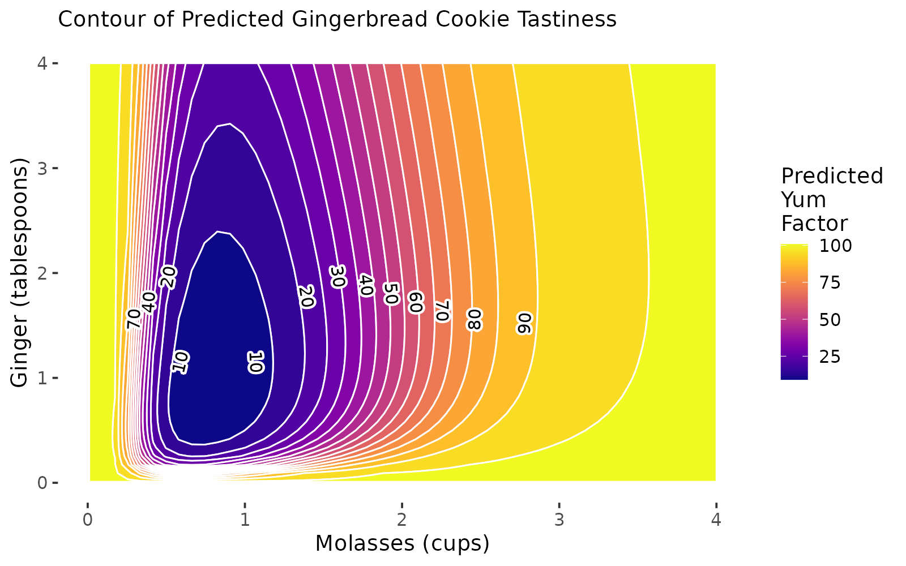

# Workshop: Response Surface Methodology in `R` {#workshop_15}

```{r setup_workshop_15, include =FALSE}
knitr::opts_chunk$set(cache = FALSE, message = FALSE, warning = FALSE)
library(tidyverse)
library(broom)
library(viridis)
library(rsm)
library(metR)
```

```{r, eval = FALSE, include = FALSE}
# Let's simulate a fake dataset
library(tidyverse)

# Ingredients for Ginger Bread Cookies
# https://tastesbetterfromscratch.com/gingerbread-cookies/
# First value is the normal
# Second value is the alternate
conditions = list(
  # Cups
  flour = c(3, 3.5, 4, 4.5), 
  sugar = c(0.75, 0.5, 1, 1.25), 
  molasses = c(0.75, 1, 0.5, 1.25), 
  butter = c(0.75, 1, 0.5, 1.25),
  # Tablespoons
  ginger = c(1, 2, 0.5, 1.5), 
  cinnamon = c(1, 2, 0.5, 1.5),
  milk = c(2, 2.5, 3, 1.5),
  # Teaspoons
  soda = c(0.75, 1, 1.25, 0.5),
  cloves = c(0.5, 0.75, 1, 0.25),
  salt = c(0.5, 0.75, 0.25, 1)
)

# Give me a matrix of all combos
# Write a function to build a 2^k factorial design

# Find me every unique combination of the following variables...

# Let's write a quick function to make as many of these designs as we want
get_data = function(data, base){
  # Grab the names of the vectors in the data.frame supplied
  vars = names(data)
  
  data %>%
    mutate(batch = 1:n()) %>%
    mutate(
      # Let's randomly assign some standard deviations of tastiness to each group
      sd = rnorm(n = n(), mean = 5, sd = 1) %>% round(1),
      # Let's assign some multipliers to different groups,
      # where the interaction of all three variabls will have the highest multipliers
      multiplier = rweibull(n = n(), shape = 6, scale = 1) %>% sort(),
      # Let's randomly generate some means mu, but multiply them by the multiplier
      mu = (rnorm(n = n(), mean = base, sd = sd) * multiplier) %>% round(1) ) %>%
    # Finally, let's generate our random data
    group_by(batch, across(.cols = vars)) %>%
    # For each group, get about 20 yum scores, each representing one cookie
    # where each sample size is allowed to vary ever so slightly according to a poisson distribution centered at 20
    # And the yum scores are drawn from a normal distribution matching a mean of mu and a sd of sd
    summarize(yum = rnorm(n = rpois(n = 20, lambda = base), mean = mu, sd = sd) %>% round(0),
              # Cap it at 0 and 100
              yum = if_else(yum < 0, 0, false = yum),
              yum = if_else(yum > 100, 100, yum)) %>%
    ungroup() %>%
    mutate(id = 1:n()) %>%
    select(id, batch, yum, vars) %>%
    # Block batch by day of week
#    group_by(batch) %>%
#    mutate(day = sample(x = c("Monday", "Tuesday", "Wednesday", "Thursday", "Friday"), size = n(), replace = TRUE)) %>%
#    ungroup() %>%
    # Randomly assign cookies to people
#    group_by(id) %>%
#    mutate(gender = sample(x = c("man", "woman"), size = n(), replace = TRUE))  %>%
#    mutate(age = sample(x = c(20, 30, 40, 50), size = n(), replace = TRUE)) %>%
    #mutate(likes = sample(x = c(1, 0), size = n(), replace = TRUE)) %>%
    return()
}

expand_grid(
  molasses = c(0.75, 1, 0.5, 1.25, 1.50, 1.75, 2.0, 2.25), 
  ginger = c(1, 2, 0.5, 1.5, 2.5, 3, 3.5, 4),
  cinnamon = c(1, 2, 0.5, 1.5),
  butter = c(0.75, 1, 1.25),
  flour = c(2.75, 3, 3.25)) %>%
  get_data(base = 20) %>%
  write_csv("workshops/gingerbread_test3.csv")


read_csv("workshops/gingerbread_test3.csv") %>%
  filter(cinnamon == 1,
         butter == 1,
         flour == 3) %>%
  filter(molasses %in% c(0.5, 0.75, 1, 1.25),
         ginger %in% c(0.5, 1, 1.5, 2)) %>%
  write_csv("workshops/gingerbread_test1.csv")

read_csv("workshops/gingerbread_test3.csv") %>%
  filter(cinnamon == 1,
         butter == 1,
         flour == 3) %>%
  write_csv("workshops/gingerbread_test2.csv")

rm(list = ls())
```


```{r, fig.cap="RSM Contour Plots!", echo = FALSE}

```

##  Getting Started {-}

Imagine: A team of enterprising Systems Engineering students have decided to start their own baking company, selling gingerbread cookies in the month of December in the greater Ithaca area! None of them are particularly good at baking, but they're rad good at design of experiments, so they set out to discover the ultimate gingerbread cookie through factorial design and our new tool, **response surface methodology!** Follow along below to see a **surprisingly accurate example** of how *you* can apply *RSM* to find the optimal design of your product (in this case, *gingerbread*!) 

<br>

###  Packages {-}

```{r, eval=  FALSE}
# Load packages!
library(tidyverse) # dplyr and ggplot!
library(broom) # glance() and tidy()!
library(viridis) # color palettes!
install.packages(c("rsm", "metR")) # you'll need to install these!
library(rsm) # for RSM
library(metR) # for contour plot labels in ggplot
```

<br>
<br>

```{r img_intro, fig.cap="Gingerbread Cookies!\nCourtesy of [Casey Chae @ Unsplash](https://unsplash.com/photos/3DrCZblTGoQ)", out.width="50%", echo = FALSE}

```

###  Our Data {-}

They know from past research that the amount of `molasses` and `ginger` in gingerbread cookies are likely significantly related to the overall tastiness (called the `yum` factor in our dataset). But, they're not sure **how much molasses** and **how much ginger** are needed. Molasses can be somewhat *expensive* too, compared to other ingredients; *so they want to optimize the amount of molasses necessary to produce the best cookies.*

So, holding all other conditions in the recipe constant, they ran a factorial experiment, making 16 batches of cookies (about 20 cookies per `batch`). 

- In their experiment, they tested 4 different amounts of `molasses`, including $\frac{1}{2}, \ \frac{3}{4}, \ 1,\  \& \ 1 \frac{1}{4}$ cups of `molasses`. 

- They also tested 4 different amounts of `ginger`, including $\frac{1}{2}, \ 1, \ 1 \frac{1}{2}, \ \& \ 2$ tablespoons of `ginger`. 

- Each batch was randomly assigned one of the 16 unique pairings of amounts of ginger and molasses; there are $4 \times 4 = 16$ unique ways to assign these ingredients, and they included them *all* to fully account for all the possibilities. 

- Then, they randomly handed out cookies to folks on campus in exchange for them briefly ranking the `yum` factor of that cookie on a scale from `0` (disgusting!) to `100` (delicious!).

<br>
<br>

###  Import Data {-}

They compiled their data in the following dataset. Read it in to help them analyze their data! This dataset includes the following variables:

- `id`: unique ID for each cookie (320 cookies!)

- `batch`: unique **group** ID for each batch of about 20 cookies.

**Outcome**

- `yum`: numeric scale measuring deliciousness of cookie, from `0` (disgusting) to `100` (delicious)

**Predictors**

- `molasses`: cups of `molasses` in batch: `0.75`, `1`, `1.25`, or `1.5` cups.

- `ginger`: tablespoons of `ginger` in batch: `0.5`, `1`, `1.5`, or `2` tablespoons.

**Fixed Conditions**

- `cinnamon`: 1 tablespoon

- `butter`: 1 cup

- `flour`: 3 cups

```{r}
# Import our data
cookies = read_csv("workshops/gingerbread_test1.csv")
# Check it out!
cookies %>% glimpse()
```


<br>
<br>

## Models for RSM

In our previous workshop, we learned to calculate the difference of means for any set of `group`s (in this case, `batch` of cookies). When we get **many** different levels in our `predictors` (eg. not just a treatment and control), we might prefer to use `lm()` to estimate a **linear model** of our outcome (`yum`), rather than computing the difference of means many times.

### Specifying an Interaction Model with Polynomials

However, we will see quickly that different specifications of our model may work better than others. We're going to try three different models that predict `yum` using cups of `molasses` and tablespoons of `ginger`, and we'll evaluate the $R^{2}$ of each (% of variation in outcome `yum` explained by model). These include:

1. **Basic First-Order Polynomial Model**, where:
  
$$ Yum = \alpha + \beta_{m} X_{m} + \beta_{g} X_{g} $$

  - $B_{m}$ is the effect of a 1 cup increase of Molasses.

  - $B_{g}$ is the effect of a 1 tablespoon increase of Ginger.

```{r}
m1 = cookies %>% 
  lm(formula = yum ~ molasses + ginger)
```

2. **Interaction Model**, where:

$$ Yum = \alpha + \beta_{m} X_{m} + \beta_{g} X_{g} + \beta_{mg} X_{m} X_{g} $$
  
  - $B_{mg}$ is the interaction effect as `molasses` increases by 1 cup **AND** `ginger` increases by 1 tablespoon.

```{r}
m2 = cookies %>% 
  lm(formula = yum ~ molasses * ginger)
# Also written manually as:
# yum ~ molasses + ginger + I(molasses * ginger)
```

3. **Second-Order Polynomial Model with Interaction**, where:

$$ Yum = \alpha + \beta_{m} X_{m} + \beta_{g} X_{g} + \beta_{mg} X_{m} X_{g} + \beta_{m^{2}} X_{m}^{2} + \beta_{g^{2}} X_{g}^{2} $$
  - $\beta{m^2} X_{m}^{2}$ is the effect as the square of `molasses` increases by 1. 

  - Together, $\beta_{m} X_{m}$ and $\beta_{m^2} X_{m}^{2}$ act as a polynomial term predicting `yum`.
  
```{r}
# Add a polynomial by to your existing interactions by using I(variable^2)
m3 = cookies %>% 
  lm(formula = yum ~ molasses * ginger + I(molasses^2) + I(ginger^2))
```

To review, this model equation can be viewed by just checking `m3$coefficients`. We can also write it out below; I've rounded to 2 decimal places for simplicity below.

```{r, echo = FALSE}
c2 = m3$coefficients %>% round(2)
```

$$ \hat{yum} = \hat{Y} = `r c2["(Intercept)"]` + `r c2["molasses"]` X_{m} + `r c2["I(molasses^2)"]` X_{m}^{2} + `r c2["ginger"]` X_{g} + `r c2["I(ginger^2)"]` X_{g}^{2} + `r c2["molasses:ginger"]` X_{m} X_{g} $$


Let's evaluate the `r.squared` of our three models below using the `glance()` function from the `broom` package, and bind together those data.frames into one using `bind_rows()` from `dplyr`. We see that the polynomial terms *dramatically* improve the predictive power of our model, jumping from $R^{2}$ = `r glance(m2)$r.squared %>% round(2)` to $R^{2}$ = `r glance(m3)$r.squared %>% round(2)`.

```{r}
bind_rows( glance(m1), glance(m2), glance(m3) )
```
Not really amazing quality model fit here - and that does happen! We can `tidy()` our model `m3` to confirm. 

The low `p.value` for many of our predictors tells us that our predictors *do* tend to have statistically significant relationships with the `yum` factor of our cookies. (Admittedly, `ginger`'s direct effect is not very significant - just ~75% confidence). But, it looks like other factors not currently in our model might *also* impact `yum` factor.

```{r}
m3 %>% tidy()
```


<br>
<br>

###  Modeling with `rsm()`

Finally, we can also write this model using the `rsm()` function in the `rsm` package. It works very similarly to `lm()`, but has some shortcut tricks built it. We'll use it more later in the workshop. For now, let's make some `rsm` model objects to match our `lm` model terms exactly.

Let's make a simple 'First-Order' polynomial model with `FO()`. That means just one term per predictor (eg. no $x^2$, just $x$). Our `r1` model will match our `m1` model.

```{r}
r1 = cookies %>%
  rsm(formula = yum ~ FO(molasses, ginger))
# Check it!
r1$coefficients
# This is the same as m1
r1$coefficients == m1$coefficients
```

Let's make a more complex 'Second-Order' polynomial model with `SO()`. That means just two terms per predictor (eg. $x$ *and* $x^2$), as well as an interaction effect (called `TWI()` for two-way interaction).

```{r}
# Let's make a 'Second-Order' model with SO()
r3 = cookies %>%
  rsm(formula = yum ~ SO(molasses, ginger))
# Check it!
r3$coefficients
# These coefficients match our m3$coefficients too.
# FO(...)molasses = molasses
# FO(...)ginger = ginger
# PQ(...)molasses^2 = I(molasses^2)
# PQ(...)ginger^2 = I(ginger^2)
# TWI = molasses:ginger
m3$coefficients
```

<br>
<br>

### Transforming Variables

By default, linear models estimate linear relationships between predictors and outcomes, but many relationship are indeed *not* linear! Here are 8 ways we might model associations!

```{r, echo = FALSE, fig.cap="8 Common x~y Modeling Strategies"}
library(ggtext)

logit = function(x){ log(x / (1 - x)) }

tibble(
  x = runif(n = 50, min = 0, max = 1) %>% sort(),
  z = runif(n = 50, min = 0, max = 1) %>% sort(),
  y1 = exp(x),
  y2 = log(x),
  y3 = logit(x),
  y4 = sqrt(x),
  y5 = x^(1/3),
  y6 = x^2,
  y7 = x^3,
  y8 = x
) %>%
  pivot_longer(cols = c(y1:y8), names_to = "type", values_to = "y") %>%
  mutate(type = type %>% recode_factor(
    "y8" = "Linear<br>y ~ x",
    "y1" = "Log of y<br>ln(y) ~ x or y ~ e<sup>x</sup>",
    "y2" = "Log of x<br>y ~ ln(x)",
    "y3" = "Logit of x<br>ln(<sup>x</sup>/<sub>1-x</sub>)",
    "y6" = "Squared<br>y ~ x<sup>2</sup>",
    "y7" = "Cubed<br>y ~ x<sup>3</sup>",
    "y4" = "Square Root<br> y ~ &radic;(x)",
    "y5" = "Cube Root<br> y ~ <sup>3</sup>&radic;(x)")) %>%
  ggplot(mapping = aes(x = x, y = y, color = type)) +
  geom_line(size = 2) +
  facet_wrap(~type, scales = "free_y", ncol = 4) +
  theme_classic(base_size = 14) +
  theme(strip.text.x = ggtext::element_markdown(),
        panel.border = element_rect(fill = NA, color = "black"),
        axis.line = element_blank(),
        plot.subtitle = element_text(hjust = 0.5)) +
  scale_x_continuous(labels = c("0", ".25", ".5", ".75", "1"))  +
  scale_color_viridis(option = "plasma", begin = 0, end = 0.8, discrete = TRUE,
                      guide = "none") +
  labs(subtitle = "8 Common x~y Modeling Strategies")
```

A `logit` function can sometimes help - that is designed for when a variable ranges between 0 and 1; we could write a classic logit as `logit = function(p){ log(p / (1 - p) ) }`. 

```{r}
# Write a custom logit function for data from 0 to 100
logit = function(p){ log( p / (1 - p) ) }

# Notice how it ONLY accepts our positive values greater than 0 and less than 1?
c(-1, 0, 0.1, 0.2, 0.5, 1, 2) %>% logit()
```

Let's try a few of these strategies for our `x` and `y` variables, and see if any of them improve our predictive power ($R^{2}$). *Spoiler alert*: In our data, they don't but in other datasets, they very well might! Always a good thing to check.

For example, we can try transforming the outcome variable, using a standard linear trend (business as usual), a log transformation, or a square root transformation.

```{r}
# Linear (normal)
cookies %>% 
  lm(formula = yum ~ molasses * ginger + I(molasses^2) + I(ginger^2)) %>%
  glance()
# R2 = 0.137

# Logged (add 1 since yum contains 0s)
cookies %>% 
  lm(formula = log(yum + 1) ~ molasses * ginger + I(molasses^2) + I(ginger^2)) %>%
  glance()
# R2 = 0.11 (Worse)

# Square Root
cookies %>% 
  lm(formula = sqrt(yum) ~ molasses * ginger + I(molasses^2) + I(ginger^2)) %>%
  glance()
# R2 = 0.125 (Worse)
```

Alternatively, we could try transforming the predictor variables, using a log-transformation.

```{r}
cookies %>% 
  lm(formula = yum ~ log(molasses) * log(ginger) + I(log(molasses)^2) + I(log(ginger)^2)) %>%
  glance()
```

It turns out that few of these transformations really dramatically change the predictive power of the model, so I'll stick with our original models `m3`/`r3` for the time being.

```{r, echo = FALSE, fig.cap="A poorly predicted Gingerbread Cookie\nPhoto by Noelle Otto"}
knitr::include_graphics("images/15_cookies_3.jpg")
```


<br>
<br>

---

## Learning Check 1 {.unnumbered #LC1}

**Question**
  
What happens when you (1) square $y$, (2) cube $y$, or (3) take the logit of $(y + 1) / 100$? Find the `r.squared` for each of these models.

<details><summary>**[View Answer!]**</summary>
  
Looks like a linear, business-as-usual modeling strategy for our outcome variable $y$ (`yum`) is best for this data.

```{r}
# Logit
cookies %>% 
  lm(formula = log( (yum + 1)/100 / (1 - (yum + 1)/100) ) ~ molasses * ginger + I(molasses^2) + I(ginger^2)) %>%
  glance()
# R2 = 0.115 (Worse)

# Squared
cookies %>% 
  lm(formula = I(yum^2) ~ molasses * ginger + I(molasses^2) + I(ginger^2)) %>%
  glance()
# R2 = 0.118 (Worse)

# Cubed
cookies %>% 
  lm(formula = I(yum^3) ~ molasses * ginger + I(molasses^2) + I(ginger^2)) %>%
  glance()
# R2 = 0.091 (Worse)
```

</details>
  
---

<br>
<br>


##  Contour Plots

So now that we have this model, what do we do with it? **Response Surface Methodology** refers to using statistical models to predict an outcome (a.k.a. **response** variable) given a series of varying conditions. This lets us predict and visualize the **full range/surface** for that outcome.

<br>

###  Simple `contour()` plots

The easiest way to think of this is in 3-dimensions, meaning 3 variables (1 outcome and 2 predictors). A regression model traditionally finds us the *plane* of best fit when looking at 3 dimensions, or the *hyperplane* of best fit when looking at +4 dimensions. However, when we use *polynomial terms* in our model equation, we can map that plane *almost perfectly* to our observed data, creating more of a *contour* or *topographical* surface than a *simple plane*.

We can use our model object `m3` or `r3` from above to generate a contour plot, predicting the `yum` factor (shown by color and lines) while we varying `~molasses + ginger` levels. We can add a heatmap by saying `image = TRUE`. Our model predicts that middling levels of ginger and molasses produce a kind of sad coldspot where the `yum` factor is about `11` (middle), but our model projects the `yum` factor will increase when you increase `ginger` and/or `molasses` from that center amount.

```{r}
contour(m3, ~molasses + ginger, image = TRUE)
```

That's beautiful - but a little unclear how it was produced! How could we make that plot ourselves in `ggplot`?

<br>

###  `geom_tile()` plots

However, we've learned this term that `ggplot` can give us greater flexibility when designing and communicating information, so how would we make this in `ggplot`?

It's really quick! We need to (1) make a grid of predictor values with `expand_grid()` to feed to `predict()`, (2) extract the predicted `yum` values (usually called `yhat`), and (3) then pipe the result to `ggplot`!

```{r}
# Let's check the range of our predictors... 
cookies$molasses %>% range()
cookies$ginger %>% range()
# Great! So we could vary our ingredient amounts from 0 to ~5 while still being realistic.
```
**Step 1**: We'll use `expand_grid()` to build a grid of molasses and ginger values, called `myx`, where `molasses` spans its observed range and `ginger` spans its own observed range.

```{r}
# Make the grid of conditions!
myx = expand_grid(
  molasses = seq(from = min(cookies$molasses), to = max(cookies$molasses), length.out = 50),
  ginger = seq(from = min(cookies$ginger), to = max(cookies$ginger), length.out = 50)
)

# Optionally, you could pick some arbitrary ranges, like 0 to 5
#myx = expand_grid(
#  molasses = seq(from = 0, to = 5, length.out = 50),
#  ginger = seq(from = 0, to = 3, length.out = 50)
#)

# Check it out!
myx %>% glimpse()
```

*Note*: You have to pick these values!! (eg. 0 to 5, 0 to 3, etc.) `contour()` uses the min and max of `molasses` and `ginger` each, but often, we want to make predictions slightly *beyond* our observed data. Just remember, a grid of 20 by 20 items produces 400 cells; 100 by 100 produces 10,000 cells; etc. Once you get above a few 1000, `ggplot` starts to slow down quickly.

**Step 2**: Next, we'll `mutate()` our `myx` data.frame to add a column `yhat`. In that column, we `predict()` the `yum` factor for those conditions based on our model `m3` (or `r3` - either work). As shown in previous workshops, we must give `predict()` a data.frame containing hypothetical values of each predictor in our model, called `newdata`. We'll save the result in a data.frame called `mypred`. 

```{r}
# Make predictions!
mypred = myx %>%
  mutate(yhat = predict(m3, newdata = tibble(molasses, ginger)))
# Check it out!
mypred %>% glimpse()
```
**Step 3**: Finally, we'll visualize it using `geom_tile()`, which maps a `fill` (`yhat`) to every `x` (`molasses`) and `y` (`ginger`) coordinate.

```{r}
# Voila!
g1 = ggplot() +
  geom_tile(data = mypred, mapping = aes(x = molasses, y = ginger, fill = yhat)) +
  scale_fill_viridis(option = "plasma") 

# View it!
g1
```

This matches the same pattern from our `contour()` plot, and was pretty painless!

<br>

###  Pretty `geom_contour()` plots!

But can we make this prettier and clearer for our reader? `ggplot` includes a `geom_contour()` function that will plot the contour outlines on top. A few requirements:

- In the `aes()`, `geom_contour()` requires you to make `x`, `y,` and `z` aesthetics, where `z` is the predicted value `yhat`. 

- You can set the number of `bins` (eg. `bins = 10` intervals) OR the `binwidth` (eg. `binwidth = 10`, where each interval is 10 units of `yhat` wide). [Just like with `cut_interval()`!]

```{r}
# Using bins....
# Add contour lines, where each line is 1 unit apart on the `yum` factor scale!
g1 +
  geom_contour(data = mypred, mapping = aes(x = molasses, y = ginger, z = yhat),
               color = "white", bins = 10)

# Using binwidth...
# Add contour lines, where each line is 1 unit apart on the `yum` factor scale!
g1 +
  geom_contour(data = mypred, mapping = aes(x = molasses, y = ginger, z = yhat),
               color = "white", binwidth = 1)
```

Alternatively, we could do this *all* in one fell swoop, using `geom_contour_fill()`, which combines `geom_tile()` and `geom_contour()` together. (*Note*: `geom_contour_filled()` is a *different* function. You want `_fill()`, not `_filled()`.)

```{r}
g2 = ggplot() +
  # Make a filled contour plot, with a binwidth of 1
  geom_contour_fill(data = mypred, mapping = aes(x = molasses, y = ginger, z = yhat),
                      binwidth = 1, color = "white") +
  scale_fill_viridis(option = "plasma")

# View it!
g2
```
Finally, some coding wizards out there developed some `ggplot` add-on functions in the `metR` package that will let us add nice labels to our contour plots, using `geom_label_contour()`. 

- We supply it the same information as `geom_contour_filled()`, including `x`, `y`, and `z` vectors 

- *Optional*: Tell it to `skip = 0` lines, labeling *every* contour line.

- *Optional*: Tell it to add a white border around our text with `stroke.color = "white"`, where that border is `stroke = 0.2` points wide.

- *Optional*: If you add `label.placer = label_placer_n(1)`, it will label each contour line `n = 1` time.

- All other rules of ggplot apply, eg. `size`, text `color`, and `alpha` transparency.

**Note**: you *must* have loaded the `metR` package for this to work.

```{r}
g2 +
  geom_text_contour(data = mypred, mapping = aes(x = molasses, y= ginger, z = yhat), 
                    skip = 0, stroke.color = "white", stroke = 0.2, label.placer = label_placer_n(1))
```
Beautiful!

<br>
<br>

###  One-step RSM in `ggplot`

Finally, let's practice doing this all in one code chunk in `ggplot`.

```{r}
# Make our predictors... - this time let's expand the range
mypred2 = expand_grid(
  molasses = seq(from = 0, to = 4, length.out = 50),
  ginger = seq(0, to = 4, length.out = 50)
) %>%
  mutate(yhat = predict(m3, newdata = tibble(molasses, ginger)))

mypred2 %>%
  # Set aesthetics
  ggplot(mapping = aes(x = molasses, y = ginger, z = yhat)) +
  # Make a filled contour with 15 bins
  geom_contour_fill(bins = 15, color = "white") +
  # Add labels
  geom_text_contour(skip = 0, stroke.color = "white", stroke = 0.2, label.placer = label_placer_n(1)) +
  # Add a beautiful plasma viridis palette
  scale_fill_viridis(option = "plasma") +
  # Add theming and labels
  theme_classic(base_size = 14) +
  theme(axis.line = element_blank()) + # get rid of axis line
  labs(x = "Molasses (cups)", y = "Ginger (tablespoons)", fill = "Predicted\nYum\nFactor",
       subtitle = "Contour of Predicted Gingerbread Cookie Tastiness")
```
Excellent! Our plot can serve as a visual diagnostic. Tentatively, our model results suggest that increasing `molasses` may lead to considerable gains in our outcome, with `ginger` contributing some impact early on. Notably, we see that though our actual outcome's measurement ranged from 0 to 100, our predictions might exceed those limits.


###  More Realistic Plots

Even though transformations don't improve our predictive accuracy, they might make our predictions more *realistic*. Let's try a few transformations.

- A `logit()` transformation could help with bounding `yum` to 0 and 1, if we scale down yum from 0-100 to 0-1. We'll have to add `+1` to the `yum` scale though, because some cookies got a score of zero, which can be logit-transformed.

- A `log()` transformation to `molasses` and `ginger` could help with bounding these conditions to only positive values, since we know we need at least a little of each, and we can't have 'negative ginger.'

```{r}
# Write a quick adjusted logit function
adj_logit = function(p){ 
  p = (p + 1) / 100  # adjust p from 0 - 100 to 0 - 1
  log(p / (1 - p)) # logit transformation
}

# Transform outcome and predictors
m4 = cookies %>% 
  lm(formula = adj_logit(yum) ~ log(molasses) * log(ginger) + I(log(molasses)^2) + I(log(ginger)^2))

# Get conditions and predictions
mypred3 = expand_grid(
  molasses = seq(from = 0.01, to = 4, length.out = 50),
  ginger = seq(0.01, to = 4, length.out = 50)
) %>%
  mutate(yhat = predict(m4, newdata = tibble(molasses, ginger)),
         # Undo the logit transformation!
         yhat = exp(yhat) / (1 + exp(yhat)),
         # Undo the (y + 1) / 100 transformation
         yhat = 100*yhat - 1)

# Visualize it!
g3 = mypred3 %>%
  ggplot(mapping = aes(x = molasses, y = ginger, z = yhat)) +
  geom_contour_fill(bins = 15, color = "white") +
  geom_text_contour(skip = 0, stroke.color = "white", stroke = 0.2, 
                    # Label each contour twice, but check_overlap deletes labels that overlap!
                    label.placer = label_placer_n(2), check_overlap = TRUE) +
  scale_fill_viridis(option = "plasma") +
  theme_classic(base_size = 14) +
  theme(axis.line = element_blank()) + # get rid of axis line
  labs(x = "Molasses (cups)", y = "Ginger (tablespoons)", fill = "Predicted\nYum\nFactor",
       subtitle = "Contour of Predicted Gingerbread Cookie Tastiness")

g3 
```

```{r, include = FALSE, eval = FALSE, echo = FALSE}
ggsave(g3, filename = "images/15_plot_2.png", dpi = 200, width = 8, height = 5)
```

Ta-da! Now we have much more reasonable predictions, even though we lost 2% predictive power. It's always a trade-off between predictive power and our ability to generate reasonable, useful quantities of interest. Ideally, let's get a much better $R^{2}$!

<br>
<br>


---

## Learning Check 2 {.unnumbered #LC2}

Suppose we expanded our factorial experiment based on this contour plot, adding more permutations of `molasses` and `ginger`, such that we now have `1280` cookies under test! We've saved this data in `workshops/gingerbread_test2.csv`. 

**Question**

Generate a second-order polynomial model like `m3` and visualize the contour plot in `ggplot`. How do our predictions change?

```{r}
cookies2 = read_csv("workshops/gingerbread_test2.csv")
```

<details><summary>**[View Answer!]**</summary>
  
```{r}
# Check the range
cookies$ginger %>% range()
cookies$molasses %>% range()
```

```{r}
# Write a quick adjusted logit function
adj_logit = function(p){ 
  p = (p + 1) / 100  # adjust p from 0 - 100 to 0 - 1
  log(p / (1 - p)) # logit transformation
}

# Transform outcome and predictors
m_lc = cookies2 %>% 
  lm(formula = adj_logit(yum) ~ log(molasses) * log(ginger) + I(log(molasses)^2) + I(log(ginger)^2))

# Check the R2 (still terrible! whoops!)
m_lc %>% glance()
```

```{r}
# Get conditions and predictions
mypred_lc = expand_grid(
  molasses = seq(from = 0.01, to = 4, length.out = 50),
  ginger = seq(0.01, to = 4, length.out = 50)
) %>%
  mutate(yhat = predict(m_lc, newdata = tibble(molasses, ginger)),
         # Undo the logit transformation!
         yhat = exp(yhat) / (1 + exp(yhat)),
         # Undo the (y + 1) / 100 transformation
         yhat = 100*yhat - 1)

# Visualize it!
g_lc = mypred_lc %>%
  ggplot(mapping = aes(x = molasses, y = ginger, z = yhat)) +
  geom_contour_fill(bins = 15, color = "white") +
  geom_text_contour(skip = 0, stroke.color = "white", stroke = 0.2, 
                    # Label each contour twice, but check_overlap deletes labels that overlap!
                    label.placer = label_placer_n(2), check_overlap = TRUE)

# Add good colors and theming!
g_lc +
  scale_fill_viridis(option = "plasma") +
  theme_classic(base_size = 14) +
  theme(axis.line = element_blank()) + # get rid of axis line
  labs(x = "Molasses (cups)", y = "Ginger (tablespoons)", fill = "Predicted\nYum\nFactor",
       subtitle = "Contour of Predicted Gingerbread Cookie Tastiness")
```

Our predictive power is still not quite that good. Ironically, our model (based on fake data) suggests that the best gingerbread cookies you can make should either have **very little molasses** OR **lots of molasses and ginger**, but the payoff for using very little molasses will be higher!

This plot demonstrates how even though your original model `m4` predicted really high payoff for adding more molasses, when we compare those predictions to updated model predictions based on new experiments, we might find that the new empirical data tempers our earlier predictions. 

**This is good news**. This probably means that our earlier predictions were *not very accurate*, and our extra experiments paid off by helping clarify. New results can be **suprising**, but are never a bad thing - because they get you closer to **truth**.

</details>
  
---

<br>
<br>

## Iterate!

Suppose now that we expanded our factorial experiment to vary the amount of `flour`, `butter`, and `cinnamon` too! We've saved this data in `workshops/gingerbread_test3.csv`. How would we model this data?

```{r}
cookies3 = read_csv("workshops/gingerbread_test3.csv")

cookies3 %>% glimpse()
```

### Modeling many Interactions

We can make a second-order polynomial for these 5 variables with `lm()` or `rsm()`, like so:

```{r}
# model using rsm()
r5 = cookies3 %>% 
  rsm(formula = yum ~ SO(molasses, ginger, cinnamon, butter, flour)) 

# model using lm()
m5 = cookies3 %>%
  lm(formula = yum ~ molasses * ginger * cinnamon * butter * flour +
       I(molasses^2) + I(ginger^2) + I(cinnamon^2) + I(butter^2) + I(flour^2))
```

```{r}
# Check out our coefficients! Wow that's a long list!
m5$coefficients %>% round(3)
```

```{r}
# Check predictive power (still pretty bad!)
m5 %>% glance()

# Check which variables are significant 
# (if some were not, we might cut them if we wanted to make as parsimonious a model as possible)
m5 %>% 
  tidy() %>%
  filter(p.value < 0.05)
```

<br>
<br>

###  Contours with Multiple Variables

Now, whenever we analyze contours, since we have more than 2 predictors, we need multiple plots.

For example, let's examine variation in `yum` as 3 predictions change simultaneously. These include `molasses`, `ginger`, **and** `cinnamon`. We can just write in `contour()` the formula `~molasses + ginger + cinnamon`. It will place molasses and ginger on the x and y axes, because they came first, and then report the values of `cinnamon`, `butter`, and `flour` for each panel. However, the mechanics of `contour()` can be tricky, and its tough to compare plots like these, since they are switching the x and y axis in every plot! But what if we could make our own in `ggplot`?

```{r}
# We can split it into 1 row and 3 columns using par(mfrow = c(1, 3))
par(mfrow = c(1,3))
# And plot the contous like so
contour(m5, ~molasses + ginger + cinnamon, image = TRUE)
```
<br>
<br>

###  `ggplot` contour plots!

This is the power of `ggplot` - since you have to work with the data yourself, you *actually know what your plots mean* and can design the plots most useful to your team.

For example, I would love to see 2 panels showing the contours of molasses x ginger when cinnamon = 0, cinnamon = 1, and cinnamon = 2 tablespoons. All other conditions would be held constant, allowing us to see how the contour changes shape. If we hold constant the other values though, we should hold them at **meaningful values**, like the **average** or perhaps a value you know to be sufficient.

```{r}
cookies3$cinnamon %>% range()
cookies3$butter %>% mean()

# Get a grid...
mygrid = expand_grid(
  molasses = seq(from = 0, to = 4, length.out = 30),
  ginger = seq(from = 0, to = 4, length.out = 30),
  # Now repeat that grid for each of these values of cinnamon!
  cinnamon = c(0, 1, 2),
  # Hold other constant at meaningful values 
  flour = cookies3$flour %>% mean(),
  butter = cookies3$butter %>% mean()) %>%
  # Then predict your outcome!
  mutate(yhat = predict(m5, newdata = tibble(molasses, ginger, cinnamon, flour, butter)))
```

Next, let's use our grid to visualize the contours in `ggplot`!

```{r}
# Let's check it out!
g4 = mygrid %>%
  # Map aesthetics
  ggplot(mapping = aes(x = molasses, y = ginger, z = yhat)) +
  # SPLIT INTO PANELS by amount of cinnamon!
  facet_wrap(~cinnamon) +
  geom_contour_fill(binwidth = 5, color = "white") +
  geom_text_contour(skip = 0, stroke.color = "white", stroke = 0.2, 
                    label.placer = label_placer_n(1), check_overlap = TRUE)
# View it!
g4
```

Finally, let's improve the labels, colors, and theming for this plot.

```{r}
g5 = g4 +
  theme_classic(base_size = 14) +
  theme(axis.line = element_blank(), # clean up the lines
        axis.ticks = element_blank(), # clean up the ticks
        strip.background = element_blank()) + # clean up the facet labels
  scale_fill_viridis(option = "plasma") +
  labs(x = "Molasses (cups)", y = "Ginger (tablespoons)", fill = "Predicted\nYum\nFactor",
       subtitle = "Predicted Gingerbread Cookie Tastiness\nby Tablespoons of Cinnamon")
# view it!
g5
```

```{r, echo = FALSE, eval = FALSE}
ggsave(g5, filename = "images/15_plot.png", dpi = 500, width = 8, height = 5)
```

What can we learn from this plot? 

- When we add more `cinnamon` (`2` tbsp; right), the zone in which cookies are truly bad (<15 points of `yum`) shrinks greatly (compared to `left` and `center` panels).

- Otherwise, `cinnamon` has fairly minimal interaction effects with `ginger` and `molasses` on `yum` scores.

<br>

## Learning Check 3 {.unnumbered #LC3}

Suppose we want to examine *other* interactions! Design your own `ggplot` to test how `butter` shapes the `yum` factor as `molasses` and `flour` vary. 

**Question**

Put molasses on the x-axis from 0 to 4 cups, flour on the y-axis from 0 to 4 cups, and vary the level of butter across panels from 0.75 to 1 to 1.25 cups. Hold other conditions at their mean values.

<details><summary>**[View Answer!]**</summary>

```{r}
# Make the grid!s
mygrid_lc3 = expand_grid(
  # Vary molasses and flour...
  molasses = seq(from = 0, to = 3, length.out = 30),
  flour = seq(from = 0, to = 3, length.out = 30),
  # Now repeat that grid for each of these values of butter!
  butter = c(0.75, 1, 1.25),
  # Hold other constant at meaningful values 
  ginger = cookies3$ginger %>% mean(),
  cinnamon = cookies3$cinnamon %>% mean()) %>%
  # Then predict your outcome!
  mutate(yhat = predict(m5, newdata = tibble(molasses, ginger, cinnamon, flour, butter))) 

# Visualize!
mygrid_lc3 %>%
  ggplot(mapping = aes(x = molasses, y = flour, z = yhat)) +
  # SPLIT INTO PANELS by amount of butter!
  facet_wrap(~butter) +
  geom_contour_fill(binwidth = 5, color = "white") +
  geom_text_contour(skip = 0, stroke.color = "white", stroke = 0.2, 
                    label.placer = label_placer_n(1), check_overlap = TRUE) +
  # Add theming!
  scale_fill_viridis(option = "plasma") + 
  theme_classic(base_size = 14) +
  theme(axis.line = element_blank(), # clean up the lines
        axis.ticks = element_blank(), # clean up the ticks
        strip.background = element_blank()) +
  labs(x = "Molasses (cups)", y = 'Flour (cups)', 
       fill = "Predicted\nYum\nFactor",
       subtitle = "Predicted Gingerbread Cookie Tastiness\nby Cups of Butter")
```

This plot tells us that adding more butter to the cookies tends to reduce the amount of the contour with low `yum` scores, and increases the relative share of the the response surface with scores of 15 or 20.

</details>
  
---

<br>
<br>

##  Quantities of Interest in RSM

Finally, we might be interested in calculating (and annotating our charts) with some key quantities of interest! Let's use our model `m5` from earlier and its `rsm` counterpart `r5`.

<br>

###  Percent Change in Bins

First, when comparing change across panels, we're essentially comparing change in *area*. So we can use our grid of conditions and predictions `mygrid` to calculate those percentages!

```{r}
area = mygrid %>% 
  # Cut the outcome into bins, 5 units wide on the yum scale
  mutate(bin = cut_interval(yhat, length = 5)) %>%
  # For each panel and bin, count up the predictions in that interval
  group_by(cinnamon, bin) %>%
  summarize(count = n()) %>%
  ungroup() %>%
  # Now, for each panel, calculate the percentage of predictions in that panel located in each bin
  group_by(cinnamon) %>%
  mutate(percent = count / sum(count),
         percent = round(percent*100, 2))

# Zoom into the lowest bin.
# What percentage of the area was in that bin given each level of cinnamon?
qi1 = area %>%
  filter(bin == "[10,15]")

qi1
```

We computed that the area predicted to score lowest on the `yum` scale (10-15) decreased from `r qi1$percent[1]` given 0 tablespoons of `cinnamon` to `r qi1$percent[2]` given 1 tablespoon and then to `r qi1$percent[3]` given 2 tablespoons of `cinnamon`.

<br>
<br>

###  Study Range

We might want our reader to know what is the area that we actually had data on, versus what was the area we were generating predictions from. For this, we can just draw a `box` from our raw data, using `summarize()` and `geom_rect()`. `geom_rect()` requires an `xmin`, `xmax`, `ymin`, and `ymax`. For example, since `molasses` is our `x` variable and `ginger` has been our `y` variable in our `ggplot` analyses, we can do the following:

```{r}
box = cookies3 %>%
  summarize(xmin = min(molasses), xmax = max(molasses),
            ymin = min(ginger), ymax = max(molasses))
# For example, we can start a new ggplot
ggplot() + 
  # Mapping the contour fill
  geom_contour_fill(data = mygrid, mapping = aes(x = molasses, y = ginger, z = yhat), color = 'white') +
  facet_wrap(~cinnamon) +
  # And then plotting a box overtop, with no fill
  geom_rect(data = box, mapping = aes(xmin = xmin, xmax = xmax, ymin = ymin, ymax = ymax),
            color = "white", linetype = 'dashed', fill = NA)
```

<br>
<br>


##  Extra Concepts of Interest: Canonical Form

The canonical form is an abbreviation of your long model equation into a much more understandable, short form. `rsm` will calculate the canonical form of your model equation for you, using `canonical()`. For example, if you have 2 predictors $X_{1}$ and $X_{2}$, the canonical form would look like:

$$ \hat{Y} = Y_{s} +  X_{1}^{2} + X_{2}^{2}$$

- where $Y_{s}$ is the value of $\hat{Y}$ at the **'stationary point'**, when $X_{1}$ and $X_{2}$ equal 0.

The tricky thing is that the **canonical form** is not actually in units of our original predictors, say, cups of `molasses` and tablespoons of `ginger`. Instead, the **canonical form** is like a standardized format that maps every value of cups of `molasses` (written $x_{1}$) to a new value $X_{1}$, which is a certain distance away from the **stationary point.**

Why would we have a system like this? It's because certain shapes of contour plots can be recognized from their canonical form alone, with no other detail, so the canonical form can be useful for us. It's a little more than we can go into at this moment, but suffice it to say that the **canonical form of a model is like a shortcut for interpreting the shape of a contour plot**.

###  Finding the Canonical Form

We can run the calculations for obtaining the canonical form using `canonical()` in `rsm`.

```{r}
canon = canonical(r5)
```

Inside this object are several great quantities of interest.

###  Canonical Form Coefficients

```{r}
# These coefficients can form the canonical form model equation
canon$eigen$values
```

###  Stationary Points

```{r}
# These are your stationary points.
canon$xs
```

###  Shift Points

```{r}
# These values can help you convert from x_1 (normal units) to X_1 (canonical form)
canon$eigen$vectors
```


In general, I find that the contour plots themselves tend to be the most effective tools for decision-making in most cases, but advanced applications can make great use of the canonical forms to identify key points after which increasing the amount of an ingredient will make no more difference.

<br>
<br>
<br>

# Conclusion {-}

Congratulations! You made it!

Thank you for your hard work this term. You have built up considerable prowess making probabilistic predictions, making statistical models, and visualizing and communicating your findings in `R`. We hope that this course has given you a firm grounding in key tools for building safer, more reliable technologies for our communities! We wish you all the best in your future work!

```{r, echo = FALSE, fig.cap="Courtesy of the Internet"}
knitr::include_graphics("https://i0.wp.com/terryspearbooks.blog/wp-content/uploads/2021/12/Corgi-Doghouse_DSC9285.jpg?ssl=1")
```

```{r, include = FALSE}
rm(list = ls())
```