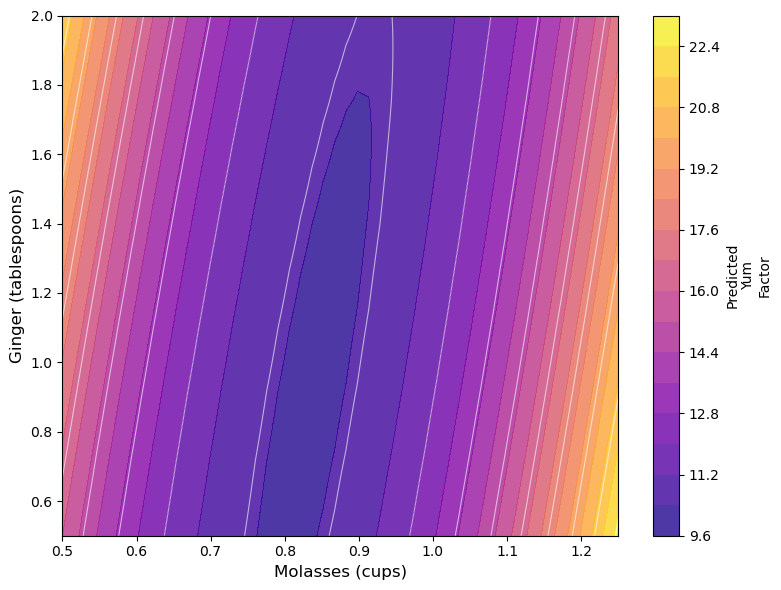
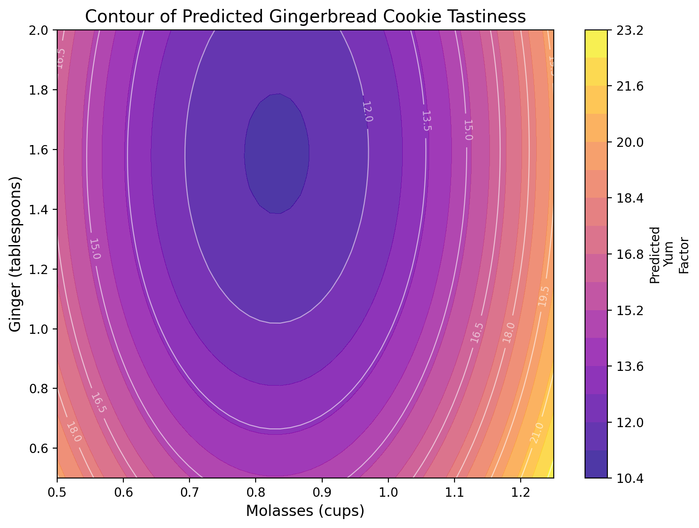
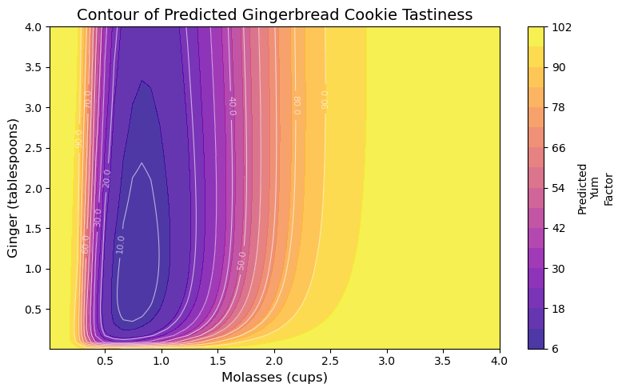

# Response Surface Methodology in `Python`

```{r setup_workshop_15_python, include = FALSE}
knitr::opts_chunk$set(cache = FALSE, message = FALSE, warning = FALSE)

# Fix graphics API version mismatch issues by avoiding ragg
knitr::opts_chunk$set(dev = "png")
library(knitr)
library(kableExtra)

## Configure reticulate to use existing Python
library(reticulate)

# Use your specific Python installation
# Try common Python paths (uncomment/modify for your system)
python_path <- NULL

# Try macOS common paths first
mac_paths <- c(
  "/opt/anaconda3/bin/python3",
  "/usr/local/bin/python3",
  "/opt/homebrew/bin/python3"
)

for (path in mac_paths) {
  if (file.exists(path)) {
    python_path <- path
    break
  }
}

# If no common path found, try system Python
if (is.null(python_path)) {
  system_python <- Sys.which("python3")
  if (system_python != "" && file.exists(system_python)) {
    python_path <- system_python
  }
}

# Configure Python if found, otherwise let reticulate auto-discover
if (!is.null(python_path) && file.exists(python_path)) {
  use_python(python_path, required = FALSE)
  Sys.setenv(RETICULATE_PYTHON = python_path)
  cat("Using Python at:", python_path, "\n")
} else {
  cat("No specific Python path found, letting reticulate auto-discover\n")
  # Don't set invalid paths - let reticulate handle it
}

# Prevent reticulate from downloading Python
options(reticulate.conda_binary = NULL)

# # Create folder to store the figures created by plotnine and matplotlib
# dir.create("plotnine_figures", showWarnings = FALSE)
# dir.create("matplotlib_figures", showWarnings = FALSE)
```

```{r, echo = FALSE}
knitr::include_graphics("images/15_plot_2.png")
```

##  Getting Started {-}

Imagine: A team of enterprising Systems Engineering students have decided to start their own baking company, selling gingerbread cookies in the month of December in the greater Ithaca area! None of them are particularly good at baking, but they're rad good at design of experiments, so they set out to discover the ultimate gingerbread cookie through factorial design and our new tool, **response surface methodology!** Follow along below to see a **surprisingly accurate example** of how *you* can apply *RSM* to find the optimal design of your product (in this case, *gingerbread*!) 

<br>

###  Packages {-}

Let's start by loading the necessary Python packages. We'll use `pandas` for data manipulation, `plotnine` for visualization (which follows the ggplot2 framework), `numpy` for numerical operations, and `statsmodels` for statistical modeling.

```{python}
# Load packages
import pandas as pd
import numpy as np
from plotnine import *
import matplotlib.cm as cm
import matplotlib.pyplot as plt
import os, sys

# Add the functions directory to Python path
sys.path.append(os.path.abspath('functions'))

# Import helper functions from functions_models.py
from functions_models import lm, tidy, glance

# Get plasma colormap for use in plots
plasma_cmap = cm.get_cmap('plasma')
```

<br>
<br>

```{r img_intro, fig.cap="Gingerbread Cookies!\nCourtesy of [Casey Chae @ Unsplash](https://unsplash.com/photos/3DrCZblTGoQ)", out.width="50%", echo = FALSE}
knitr::include_graphics("images/15_cookies_1.jpg")
```

###  Our Data {-}

They know from past research that the amount of `molasses` and `ginger` in gingerbread cookies are likely significantly related to the overall tastiness (called the `yum` factor in our dataset). But, they're not sure **how much molasses** and **how much ginger** are needed. Molasses can be somewhat *expensive* too, compared to other ingredients; *so they want to optimize the amount of molasses necessary to produce the best cookies.*

So, holding all other conditions in the recipe constant, they ran a factorial experiment, making 16 batches of cookies (about 20 cookies per `batch`). 

- In their experiment, they tested 4 different amounts of `molasses`, including $\frac{1}{2}, \ \frac{3}{4}, \ 1,\  \& \ 1 \frac{1}{4}$ cups of `molasses`. 

- They also tested 4 different amounts of `ginger`, including $\frac{1}{2}, \ 1, \ 1 \frac{1}{2}, \ \& \ 2$ tablespoons of `ginger`. 

- Each batch was randomly assigned one of the 16 unique pairings of amounts of ginger and molasses; there are $4 \times 4 = 16$ unique ways to assign these ingredients, and they included them *all* to fully account for all the possibilities. 

- Then, they randomly handed out cookies to folks on campus in exchange for them briefly ranking the `yum` factor of that cookie on a scale from `0` (disgusting!) to `100` (delicious!).

<br>
<br>

###  Import Data {-}

They compiled their data in the following dataset. Read it in to help them analyze their data! This dataset includes the following variables:

- `id`: unique ID for each cookie (320 cookies!)

- `batch`: unique **group** ID for each batch of about 20 cookies.

**Outcome**

- `yum`: numeric scale measuring deliciousness of cookie, from `0` (disgusting) to `100` (delicious)

**Predictors**

- `molasses`: cups of `molasses` in batch: `0.75`, `1`, `1.25`, or `1.5` cups.

- `ginger`: tablespoons of `ginger` in batch: `0.5`, `1`, `1.5`, or `2` tablespoons.

**Fixed Conditions**

- `cinnamon`: 1 tablespoon

- `butter`: 1 cup

- `flour`: 3 cups

```{python}
# Import our data
cookies = pd.read_csv("workshops/gingerbread_test1.csv")
# Check it out!
cookies.head()
```

<br>
<br>

## Models for RSM

In our previous workshop, we learned to calculate the difference of means for any set of `group`s (in this case, `batch` of cookies). When we get **many** different levels in our `predictors` (eg. not just a treatment and control), we might prefer to use `lm()` to estimate a **linear model** of our outcome (`yum`), rather than computing the difference of means many times.

### Specifying an Interaction Model with Polynomials

However, we will see quickly that different specifications of our model may work better than others. We're going to try three different models that predict `yum` using cups of `molasses` and tablespoons of `ginger`, and we'll evaluate the $R^{2}$ of each (% of variation in outcome `yum` explained by model). These include:

1. **Basic First-Order Polynomial Model**, where:
  
$$ Yum = \alpha + \beta_{m} X_{m} + \beta_{g} X_{g} $$

  - $B_{m}$ is the effect of a 1 cup increase of Molasses.

  - $B_{g}$ is the effect of a 1 tablespoon increase of Ginger.

```{python}
m1 = lm(formula = 'yum ~ molasses + ginger', data = cookies)
```

2. **Interaction Model**, where:

$$ Yum = \alpha + \beta_{m} X_{m} + \beta_{g} X_{g} + \beta_{mg} X_{m} X_{g} $$
  
  - $B_{mg}$ is the interaction effect as `molasses` increases by 1 cup **AND** `ginger` increases by 1 tablespoon.

```{python}
m2 = lm(formula = 'yum ~ molasses * ginger', data = cookies)
# Also written manually as:
# yum ~ molasses + ginger + molasses:ginger
```

3. **Second-Order Polynomial Model with Interaction**, where:

$$ Yum = \alpha + \beta_{m} X_{m} + \beta_{g} X_{g} + \beta_{mg} X_{m} X_{g} + \beta_{m^{2}} X_{m}^{2} + \beta_{g^{2}} X_{g}^{2} $$
  - $\beta{m^2} X_{m}^{2}$ is the effect as the square of `molasses` increases by 1. 

  - Together, $\beta_{m} X_{m}$ and $\beta_{m^2} X_{m}^{2}$ act as a polynomial term predicting `yum`.
  
```{python}
# Add polynomial terms using I() in the formula (matching R syntax)
m3 = lm(formula = 'yum ~ molasses * ginger + I(molasses**2) + I(ginger**2)', data = cookies)
```

To review, this model equation can be viewed by just checking the coefficients. We can also write it out below; I've rounded to 2 decimal places for simplicity.

```{python}
# Get coefficients rounded to 2 decimal places
m3.params.round(2)
```

The model equation is:

$$ \hat{yum} = \hat{Y} = \alpha + \beta_{m} X_{m} + \beta_{m^{2}} X_{m}^{2} + \beta_{g} X_{g} + \beta_{g^{2}} X_{g}^{2} + \beta_{mg} X_{m} X_{g} $$

Let's evaluate the $R^{2}$ of our three models below using the `glance()` function from our helper functions in `functions/functions_models.py`, and combine those DataFrames into one using `pd.concat()`. We see that the polynomial terms *dramatically* improve the predictive power of our model.

```{python}
# Get model summaries
g1 = glance(m1)
g2 = glance(m2)
g3 = glance(m3)

# Combine them
model_comparison = pd.concat([g1, g2, g3], ignore_index=True)
model_comparison.insert(0, 'model', ['m1', 'm2', 'm3'])
model_comparison
```

Not really amazing quality model fit here - and that does happen! We can `tidy()` our model `m3` to confirm. 

The low `p_value` for many of our predictors tells us that our predictors *do* tend to have statistically significant relationships with the `yum` factor of our cookies. (Admittedly, `ginger`'s direct effect is not very significant - just ~75% confidence). But, it looks like other factors not currently in our model might *also* impact `yum` factor.

```{python}
m3_tidy = round(tidy(m3), 2)
print(m3_tidy.to_string())
```

<br>
<br>

###  Modeling with `lm()`

R's `rsm()` package has no direct Python equivalent. However, we can achieve the same results by manually specifying polynomial terms in our `lm()` formulas, as we did above.

Let's make a simple 'First-Order' polynomial: `yum ~ molasses + ginger` ('m1' from above!)

```{python}
l1 = lm(formula = 'yum ~ molasses + ginger', data = cookies)
print(l1.params)
# See if it's the same as m1
print(l1.params == m1.params)
```

Let's make a more complex 'Second-Order' polynomial model: `yum ~ molasses * ginger + I(molasses**2) + I(ginger**2)` (which we did as `m3`)
```{python}
l3 = lm(formula = 'yum ~ molasses * ginger + I(molasses**2) + I(ginger**2)', data = cookies)
print(l3.params)
# See if it's the same as m1
print(l3.params == m3.params)
```

<br>
<br>

### Transforming Variables

By default, linear models estimate linear relationships between predictors and outcomes, but many relationships are indeed *not* linear! Here are 8 ways we might model associations!

```{r, echo = FALSE}
library(ggtext)
library(ggplot2)

logit = function(x){ log(x / (1 - x)) }

tibble(
  x = runif(n = 50, min = 0, max = 1) %>% sort(),
  z = runif(n = 50, min = 0, max = 1) %>% sort(),
  y1 = exp(x),
  y2 = log(x),
  y3 = logit(x),
  y4 = sqrt(x),
  y5 = x^(1/3),
  y6 = x^2,
  y7 = x^3,
  y8 = x
) %>%
  pivot_longer(cols = c(y1:y8), names_to = "type", values_to = "y") %>%
  mutate(type = type %>% recode_factor(
    "y8" = "Linear<br>y ~ x",
    "y1" = "Log of y<br>ln(y) ~ x or y ~ e<sup>x</sup>",
    "y2" = "Log of x<br>y ~ ln(x)",
    "y3" = "Logit of x<br>ln(<sup>x</sup>/<sub>1-x</sub>)",
    "y6" = "Squared<br>y ~ x<sup>2</sup>",
    "y7" = "Cubed<br>y ~ x<sup>3</sup>",
    "y4" = "Square Root<br> y ~ &radic;(x)",
    "y5" = "Cube Root<br> y ~ <sup>3</sup>&radic;(x)")) %>%
  ggplot(mapping = aes(x = x, y = y, color = type)) +
  geom_line(size = 2) +
  facet_wrap(~type, scales = "free_y", ncol = 4) +
  theme_classic(base_size = 14) +
  theme(strip.text.x = ggtext::element_markdown(),
        panel.border = element_rect(fill = NA, color = "black"),
        axis.line = element_blank(),
        plot.subtitle = element_text(hjust = 0.5)) +
  scale_x_continuous(labels = c("0", ".25", ".5", ".75", "1"))  +
  scale_color_viridis(option = "plasma", begin = 0, end = 0.8, discrete = TRUE,
                      guide = "none") +
  labs(subtitle = "8 Common x~y Modeling Strategies")
```

A `logit` function can sometimes help - that is designed for when a variable ranges between 0 and 1; we could write a classic logit as `logit = lambda p: np.log(p / (1 - p))`. 

```{python}
# Write a custom logit function for data from 0 to 100
def logit(p):
    return np.log(p / (1 - p))

# Notice how it ONLY accepts our positive values greater than 0 and less than 1
test_vals = [-1, 0, 0.1, 0.2, 0.5, 1, 2]
result = [logit(val) if 0 < val < 1 else np.nan for val in test_vals]
print(result)
```

Let's try a few of these strategies for our `x` and `y` variables, and see if any of them improve our predictive power ($R^{2}$). *Spoiler alert*: In our data, they don't but in other datasets, they very well might! Always a good thing to check.

For example, we can try transforming the outcome variable, using a standard linear trend (business as usual), a log transformation, or a square root transformation.

```{python}
# Linear (normal)
m_linear = lm(formula = 'yum ~ molasses * ginger + I(molasses**2) + I(ginger**2)', data = cookies)
g_linear = glance(m_linear)
R2_linear = g_linear['rsq'].values[0]
print(f"R2: {R2_linear:.3f}")
```

```{python}
# Logged (add 1 since yum contains 0s)
cookies_log = cookies.copy()
cookies_log['log_yum'] = np.log(cookies_log['yum'] + 1)
m_log = lm(formula = 'log_yum ~ molasses * ginger + I(molasses**2) + I(ginger**2)', data = cookies_log)
g_log = glance(m_log)
R2_log = g_log['rsq'].values[0]
print(f"R2 (logged): {R2_log:.3f} ({'Worse' if R2_log < R2_linear else 'Better'})")
```

```{python}
# Square Root
cookies_sqrt = cookies.copy()
cookies_sqrt['sqrt_yum'] = np.sqrt(cookies_sqrt['yum'])
m_sqrt = lm(formula = 'sqrt_yum ~ molasses * ginger + I(molasses**2) + I(ginger**2)', data = cookies_sqrt)
g_sqrt = glance(m_sqrt)
R2_sqrt = g_sqrt['rsq'].values[0]
print(f"R2 (square root): {R2_sqrt:.3f} ({'Worse' if R2_sqrt < R2_linear else 'Better'})")
```

Alternatively, we could try transforming the predictor variables, using a log-transformation.

```{python}
cookies['log_molasses'] = np.log(cookies['molasses'])
cookies['log_ginger'] = np.log(cookies['ginger'])
cookies['log_molasses_sq'] = cookies['log_molasses'] ** 2
cookies['log_ginger_sq'] = cookies['log_ginger'] ** 2

m_log_pred = lm(formula = 'yum ~ log_molasses * log_ginger + log_molasses_sq + log_ginger_sq', data = cookies)
glance(m_log_pred)
```

It turns out that few of these transformations really dramatically change the predictive power of the model, so I'll stick with our original models `m3` for the time being.

```{r, echo = FALSE, fig.cap="A poorly predicted Gingerbread Cookie Photo by Noelle Otto"}
knitr::include_graphics("images/15_cookies_3.jpg")
```

<br>
<br>

---

## Learning Check 1 {.unnumbered .LC}

**Question**
  
What happens when you (1) square $y$, (2) cube $y$, or (3) take the logit of $(y + 1) / 100$? Find the $R^{2}$ for each of these models.

<details><summary>**[View Answer!]**</summary>
  
Looks like a linear, business-as-usual modeling strategy for our outcome variable $y$ (`yum`) is best for this data.

```{python}
# Logit transformation
cookies_logit = cookies.copy()
cookies_logit['yum_scaled'] = (cookies_logit['yum'] + 1) / 100
cookies_logit['logit_yum'] = np.log(cookies_logit['yum_scaled'] / (1 - cookies_logit['yum_scaled']))
m_logit = lm(formula = 'logit_yum ~ molasses * ginger + I(molasses**2) + I(ginger**2)', data = cookies_logit)
g_logit = glance(m_logit)
R2_logit = g_logit['rsq'].values[0]
print(f"R2 (logit): {R2_logit:.3f} ({'Worse' if R2_logit < R2_linear else 'Better'})")
```

```{python}
# Squared
cookies_sq = cookies.copy()
cookies_sq['yum_sq'] = cookies_sq['yum'] ** 2
m_sq = lm(formula = 'yum_sq ~ molasses * ginger + I(molasses**2) + I(ginger**2)', data = cookies_sq)
g_sq = glance(m_sq)
R2_sq = g_sq['rsq'].values[0]
print(f"R2 (squared): {R2_sq:.3f} ({'Worse' if R2_sq < R2_linear else 'Better'})")
```

```{python}
# Cubed
cookies_cubed = cookies.copy()
cookies_cubed['yum_cubed'] = cookies_cubed['yum'] ** 3
m_cubed = lm(formula = 'yum_cubed ~ molasses * ginger + I(molasses**2) + I(ginger**2)', data = cookies_cubed)
g_cubed = glance(m_cubed)
R2_cubed = g_cubed['rsq'].values[0]
print(f"R2 (cubed): {R2_cubed:.3f} ({'Worse' if R2_cubed < R2_linear else 'Better'})")
```

</details>
  
---

<br>
<br>


##  Contour Plots

So now that we have this model, what do we do with it? **Response Surface Methodology** refers to using statistical models to predict an outcome (a.k.a. **response** variable) given a series of varying conditions. This lets us predict and visualize the **full range/surface** for that outcome.

<br>

###  Simple `contour()` plots

The easiest way to think of this is in 3-dimensions, meaning 3 variables (1 outcome and 2 predictors). A regression model traditionally finds us the *plane* of best fit when looking at 3 dimensions, or the *hyperplane* of best fit when looking at +4 dimensions. However, when we use *polynomial terms* in our model equation, we can map that plane *almost perfectly* to our observed data, creating more of a *contour* or *topographical* surface than a *simple plane*.

We can use our model object `m3` from above to generate a contour-like plot, predicting the `yum` factor (shown by color) while we vary `molasses` and `ginger` levels. Our model predicts that middling levels of ginger and molasses produce a kind of sad coldspot where the `yum` factor is about `11` (middle), but our model projects the `yum` factor will increase when you increase `ginger` and/or `molasses` from that center amount.

```{python include=FALSE}
# Quick demonstration: Create a grid and predict
from itertools import product

# Create a quick grid
molasses_demo = np.linspace(cookies['molasses'].min(), cookies['molasses'].max(), 50)
ginger_demo = np.linspace(cookies['ginger'].min(), cookies['ginger'].max(), 50)
myx_demo = pd.DataFrame(list(product(molasses_demo, ginger_demo)), 
                         columns=['molasses', 'ginger'])

# Make predictions (patsy will automatically evaluate I(molasses**2) and I(ginger**2) from the formula)
mypred_demo = myx_demo.copy()
mypred_demo['yhat'] = m3.predict(mypred_demo)

# Reshape data for matplotlib contour plotting
molasses_unique = sorted(mypred_demo['molasses'].unique())
ginger_unique = sorted(mypred_demo['ginger'].unique())
M_demo, G_demo = np.meshgrid(molasses_unique, ginger_unique)
yhat_grid_demo = mypred_demo.pivot_table(values='yhat', index='ginger', columns='molasses', aggfunc='mean').values

# Create the contour plot with matplotlib
fig_demo, ax_demo = plt.subplots(figsize=(8, 6))
contour_filled_demo = ax_demo.contourf(M_demo, G_demo, yhat_grid_demo, levels=15, cmap='plasma', alpha=0.8)
contour_lines_demo = ax_demo.contour(M_demo, G_demo, yhat_grid_demo, levels=10, colors='white', linewidths=0.8, alpha=0.6)
ax_demo.set_xlabel('Molasses (cups)', fontsize=12)
ax_demo.set_ylabel('Ginger (tablespoons)', fontsize=12)
cbar_demo = plt.colorbar(contour_filled_demo, ax=ax_demo)
cbar_demo.set_label('Predicted\nYum\nFactor', fontsize=10)
plt.tight_layout()
plt.savefig("matplotlib_figures/15_contour_demo.png", dpi=100, bbox_inches='tight')
plt.close(fig_demo)
```

```{r, echo=FALSE, out.width="100%"}

```

That's beautiful - but a little unclear how it was produced! How could we make that plot ourselves?

<br>

###  Simple contour plots with `plotnine`

We can create contour plots using `plotnine` (which follows the `ggplot2` framework). It's really quick! We need to (1) make a grid of predictor values to feed to `predict()`, (2) extract the predicted `yum` values (usually called `yhat`), and (3) then visualize the result with `plotnine`!

```{python}
# Let's check the range of our predictors... 
print(cookies['molasses'].min(), cookies['molasses'].max())
```

```{python}
print(cookies['ginger'].min(), cookies['ginger'].max())
```

```{python}
# Great! So we could vary our ingredient amounts from 0 to ~5 while still being realistic.
```

**Step 1**: We'll create a grid of molasses and ginger values, called `myx`, where `molasses` spans its observed range and `ginger` spans its own observed range.

```{python}
# Make the grid of conditions!
from itertools import product

molasses_seq = np.linspace(cookies['molasses'].min(), cookies['molasses'].max(), 50)
ginger_seq = np.linspace(cookies['ginger'].min(), cookies['ginger'].max(), 50)

# Create all combinations
myx = pd.DataFrame(list(product(molasses_seq, ginger_seq)), 
                    columns=['molasses', 'ginger'])

# Optionally, you could pick some arbitrary ranges, like 0 to 5
# molasses_seq = np.linspace(0, 5, 50)
# ginger_seq = np.linspace(0, 3, 50)

# Check it out!
myx.head()
```

*Note*: You have to pick these values!! (eg. 0 to 5, 0 to 3, etc.) We want to make predictions slightly *beyond* our observed data. Just remember, a grid of 20 by 20 items produces 400 cells; 100 by 100 produces 10,000 cells; etc. Once you get above a few 1000, plotting may start to slow down quickly.

**Step 2**: Next, we'll add a column `yhat` to our `myx` DataFrame. In that column, we `predict()` the `yum` factor for those conditions based on our model `m3`. We must give `predict()` a DataFrame containing hypothetical values of each predictor in our model, called `new_data`. We'll save the result in a DataFrame called `mypred`. 

```{python}
# Make predictions!
# patsy will automatically evaluate I(molasses**2) and I(ginger**2) from the model formula
mypred = myx.copy()
mypred['yhat'] = m3.predict(mypred)

# Check it out!
mypred.head()
```

**Step 3**: Finally, we'll visualize it using `plotnine`'s `geom_tile()` to create a simple heatmap-style contour plot.

```{python}
# Create a simple tile plot with plotnine
g = (ggplot(mypred, aes(x='molasses', y='ginger', fill='yhat')) +
      geom_tile() +
      scale_fill_cmap(cmap_name='plasma') +
      theme_classic(base_size=14) +
      labs(x='Molasses (cups)', y='Ginger (tablespoons)', 
           fill='Predicted\nYum\nFactor',
           subtitle='Contour of Predicted Gingerbread Cookie Tastiness'))
# Save the plot for display
ggsave(g, filename="plotnine_figures/15_contour_tile.png", dpi=100, width=8, height=6)
```

```{r, echo=FALSE, out.width="100%"}
knitr::include_graphics("plotnine_figures/15_contour_tile.png")
```

This creates a simple heatmap-style visualization that's easy to understand!

<br>
<br>

###  More detailed contour plots with `matplotlib`

But can we make this prettier and clearer for our reader? `matplotlib` can give us greater flexibility when designing and communicating information. We can create more detailed contour plots with filled contours, contour lines, and labels that make it easier to read specific values. Let's see how to do this with `matplotlib`:

**Step 1**: We'll use the same grid `myx` and predictions `mypred` from above.

**Step 2**: We need to reshape the data for matplotlib's contour plotting functions, which require data in a specific grid format.

```{python}
# Reshape data for matplotlib contour plotting
# Get unique molasses values and sort them for consistent ordering
molasses_unique = sorted(mypred['molasses'].unique())
# Get unique ginger values and sort them for consistent ordering
ginger_unique = sorted(mypred['ginger'].unique())
# Create coordinate grids from the unique values (needed for contour plotting)
M, G = np.meshgrid(molasses_unique, ginger_unique)
# Reshape predictions into a 2D grid matching the coordinate grids
yhat_grid = mypred.pivot_table(values='yhat', index='ginger', columns='molasses', aggfunc='mean').values
```

**Step 3**: Now we'll create a more detailed contour plot with filled contours, contour lines, and labels.

```{python}
# Create the contour plot with matplotlib
# Initialize a figure and axes with specified size (8 inches wide, 6 inches tall)
fig, ax = plt.subplots(figsize=(8, 6))
# Create filled contour plot with 15 levels using the 'plasma' colormap, 80% opacity
contour_filled = ax.contourf(M, G, yhat_grid, levels=15, cmap='plasma', alpha=0.8)
# Add contour line overlays with 10 levels in white, 60% opacity
contour_lines = ax.contour(M, G, yhat_grid, levels=10, colors='white', linewidths=0.8, alpha=0.6)
# Add labels to the contour lines, formatted to 1 decimal place
ax.clabel(contour_lines, inline=True, fontsize=8, fmt='%1.1f')
# Set the x-axis label
ax.set_xlabel('Molasses (cups)', fontsize=12)
# Set the y-axis label
ax.set_ylabel('Ginger (tablespoons)', fontsize=12)
# Add a colorbar to show the scale of predicted values
cbar = plt.colorbar(contour_filled, ax=ax)
# Set the colorbar label with line breaks
cbar.set_label('Predicted\nYum\nFactor', fontsize=10)
# Adjust layout to prevent label cutoff
plt.tight_layout()

# Save the figure
plt.savefig("matplotlib_figures/15_contour_with_lines.png", dpi=100, bbox_inches='tight')
plt.close(fig)
```

```{r, echo=FALSE, out.width="100%"}

```

This creates a more detailed visualization with contour lines and labels that make it easier to read specific values!

Beautiful!

<br>
<br>

###  One-step RSM in `matplotlib`

Finally, let's practice doing this in one code chunk in `matplotlib`.

```{python}
# Create sequences of predictor values (expanding beyond observed range)
molasses_seq2 = np.linspace(0, 4, 50)
ginger_seq2 = np.linspace(0, 4, 50)

# Create grid of all combinations (50 × 50 = 2,500 rows)
mypred2 = pd.DataFrame(list(product(molasses_seq2, ginger_seq2)), 
                       columns=['molasses', 'ginger'])
# Generate predictions using our fitted model (patsy will automatically evaluate I() terms)
mypred2['yhat'] = m3.predict(mypred2)

# Reshape data for matplotlib contour plotting
molasses_unique2 = sorted(mypred2['molasses'].unique())
ginger_unique2 = sorted(mypred2['ginger'].unique())
M2, G2 = np.meshgrid(molasses_unique2, ginger_unique2)
yhat_grid2 = mypred2.pivot_table(values='yhat', index='ginger', columns='molasses', aggfunc='mean').values

# Create the visualization with matplotlib
fig2, ax2 = plt.subplots(figsize=(8, 6))
contour_filled2 = ax2.contourf(M2, G2, yhat_grid2, levels=15, cmap='plasma', alpha=0.8)
contour_lines2 = ax2.contour(M2, G2, yhat_grid2, levels=10, colors='white', linewidths=0.8, alpha=0.6)
ax2.clabel(contour_lines2, inline=True, fontsize=8, fmt='%1.1f')
ax2.set_xlabel('Molasses (cups)', fontsize=12)
ax2.set_ylabel('Ginger (tablespoons)', fontsize=12)
ax2.set_title('Contour of Predicted Gingerbread Cookie Tastiness', fontsize=14)
cbar2 = plt.colorbar(contour_filled2, ax=ax2)
cbar2.set_label('Predicted\nYum\nFactor', fontsize=10)
plt.tight_layout()
# Save the plot
plt.savefig("matplotlib_figures/15_contour_onestep.png", dpi=100, bbox_inches='tight')
plt.close(fig2)
```

```{r, echo=FALSE, out.width="100%", fig.cap="One-step RSM contour plot"}
knitr::include_graphics("matplotlib_figures/15_contour_onestep.png")
```

Excellent! Our plot can serve as a visual diagnostic. Tentatively, our model results suggest that increasing `molasses` may lead to considerable gains in our outcome, with `ginger` contributing some impact early on. Notably, we see that though our actual outcome's measurement ranged from 0 to 100, our predictions might exceed those limits.


###  More Realistic Plots

Even though transformations don't improve our predictive accuracy, they might make our predictions more *realistic*. Let's try a few transformations.

- A `logit()` transformation could help with bounding `yum` to 0 and 1, if we scale down yum from 0-100 to 0-1. We'll have to add `+1` to the `yum` scale though, because some cookies got a score of zero, which can be logit-transformed.

- A `log()` transformation to `molasses` and `ginger` could help with bounding these conditions to only positive values, since we know we need at least a little of each, and we can't have 'negative ginger.'

```{python}
# Write a quick adjusted logit function
def adj_logit(p):
    p = (p + 1) / 100  # adjust p from 0 - 100 to 0 - 1
    return np.log(p / (1 - p))  # logit transformation

# Transform outcome and predictors
cookies['adj_logit_yum'] = adj_logit(cookies['yum'])
cookies['log_molasses'] = np.log(cookies['molasses'])
cookies['log_ginger'] = np.log(cookies['ginger'])
cookies['log_molasses_sq'] = cookies['log_molasses'] ** 2
cookies['log_ginger_sq'] = cookies['log_ginger'] ** 2

m4 = lm(formula = 'adj_logit_yum ~ log_molasses * log_ginger + log_molasses_sq + log_ginger_sq', 
        data = cookies)

# Get conditions and predictions
molasses_seq3 = np.linspace(0.01, 4, 50)
ginger_seq3 = np.linspace(0.01, 4, 50)

mypred3 = pd.DataFrame(list(product(molasses_seq3, ginger_seq3)), 
                       columns=['molasses', 'ginger'])
mypred3['log_molasses'] = np.log(mypred3['molasses'])
mypred3['log_ginger'] = np.log(mypred3['ginger'])
mypred3['log_molasses_sq'] = mypred3['log_molasses'] ** 2
mypred3['log_ginger_sq'] = mypred3['log_ginger'] ** 2

# Predict on log scale
mypred3['yhat_logit'] = m4.predict(mypred3)

# Undo the logit transformation!
mypred3['yhat'] = np.exp(mypred3['yhat_logit']) / (1 + np.exp(mypred3['yhat_logit']))
# Undo the (y + 1) / 100 transformation
mypred3['yhat'] = 100 * mypred3['yhat'] - 1

# Reshape data for matplotlib contour plotting
molasses_unique3 = sorted(mypred3['molasses'].unique())
ginger_unique3 = sorted(mypred3['ginger'].unique())
M3, G3 = np.meshgrid(molasses_unique3, ginger_unique3)
yhat_grid3 = mypred3.pivot_table(values='yhat', index='ginger', columns='molasses', aggfunc='mean').values

# Visualize it with matplotlib!
fig3, ax3 = plt.subplots(figsize=(8, 5))
contour_filled3 = ax3.contourf(M3, G3, yhat_grid3, levels=15, cmap='plasma', alpha=0.8)
contour_lines3 = ax3.contour(M3, G3, yhat_grid3, levels=10, colors='white', linewidths=0.8, alpha=0.6)
ax3.clabel(contour_lines3, inline=True, fontsize=8, fmt='%1.1f')
ax3.set_xlabel('Molasses (cups)', fontsize=12)
ax3.set_ylabel('Ginger (tablespoons)', fontsize=12)
ax3.set_title('Contour of Predicted Gingerbread Cookie Tastiness', fontsize=14)
cbar3 = plt.colorbar(contour_filled3, ax=ax3)
cbar3.set_label('Predicted\nYum\nFactor', fontsize=10)
plt.tight_layout()

# Save the plot
plt.savefig("matplotlib_figures/15_plot_2.png", dpi=100, bbox_inches='tight')
plt.close(fig3)
```

```{r, echo=FALSE, out.width="100%"}

```

Ta-da! Now we have much more reasonable predictions, even though we lost 2% predictive power. It's always a trade-off between predictive power and our ability to generate reasonable, useful quantities of interest. Ideally, let's get a much better $R^{2}$!

<br>
<br>


---

## Learning Check 2 {.unnumbered .LC}

Suppose we expanded our factorial experiment based on this contour plot, adding more permutations of `molasses` and `ginger`, such that we now have `1280` cookies under test! We've saved this data in `workshops/gingerbread_test2.csv`. 

**Question**

Generate a second-order polynomial model like `m3` and visualize the contour plot in `matplotlib`. How do our predictions change?

```{python}
cookies2 = pd.read_csv("workshops/gingerbread_test2.csv")
```

<details><summary>**[View Answer!]**</summary>
  
```{python}
# Check the range
print("Ginger range:", cookies['ginger'].min(), "to", cookies['ginger'].max())
print("Molasses range:", cookies['molasses'].min(), "to", cookies['molasses'].max())
```

```{python}
# Write a quick adjusted logit function
def adj_logit(p):
    p = (p + 1) / 100  # adjust p from 0 - 100 to 0 - 1
    return np.log(p / (1 - p))  # logit transformation

# Prepare the data
cookies2['molasses_sq'] = cookies2['molasses'] ** 2
cookies2['ginger_sq'] = cookies2['ginger'] ** 2
cookies2['adj_logit_yum'] = adj_logit(cookies2['yum'])
cookies2['log_molasses'] = np.log(cookies2['molasses'])
cookies2['log_ginger'] = np.log(cookies2['ginger'])
cookies2['log_molasses_sq'] = cookies2['log_molasses'] ** 2
cookies2['log_ginger_sq'] = cookies2['log_ginger'] ** 2

# Transform outcome and predictors
m_lc = lm(formula = 'adj_logit_yum ~ log_molasses * log_ginger + log_molasses_sq + log_ginger_sq', 
          data = cookies2)

# Check the R2 (still terrible! whoops!)
glance(m_lc)
```

```{python}
# Get conditions and predictions
molasses_seq_lc = np.linspace(0.01, 4, 50)
ginger_seq_lc = np.linspace(0.01, 4, 50)

mypred_lc = pd.DataFrame(list(product(molasses_seq_lc, ginger_seq_lc)), 
                          columns=['molasses', 'ginger'])
mypred_lc['log_molasses'] = np.log(mypred_lc['molasses'])
mypred_lc['log_ginger'] = np.log(mypred_lc['ginger'])
mypred_lc['log_molasses_sq'] = mypred_lc['log_molasses'] ** 2
mypred_lc['log_ginger_sq'] = mypred_lc['log_ginger'] ** 2

# Predict
mypred_lc['yhat_logit'] = m_lc.predict(mypred_lc)
# Undo the logit transformation!
mypred_lc['yhat'] = np.exp(mypred_lc['yhat_logit']) / (1 + np.exp(mypred_lc['yhat_logit']))
# Undo the (y + 1) / 100 transformation
mypred_lc['yhat'] = 100 * mypred_lc['yhat'] - 1

# Reshape data for matplotlib contour plotting
molasses_unique_lc = sorted(mypred_lc['molasses'].unique())
ginger_unique_lc = sorted(mypred_lc['ginger'].unique())
M_lc, G_lc = np.meshgrid(molasses_unique_lc, ginger_unique_lc)
yhat_grid_lc = mypred_lc.pivot_table(values='yhat', index='ginger', columns='molasses', aggfunc='mean').values

# Visualize it with matplotlib!
fig_lc, ax_lc = plt.subplots(figsize=(8, 6))
contour_filled_lc = ax_lc.contourf(M_lc, G_lc, yhat_grid_lc, levels=15, cmap='plasma', alpha=0.8)
contour_lines_lc = ax_lc.contour(M_lc, G_lc, yhat_grid_lc, levels=10, colors='white', linewidths=0.8, alpha=0.6)
ax_lc.clabel(contour_lines_lc, inline=True, fontsize=8, fmt='%1.1f')
ax_lc.set_xlabel('Molasses (cups)', fontsize=12)
ax_lc.set_ylabel('Ginger (tablespoons)', fontsize=12)
ax_lc.set_title('Contour of Predicted Gingerbread Cookie Tastiness', fontsize=14)
cbar_lc = plt.colorbar(contour_filled_lc, ax=ax_lc)
cbar_lc.set_label('Predicted\nYum\nFactor', fontsize=10)
plt.tight_layout()

# Save the plot
plt.savefig("matplotlib_figures/15_learning_check_2.png", dpi=100, bbox_inches='tight')
plt.close(fig_lc)
```

```{r, echo=FALSE, out.width="100%"}
knitr::include_graphics("matplotlib_figures/15_learning_check_2.png")
```

Our predictive power is still not quite that good. Ironically, our model (based on fake data) suggests that the best gingerbread cookies you can make should either have **very little molasses** OR **lots of molasses and ginger**, but the payoff for using very little molasses will be higher!

This plot demonstrates how even though your original model `m4` predicted really high payoff for adding more molasses, when we compare those predictions to updated model predictions based on new experiments, we might find that the new empirical data tempers our earlier predictions. 

**This is good news**. This probably means that our earlier predictions were *not very accurate*, and our extra experiments paid off by helping clarify. New results can be **surprising**, but are never a bad thing - because they get you closer to **truth**.

</details>
  
---

<br>
<br>

## Iterate!

Suppose now that we expanded our factorial experiment to vary the amount of `flour`, `butter`, and `cinnamon` too! We've saved this data in `workshops/gingerbread_test3.csv`. How would we model this data?

```{python}
cookies3 = pd.read_csv("workshops/gingerbread_test3.csv")
cookies3.head()
```

### Modeling many Interactions

We can make a second-order polynomial for these 5 variables with `lm()`, like so:

```{python}
# Prepare polynomial terms
cookies3['molasses_sq'] = cookies3['molasses'] ** 2
cookies3['ginger_sq'] = cookies3['ginger'] ** 2
cookies3['cinnamon_sq'] = cookies3['cinnamon'] ** 2
cookies3['butter_sq'] = cookies3['butter'] ** 2
cookies3['flour_sq'] = cookies3['flour'] ** 2

# Model using lm() - note: this creates a very complex model with many interactions
# For demonstration, we'll use a simpler version focusing on main effects and key interactions
m5 = lm(formula = 'yum ~ molasses * ginger * cinnamon * butter * flour + molasses_sq + ginger_sq + cinnamon_sq + butter_sq + flour_sq', 
        data = cookies3)
```

```{python}
# Check out our coefficients! Wow that's a long list!
print("Number of coefficients:", len(m5.params))
m5.params.round(3)
```

```{python}
# Check predictive power (still pretty bad!)
glance(m5)

# Check which variables are significant 
# (if some were not, we might cut them if we wanted to make as parsimonious a model as possible)
m5_tidy = tidy(m5)
m5_tidy[m5_tidy['p_value'] < 0.05].head(10)
```

<br>
<br>

###  Contours with Multiple Variables

Now, whenever we analyze contours, since we have more than 2 predictors, we need multiple plots.

For example, let's examine variation in `yum` as 3 predictions change simultaneously. These include `molasses`, `ginger`, **and** `cinnamon`. 

In Python with `matplotlib`, we'll create our own faceted plots using subplots, which gives us more control and clarity.

For example, we want to see 3 panels showing the contours of molasses x ginger when cinnamon = 0, cinnamon = 1, and cinnamon = 2 tablespoons. All other conditions would be held constant, allowing us to see how the contour changes shape. If we hold constant the other values though, we should hold them at **meaningful values**, like the **average** or perhaps a value you know to be sufficient.

```{python}
print("Cinnamon range:", cookies3['cinnamon'].min(), "to", cookies3['cinnamon'].max())
print("Butter mean:", cookies3['butter'].mean())

# Get a grid...
molasses_grid = np.linspace(0, 4, 30)
ginger_grid = np.linspace(0, 4, 30)
cinnamon_vals = [0, 1, 2]

# Create grid for each cinnamon value
grid_list = []
for cinnamon_val in cinnamon_vals:
    for mol, gin in product(molasses_grid, ginger_grid):
        grid_list.append({
            'molasses': mol,
            'ginger': gin,
            'cinnamon': cinnamon_val,
            'flour': cookies3['flour'].mean(),
            'butter': cookies3['butter'].mean()
        })

mygrid = pd.DataFrame(grid_list)

# Add polynomial terms
mygrid['molasses_sq'] = mygrid['molasses'] ** 2
mygrid['ginger_sq'] = mygrid['ginger'] ** 2
mygrid['cinnamon_sq'] = mygrid['cinnamon'] ** 2
mygrid['butter_sq'] = mygrid['butter'] ** 2
mygrid['flour_sq'] = mygrid['flour'] ** 2

# Then predict your outcome!
# Note: We need all interaction terms for prediction
# For simplicity, let's create the key interaction terms
mygrid['mol_gin'] = mygrid['molasses'] * mygrid['ginger']
mygrid['mol_cin'] = mygrid['molasses'] * mygrid['cinnamon']
mygrid['gin_cin'] = mygrid['ginger'] * mygrid['cinnamon']
mygrid['mol_but'] = mygrid['molasses'] * mygrid['butter']
mygrid['gin_but'] = mygrid['ginger'] * mygrid['butter']
mygrid['cin_but'] = mygrid['cinnamon'] * mygrid['butter']
mygrid['mol_flour'] = mygrid['molasses'] * mygrid['flour']
mygrid['gin_flour'] = mygrid['ginger'] * mygrid['flour']
mygrid['cin_flour'] = mygrid['cinnamon'] * mygrid['flour']
mygrid['but_flour'] = mygrid['butter'] * mygrid['flour']

# Higher order interactions (simplified - full model would have many more)
mygrid['mol_gin_cin'] = mygrid['molasses'] * mygrid['ginger'] * mygrid['cinnamon']
mygrid['mol_gin_but'] = mygrid['molasses'] * mygrid['ginger'] * mygrid['butter']
mygrid['mol_gin_flour'] = mygrid['molasses'] * mygrid['ginger'] * mygrid['flour']
mygrid['mol_cin_but'] = mygrid['molasses'] * mygrid['cinnamon'] * mygrid['butter']
mygrid['mol_cin_flour'] = mygrid['molasses'] * mygrid['cinnamon'] * mygrid['flour']
mygrid['gin_cin_but'] = mygrid['ginger'] * mygrid['cinnamon'] * mygrid['butter']
mygrid['gin_cin_flour'] = mygrid['ginger'] * mygrid['cinnamon'] * mygrid['flour']
mygrid['mol_but_flour'] = mygrid['molasses'] * mygrid['butter'] * mygrid['flour']
mygrid['gin_but_flour'] = mygrid['ginger'] * mygrid['butter'] * mygrid['flour']
mygrid['cin_but_flour'] = mygrid['cinnamon'] * mygrid['butter'] * mygrid['flour']

# 4-way interactions
mygrid['mol_gin_cin_but'] = mygrid['molasses'] * mygrid['ginger'] * mygrid['cinnamon'] * mygrid['butter']
mygrid['mol_gin_cin_flour'] = mygrid['molasses'] * mygrid['ginger'] * mygrid['cinnamon'] * mygrid['flour']
mygrid['mol_gin_but_flour'] = mygrid['molasses'] * mygrid['ginger'] * mygrid['butter'] * mygrid['flour']
mygrid['mol_cin_but_flour'] = mygrid['molasses'] * mygrid['cinnamon'] * mygrid['butter'] * mygrid['flour']
mygrid['gin_cin_but_flour'] = mygrid['ginger'] * mygrid['cinnamon'] * mygrid['butter'] * mygrid['flour']

# 5-way interaction
mygrid['mol_gin_cin_but_flour'] = (mygrid['molasses'] * mygrid['ginger'] * 
                                    mygrid['cinnamon'] * mygrid['butter'] * mygrid['flour'])

# Predict (this is complex - in practice you might want to use a simpler model)
# statsmodels will automatically use the columns it needs from the DataFrame
mygrid['yhat'] = m5.predict(mygrid)
```

Next, let's use our grid to visualize the contours in `matplotlib` with subplots!

```{python}
# Create subplots for each cinnamon value
cinnamon_vals_plot = sorted(mygrid['cinnamon'].unique())
fig4, axes4 = plt.subplots(1, 3, figsize=(12, 5), constrained_layout=True)

# Get common min/max for consistent colorbar
vmin = mygrid['yhat'].min()
vmax = mygrid['yhat'].max()

# Create subplots for each cinnamon value
for idx, cinnamon_val in enumerate(cinnamon_vals_plot):
    # Filter data for this cinnamon value
    grid_subset = mygrid[mygrid['cinnamon'] == cinnamon_val].copy()
    
    # Reshape for contour plotting
    molasses_unique_grid = sorted(grid_subset['molasses'].unique())
    ginger_unique_grid = sorted(grid_subset['ginger'].unique())
    M_grid, G_grid = np.meshgrid(molasses_unique_grid, ginger_unique_grid)
    yhat_grid_subset = grid_subset.pivot_table(values='yhat', index='ginger', columns='molasses', aggfunc='mean').values
    
    # Create contour plot
    ax = axes4[idx]
    contour_filled = ax.contourf(M_grid, G_grid, yhat_grid_subset, levels=15, cmap='plasma', alpha=0.8, vmin=vmin, vmax=vmax)
    contour_lines = ax.contour(M_grid, G_grid, yhat_grid_subset, levels=10, colors='white', linewidths=0.8, alpha=0.6)
    ax.clabel(contour_lines, inline=True, fontsize=7, fmt='%1.0f')
    ax.set_xlabel('Molasses (cups)', fontsize=11)
    if idx == 0:
        ax.set_ylabel('Ginger (tablespoons)', fontsize=11)
    ax.set_title(f'Cinnamon = {cinnamon_val}', fontsize=12)

# Add overall title
fig4.suptitle('Predicted Gingerbread Cookie Tastiness\nby Tablespoons of Cinnamon', fontsize=14, y=1.1)

# Add colorbar
cbar4 = plt.colorbar(contour_filled, ax=axes4, orientation='vertical')
cbar4.set_label('Predicted Yum Factor', fontsize=10)

# Save the plot
# plt.tight_layout(rect=[0, 0, 0.92, 0.95])
plt.savefig("matplotlib_figures/15_plot.png", dpi=500, bbox_inches='tight')
plt.close(fig4)
```

```{r, echo=FALSE, out.width="100%"}
knitr::include_graphics("matplotlib_figures/15_plot.png")
```

What can we learn from this plot? 

- When we add more `cinnamon` (`2` tbsp; right), the zone in which cookies are truly bad (the smallest yum scores) shrinks greatly (compared to `left` and `center` panels).

- Otherwise, `cinnamon` has fairly minimal interaction effects with `ginger` and `molasses` on `yum` scores.

<br>

## Learning Check 3 {.unnumbered .LC}

Suppose we want to examine *other* interactions! Design your own `matplotlib` plot to test how `butter` shapes the `yum` factor as `molasses` and `flour` vary. 

**Question**

Put molasses on the x-axis from 0 to 4 cups, flour on the y-axis from 0 to 4 cups, and vary the level of butter across panels from 0.75 to 1 to 1.25 cups. Hold other conditions at their mean values.

<details><summary>**[View Answer!]**</summary>

```{python}
# Make the grid!
molasses_lc = np.linspace(0, 3, 30)
flour_lc = np.linspace(0, 3, 30)
butter_vals = [0.75, 1, 1.25]

grid_list_lc = []
for butter_val in butter_vals:
    for mol, fl in product(molasses_lc, flour_lc):
        grid_list_lc.append({
            'molasses': mol,
            'flour': fl,
            'butter': butter_val,
            'ginger': cookies3['ginger'].mean(),
            'cinnamon': cookies3['cinnamon'].mean()
        })

mygrid_lc3 = pd.DataFrame(grid_list_lc)

# Add all necessary polynomial and interaction terms (simplified version)
mygrid_lc3['molasses_sq'] = mygrid_lc3['molasses'] ** 2
mygrid_lc3['ginger_sq'] = mygrid_lc3['ginger'] ** 2
mygrid_lc3['cinnamon_sq'] = mygrid_lc3['cinnamon'] ** 2
mygrid_lc3['butter_sq'] = mygrid_lc3['butter'] ** 2
mygrid_lc3['flour_sq'] = mygrid_lc3['flour'] ** 2

# Add interaction terms (simplified - would need all for full model)
mygrid_lc3['mol_gin'] = mygrid_lc3['molasses'] * mygrid_lc3['ginger']
mygrid_lc3['mol_cin'] = mygrid_lc3['molasses'] * mygrid_lc3['cinnamon']
mygrid_lc3['mol_but'] = mygrid_lc3['molasses'] * mygrid_lc3['butter']
mygrid_lc3['mol_flour'] = mygrid_lc3['molasses'] * mygrid_lc3['flour']
# ... (would need all interactions for full prediction)

# For demonstration, let's use a simpler approach: create a model just for this visualization
# with the key terms
cookies3_simple = cookies3.copy()
cookies3_simple['molasses_sq'] = cookies3_simple['molasses'] ** 2
cookies3_simple['flour_sq'] = cookies3_simple['flour'] ** 2
cookies3_simple['butter_sq'] = cookies3_simple['butter'] ** 2

m_lc3 = lm(formula = 'yum ~ molasses * flour * butter + molasses_sq + flour_sq + butter_sq', 
           data = cookies3_simple)

# Prepare prediction grid with necessary terms
mygrid_lc3['molasses_sq'] = mygrid_lc3['molasses'] ** 2
mygrid_lc3['flour_sq'] = mygrid_lc3['flour'] ** 2
mygrid_lc3['butter_sq'] = mygrid_lc3['butter'] ** 2
mygrid_lc3['mol_flour'] = mygrid_lc3['molasses'] * mygrid_lc3['flour']
mygrid_lc3['mol_but'] = mygrid_lc3['molasses'] * mygrid_lc3['butter']
mygrid_lc3['flour_but'] = mygrid_lc3['flour'] * mygrid_lc3['butter']
mygrid_lc3['mol_flour_but'] = mygrid_lc3['molasses'] * mygrid_lc3['flour'] * mygrid_lc3['butter']

# Predict
mygrid_lc3['yhat'] = m_lc3.predict(mygrid_lc3)

# Create subplots for each butter value
butter_vals_plot = sorted(mygrid_lc3['butter'].unique())
fig_lc3, axes_lc3 = plt.subplots(1, 3, figsize=(12, 5), constrained_layout=True)

# Get common min/max for consistent colorbar
vmin_lc3 = mygrid_lc3['yhat'].min()
vmax_lc3 = mygrid_lc3['yhat'].max()

for idx, butter_val in enumerate(butter_vals_plot):
    # Filter data for this butter value
    grid_subset_lc3 = mygrid_lc3[mygrid_lc3['butter'] == butter_val].copy()
    
    # Reshape for contour plotting
    molasses_unique_lc3 = sorted(grid_subset_lc3['molasses'].unique())
    flour_unique_lc3 = sorted(grid_subset_lc3['flour'].unique())
    M_lc3, F_lc3 = np.meshgrid(molasses_unique_lc3, flour_unique_lc3)
    yhat_grid_lc3 = grid_subset_lc3.pivot_table(values='yhat', index='flour', columns='molasses', aggfunc='mean').values
    
    # Create contour plot
    ax = axes_lc3[idx]
    contour_filled_lc3 = ax.contourf(M_lc3, F_lc3, yhat_grid_lc3, levels=15, cmap='plasma', alpha=0.8, vmin=vmin_lc3, vmax=vmax_lc3)
    contour_lines_lc3 = ax.contour(M_lc3, F_lc3, yhat_grid_lc3, levels=10, colors='white', linewidths=0.8, alpha=0.6)
    ax.clabel(contour_lines_lc3, inline=True, fontsize=7, fmt='%1.0f')
    ax.set_xlabel('Molasses (cups)', fontsize=11)
    if idx == 0:
        ax.set_ylabel('Flour (cups)', fontsize=11)
    ax.set_title(f'Butter = {butter_val}', fontsize=12)

# Add overall title
fig_lc3.suptitle('Predicted Gingerbread Cookie Tastiness\nby Cups of Butter', fontsize=14, y=1.1)

# Add colorbar
cbar_lc3 = plt.colorbar(contour_filled_lc3, ax=axes_lc3, orientation='vertical')
cbar_lc3.set_label('Predicted Yum Factor', fontsize=10)

# Save the plot
plt.savefig("matplotlib_figures/15_learning_check_3.png", dpi=100, bbox_inches='tight')
plt.close(fig_lc3)
```

```{r, echo=FALSE, out.width="100%"}
knitr::include_graphics("matplotlib_figures/15_learning_check_3.png")
```

This plot tells us that adding more butter to the cookies tends to reduce the amount of the contour with low `yum` scores, and increases the relative share of the response surface with mid-range `yum` scores.

</details>
  
---

<br>
<br>

##  Quantities of Interest in RSM

Finally, we might be interested in calculating (and annotating our charts) with some key quantities of interest! Let's use our model `m5` from earlier.

<br>

###  Percent Change in Bins

First, when comparing change across panels, we're essentially comparing change in *area*. So we can use our grid of conditions and predictions `mygrid` to calculate those percentages!

```{python}
# Cut the outcome into bins, 5 units wide on the yum scale
# cut_interval creates bins starting from the minimum value, not from a round number
yhat_min = mygrid['yhat'].min()
yhat_max = mygrid['yhat'].max()
# Create bin edges every 5 units, starting from the actual minimum value
bin_start = np.floor(yhat_min / 5) * 5
bin_end = np.ceil(yhat_max / 5) * 5
# Generate bins: start, start+5, start+10, ... up to at least the max
bins = np.arange(bin_start, bin_end + 5, 5)

# Cut into bins of width 5 (right=True means intervals are (left, right])
mygrid['bin'] = pd.cut(mygrid['yhat'], bins=bins, include_lowest=True, right=True)

# For each panel and bin, count up the predictions in that interval
area = (mygrid.groupby(['cinnamon', 'bin'])
        .size()
        .reset_index(name='count'))

# Now, for each panel, calculate the percentage of predictions in that panel located in each bin
area['percent'] = (area.groupby('cinnamon')['count']
                   .transform(lambda x: x / x.sum() * 100))

# Round to 2 decimal places
area['percent'] = area['percent'].round(2)

# Zoom into the lowest bin.
# What percentage of the area was in that bin given each level of cinnamon?
# Filter for the bin [10,15]
qi1 = area[area['bin'].apply(lambda x: abs(x.left - 10) < 0.1 and abs(x.right - 15) < 0.1 if hasattr(x, 'left') and hasattr(x, 'right') else False)]

print(qi1)
```

We computed that the area predicted to score lowest on the `yum` scale decreased as we added more cinnamon.

<br>
<br>

###  Study Range

We might want our reader to know what is the area that we actually had data on, versus what was the area we were generating predictions from. For this, we can just draw a `box` from our raw data using matplotlib's `Rectangle` patch. For example, since `molasses` is our `x` variable and `ginger` has been our `y` variable in our `matplotlib` analyses, we can do the following:

```{python}
from matplotlib.patches import Rectangle

# Define the study range box
xmin = cookies3['molasses'].min()
xmax = cookies3['molasses'].max()
ymin = cookies3['ginger'].min()
ymax = cookies3['ginger'].max()

# Create subplots for each cinnamon value
cinnamon_vals_study = sorted(mygrid['cinnamon'].unique())
fig_study, axes_study = plt.subplots(1, 3, figsize=(12, 5), constrained_layout=True)

# Get common min/max for consistent colorbar
vmin_study = mygrid['yhat'].min()
vmax_study = mygrid['yhat'].max()

for idx, cinnamon_val in enumerate(cinnamon_vals_study):
    # Filter data for this cinnamon value
    grid_subset_study = mygrid[mygrid['cinnamon'] == cinnamon_val].copy()
    
    # Reshape for contour plotting
    molasses_unique_study = sorted(grid_subset_study['molasses'].unique())
    ginger_unique_study = sorted(grid_subset_study['ginger'].unique())
    M_study, G_study = np.meshgrid(molasses_unique_study, ginger_unique_study)
    yhat_grid_study = grid_subset_study.pivot_table(values='yhat', index='ginger', columns='molasses', aggfunc='mean').values
    
    # Create contour plot
    ax = axes_study[idx]
    contour_filled_study = ax.contourf(M_study, G_study, yhat_grid_study, levels=15, cmap='plasma', alpha=0.8, vmin=vmin_study, vmax=vmax_study)
    contour_lines_study = ax.contour(M_study, G_study, yhat_grid_study, levels=10, colors='white', linewidths=0.8, alpha=0.6)
    ax.clabel(contour_lines_study, inline=True, fontsize=7, fmt='%1.0f')
    
    # Add study range box
    rect = Rectangle((xmin, ymin), xmax - xmin, ymax - ymin, 
                     linewidth=1, edgecolor='white', linestyle='--', facecolor='none')
    ax.add_patch(rect)
    
    ax.set_xlabel('Molasses (cups)', fontsize=11)
    if idx == 0:
        ax.set_ylabel('Ginger (tablespoons)', fontsize=11)
    ax.set_title(f'Cinnamon = {cinnamon_val}', fontsize=12)

# Add colorbar
cbar_study = plt.colorbar(contour_filled_study, ax=axes_study, orientation='vertical')
cbar_study.set_label('Predicted Yum Factor', fontsize=10)

# Save the plot
plt.savefig("matplotlib_figures/15_study_range.png", dpi=100, bbox_inches='tight')
plt.close(fig_study)
```

```{r, echo=FALSE, out.width="100%"}
knitr::include_graphics("matplotlib_figures/15_study_range.png")
```

<br>
<br>


##  Extra Concepts of Interest: Canonical Form

The canonical form is an abbreviation of your long model equation into a much more understandable, short form. For example, if you have 2 predictors $X_{1}$ and $X_{2}$, the canonical form would look like:

$$ \hat{Y} = Y_{s} +  X_{1}^{2} + X_{2}^{2}$$

- where $Y_{s}$ is the value of $\hat{Y}$ at the **'stationary point'**, when $X_{1}$ and $X_{2}$ equal 0.

The tricky thing is that the **canonical form** is not actually in units of our original predictors, say, cups of `molasses` and tablespoons of `ginger`. Instead, the **canonical form** is like a standardized format that maps every value of cups of `molasses` (written $x_{1}$) to a new value $X_{1}$, which is a certain distance away from the **stationary point.**

Why would we have a system like this? It's because certain shapes of contour plots can be recognized from their canonical form alone, with no other detail, so the canonical form can be useful for us. It's a little more than we can go into at this moment, but suffice it to say that the **canonical form of a model is like a shortcut for interpreting the shape of a contour plot**.

```{python, include = FALSE}
# Clean up (Python automatically manages memory, but for consistency)
pass
```