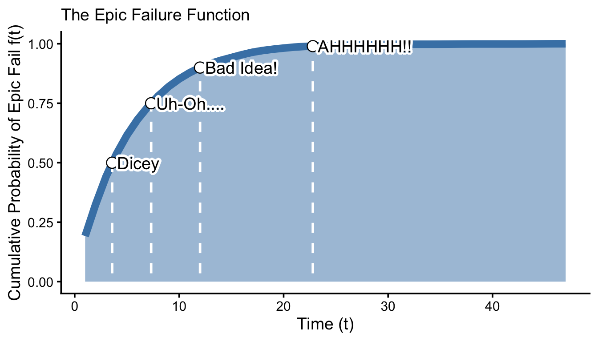

# SIGMA: System Reliability and Six Sigma in R and Python

*Author*: Timothy Fraser, PhD

Your online textbook for learning reliability and six sigma techniques in R and Python. These coding workshops are authored for Cornell University course SYSEN 5300 and rendered as an interactive Gitbook.

---

---

## Accessing the Book

- **Live site**: [timothyfraser.com/sigma](https://www.timothyfraser.com/sigma)
- **Recommended environment**: [Posit Cloud](https://posit.cloud) for running R code hands-on
- **Course data**: Available in the [`timothyfraser/sysen`](https://github.com/timothyfraser/sysen) repository

---

## Purpose

This book is designed to:

- **Teach reliability and Six Sigma with code-first workshops**: each chapter mixes short narrative explanations, runnable examples, and hands-on "Learning Checks."
- **Make applied methods accessible**: use plain language, small reproducible examples, and visual intuition.
- **Be classroom-friendly**: chapters are chunked for live instruction and self-paced study.

## What You'll Learn

Through a series of interactive workshops and skill-building exercises, you'll master:

- **Statistical Process Control** - Monitoring and improving manufacturing and service processes
- **Reliability Engineering** - Predicting and improving system performance over time
- **Life Distributions** - Modeling failure patterns using exponential, Weibull, gamma, and log-normal distributions
- **Fault Tree Analysis** - Visualizing and quantifying system failure modes
- **Physical Acceleration Models** - Converting lab test results to field performance estimates
- **Design of Experiments** - Planning and analyzing experiments to optimize processes
- **Quality Control Charts** - Detecting process changes and maintaining quality standards

## Using This Book

The book is organized into thematic parts, each containing numbered workshop chapters. Each chapter includes:

- **Narrative explanations** that introduce concepts in plain language
- **Runnable code examples** that demonstrate techniques step-by-step
- **Learning Checks** with interactive questions and collapsible answers
- **Visual examples** using plots and diagrams to build intuition

You can read the book online at [timothyfraser.com/sigma](https://www.timothyfraser.com/sigma), or follow along with the code using [Posit Cloud](https://posit.cloud) or your local R/Python environment.

---

## Authorship

This book is authored by **Timothy Fraser, PhD**, for Cornell University's SYSEN 5300 course. The book is designed to bridge the gap between statistical theory and practical coding implementation, making advanced reliability and Six Sigma techniques accessible through hands-on workshops.

## Acknowledgements

This book has benefited from the contributions of several individuals who helped with development, testing, and refinement:

- **Jingyao Tong** - Contributions to book development and testing
- **Tolkien Bagchi** - Contributions to book development and testing  
- **Devanshi Jain** - Contributions to book development and testing

We are grateful for their efforts in making this resource more effective and accessible.

---

## License and Citation

This project is licensed under the terms in `LICENSE`.

Please cite materials as appropriate. Bibliography files (`book.bib`, `packages.bib`) are configured with `biblio-style: apalike` and `link-citations: yes`.

---

## Support

Questions? Reach out to Dr. Tim Fraser at `tmf77[at]cornell.edu`.
