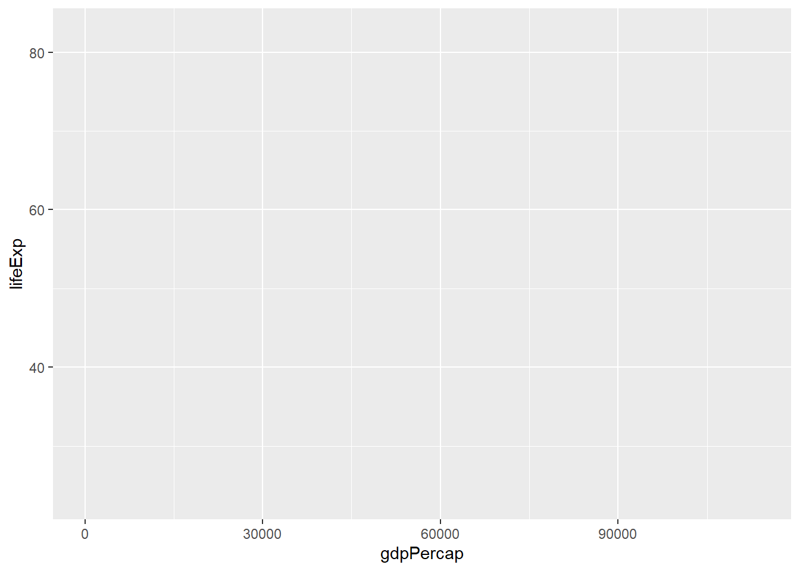
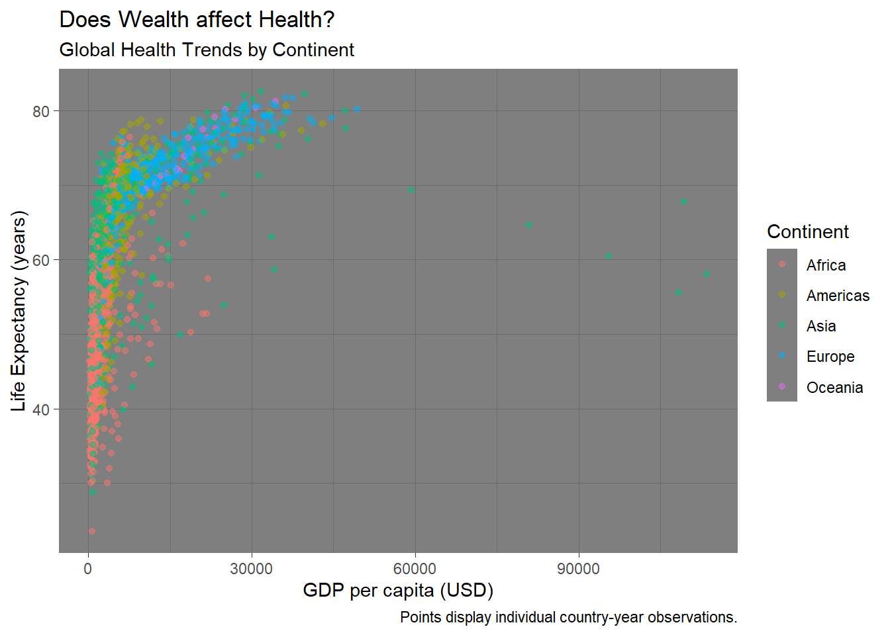

# Skill: Visualization with `ggplot` in `R` {.unnumbered}


Visualization is a key part of statistical analyses, especially in systems engineering! Visuals themselves are often the analysis themselves! In this tutorial, we're going to learn how to visualize data in the `ggplot2` package.

**Please follow along using the code below!**

<br>
<br>

## Getting Started {.unnumbered}

### Loading Packages {.unnumbered}

Let's load our packages with `library()`.


```r
# Data viz and data manipulation packages
library(ggplot2)
library(dplyr)
# Data sources
library(gapminder)
```

Notes:
  
1. SAVE YOUR SCRIPT.

2. Always comment your code (what I'm doing now),

3. use lots of spaces, and keep it clean.


### Gapminder data {-}

Economist Hans Rosling made a dataset that examines change in life expectancy over time for most countries in the world. It is contained in the `gapminder` package!


```r
# Let's view it. (see console below)
gapminder
```

```
## # A tibble: 1,704 × 6
##    country     continent  year lifeExp      pop gdpPercap
##    <fct>       <fct>     <int>   <dbl>    <int>     <dbl>
##  1 Afghanistan Asia       1952    28.8  8425333      779.
##  2 Afghanistan Asia       1957    30.3  9240934      821.
##  3 Afghanistan Asia       1962    32.0 10267083      853.
##  4 Afghanistan Asia       1967    34.0 11537966      836.
##  5 Afghanistan Asia       1972    36.1 13079460      740.
##  6 Afghanistan Asia       1977    38.4 14880372      786.
##  7 Afghanistan Asia       1982    39.9 12881816      978.
##  8 Afghanistan Asia       1987    40.8 13867957      852.
##  9 Afghanistan Asia       1992    41.7 16317921      649.
## 10 Afghanistan Asia       1997    41.8 22227415      635.
## # ℹ 1,694 more rows
```

Each row is a country-year, marking the life expectancy, population, and gross domestic product (GDP) per capita. On your end, you can only can see some of it, right?
                           
Let's check out what vectors are in this dataframe, using the `glimpse` function from the `dplyr` package.


```r
# (Remember, a vector is a column in a spreadsheet;
# a data.frame is a spreadsheet.)
glimpse(gapminder)
```

```
## Rows: 1,704
## Columns: 6
## $ country   <fct> "Afghanistan", "Afghanistan", "Afghanistan", "Afghanistan", …
## $ continent <fct> Asia, Asia, Asia, Asia, Asia, Asia, Asia, Asia, Asia, Asia, …
## $ year      <int> 1952, 1957, 1962, 1967, 1972, 1977, 1982, 1987, 1992, 1997, …
## $ lifeExp   <dbl> 28.801, 30.332, 31.997, 34.020, 36.088, 38.438, 39.854, 40.8…
## $ pop       <int> 8425333, 9240934, 10267083, 11537966, 13079460, 14880372, 12…
## $ gdpPercap <dbl> 779.4453, 820.8530, 853.1007, 836.1971, 739.9811, 786.1134, …
```

```r
# Nice, we can see things more concisely.
```

Our data has six variables. Great!

<br>
<br>

## Your first scatterplot {-}

Using the `gapminder` data, let's map a series of vectors to become aesthetic features in the visualization (point, colors, fills, etc.).
                          

```r
ggplot(data = gapminder, mapping = aes(
  # Let's make the x-axis gross-domestic product per capita (wealth per person)
  x = gdpPercap, 
  # Let's make the y-axis country life expectancy
  y = lifeExp))
```



Huh! We made an empty graph. Cool.

That's because ggplot needs helper functions to add aesthetic features to the graph.

For example, adding `+ geom_point()` will *overlay* a scatterplot.


```r
# Make a scatterplot
ggplot(data = gapminder, mapping = aes(x = gdpPercap, y = lifeExp)) + # same as above, except "+"
  geom_point()
```


---

## Learning Check 1 {.unnumbered #LC1}

**Question**
  
What kind of relationship does this graph show? Why might it matter to policymakers?


<details><summary>**[View Answer!]**</summary>
  
The graph above shows that as average wealth (GDP per capita) in a country increases, those countries' life expectancy increases swiftly, but then tapers off. This highlights that there is a strong relationship between wealth and health globally.

</details>
  
---

<br>
<br>

---

## Learning Check 2 {.unnumbered #LC2}

**Question**
  
What happens when you add the `alpha`, changing its values in the 3 visuals below?


```r
# Run the following code:

ggplot(data = gapminder, mapping = aes(x = gdpPercap, y = lifeExp)) +
  geom_point(alpha = 0.2)
```


```r
ggplot(data = gapminder, mapping = aes(x = gdpPercap, y = lifeExp)) +
  geom_point(alpha = 0.5)
```


```r
ggplot(data = gapminder, mapping = aes(x = gdpPercap, y = lifeExp)) + 
                               geom_point(alpha = 1)
```


<br>

<details><summary>**[View Answer!]**</summary>
  
`alpha` ranges from 0 to 1 and describes feature transparency. Increasing `alpha` to `1` makes points **fully opaque!** Decreasing `alpha` to `0` makes points **fully transparent!**

</details>
  
---

<br>
<br>
                       
---

## Learning Check 3 {.unnumbered #LC3}

**Question**
  
We can make it more visually appealing. What happens when we do each of the following?

a. If you want to make it **a single color**, where do you need to write `color = ...`?

b. If you want to make it **multiple colors** according to a vector, where do you need to write `color = `?


```r
# Run the following code:

# Version 1
ggplot(data = gapminder, mapping = aes(x = gdpPercap, y = lifeExp)) + 
  geom_point(alpha = 0.5, color = "steelblue")

# Version 2
ggplot(data = gapminder, mapping = aes(x = gdpPercap, y = lifeExp, color = continent)) +
  geom_point(alpha = 0.5)
```


<details><summary>**[View Answer!]**</summary>
  
To assign a single color, you need to put `color` *outside* the `aes()` phrase, and write the name of the color.

To assign multiple colors, you need to put the `color` *inside* the `aes(...)` phrase, and write the name of the vector in the `data` that it corresponds to (eg. `continent`).


</details>
  
---

<br>
<br>

## Improving our Visualizations {-}

We can (and should!) make our visualizations much more readable by adding appropriate labels.


```r
ggplot(data = gapminder, mapping = aes(x = gdpPercap, y = lifeExp, 
color = continent)) +
  geom_point(alpha = 0.5) +
  # Add labels!
  labs(x = "GDP per capita (USD)", # label for x-values
    y = "Life Expectancy (years)", # label for y-values
    color = "Continent", # label for colors
    title = "Does Wealth affect Health?", # overall title
    subtitle = "Global Health Trends by Continent", # subtitle!
    caption = "Points display individual country-year observations.") # caption
```


We can actually save visualizations as objects too, which can make things faster.

Let's save our visual as `myviz`


```r
myviz <- ggplot(data = gapminder, mapping = aes(x = gdpPercap, y = lifeExp, 
                                                color = continent)) + 
  geom_point(alpha = 0.5) +
  labs(x = "GDP per capita (USD)", 
       y = "Life Expectancy (years)",
       color = "Continent", 
       title = "Does Wealth affect Health?", # overall title
       subtitle = "Global Health Trends by Continent", # subtitle!
       caption = "Points display individual country-year observations.") # caption
```

Next, let's try a few more learning check that will ask you to try our ways to improve the quality and readability of your visuals!

<br>
<br>

---

## Learning Check 4 {.unnumbered #LC4}

**Question**
  
Now run `myviz` - what happens?

```r
myviz
```


<details><summary>**[View Answer!]**</summary>

When you save a ggplot to an `object`, eg. naming it `myviz`, you can call up the visual again as many times as you want by just running the `myviz` object, just like any other object.

</details>
  
---

<br>
<br>

---

## Learning Check 5 {.unnumbered #LC5}

**Question**

We can do better, adding things onto our myviz object! Try changing themes. What happens below?


```r
# Version theme_bw
myviz +
# How about this theme?
theme_bw()
```


```r
# Version theme_dark
myviz +
# How about this theme?
theme_dark()
```




```r
# Version theme_classic
myviz +
# How about this theme?
theme_classic()
```


<details><summary>**[View Answer!]**</summary>
  
`theme_bw()` makes a nice black-and-white graph; `theme_dark()` makes a funky graph with a dark grey background; `theme_classic()` makes a very simple graph, with fewer distractions.

I personally really like the default theme or `theme_bw()`. Sometimes `theme_classic()` can be really helpful if you have a particularly busy visual.


</details>
  
---

<br>
<br>
<br>
<br>

## Visualizing `diamonds` data {-}

Next, let's use the `diamonds` dataset, which comes with the `ggplot2` package
This is a dataset of over 50,000 diamond sales. 


```r
# Check out first 3 rows...
diamonds %>% head(3)
```

```
## # A tibble: 3 × 10
##   carat cut     color clarity depth table price     x     y     z
##   <dbl> <ord>   <ord> <ord>   <dbl> <dbl> <int> <dbl> <dbl> <dbl>
## 1  0.23 Ideal   E     SI2      61.5    55   326  3.95  3.98  2.43
## 2  0.21 Premium E     SI1      59.8    61   326  3.89  3.84  2.31
## 3  0.23 Good    E     VS1      56.9    65   327  4.05  4.07  2.31
```

We can use this visualization to check whether the `cut` of diamonds really has any relationship with `price`.


```r
glimpse(diamonds)
```

```
## Rows: 53,940
## Columns: 10
## $ carat   <dbl> 0.23, 0.21, 0.23, 0.29, 0.31, 0.24, 0.24, 0.26, 0.22, 0.23, 0.…
## $ cut     <ord> Ideal, Premium, Good, Premium, Good, Very Good, Very Good, Ver…
## $ color   <ord> E, E, E, I, J, J, I, H, E, H, J, J, F, J, E, E, I, J, J, J, I,…
## $ clarity <ord> SI2, SI1, VS1, VS2, SI2, VVS2, VVS1, SI1, VS2, VS1, SI1, VS1, …
## $ depth   <dbl> 61.5, 59.8, 56.9, 62.4, 63.3, 62.8, 62.3, 61.9, 65.1, 59.4, 64…
## $ table   <dbl> 55, 61, 65, 58, 58, 57, 57, 55, 61, 61, 55, 56, 61, 54, 62, 58…
## $ price   <int> 326, 326, 327, 334, 335, 336, 336, 337, 337, 338, 339, 340, 34…
## $ x       <dbl> 3.95, 3.89, 4.05, 4.20, 4.34, 3.94, 3.95, 4.07, 3.87, 4.00, 4.…
## $ y       <dbl> 3.98, 3.84, 4.07, 4.23, 4.35, 3.96, 3.98, 4.11, 3.78, 4.05, 4.…
## $ z       <dbl> 2.43, 2.31, 2.31, 2.63, 2.75, 2.48, 2.47, 2.53, 2.49, 2.39, 2.…
```

Looks like `cut` is an ordinal variable (fair, good, ideal, etc.), while `price` is numeric (eg. dollars).
A boxplot might be helpful!


```r
ggplot(data = diamonds, mapping = aes(x = cut, y = price, group = cut)) +
  # notice how we added group = cut, to tell it to use 5 different boxes, one per cut?
  geom_boxplot()
```


Huh. How odd. Looks like the `cut` of diamonds has very little impact on what `price` they are sold at! 

We can see lots of outliers at the top - really expensive diamonds for that cut.

<br>
<br>

---

## Learning Check 6 {.unnumbered #LC6}

**Question**
 
Let's make this visualization more visually appealing.

What changed in the code to make these two different visual effects? Why? (*Hint: fill.*)


```r
ggplot(data = diamonds, mapping = aes(x = cut, y = price, group = cut)) +
  geom_boxplot(fill = "steelblue")
```


```r
ggplot(data = diamonds, mapping = aes(x = cut, y = price, group = cut, fill = cut)) +
  geom_boxplot()
```


 
<details><summary>**[View Answer!]**</summary>
  
In the first visual, we assigned all the boxplots to have the same fill (`fill = "steelblue"`), but in the second visual, we assigned the boxplot `fill` to be shaded based on the `cut` of diamond. This adds a cool color range!

</details>
  
---

<br>
<br>

---

## Learning Check 7 {.unnumbered #LC7}

**Question**
 
Sometimes, the names of categories won't fit well. We can try the following. What did we do?


```r
ggplot(data = diamonds, mapping = aes(x = cut, y = price, 
                                      group = cut, fill = cut)) +
  geom_boxplot() + 
  coord_flip()
```

 
<details><summary>**[View Answer!]**</summary>
  
We used `coord_flip()` to **flip** the coordinates of the `x` and `y` axis, which gives our `cut` labels more room!

</details>
  
---

<br>
<br>
<br>

---

## Learning Check 8 {.unnumbered #LC8}

**Question**

Sometimes, the legend doesn't fit well. We can try this:

What happens when you change `legend.position` from `"right"` to `"bottom"` to `"left"` to `"top"`?


```r
ggplot(data = diamonds, mapping = aes(x = cut, y = price,
  group = cut, fill = cut)) +
  geom_boxplot() + coord_flip() +
  theme(legend.position = "bottom")

ggplot(data = diamonds, mapping = aes(x = cut, y = price,
  group = cut, fill = cut)) +
  geom_boxplot() + coord_flip() +
  theme(legend.position = "right")

ggplot(data = diamonds, mapping = aes(x = cut, y = price, 
  group = cut, fill = cut)) +
  geom_boxplot() + coord_flip() +
  theme(legend.position = "left")

ggplot(data = diamonds, mapping = aes(x = cut, y = price, 
  group = cut, fill = cut)) +
  geom_boxplot() + coord_flip() +
  theme(legend.position = "top")
```

  
<details><summary>**[View Answer!]**</summary>
  
These four values for `legend.position` will relocate the `fill` legend (and any other legends) to be at the top, bottom, left, or right of the visual!

</details>
  
---

<br>
<br>

## Visualizing Distributions {-}

Different `geom_` functions use colors in different ways, but this is a good example.

For example, below is a **histogram.**  It visualizes the approximate distribution of a set of values.

We can see how frequently `diamonds` are sold for certain prices versus others.


```r
ggplot(data = diamonds, mapping = aes(x = price, group = cut, fill = cut)) +
  geom_histogram(color = "white") + # notice new function here
  labs(x = "Price (USD)",
    y = "Frequency of Price (Count)",
    title = "US Diamond Sales")
```


<br>
<br>

---

## Learning Check 9 {.unnumbered #LC9}

**Question**
  
Are most diamonds cheap or expensive? What type of distribution would you call this? 

a. Normal?

b. Uniform?

c. Left Skewed?

d. Right Skewed?

<br>

<details><summary>**[View Answer!]**</summary>
  
This is strongly *right-skewed* distribution, because the majority of the distribution leans to the left (the clump of the data), while it has a long tail that *skews* to the right. The median is less than the mean in a right skewed distribution.

</details>
  
---

<br>
<br>


## Breaking Up a Visual {-}

Finally, we might want to break up our visual into multiple parts. We can use `facet_wrap` to do this, but how exactly does it work? Let's test it out in the **Learning Check** below.

---

## Learning Check 10 {.unnumbered #LC10}

**Question**

What changed in the code below, and what did it result in?


```r
ggplot(data = diamonds, mapping = aes(x = price, fill = cut)) +
  geom_histogram(color = "white") + 
  facet_wrap(~cut) + # must be categorical variable
  labs(x = "Price (USD)",
       y = "Frequency of Price (Count)",
       title = "US Diamond Sales")
```

<details><summary>**[View Answer!]**</summary>

This visual split up our histograms into separate panels (making it much more readable), and easier to compare distributions. We write `facet_wrap(~` before the variable name (eg. `cut`) to specify that we want to split up the data by the values of `cut`. This sorts our rows of data into 5 different piles (since there are 5 different categories in `cut`) and makes a panel out of each.

</details>
  
---

<br>
<br>
<br>
<br>

## Conclusion {-}

You made it! You have now tried out a series of visuals in `ggplot`. We will use `ggplot` a *lot* in this course, so please be sure to reach out when you have questions, talk with others in your group, and work together to build great visualization skills! (Plus, it's super applicable professionally!)


