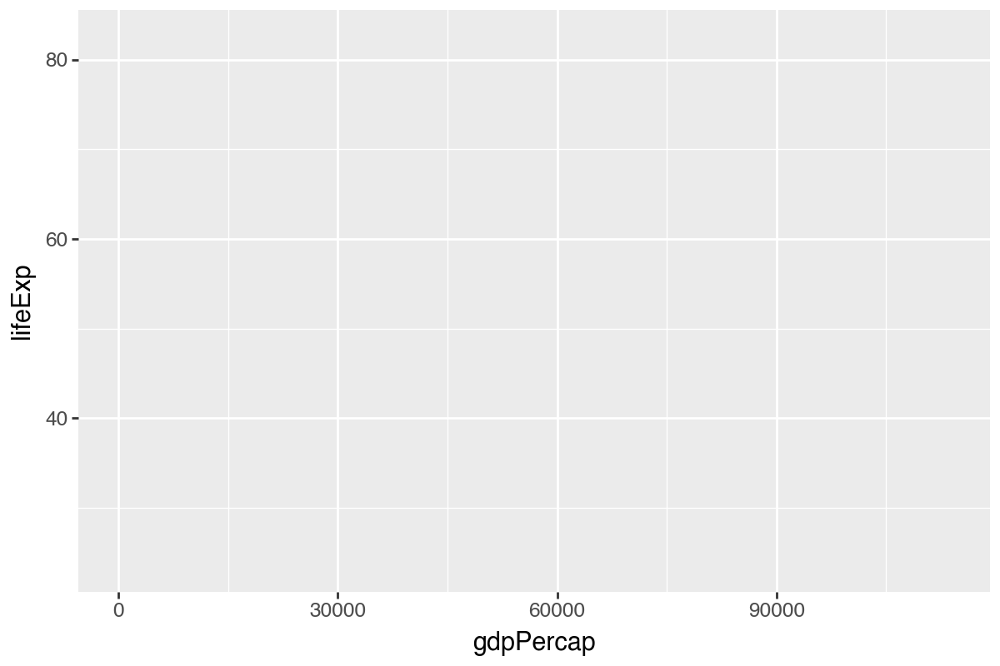
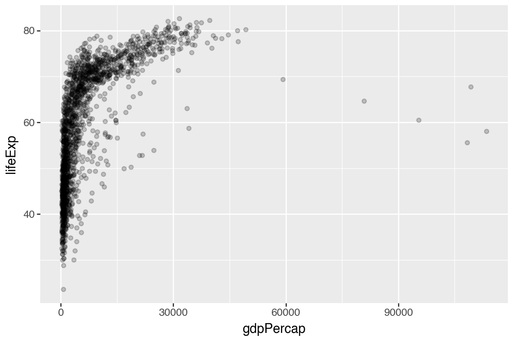
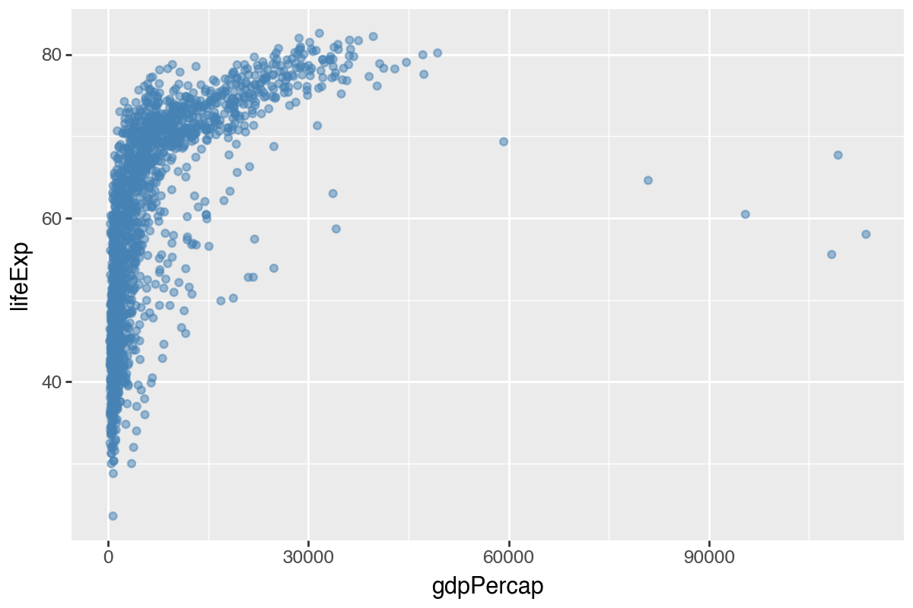
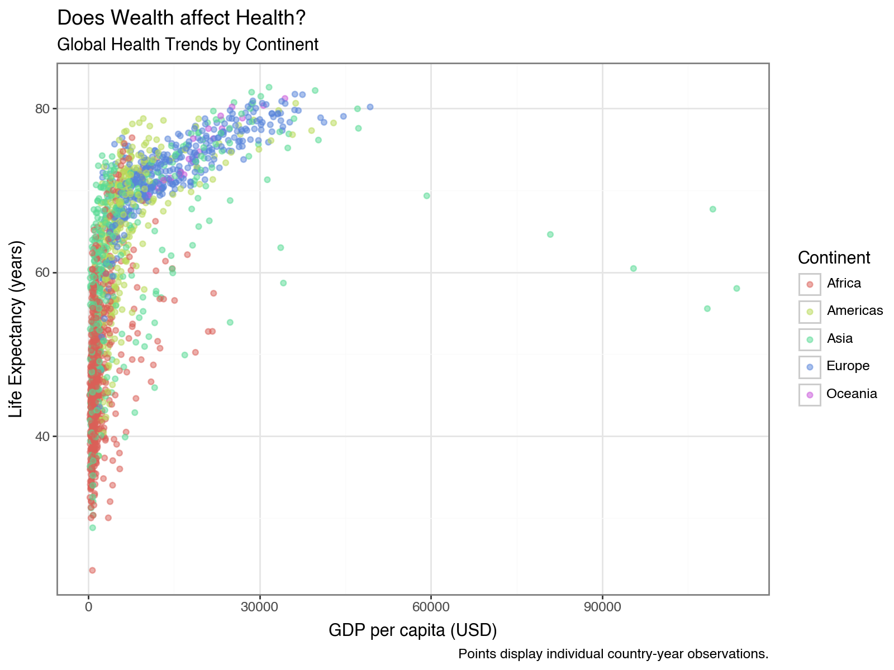
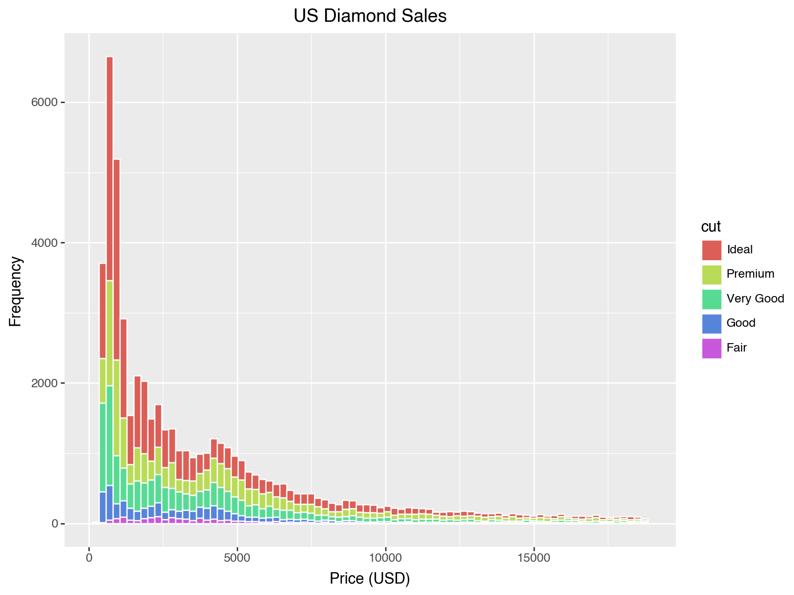
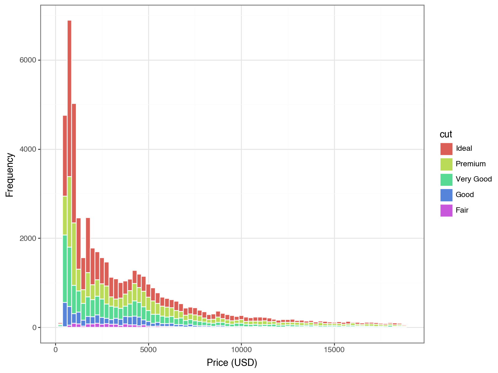

# Visualization with `plotnine` in `Python`


Visualization is a key part of statistical analyses, especially in systems engineering. In this tutorial, we'll learn to visualize data with `plotnine` (the Python port of `ggplot2`).

**Please follow along using the code below!**

<br> <br>

## Getting Started {.unnumbered}

### Loading Packages {.unnumbered}


``` python
import pandas as p
from plotnine import *
from gapminder import gapminder as gapminder
from seaborn import load_dataset

# diamonds from seaborn
diamonds = load_dataset('diamonds')
```

### Gapminder data {.unnumbered}


``` python
# View it in the console
gapminder
```

```
##           country continent  year  lifeExp       pop   gdpPercap
## 0     Afghanistan      Asia  1952   28.801   8425333  779.445314
## 1     Afghanistan      Asia  1957   30.332   9240934  820.853030
## 2     Afghanistan      Asia  1962   31.997  10267083  853.100710
## 3     Afghanistan      Asia  1967   34.020  11537966  836.197138
## 4     Afghanistan      Asia  1972   36.088  13079460  739.981106
## ...           ...       ...   ...      ...       ...         ...
## 1699     Zimbabwe    Africa  1987   62.351   9216418  706.157306
## 1700     Zimbabwe    Africa  1992   60.377  10704340  693.420786
## 1701     Zimbabwe    Africa  1997   46.809  11404948  792.449960
## 1702     Zimbabwe    Africa  2002   39.989  11926563  672.038623
## 1703     Zimbabwe    Africa  2007   43.487  12311143  469.709298
## 
## [1704 rows x 6 columns]
```


``` python
# Glimpse-like summary
gapminder.dtypes, gapminder.shape
```

```
## (country       object
## continent     object
## year           int64
## lifeExp      float64
## pop            int64
## gdpPercap    float64
## dtype: object, (1704, 6))
```

## Your first scatterplot


``` python
p1 = ggplot(data=gapminder, mapping=aes(x='gdpPercap', y='lifeExp'))
p1.save("plotnine_figures/01_scatter_base.png", dpi=200, width=6, height=4)
```



Add points with `+ geom_point()`.


``` python
p2 = (ggplot(gapminder, aes(x='gdpPercap', y='lifeExp')) + geom_point())
p2.save("plotnine_figures/01_scatter_points.png", dpi=200, width=6, height=4)
```


------------------------------------------------------------------------

## Learning Check 1 {.unnumbered .LC}

**Question**

What kind of relationship does this graph show? Why might it matter to policymakers?

<details>

<summary>**[View Answer!]**</summary>

As wealth per person (GDP per capita) increases, life expectancy rises quickly then tapers off. This shows a strong relationship between wealth and health.

</details>

------------------------------------------------------------------------

## Transparency (alpha)


``` python
p3 = (ggplot(gapminder, aes(x='gdpPercap', y='lifeExp')) + geom_point(alpha=0.2))
p3.save("plotnine_figures/01_scatter_alpha02.png", dpi=200, width=6, height=4)
p4 = (ggplot(gapminder, aes(x='gdpPercap', y='lifeExp')) + geom_point(alpha=0.5))
p4.save("plotnine_figures/01_scatter_alpha05.png", dpi=200, width=6, height=4)
p5 = (ggplot(gapminder, aes(x='gdpPercap', y='lifeExp')) + geom_point(alpha=1))
p5.save("plotnine_figures/01_scatter_alpha1.png", dpi=200, width=6, height=4)
```




------------------------------------------------------------------------

## Learning Check 2 {.unnumbered .LC}

**Question**

What happens when you change `alpha` across the three visuals above?

<details>

<summary>**[View Answer!]**</summary>

`alpha` controls transparency from 0 to 1. Higher values are more opaque; lower values are more transparent.

</details>

------------------------------------------------------------------------

## Color: constant vs mapped


``` python
# Single color
p6 = (ggplot(gapminder, aes(x='gdpPercap', y='lifeExp')) +
  geom_point(alpha=0.5, color='steelblue'))
p6.save("plotnine_figures/01_scatter_single_color.png", dpi=200, width=6, height=4)

# Color mapped by continent
p7 = (ggplot(gapminder, aes(x='gdpPercap', y='lifeExp', color='continent')) +
  geom_point(alpha=0.5))
p7.save("plotnine_figures/01_scatter_mapped_color.png", dpi=200, width=6, height=4)
```




------------------------------------------------------------------------

## Learning Check 3 {.unnumbered .LC}

**Question**

Where do you place `color` for a single color vs. multiple colors based on a variable?

<details>

<summary>**[View Answer!]**</summary>

Single color: set `color` inside `geom_point(color='...')` (outside `aes`). Mapped colors: set `color` inside `aes(color='variable')`.

</details>

------------------------------------------------------------------------

## Improving our visualizations


``` python
p8 = (ggplot(gapminder, aes(x='gdpPercap', y='lifeExp', color='continent')) +
  geom_point(alpha=0.5) +
  labs(x='GDP per capita (USD)',
       y='Life Expectancy (years)',
       color='Continent',
       title='Does Wealth affect Health?',
       subtitle='Global Health Trends by Continent',
       caption='Points display individual country-year observations.'))
p8.save("plotnine_figures/01_scatter_improved.png", dpi=200, width=8, height=6)
```


You can save visuals as objects to reuse them.


``` python
myviz = (ggplot(gapminder, aes(x='gdpPercap', y='lifeExp', color='continent')) +
  geom_point(alpha=0.5) +
  labs(x='GDP per capita (USD)', y='Life Expectancy (years)', color='Continent',
       title='Does Wealth affect Health?', subtitle='Global Health Trends by Continent',
       caption='Points display individual country-year observations.'))

myviz.save("plotnine_figures/01_myviz_default.png", dpi=200, width=8, height=6)
(myviz + theme_bw()).save("plotnine_figures/01_myviz_bw.png", dpi=200, width=8, height=6)
(myviz + theme_dark()).save("plotnine_figures/01_myviz_dark.png", dpi=200, width=8, height=6)
(myviz + theme_classic()).save("plotnine_figures/01_myviz_classic.png", dpi=200, width=8, height=6)
```





<br> <br>

## Visualizing `diamonds` data


``` python
diamonds.head(3)
```

```
##    carat      cut color clarity  depth  table  price     x     y     z
## 0   0.23    Ideal     E     SI2   61.5   55.0    326  3.95  3.98  2.43
## 1   0.21  Premium     E     SI1   59.8   61.0    326  3.89  3.84  2.31
## 2   0.23     Good     E     VS1   56.9   65.0    327  4.05  4.07  2.31
```


``` python
diamonds.dtypes, diamonds.shape
```

```
## (carat       float64
## cut        category
## color      category
## clarity    category
## depth       float64
## table       float64
## price         int64
## x           float64
## y           float64
## z           float64
## dtype: object, (53940, 10))
```

### Boxplots by cut


``` python
p9 = (ggplot(diamonds, aes(x='cut', y='price', group='cut')) + geom_boxplot())
p9.save("plotnine_figures/01_boxplot_default.png", dpi=200, width=6, height=4)
```


``` python
p10 = (ggplot(diamonds, aes(x='cut', y='price', group='cut')) +
  geom_boxplot(fill='steelblue'))
p10.save("plotnine_figures/01_boxplot_fill.png", dpi=200, width=6, height=4)
```


``` python
p11 = (ggplot(diamonds, aes(x='cut', y='price', group='cut', fill='cut')) +
  geom_boxplot())
p11.save("plotnine_figures/01_boxplot_mapped_fill.png", dpi=200, width=6, height=4)
```


------------------------------------------------------------------------

## Learning Check 4 {.unnumbered .LC}

**Question**

Why do the two boxplot versions look different? What changed in the code to create those effects?

<details>

<summary>**[View Answer!]**</summary>

Constant fill uses `geom_boxplot(fill='steelblue')`. Mapped fill uses `aes(fill='cut')` to color by variable.

</details>

------------------------------------------------------------------------

## Visualizing Distributions


``` python
p12 = (ggplot(diamonds, aes(x='price', fill='cut')) +
  geom_histogram(color='white') +
  labs(x='Price (USD)', y='Frequency', title='US Diamond Sales'))
p12.save("plotnine_figures/01_histogram_default.png", dpi=200, width=8, height=6)
```



### Try adjusting binwidth and theme


``` python
p13 = (ggplot(diamonds, aes(x='price', fill='cut')) +
  geom_histogram(color='white', binwidth=500) +
  theme_classic() +
  labs(x='Price (USD)', y='Frequency', title='US Diamond Sales (binwidth=500)'))
p13.save("plotnine_figures/01_histogram_binwidth.png", dpi=200, width=8, height=6)
```


------------------------------------------------------------------------

## Learning Check 5 {.unnumbered .LC}

**Question**

Make a histogram of `price` with a narrower binwidth and apply a different theme. Which choices improve readability?

<details>

<summary>**[View Answer!]**</summary>


``` python
p14 = (ggplot(diamonds, aes(x='price', fill='cut')) +
  geom_histogram(color='white', binwidth=250) +
  theme_bw() +
  labs(x='Price (USD)', y='Frequency'))
p14.save("plotnine_figures/01_histogram_answer.png", dpi=200, width=8, height=6)
```



</details>

------------------------------------------------------------------------

## Conclusion {.unnumbered}

You learned how to build scatterplots, boxplots, and histograms with `plotnine` and how to control transparency, color mapping, labels, and themes.


