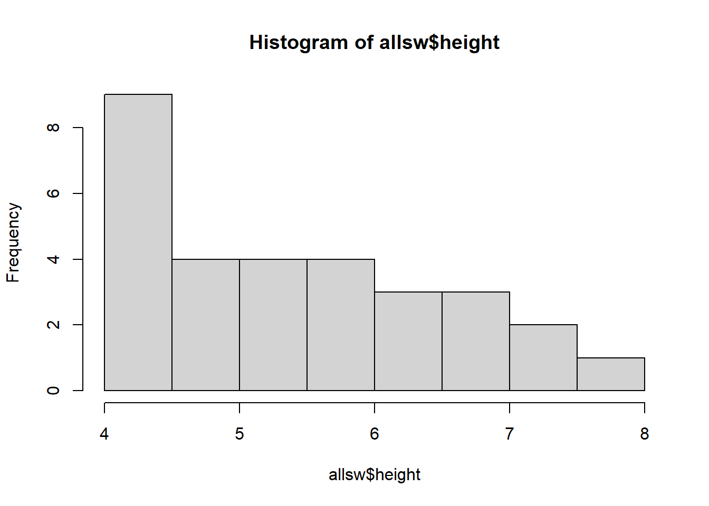
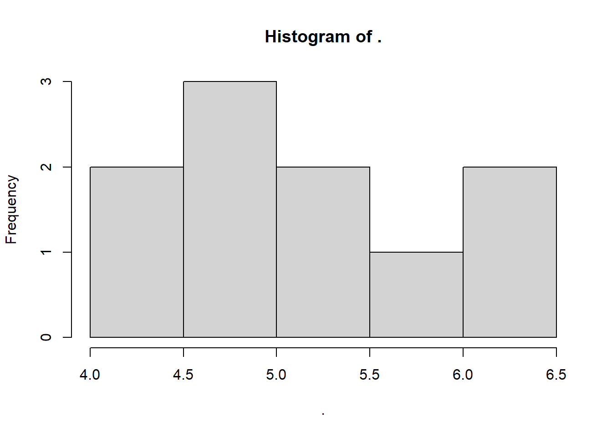
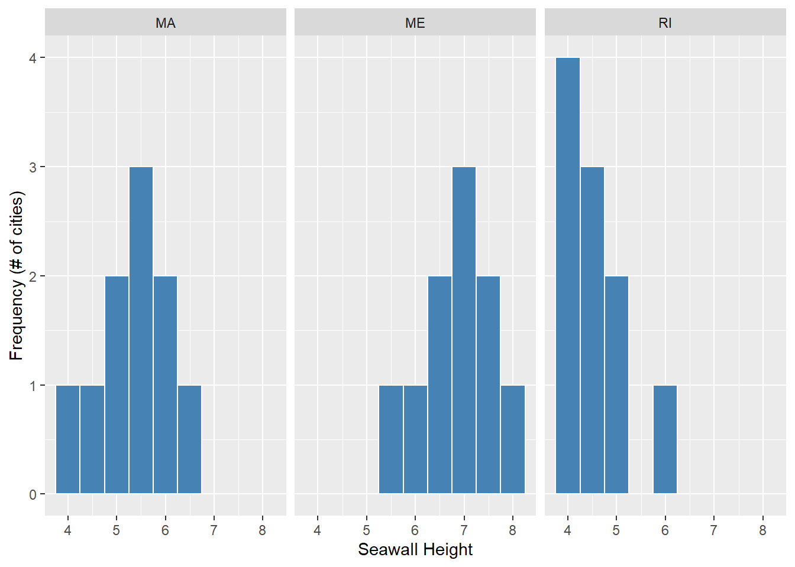
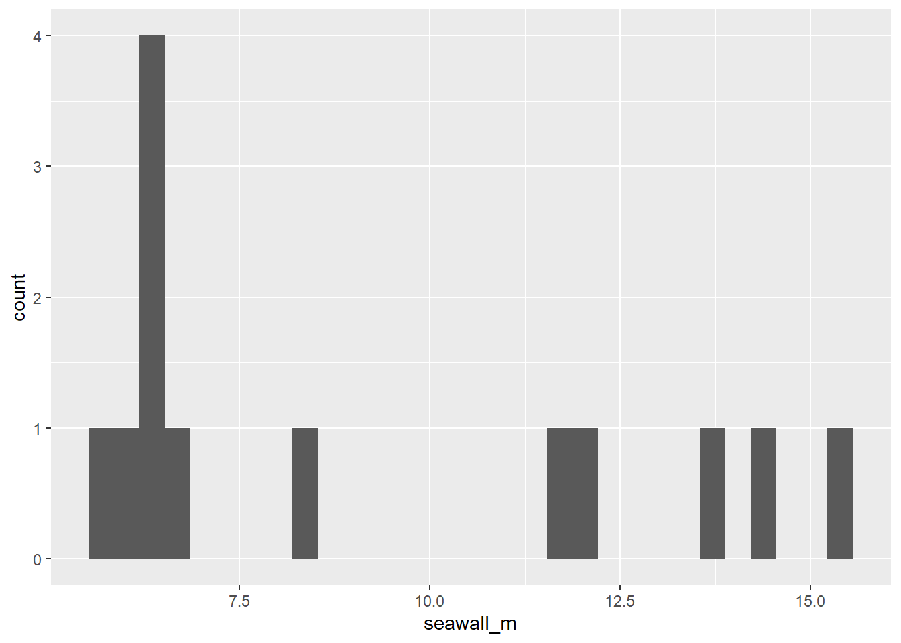

# Workshop: Coding in R


Welcome to Posit Cloud! You made it! This document will introduce you to how to start coding in R, using Posit Cloud. We will use the R statistical coding language frequently in class to conduct analyses and visualization.

```
Hello world! We are coding in R!

```

<br>
<br>

## Getting Started {-}

### Making an Posit.Cloud account {-}

We'll be using Posit.Cloud, a virtual version of R you can access from any computer with an internet browser (PC, Mac, Chromebook, anything). To get set up, please [follow the steps in this **short Video playlist**](https://vod.video.cornell.edu/playlist/dedicated/1_89xs9wbc/)!


### Using R for the First Time {-}

1. For a quick visual orientation, take a peek at the image below.

2. Read and follow along with the instructions on the webpage! Read the tutorial code (below), and then type it in and run it in your R session!

<div class="figure" style="text-align: center">

<p class="caption">(\#fig:graphic_1)Visual Intro to Using Posit.Cloud</p>
</div>

<br>
<br>


## Introduction to `R`

The document in your Posit Cloud project document is an 'R script.' (its name ends in .R).

It contains two kinds of text:

1. 'code' - instructions to our statistical calculator

2. 'comments' - any text that immediately follows a '#' sign.


```r
# For example,
# Comments are ignored by the calculator, so we can write ourselves notes.
```

Notice: 4 windows in R.

- Window 1 (upper left): Scripts!

- Window 2 (bottom left): Console (this shows the output for our calculator)

- Window 3 (upper right): Environment (this shows any data the computer is holding onto for us)

- Window 4 (bottom right): Files (this shows our working project folder, our scripts, and any data files.)

A few tips:

- To change the background theme (and save your eyes), go to **Tools >> Global Options >> Appearance >> Editor Theme >> Dracula**

- To increase the font size, go to **Tools >> Global Options >> Appearance >> Editor Font Size**

To make a script, go to **File >> New File >> R Script,** then save it and name it.

<div class="figure" style="text-align: center">

<p class="caption">(\#fig:image_1_1)Open New Script</p>
</div>
<div class="figure" style="text-align: center">

<p class="caption">(\#fig:image_1_2)Save New Script!</p>
</div>

Let's learn to use R!

## Basic Calculations in R

Try highlighting the following with your cursor,  and then press **CTRL** and **ENTER** simultaneously, or the **'Run'** button above.

Addition:


```r
1 + 5
```

```
## [1] 6
```

Subtraction:
 

```r
5 - 2
```

```
## [1] 3
```

Multiplication:


```r
2 * 3
```

```
## [1] 6
```

Division:


```r
15 / 5
```

```
## [1] 3
```

Exponents:


```r
2^2
```

```
## [1] 4
```

Square-Roots:
 

```r
sqrt(4)
```

```
## [1] 2
```

Order of Operations:

*Still applies! Like in math normally, R calculations are evaluated from left to right, prioritizing parentheses, then multiplication and division, then addition and subtraction.*


```r
2 * 2 - 5
```

```
## [1] -1
```
Use Parentheses!


```r
2 * (2 - 5)
```

```
## [1] -6
```

<br>
<br>

---

## Learning Check 1 {.unnumbered .LC}

**Learning Checks (LC)** are short questions that appear throughout this book, providing short coding challenges to try and work through.

- Below is the ```question``` tab. 

- Read the question, and try to answer it on your own!

- Then, *click the answer button to see the ```answer```.* (Note: There are often many different ways to code the same thing!) 

- Feeling stumped? You can check the answer, but be sure to code it yourself afterwards!

**Question**

Try calculating something wild in ```R```! Solve for ```x``` below using the commands you just learned in R!

1. \( x = \sqrt{  (\frac{2 - 5 }{5})^{4}  }   \)

2. \( x = (1 - 7)^{2} \times 5  - \sqrt{49} \)

3. \( x = 2^{2} + 2^{2} \times 2^{2} - 2^{2} \div 2^{2} \)

<br>
<br>

<details><summary>**[View Answer!]**</summary>

Here's how we coded it! How does yours compare? If your result is different, compare code. What's different? Be sure to go back and adjust your code so you understand the answer!

1. \( x = \sqrt{  (\frac{2 - 5 }{5})^{4}  }   \)


```r
sqrt( ((2 - 5) / 5)^4 )
```

```
## [1] 0.36
```

2. \( x = (1 - 7)^{2} \times 5  - \sqrt{49} \)


```r
(1 - 7)^2 * 5 - sqrt(49)
```

```
## [1] 173
```

3. \( x = 2^{2} + 2^{2} \times 2^{2} - 2^{2} \div 2^{2} \)


```r
2^2 + 2^2 * 2^2 - 2^2 / 2^2
```

```
## [1] 19
```

</details>
  
---

<br>
<br>
<br>

## Types of Values in R

R accepts 2 type of data:


```r
# Numeric Values
15000
```

```
## [1] 15000
```

```r
0.0005
```

```
## [1] 5e-04
```

```r
-8222 # notice no commas allowed
```

```
## [1] -8222
```

and


```r
# Character Strings
"Coding!" # Uses quotation marks
```

```
## [1] "Coding!"
```

```r
"Corgis!" # Can contain anything - numbers, characters, etc.
```

```
## [1] "Corgis!"
```

```r
"Coffee!"
```

```
## [1] "Coffee!"
```

(Note: R also uses something called `factors`, which are characters, but have a specific order. We'll learn them later.)

<br>
<br>

## Types of Data in R

### Values

First, R uses **values** - which are single numbers or characters.


```r
2 # this is a value
```

```
## [1] 2
```

```r
"x" # this is also a value
```

```
## [1] "x"
```


You can save a value as a named ```object``` in the R Environment.
That means, we tell R to remember that whenever you use a certain name, it means that value.

To name something as an ```object```, use an arrow!


```r
myvalue <- 2
```

Now let's highlight and press **CTRL ENTER** on ```myvalue``` (or the Mac Equivalent).


```r
myvalue
```

```
## [1] 2
```
Notice how it's **listed in the R Environment** (upper right), and how it **outputs as ```2```** in the console?

We can do operations too!


```r
secondvalue <- myvalue + 2 # add 2 to myvalue
secondvalue # check new value - oooh, it's 4!
```

```
## [1] 4
```

We can also overwrite old objects with new objects.


```r
myvalue <- "I overwrote it!"
myvalue
```

```
## [1] "I overwrote it!"
```

And we can also remove objects from the Environment, with ```remove()```.


```r
remove(myvalue, secondvalue)
```


### Vectors

Second, R contains values in **vectors**, which are sets of values.


```r
# This is a numeric vector
c(1, 4, 8) # is the same as 1, 4, 8
```

```
## [1] 1 4 8
```

and...


```r
# This is a character vector
c("Boston", "New York", "Los Angeles")
```

```
## [1] "Boston"      "New York"    "Los Angeles"
```

But if you combine numeric and character values in one vector...


```r
# This doesn't work - R immediately makes it into a character vector
c(1, "Boston", 2)
```

```
## [1] "1"      "Boston" "2"
```

Why do we use vectors? Because you can do mathematical operations on entire vectors of values, all at once!

```r
c(1,2,3,4) * 2 # this multiplies each value by 2!
```

```
## [1] 2 4 6 8
```

```r
c(1,2,3,4) + 2 # this adds 2 to each value!
```

```
## [1] 3 4 5 6
```

We can save vectors as objects too!


```r
# Here's a vector of (hypothetical) seawall heights in 10 towns.
myheights <- c(4, 4.5, 5, 5, 5, 5.5, 5.5, 6, 6.5, 6.5)

# And here's a list of hypothetical names for those towns
mytowns <- c("Gloucester", "Newburyport", "Provincetown", 
             "Plymouth", "Marblehead", "Chatham", "Salem", 
             "Ipswich", "Falmouth", "Boston")

# And here's a list of years when those seawalls were each built.
myyears <- c(1990, 1980, 1970, 1930, 1975, 1975, 1980, 1920, 1995, 2000)
```

Plus, we can still do operations on entire vectors!


```r
myyears + 1
```

```
##  [1] 1991 1981 1971 1931 1976 1976 1981 1921 1996 2001
```

### Dataframes

Third, R bundles vectors into data.frames.


```r
# Using the data.frame command, we make a data.frame,
data.frame(
  height = myheights, # length 10
  town = mytowns, # length 10
  year = myyears) # length 10
```

```
##    height         town year
## 1     4.0   Gloucester 1990
## 2     4.5  Newburyport 1980
## 3     5.0 Provincetown 1970
## 4     5.0     Plymouth 1930
## 5     5.0   Marblehead 1975
## 6     5.5      Chatham 1975
## 7     5.5        Salem 1980
## 8     6.0      Ipswich 1920
## 9     6.5     Falmouth 1995
## 10    6.5       Boston 2000
```

And inside, we put a bunch of vectors of EQUAL LENGTHS, giving each vector a name.

And when it outputs in the console, it looks like a spreadsheet!

- BECAUSE ALL SPREADSHEETS ARE **DATAFRAMES!**

- AND ALL COLUMNS ARE **VECTORS!**

- AND ALL CELLS ARE **VALUES!**

Actually, we can make ```data.frames``` into objects too!


```r
# Let's name our data.frame about seawalls 'sw'
sw <- data.frame(
  height = myheights,
  town = mytowns,
  year = myyears) # Notice this last parenthesis; very important

# Check the contents of sw!
sw
```

```
##    height         town year
## 1     4.0   Gloucester 1990
## 2     4.5  Newburyport 1980
## 3     5.0 Provincetown 1970
## 4     5.0     Plymouth 1930
## 5     5.0   Marblehead 1975
## 6     5.5      Chatham 1975
## 7     5.5        Salem 1980
## 8     6.0      Ipswich 1920
## 9     6.5     Falmouth 1995
## 10    6.5       Boston 2000
```

Although, we could do this too, and it would be equivalent:


```r
sw <- data.frame(
 # It's okay to split code across multiple lines.
 # It keeps things readable.
 height = c(4, 4.5, 5, 5, 5, 
            5.5, 5.5, 6, 6.5, 6.5),
 town = c("Gloucester", "Newburyport", "Provincetown", 
          "Plymouth", "Marblehead", "Chatham", "Salem",
          "Ipswich", "Falmouth", "Boston"),
 year = c(1990, 1980, 1970, 1930, 1975, 
          1975, 1980, 1920, 1995, 2000))

# Let's check out our dataframe!
sw
```

```
##    height         town year
## 1     4.0   Gloucester 1990
## 2     4.5  Newburyport 1980
## 3     5.0 Provincetown 1970
## 4     5.0     Plymouth 1930
## 5     5.0   Marblehead 1975
## 6     5.5      Chatham 1975
## 7     5.5        Salem 1980
## 8     6.0      Ipswich 1920
## 9     6.5     Falmouth 1995
## 10    6.5       Boston 2000
```


But what if we want to work with the vectors again?
We can use the '$' sign to say, 'grab the following vector from inside this ```data.frame```.'


```r
sw$height
```

```
##  [1] 4.0 4.5 5.0 5.0 5.0 5.5 5.5 6.0 6.5 6.5
```

We can also do operations on that vector from within the dataframe.


```r
sw$height + 1
```

```
##  [1] 5.0 5.5 6.0 6.0 6.0 6.5 6.5 7.0 7.5 7.5
```


We can also update values, like the following:


```r
# sw$height <- sw$height + 1
# I've put this in comments, since I don't actually want to do it (it'll change our data)
# but good to know, right?
```

<br>
<br>

---

## Learning Check 2 {.unnumbered .LC}

**Question**

How would you make your own data.frame? 
Please make up a ```data.frame``` of with 3 vectors and 4 values each. Make 1 vector ```numeric``` and 2 vectors ```character``` data. How many rows are in that data.frame?

<details><summary>**[View Answer!]**</summary>

Here's my example!


```r
# Make a data.frame called 'mayhem'
mayhem <- data.frame(
  # make a character vector of 4 dog by their names
  dogs = c("Mocha", "Domino", "Latte", "Dot"),
  # Classify the type of dog as a character vector
  types = c("corgi", "dalmatian", "corgi", "dalmatian"),
  # Record the number of treats eaten per year per dog
  treats_per_year = c(5000, 3000, 2000, 10000))

# View the resulting 'mayhem'!
mayhem
```

```
##     dogs     types treats_per_year
## 1  Mocha     corgi            5000
## 2 Domino dalmatian            3000
## 3  Latte     corgi            2000
## 4    Dot dalmatian           10000
```

</details>
  
---

<br>
<br>
<br>

## Common Functions in R

We can also run ```functions``` that come pre-installed to analyze vectors.

These include: ```mean()```, ```median()```, ```sum()```, ```min()```, ```max()```, ```range()```, ```quantile()```, ```sd()```, ```var()```, and ```length()```.

<div class="figure">

<p class="caption">(\#fig:image_1_4)Descriptive Stats function Cheatsheet!</p>
</div>


### Measures of Central Tendency


```r
mean(sw$height) # the mean seawall height among these towns
```

```
## [1] 5.35
```

```r
median(sw$height) # the median seawall height
```

```
## [1] 5.25
```

```r
sum(sw$height) # total meters of seawall height! (weird number, but okay)
```

```
## [1] 53.5
```

### Measures of Dispersion


```r
min(sw$height) # smallest seawall height
```

```
## [1] 4
```

```r
max(sw$height) # tallest seawall height
```

```
## [1] 6.5
```

```r
range(sw$height) # range of seawalls (min & max)
```

```
## [1] 4.0 6.5
```

```r
quantile(sw$height, probs = 0.25) # 25th percentile
```

```
## 25% 
##   5
```

```r
quantile(sw$height, probs = 0.75) # 75th percentile
```

```
##   75% 
## 5.875
```

```r
sd(sw$height) # the standard deviation of seawall heights
```

```
## [1] 0.8181958
```

```r
var(sw$height) # the variance of seawall heights (= standard deviation squared)
```

```
## [1] 0.6694444
```


### Other Good Functions


```r
length(sw$height) # the number of values in this vector
```

```
## [1] 10
```

```r
length(sw) # the number of vectors in this data.frame
```

```
## [1] 3
```

That's really fast!

We'll learn more about these descriptive statistics in later lessons!

<br>

## Missing Data

Sometimes, data.frames include missing data for a case/observation. For example, let's say there is an 11th town, where the seawall height is unknown.


```r
# We would write:
mysw <- c(4, 4.5, 5, 5, 5,
          5.5, 5.5, 6, 6.5, 6.5, NA) # see the 'NA' for non-applicable
```


If you run ```mean(mysw)``` now, R doesn't know how to add ```6.5 + NA```.
The output will become ```NA``` instead of ```5.35```.


```r
mean(mysw)
```

```
## [1] NA
```

To fix this, we can add an 'argument' to the function, telling it to omit ```NA```s from the calculation.


```r
mean(mysw, na.rm = TRUE) # short for, 'remove NAs'
```

```
## [1] 5.35
```

Pretty cool, no?

Each function is unique, often made by different people, so only these functions have na.rm as an argument.


<br>
<br>

---

## Learning Check 3 {.unnumbered .LC}

**Question**

Jun Kanda ([2015](http://dx.doi.org/10.1080/15732479.2015.1020497)) measured max seawall heights (```seawall_m```) in 13 Japanese towns (```town```) after the 2011 tsunami in Tohoku, Japan, compared against the height of the tsunami wave (```wave_m```). Using this table, please code and answer the questions below.

<table class=" lightable-classic lightable-striped" style='font-family: "Arial Narrow", "Source Sans Pro", sans-serif; width: auto !important; margin-left: auto; margin-right: auto;'>
 <thead>
  <tr>
   <th style="text-align:left;"> town </th>
   <th style="text-align:right;"> seawall_m </th>
   <th style="text-align:right;"> wave_m </th>
  </tr>
 </thead>
<tbody>
  <tr>
   <td style="text-align:left;"> Kuji South </td>
   <td style="text-align:right;"> 12.0 </td>
   <td style="text-align:right;"> 14.5 </td>
  </tr>
  <tr>
   <td style="text-align:left;"> Fudai </td>
   <td style="text-align:right;"> 15.5 </td>
   <td style="text-align:right;"> 18.4 </td>
  </tr>
  <tr>
   <td style="text-align:left;"> Taro </td>
   <td style="text-align:right;"> 13.7 </td>
   <td style="text-align:right;"> 16.3 </td>
  </tr>
  <tr>
   <td style="text-align:left;"> Miyako </td>
   <td style="text-align:right;"> 8.5 </td>
   <td style="text-align:right;"> 11.8 </td>
  </tr>
  <tr>
   <td style="text-align:left;"> Yamada </td>
   <td style="text-align:right;"> 6.6 </td>
   <td style="text-align:right;"> 10.9 </td>
  </tr>
  <tr>
   <td style="text-align:left;"> Ohtsuchi </td>
   <td style="text-align:right;"> 6.4 </td>
   <td style="text-align:right;"> 15.1 </td>
  </tr>
  <tr>
   <td style="text-align:left;"> Tohni </td>
   <td style="text-align:right;"> 11.8 </td>
   <td style="text-align:right;"> 21.0 </td>
  </tr>
  <tr>
   <td style="text-align:left;"> Yoshihama </td>
   <td style="text-align:right;"> 14.3 </td>
   <td style="text-align:right;"> 17.2 </td>
  </tr>
  <tr>
   <td style="text-align:left;"> Hirota </td>
   <td style="text-align:right;"> 6.5 </td>
   <td style="text-align:right;"> 18.3 </td>
  </tr>
  <tr>
   <td style="text-align:left;"> Karakuwa East </td>
   <td style="text-align:right;"> 6.1 </td>
   <td style="text-align:right;"> 14.4 </td>
  </tr>
  <tr>
   <td style="text-align:left;"> Onagawa </td>
   <td style="text-align:right;"> 5.8 </td>
   <td style="text-align:right;"> 18.0 </td>
  </tr>
  <tr>
   <td style="text-align:left;"> Souma </td>
   <td style="text-align:right;"> 6.2 </td>
   <td style="text-align:right;"> 14.5 </td>
  </tr>
  <tr>
   <td style="text-align:left;"> Nakoso </td>
   <td style="text-align:right;"> 6.2 </td>
   <td style="text-align:right;"> 7.7 </td>
  </tr>
</tbody>
</table>

1. Reproduce this table as a data.frame in R, and save it as an object named ```jp```.

2. How much greater was the mean height of the tsunami than the mean height of seawalls?

3. Evaluate how much these heights varied on average among towns. Did seawall height vary *more* than tsunami height? How much more/less?

<br>
<br>

  
<details><summary>**[View Answer!]**</summary>

1. Reproduce this table as a data.frame in R, and save it as an object named ```jp```.


```r
# Make a dataframe named jp,
jp <- data.frame(
  # containing a character vector of 13 town names,
  town = c("Kuji South", "Fudai", "Taro", "Miyako", "Yamada", "Ohtsuchi", "Tohni", 
           "Yoshihama", "Hirota", "Karakuwa East", "Onagawa", "Souma", "Nakoso"),
  # and a numeric vector of 13 max seawall heights in meters
  seawall_m = c(12.0, 15.5, 13.7, 8.5, 6.6, 6.4, 11.8, 14.3, 6.5, 6.1, 5.8, 6.2, 6.2),
  # and a numeric vector of 13 max tsunami heights in meters
  wave_m = c(14.5, 18.4, 16.3, 11.8, 10.9, 15.1, 21.0, 17.2, 18.3, 14.4, 18.0, 14.5, 7.7)
)

# View contents!
jp
```

```
##             town seawall_m wave_m
## 1     Kuji South      12.0   14.5
## 2          Fudai      15.5   18.4
## 3           Taro      13.7   16.3
## 4         Miyako       8.5   11.8
## 5         Yamada       6.6   10.9
## 6       Ohtsuchi       6.4   15.1
## 7          Tohni      11.8   21.0
## 8      Yoshihama      14.3   17.2
## 9         Hirota       6.5   18.3
## 10 Karakuwa East       6.1   14.4
## 11       Onagawa       5.8   18.0
## 12         Souma       6.2   14.5
## 13        Nakoso       6.2    7.7
```

2. How much greater was the mean height of the tsunami than the mean height of seawalls?


```r
# Get mean of wave height
mean(jp$wave_m)
```

```
## [1] 15.23846
```
The average wave was 15.24 meters tall.


```r
# Get mean of seawall height
mean(jp$seawall_m)
```

```
## [1] 9.2
```
The average seawall was 9.2 meters tall.


```r
# Get difference in mean seawall height
mean(jp$wave_m) - mean(jp$seawall_m)
```

```
## [1] 6.038462
```
The average wave was 6.04 meters taller than the average seawall.

3. Evaluate how much these heights varied on average among towns. Did seawall height vary *more* than tsunami height? How much more/less?


```r
# Get standard deviation of wave height
sd(jp$wave_m)
```

```
## [1] 3.587603
```
On average, wave height varied by 3.59 meters.


```r
# Get standard deviation of seawall height
sd(jp$seawall_m)
```

```
## [1] 3.675368
```
On average, seawall height varied by 3.68 meters.


```r
# Get difference
sd(jp$wave_m) - sd(jp$seawall_m)
```

```
## [1] -0.08776516
```
That means wave height varied by -0.09 meters less than seawall height.

  
</details>
  
---

<br>
<br>

## Packages

### Using Packages

Some functions come pre-built into R, but lots of people have come together to build 'packages' of functions that help R users all over the world do more, cool things, so we don't each have to 'reinvent the wheel.' ```ggplot2```, which we use below, is one of these!

### Installing Packages

We can use the ```library()``` function to load a package (like fipping an 'on' switch for the package). After loading it, R will recognize that package's functions when you run them!

But if you try to load a package that has never been installed on your computer, you might get this error:


```r
library(ggplot2)
```

```Error in library(ggplot2) : there is no package called ‘ggplot2’```

In this case, we need to install those packages (only necessary once), using ```install.packages()```. (If a message pops up, just accept 'Yes'.)


```r
install.packages(c("ggplot2", "dplyr"))
```

After a successful install, you'll get a message like this:

```
==================================================
downloaded 1.9 MB

* installing *binary* package ‘ggplot2’ ...
* DONE (ggplot2)
* installing *binary* package ‘dplyr’ ...
* DONE (dplyr)

The downloaded source packages are in
	‘/tmp/RtmpefCnYe/downloaded_packages’
```

### Loading Packages

Finally, we can load our packages with ```library()```.


```r
library(ggplot2)
library(dplyr)
```

Tada! You have turned on your packages!

<br>
<br>
<br>


## The Pipeline {-}

In much of this course, we're going to use a coding symbol `%>%`, called a **pipeline**. The pipeline is not built into base `R`, so you always need the `dplyr` package loaded in order to use it. Fortunately, we just loaded `dplyr`, our data wrangling toolkit, above using `library(dplyr)`, so we're good to go! 

Pipelines let us connect **data** to **functions**, with fewer parentheses! It helps more clearly show and code a **process** of input data to function A to function B to output data (for example).

<div class="figure" style="text-align: center">

<p class="caption">(\#fig:unnamed-chunk-1)Old-School Pipeline</p>
</div>

For example:


```r
#  let's make a vector ```x``` and do some operations on it.
x <- c(1,2,3)

# These are the same!
mean(x)
```

```
## [1] 2
```

```r
x %>% mean()
```

```
## [1] 2
```

Using pipelines keeps our code neat and tidy. It lets us run long sequences of code without saving it bit by bit as objects. For example, we can take them ```mean()`` of ```x``` *and* then get the ```length()``` of the resulting vector, all in one sequence. Without a pipeline, you end up in parenthesis hell very quickly.


```r
# without pipe
length(mean(x))
```

```
## [1] 1
```

```r
# with pipe
x %>% mean() %>% length()
```

```
## [1] 1
```

Handy, right? To simplify things, there's a special 'hotkey' shortcut for making pipelines too. In Windows and Linux, use ```Ctrl Shift M```. In Mac, use ```Cmd Shift M```.

<br>
<br>


## Visualizing Data with Histograms


The power of R is that you can process data, calculate statistics, and visualize it all together, very quickly. We can do this using ```hist()``` and `geom_histogram()`, among other functions.

### `hist()`

For example, let's imagine that we had seawall height data from cities in several states. 
We might want to compare those states.


```r
# Create 30 cities, ten per state (MA, RI, ME)
allsw <- data.frame(
  height = c(4, 4.5, 5, 5, 5.5, 5.5, 5.5, 6, 6, 6.5,
             4, 4,4, 4, 4.5, 4.5, 4.5, 5, 5, 6,
             5.5, 6, 6.5, 6.5, 7, 7, 7, 7.5, 7.5, 8),
  states = c("MA","MA","MA","MA","MA","MA","MA","MA","MA","MA",
             "RI","RI","RI","RI","RI","RI","RI","RI","RI","RI",
             "ME","ME","ME","ME","ME","ME","ME","ME","ME","ME"))

# Take a peek!
allsw
```

```
##    height states
## 1     4.0     MA
## 2     4.5     MA
## 3     5.0     MA
## 4     5.0     MA
## 5     5.5     MA
## 6     5.5     MA
## 7     5.5     MA
## 8     6.0     MA
## 9     6.0     MA
## 10    6.5     MA
## 11    4.0     RI
## 12    4.0     RI
## 13    4.0     RI
## 14    4.0     RI
## 15    4.5     RI
## 16    4.5     RI
## 17    4.5     RI
## 18    5.0     RI
## 19    5.0     RI
## 20    6.0     RI
## 21    5.5     ME
## 22    6.0     ME
## 23    6.5     ME
## 24    6.5     ME
## 25    7.0     ME
## 26    7.0     ME
## 27    7.0     ME
## 28    7.5     ME
## 29    7.5     ME
## 30    8.0     ME
```

Every vector is a distribution - a range of low to high values. We can use the ```hist()``` function to quickly visualize a vector's distribution.


```r
hist(allsw$height)
```




---

## Learning Check 3 {.unnumbered .LC}

**Question**
  
Using the ```hist()``` function we just learned, draw the histogram of a vector of seawalls, naming the vector ```sw```!  The vector should include the following seawall heights (in meters): `4.5 m`, `5 m`, `5.5 m`, `5 m`, `5.5 m`, `6.5 m`, `6.5 m`, `6 m`, `5 m`, and `4 m`.


<details><summary>**[View Answer!]**</summary>
  
Using the ```hist()``` function we just learned, draw the histogram of a vector of seawalls, naming the vector ```sw```!  The vector should include the following seawall heights (in meters): `4.5 m`, `5 m`, `5.5 m`, `5 m`, `5.5 m`, `6.5 m`, `6.5 m`, `6 m`, `5 m`, and `4 m`.


```r
# Many options!

# You could code it as a vector, save it as an object, then use your functions!
sw <- c(4.5, 5, 5.5, 5, 5.5, 6.5, 6.5, 6, 5, 4)
sw %>% hist()
```



```r
# or you could do it like this!
# hist(sw)
```

</details>
  
---


### ```geom_histogram()``` in ```ggplot2```

```hist()``` is great for a quick check, but for anything more complex, we're going to use ```ggplot2```, the most popular visualization package in R. 


```r
# Load ggplot2 package
library(ggplot2)

# Tell the ggplot function to...
ggplot(
  # draw data from the 'allsw' data.frame 
  data = allsw, 
  # and 'map' the vector 'height' to be an 'aes'thetic on the 'x'-axis.
  mapping = aes(x = height)) +
  
  # make histograms of distribution, 
  geom_histogram(
    # With white outlines
    color = "white",
    # With blue inside fill
    fill = "steelblue", 
    # where every half meter gets a bin (binwidth = 0.5)
    binwidth = 0.5) +
  # add labels
  labs(x = "Seawall Height", y = "Frequency (# of cities)") 
```


Looks much nicer, right? Lots more code, but lots more options for customizing. We'll learn ```ggplot2``` more over this term, and it will become second nature in time! (Just takes practice!)

The value of ```ggplot2``` really comes alive when we make complex visuals. For example, our data ```allsw$height``` essentially contains 3 vectors, one per state; one for MA, one for RI, one for ME. Can we visualize *each* of these vectors' distributions using separate histograms?


```r
# Repeat code from before...
ggplot(data = allsw, mapping = aes(x = height)) +
  geom_histogram(color = "white", fill = "steelblue", binwidth = 0.5) +
  labs(x = "Seawall Height", y = "Frequency (# of cities)") + # don't forget the '+'!
  
  # But also
  ## Split into panels by state! 
  facet_wrap(~states)
```



We can now see, according to our hypothetical example, that states host different distributions of seawall heights.

Massachusetts (MA) has lower seawalls, evenly distributed around 5.5 m. Maine (ME) has higher seawalls, skewed towards 7 m. Rhode Island (RI) has lower seawalls, skewed towards 4 m.

<br>
<br>

---

## Learning Check 4 {.unnumbered .LC}

**Question**

Challenge: Please make a histogram of Jun Kanda's sample of seawall heights (```seawall_m```) in the ```jp``` object from LC 3. 

1. First, make a histogram using the ```hist()``` function. 

2. Then, try and use the ```geom_histogram()``` function from ```ggplot2```!

<br>

<details><summary>**[View Answer!]**</summary>
  
1. First, make a histogram using the ```hist()``` function. 


```r
# Tell R to make a histogram from the 'seawall_m' vector inside 'jp'!
hist(jp$seawall_m)
```


2. Then, try and use the ```geom_histogram()``` function from ```ggplot2```!


```r
# Tell ggplot to grab the 'seawall_m' vector from the 'jp' data.frame,
# and make a histogram!
ggplot(data = jp, mapping = aes(x = seawall_m)) +
  geom_histogram()
```



Looks pretty weird, huh? `hist()` automatically chooses the binwidth, but `ggplot()` gives us more control over the whole plot. We'll learn more about this soon!

</details>
  
---

<br>
<br>
<br>
<br>

## Conclusion {-}

### Next Steps {-}

Throughout the rest of the course, 
we're going to advance each of these skills:

- working with types of data in R

- calculating meaningful statistics in R

 - visualizing meaningful trends in R

<br>

### Advice {-}

Be sure to clear your environment often.

That means, using ```remove()``` or the broom tool in the upper right hand corner. 


```r
remove(allsw, mysw, sw, myheights, mytowns, myyears)
```

- You can clean your console too, using broom in console's upper right corner.

- Save often. (**Control + Save** usually works on PC.)

- You can download files using **more** / **export**, or upload them.


You'll be a rockstar at using R in no time! Stay tuned for our next Workshop!


<br>

### Troubleshooting {-}

- If your session freezes, go to 'Session' >> 'Restart R.' 
 
- If that doesn't work, go to 'Session' >> 'Terminate'. 

- If that doesn't work, click on the elipsis (...) in the white banner at the top, and select **Relaunch Project.**

- If that doesn't work, let me know! 

Having problems? There are three causes of most all problems in R.

1. there's a missing parenthesis or missing quotation mark in one's code.

2. You're using a function from a package that needs to be loaded (we'll talk about this in later workshops).

3. Too much data in your environment is causing R to crash. Clear the environment.


