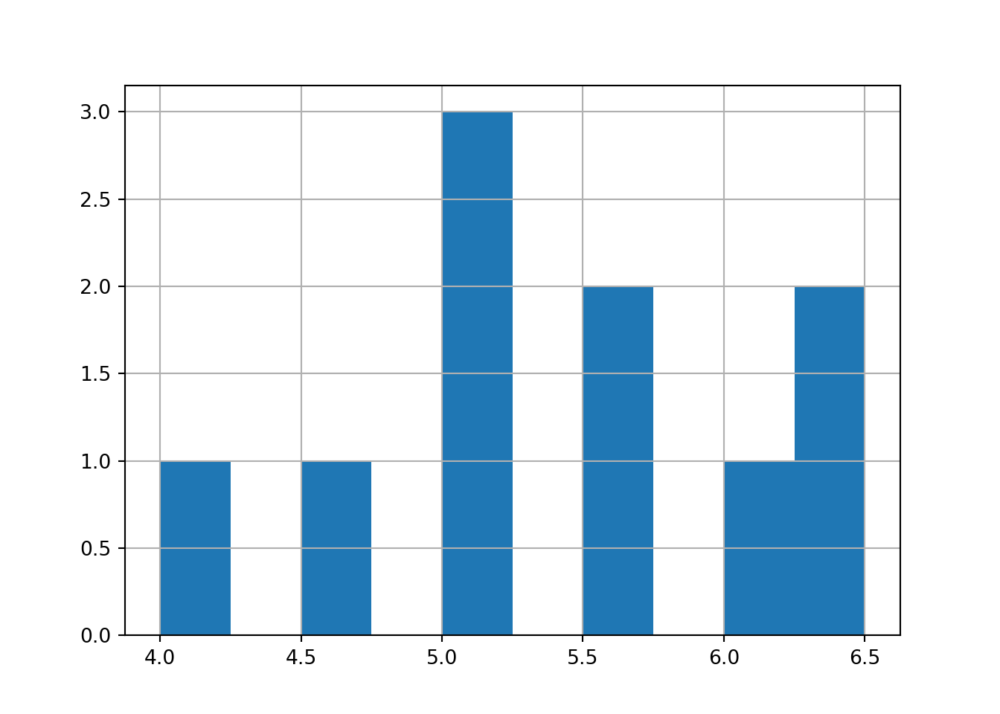

# Coding in Python


Welcome to Posit Cloud! You made it! This document will introduce you to how to start coding in Python using Posit Cloud. We will use the Python language frequently to conduct analyses and visualization.

```
Hello world! We are coding in Python!

```

<br>
<br>

## Getting Started {-}

### Making a Posit Cloud account {-}

We'll be using Posit Cloud, a browser-based environment you can access from any computer. To get set up, follow your course setup guide, then open the project for this workshop.

### Using Python for the First Time {-}

1. For a quick visual orientation, take a peek at the image below.
2. Read and follow along with the instructions on this page. Type the tutorial code and run it in your Python session.

<div class="figure" style="text-align: center">

<p class="caption">(\#fig:graphic_py_1)Visual Intro to Using Posit Cloud</p>
</div>

<br>
<br>

## Introduction to `Python`

Your project includes a Python script file (its name ends in `.py`). It contains two kinds of text:

1. code - instructions to our calculator
2. comments - any text that immediately follows a `#` sign


```python
# For example,
# Comments are ignored by the calculator, so we can write notes.
```

Notice: the IDE has four panes, including the editor, console, environment/history, and files. The console shows outputs from Python (or R).

To create a new script, go to File >> New File >> Text File (or Python Script), then save it and name it.

<div class="figure" style="text-align: center">

<p class="caption">(\#fig:image_py_1_1)Open New Script</p>
</div>
<div class="figure" style="text-align: center">

<p class="caption">(\#fig:image_py_1_2)Save New Script as a .py file!</p>
</div>

Let's learn to use Python!

## Basic Calculations in Python

Try highlighting the following and pressing Ctrl+Enter, or click Run.

Addition:


```python
1 + 5
```

```
## 6
```

Subtraction:


```python
5 - 2
```

```
## 3
```

Multiplication:


```python
2 * 3
```

```
## 6
```

Division:


```python
15 / 5
```

```
## 3.0
```

Exponents:


```python
2 ** 2
```

```
## 4
```

Square roots:


```python
16 ** 0.5
```

```
## 4.0
```

Order of operations still applies. Use parentheses to control order:


```python
2 * 2 - 5
```

```
## -1
```


```python
2 * (2 - 5)
```

```
## -6
```

<br>
<br>

---

## Learning Check 1 {.unnumbered .LC}

**Question**

Try calculating something wild in Python! Solve for `x` below using the commands above.

1. \( x = \sqrt{ (\frac{2 - 5}{5})^{4} } \)
2. \( x = (1 - 7)^{2} \times 5 - \sqrt{49} \)
3. \( x = 2^{2} + 2^{2} \times 2^{2} - 2^{2} \div 2^{2} \)

<br>
<br>

<details><summary>**[View Answer!]**</summary>


```python
((2 - 5) / 5) ** 4
```

```
## 0.1296
```

```python
(( (2 - 5) / 5) ** 4) ** 0.5
```

```
## 0.36
```


```python
(1 - 7) ** 2 * 5 - 49 ** 0.5
```

```
## 173.0
```


```python
2**2 + 2**2 * 2**2 - 2**2 / 2**2
```

```
## 19.0
```

</details>

---

<br>
<br>
<br>

## Types of Values in Python

Python commonly uses numeric values and character strings.


```python
15000
```

```
## 15000
```

```python
0.0005
```

```
## 0.0005
```

```python
-8222
```

```
## -8222
```

and


```python
"Coding!"
```

```
## 'Coding!'
```

```python
"Corgis!"
```

```
## 'Corgis!'
```

```python
"Coffee!"
```

```
## 'Coffee!'
```

<br>
<br>

## Types of Data in Python

### Values and Variables

Save a value as a named variable in memory.


```python
2
```

```
## 2
```

```python
"x"
```

```
## 'x'
```


```python
myvalue = 2
```


```python
myvalue
```

```
## 2
```

Do operations too!


```python
secondvalue = myvalue + 2
secondvalue
```

```
## 4
```

Overwrite variables as needed.


```python
myvalue = "I overwrote it!"
myvalue
```

```
## 'I overwrote it!'
```

Remove variables from memory if needed.


```python
del myvalue
del secondvalue
```

### Lists (like R vectors)

Lists hold multiple values.


```python
[1, 4, 8]
```

```
## [1, 4, 8]
```

and


```python
["Boston", "New York", "Los Angeles"]
```

```
## ['Boston', 'New York', 'Los Angeles']
```

Python will coerce types inside a list only if you mix them when converting to arrays or series. Keep types consistent when possible.

Do math element-wise using pandas Series:


```python
import pandas as p
p.Series([1,2,3,4]) * 2
p.Series([1,2,3,4]) + 2
```

### DataFrames with pandas

Bundle columns into a table using pandas DataFrame.


```python
import pandas as p
myheights = [4, 4.5, 5, 5, 5, 5.5, 5.5, 6, 6.5, 6.5]
mytowns = ["Gloucester", "Newburyport", "Provincetown", 
           "Plymouth", "Marblehead", "Chatham", "Salem", 
           "Ipswich", "Falmouth", "Boston"]
myyears = [1990, 1980, 1970, 1930, 1975, 1975, 1980, 1920, 1995, 2000]

sw = p.DataFrame({
  'height': myheights,
  'town': mytowns,
  'year': myyears
})
sw
```

Access a column (Series) with dot or bracket notation and do operations.


```python
sw.height
sw.height + 1
```

Update values as needed.


```python
# sw["height"] = sw["height"] + 1
```

<br>
<br>

---

## Learning Check 2 {.unnumbered .LC}

**Question**

How would you make your own DataFrame? Make a DataFrame with 3 columns and 4 rows. Make 1 numeric column and 2 character columns. How many rows are in that DataFrame?

<details><summary>**[View Answer!]**</summary>


```python
import pandas as p
mayhem = p.DataFrame({
  'dogs': ["Mocha", "Domino", "Latte", "Dot"],
  'types': ["corgi", "dalmatian", "corgi", "dalmatian"],
  'treats_per_year': [5000, 3000, 2000, 10000]
})
mayhem
```

</details>

---

<br>
<br>

## Common Functions in Python

We can compute descriptive statistics using pandas Series methods.


### Measures of Central Tendency


```python
sw.height.mean()
sw.height.median()
sw.height.sum()
```

### Measures of Dispersion


```python
sw.height.min()
sw.height.max()
sw.height.quantile(q=0.25)
sw.height.quantile(q=0.75)
sw.height.std()
sw.height.var()
```

### Other Good Functions


```python
len(sw.height)
sw.shape[1]  # number of columns
```

<br>

## Missing Data

Sometimes data include missing values. In pandas these are `NaN`. Many pandas functions ignore `NaN` by default.


```python
import pandas as p
mysw = p.Series([4, 4.5, 5, 5, 5, 5.5, 5.5, 6, 6.5, 6.5, None])
```


```python
mysw.mean()  # returns 5.35, skips None/NaN by default
```

```
## np.float64(5.35)
```

If you need to include missing values in a calculation, convert them or use numpy functions explicitly, but usually skipping them is desired.

<br>
<br>

---

## Learning Check 3 {.unnumbered .LC}

**Question**

Recreate the table below as a pandas DataFrame named `jp`, then answer the questions.


|town          | seawall_m| wave_m|
|:-------------|---------:|------:|
|Kuji South    |      12.0|   14.5|
|Fudai         |      15.5|   18.4|
|Taro          |      13.7|   16.3|
|Miyako        |       8.5|   11.8|
|Yamada        |       6.6|   10.9|
|Ohtsuchi      |       6.4|   15.1|
|Tohni         |      11.8|   21.0|
|Yoshihama     |      14.3|   17.2|
|Hirota        |       6.5|   18.3|
|Karakuwa East |       6.1|   14.4|
|Onagawa       |       5.8|   18.0|
|Souma         |       6.2|   14.5|
|Nakoso        |       6.2|    7.7|

1. Reproduce this table as a DataFrame named `jp`.
2. How much greater was the mean tsunami height than the mean seawall height?
3. Which varied more across towns: seawall height or tsunami height? By how much?

<br>
<br>

<details><summary>**[View Answer!]**</summary>


```python
import pandas as p
jp = p.DataFrame({
  'town': ["Kuji South", "Fudai", "Taro", "Miyako", "Yamada", "Ohtsuchi", "Tohni", 
           "Yoshihama", "Hirota", "Karakuwa East", "Onagawa", "Souma", "Nakoso"],
  'seawall_m': [12.0, 15.5, 13.7, 8.5, 6.6, 6.4, 11.8, 14.3, 6.5, 6.1, 5.8, 6.2, 6.2],
  'wave_m': [14.5, 18.4, 16.3, 11.8, 10.9, 15.1, 21.0, 17.2, 18.3, 14.4, 18.0, 14.5, 7.7]
})
jp
```


```python
jp.wave_m.mean()
jp.seawall_m.mean()
jp.wave_m.mean() - jp.seawall_m.mean()
```


```python
jp.wave_m.std()
jp.seawall_m.std()
jp.wave_m.std() - jp.seawall_m.std()
```

</details>

---

<br>
<br>

## Packages

### Installing packages

Use `pip` to install packages. Do this once per environment.


```python
%pip install pandas plotnine dfply
```

### Importing packages


```python
import pandas as p
from plotnine import *
from dfply import *
```

<br>
<br>

## The Pipeline {-}

In Python we can use dfply's pipeline operator `>>` to connect data to functions. This reduces parentheses and keeps sequences readable. *But it is not as usable as the pipe operator in R. It can only pipe dataframes to common dfply / dplyr functions like `select`, `mutate`, `summarize`, etc.*


```python
from dfply import *
sw >> select(X.height)
sw >> mutate(y = X.height ** X.height)
sw >> summarize(mean_value = mean(X.height))
```

<br>
<br>

## Visualizing Data with Histograms

We can visualize with `matplotlib`/`pandas`, or use `plotnine` (a Python port of `R`'s `ggplot2`) to develope detailed, customized visuals.

### pandas/matplotlib


```python
import pandas as p
allsw = p.DataFrame({
  'height': [4, 4.5, 5, 5, 5.5, 5.5, 5.5, 6, 6, 6.5,
             4, 4, 4, 4, 4.5, 4.5, 4.5, 5, 5, 6,
             5.5, 6, 6.5, 6.5, 7, 7, 7, 7.5, 7.5, 8],
  'states': ["MA"]*10 + ["RI"]*10 + ["ME"]*10
})
allsw.height.hist()
```

### `geom_histogram()` in `plotnine`


```python
from plotnine import *
(ggplot(allsw, aes(x='height')) +
 geom_histogram(color="white", fill="steelblue", binwidth=0.5) +
 labs(x="Seawall Height", y="Frequency (# of cities)"))
```

Facet by state:


```python
(ggplot(allsw, aes(x='height')) +
 geom_histogram(color="white", fill="steelblue", binwidth=0.5) +
 labs(x="Seawall Height", y="Frequency (# of cities)") +
 facet_wrap('~states'))
```

<br>
<br>

---

## Learning Check 4 {.unnumbered .LC}

**Question**

Using a list named `sw`, draw a histogram of the seawall heights: 4.5, 5, 5.5, 5, 5.5, 6.5, 6.5, 6, 5, 4. Use pandas or plotnine.

<details><summary>**[View Answer!]**</summary>


```python
import pandas as p
sw = [4.5, 5, 5.5, 5, 5.5, 6.5, 6.5, 6, 5, 4]
p.Series(sw).hist()
```



</details>

---

## Learning Check 5 {.unnumbered .LC}

**Question**

Make a histogram of `jp['seawall_m']` from Learning Check 3 using (1) pandas and (2) plotnine.

<details><summary>**[View Answer!]**</summary>


```python
jp.seawall_m.hist()
```


```python
(ggplot(jp, aes(x='seawall_m')) + geom_histogram())
```

</details>

---

<br>
<br>
<br>

## Conclusion {-}

### Next Steps {-}

We'll keep building skills:

- working with data types in Python
- calculating meaningful statistics in Python
- visualizing meaningful trends in Python

<br>

### Advice {-}

- Clear variables as needed with `del` or restart the session.
- Clear console outputs and save often.
- Download or upload files from the Files pane as needed.

You'll be a rockstar at using Python in no time! Stay tuned for our next Workshop!

<br>

### Troubleshooting {-}

- If your session freezes, use Session >> Restart Session.
- If that doesn't work, relaunch the project from the top banner menu.
- If that doesn't work, let me know!


