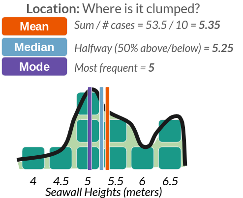
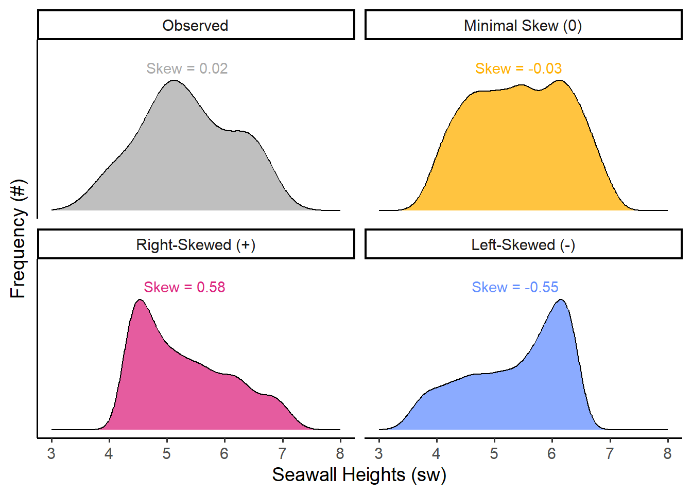
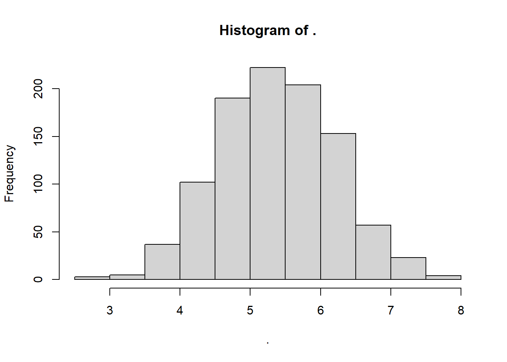
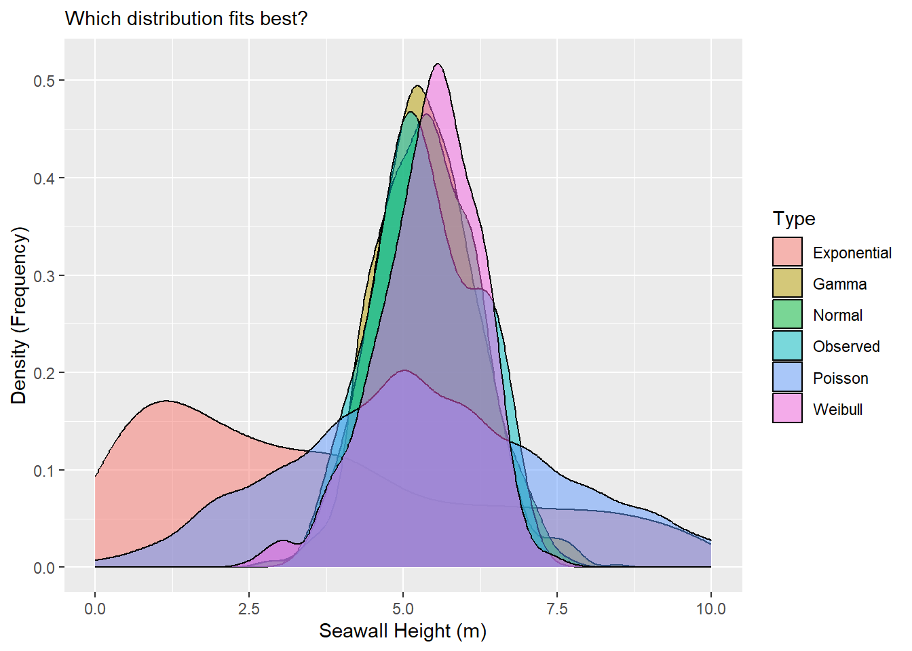

# Workshop: Distributions and Descriptive Statistics


<div class="figure">

<p class="caption">(\#fig:header)Yay Distributions!</p>
</div>

This tutorial will introduce you to how to code and analyses distributions in R, using descriptive statistics and visualization!

## Getting Started {-}

Please open up your Posit.Cloud project. Start a new R script (File >> New >> R Script). Save the R script as ```workshop_2.R```. And let's get started!

### Load Packages {-}

We're going to use extra functions from 3 packages today, including ```ggplot2```, ```dplyr``` (pronounced DIP-LER), and ```MASS```. [Note: Please be sure to load them first, otherwise your functions will *not work*.]


```r
library(ggplot2) # for visualization
library(dplyr) # for pipelines!
library(MASS) # for fitting distributions
```

## Distributions

Any vector can be expressed as a **distribution** (especially numeric vectors). A distribution stacks the values in a vector in order from lowest to highest to show the frequency of values. There are several ways to visualize distributions, including **histograms**, **density** plots, **violin plots**, **jitter plots**, **ribbon plots**, and more; the most common are **histograms** and **density** plots, which we will learn today.

For example, **Figure 2** shows our seawall vector from Workshop 1 in part **A** (left). In part **B** (right), that vector is shown as a distribution: its blocks are stacked to make a **histogram** (bars), while the distribution itself (line) is approximated by a curve, known as a **density function.** 

<div class="figure">

<p class="caption">(\#fig:seawall)Figure 2: Seawall Vector as a Distribution</p>
</div>

Any distribution can be described with 4 traits, shown above in part **C**. These include: **Size** (how many values are in it), **Location** (eg. where is it clumped), **Spread** (how much do values vary?), and **Shape** (eg. bell curve).

<br>
<br>

## Descriptive Statistics {.tabset .tabset-pills}

### What's a statistic?

What's a statistic? A statistic is a **single number** that **summarizes something about a sample**. That's it! No magic! Statistics is the process of making statistics (eg. many single numbers) so we can understand samples of data! They help people make decisions when faced with uncertainty. We'll learn several functions to make statistics that describe our distributions.

<table class=" lightable-classic lightable-striped" style='font-family: "Arial Narrow", "Source Sans Pro", sans-serif; width: auto !important; margin-left: auto; margin-right: auto;'>
 <thead>
  <tr>
   <th style="text-align:left;"> Trait </th>
   <th style="text-align:left;"> Meaning </th>
   <th style="text-align:left;"> Type </th>
   <th style="text-align:left;"> Functions </th>
  </tr>
 </thead>
<tbody>
  <tr>
   <td style="text-align:left;"> Size </td>
   <td style="text-align:left;"> How many values? </td>
   <td style="text-align:left;"> statistics </td>
   <td style="text-align:left;"> length() </td>
  </tr>
  <tr>
   <td style="text-align:left;"> Location </td>
   <td style="text-align:left;"> Where is it clumped? </td>
   <td style="text-align:left;"> statistics </td>
   <td style="text-align:left;"> mean(), median() </td>
  </tr>
  <tr>
   <td style="text-align:left;"> Spread </td>
   <td style="text-align:left;"> How much do values vary? </td>
   <td style="text-align:left;"> statistics </td>
   <td style="text-align:left;"> sd(), var(), range(), quantile() </td>
  </tr>
  <tr>
   <td style="text-align:left;"> Shape </td>
   <td style="text-align:left;"> What shape does it resemble? </td>
   <td style="text-align:left;"> distributions </td>
   <td style="text-align:left;"> rnorm(), rbinom(), rpois(),<br>[skewness &amp; kurtosis - no functions] </td>
  </tr>
</tbody>
</table>

### Data

Below, we will learn several functions for describing Size, Location, and Spread in a distribution. (We'll get to shape in a minute.) To do this, we're going to use a data sample of seawalls, describing the height in meters of several cities' seawalls. Let's encode that vector below.


```r
# You could code it as a vector, save it as an object, then use your functions!
sw <- c(4.5, 5, 5.5, 5, 5.5, 6.5, 6.5, 6, 5, 4)
# View it
sw
```

```
##  [1] 4.5 5.0 5.5 5.0 5.5 6.5 6.5 6.0 5.0 4.0
```

### Size

#### Length

*How big is our sample?* Use ```length()``` on a vector to find the number of values in the vector ```sw``` we made in **LC1.**


```r
length(sw)
```

```
## [1] 10
```

### Location

**Where is our sample clumped?**

<div class="figure" style="text-align: center">

<p class="caption">(\#fig:unnamed-chunk-5)Figure 3: Statistics for Location</p>
</div>

#### Mean

Use ```mean()``` and ```median()``` to find the most central values. 


```r
sw %>% mean()
```

```
## [1] 5.35
```

#### Median


```r
sw %>% median()
```

```
## [1] 5.25
```

#### Mode

Fun fact: ```mode()``` doesn't work in R; it's huge pain. You have to use this code instead.


```r
sw %>% table() %>% sort(decreasing = TRUE)
```

```
## .
##   5 5.5 6.5   4 4.5   6 
##   3   2   2   1   1   1
```

### Spread (1)

**How much does our sample vary?**

<div class="figure" style="text-align: center">

<p class="caption">(\#fig:unnamed-chunk-9)Figure 4: Statistics for Spread</p>
</div>

#### Percentile

Use ```quantile()``` to check for any percentile in a vector, from 0 (min) to 0.5 (median) to 1 (max). If you have ```quantile()```, you don't need to remember ```min()```, ```max()```, ```range()```, or even ```median()```.


```r
sw %>% quantile(probs = 0) # min
```

```
## 0% 
##  4
```

```r
sw %>% quantile(probs = 1) # max
```

```
## 100% 
##  6.5
```

---

<br>
<br>

## Learning Check 1 {.unnumbered .LC}

**Question**

Your team took a series of air quality measurements from a sample of sensors across Ithaca. While there are 100 sensors in Ithaca, due to time limitations, you accessed just a random sample of sensors.

Air Quality Index scores: `12`, `24`, `50`, `35`, `36`, `37`, `40`, `25`, `28`, `30`, `32`, `28`

1. Please convert the following values into a **vector** named ```aqi```! 

2. What was the sample size of the vector?

3. What was the interquartile range of air quality measurements, meaning the 25th to 75th percentiles??

<details><summary>**[View Answer!]**</summary>
  
1. Please convert the following values into a **vector** named ```aqi```! 


```r
# Make a vector of air quality index scores...
aqi = c(12, 24, 50, 35, 36, 37, 40, 25, 28, 30, 32, 28)
```

2. What was the sample size of the vector?


```r
# Get the length of the vector...
length(aqi)
```

```
## [1] 12
```

3. What was the interquartile range of air quality measurements, meaning the 25th to 75th percentiles??


```r
# 25% of air quality measurements were at or below this value
quantile(aqi, probs = 0.25)
```

```
##   25% 
## 27.25
```

```r
# 75% of air quality measurements were at or below this value:
quantile(aqi, probs = 0.75)
```

```
##   75% 
## 36.25
```

</details>

---

<br>
<br>

### Spread (2)

#### Standard Deviation

But we can also evaluate how much our values vary from the mean *on average* - the standard deviation, often abbreviated as \( \sigma \) (sigma). This is written as:

$ \sigma = \sqrt{ \Sigma \frac{ (x_{i} - mean) }{ n - 1 } }  $

<div class="figure" style="text-align: center">

<p class="caption">(\#fig:unnamed-chunk-14)Figure 5: Standard Deviation, the ultimate Statistic for Spread</p>
</div>

We can calculate this 'by hand', or use the ```sd()``` function.


```r
# Calculating in R still faster than on your own!
sqrt( sum((sw - mean(sw))^2) / (length(sw) - 1) )
```

```
## [1] 0.8181958
```

```r
# Get the standard deviation by code!
sw %>% sd()
```

```
## [1] 0.8181958
```

#### Variance

Sometimes, we might want the variance, which is the standard deviation *squared*. This accentuates large deviations in a sample.


```r
# Get the variance!
sw %>% var()
```

```
## [1] 0.6694444
```

```r
sd(sw)^2
```

```
## [1] 0.6694444
```

```r
# See? var = sd^2!
```

#### Coefficient of Variation (CV)

We could also calculate the coefficient of variation (CV), meaning how great a share of the mean does that average variation constitute? (Also put, how many times does the mean fit into the standard deviation.)


```r
sd(sw) / mean(sw)
```

```
## [1] 0.1529338
```

The standard deviation constitutes 15% of the size of the mean seawall height.

#### Standard Error (SE)

But these numbers don't have much meaning to us, unless we know seawalls *really well*. Wouldn't it be nice if we had a kind of uniform measure, that told us *how big is the variation in the data*, given how big the data is itself? Good news! We do! We can calculate the *sample size-adjusted variance* like so:


```r
var(sw) / length(sw)
```

```
## [1] 0.06694444
```

```r
# or 
sd(sw)^2 / length(sw)
```

```
## [1] 0.06694444
```

This means we could take this set of seawalls and compare it against samples of coastal infrastructure in Louisiana, in Japan, in Australia, and make *meaningful comparisons*, having adjusted for sample size. 

However, sample-size adjusted variance is a little bit of a funky concept, and so it's much more common for us to use the sample-size adjusted standard deviation, more commonly known as the **standard error**, or ```se```.

$ SE = \frac{ \sigma }{ \sqrt{n} } = \sqrt{ \frac{ \sigma^{2} }{ n  } } = \sqrt{  \frac{ variance}{ n }}  $  


```r
# Calculated as:
se <- sd(sw) / sqrt(length(sw))
# Or as:
se <- sqrt( sd(sw)^2 / length(sw)   )
# Or as:
se <- sqrt( var(sw) / length(sw))
# See standard error
se
```

```
## [1] 0.2587362
```

---

## Learning Check 2 {.unnumbered .LC}

**Question**
  
Suppose we collected data on 10 randomly selected chunks of cheese from a production line! We measured their **moisture in grams (g) in each product** We want to make sure we're making some quality cheesy goodness, so let's find out how much those moisture (cheesiness) levels vary! 

The moisture in our cheese weighed `5.52 g`, `5.71 g`, `5.06 g`, `5.10 g`, `4.98 g`, `5.50 g`, `4.81 g`, `5.55 g`, `4.74 g`, & `5.39 g`.

1. Please convert the following values into a **vector** named ```cheese```! 

2. What was the **average** moisture level in the sample?

3. How much did moisture levels **vary, on average?**

4. We need to compare these levels with cheese produced in Vermont, France, and elsewhere. What's the **coefficient of variance** and **standard error** for these moisture levels?


<details><summary>**[View Answer!]**</summary>
  
1. Please convert the following values into a **vector** named ```cheese```! 


```r
cheese <- c(5.52, 5.71, 5.06, 5.10, 4.98, 5.50, 4.81, 5.55, 4.74, 5.39)
```


2. What was the **average** moisture level in the sample?


```r
# Get mean of values
mean(cheese)
```

```
## [1] 5.236
```

3. How much did moisture levels **vary, on average?**


```r
# Get standard deviation of values. 
# Fun fact: this is how much they varied on average FROM THE AVERAGE
sd(cheese)
```

```
## [1] 0.3399085
```

4. We need to compare these levels with cheese produced in Vermont, France, and elsewhere. What's the **coefficient of variance** and **standard error** for these moisture levels?


```r
# Coefficient of variation
cv <- sd(cheese) / mean(cheese)
# Check it!
cv
```

```
## [1] 0.06491759
```


```r
# Standard Error
se <- sd(cheese) / sqrt(length(cheese))
# Check it
se
```

```
## [1] 0.1074885
```


```r
# When you're finished, remove extra data.
remove(cheese, se, cv)
```

</details>
  
---

<br>
<br>

### Shape

How then do we describe the *shape* of a distribution? We can use **skewness** and **kurtosis** for this. There's no direct function for skewness or kurtosis in `R`, but as you'll see below, we can quickly calculate it using the functions we already know.

#### Skewness

Skewness describes whether the bulk of the distribution sits to the left or right of the center, and its formula are written out below. It is commonly estimated using the formula on the left, while the formula on the right closely approximates it. (We're going to use the right-hand formula below, since it's a little cleaner.)

$$ Skewness = \frac{ \sum^{N}_{i=1}{(x - \bar{x})^{3}  / n } }{ [\sum^{N}_{i=1}{ (x - \bar{x})^{2} / n }]^{3/2} } \approx  \frac{ \sum^{N}_{i=1}{ (x - \bar{x})^{3} } }{ (n - 1) \times \sigma^{3} }  $$

When people say that a certain person's perspective is *skewed*, they mean, it's very far from the `mean`. In this case, we want to know, how skewed are the heights of seawalls *overall* compared to the mean? To figure this out, we'll need **4 ingredients:**

- $x_{i \to N}$: our vector of values (seawall heights! `sw`)

- $N$: the length of our vector (how many seawalls? `length(sw)`)

- $\bar{x}$: our mean value: (the mean seawall height? `mean(sw)`)

- $\sigma$: the standard deviation of our vector (how much do the seawall heights vary on average? `sd(sw)`)

Yeah! You just used them a bunch! So let's calculate skewness!

First, we measure `diff`, *how far is each value from the mean*?


```r
diff <- sw - mean(sw)
# Check it out!
diff
```

```
##  [1] -0.85 -0.35  0.15 -0.35  0.15  1.15  1.15  0.65 -0.35 -1.35
```

`diff` measures how far / how skewed each of these values ($x$) are from the mean $\bar{x}$). See the visual below!


Next, we're going to *cube* `diff`, to emphasize *extreme* differences from the mean Squaring would turn everything positive, but we care whether those differences are positive or negative, so we cube it instead.


```r
diff^3
```

```
##  [1] -0.614125 -0.042875  0.003375 -0.042875  0.003375  1.520875  1.520875
##  [8]  0.274625 -0.042875 -2.460375
```

Then, we're going to get a few helper values, like:


```r
# Get the sample-size
# To be conservative, we'll subtract 1; this happens often in stats
n <- length(sw) - 1

# Get the standard deviation
sigma <- sw %>% sd()
```

Now, we can calculate, on *average*, how big are these cubed differences?


```r
sum(diff^3) / n
```

```
## [1] 0.01333333
```

Well, that's nifty, how do we compare this funky number to other samples? We're going to need to put it in terms of a common unit, a *"standard"* unit - like the standard deviation! Plus, we'll have to *cube* the standard deviation, so that it's in the same terms as our numerator $diff^{3}$.


```r
skew <- sum(diff^3) / ( n * sigma^3) 
# Check it!
skew
```

```
## [1] 0.0243426
```

Voila! A standardized measure you can use to compare the skew of our sample of seawalls to any other sample! For comparison, here are a few *other* values of skew we might possibly get.




<br>
<br>

#### Kurtosis

Kurtosis describes how tightly bound the distribution is around the mean. Is it extremely pointy, with a narrow distribution (high kurtosis), or does it span wide (low kurtosis)? We can estimate it using the formula on the left, and the formula on the right is approximately the same.

$$ Kurtosis = \frac{ \sum^{N}_{i=1}{(x - \bar{x})^{4}  / n } }{ [\sum^{N}_{i=1}{ (x - \bar{x})^{2} / n }]^2 } \approx  \frac{ \sum^{N}_{i=1}{ (x - \bar{x})^{4} } }{ (n - 1) \times \sigma^{4} }  $$

Like skew, we calculate how far each value is from the mean, *but* we take those differences to the 4th power ($(x - \bar{x})^{4}$), which *hyper-accentuates* any extreme deviations and returns only positive values. Then, we calculate the sample-size adjusted average of those differences. Finally, to measure it in a consistent unit comparable across distributions, we divide by the standard deviation taken to the 4th power; the powers in the numerator and denominator then more-or-less cancel each other out.


```r
moments::skewness(sw)
```

```
## [1] 0.02565935
```

```r
# 0.2565
x <- sw

sum(   (x - mean(x))^3  ) / ((length(x) - 1) *sd(x)^3)
```

```
## [1] 0.0243426
```

```r
a <- sum(  (x - mean(x))^3 ) / length(x)

b <- (sum( (x - mean(x))^2 ) / length(x))^(3/2)

a/b
```

```
## [1] 0.02565935
```

```r
# 0.256
```


```r
# Get the differences again
diff <- sw - mean(sw)

# And take them to the fourth power
diff^4
```

```
##  [1] 0.52200625 0.01500625 0.00050625 0.01500625 0.00050625 1.74900625
##  [7] 1.74900625 0.17850625 0.01500625 3.32150625
```

They're all positive! 

Next, same as above, we'll get the conservative estimate of the sample size (n - 1) and the standard deviation.


```r
# Get the sample-size
# To be conservative, we'll subtract 1; this happens often in stats
n <- length(sw) - 1

# Get the standard deviation
sigma <- sw %>% sd()
```

So when we put it all together...


```r
kurt <- sum(diff^4) / ( n * sigma^4)
# Check it!
kurt
```

```
## [1] 1.875851
```

We can measure kurtosis! A pretty normal bell curve has a kurtosis of about `3`, so our data doesn't demonstrate much kurtosis. Kurtosis ranges from 0 to infinity (it is always positive), and the higher it goes, the pointier the distribution!


Finally, just a heads up: As mentioned above, there are a few different formulas floating around there for skewness and kurtosis, so don't be too surprised if your numbers vary when calculating it in one package versus another versus by hand. (But, if the numbers are extremely different, that's probably a sign something is up.)

<br>
<br>


---

## Learning Check 3 {.unnumbered .LC}

A contractor is concerned that the majority of seawalls in her region might skew lower than their region's vulnerability to storms requires. Assume (hypothetically) that our sample's seawalls are the appropriate height for our level of vulnerability, and that both regions share the same level of vulnerability. 

- The `mean` seawall in her region is about the same height as in our sample (`~5.35`), but how do the `skewness` and `kurtosis` of her region's seawalls compare to our sample? 

- Her region has 12 seawalls! Their height (in meters) are 4.15, 4.35, 4.47, 4.74, 4.92, 5.19, 5.23, 5.35, 5.55, 5.70, 5.78, & 7.16. 

**Question**

Calculate these statistics and interpret your results in a sentence or two.

<details><summary>**[View Answer!]**</summary>


```r
# Make a vector of these 12 seawalls
x <- c(4.15, 4.35, 4.47, 4.74, 4.92, 5.19, 5.23, 5.35, 5.55, 5.70, 5.78, 7.16)

# Calculate skewness
skewness <- sum( (x - mean(x))^3) / ((length(x) - 1) * sd(x)^3)

# Calculate Kurtosis
kurtosis <- sum( (x - mean(x))^4) / ((length(x) - 1) * sd(x)^4)

# View them!
c(skewness, kurtosis)
```

```
## [1] 0.9016585 3.5201492
```

- Her region's seawalls are somewhat positively, right skewed, with a skewness of about `+0.90`. This is much more skewed than our hypothetical area's seawalls, which are skewed at just `+0.02`. 

- But, her region's seawalls' traits are much more closely clustered around the mean than ours, with a kurtosis of `3.52` compared to our `1.88`. 

- Since both hypothetical regions have comparable levels of vulnerability to storm surges, her region's seawalls do appear to skew low.


</details>
  
---

<br>
<br>

## Simulating Distributions

Finally, to describe **shape**, we need some shapes to compare our distributions to. Fortunately, the ```rnorm()```, ```rbinom()```, ```rpois()```, and ```rgamma()``` functions allow us to draw the shapes of several common distributions. **Table 2** shows the shape of these distributions, and their ranges.

<table class=" lightable-classic lightable-striped" style='font-family: "Arial Narrow", "Source Sans Pro", sans-serif; width: auto !important; margin-left: auto; margin-right: auto;'>
<caption>(\#tab:w2_table2)Table 2: Example Distributions</caption>
 <thead>
  <tr>
   <th style="text-align:left;"> Distributions </th>
   <th style="text-align:left;"> Span </th>
   <th style="text-align:left;"> Function </th>
   <th style="text-align:left;"> Parameters </th>
   <th style="text-align:left;"> Example </th>
   <th style="text-align:left;"> Resources </th>
  </tr>
 </thead>
<tbody>
  <tr>
   <td style="text-align:left;"> Normal </td>
   <td style="text-align:left;"> -Inf to +Inf </td>
   <td style="text-align:left;"> `rnorm()` </td>
   <td style="text-align:left;"> mean, sd </td>
   <td style="text-align:left;">  <svg xmlns="http://www.w3.org/2000/svg" xmlns:xlink="http://www.w3.org/1999/xlink" class="svglite" width="48.00pt" height="12.00pt" viewBox="0 0 48.00 12.00"><defs><style type="text/css">
    .svglite line, .svglite polyline, .svglite polygon, .svglite path, .svglite rect, .svglite circle {
      fill: none;
      stroke: #000000;
      stroke-linecap: round;
      stroke-linejoin: round;
      stroke-miterlimit: 10.00;
    }
    .svglite text {
      white-space: pre;
    }
  </style></defs><rect width="100%" height="100%" style="stroke: none; fill: none;"></rect><defs><clipPath id="cpMC4wMHw0OC4wMHwwLjAwfDEyLjAw"><rect x="0.00" y="0.00" width="48.00" height="12.00"></rect></clipPath></defs><g clip-path="url(#cpMC4wMHw0OC4wMHwwLjAwfDEyLjAw)">
</g><defs><clipPath id="cpMC4wMHw0OC4wMHwyLjg4fDEyLjAw"><rect x="0.00" y="2.88" width="48.00" height="9.12"></rect></clipPath></defs><g clip-path="url(#cpMC4wMHw0OC4wMHwyLjg4fDEyLjAw)"><rect x="0.53" y="11.62" width="1.77" height="0.043" style="stroke-width: 0.38; fill: #D3D3D3;"></rect><rect x="2.29" y="11.45" width="1.77" height="0.21" style="stroke-width: 0.38; fill: #D3D3D3;"></rect><rect x="4.06" y="10.85" width="1.77" height="0.81" style="stroke-width: 0.38; fill: #D3D3D3;"></rect><rect x="5.82" y="9.62" width="1.77" height="2.05" style="stroke-width: 0.38; fill: #D3D3D3;"></rect><rect x="7.59" y="8.25" width="1.77" height="3.41" style="stroke-width: 0.38; fill: #D3D3D3;"></rect><rect x="9.36" y="5.09" width="1.77" height="6.57" style="stroke-width: 0.38; fill: #D3D3D3;"></rect><rect x="11.12" y="3.22" width="1.77" height="8.44" style="stroke-width: 0.38; fill: #D3D3D3;"></rect><rect x="12.89" y="3.35" width="1.77" height="8.32" style="stroke-width: 0.38; fill: #D3D3D3;"></rect><rect x="14.66" y="6.08" width="1.77" height="5.59" style="stroke-width: 0.38; fill: #D3D3D3;"></rect><rect x="16.42" y="7.27" width="1.77" height="4.39" style="stroke-width: 0.38; fill: #D3D3D3;"></rect><rect x="18.19" y="9.66" width="1.77" height="2.00" style="stroke-width: 0.38; fill: #D3D3D3;"></rect><rect x="19.96" y="10.98" width="1.77" height="0.68" style="stroke-width: 0.38; fill: #D3D3D3;"></rect><rect x="21.72" y="11.58" width="1.77" height="0.085" style="stroke-width: 0.38; fill: #D3D3D3;"></rect><rect x="23.49" y="11.62" width="1.77" height="0.043" style="stroke-width: 0.38; fill: #D3D3D3;"></rect></g></svg>
</td>
   <td style="text-align:left;"> [Wiki](https://en.wikipedia.org/wiki/normal_distribution) </td>
  </tr>
  <tr>
   <td style="text-align:left;"> Poisson </td>
   <td style="text-align:left;"> 0, 1, 2, 3... </td>
   <td style="text-align:left;"> `rpois()` </td>
   <td style="text-align:left;"> lambda (mean) </td>
   <td style="text-align:left;">  <svg xmlns="http://www.w3.org/2000/svg" xmlns:xlink="http://www.w3.org/1999/xlink" class="svglite" width="48.00pt" height="12.00pt" viewBox="0 0 48.00 12.00"><defs><style type="text/css">
    .svglite line, .svglite polyline, .svglite polygon, .svglite path, .svglite rect, .svglite circle {
      fill: none;
      stroke: #000000;
      stroke-linecap: round;
      stroke-linejoin: round;
      stroke-miterlimit: 10.00;
    }
    .svglite text {
      white-space: pre;
    }
  </style></defs><rect width="100%" height="100%" style="stroke: none; fill: none;"></rect><defs><clipPath id="cpMC4wMHw0OC4wMHwwLjAwfDEyLjAw"><rect x="0.00" y="0.00" width="48.00" height="12.00"></rect></clipPath></defs><g clip-path="url(#cpMC4wMHw0OC4wMHwwLjAwfDEyLjAw)">
</g><defs><clipPath id="cpMC4wMHw0OC4wMHwyLjg4fDEyLjAw"><rect x="0.00" y="2.88" width="48.00" height="9.12"></rect></clipPath></defs><g clip-path="url(#cpMC4wMHw0OC4wMHwyLjg4fDEyLjAw)"><rect x="7.59" y="4.22" width="1.77" height="7.44" style="stroke-width: 0.38; fill: #D3D3D3;"></rect><rect x="9.36" y="11.66" width="1.77" height="0.00" style="stroke-width: 0.38; fill: #D3D3D3;"></rect><rect x="11.12" y="3.22" width="1.77" height="8.44" style="stroke-width: 0.38; fill: #D3D3D3;"></rect><rect x="12.89" y="11.66" width="1.77" height="0.00" style="stroke-width: 0.38; fill: #D3D3D3;"></rect><rect x="14.66" y="7.59" width="1.77" height="4.07" style="stroke-width: 0.38; fill: #D3D3D3;"></rect><rect x="16.42" y="11.66" width="1.77" height="0.00" style="stroke-width: 0.38; fill: #D3D3D3;"></rect><rect x="18.19" y="10.31" width="1.77" height="1.36" style="stroke-width: 0.38; fill: #D3D3D3;"></rect><rect x="19.96" y="11.66" width="1.77" height="0.00" style="stroke-width: 0.38; fill: #D3D3D3;"></rect><rect x="21.72" y="11.20" width="1.77" height="0.46" style="stroke-width: 0.38; fill: #D3D3D3;"></rect><rect x="23.49" y="11.66" width="1.77" height="0.00" style="stroke-width: 0.38; fill: #D3D3D3;"></rect><rect x="25.25" y="11.57" width="1.77" height="0.088" style="stroke-width: 0.38; fill: #D3D3D3;"></rect><rect x="27.02" y="11.66" width="1.77" height="0.00" style="stroke-width: 0.38; fill: #D3D3D3;"></rect><rect x="28.79" y="11.64" width="1.77" height="0.022" style="stroke-width: 0.38; fill: #D3D3D3;"></rect></g></svg>
</td>
   <td style="text-align:left;"> [Wiki](https://en.wikipedia.org/wiki/Poisson_distribution) </td>
  </tr>
  <tr>
   <td style="text-align:left;"> Gamma </td>
   <td style="text-align:left;"> 0.1, 2.5, 5.5, +Inf </td>
   <td style="text-align:left;"> `rgamma()` </td>
   <td style="text-align:left;"> shape, rate </td>
   <td style="text-align:left;">  <svg xmlns="http://www.w3.org/2000/svg" xmlns:xlink="http://www.w3.org/1999/xlink" class="svglite" width="48.00pt" height="12.00pt" viewBox="0 0 48.00 12.00"><defs><style type="text/css">
    .svglite line, .svglite polyline, .svglite polygon, .svglite path, .svglite rect, .svglite circle {
      fill: none;
      stroke: #000000;
      stroke-linecap: round;
      stroke-linejoin: round;
      stroke-miterlimit: 10.00;
    }
    .svglite text {
      white-space: pre;
    }
  </style></defs><rect width="100%" height="100%" style="stroke: none; fill: none;"></rect><defs><clipPath id="cpMC4wMHw0OC4wMHwwLjAwfDEyLjAw"><rect x="0.00" y="0.00" width="48.00" height="12.00"></rect></clipPath></defs><g clip-path="url(#cpMC4wMHw0OC4wMHwwLjAwfDEyLjAw)">
</g><defs><clipPath id="cpMC4wMHw0OC4wMHwyLjg4fDEyLjAw"><rect x="0.00" y="2.88" width="48.00" height="9.12"></rect></clipPath></defs><g clip-path="url(#cpMC4wMHw0OC4wMHwyLjg4fDEyLjAw)"><rect x="9.36" y="3.22" width="3.53" height="8.44" style="stroke-width: 0.38; fill: #D3D3D3;"></rect><rect x="12.89" y="8.37" width="3.53" height="3.29" style="stroke-width: 0.38; fill: #D3D3D3;"></rect><rect x="16.42" y="10.48" width="3.53" height="1.19" style="stroke-width: 0.38; fill: #D3D3D3;"></rect><rect x="19.96" y="11.34" width="3.53" height="0.32" style="stroke-width: 0.38; fill: #D3D3D3;"></rect><rect x="23.49" y="11.51" width="3.53" height="0.15" style="stroke-width: 0.38; fill: #D3D3D3;"></rect><rect x="27.02" y="11.61" width="3.53" height="0.054" style="stroke-width: 0.38; fill: #D3D3D3;"></rect><rect x="30.55" y="11.65" width="3.53" height="0.013" style="stroke-width: 0.38; fill: #D3D3D3;"></rect><rect x="34.09" y="11.65" width="3.53" height="0.013" style="stroke-width: 0.38; fill: #D3D3D3;"></rect><rect x="37.62" y="11.66" width="3.53" height="0.00" style="stroke-width: 0.38; fill: #D3D3D3;"></rect><rect x="41.15" y="11.66" width="3.53" height="0.00" style="stroke-width: 0.38; fill: #D3D3D3;"></rect><rect x="44.68" y="11.65" width="3.53" height="0.013" style="stroke-width: 0.38; fill: #D3D3D3;"></rect></g></svg>
</td>
   <td style="text-align:left;"> [Wiki](https://en.wikipedia.org/wiki/Gamma_distribution) </td>
  </tr>
  <tr>
   <td style="text-align:left;"> Exponential </td>
   <td style="text-align:left;"> same </td>
   <td style="text-align:left;"> `rexp()` </td>
   <td style="text-align:left;"> rate </td>
   <td style="text-align:left;">  <svg xmlns="http://www.w3.org/2000/svg" xmlns:xlink="http://www.w3.org/1999/xlink" class="svglite" width="48.00pt" height="12.00pt" viewBox="0 0 48.00 12.00"><defs><style type="text/css">
    .svglite line, .svglite polyline, .svglite polygon, .svglite path, .svglite rect, .svglite circle {
      fill: none;
      stroke: #000000;
      stroke-linecap: round;
      stroke-linejoin: round;
      stroke-miterlimit: 10.00;
    }
    .svglite text {
      white-space: pre;
    }
  </style></defs><rect width="100%" height="100%" style="stroke: none; fill: none;"></rect><defs><clipPath id="cpMC4wMHw0OC4wMHwwLjAwfDEyLjAw"><rect x="0.00" y="0.00" width="48.00" height="12.00"></rect></clipPath></defs><g clip-path="url(#cpMC4wMHw0OC4wMHwwLjAwfDEyLjAw)">
</g><defs><clipPath id="cpMC4wMHw0OC4wMHwyLjg4fDEyLjAw"><rect x="0.00" y="2.88" width="48.00" height="9.12"></rect></clipPath></defs><g clip-path="url(#cpMC4wMHw0OC4wMHwyLjg4fDEyLjAw)"><rect x="5.82" y="11.53" width="3.53" height="0.14" style="stroke-width: 0.38; fill: #D3D3D3;"></rect><rect x="9.36" y="3.22" width="3.53" height="8.44" style="stroke-width: 0.38; fill: #D3D3D3;"></rect><rect x="12.89" y="8.52" width="3.53" height="3.14" style="stroke-width: 0.38; fill: #D3D3D3;"></rect><rect x="16.42" y="10.39" width="3.53" height="1.27" style="stroke-width: 0.38; fill: #D3D3D3;"></rect><rect x="19.96" y="11.21" width="3.53" height="0.45" style="stroke-width: 0.38; fill: #D3D3D3;"></rect><rect x="23.49" y="11.57" width="3.53" height="0.095" style="stroke-width: 0.38; fill: #D3D3D3;"></rect><rect x="27.02" y="11.58" width="3.53" height="0.082" style="stroke-width: 0.38; fill: #D3D3D3;"></rect><rect x="30.55" y="11.66" width="3.53" height="0.00" style="stroke-width: 0.38; fill: #D3D3D3;"></rect><rect x="34.09" y="11.65" width="3.53" height="0.014" style="stroke-width: 0.38; fill: #D3D3D3;"></rect><rect x="37.62" y="11.66" width="3.53" height="0.00" style="stroke-width: 0.38; fill: #D3D3D3;"></rect><rect x="41.15" y="11.65" width="3.53" height="0.014" style="stroke-width: 0.38; fill: #D3D3D3;"></rect></g></svg>
</td>
   <td style="text-align:left;"> [Wiki](https://en.wikipedia.org/wiki/Exponential_distribution) </td>
  </tr>
  <tr>
   <td style="text-align:left;"> Weibull </td>
   <td style="text-align:left;"> same </td>
   <td style="text-align:left;"> `rweibull()` </td>
   <td style="text-align:left;"> shape, scale </td>
   <td style="text-align:left;">  <svg xmlns="http://www.w3.org/2000/svg" xmlns:xlink="http://www.w3.org/1999/xlink" class="svglite" width="48.00pt" height="12.00pt" viewBox="0 0 48.00 12.00"><defs><style type="text/css">
    .svglite line, .svglite polyline, .svglite polygon, .svglite path, .svglite rect, .svglite circle {
      fill: none;
      stroke: #000000;
      stroke-linecap: round;
      stroke-linejoin: round;
      stroke-miterlimit: 10.00;
    }
    .svglite text {
      white-space: pre;
    }
  </style></defs><rect width="100%" height="100%" style="stroke: none; fill: none;"></rect><defs><clipPath id="cpMC4wMHw0OC4wMHwwLjAwfDEyLjAw"><rect x="0.00" y="0.00" width="48.00" height="12.00"></rect></clipPath></defs><g clip-path="url(#cpMC4wMHw0OC4wMHwwLjAwfDEyLjAw)">
</g><defs><clipPath id="cpMC4wMHw0OC4wMHwyLjg4fDEyLjAw"><rect x="0.00" y="2.88" width="48.00" height="9.12"></rect></clipPath></defs><g clip-path="url(#cpMC4wMHw0OC4wMHwyLjg4fDEyLjAw)"><rect x="7.59" y="11.58" width="1.77" height="0.083" style="stroke-width: 0.38; fill: #D3D3D3;"></rect><rect x="9.36" y="3.22" width="1.77" height="8.44" style="stroke-width: 0.38; fill: #D3D3D3;"></rect><rect x="11.12" y="6.91" width="1.77" height="4.75" style="stroke-width: 0.38; fill: #D3D3D3;"></rect><rect x="12.89" y="9.14" width="1.77" height="2.52" style="stroke-width: 0.38; fill: #D3D3D3;"></rect><rect x="14.66" y="9.68" width="1.77" height="1.98" style="stroke-width: 0.38; fill: #D3D3D3;"></rect><rect x="16.42" y="10.51" width="1.77" height="1.16" style="stroke-width: 0.38; fill: #D3D3D3;"></rect><rect x="18.19" y="10.88" width="1.77" height="0.78" style="stroke-width: 0.38; fill: #D3D3D3;"></rect><rect x="19.96" y="11.35" width="1.77" height="0.31" style="stroke-width: 0.38; fill: #D3D3D3;"></rect><rect x="21.72" y="11.31" width="1.77" height="0.35" style="stroke-width: 0.38; fill: #D3D3D3;"></rect><rect x="23.49" y="11.60" width="1.77" height="0.062" style="stroke-width: 0.38; fill: #D3D3D3;"></rect><rect x="25.25" y="11.60" width="1.77" height="0.062" style="stroke-width: 0.38; fill: #D3D3D3;"></rect><rect x="27.02" y="11.64" width="1.77" height="0.021" style="stroke-width: 0.38; fill: #D3D3D3;"></rect><rect x="28.79" y="11.62" width="1.77" height="0.041" style="stroke-width: 0.38; fill: #D3D3D3;"></rect><rect x="30.55" y="11.62" width="1.77" height="0.041" style="stroke-width: 0.38; fill: #D3D3D3;"></rect><rect x="32.32" y="11.64" width="1.77" height="0.021" style="stroke-width: 0.38; fill: #D3D3D3;"></rect><rect x="34.09" y="11.64" width="1.77" height="0.021" style="stroke-width: 0.38; fill: #D3D3D3;"></rect></g></svg>
</td>
   <td style="text-align:left;"> [Wiki](https://en.wikipedia.org/wiki/Weibull_distribution) </td>
  </tr>
  <tr>
   <td style="text-align:left;"> Binomial </td>
   <td style="text-align:left;"> 0 vs. 1 </td>
   <td style="text-align:left;"> `rbinom()` </td>
   <td style="text-align:left;"> probability </td>
   <td style="text-align:left;">  <svg xmlns="http://www.w3.org/2000/svg" xmlns:xlink="http://www.w3.org/1999/xlink" class="svglite" width="48.00pt" height="12.00pt" viewBox="0 0 48.00 12.00"><defs><style type="text/css">
    .svglite line, .svglite polyline, .svglite polygon, .svglite path, .svglite rect, .svglite circle {
      fill: none;
      stroke: #000000;
      stroke-linecap: round;
      stroke-linejoin: round;
      stroke-miterlimit: 10.00;
    }
    .svglite text {
      white-space: pre;
    }
  </style></defs><rect width="100%" height="100%" style="stroke: none; fill: none;"></rect><defs><clipPath id="cpMC4wMHw0OC4wMHwwLjAwfDEyLjAw"><rect x="0.00" y="0.00" width="48.00" height="12.00"></rect></clipPath></defs><g clip-path="url(#cpMC4wMHw0OC4wMHwwLjAwfDEyLjAw)">
</g><defs><clipPath id="cpMC4wMHw0OC4wMHwyLjg4fDEyLjAw"><rect x="0.00" y="2.88" width="48.00" height="9.12"></rect></clipPath></defs><g clip-path="url(#cpMC4wMHw0OC4wMHwyLjg4fDEyLjAw)"><rect x="9.36" y="3.22" width="0.71" height="8.44" style="stroke-width: 0.38; fill: #D3D3D3;"></rect><rect x="10.06" y="11.66" width="0.71" height="0.00" style="stroke-width: 0.38; fill: #D3D3D3;"></rect><rect x="10.77" y="11.66" width="0.71" height="0.00" style="stroke-width: 0.38; fill: #D3D3D3;"></rect><rect x="11.48" y="11.66" width="0.71" height="0.00" style="stroke-width: 0.38; fill: #D3D3D3;"></rect><rect x="12.18" y="11.66" width="0.71" height="0.00" style="stroke-width: 0.38; fill: #D3D3D3;"></rect><rect x="12.89" y="11.66" width="0.71" height="0.00" style="stroke-width: 0.38; fill: #D3D3D3;"></rect><rect x="13.60" y="11.66" width="0.71" height="0.00" style="stroke-width: 0.38; fill: #D3D3D3;"></rect><rect x="14.30" y="11.66" width="0.71" height="0.00" style="stroke-width: 0.38; fill: #D3D3D3;"></rect><rect x="15.01" y="11.66" width="0.71" height="0.00" style="stroke-width: 0.38; fill: #D3D3D3;"></rect><rect x="15.72" y="3.22" width="0.71" height="8.44" style="stroke-width: 0.38; fill: #D3D3D3;"></rect></g></svg>
</td>
   <td style="text-align:left;"> [Wiki](https://en.wikipedia.org/wiki/Binomial_distribution) </td>
  </tr>
  <tr>
   <td style="text-align:left;"> Uniform </td>
   <td style="text-align:left;"> min to max </td>
   <td style="text-align:left;"> `runif()` </td>
   <td style="text-align:left;"> min, max </td>
   <td style="text-align:left;">  <svg xmlns="http://www.w3.org/2000/svg" xmlns:xlink="http://www.w3.org/1999/xlink" class="svglite" width="48.00pt" height="12.00pt" viewBox="0 0 48.00 12.00"><defs><style type="text/css">
    .svglite line, .svglite polyline, .svglite polygon, .svglite path, .svglite rect, .svglite circle {
      fill: none;
      stroke: #000000;
      stroke-linecap: round;
      stroke-linejoin: round;
      stroke-miterlimit: 10.00;
    }
    .svglite text {
      white-space: pre;
    }
  </style></defs><rect width="100%" height="100%" style="stroke: none; fill: none;"></rect><defs><clipPath id="cpMC4wMHw0OC4wMHwwLjAwfDEyLjAw"><rect x="0.00" y="0.00" width="48.00" height="12.00"></rect></clipPath></defs><g clip-path="url(#cpMC4wMHw0OC4wMHwwLjAwfDEyLjAw)">
</g><defs><clipPath id="cpMC4wMHw0OC4wMHwyLjg4fDEyLjAw"><rect x="0.00" y="2.88" width="48.00" height="9.12"></rect></clipPath></defs><g clip-path="url(#cpMC4wMHw0OC4wMHwyLjg4fDEyLjAw)"><rect x="5.82" y="8.69" width="1.77" height="2.97" style="stroke-width: 0.38; fill: #D3D3D3;"></rect><rect x="7.59" y="3.70" width="1.77" height="7.97" style="stroke-width: 0.38; fill: #D3D3D3;"></rect><rect x="9.36" y="3.75" width="1.77" height="7.91" style="stroke-width: 0.38; fill: #D3D3D3;"></rect><rect x="11.12" y="3.22" width="1.77" height="8.44" style="stroke-width: 0.38; fill: #D3D3D3;"></rect><rect x="12.89" y="4.07" width="1.77" height="7.59" style="stroke-width: 0.38; fill: #D3D3D3;"></rect><rect x="14.66" y="4.55" width="1.77" height="7.12" style="stroke-width: 0.38; fill: #D3D3D3;"></rect><rect x="16.42" y="4.86" width="1.77" height="6.80" style="stroke-width: 0.38; fill: #D3D3D3;"></rect><rect x="18.19" y="7.36" width="1.77" height="4.30" style="stroke-width: 0.38; fill: #D3D3D3;"></rect></g></svg>
</td>
   <td style="text-align:left;"> [Wiki](https://en.wikipedia.org/wiki/Continuous_uniform_distribution) </td>
  </tr>
</tbody>
</table>

*Note:* Wikipedia is actually a pretty fantastic source on distributions.

<br>

To determine what kind of distribution our vector has, we can visually compare it using **simulation**. We can compare our real observed distribution against random distributions to determine whether our data matches the shape of a normal vs. poisson distribution, for example.

### Finding Parameters for your Distribution

To do so, let's get some statistics from our data to help us visualize what a distribution with those traits would look like. As our raw data, let's use our vector of seawall heights ```sw```.


```r
# Let's remake again our vector of seawall heights
sw <- c(4.5, 5, 5.5, 5, 5.5, 6.5, 6.5, 6, 5, 4)
```

To simulate, you feed your simulator function (1) ```n``` values to draw and (2) any required statistics necessary for computing draws from that distribution. (For example, ```rnorm()``` requires the mean and standard deviation.) 

Fortunately, statisticians have figured out for us 2 ways to figure out what statistics to provide. 

1. There are a few equations called **method of moments estimators** that do a great job of estimating those statistics. We'll learn these below.

2. Alternatively, we can ask ```R``` to compute the values of those statistics using the ```MASS``` package's ```fitdistr()```. You can learn more about this optional add-on function in the **Appendix.**

<br>
<br>

### Common Distributions

#### Normal Distribution

```rnorm()``` randomly generates for us any number of values randomly sampled from a normal distribution. We just need to supply: (1) ```n``` values to draw, (2) the ```mean``` of that distribution, and (3) the ```sd``` of that distribution.


```r
# For example
mymean <- sw %>% mean()
mysd <- sw %>% sd()

# simulate!
mynorm <- rnorm(n = 1000, mean = mymean, sd = mysd)

# Visualize!
mynorm %>% hist()
```



What were our mean and standard deviation?


```r
mymean
```

```
## [1] 5.35
```

```r
mysd
```

```
## [1] 0.8181958
```

Neat!


#### Poisson Distribution

```rpois()``` randomly samples integers (eg. 0, 1, 2, 3) from a poisson distribution, based on ```lambda```, the average rate of occurrence. We can approximate that by taking the mean of ```sw```.


```r
mypois <- rpois(1000, lambda = mymean)

mypois %>% hist()
```


Results in a somewhat skewed distribution, bounded at zero.

Where's the mean `lambda`?


```r
mymean
```

```
## [1] 5.35
```


Excellent!


#### Gamma Distribution

```rgamma()``` randomly samples positive real numbers greater than zero from a gamma distribution. It's like the continuous version of ```rpois()```. It requires 2 paramters, ```shape``` and ```rate```. You can estimate these a couple of different ways, but a simple one is to use the **method of moments**, which says that: 

- ```shape``` \( \approx \frac{mean^{2}}{ variance} \).

- ```scale```  \( \approx \frac{variance}{ mean } \).


```r
# For shape, we want the rate of how much greater the mean-squared is than the variance.
myshape <- mean(sw)^2 / var(sw)

# For rate, we like to get the inverse of the variance divided by the mean.
myrate <-  1 / (var(sw) / mean(sw) )

# Simulate it!
mygamma <- rgamma(1000, shape = myshape, rate = myrate)

## View it!
mygamma %>% hist()
```


So what are the parameter values for this distribution?


```r
myshape
```

```
## [1] 42.7556
```

```r
myrate
```

```
## [1] 7.991701
```

Neat!


#### Exponential Distribution

```rexp()``` randomly simulates positive real numbers over zero from an [exponential distribution](https://en.wikipedia.org/wiki/Exponential_distribution). Here, the **method of moments** says:

- ```rate``` \( \approx \frac{ 1 }{ mean }) \)


```r
# We'll name this myrate2!
myrate_e <- 1 / mean(sw)

# Simulate it!
myexp <- rexp(n = 1000, rate = myrate_e)

# Visualize it!
myexp %>% hist()
```


So what's the rate `lambda` for our data, assuming an exponential distribution?


```r
myrate_e
```

```
## [1] 0.1869159
```


Pretty solid!


#### Weibull Distribution

```rweibull()``` randomly samples positive real numbers over zero too, but from a [Weibull distribution](https://en.wikipedia.org/wiki/Weibull_distribution). It requires a ```shape``` and ```scale``` parameter, but its **method of moments** equation is pretty complex. Once we get into Weibull distribution territory, we'll need to use an advanced concept called maximum likelihood estimation, with the `fitdistr()` from the `MASS` package. You can read more about it in the apppendix.


```r
# Estimate the shape and scale parameters for a weibull distribution
mystats <- sw %>% fitdistr(densfun = "weibull")

# Here, we're going to extract the estimate for shape
myshape_w <- mystats$estimate[1]

# and the estimate for scale
myscale_w <- mystats$estimate[2]

# simulate!
myweibull <- rweibull(n = 1000, shape = myshape_w, scale = myscale_w)

# View it!
myweibull %>% hist()
```


### Special Distributions

#### Binomial Distribution

Next, the binomial distribution is a bit of a special case, in that it's mostly only helpful for binary variables (with values 0 and 1). But let's try an example anyways. ```rbinom()``` randomly draws ```n``` simulated values from a set of provided values at a given probability (```prob```). It's usually used for drawing binary variables (0 and 1); a coin flip would have ```prob = 0.5```, or a 50-50 chance.


```r
rbinom(n = 10, size = 1, prob = 0.5)
```

```
##  [1] 1 1 1 0 0 0 1 0 0 1
```
To get a meaningful simulation, maybe we calculate the proportion of values that are greater than the ```mean```.


```r
# In how many cases was the observed value greater than the mean?
myprob <- sum(sw > mymean) / length(sw)

# Sample from binomial distribution with that probability
mybinom <- rbinom(1000, size = 1, prob = myprob)

# View histogram!
mybinom %>% hist()
```


#### Uniform Distribution

Finally, the uniform distribution is also a special case. The frequency of values in a uniform distribution is *more-or-less* **uniform**. It also *only spans the length of a specified interval* $a \to b$. A common range is `a = 0` to `b = 1`. So, the frequency of `1.5` in that interval would be... *zero*.


```r
# Simulate a uniform distribution ranging from 0 to 1
myunif <- runif(n = 1000, min = 0, max = 1)
# View histogram!
myunif %>% hist(xlim = c(-0.5,1.5))
```


<br>
<br>

## Comparing Distributions

Finally, we're going to want to outfit those vectors in nice data.frames (skipping ```rbinom()``` and `runif()`), and stack them into 1 data.frame to visualize. We can do this using the ```bind_rows()``` function from the ```dplyr``` package.


```r
# Using bind_rows(),
mysim <- bind_rows(
  # Make a bunch of data.frames, all with the same variable names,
  data.frame(x = sw, type = "Observed"),
  # and stack them!
  data.frame(x = mynorm, type = "Normal"),
  # and stack it!
  data.frame(x = mypois, type = "Poisson"),
  # Stack, stack, stack stack it!
  data.frame(x = mygamma, type = "Gamma"),
  # so many stacks!
  data.frame(x = myexp, type = "Exponential"),
  # so much data!!!!!!
  data.frame(x = myweibull, type = "Weibull")
)
```

Next, we can visualize those distributions using ```geom_density()``` in ggplot (or ```geom_histogram()```, really, if that floats your boat).


```r
# Let's write the initial graph and save it as an object
g1 <- ggplot(data = mysim, mapping = aes(x = x, fill = type)) +
  geom_density(alpha = 0.5) +
  labs(x = "Seawall Height (m)", y = "Density (Frequency)", 
       subtitle = "Which distribution fits best?", fill = "Type")

# Then view it!
g1
```


Personally, I can't read much out of that, so it would be helpful to narrow in the x-axis a bit. We can do that with ```xlim()```, narrowing to just between values ```0``` and ```10```.


```r
g1 +
  xlim(0,10)
```




Beautiful! Wow! It looks like the **Normal**, **Gamma**, and **Weibull** distributions all do a pretty excellent job of matching the observed distribution.

<br>
<br.


---

## Learning Check 4 {.unnumbered .LC}

**Question**
  
You've been recruited to evaluate the frequency of Corgi sightings in the Ithaca Downtown. A sample of 10 students each reported the number of corgis they saw last Tuesday in town. Using the method of moments (or ```fitdistr()``` for Weibull) and ```ggplot()```, find out which type of distribution best matches the observed corgi distribution!

Beth saw 5, Javier saw 1, June saw 10(!), Tim saw 3, Melanie saw 4, Mohammad saw 3, Jenny say 6, Yosuke saw 4, Jimena saw 5, and David saw 2.


<details><summary>**[View Answer!]**</summary>
  
First, let's get the stats.


```r
# Make distribution of Corgis
corgi <- c(5, 1, 10, 3, 4, 3, 6, 4, 5, 2)

# Compute statistics for distributions
corgi_mean <- mean(corgi)
corgi_sd <- sd(corgi)
corgi_shape <- mean(corgi)^2 / var(corgi)
corgi_rate <- 1 / (var(corgi) / mean(corgi) )
corgi_rate_e <- 1 / mean(corgi)

# For Weibull, use fitdistr() from MASS package
corgi_stats <- corgi %>% fitdistr(densfun = "weibull")
corgi_shape_w <- corgi_stats$estimate[1]
corgi_scale_w <- corgi_stats$estimate[2]
```

Next, let's bind them together.


```r
corgisim <- bind_rows(
  # Get observed vector
  data.frame(x = corgi, 
             type = "Observed"),
  # Get normal dist
  data.frame(x = rnorm(1000, mean = corgi_mean, sd = corgi_sd), 
             type = "Normal"),
  # Get poisson
  data.frame(x = rpois(1000, lambda = corgi_mean), 
             type = "Poisson"),
  # Get gamma
  data.frame(x = rgamma(1000, shape = corgi_shape, rate = corgi_rate), 
             type = "Gamma"),
  # Get exponential
  data.frame(x = rexp(1000, rate = corgi_rate_e), 
             type = "Exponential"),
  # Get weibull
  data.frame(x = rweibull(1000, shape = corgi_shape_w, scale = corgi_scale_w), 
             type = "Weibull")
)
```

Finally, let's visualize it!


```r
# Visualize!
ggplot(data = corgisim, mapping = aes(x = x, fill = type)) +
  geom_density(alpha = 0.5) +
  # Narrow it to 0 to 15 to suit plot
  xlim(0,15) +
  labs(x = "Corgi Sightings!", y = "Density (Frequency)")
```


Neat - looks like the Poisson, Gamma, and Weibull function match well, although the Poisson looks pretty odd!

</details>
  
---

<br>
<br>

## Conclusion {.unnumbered}

So now, you know how to use descriptive statistics in R, how to visualize and evaluate a distribution, and how to simulate several different types of distributions! You're well on your way to some serious stats for systems engineering!


