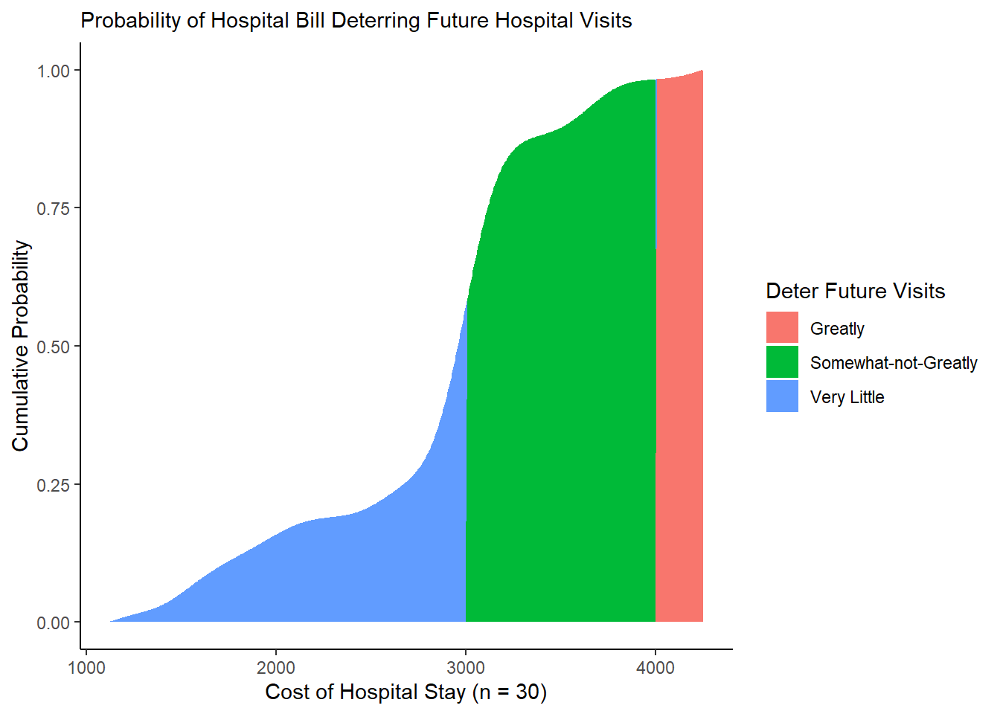
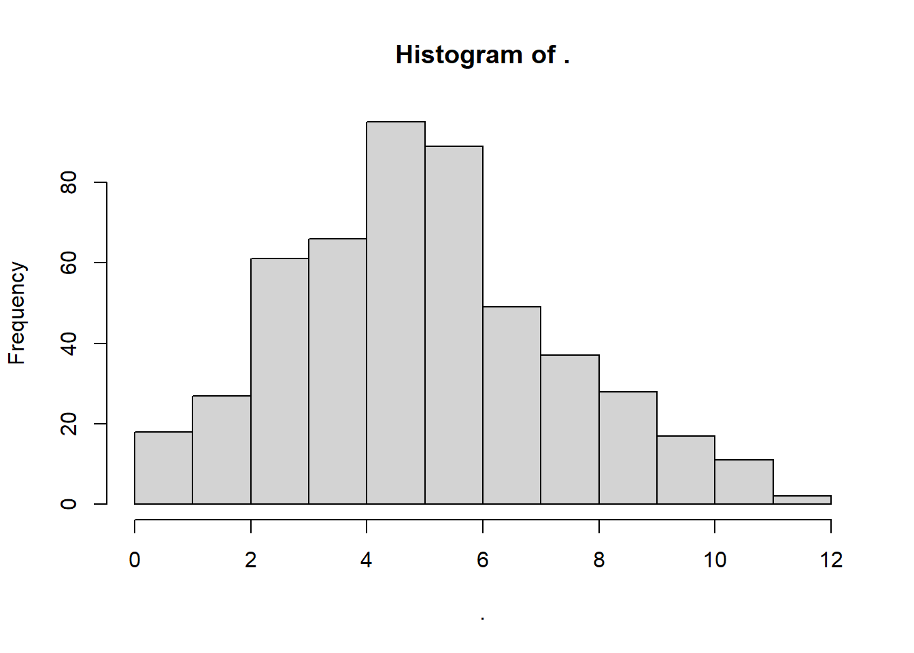

# Workshop: Probability


This tutorial will introduce you to **probability** and how to code and visualize probabilistic analyses in R!

<br>
<br>

## Getting Started {-}

Please open up your Posit.Cloud project. Start a new R script (File >> New >> R Script). Save the R script as ```workshop_3.R```. And let's get started!

### Load Packages {-}

In this tutorial, we're going to use more of the `dplyr` and `ggplot2` packages, plus the `broom` package and `mosaicCalc` package.


```r
library(dplyr)
library(ggplot2)
library(broom)
library(mosaicCalc)
```

### Key Functions {-}

We're going to use 3 functions a *lot* below. This includes `bind_rows()`, `mutate()`, and `summarize()`. So what are they?

- `bind_rows()`: stacks 2 or more `data.frames` on top of each other, matching columns by name.

- `mutate()`: creates or edits variables in a `data.frame`.

- `summarize()`: consolidates many rows of data into a single summary statistic (or a set of them.)

### Examples {-}

How might we use `bind_rows()`?


```r
mycoffee <- bind_rows(
  # Make first data.frame
  data.frame(
    # Containing these vectors style and price
    style = c("latte", "cappuccino", "americano"),
    price = c(5, 4, 3)),
  # Make second data.frame
  data.frame(
    # Containing these vectors style, price, and shop
    style = c("coffee", "hot cocoa"),
             price = c(3, 2),
             shop = c("Gimme Coffee", "Starbucks"))
)
# Notice how they stack, 
# but in first data.frame values,
# shop gets filled with NA, 
# since it wasn't in first dataframe
mycoffee
```

```
##        style price         shop
## 1      latte     5         <NA>
## 2 cappuccino     4         <NA>
## 3  americano     3         <NA>
## 4     coffee     3 Gimme Coffee
## 5  hot cocoa     2    Starbucks
```

How might we use `mutate()`?


```r
mycoffee <- mycoffee %>%
  # Add a new vector (must be of same length as data.frame)
  # vector is number of those drinks purchased
  mutate(purchased = c(5, 4, 10, 2, 1))
```

How might we use `summarize()`?


```r
mycoffee %>%
  # Summarize data.frame into one row
  summarize(
    # Calculate mean price of drinks
    mean_price = mean(price),
    # Calculate total drinks purchased
    total_purchased = sum(purchased))
```

```
##   mean_price total_purchased
## 1        3.4              22
```

Great! Now let's apply these to probability!


<br>
<br>

## Probability

**Probability** refers to how often a specify event is expected to occur, given a sufficient number of times. We're going to learn (and compute!) several common probability formula in `R`.

### Conditional Probability

**Conditional Probability**: probability of two events happening together reflects the probability of the first happening, times the probability of the second happening given that the first has already occurred. 

$$ P(AB) = P(A) \times P(B|A)$$
In other words, if two events are *interdependent*, you **multiply.**

<br>

### Example: Twizzlers

<div class="figure">

<p class="caption">(\#fig:img_twizzlers)Twizzlers vs. Red Vines</p>
</div>

You've been hired by the Hershey's Chocolate Company to investigate quality control on their Twizzlers sweets packaging line. At the start of an assembly line, you mixed in 8,000 Red Vines with a sample of 10,000 Twizzlers.

- What's the probability of a packer picking up a Red Vine on the assembly line?


```r
sweets <- data.frame(
# We know there are 10,000 twizzlers
  twizzlers = 10000,
# and 8,000 redvines
  redvines = 8000) %>%
  # So together, there are 18,000 sweets available
  # So there's a 8000-in-18,000 chance of picking a redvine
  mutate(prob_1 = redvines / (twizzlers + redvines))

# Check it!
sweets
```

```
##   twizzlers redvines    prob_1
## 1     10000     8000 0.4444444
```

- But then, what's the probability of a packer picking up 2 Red Vines in a row on the assembly line?


```r
sweets %>%
    # After picking 1 Red Vine,
  # there's now 1 less Red Vine in circulation
  mutate(
    # Subtract 1 redvine
    redvines = redvines - 1,
    # Recalculate total
    total = twizzlers + redvines) %>%
  # calculate probability of picking a second red vine now that 1 is gone
  mutate(prob_2 = redvines / total) %>%
  # Finally, multiply the first and second probability together
  # When it's this AND that, you multiply
  mutate(prob = prob_1 * prob_2)
```

```
##   twizzlers redvines    prob_1 total    prob_2      prob
## 1     10000     7999 0.4444444 17999 0.4444136 0.1975171
```

Alternatively, if two events are *independent* (mutually exclusive), meaning they do not affect each other, you *add* those probabilities together.

- You dump in a 1000 pieces of Black Licorice. If a packer picks up 2 sweets, what's the probability it's a piece of Black Licorice *or* Red Vines?


```r
sweets %>%
  # Add a column for black licorice
  mutate(black_licorice = 1000) %>%
  # Get total
  mutate(total = twizzlers + redvines + black_licorice) %>%
  # Recompute probabilities
  mutate(prob_1 = redvines / total,
         prob_2 = black_licorice / total) %>%
  # When it's this OR that, you add probabilities
  mutate(prob_3 = prob_1 + prob_2)
```

```
##   twizzlers redvines    prob_1 black_licorice total     prob_2    prob_3
## 1     10000     8000 0.4210526           1000 19000 0.05263158 0.4736842
```


```r
remove(mycoffee, sweets)
```


<br>
<br>

### Total Probabilities {-}

We can also examine *total probabilities.*

Any event $A$ that is mutually exclusive from event $E$ (can't happen at the same time) has the following probability...

$$ P(A) = \sum_{i=1}^{n}{P(A|E_{i}) \times P(E_{i}) } $$

### Example: Marbles! {-}

<div class="figure">

<p class="caption">(\#fig:img_marbles)So many marbles!</p>
</div>

You've got `3` bags ($E_{1 \to 3}$), each containing `3` marbles, each with a different split of red vs. blue marbles. If we choose a bag at random *and* sample a marble at random (2 mutually exclusive events), what's the probability that marble will be red ($P(A)$)?

I like to map these out, so I understand visually what all the possible pathways are. Here's a chart I made (using `mermaid`), where I've diagrammed each possible set of actions, like choosing Bag 1 then Marble *a* (1 pathway), choosing Bag 1 then Marble *b* (a second pathway), etc.  

If we look at the ties to the marbles, you'll see I labeled each tie to a red marble as `1` and each tie to a blue marble as `0`. If we add these pathways up, we'll get the `total probability`: `0.67` (aka `2/3`).

<div class="figure" style="text-align: center">

```{=html}
<div class="DiagrammeR html-widget html-fill-item" id="htmlwidget-6252c1a8b2c9b9f60b2d" style="width:100%;height:480px;"></div>
<script type="application/json" data-for="htmlwidget-6252c1a8b2c9b9f60b2d">{"x":{"diagram":"graph TD\n you[You]\n subgraph Bags\n b1[Bag 1]\n b2[Bag 2]\n b3[Bag 3]\n end\n subgraph Marbles\n b1m1((Marble <i>a<\/i>))\n b1m2((Marble <i>b<\/i>))\n b1m3((Marble <i>c<\/i>))\n style b1m1 fill:#FB52A5\n style b1m2 fill:#FB52A5\n style b1m3 fill:#FB52A5\n b2m1((Marble <i>d<\/i>))\n b2m2((Marble <i>e<\/i>))\n b2m3((Marble <i>f<\/i>))\n style b2m1 fill:#FB52A5\n style b2m2 fill:#84A3F5\n style b2m3 fill:#84A3F5\n b3m1((Marble <i>g<\/i>))\n b3m2((Marble <i>h<\/i>))\n b3m3((Marble <i>j<\/i>))\n style b3m1 fill:#84A3F5\n style b3m2 fill:#FB52A5\n style b3m3 fill:#FB52A5\n end\n you--> b1\n you--> b2\n you--> b3\n b1-->|1|b1m1\n b1-->|1|b1m2\n b1-->|1|b1m3\n b2-->|1|b2m1\n b2-->|0|b2m2\n b2-->|0|b2m3\n b3-->|0|b3m1\n b3-->|1|b3m2\n b3-->|1|b3m3"},"evals":[],"jsHooks":[]}</script>
```

<p class="caption">(\#fig:img_mermaid)Drawing Probability Diagrams</p>
</div>

But what if we *can't* diagram it out? Perhaps we're choosing from 100s of marbles, or we're limited on time! How would we solve this problem mathematically?

The key here is knowing that: 

- the blue marbles don't really matter 
- we need the probability of choosing a *bag*
- we need the probability of choosing a *red marble* in each bag.

Here's what we know:

1. There's an equal chance of choosing any bag of the 3 bags (because random). *(If 1 bag were on a really high shelf, then maybe the probabilities would be different, i.e. not random, but let's assume they're random this time.)*


```r
# there are 3 bags
n_bags <- 3

# So....
# In this case, P(Bag1) = P(Bag2) = P(Bag3)
# and P(Bag1) + P(Bag2) + P(Bag3) = 100% = 1.0

# 1/3 chance of picking Bag 1
# written P(Bag1)
pbag1 <- 1 / n_bags

# 1/3 chance of picking Bag 2
# written P(Bag2) 
pbag2 <- 1 / n_bags

# 1/3 chance of picking Bag 3
# written P(Bag3)
pbag3 <- 1 / n_bags

# Check it!
c(pbag1, pbag2, pbag3)
```

```
## [1] 0.3333333 0.3333333 0.3333333
```
2. There are 3 marbles in each bag.


```r
# Total marbles in Bag 1
m_bag1 <- 3
# Total marbles in Bag 2
m_bag2 <- 3
# Total marbles in Bag 3
m_bag3 <- 3
```

3. There are `3` red marbles in bag 1, `1` red marbles in bag 2, and `2` red marbles in bag 3.


```r
# So, we can calculate the percentages in each bag.

# percentage of red marbles in Bag 1
# written P(Red|Bag1)
pm_bag1 <- 3 / m_bag1

# percentage of red marbles in Bag 2
# written P(Red|Bag2)
pm_bag2 <- 1 / m_bag2

# percentage of red marbles in Bag 3
# written P(Red|Bag3)
pm_bag3 <- 2 / m_bag3

# Check it!
c(pm_bag1, pm_bag2, pm_bag3)
```

```
## [1] 1.0000000 0.3333333 0.6666667
```
4. Selecting Bag 1 and then selecting a Red Marble are *interdependent* events, so we multiply them.


```r
# For example
# P(Bag1 & Red) = P(Red|Bag1) * P(Bag1)
pm_bag1 * pbag1
```

```
## [1] 0.3333333
```

5. But each pathway (eg. Bag 1 x Marble A) is distinct and *independent* of the other pathways, so we can add them together.


```r
# P(Bag1 & Red) = P(Red|Bag1) * P(Bag1)
pm_bag1 * pbag1 + 
  # P(Bag2 & Red) = P(Red|Bag2) * P(Bag2)
  pm_bag2 * pbag2 + 
  # P(Bag3 & Red) = P(Red|Bag3) * P(Bag3)
  pm_bag3 * pbag3
```

```
## [1] 0.6666667
```
And that gives us the same answer: `0.67` or `2/3`.

However, that required making a lot of `objects` in `R`. Can we do this more succinctly using `vectors` and `data.frames`?

We could compute a bag-wise `data.frame`, where each row represents a choice (bag) from `event1`.


```r
bags <- data.frame(
  bag_id = 1:3,
  # For each bag, how many do you get to choose?
  bags = c(1, 1, 1),
  # For each bag, how many marbles do you get to choose?
  marbles = c(3, 3, 3),
  # For each bag, how many marbles are red?
  red = c(3, 1, 2)) %>%
  # Then, we can calculate the probability of...
  mutate(
    # choosing that bag out of all bags
    prob_bag = bags / sum(bags),
    # choosing red out of all marbles in that bag
    prob_red = red / marbles,
    # choosing BOTH that bag AND a red marble in that bag
    prob_bagred = prob_red * prob_bag)
```

Finally, we could just sum the joint probabilities all together.


```r
bags %>%
  summarize(prob_bagred = sum(prob_bagred))
```

```
##   prob_bagred
## 1   0.6666667
```

Much faster!


```r
# Let's remove this now unnecessary data
remove(bags, n_bags, 
       m_bag1, m_bag2, m_bag3, 
       pbag1, pbag2, pbag3,
       pm_bag1, pm_bag2, pm_bag3)
```


<br>
<br>


### Bayes Rule {-}

A cool trick, called Bayes' Rule, reveals that we can figure out a probability of interest that *depends* on other probabilities.

Let's say, we want to know, what's the probability of `OUTCOME` given `CONDITION`.

Bayes' Rule states that the probability of the `OUTCOME` occurring given `CONDITION` is equal to the *joint* probability of the Outcome and Condition both occurring, divided by the probability of the condition occurring.

$$ P(Outcome = 1| Condition = 1) = \frac{ P(Outcome = 1\ \& \  Condition = 1) }{ P(Condition = 1)} $$

Thanks to Conditional Probability and Total Probability tricks, we can break that down into quantities we can calculate.

$$ P(Outcome=1 | Condition=0) = \frac{ P(Condition=1|Outcome=1) \times P(Outcome=1) }{ \sum{ P(Condition | Outcome) } \times P(Outcome)} $$

$$ = \frac{ P(Condition=1|Outcome=1) \times P(Outcome=1) }{ P(Condition=1|Outcome=1) \times P(Outcome=1) + P(Condition=1|Outcome=0) \times P(Outcome=0)} $$

Let's define some terms:

- `posterior`: Posterior probability is the probability that the outcome occurs given that the condition occurs.

- `prior`: the probability that the outcome occurs, independent of anything else.

- `likelihood`: the probability that the condition occurs, given that the outcome occurs.

- `evidence`: the total probability that the condition does or does not occur.


<br>
<br>

### Example: Coffee Shop (Incomplete Information)  {-}

<div class="figure">

<p class="caption">(\#fig:img_coffee)Yay Coffee!</p>
</div>

A local coffee chain needs your help to analyze their supply chain issues. They know that their scones help them sell coffee, but does their coffee help them sell scones?

- Over the last week, when 7 customers bought scones, 3 went on to buy coffee.

- When 3 customers didn't buy scones, just 2 bought coffee.

- In general, 7 out of 10 of customers ever bought scones.

- What's the probability that a customer will buy a scone, given that they just bought coffee?


```r
# We want to know this
p_scone_coffee <- NULL

# But we know this!
p_coffee_scone <- 3/7
p_coffee_no_scone <- 2/3
p_scone <- 7/10
# AND
# If 7 out of 10 customers ever bought scones,
# then 3 out of 10 NEVER bought scones
p_no_scone <- 3 / 10
```

Using these 3~4 probabilities, we can deduce the *total* probability of coffee (the denominator), meaning whether you got coffee OR whether you didn't get coffee.


```r
# Total Prob of Coffee = Getting Cofee + Not getting coffee
p_coffee <- p_coffee_scone * p_scone + p_coffee_no_scone * p_no_scone
# Check it!
p_coffee
```

```
## [1] 0.5
```
So let's use `p_coffee` to get the probability of getting a scone given that you got coffee!


```r
p_scone_coffee <- p_coffee_scone * p_scone / p_coffee
```

It's magic! Bayes' Rule is helpful when we *don't* have complete information, and just have some raw percentages or probabilities. 

<br>
<br>

### Example: Coffee Shop (Complete Information) {-}

But, if we *do* have complete information, then we can actually *prove* Bayes' Rule quite quickly.

For example, say those percentages the shop owner gave us were actually meticulously tabulated by a barista. We talk to the barista, and she explains that she can tell us right away the proportion of folks who got a scone given that they got coffee. She shows us her spreadsheet of `orders`, listing for each customer, whether they got `coffee` and whether they got a `scone`.


```r
orders <- tibble(
  coffee = c("yes", "no", "yes", "no", "yes", "yes", "yes", "no", "no", "no"),
  scone = c("no", "no", "no", "yes", "yes", "yes", "yes", "yes", "yes", "yes"))
```

We can tabulate these quickly using `table()`, tallying up how many folks did this.


```r
orders %>% table()
```

```
##       scone
## coffee no yes
##    no   1   4
##    yes  2   3
```


```r
# Let's skip to the end and just calculate the proportion directly!
# Out of all people who got coffee, how many got scones?
orders %>% 
  summarize(p_scone_coffee = sum(scone == "yes" & coffee == "yes") / sum(coffee == "yes") )
```

```
## # A tibble: 1 × 1
##   p_scone_coffee
##            <dbl>
## 1            0.6
```

```r
# The end!
```


```r
# Now that we know this, let's prove that Bayes works.
orders %>% 
  summarize(
    # The goal (posterior)
    p_scone_coffee = sum(scone == "yes" & coffee == "yes") / sum(coffee == "yes"),
    # The data
    p_coffee_scone = sum(coffee == "yes" & scone == "yes") / sum(scone == "yes"),
    p_coffee_no_scone = sum(coffee == "yes" & scone == "no") / sum(scone == "no"),
    p_scone = sum(scone == "yes") / sum(coffee == "yes" | coffee == "no"),
    p_no_scone = sum(scone == "no") / sum(coffee == "yes" | coffee == "no"),
    # Now recalculate the goal, using the data we have collected.
    # Does 'bayes' equal 'p_scone_coffee'?
    bayes = p_coffee_scone * p_scone / (p_coffee_scone * p_scone + p_coffee_no_scone * p_no_scone))
```

```
## # A tibble: 1 × 6
##   p_scone_coffee p_coffee_scone p_coffee_no_scone p_scone p_no_scone bayes
##            <dbl>          <dbl>             <dbl>   <dbl>      <dbl> <dbl>
## 1            0.6          0.429             0.667     0.7        0.3   0.6
```

```r
# It should! And it does! Tada!
```


### Example: Movie Theatre Popularity {-}

You are the manager of a movie theatre, and you want to determine the popularity of different genres of movies among your customers. 

You have collected data on the genres of movies that customers choose to watch 

- Probability of a customer choosing an Action movie, P(Action) = `0.25`.
- Similarly, P(Comedy) = `0.30`.
- P(Drama) = `0.20`.
- P(Sci-Fi) = `0.15`.
- P(Horror) = `0.10`.

You also have information about the overall popularity of each genre in the market:

- Out of the customers who chose an Action movie, 60% also bought tickets for Comedy.
- Out of the customers who chose a Comedy movie, 40% also bought tickets for Drama.
- Out of the customers who chose a Drama movie, 25% also bought tickets for Sci-Fi.
- Out of the customers who chose a Science Fiction movie, 70% also bought tickets for Action.
- Out of the customers who chose a Horror movie, 20% also bought tickets for Drama.

You want to calculate the probability that a customer chooses a Drama movie given that they have already purchased a ticket.


```r
# We define the prior probabilities of customers choosing each genre based on the given problem statement.
P_action <- 0.25
P_comedy <- 0.30
P_drama <- 0.20
P_scifi <- 0.15
P_horror <- 0.10
# We define conditional probabilities that represent the likelihood of crossover purchases. 
# For example, the probability of choosing Action given that the customer chose Comedy is 60%.
conP_action_given_drama <- 0.00
conP_comedy_given_drama <- 0.25
conP_drama_given_drama <- 0.00
conP_scifi_given_drama <- 0.00
conP_horror_given_drama <- 0.20
# Specify the target genre
# Our target genre is Drama and we want to calculate the probability that a customer chooses a Drama movie given that they have already purchased a ticket.
target_genre <- "Drama"  # We can change this to our desired target genre
```


To calculate the probability that a customer chooses the target genre given a ticket purchase, let's use Bayes Rule!


```r
# We will be using Bayes' rule: P(Target Genre | Ticket Purchase) = P(Ticket Purchase | Target Genre) * P(Target Genre) / P(Ticket Purchase)
# We calculate P(Ticket Purchase | Target Genre) * P(Target Genre) as probability_given_purchase
# If target_genre is "Comedy," the switch function will select the conditional probability for choosing Comedy given a ticket purchase 
probability_given_purchase <- switch(
  target_genre,
  "Action" = conP_action_given_drama * P_action,
  "Comedy" = conP_comedy_given_drama * P_comedy,
  "Drama" = conP_drama_given_drama * P_drama,
  "SciFi" = conP_scifi_given_drama * P_scifi,
  "Horror" = conP_horror_given_drama * P_horror
)
# View it!
probability_given_purchase
```

```
## [1] 0
```
Next...


```r
# We will further calculate the total probability of a ticket purchase P(Ticket Purchase) as total_probability_purchase:
total_probability_purchase <- sum(
  conP_action_given_drama * P_action,
  conP_comedy_given_drama * P_comedy,
  conP_drama_given_drama * P_drama,
  conP_scifi_given_drama * P_scifi,
  conP_horror_given_drama * P_horror
)
# View it!
total_probability_purchase
```

```
## [1] 0.095
```

We want to calculate the probability that a customer chooses a Drama movie given that they have already purchased a ticket, thus target genre is Drama.


```r
# P(Target Genre | Ticket Purchase) <- P(Ticket Purchase | Target Genre) * P(Target Genre) / P(Ticket Purchase)
probability_target_genre_given_purchase <- probability_given_purchase / total_probability_purchase
# Let's print that using paste!
paste(
  "Probability that a customer chooses a", 
    target_genre, 
  "movie given a ticket purchase:", 
  probability_target_genre_given_purchase)
```

```
## [1] "Probability that a customer chooses a Drama movie given a ticket purchase: 0"
```


<br>
<br>

## Probability Functions

How then do we use probability in our statistical analyses of risk, performance, and other systems engineering concepts? 

Probability allows us to measure for any statistic (or parameter) `mu`, how **extreme** is that statistic? This is called *type II error*, measured by a `p`-value, the probability that a **more** extreme value occurred than our statistic. It's an extremely helpful benchmark. In order to evaluate how **extreme** it is, we need values to compare it to. We can do this using (1) an observed distribution, (2) making a probability function curve of the observed distribution, or (3) assuming the probability function of a hypothetical distribution.

### Example: Observed Distributions

<div class="figure">

<p class="caption">(\#fig:img_er)Figure 1. Your Local ER</p>
</div>

For example, a local hospital wants to make their health care services more affordable, given the surge in inflation. 

- They measured `n = 15` patients who stayed 1 night over the last 7 days, how much were they charged (before insurance)? Let's call this vector `obs` (for 'observed data'). 

- A 16th patient received a bill of `$3000` (above the national mean of ~`$2500`). We'll record this as `stat` below.


```r
# Let's record our vector of 15 patients
obs <- c(1126, 1493, 1528, 1713, 1912, 2060, 2541, 2612, 2888, 2915, 3166, 3552, 3692, 3695, 4248)
# And let's get our new patient data point to compare against
stat <- 3000
```

Here, we know the full observed distribution of values (`cost`), so we can directly compute the `p_value` from them, using the logical operator `>=`.


```r
# Which values of in vector obs were greater than or equal to stat?
obs >= stat
```

```
##  [1] FALSE FALSE FALSE FALSE FALSE FALSE FALSE FALSE FALSE FALSE  TRUE  TRUE
## [13]  TRUE  TRUE  TRUE
```

`R` interprets `TRUE == 1` & `FALSE == 0`, so we can take the `mean()` to get the percentage of values in `obs` greater than or equal to `stat`.


```r
# Get p-value, the probability of getting a value greater than or equal to stat
mean(obs >= stat)
```

```
## [1] 0.3333333
```

```r
# This means Total Probability, where probability of each cost is 1/n
sum(  (obs >= stat) / length(obs)   )
```

```
## [1] 0.3333333
```

Unfortunately, this only takes into account the exact values we observed (eg. \$1493), but it can't tell us anything about values we *didn't* observe (eg. \$1500). But logically, we know that the probability of getting a bill of $1500 should be pretty similar to a bill of \$1493. So how do we fill in the gaps?


<br>
<br>


### Observed Probability Density Functions

Above, we calculated the probability of getting a **more** extreme hospital bill based on a limited sample of points, but for more *precise* probabilities, we need to fill in the gaps between our observed data points.

- For a vector `x`, the probability density function is a **curve** providing the probability (`y`) of each value across the range of `x`.

- It shows the **relative frequency** (probability) of each *possible* value in the range. 

<br>

We can ask R to estimate the probability density function for any observed vector using `density()`. This returns the density (`y`) of a bunch of hypothetical values (`x`) matching our distribution's curve. We can access those results using the `broom` package, by `tidy()`-ing it into a data.frame.


```r
obs %>% density() %>% tidy() %>% tail(3)
```

```
## # A tibble: 3 × 2
##       x           y
##   <dbl>       <dbl>
## 1 5715. 0.000000725
## 2 5727. 0.000000675
## 3 5739. 0.000000628
```

But that's *data*, not a *function*, right? Functions are *equations*, machines you can pump an input into to get a specific output. Given a data.frame of 2 vectors, `R` can actually approximate the `function` (equation) connecting vector 1 to vector 2 using `approxfun()`, *creating your own function!* So cool!


```r
# Let's make dobs(), the probability density function for our observed data. 
dobs <- obs %>% density() %>% tidy() %>% approxfun()
# Now let's get a sequence (seq()) of costs from 1000 to 3000, in units of 1000....
seq(1000, 3000, by = 1000)
```

```
## [1] 1000 2000 3000
```

```r
# and let's feed it a range of data to get the frequencies at those costs!
seq(1000, 3000, by = 1000) %>% dobs()
```

```
## [1] 0.0001505136 0.0003081445 0.0003186926
```

For now, let's get the densities for costs ranging from the min to the max observed cost.


```r
mypd <- tibble(
  # Get sequence from min to max, in units of $10
  cost = seq(min(obs), max(obs), by = 10),
  # Get probability densities
  prob_cost_i = dobs(cost)) %>%
  # Classify each row as TRUE (1) if cost greater than or equal to stat, or FALSE (0) if not.
  # This is the probability that each row is extreme (1 or 0)
  mutate(prob_extreme_i = cost >= stat)
# Check it out!
mypd %>% head(3)
```

```
## # A tibble: 3 × 3
##    cost prob_cost_i prob_extreme_i
##   <dbl>       <dbl> <lgl>         
## 1  1126    0.000186 FALSE         
## 2  1136    0.000189 FALSE         
## 3  1146    0.000191 FALSE
```

- We'll save it to `mypd`, naming the x-axis `cost` and the y-axis `prob_cost_i`, to show the probability of each `cost` in row `i` (eg. \$1126, \$1136, \$1146, ... `n`).

- We'll also calculate `prob_extreme_i`, the probability that each *ith* `cost` is extreme (greater than or equal to our 16th patient's bill). Either it *is* extreme (`TRUE == 100% = 1`) or it *isn't* (`FALSE == 0% == 0`).

Our density function `dobs()` estimated `prob_cost_i` (`y`), the probability/relative frequency of `cost` (`x`) occurring, where `x` represents every possible value of `cost`. 

- We can visualize `mypd` using `geom_area()` or `geom_line()` in `ggplot2`!

- We can add `geom_vline()` to draw a vertical line at the location of `stat` on the `xintercept`.


```r
mypd %>%
  ggplot(mapping = aes(x = cost, y = prob_cost_i, fill = prob_extreme_i)) +
  # Fill in the area from 0 to y along x
  geom_area() +
  # Or just draw curve with line
  geom_line() +
  # add vertical line
  geom_vline(xintercept = stat, color = "red", size = 3) +
  # Add theme and labels
  theme_classic() +
  labs(x = "Range of Patient Costs (n = 15)",
       y = "Probability",
       subtitle = "Probability Density Function of Hospital Stay Costs") +
  # And let's add a quick label
  annotate("text", x = 3500, y = 1.5e-4, label = "(%) Area\nunder\ncurve??", size = 5)
```

<div class="figure">

<p class="caption">(\#fig:plot_pdf)Figure 2. Visualizing a Probability Density Function!</p>
</div>

<br>
<br>

### Applying Probability Density Functions

Great! We can *view* the probability density function now above. But how do we translate that into **a single probability** that measures how extreme Patient 16's bill is?

- We have the probability `prob_cost_i` at points `cost` estimated by the probability density function saved in `mypd`.

- We can calculate the total probability or `p_value` that a value of `cost` will be greater than our statistic `stat`, using our total probability formula. We can even restate it, so that it looks a little more like the weighted average it truly is.

$$  P_{\ Extreme} =  \sum_{i = 1}^{n}{ P (Cost | Extreme_{\ i}) \times P (Cost_{\ i}) } = \frac{ \sum_{i = 1}^{n}{ P (Cost_{i}) \times P(Extreme)_{\ i} } }{ \sum_{i = 1}^{n}{ P(Cost_{i}) }  }     $$


```r
p <- mypd %>% 
  # Calculate the conditional probability of each cost occurring given that condition
  mutate(prob_cost_extreme_i = prob_cost_i * prob_extreme_i) %>%
  # Next, let's summarize these probabilities
  summarize(
    # Add up all probabilities of each cost given its condition in row i
    prob_cost_extreme = sum(prob_cost_extreme_i),
    # Add up all probabilities of each cost in any row i
    prob_cost = sum(prob_cost_i),
    # Calculate the weighted average, or total probability of getting an extreme cost
    # by dividing these two sums!
    prob_extreme = prob_cost_extreme / prob_cost)
# Check it out!
p
```

```
## # A tibble: 1 × 3
##   prob_cost_extreme prob_cost prob_extreme
##               <dbl>     <dbl>        <dbl>
## 1            0.0317    0.0868        0.365
```

Very cool! Visually, what's happening here?


```r
ggplot() +
  geom_area(data = mypd, mapping = aes(x = cost, y = prob_cost_i, fill = prob_extreme_i)) +
  geom_vline(xintercept = stat, color = "red", size = 3) +
  theme_classic() +
  labs(x = "Range of Patient Costs (n = 15)",
       y = "Probability",
       subtitle = "Probability Density Function of Hospital Stay Costs") +
  annotate("text", x = 3500, y = 1.5e-4, 
           label = paste("P(Extreme)", "\n", " = ", p$prob_extreme %>% round(2), sep = ""),
           size = 5)
```

<div class="figure">

<p class="caption">(\#fig:plot_pdf_area)Figure 3. PDF with Area Under Curve!</p>
</div>

<br>
<br>

### Observed Cumulative Distribution Functions

Alternatively, we can calculate that `p`-value for `prob_extreme` a different way, by looking at the **cumulative probability**. 

- To add a values/probabilities in a vector together sequentially, we can use `cumsum()` (short for cumulative sum).  For example:


```r
# Normally
c(1:5)
```

```
## [1] 1 2 3 4 5
```

```r
# Cumulatively summed
c(1:5) %>% cumsum()
```

```
## [1]  1  3  6 10 15
```

```r
# Same as
c(1, 2+1, 3+2+1, 4+3+2+1, 5+4+3+2+1)
```

```
## [1]  1  3  6 10 15
```

Every **probability density function (PDF)** can *also* be represented as a **cumulative distribution function (CDF)**. Here, we calculate the *cumulative* total probability of receiving *each* `cost`, applying `cumsum()` to the probability (`prob_cost`) of each value (`cost`). In this case, we're basically saying, we're interested in *all* the `costs`, so don't discount any.

$$  P_{\ Extreme} =  \sum_{i = 1}^{n}{ P (Cost | Extreme_{\ i} = 1) \times P (Cost_{\ i}) } = \frac{ \sum_{i = 1}^{n}{ P (Cost_{i}) \times 1 } }{ \sum_{i = 1}^{n}{ P(Cost_{i}) }  }     $$


```r
mypd %>% 
  # For instance, we can do the first step here,
  # taking the cumulative probability of costs i through j....
  mutate(prob_cost_cumulative = cumsum(prob_cost_i)) %>%
  head(3)
```

```
## # A tibble: 3 × 4
##    cost prob_cost_i prob_extreme_i prob_cost_cumulative
##   <dbl>       <dbl> <lgl>                         <dbl>
## 1  1126    0.000186 FALSE                      0.000186
## 2  1136    0.000189 FALSE                      0.000375
## 3  1146    0.000191 FALSE                      0.000566
```

Our `prob_cost_cumulative` in row 3 above shows the total probability of `n = 3` patients receiving a cost of 1126 OR 1136 OR 1146. But, we want an *average* estimate for 1 patient. So, like in a weighted average, we can divide by the total probability of *all* (`n`) hypothetical patients in the probability density function receiving any of these costs. This gives us our *revised* `prob_cost_cumulative`, which ranges from `0` to `1`!


```r
mycd <- mypd %>% 
  # For instance, we can do the first step here,
  # taking the cumulative probability of costs i through j....
  mutate(prob_cost_cumulative = cumsum(prob_cost_i) / sum(prob_cost_i)) %>%
  # We can also then identify the segment that is extreme!
  mutate(prob_extreme = prob_cost_cumulative * prob_extreme_i)

# Take a peek at the tail!
mycd %>% tail(3)
```

```
## # A tibble: 3 × 5
##    cost prob_cost_i prob_extreme_i prob_cost_cumulative prob_extreme
##   <dbl>       <dbl> <lgl>                         <dbl>        <dbl>
## 1  4226    0.000144 TRUE                          0.997        0.997
## 2  4236    0.000142 TRUE                          0.998        0.998
## 3  4246    0.000140 TRUE                          1            1
```

Let's visualize `mycd`, our cumulative probabilities!


```r
viz_cd <- ggplot() +
  # Show the cumulative probability of each cost, 
  # shaded by whether it is "extreme" (cost >= stat)  or not
  geom_area(data = mycd, mapping = aes(x = cost, y = prob_cost_cumulative, fill = prob_extreme_i)) +
  # Show cumulative probability of getting an extreme cost
  geom_area(data = mycd, mapping = aes(x = cost, y = prob_extreme, fill = prob_extreme_i))  +
  # Show the 16th patient's cost
  geom_vline(xintercept = stat, color = "red", size = 3) +
  # Add formatting
  theme_classic() +
  labs(x = "Cost of Hospital Stays (n = 15)", y = "Cumulative Probability of Cost",
       fill = "P(Extreme i)",
       title = "Cumulative Distribution Function for Cost of Hospital Stays",
       subtitle = "Probability of Cost more Extreme than $3000 = 0.36")
```


```r
# View it! 
viz_cd
# (Note: I've added some more annotation to mine 
# than your image will have - don't worry!)
```

<div class="figure">

<p class="caption">(\#fig:plot_cdf)Figure 4. Visualizing a Cumulative Distribution Function!</p>
</div>

But wouldn't it be handy if we could just make a literal cumulative distribution `function`, just like we did for the probability density `function` `dobs()`?


```r
pobs <- obs %>% density() %>% tidy() %>% 
  # Sort from smallest to largest
  arrange(x) %>%
  # take cumulative sum, divided by total probability
  mutate(y = cumsum(y) / sum(y)) %>% 
  # Make cumulative distribution function pobs()!
  approxfun()

# We'll test it out!
1 - pobs(3000)
```

```
## [1] 0.3726192
```

```r
# Pretty close to our probability we calculated before!
```


```r
# Clear unnecessary data.
remove(stat, mycd, p, viz_cd)
```

### Using Calculus!

Above we took a **computational-approach** to the CDF, using `R` to number-crunch the CDF. To summarize:

1. We took a vector of empirical data `obs`, 

2. We estimated the probability density function (PDF) using `density()`

3. We calculated the cumulative probability distribution ourselves

4. We connected-the-dots of our CDF into a function with `approxfun()`.

We did this because we started with empirical data, where *where the density function is unknown!*

But *sometimes*, we do know the density function, perhaps because systems engineers have modeled it for decades! In these cases, we could alternatively use calculus in `R` to obtain the CDF and make probabilistic assessments. Here's how!


For example, this equation does a pretty okay job of approximating the shape of our distribution in `obs`.

$$ f(x) = \frac{-2}{10^7} + \frac{25x}{10^8} - \frac{45x^2}{10^{12}} $$
We can write that up in a `function`, which we will call `pdf`. For every `x` value we supply, it will compute that equation to predict that value's relative refequency/probability. 


```r
# Write out our nice polynomial function
pdf = function(x){
  -2/10^7 + 25/10^8*x + -45/10^12*x^2
}
# Check it!
c(2000, 3000) %>% pdf()
```

```
## [1] 0.0003198 0.0003448
```

The figure below demonstrates that it approximates the true density relatively closely.


```r
# We're going to add another column to our mypd dataset,
mypd <- mypd %>%
  # approximating the probability of each cost with our new pdf()
  mutate(prob_cost_i2 = pdf(cost))

ggplot() +
  geom_line(data = mypd, mapping = aes(x = cost, y = prob_cost_i, color = "from raw data")) +
  geom_line(data = mypd, mapping = aes(x = cost, y = prob_cost_i2, color = "from function")) +
  theme_classic() +
  labs(x = "Cost", y = "Probability", color = "Type")
```


So how do we generate the cumulative density function? The `mosaicCalc` package can help us with its functions `D()` and `antiD()`. 

- `D()` computes the derivative of a function (Eg. CDF -> PDF) 
- `antiD()` computes its integral (Eg. PDF -> CDF)


```r
# Compute the anti-derivative (integral) of the function pdf(x), solving for x.
cdf <- antiD(tilde = pdf(x) ~ x)
# It works just the same as our other functions
obs %>% head() %>% cdf()
```

```
## [1] 0.1368449 0.2284130 0.2380292 0.2910549 0.3517389 0.3989108
```

```r
# (Note: Our function is not a perfect fit for the data, so probabilities exceed 1!)

# Let's compare our cdf() function made with calculus with pobs(), our computationally-generated CDF function. 
obs %>% head() %>% pobs()
```

```
## [1] 0.07774089 0.16376985 0.17348497 0.22750868 0.28831038 0.33387171
```

```r
# Pretty similar results. The differences are due the fact that our original function is just an approximation, rather than dobs(), which is a perfect fit for our densities.
```

And we can also take the derivative of our `cdf()` function with `D()` to get back our `pdf()`, which we'll call `pdf2()`.


```r
pdf2 <- D(tilde = cdf(x) ~ x)
# Let's compare results....
# Our original pdf...
obs %>% head() %>% pdf()
```

```
## [1] 0.0002242456 0.0002727428 0.0002767347 0.0002960034 0.0003132915
## [6] 0.0003238380
```

```r
# Our pdf dervied from cdf...
obs %>% head() %>% pdf2()
```

```
## [1] 0.0002242456 0.0002727428 0.0002767347 0.0002960034 0.0003132915
## [6] 0.0003238380
```

```r
# They're the same!
```
Tada! You can do calculus in `R`!


```r
remove(mypd, pdf, pdf2, cdf, obs)
```

<br>
<br>

---

## Learning Check 1 {.unnumbered .LC}

**Question**
  
A month has gone by, and our hospital has now billed 30 patients. You've heard that hospital bills at or above `$3000` a day may *somewhat* deter people from seeking future medical care, while bills at or above `$4000` may *greatly* deter people from seeking future care. (These numbers are hypothetical.) 

Using the vectors below, please calculate the following, using a PDF or CDF. 

- What's the probability that a bill might *somewhat* deter a patient from going to the hospital?

- What's the probability that a bill might *greatly* deter a patient from going to the hospital?

- What's the probability that a patient might be *somewhat* deterred but **not** *greatly* deterred from going to the hospital?

- Note: Assume that the PDF matches the range of observed patients.


```r
# Let's record our vector of 30 patients
patients <- c(1126, 1493, 1528, 1713, 1912, 2060, 2541, 2612, 2888, 2915, 3166, 3552, 3692, 3695, 4248,
         3000, 3104, 3071, 2953, 2934, 2976, 2902, 2998, 3040, 3030, 3021, 3028, 2952, 3013, 3047)
# And let's get our statistics to compare against
somewhat <- 3000
greatly <- 4000
```

<details><summary>**[View Answer!]**</summary>
  

```r
# Get the probability density function for our new data
dobs2 <- patients %>% density() %>% tidy() %>% approxfun()

# Get the probability densities
mypd2 <- tibble(
  cost = seq(min(patients), max(patients), by = 10),
  prob_cost_i = cost %>% dobs2()) %>%
  # Calculate probability of being somewhat deterred
  mutate(
    prob_somewhat_i = cost >= somewhat,
    prob_greatly_i = cost >= greatly,
    prob_somewhat_not_greatly_i = cost >= somewhat & cost < greatly)
```

To calculate these probabilities straight from the probability densities, do like so:


```r
mypd2 %>%
  summarize(
    # Calculate total probability of a cost somewhat deterring medical care
    prob_somewhat = sum(prob_cost_i * prob_somewhat_i) / sum(prob_cost_i),
    # Calculate total probability of a cost greatly deterring medical care
    prob_greatly = sum(prob_cost_i * prob_greatly_i) / sum(prob_cost_i),
    # Calculate total probability of a cost somewhat-but-not-greatly deterring medical care
    prob_somewhat_not_greatly = sum(prob_cost_i * prob_somewhat_not_greatly_i) / sum(prob_cost_i))
```

```
## # A tibble: 1 × 3
##   prob_somewhat prob_greatly prob_somewhat_not_greatly
##           <dbl>        <dbl>                     <dbl>
## 1         0.431       0.0172                     0.414
```

To calculate these probabilities from the cumulative distribution functions, we can do the following:


```r
# Get cumulative probabilities of each
mycd2 <- mypd2 %>%
  mutate(
    # Calculate total probability of a cost somewhat deterring medical care
    prob_somewhat = cumsum(prob_cost_i) * prob_somewhat_i / sum(prob_cost_i),
    # Calculate total probability of a cost greatly deterring medical care
    prob_greatly = cumsum(prob_cost_i) * prob_greatly_i / sum(prob_cost_i),
    # Calculate total probability of a cost somewhat-but-not-greatly deterring medical care
    prob_somewhat_not_greatly = cumsum(prob_cost_i) * prob_somewhat_not_greatly_i / sum(prob_cost_i))
# Check it!
mycd2 %>% tail(3)
```

```
## # A tibble: 3 × 8
##    cost prob_cost_i prob_somewhat_i prob_greatly_i prob_somewhat_not_greatly_i
##   <dbl>       <dbl> <lgl>           <lgl>          <lgl>                      
## 1  4226    0.000106 TRUE            TRUE           FALSE                      
## 2  4236    0.000107 TRUE            TRUE           FALSE                      
## 3  4246    0.000107 TRUE            TRUE           FALSE                      
## # ℹ 3 more variables: prob_somewhat <dbl>, prob_greatly <dbl>,
## #   prob_somewhat_not_greatly <dbl>
```

Finally, if you want to visualize them, here's how you would do it!


```r
ggplot() +
  # Get cumulative probability generally
  geom_area(data = mycd2, mapping = aes(x = cost, y = cumsum(prob_cost_i) / sum(prob_cost_i),
                                         fill = "Very Little")) +
  # Get cumulative probability if somewhat but not greatly
  geom_area(data = mycd2, mapping = aes(x = cost, y = prob_somewhat_not_greatly, 
                                         fill = "Somewhat-not-Greatly")) +
  # Get cumulative probability if greatly
  geom_area(data = mycd2, mapping = aes(x = cost, y = prob_greatly, 
                                         fill = "Greatly")) +
  theme_classic() +
  labs(x = "Cost of Hospital Stay (n = 30)",
       y = "Cumulative Probability",
       subtitle = "Probability of Hospital Bill Deterring Future Hospital Visits",
       fill = "Deter Future Visits")
```




</details>
  
---

<br>
<br>

## Hypothetical Probability Functions {-}

Often, though, our sample of data is just one of the many samples we could have possibly gotten; had we looked at a different hospital (by chance), or a different sample of patients come in by chance, we might have gotten slightly different hospital bills. The problem is, we almost never can see the distribution of the **true** population of all observations (eg. all hospital bills). But, if we can approximately guess *what type of distribution that population has*, we can very easily compute the probability density functions and cumulative distribution functions of several of the most well known distributions in `R` (eg. Normal, Poisson, Gamma, etc.)

### Example: Farmers Market {-}

The Ithaca Farmers Market is a vendor-owned cooperative that runs a massive Saturday-and-Sunday morning market for local produce, street food, and hand-made goods, on the waterfront of Cayuga Lake. In markets and street fairs, some stalls' brands are often better known than others, so businesses new to the market might worry that people won't come to their stalls without specific prompting. This past Saturday, a volunteer tracked 500 customers and recorded how many stalls each customers visited during their stay. They calculated the following statistics.

- The average customer visited a `mean` of `5.5` stalls and a `median` of `5` stalls, with a standard deviation of `2.5` stalls.

<div class="figure">

<p class="caption">(\#fig:unnamed-chunk-53)[Ithaca Farmers Market!](https://ithacamarket.com/markets/saturday-at-the-pavilion/)</p>
</div>

Market operators wants to know: 

1. What's the probability that customers will stop by *5 stalls*?

2. What's the probability that customers will stop by *at max 5 stalls*?

3. What's the probability that customers will stop by *over 5 stalls*?

4. How many visits did people *usually* make? Estimate the interquartile range (25th-75th percentiles).

Unfortunately, the wind blew the raw data away into Cayuga Lake before they could finish their analysis. How can we approximate the unobserved distribution of visits and compute these probabilities?

Below, we will (1) use these statistics to guess which of several possible archetypal hypothetical distributions it most resembles, and then (2) compute probabilities based off of the shape of that hypothetical distribution.

<br>
<br>

### Guessing the Shape of an Unobserved Distribution {-}

We don't have the actual data, but we know several basic features of our distribution!

- Our variable is `visits`, a count ranging from 0 to infinity. (Can't have -5 visits, can't have 1.3 visits.)

- The median (`5`) is less than the mean (`5.5`), so our distribution is **right-skewed**.

This sounds like a classic Poisson distribution! Let's simulate some poisson-distributed data to demonstrate.


```r
# Randomly sample 500 visits from a poisson distribution with a mean of 5.5
visits <- rpois(n = 500, lambda = 5.5)
# Check out the distribution!
visits %>% hist()
```



<br>
<br>

### Compute Probabilities using Hypothetical Distributions {-}

Much like `rpois()` randomly generates poisson distributed values, `dpois()` generates the density of any value on a poisson distribution centered on a given mean, while `ppois()` returns for any percentile in the distribution the cumulative probability (percentage of the area under the density curve) up until that point.

area under the curve (probability) of. See the Table below for several examples.

<table class="table table-striped" style="margin-left: auto; margin-right: auto;">
<caption>(\#tab:unnamed-chunk-55)Table 1: Probability Functions (r, d, p, and q)</caption>
 <thead>
  <tr>
   <th style="text-align:left;"> Meaning </th>
   <th style="text-align:left;"> Purpose </th>
   <th style="text-align:left;"> Main Input </th>
   <th style="text-align:left;"> Normal </th>
   <th style="text-align:left;"> Poisson </th>
   <th style="text-align:left;"> Gamma </th>
   <th style="text-align:left;"> Exponential </th>
  </tr>
 </thead>
<tbody>
  <tr>
   <td style="text-align:left;"> Random Draws from Distribution </td>
   <td style="text-align:left;"> Simulate a distribution </td>
   <td style="text-align:left;"> n = # of simulations </td>
   <td style="text-align:left;"> rnorm() </td>
   <td style="text-align:left;"> rpois() </td>
   <td style="text-align:left;"> rgamma() </td>
   <td style="text-align:left;"> rexp() </td>
  </tr>
  <tr>
   <td style="text-align:left;"> Probability Density Function </td>
   <td style="text-align:left;"> Get Probability of Value in Distribution </td>
   <td style="text-align:left;"> x = value in distribution </td>
   <td style="text-align:left;"> dnorm() </td>
   <td style="text-align:left;"> dpois() </td>
   <td style="text-align:left;"> dgamma() </td>
   <td style="text-align:left;"> dexp() </td>
  </tr>
  <tr>
   <td style="text-align:left;"> Cumulative Distribution Function </td>
   <td style="text-align:left;"> Get % of Distribution LESS than Value </td>
   <td style="text-align:left;"> q = a cumulative probability </td>
   <td style="text-align:left;"> pnorm() </td>
   <td style="text-align:left;"> ppois() </td>
   <td style="text-align:left;"> pgamma() </td>
   <td style="text-align:left;"> pexp() </td>
  </tr>
  <tr>
   <td style="text-align:left;"> Quantiles Function </td>
   <td style="text-align:left;"> Get Value of any Percentile in Distribution </td>
   <td style="text-align:left;"> p = percentile </td>
   <td style="text-align:left;"> qnorm() </td>
   <td style="text-align:left;"> qpois() </td>
   <td style="text-align:left;"> qgamma() </td>
   <td style="text-align:left;"> qexp() </td>
  </tr>
</tbody>
</table>

<br>
<br>

### Density {-}

So, what percentage of customers stopped by 1 stall?

Below, `dpois()` tells us the `density()` or frequency of your value, given a distribution where the `mean = 5.5`.


```r
# Get the frequency for 5 visits in the distribution
pd5 <- dpois(5, lambda = 5.5)
# Check it!
pd5
```

```
## [1] 0.1714007
```

Looks like 17.1% of customers stopped by 5 stalls.

We can validate this using our simulated `visits` from above. We can calculate the `density()` function, extract it using `approxfun()`, and then assign it to `dsim()`, our own exact probability density function for our data. It works just like `dpois()`, but you don't need to specify `lambda`, because it only works for this exact distribution!


```r
# Approximate the PDF of our simulated visits
dsim <- visits %>% density() %>% approxfun()
# Try our density function for our simulated data!
dsim(5)
```

```
## [1] 0.1910494
```

```r
# Pretty close to our results from dpois()!
```


<br>
<br>

### Cumulative Probabilities {-}

What percentage of customers stopped by *at max 5 stalls?*


```r
# Get the cumulative frequency for a value (5) in the distribution
cd5 <- ppois(q = 5, lambda = 5.5)
# Check it!
cd5
```

```
## [1] 0.5289187
```

Looks like just 52.9% of customers stopped by 1 stall or fewer.

What percentage of customers stopped by *over 5 stalls?*


```r
# Get the probability they will NOT stop at 5 or fewer stalls
1 - cd5
```

```
## [1] 0.4710813
```


We can validate our results against our simulated distribution.


```r
psim <- visits %>% density() %>% tidy() %>% 
  # Get cumulative probability distribution
  arrange(x) %>% 
  # Get cumulative probabilities
  mutate(y = cumsum(y) / sum(y)) %>% 
  # Turn it into a literal function!
  approxfun()
# Check it!
psim(5)
```

```
## [1] 0.4436051
```

```r
# Pretty close to cdf5!
```

<br>
<br>

### Quantiles {-}

How many visits did people *usually* make? Estimate the interquartile range (25th-75th percentiles) of the unobserved distribution.


```r
q5 <- qpois(p = c(.25, .75), lambda = 5.5)
# Check it!
q5
```

```
## [1] 4 7
```

Looks like 50% of folks visited between 4 and 7 stalls

We can compare against our simulated data using `quantile()`.


```r
# Approximate the quantile function of this distribution
qsim <- tibble(
  # Get a vector of percentiles from 0 to 1, in units of 0.001
  x = seq(0, 1, by = 0.001),
  # Using our simulated distribution, 
  # get the quantiles (values) at those points from this distribution
  y = visits %>% quantile(probs = x)) %>%
  # Approximate function!
  approxfun()

# Check it!
qsim(c(.25, .75))
```

```
## [1] 4 7
```

<br>
<br>


```r
rm(visits, pd5, cd5, q5, dsim, psim, qsim)
```

<br>
<br>

---

## Learning Check 2 {.unnumbered .LC}

**Question**
  
What if we are not certain whether our unobserved vector of visits has a Poisson distribution or not? To give you more practice, please calculate the probability that customers will stop *at more than 5 stalls*, using appropriate functions for the (1) Normal, (2) Gamma, and (3) Exponential distribution! (See our table above for the list of function names.)

<details><summary>**[View Answer!]**</summary>

We know there were `n = 500` customers, with a mean of `5.5` visits, a median of `5` visits, and a standard deviation of `2.5` visits.

For a Normal Distribution:

We learned in Workshop 2 that `rnorm()` requires a `mean` and `sd` (standard deviation); we conveniently have both!


```r
1 - pnorm(5, mean = 5.5, sd = 2.5)
```

```
## [1] 0.5792597
```

For a Gamma Distribution:

We learned in Workshop 2 that `rgamma()` requires a `shape` and `scale` (or `rate`); we can calculate these from the `mean` and `sd` (standard deviation).
 

```r
# shape = mean^2 / variance = mean^2 / sd^2
shape <- 5.5^2 / 2.5^2
# scale = variance / mean
scale <- 2.5^2 / 5.5
# AND
# rate = 1 / scale
rate <- 1 / scale

# So...
# Get 1 - cumulative probability up to 5
1 - pgamma(5, shape = shape, scale = scale)
```

```
## [1] 0.5211581
```

```r
# OR (same)
1 - pgamma(5, shape = shape, rate = rate)
```

```
## [1] 0.5211581
```

For an Exponential Distribution:

We learned in Workshop 2 that `rexp()` requires a `rate`; we can calculate this from the `mean`.


```r
# For exponential distribution,
# rate = 1 / mean
rate <- 1 / 5.5

# So...
# Get 1 - cumulative probability up to 5
1 - pexp(5, rate = rate)
```

```
## [1] 0.4028903
```

</details>
  
---

<br>
<br>

## Conclusion {-}

And that's a wrap! Nice work! You can now figure out *a lot* of things about the world if you (a) can guess their distribution and (b) have one or two statistics about that distribution. Here we go! 


