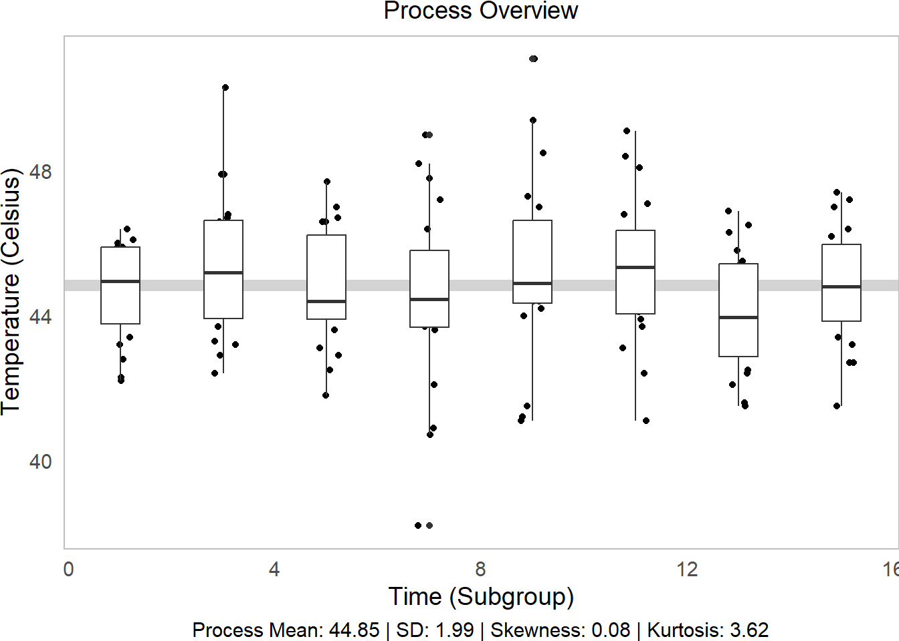
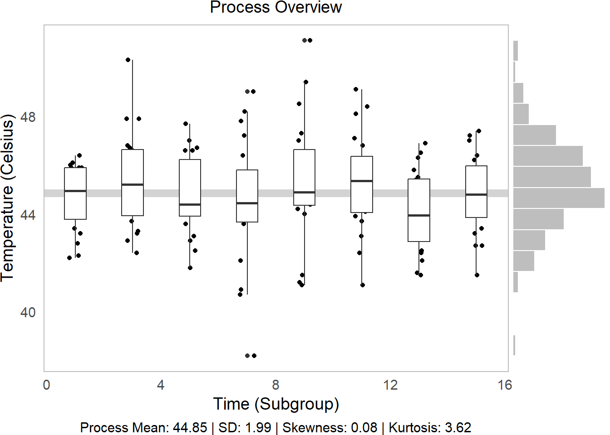
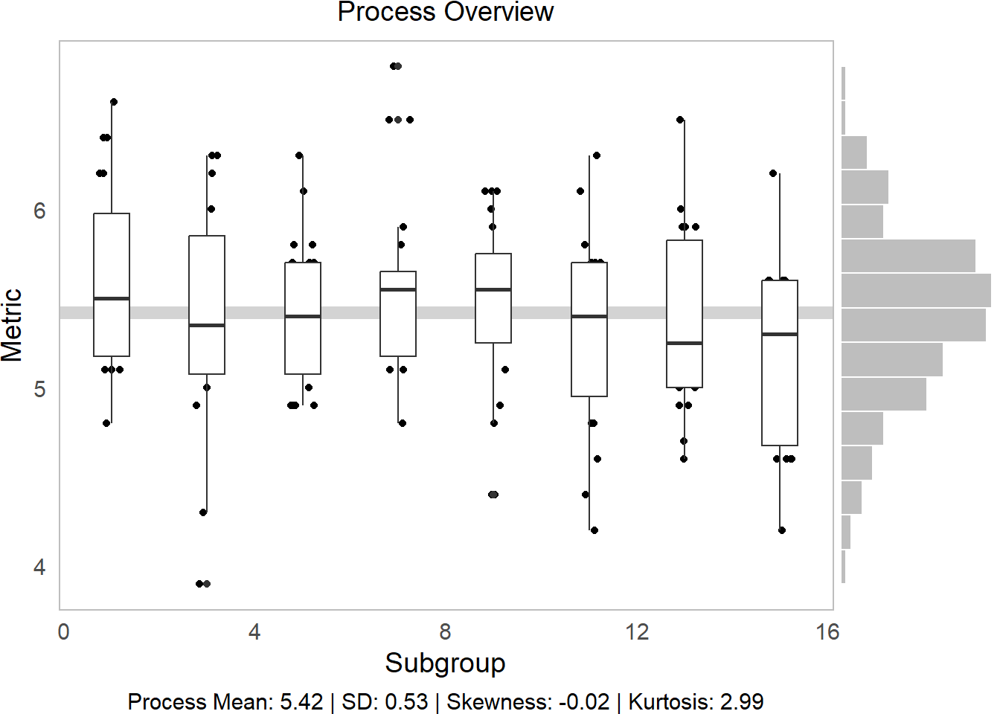
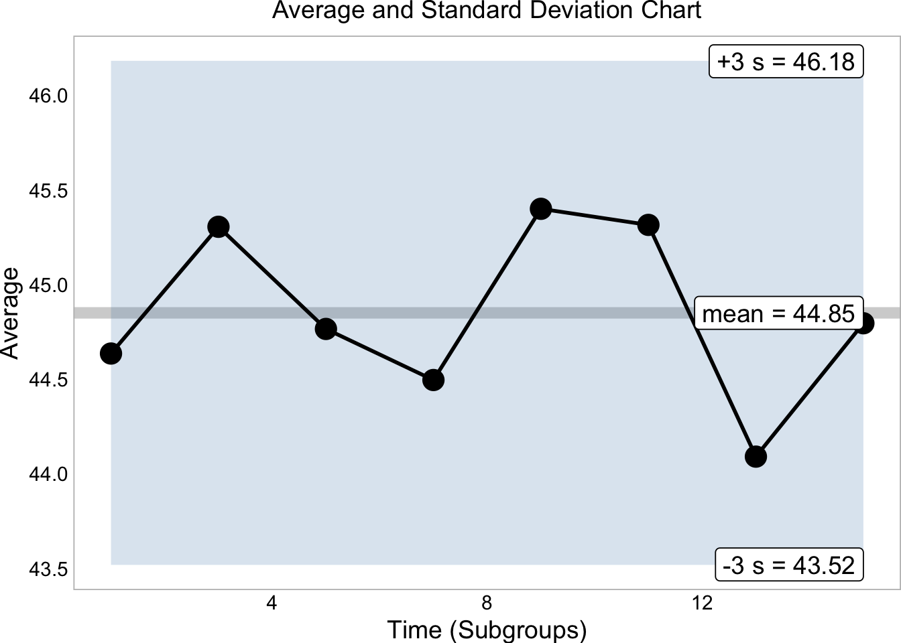
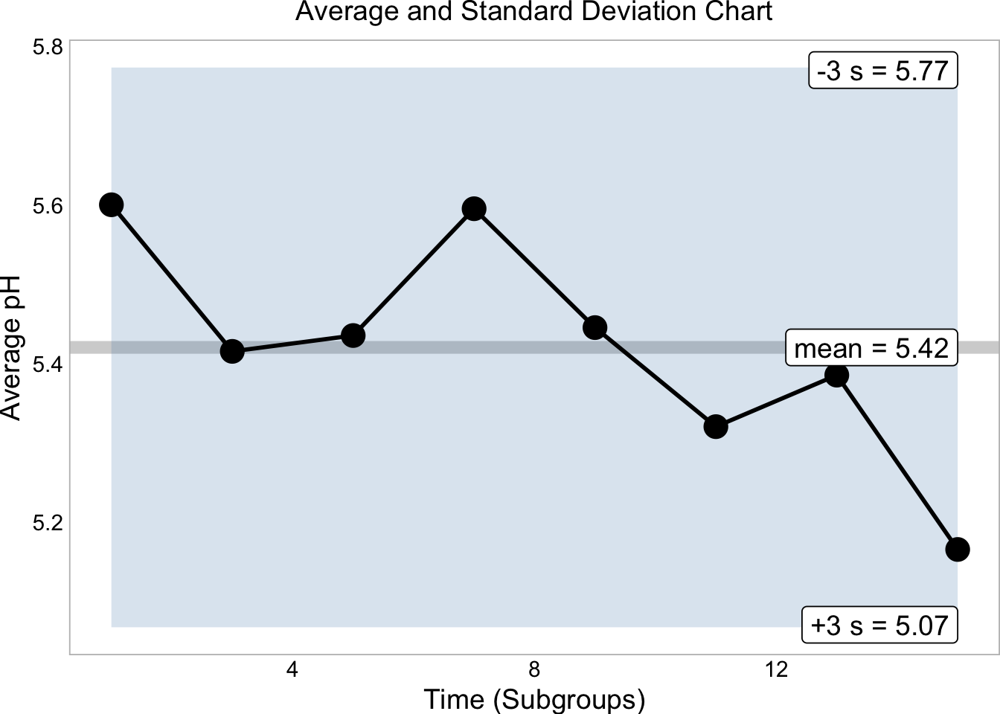
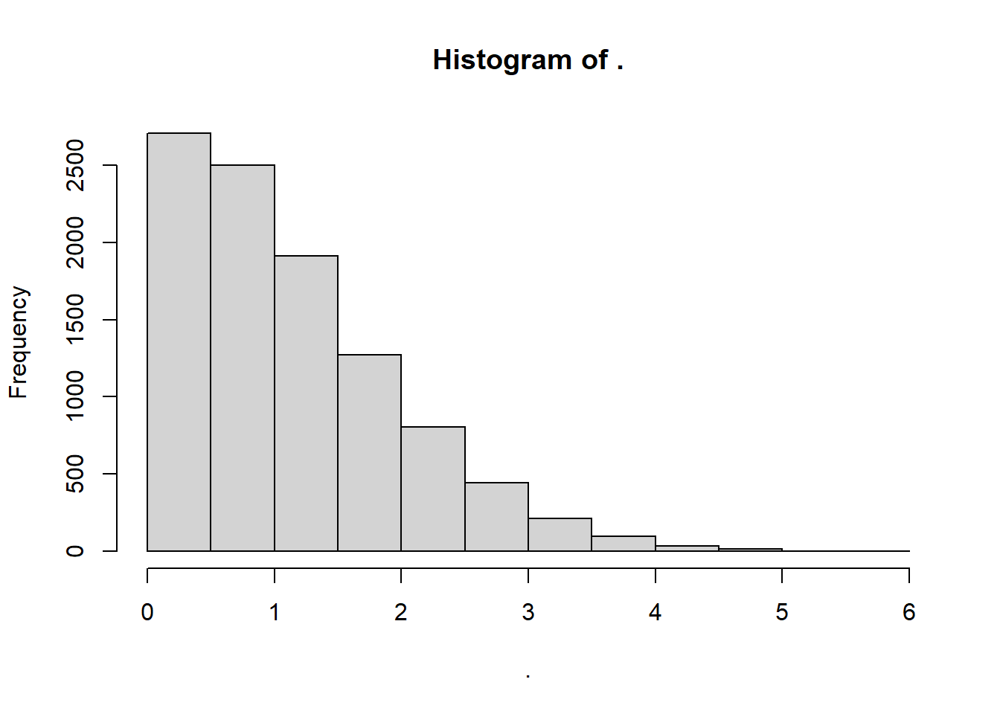
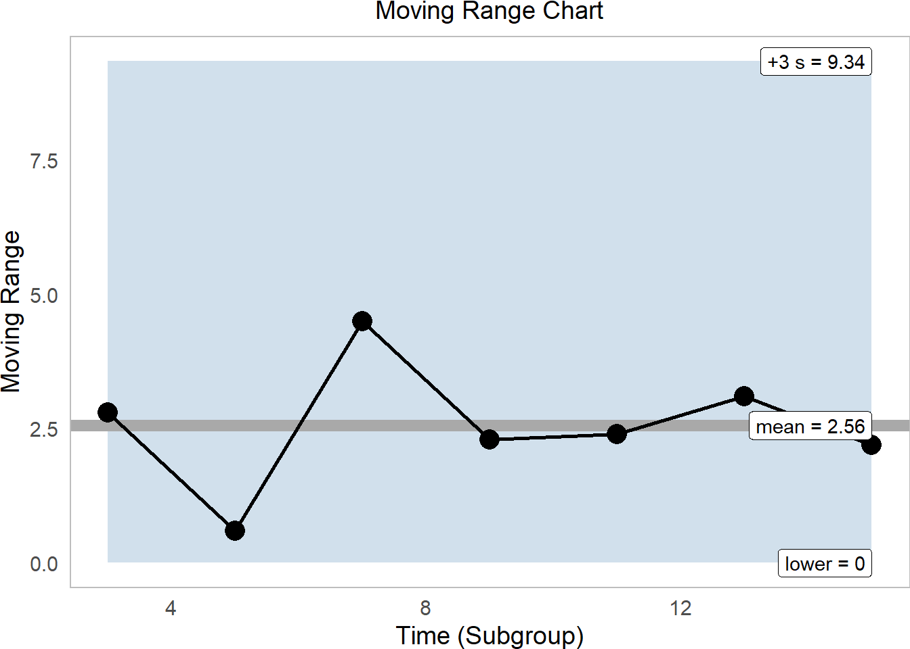

# Statistical Process Control in `R`


<div class="figure">

<p class="caption">(\#fig:unnamed-chunk-1)Statistical Process Control!</p>
</div>

In this workshop, we will learn how to perform statistical process control in `R`, using statistical tools and `ggplot` visualizations! Statistical Process Control refers to using statistics to (1) measure variation in product quality over time and (2) identify benchmarks to know when intervention is needed. Let's get started!

<br>
<br>

## Getting Started  {-}

### Packages {-}

We'll be using the `tidyverse` package for visualization, `viridis` for color palletes, `moments` for descriptive statistics, plus `ggpubr` for some add-on functions in `ggplot`.


```r
library(tidyverse)
library(viridis)
# you'll probably need to install these packages!
# install.packages(c("ggpubr", "moments")) 
library(ggpubr)
library(moments)
```

<br>
<br>

### Our Case {-}

<div class="figure">

<p class="caption">(\#fig:unnamed-chunk-3)Obanazawa City, Yamagata Prefecture - A Hot Springs Economy. [**Photo credit and more here.**](https://www.thehiddenjapan.com/ginzanonsen)</p>
</div>

For today's workshop, we're going to think about why quality control matters in a local economy, by examining the case of the Japanese Hot Springs bath economy! Hot springs, or *onsen*, are [a major source of tourism and recreation for families in Japan](https://asiatimes.com/2020/07/japanese-hot-spring-tourism-at-a-crossroads/), bringing residents from across the country every year to often rural communities where the right geological conditions have brought on naturally occurring hot springs. Restaurants, taxi and bus companies, and many service sector firms rely on their local onsen to bring in a steady stream (pun intended) of tourists to the local economy. So, it's often in the best interest of *onsen* operators to keep an eye on the temperature, minerals, or other aspects of their hot springs baths to ensure quality control, to keep up their firm (and town's!) reputation for quality rest and relaxation!

*Onsen*-goers often seek out *specific* types of hot springs, so it's important for an *onsen* to actually provide what it advertises! [Serbulea and Payyappallimana (2012)](http://dx.doi.org/10.1016/j.healthplace.2012.06.020) describe some of these benchmarks.

- **Temperature**: Onsen are divided into "Extra Hot Springs" (`>42 °C`), "Hot Springs" (`41~34°C`), and "Warm Springs" (`33~25°C`).

- **pH**: Onsen are classified into "Acidic" (`pH < 3`), "Mildly Acidic" (`pH 3~6`), "Neutral" (`pH 6~7.5`), "Mildly alkaline" (`ph 7.5~8.5`), and "Aklaline" (`pH > 8.5`).

- **Sulfur**: Sulfur *onsen* typically have about 2mg of sulfur per 1kg of hot spring water; sulfur levels *must* exceed 1 mg to count as a Sulfur *onsen.* (It smells like rotten eggs!)

These are decent examples of quality control metrics that *onsen* operators might want to keep tabs on! 

<br>
<br>

<div class="figure">

<p class="caption">(\#fig:unnamed-chunk-4)Monkeys are even fans of onsen! Read [**more here!**](https://www.nytimes.com/2018/04/03/science/japan-monkeys-hot-springs-stress.html)</p>
</div>


### Our Data {-}

You've been hired to evaluate quality control at a local *onsen* in sunny Kagoshima prefecture! Every month, for 15 months, you systematically took 20 random samples of hot spring water and recorded its **temperature**, **pH**, and **sulfur** levels. How might you determine if this *onsen* is at risk of slipping out of one sector of the market (eg. Extra Hot!) and into another (just normal Hot Springs?). 


Let's read in our data from `workshops/onsen.csv`!


```r
# Let's import our samples of bathwater over time!
water = read_csv("workshops/onsen.csv")
# Take a peek!
water %>% glimpse()
```

```
## Rows: 160
## Columns: 5
## $ id     <dbl> 1, 2, 3, 4, 5, 6, 7, 8, 9, 10, 11, 12, 13, 14, 15, 16, 17, 18, …
## $ time   <dbl> 1, 1, 1, 1, 1, 1, 1, 1, 1, 1, 1, 1, 1, 1, 1, 1, 1, 1, 1, 1, 3, …
## $ temp   <dbl> 43.2, 45.3, 45.5, 43.9, 45.9, 45.0, 42.3, 44.2, 42.2, 43.4, 46.…
## $ ph     <dbl> 5.1, 4.8, 6.2, 6.4, 5.1, 5.6, 5.5, 5.3, 5.2, 5.9, 5.8, 5.3, 5.9…
## $ sulfur <dbl> 0.0, 0.4, 0.9, 0.2, 0.0, 0.1, 0.0, 0.0, 0.0, 0.1, 0.7, 1.1, 0.1…
```

Our dataset contains:

- `id`: unique identifer for each sample of *onsen* water.

- `time`: categorical variable describing date of sample (month `1`, month `3`, ... month `15`).

- `temp`: temperature in celsius.

- `ph`: pH (0 to 14)

- `sulfur`: milligrams of sulfur ions.

<br>
<br>

## Visualizing Quality Control

Let's learn some key techniques for visualizing quality control!

<br>

### `theme_set()`

First, when you're about to make a bunch of `ggplot` visuals, it can help to set a common theme across them all with `theme_set()`.


```r
# By running theme_set()
theme_set(
  # we tell ggplot to give EVERY plot this theme
  theme_classic(base_size = 14) +
  # With these theme traits, including
  theme(
    # Putting the legend on the bottom, if applicable
    legend.position = "bottom",
    # horizontally justify plot subtitle and caption in center
    plot.title = element_text(hjust = 0.5),
    plot.subtitle = element_text(hjust = 0.5),
    plot.caption = element_text(hjust = 0.5),
    # Getting rid of busy axis ticks
    axis.ticks = element_blank(),
    # Getting rid of busy axis lines
    axis.line = element_blank(),
    # Surrounding the plot in a nice grey border
    panel.border = element_rect(fill = NA, color = "grey"),
    # Remove the right margin, for easy joining of plots
    plot.margin = margin(r = 0)
  )
)
```

<br>
<br>


### Process Descriptive Statistics

First, let's describe our process, using favorite description statistics. We're going to want to do this a bunch, so why don't we just write a `function` for it? Let's write `describe()`, which will take a vector `x` and calculate the `mean()`, `sd()`, `skewness()`, and `kurtosis()`, and then `paste()` together a nice caption describing them. 

(*I encourage you to write your own functions like this to help expedite your coding! Start simple!*)


```r
describe = function(x){
  # Put our vector x in a tibble
  tibble(x) %>%
    # Calculate summary statistics
    summarize(
      mean = mean(x, na.rm = TRUE),
      sd = sd(x, na.rm = TRUE),
      # We'll use the moments package for these two
      skew = skewness(x, na.rm = TRUE),
      kurtosis = kurtosis(x, na.rm = TRUE)) %>%
    # Let's add a caption, that compiles  all these statistics  
    mutate(
      # We'll paste() the following together
      caption = paste(
        # Listing the name of each stat, then reporting its value and rounding it, then separating with " | "
        "Process Mean: ", mean %>% round(2), " | ", 
        "SD: ", sd %>% round(2), " | ",
        "Skewness: ", skew %>% round(2), " | ",
        "Kurtosis: ", kurtosis %>% round(2), 
        # Then make sure no extra spaces separate each item
        sep = "")) %>%
    return()
}
# Run descriptives!
tab = water$temp %>% describe()
# Check it out!
tab
```

```
## # A tibble: 1 × 5
##    mean    sd   skew kurtosis caption                                           
##   <dbl> <dbl>  <dbl>    <dbl> <chr>                                             
## 1  44.8  1.99 0.0849     3.62 Process Mean: 44.85 | SD: 1.99 | Skewness: 0.08 |…
```

<br>
<br>

### Process Overview Visual 

Your first step should always be to look at the data overall! `geom_jitter()`, `geom_boxplot()`, and `ggMarginal()` can help you do this.

- `geom_jitter()` is a jittered scatterplot, jittering points a little to help with visibility. Since we want to be really precise on our quality control metrics, we could jitter the width a little (`width = 0.25`), but hold the y-axis (quality metric) constant at `height = 0`. These are in your x and y axis units, so decide based on your data each time.

- `geom_boxplot()` makes a boxplot for each `group` (`time`) in our data, showing the interquartile range (25th, 50th, and 75th percentiles) of our `y` variable for each `group`. Helpful way to view distributions. (Alternatively, you can try `geom_violin()`, which works the same way.)

- `geom_hline()` makes a horizontal line at the `yintercept`; we can tell it to show the `mean()` of `y` (in this case, `temp`).

- `geom_histogram()` is a histogram! We can use `coord_flip()` to turn it vertical to match the `y-axis`.

- `ggarrange()` from the `ggpubr` package binds two plots together into one, giving each a specific proportional `width` (eg. `c(0.25, 0.75)` percent, or `c(5, 1)` would be 5/6 and 1/6.)


```r
# Make the initial boxplot...
g1 = water %>%
  ggplot(mapping = aes(x = time, y = temp, group = time)) +
  # Plot grand mean
  geom_hline(mapping = aes(yintercept = mean(temp)), color = "lightgrey", size = 3) +
  # Plot points and boxplots 
  geom_jitter(height = 0, width = 0.25) +
  geom_boxplot() +
  labs(x = "Time (Subgroup)", y = "Temperature (Celsius)",
       subtitle = "Process Overview",
       # Add our descriptive stats in the caption!
       caption = tab$caption)
# Part 1 of plot
g1
```



<br>


```r
# Make the histogram, but tilt it on its side
g2 = water %>%
  ggplot(mapping = aes(x = temp)) +
  geom_histogram(bins = 15, color = "white", fill = "grey") +
  theme_void() +   # Clear the them
  coord_flip()   # tilt on its side
# Part 2 of plot
g2
```


<br>


```r
# Then bind them together into 1 plot, 'h'orizontally aligned.
p1 = ggarrange(g1,g2, widths = c(5,1), align = "h")
# Check it out!
p1
```


<br>
<br>

We can tell from this visual several things!

1. **Side Histogram**: Our overall distribution is pretty centered.

2. **Descriptive Statistics**: Our distribution has little skew (~0) and has **slightly higher-than-average kurtosis (<3)** (very centered) ([Review Skewness and Kurtosis here](https://docs.google.com/presentation/d/1hYpNxsmKBJYCW_8rply9sKCPHLH1mCOTuT_ohqflK7Q/edit?usp=sharing).)

3. **Line vs. Boxplots**: Over time, our samples sure do seem to be getting slightly further from the mean!

<br>
<br>

---

## Learning Check 1 {.unnumbered .LC}

**Question**

We analyzed temperature variation above, but our hot springs owner wants to know about variation in `pH` too! Write a `function` to produce a process overview plot given any 2 vectors (`water$time` and `water$pH`, in this case), and visualize the process overview for `pH`! (*You can do it!*)

<details><summary>**[View Answer!]**</summary>


```r
ggprocess = function(x, y, xlab = "Subgroup", ylab = "Metric"){
  
  # Get descriptive statistics
  tab = describe(y)
  
  # Make the initial boxplot...
  g1 = ggplot(mapping = aes(x = x, y = y, group = x)) +
    # Plot grand mean
    geom_hline(mapping = aes(yintercept = mean(y)), color = "lightgrey", size = 3) +
    # Plot points and boxplots 
    geom_jitter(height = 0, width = 0.25) +
    geom_boxplot() +
    labs(x = xlab, y = ylab,
         subtitle = "Process Overview",
         # Add our descriptive stats in the caption!
         caption = tab$caption)
  
  # Make the histogram, but tilt it on its side
  g2 = ggplot(mapping = aes(x = y)) +
    geom_histogram(bins = 15, color = "white", fill = "grey") +
    theme_void() +   # Clear the them
    coord_flip()   # tilt on its side
  
  # Then bind them together into 1 plot, 'h'orizontally aligned.
  p1 = ggarrange(g1,g2, widths = c(5,1), align = "h")
  
  return(p1)
}

# Visualize it!
ggprocess(x = water$time, y = water$ph)
```



In comparison to `temp`, `pH` is a much more controlled process.

I encourage you to use this `ggprocess()` function you just created!


</details>
  
---

<br>
<br>


## Average and Standard Deviation Graphs

### Key Statistics

Next, to analyze these processes more in depth, we need to assemble statistics at 2 levels: 

1. **within-group statistics** measure quantities of interest within each subgroup (eg. each monthly slice `time` in our *onsen* data). 

2. **between-group statistics** measure *total* quantities of interest for the overall process (eg. the overall *"grand"* mean, overall standard deviation in our *onsen* data).

<br>
<br>

### Subgroup (Within-Group) Statistics

Let's apply these to our *onsen* data to get statistics describing each subgroup's distribution, a.k.a. short-term or within-group statistics.


```r
# Calculate short-term statistics within each group
stat_s = water %>% 
  # For each timestpe
  group_by(time) %>%
  # Calculate these statistics of interest!
  summarize(
    # within-group mean
    xbar = mean(temp),
    # within-group range
    r = max(temp) - min(temp),
    # within-group standard deviation
    sd = sd(temp),
    # within-group sample size
    nw = n(),
    # Degrees of freedom within groups
    df = nw - 1) %>%
  # Last, we'll calculate sigma_short (within-group variance)
  # We're going to calculate the short-term variation parameter sigma_s (sigma_short)
  # by taking the square root of the average of the standard deviation
  # Essentially, we're weakening the impact of any special cause variation
  # so that our sigma is mostly representative of common cause (within-group) variation
  mutate(
    # these are equivalent
    sigma_s = sqrt( sum(df * sd^2) / sum(df) ),
    sigma_s = sqrt(mean(sd^2)), 
    # And get standard error (in a way that retains each subgroup's sample size!)
    se = sigma_s / sqrt(nw),
    # Calculate 6-sigma control limits!
    upper = mean(xbar) + 3*se,
    lower = mean(xbar) - 3*se)


# Check it!
stat_s %>% head(3)
```

```
## # A tibble: 3 × 10
##    time  xbar     r    sd    nw    df sigma_s    se upper lower
##   <dbl> <dbl> <dbl> <dbl> <int> <dbl>   <dbl> <dbl> <dbl> <dbl>
## 1     1  44.6  4.20  1.34    20    19    1.99 0.444  46.2  43.5
## 2     3  45.3  7.9   2.00    20    19    1.99 0.444  46.2  43.5
## 3     5  44.8  5.90  1.63    20    19    1.99 0.444  46.2  43.5
```
<br>
<br>

### Total Statistics (Between Groups)


```r
# To get between-group estimates....
stat_t = stat_s %>%
  summarize(
    xbbar = mean(xbar),
    rbar = mean(r),
    sdbar = mean(sd),
    # We can also recalculate sigma_short here too
    sigma_s = sqrt( mean(sd^2) ),
    # Or we can calculate overall standard deviation 
    sigma_t = sd(water$temp) )
```

<br>
<br>

So, now that we have estimated within-group, common cause variation via $\sigma_{short}$ (`sigma_s`) and the standard error (`se`), what can we say about our process?

<br>
<br>

### Average and Standard Deviation Charts

The preferred method for measuring within-group variability is the standard deviation, rather than the range, so we generally recommend (a) Average ($\bar{X}$) and Standard Deviation ($S$) charts over (b) Average ($\bar{X}$) and Range ($R$) charts.


```r
# Let's extract some labels
labels = stat_s %>%
  summarize(
    time = max(time),
    type = c("xbbar",  "upper", "lower"),
    name = c("mean", "+3 s", "-3 s"),
    value = c(mean(xbar), unique(upper), unique(lower)),
    value = round(value, 2),
    text = paste(name, value, sep = " = "))

stat_s %>%
  ggplot(mapping = aes(x = time, y = xbar)) +
  geom_hline(mapping = aes(yintercept = mean(xbar)), color = "lightgrey", size = 3) +
  geom_ribbon(mapping = aes(ymin = lower, ymax = upper), fill = "steelblue", alpha = 0.2) +
  geom_line(size = 1) +
  geom_point(size = 5) +
  # Plot labels
  geom_label(data = labels, mapping = aes(x = time, y = value, label = text),  hjust = 1)  +
  labs(x = "Time (Subgroups)", y = "Average",
       subtitle = "Average and Standard Deviation Chart")
```


This tells us that excitingly, our *onsen* temperatures are quite firmly within range. While the average varies quite a bit, it remains comfortably within 3 standard deviations of the mean.

<br>
<br>

---

## Learning Check 2 {.unnumbered .LC}

**Question**
  
Well, that was nifty, but can we do it all over again for `pH`? Make some rad upper and lower confidence intervals for $\bar{X}$ for `pH`!


<details><summary>**[View Answer!]**</summary>


```r
# Get the within-group stats for ph!
ph_s = water %>%
  group_by(time) %>%
  summarize(
    xbar = mean(ph),
    r = max(ph) - min(ph),
    sd = sd(ph),
    nw = n(),
    df = nw - 1) %>%
  mutate(
    sigma_s = sqrt(mean(sd^2)), 
    se = sigma_s / sqrt(nw),
    upper = mean(xbar) + 3*se,
    lower = mean(xbar) - 3*se)

# Let's extract some labels
labels = ph_s %>%
  summarize(
    time = max(time),
    type = c("xbbar",  "upper", "lower"),
    name = c("mean", "-3 s", "+3 s"),
    value = c(mean(xbar), unique(upper), unique(lower)),
    value = round(value, 2),
    text = paste(name, value, sep = " = "))

# and let's visualize it!
ph_s %>%
  ggplot(mapping = aes(x = time, y = xbar)) +
  geom_hline(mapping = aes(yintercept = mean(xbar)), color = "lightgrey", size = 3) +
  geom_ribbon(mapping = aes(ymin = lower, ymax = upper), fill = "steelblue", alpha = 0.2) +
  geom_line(size = 1) +
  geom_point(size = 5) +
  # Plot labels
  geom_label(data = labels, mapping = aes(x = time, y = value, label = text),  hjust = 1)  +
  labs(x = "Time (Subgroups)", y = "Average pH",
       subtitle = "Average and Standard Deviation Chart")
```



</details>
  
---

<br>
<br>

## Moving Range Charts


### Individual and Moving Range Charts

Suppose we only had 1 observation per subgroup! There's no way to calculate standard deviation for that - after all, there's no variation within each subgroup! Instead, we can generate an individual and moving range chart.


```r
# Suppose we sample just the first out of each our months.
indiv = water %>%
  filter(id %in% c(1, 21, 41, 61, 81, 101, 121, 141))
```

The *average moving range* $m\bar{R}$ aptly refers to the average of the *moving Range* $mR$, the *difference* in values over time. We can calculate the moving range using the `diff()` function on a vector like `temp`, shown below. `abs()` converts each value to be positive, since ranges are always 0 to infinity.


```r
# Let's see our original values
indiv$temp
```

```
## [1] 43.2 46.0 46.6 42.1 44.4 46.8 43.7 45.9
```

```r
# diff() gets range between second and first, third and second, and so on
indiv$temp %>% diff() %>% abs()
```

```
## [1] 2.8 0.6 4.5 2.3 2.4 3.1 2.2
```

<br>

Just like all statistics, $m\bar{R}$ too has its own distribution, containing a range of slightly higher and lower $m\bar{R}$ statistics we might have gotten had our sample been just slightly different due to chance. As a result, we will want to estimate a confidence interval around $m\bar{R}$, but how are we to do that if we have no statistic like $\sigma$ to capture that variation? 

Well, good news: We can *approximate* $\sigma_s$ by taking the ratio of $m\bar{R}$ over a factor called $d_{2}$. What is $d_{2}$? I'm glad you asked!

$$\sigma_{short} \approx \frac{m\bar{R}}{d_{2}} $$
<br>
<br>

### Factors $d_{2}$ and Friends

As discussed above, *any statistics* has a latent distribution of other values you might have gotten for your statistic had your sample been just slightly different due to random error. Fun fact: we can actually *see* those distributions pretty easily thanks to simulation!

- Suppose we have a subgroup of size `n = 1`, so we calculate a moving range of `length 1`.

- This subgroup and its moving range is just one of the possible subgroups we could have encountered by chance, so we can think of it as a random draw from an archetypal normal distribution (`mean = 0` and `sd = 1`).

- If we take *enough* samples of moving ranges from that distribution, we can plot the distribution. Below, we take `n = 10000` samples with `rnorm()` and plot the vector with `hist()`.

- We find a beautiful distribution of moving range statistics for `n=1` size subgroups.


```r
mrsim = rnorm(n = 10000, mean = 0, sd = 1) %>% diff() %>% abs()
mrsim %>% hist()
```



Much like $k$ factors in the exponential distribution, we can use this distribution of $mR$ stats to produce a series of *factors* that can help us estimate any upper or lower confidence interval in a moving range distribution.

For example, we can calculate:

- $d_{2}$, the *mean* of this archetypal $mR$ distribution.

- $d_{3}$, the *standard deviation* of this $mR$ distribution.

- Technically, $d_{2}$ is a ratio, which says that *in a distribution with a standard deviation of 1, the mean mR is $d_{2}$.* In other words, $d_{2} = \frac{m\bar{R}_{normal, n = 1} }{\sigma_{normal,n=1} }$. So, if we have observed a real life average moving range $m\bar{R}_{observed,n=1}$, we can use this $d_{2}$ factor to convert out of units of $1 \sigma_{normal,n=1}$ into units the $\sigma_{short}$ of our observed data! 


```r
# For example, the mean of our vector mrsim, for subgroup size n = 1, 
# says that d2 (mean of these mR stats) is...
mrsim %>% mean()
```

```
## [1] 1.12343
```


```r
# While d3 (standard deviation is...)
mrsim %>% sd()
```

```
## [1] 0.842062
```

But why stop there? We can calculate loads of other interesting statistics!


```r
# For example, these statistics 
# estimate the median, upper 90, and upper 95% of the distribution! 
mrsim %>%
  quantile(probs = c(0.50, 0.90, .95)) %>% round(3)
```

```
##   50%   90%   95% 
## 0.956 2.305 2.737
```

<br>
<br>

### Estimating $\sigma_{short}$ for Moving Range Statistics

Let's apply our new knowledge about $d_{2}$ to calculate some upper bounds ($+3 \sigma$) for our average moving range estimates!


```r
istat_s = indiv %>%
  summarize(
    time = time[-1],
    # get moving range
    mr = temp %>% diff() %>% abs(),
    # Get average moving range
    mrbar = mean(mr),
    # Get total sample size!
    d2 = rnorm(n = 10000, mean = 0, sd = 1) %>% diff() %>% abs() %>% mean(),
    # If we approximate sigma_s....
    # pretty good!
    sigma_s = mrbar / d2,
    # Our subgroup size was 1, right?
    n = 1,
    # so this means sigma_s just equals the standard error here
    se = sigma_s / sqrt(n),
    # compute upper 3-se bound
    upper = mrbar + 3 * se,
    # and lower ALWAYS equals 0 for moving range
    lower = 0)
```

Why stop there? Let's visualize it!


```r
# Let's get our labels!
labels = istat_s %>%
  summarize(
    time = max(time), 
    type = c("mean", "+3 s", "lower"),
    value = c(mrbar[1],  upper[1], lower[1]) %>% round(2),
    name = paste(type, value, sep = " = "))

# Now make the plot!
istat_s %>%
  ggplot(mapping = aes(x = time, y = mr)) +
  # Plot the confidence intervals
  geom_ribbon(mapping = aes(x = time, ymin = lower, ymax = upper), 
              fill = "steelblue", alpha = 0.25) +
  # Plot mrbar
  geom_hline(mapping = aes(yintercept = mean(mr)), size = 3, color = "darkgrey") +
  # Plot moving range
  geom_line(size = 1) +
  geom_point(size = 5) +
  geom_label(data = labels, mapping = aes(x = time, y = value, label = name), hjust = 1) +  
  labs(x = "Time (Subgroup)", y = "Moving Range",
       subtitle = "Moving Range Chart")
```



Again, this process looks pretty sound, firmly within range.

<br>
<br>


## Constants

### Find *any* $d_x$ Factor

While our book writes extensively about $d_{2}$ and other $d_{whatever}$ factors, it's not strictly necessary to calculate them unless you *need* them. Usually, we do this when we *can't* calculate the standard deviation normally (eg. when we have *only* moving range statistics or *only* a subgroup sample size of `n=1`). If you're working with full data from your process though, you can easily calculate $\sigma_{short}$ right from the empirical data, without ever needing to use $d_x$ factors.

But let's say you *did* need a $d_x$ factor for a subgroup range of a given sample size `n = 1, 2, 3.... n`. Could we calculate some kind of function to give us it?

Funny you should ask! I've written a little helper function you can use.


```r
# Let's calculate our own d function
dn = function(n, reps = 1e4){
  # For 10,0000 reps
  tibble(rep = 1:reps) %>%
    # For each rep,
    group_by(rep) %>%
    # Simulate the ranges of n values
    summarize(r = rnorm(n = n, mean = 0, sd = 1) %>% range() %>% diff() %>% abs()) %>%
    ungroup() %>%
    # And calculate...
    summarize(
      # Mean range
      d2 = mean(r),
      # standard deviation of ranges
      d3 = sd(r),
      # and constants for obtaining lower and upper ci for rbar
      D3 = 1 - 3*(d3/d2), # sometimes written D3
      D4 = 1 + 3*(d3/d2), # sometimes written D4
      # Sometimes D3 goes negative; we need to bound it at zero
      D3 = if_else(D3 < 0, true = 0, false = D3) ) %>%
    return()
}
# Let's try it, where subgroup size is n = 2
dn(n = 2)
```

```
## # A tibble: 1 × 4
##      d2    d3    D3    D4
##   <dbl> <dbl> <dbl> <dbl>
## 1  1.13 0.842     0  3.24
```


```r
# Let's get the constants we need too.
# Each of our samples has a sample size of 20
d = dn(n = 20)

# Check it!
d
```

```
## # A tibble: 1 × 4
##      d2    d3    D3    D4
##   <dbl> <dbl> <dbl> <dbl>
## 1  3.74 0.720 0.422  1.58
```

<br>
<br>

### Using $d_x$ factors

Using `d_n()`, we can make a quick approximation for the upper and lower control limits for the *range* $\bar{R}$ as well (as opposed to $m\bar{R}$)!


```r
# Let's get within group range for temperature...
stat_w = water %>%
  group_by(time) %>%
  summarize(r = temp %>% range() %>% diff() %>% abs(),
            n_w = n()) # get subgroup size
# Let's get average within group range for temperature...
stat = stat_w %>%
  summarize(rbar = mean(r), # get Rbar
            n_w = unique(n_w)) # assuming constant subgroup size...
# Check it!
stat
```

```
## # A tibble: 1 × 2
##    rbar   n_w
##   <dbl> <int>
## 1  7.26    20
```


```r
# We find that dn() gives us constants D3 and D4... 
mydstat = dn(n = stat$n_w)
mydstat
```

```
## # A tibble: 1 × 4
##      d2    d3    D3    D4
##   <dbl> <dbl> <dbl> <dbl>
## 1  3.74 0.728 0.417  1.58
```

And use these constants to estimate the upper and lower CI for $\bar{r}$!


```r
stat %>%
  mutate(rbar_lower = rbar * mydstat$D3,
         rbar_upper = rbar * mydstat$D4) %>%
  select(rbar, rbar_lower, rbar_upper)
```

```
## # A tibble: 1 × 3
##    rbar rbar_lower rbar_upper
##   <dbl>      <dbl>      <dbl>
## 1  7.26       3.03       11.5
```

So quick! You could use these values to make a *range* chart now.


```r
remove(stat, stat_w)
```

<br>
<br>

### Finding *any* $b_x$ Factor.

We might also want to know how much the standard deviation could possible vary due to sampling error. To figure this out, we'll simulate many many standard deviations from a normal distribution, like in `dn()`, for a given subgroup size `n`. 

Then, we can calculate some quantities of interest like $C_{4}$ (the mean standard deviation from an archetypal normal distribution), $B_{3}$ (a multiplier for getting the lower control limit for 3 sigmas), and $B_{4}$ (a multiplier for getting the upper control limit for 3 sigmas.)


```r
# Let's write a function bn() to calculate our B3 and B4 statistics for any subgroup size n
bn = function(n, reps = 1e4){
  tibble(rep = 1:reps) %>%
    group_by(rep) %>%
    summarize(s = rnorm(n, mean = 0, sd = 1) %>% sd()) %>%
    summarize(b2 = mean(s), 
              b3 = sd(s),
              C4 = b2, # this is sometimes called C4
              A3 = 3 / (b2 * sqrt( n  )),
              B3 = 1 - 3 * b3/b2,
              B4 = 1 + 3 * b3/b2,
              # bound B3 at 0, since we can't have a standard deviation below 0
              B3 = if_else(B3 < 0, true = 0, false = B3)) %>%
    return()
}
```

Let's apply this to our `temp` vector. 

First, we'll calculate the standard deviation within each subgroup, saved in `stat_w` under `s`.


```r
# Let's get within group standard deviation for temperature...
stat_w = water %>%
  group_by(time) %>%
  summarize(s = temp %>% sd(),
            n_w = n()) # get subgroup size

stat_w
```

```
## # A tibble: 8 × 3
##    time     s   n_w
##   <dbl> <dbl> <int>
## 1     1  1.34    20
## 2     3  2.00    20
## 3     5  1.63    20
## 4     7  2.66    20
## 5     9  2.57    20
## 6    11  2.02    20
## 7    13  1.65    20
## 8    15  1.61    20
```

Second, we'll calculate the average standard deviation across subgroups, saved in `stat` under `sbar`.


```r
# Let's get average within group range for temperature...
stat = stat_w %>%
  summarize(sbar = mean(s), # get Rbar
            n_w = unique(n_w)) # assuming constant subgroup size...
# Check it!
stat
```

```
## # A tibble: 1 × 2
##    sbar   n_w
##   <dbl> <int>
## 1  1.94    20
```

Third, we'll get our constants $B_{3}$ and $B_{4}$!


```r
# For a subgroup size of 20...
stat$n_w
```

```
## [1] 20
```

```r
# Let's get our B constants!
mybstat = bn(n = stat$n_w)

# Check it out!
mybstat
```

```
## # A tibble: 1 × 6
##      b2    b3    C4    A3    B3    B4
##   <dbl> <dbl> <dbl> <dbl> <dbl> <dbl>
## 1 0.985 0.163 0.985 0.681 0.503  1.50
```

Finally, let's calculate our control limits!


```r
stat = stat %>%
  # Add our constants to the data.frame...
  mutate(mybstat) %>%
  # Calculate 3 sigma control limits
  mutate(sbar_lower = sbar * B3,
         sbar_upper = sbar * B4)

# Check it out!
stat %>%
  select(sbar, sbar_lower, sbar_upper)
```

```
## # A tibble: 1 × 3
##    sbar sbar_lower sbar_upper
##   <dbl>      <dbl>      <dbl>
## 1  1.94      0.973       2.90
```

Now you're all ready to make a control chart showing variation in the standard deviation!

<br>
<br>

---

## Learning Check 3 {.unnumbered .LC}

**Question**

Using our `dn()` function above, compile for yourself a short table of the $d_{2}$ and $d_{3}$ factors for subgroups sized `2` to `10`.

<details><summary>**[View Answer!]**</summary>


```r
# Let's bind them together!
dx = bind_rows(
  dn(2), dn(3), dn(4), dn(5),
  dn(6), dn(7), dn(8), dn(9), dn(10)) %>%
  mutate(n = 2:10) %>%
  select(n, d2, d3)

# Look at that cool table! 
dx
```

```
## # A tibble: 9 × 3
##       n    d2    d3
##   <int> <dbl> <dbl>
## 1     2  1.12 0.851
## 2     3  1.68 0.883
## 3     4  2.05 0.880
## 4     5  2.32 0.862
## 5     6  2.53 0.843
## 6     7  2.70 0.834
## 7     8  2.85 0.804
## 8     9  2.97 0.802
## 9    10  3.08 0.794
```

</details>
  
---

<br>
<br>


All done! Great work!


