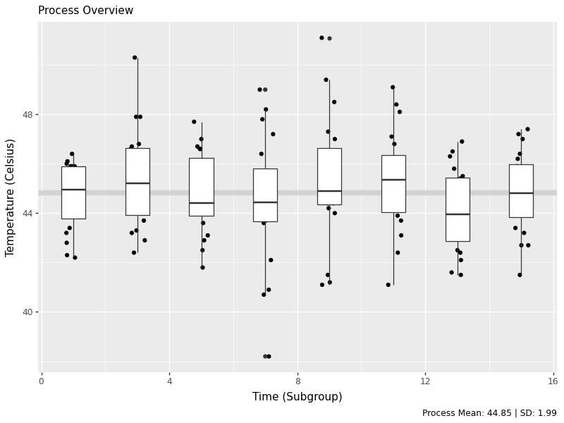

# Statistical Process Control in `Python`


<div class="figure">

<p class="caption">(\#fig:unnamed-chunk-1)Statistical Process Control!</p>
</div>

In this workshop, we will learn how to perform statistical process control in Python, using statistical tools and `plotnine` visualizations! Statistical Process Control refers to using statistics to (1) measure variation in product quality over time and (2) identify benchmarks to know when intervention is needed. Let's get started!

---

## Getting Started {-}

### Packages {-}


``` python
# Remember to install these packages using a terminal, if you haven't already!
!pip install pandas plotnine scipy
```

We'll be using `pandas` for data manipulation, `plotnine` for visualization, and `scipy` for statistical functions.


``` python
import pandas as pd
from plotnine import *
```

### Custom Functions {-}

This workshop uses custom functions from the `functions/` directory. You may need both:
- `functions_distributions.py` - for reliability and distribution functions
- `functions_process_control.py` - for statistical process control functions

To use these functions, you need to acquire them from the repository at [github.com/timothyfraser/sigma/tree/main/functions](https://github.com/timothyfraser/sigma/tree/main/functions).

**Add the functions directory to your Python path**

``` python
import sys
import os
# Add the functions directory to Python path
sys.path.append('functions')  # or path to wherever you placed the functions folder
```

Once you have the functions available, you can import them:


``` python
from functions_distributions import density, tidy_density, approxfun
# from functions_process_control import ggprocess, ggsubgroup, ggmoving, ggcapability  # if needed
```

### Our Case {-}

<div class="figure">

<p class="caption">(\#fig:unnamed-chunk-2)Obanazawa City, Yamagata Prefecture - A Hot Springs Economy. [**Photo credit and more here.**](https://www.thehiddenjapan.com/ginzanonsen)</p>
</div>

For today's workshop, we're going to think about why quality control matters in a local economy, by examining the case of the Japanese Hot Springs bath economy! Hot springs, or *onsen*, are [a major source of tourism and recreation for families in Japan](https://asiatimes.com/2020/07/japanese-hot-spring-tourism-at-a-crossroads/), bringing residents from across the country every year to often rural communities where the right geological conditions have brought on naturally occurring hot springs. Restaurants, taxi and bus companies, and many service sector firms rely on their local onsen to bring in a steady stream (pun intended) of tourists to the local economy. So, it's often in the best interest of *onsen* operators to keep an eye on the temperature, minerals, or other aspects of their hot springs baths to ensure quality control, to keep up their firm (and town's!) reputation for quality rest and relaxation!

*Onsen*-goers often seek out *specific* types of hot springs, so it's important for an *onsen* to actually provide what it advertises! [Serbulea and Payyappallimana (2012)](http://dx.doi.org/10.1016/j.healthplace.2012.06.020) describe some of these benchmarks.

- **Temperature**: Onsen are divided into "Extra Hot Springs" (`>42°C`), "Hot Springs" (`41~34°C`), and "Warm Springs" (`33~25°C`).

- **pH**: Onsen are classified into "Acidic" (`pH < 3`), "Mildly Acidic" (`pH 3~6`), "Neutral" (`pH 6~7.5`), "Mildly alkaline" (`pH 7.5~8.5`), and "Alkaline" (`pH > 8.5`).

- **Sulfur**: Sulfur *onsen* typically have about 2mg of sulfur per 1kg of hot spring water; sulfur levels *must* exceed 1 mg to count as a Sulfur *onsen.* (It smells like rotten eggs!)

These are decent examples of quality control metrics that *onsen* operators might want to keep tabs on!

<div class="figure">

<p class="caption">(\#fig:unnamed-chunk-3)Monkeys are even fans of onsen! Read [**more here!**](https://www.nytimes.com/2018/04/03/science/japan-monkeys-hot-springs-stress.html)</p>
</div>

### Our Data {-}

You've been hired to evaluate quality control at a local *onsen* in sunny Kagoshima prefecture! Every month, for 15 months, you systematically took 20 random samples of hot spring water and recorded its **temperature**, **pH**, and **sulfur** levels. How might you determine if this *onsen* is at risk of slipping out of one sector of the market (eg. Extra Hot!) and into another (just normal Hot Springs?).

Let's read in our data from `workshops/onsen.csv`!


``` python
# Add functions directory to path if not already there
import sys
if 'functions' not in sys.path:
    sys.path.append('functions')

from functions_distributions import density, tidy_density, approxfun

water = pd.read_csv('workshops/onsen.csv')
water.head(3)
```

```
##    id  time  temp   ph  sulfur
## 0   1     1  43.2  5.1     0.0
## 1   2     1  45.3  4.8     0.4
## 2   3     1  45.5  6.2     0.9
```

## Process Descriptive Statistics

First, let's get a sense of our process by calculating some basic descriptive statistics. We'll create a simple function to calculate the mean and standard deviation, which are fundamental to evaluating process variation.


``` python
from pandas import Series
def describe(x: Series):
  x = Series(x)
  out = pd.DataFrame({
    'mean': [x.mean()],
    'sd': [x.std()],
  })
  out['caption'] = ("Process Mean: " + out['mean'].round(2).astype(str) +
                    " | SD: " + out['sd'].round(2).astype(str))
  return out

tab = describe(water['temp'])
tab
```

```
##     mean        sd                         caption
## 0  44.85  1.989501  Process Mean: 44.85 | SD: 1.99
```

Now let's apply this to our temperature data to see the overall process mean and variation.

## Process Overview Visual

The process overview chart is one of the most important tools in SPC. It shows us how our process behaves over time, helping us identify patterns, trends, and potential issues. We'll create a visualization that shows individual measurements, subgroup means, and the overall process average.


``` python
g1 = (ggplot(water, aes(x='time', y='temp', group='time')) +
  geom_hline(aes(yintercept=water['temp'].mean()), color='lightgrey', size=3) +
  geom_jitter(height=0, width=0.25) +
  geom_boxplot() +
  labs(x='Time (Subgroup)', y='Temperature (Celsius)', subtitle='Process Overview', caption=tab['caption'][0]))

# Save the plot
g1.save('images/05_process_overview.png', width=8, height=6, dpi=100)
```




``` python
g2 = (ggplot(water, aes(x='temp')) + geom_histogram(bins=15, color='white', fill='grey') + theme_void() + coord_flip())

# Save the plot
g2.save('images/05_process_histogram.png', width=8, height=6, dpi=100)
```


The histogram shows us the distribution of all temperature measurements, giving us insight into the overall process variation. This helps us understand if our process is centered and how much variation we're seeing.

## Subgroup (Within-Group) Statistics

In SPC, we often work with *subgroups* - small samples taken at regular intervals. This allows us to distinguish between common cause variation (inherent to the process) and special cause variation (due to specific events). Let's calculate statistics for each subgroup to see how the process behaves over time.


``` python
stat_s = (water.groupby('time').apply(lambda d: pd.Series({
  'xbar': d['temp'].mean(),
  'r': d['temp'].max() - d['temp'].min(),
  'sd': d['temp'].std(),
  'nw': len(d)
})).reset_index())
stat_s['df'] = stat_s['nw'] - 1
stat_s['sigma_s'] = ( (stat_s['df'] * (stat_s['sd']**2)).sum() / stat_s['df'].sum() )**0.5
stat_s['se'] = stat_s['sigma_s'] / (stat_s['nw']**0.5)
stat_s['upper'] = stat_s['xbar'].mean() + 3*stat_s['se']
stat_s['lower'] = stat_s['xbar'].mean() - 3*stat_s['se']
stat_s.head(3)
```

```
##    time    xbar    r        sd    nw    df   sigma_s        se      upper      lower
## 0     1  44.635  4.2  1.342533  20.0  19.0  1.986174  0.444122  46.182366  43.517634
## 1     3  45.305  7.9  2.001440  20.0  19.0  1.986174  0.444122  46.182366  43.517634
## 2     5  44.765  5.9  1.628133  20.0  19.0  1.986174  0.444122  46.182366  43.517634
```

Here we've calculated key statistics for each subgroup:

- **xbar**: The mean of each subgroup
- **r**: The range (max - min) within each subgroup  
- **sd**: The standard deviation within each subgroup
- **sigma_s**: The pooled within-subgroup standard deviation
- **se**: The standard error for each subgroup mean

### Total Statistics (Between Groups)

Now let's calculate the overall process statistics that summarize the behavior across all subgroups:


``` python
stat_t = pd.DataFrame({
  'xbbar': [stat_s['xbar'].mean()],
  'rbar': [stat_s['r'].mean()],
  'sdbar': [stat_s['sd'].mean()],
  'sigma_s': [(stat_s['sd']**2).mean()**0.5],
  'sigma_t': [water['temp'].std()]
})
stat_t
```

```
##    xbbar    rbar    sdbar   sigma_s   sigma_t
## 0  44.85  7.2625  1.93619  1.986174  1.989501
```

These statistics give us:

- **xbbar**: The grand mean (average of all subgroup means)
- **rbar**: The average range across subgroups
- **sdbar**: The average standard deviation across subgroups
- **sigma_s**: The pooled within-subgroup standard deviation
- **sigma_t**: The total process standard deviation

### Average and Standard Deviation Charts

Control charts are the heart of SPC. They help us monitor process stability over time and detect when the process is out of control. We'll create charts for both the subgroup means (X-bar chart) and standard deviations (S chart).


``` python
labels = pd.DataFrame({
  'time': [stat_s['time'].max()]*3,
  'type': ['xbbar','upper','lower'],
  'name': ['mean','+3 s','-3 s'],
  'value': [stat_s['xbar'].mean(), stat_s['upper'].iloc[0], stat_s['lower'].iloc[0]]
})

control_chart = (ggplot(stat_s, aes(x='time', y='xbar')) +
  geom_hline(aes(yintercept=stat_s['xbar'].mean()), color='lightgrey', size=3) +
  geom_ribbon(aes(ymin='lower', ymax='upper'), fill='steelblue', alpha=0.2) +
  geom_line(size=1) + geom_point(size=5) +
  geom_label(data=labels, mapping=aes(x='time', y='value', label='name'), ha='right') +
  labs(x='Time (Subgroups)', y='Average', subtitle='Average and Standard Deviation Chart'))

# Save the plot
control_chart.save('images/05_control_chart.png', width=8, height=6, dpi=100)
```


This control chart shows:

- **Center line**: The grand mean (xbbar)
- **Control limits**: Upper and lower 3-sigma limits based on the standard error
- **Individual points**: Each subgroup mean plotted over time
- **Shaded area**: The control limits region

Points outside the control limits or showing non-random patterns indicate the process may be out of control and requires investigation.

---

## Learning Check 1 {.unnumbered .LC}

**Question**

Produce the same process overview chart for `pH`.

<details><summary>**[View Answer!]**</summary>


``` python
def ggprocess(x, y, xlab='Subgroup', ylab='Metric'):
  import pandas as pd
  from plotnine import ggplot, aes, geom_hline, geom_jitter, geom_boxplot, labs
  d = pd.DataFrame({'x': x, 'y': y})
  g = (ggplot(d, aes(x='x', y='y', group='x')) +
       geom_hline(aes(yintercept=d['y'].mean()), color='lightgrey', size=3) +
       geom_jitter(height=0, width=0.25) +
       geom_boxplot() +
       labs(x=xlab, y=ylab, subtitle='Process Overview'))
  return g

ph_chart = ggprocess(water['time'], water['ph'])

# Save the plot
ph_chart.save('images/05_ph_chart.png', width=8, height=6, dpi=100)
```


</details>

---

## Moving Range Charts (n=1)

When we have individual measurements rather than subgroups, we use moving range charts. The moving range is the absolute difference between consecutive measurements, which helps us estimate process variation when we can't calculate within-subgroup statistics.


``` python
indiv = water.iloc[[0,20,40,60,80,100,120,140]]
mr = (indiv['temp'].diff().abs().dropna())
mrbar = mr.mean()
import numpy as np
d2 = np.mean(np.abs(np.diff(np.random.normal(0,1,10000))))
sigma_s = mrbar / d2
se = sigma_s / (1**0.5)
upper = mrbar + 3*se
lower = 0
```


``` python
istat = pd.DataFrame({'time': indiv['time'].iloc[1:], 'mr': mr, 'mrbar': mrbar, 'upper': upper, 'lower': lower})
mr_chart = (ggplot(istat, aes(x='time', y='mr')) +
  geom_ribbon(aes(ymin='lower', ymax='upper'), fill='steelblue', alpha=0.25) +
  geom_hline(aes(yintercept=mr.mean()), size=3, color='darkgrey') +
  geom_line(size=1) + geom_point(size=5) +
  labs(x='Time (Subgroup)', y='Moving Range', subtitle='Moving Range Chart'))

# Save the plot
mr_chart.save('images/05_moving_range_chart.png', width=8, height=6, dpi=100)
```


The moving range chart shows:

- **Center line**: The average moving range (mrbar)
- **Upper control limit**: Based on the estimated process standard deviation
- **Lower control limit**: Set to 0 (moving ranges can't be negative)
- **Individual points**: Each moving range value

This chart helps us monitor process variation when we have individual measurements rather than subgroups.

## Conclusion {.unnumbered}

You've successfully produced SPC visuals and statistics in Python: process overviews, subgroup statistics, and moving range logic. These tools help us understand process behavior, identify when processes are in or out of control, and make data-driven decisions about process improvement.


