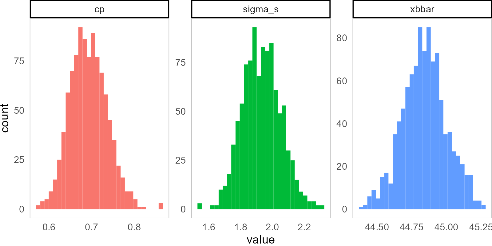
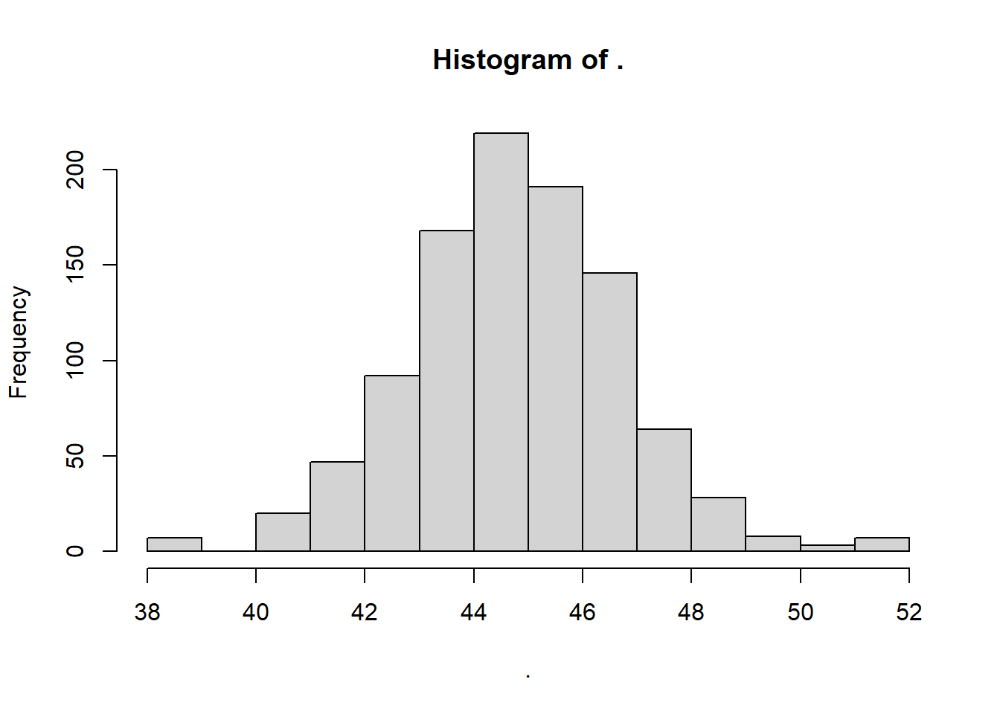
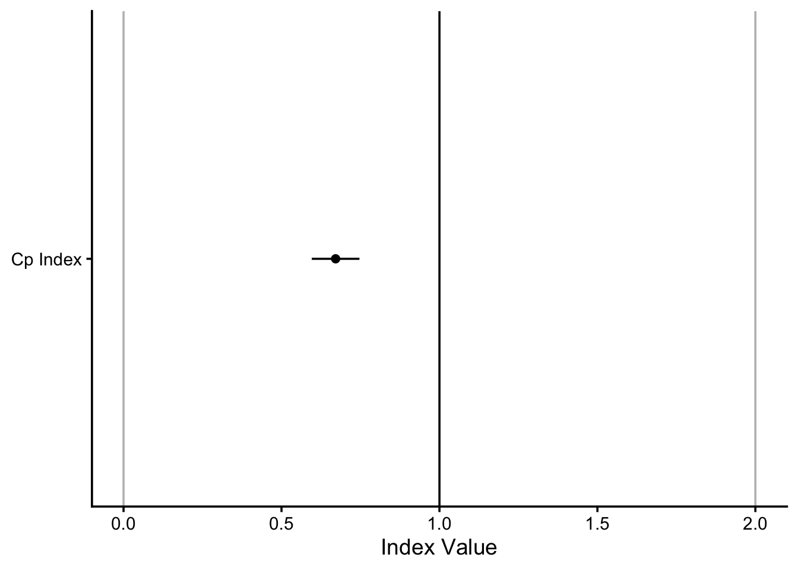
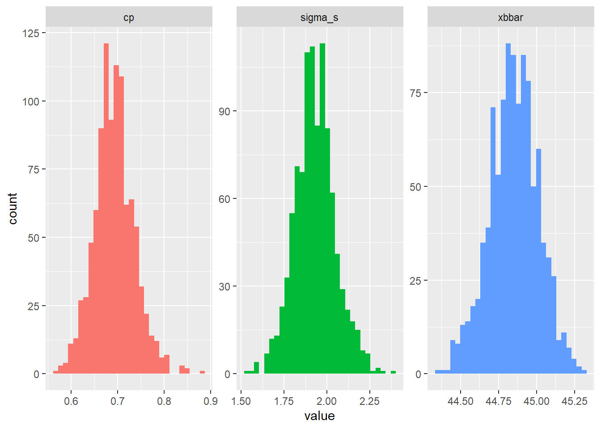

# Workshop: Indices and Confidence Intervals for Statistical Process Control in `R`


<div class="figure">

<p class="caption">(\#fig:unnamed-chunk-1)Bootstrapping Sampling Distributions for Statistics!!</p>
</div>

This workshop extends our toolkit developed in Workshop 9, discussing Process Capability and Stability Indices, and introducing means to calculate confidence intervals for these indices.

## Getting Started  {-}

### Packages {-}

We'll be using the `tidyverse` package for visualization, `viridis` for color palletes, `moments` for descriptive statistics, plus `ggpubr` for some add-on functions in `ggplot`.


```r
library(tidyverse)
library(viridis)
# you'll probably need to install these packages!
# install.packages(c("ggpubr", "moments")) 
```

### Our Data {-}

We'll be continuing to analyze our quality control data from a local hot springs inn (*onsen*) in sunny Kagoshima Prefecture, Japan. Every month, for 15 months, you systematically took 20 random samples of hot spring water and recorded its **temperature**, **pH**, and **sulfur** levels. How might you determine if this *onsen* is at risk of slipping out of one sector of the market (eg. Extra Hot!) and into another (just normal Hot Springs?). 

Let's read in our data from `workshops/onsen.csv`!


```r
# Let's import our samples of bathwater over time!
water = read_csv("workshops/onsen.csv")
# Take a peek!
water %>% glimpse()
```

```
## Rows: 160
## Columns: 5
## $ id     <dbl> 1, 2, 3, 4, 5, 6, 7, 8, 9, 10, 11, 12, 13, 14, 15, 16, 17, 18, …
## $ time   <dbl> 1, 1, 1, 1, 1, 1, 1, 1, 1, 1, 1, 1, 1, 1, 1, 1, 1, 1, 1, 1, 3, …
## $ temp   <dbl> 43.2, 45.3, 45.5, 43.9, 45.9, 45.0, 42.3, 44.2, 42.2, 43.4, 46.…
## $ ph     <dbl> 5.1, 4.8, 6.2, 6.4, 5.1, 5.6, 5.5, 5.3, 5.2, 5.9, 5.8, 5.3, 5.9…
## $ sulfur <dbl> 0.0, 0.4, 0.9, 0.2, 0.0, 0.1, 0.0, 0.0, 0.0, 0.1, 0.7, 1.1, 0.1…
```

Our dataset contains:

- `id`: unique identifer for each sample of *onsen* water.

- `time`: categorical variable describing date of sample (month `1`, month `3`, ... month `15`).

- `temp`: temperature in celsius.

- `ph`: pH (0 to 14)

- `sulfur`: milligrams of sulfur ions.

<br>
<br>

## Process Capability vs. Stability

###  Definitions

Production processes can be categorized in terms of **Capability** (does it meet required specifications?) and **Stability** (is production consistent and predictable?) Both are vital. 

- A **capable** process delivers goods that can actually perform their function, like a 20-foot ladder that is *actually* 20 feet! 

- A **stable** process delivers products with *consistent* and predictable traits (regardless of whether those traits are *good*). 

We need to maximize *both* process **capability** and **stability** to make an effective process, be it in manufacturing, health care, local businesses, or social life! Depending on the *shape* and *stability* of our data, we should choose one of the 4 statistics to evaluate our data. 

<br>
<br>

###  Table of Indices

These statistics rely on some combination of (1) the mean $\mu$, (2) the standard deviation $\sigma$, and (3) the upper and lower **"specification limits"**; the specification limits are our **expected values** $E_{upper}$ and $E_{lower}$, as compared to our actual **observed values**, summarized by $\mu$ and $\sigma$.

<table class="table table-striped table-hover table-condensed" style="margin-left: auto; margin-right: auto;">
 <thead>
  <tr>
   <th style="text-align:left;"> Index </th>
   <th style="text-align:left;"> Shape </th>
   <th style="text-align:left;"> Sided </th>
   <th style="text-align:left;"> Stability </th>
   <th style="text-align:left;"> Formula </th>
   <th style="text-align:left;"> Meaning </th>
  </tr>
 </thead>
<tbody>
  <tr grouplength="2"><td colspan="6" style="border-bottom: 1px solid;"><strong>Capability Indices (How $\textit{could}$ it perform, if stable?)</strong></td></tr>
<tr>
   <td style="text-align:left;padding-left: 2em;" indentlevel="1"> $C_{p}$ </td>
   <td style="text-align:left;"> Centered </td>
   <td style="text-align:left;"> 2-sided </td>
   <td style="text-align:left;"> Stable </td>
   <td style="text-align:left;"> $\frac{E_{upper} - E_{lower}}{6 \sigma_{short}}$ </td>
   <td style="text-align:left;"> How many times wider is the expected range than the observed range, assuming it is stable? </td>
  </tr>
  <tr>
   <td style="text-align:left;padding-left: 2em;" indentlevel="1"> $C_{pk}$ </td>
   <td style="text-align:left;"> Uncentered </td>
   <td style="text-align:left;"> 1-sided </td>
   <td style="text-align:left;"> Stable </td>
   <td style="text-align:left;"> $\frac{\mid E_{limit} - \mu \mid}{3 \sigma_{short}}$ </td>
   <td style="text-align:left;"> How many times wider is the expected vs. observed range for the left/right side, assuming it is stable? </td>
  </tr>
  <tr grouplength="2"><td colspan="6" style="border-bottom: 1px solid;"><strong>Process Performance Indices (How is it performing, stable or not?)</strong></td></tr>
<tr>
   <td style="text-align:left;padding-left: 2em;" indentlevel="1"> $P_{p}$ </td>
   <td style="text-align:left;"> Centered </td>
   <td style="text-align:left;"> 2-sided </td>
   <td style="text-align:left;"> Unstable </td>
   <td style="text-align:left;"> $\frac{E_{upper} - E_{lower}}{6 \sigma_{total}}$ </td>
   <td style="text-align:left;"> How many times wider is the expected vs. observed range, stable or not? </td>
  </tr>
  <tr>
   <td style="text-align:left;padding-left: 2em;" indentlevel="1"> $P_{pk}$ </td>
   <td style="text-align:left;"> Uncentered </td>
   <td style="text-align:left;"> 1-sided </td>
   <td style="text-align:left;"> Unstable </td>
   <td style="text-align:left;"> $\frac{\mid E_{limit} - \mu \mid}{3 \sigma_{total}}$ </td>
   <td style="text-align:left;"> How many times wider is the expected vs. observed range for the left/right side, stable or not? </td>
  </tr>
</tbody>
</table>


## Index Functions

Let's do ourselves a favor and write up some simple functions for these.


```r
# Capability Index (for centered, normal data)
cp = function(sigma_s, upper, lower){  abs(upper - lower) / (6*sigma_s)   }

# Process Performance Index (for centered, normal data)
pp = function(sigma_t, upper, lower){  abs(upper - lower) / (6*sigma_t)   }

# Capability Index (for skewed, uncentered data)
cpk = function(mu, sigma_s, lower = NULL, upper = NULL){
  if(!is.null(lower)){
    a = abs(mu - lower) / (3 * sigma_s)
  }
  if(!is.null(upper)){
    b = abs(upper - mu) /  (3 * sigma_s)
  }
  # We can also write if else statements like this
  # If we got both stats, return the min!
  if(!is.null(lower) & !is.null(upper)){
    min(a,b) %>% return()
    
    # If we got just the upper stat, return b (for upper)
  }else if(is.null(lower)){ return(b) 
    
    # If we got just the lower stat, return a (for lower)
    }else if(is.null(upper)){ return(a) }
}


# Process Performance Index (for skewed, uncentered data)
ppk = function(mu, sigma_t, lower = NULL, upper = NULL){
  if(!is.null(lower)){
    a = abs(mu - lower) / (3 * sigma_t)
  }
  if(!is.null(upper)){
    b = abs(upper - mu) /  (3 * sigma_t)
  }
  # We can also write if else statements like this
  # If we got both stats, return the min!
  if(!is.null(lower) & !is.null(upper)){
    min(a,b) %>% return()
    
    # If we got just the upper stat, return b (for upper)
  }else if(is.null(lower)){ return(b) 
    
    # If we got just the lower stat, return a (for lower)
  }else if(is.null(upper)){ return(a) }
}
```

<br>
<br>

How might we use these indices to describe our process data? For example, recall that our *onsen* operator needs to be sure that their hot springs water is consistently falling into the temperature bins for *Extra Hot Springs*, which start at 42 degrees Celsius (and go as high as `80`). Let's use those as our specification limits (pretty easy-going limits, I might add).

Let's start by calculating our quantities of interest.


```r
stat = water %>%
  group_by(time) %>%
  summarize(
    xbar = mean(temp),  # Get within group mean
    sd = sd(temp),  # Get within group sigma
    n_w = n()             # Get within subgroup size
  ) %>%
  summarize(
    xbbar = mean(xbar),               # Get grand mean
    sigma_s = sqrt(mean(sd^2)), # Get sigma_short
    sigma_t = sd(water$temp), # get sigma_total
    n = sum(n_w), # Get total observations
    n_w = unique(n_w), # get size of subgroups
    k = n())   # Get number of subgroups k
# Check it!
stat
```

```
## # A tibble: 1 × 6
##   xbbar sigma_s sigma_t     n   n_w     k
##   <dbl>   <dbl>   <dbl> <int> <int> <int>
## 1  44.8    1.99    1.99   160    20     8
```

###  Capacity Index $C_{p}$

Our $C_{p}$ Capacity index says, assuming that the distribution is centered and stable, how many times wider are our limits than our approximate observed distribution ($6 \sigma_{short}$)?


```r
mycp = cp(sigma_s = stat$sigma_s, lower = 42, upper = 80)

# Check it!
mycp
```

```
## [1] 3.18871
```
Great! This says, our observed variation is many times (3.1887098 times) narrower than the expected specification limits. 

<br>

###  Process Performance Index $P_{p}$

Our $P_{p}$ Process Performance Index asks, even if the distribution is not stable (meaning it varies not just due to common causes), how many times wider are our specification limits than our approximate observed distribution ($6 \sigma_{total}$)?


```r
mypp = pp(sigma_t = stat$sigma_t, lower = 42, upper = 80)
mypp
```

```
## [1] 3.183378
```
Much like before, the specification limit range remains quite bigger than the observed distribution.

<br>

###  Capacity Index $C_{pk}$

Our $C_{pk}$ Capacity index says, assuming the distribution is pretty stable across subgroups, how many times wider is (a) the distance from the tail of interest to the mean than (b) our approximate observed tail (3 sigma)? This always looks at the *shorter tail*.


```r
mycpk = cpk(sigma_s = stat$sigma_s, mu = stat$xbbar, lower = 42, upper = 80)
mycpk
```

```
## [1] 0.4783065
```

If we only care about one of the tails, eg. the lower specification limit of 42, which is much closer than the upper limit of 80, we can just write the lower limit only.


```r
cpk(sigma_s = stat$sigma_s, mu = stat$xbbar, lower = 42)
```

```
## [1] 0.4783065
```

This says, our observed variation is much wider than the lower specification limit, since $C_{pk}$ is far from `1`, which which show equality.

<br>
<br>

###  Process Performance Index $P_{pk}$

Our $P_{pk}$ process performance index says, even if the distribution is neither stable nor centered, how much wider is the observed variation $3 \sigma_{total}$ than the distance from the tail of interest to the mean? We use $\sigma_{total}$ here to account for instability (considerable variation between subgroups) and one-tailed testing to account for the uncentered distribution.


```r
myppk = ppk(sigma_t = stat$sigma_t, mu = stat$xbbar, lower = 42, upper = 80)
myppk
```

```
## [1] 0.4775067
```

###  Equality

A final reason why these quantities are neat is that these 4 indices are related; if you know 3 of them, we can always calculate the 4th! See the identity below:

$$P_{p} \times C_{pk} = P_{pk} \times C_{p}$$


```r
# whaaaaaat? They're equal!!!! 
mypp * mycpk == myppk * mycp
```

```
## [1] TRUE
```
<br>
<br>


---

## Learning Check 1 {.unnumbered #LC1}

**Question**

Let's apply this to some tasty examples! A manufacturer of granola bars is aiming for a weight of `2 ounces (oz)`, plus or minus `0.5 oz`. Suppose the standard deviation of our granola bar machine is `0.02 oz`, and the mean weight is `2.01 oz`. 

What's the process capability index? (I.e. How many times greater is the expected variation than the observed variation?)

<details><summary>**[View Answer!]**</summary>


```r
lower = 2 + 0.05
upper = 2 - 0.05
sigma = 0.02
mu = 2.01


cp(sigma = 0.02, upper = 2.05, lower = 1.95)
```

```
## [1] 0.8333333
```

```r
cpk(mu = 2.01, sigma = 0.02, lower = 1.95, upper = 2.05)
```

```
## [1] 0.6666667
```

  
</details>
  
---

<br>
<br>


## Confidence Intervals

Any statistic is really just 1 of the many possible values of statistics you could have gotten from your sample, had you taken just a slightly different random sample. So, when we calculate our indices, we should be prepared that our indices might *vary due to chance (sampling error)*, so we should build in confidence intervals. This helps us benchmark how trustworthy any given index is.

<br>
<br>

###  Confidence Intervals show us Sampling Distributions 

Let's quickly go over what confidence intervals are trying to show us!

Suppose we take a statistic like the mean $\mu$ to describe our vector `temp`.


```r
water %>%
  summarize(mean = mean(temp))
```

```
## # A tibble: 1 × 1
##    mean
##   <dbl>
## 1  44.8
```

We might have gotten a *slightly* different statistic had we had a *slightly* different sample. We can approximate what *slightly* different sample might look like by using *bootstrapped resamples*. This means, randomly sampling a bunch of observations from our dataframe `water`,  sometimes taking the same observation multiple times, sometimes leaving out some observations by chance. We can use the `sample(x, size = ..., replace = TRUE)` function to take a **bootstrapped sample**.


```r
water %>%
  # Grab n() randomly sampled temperatures, with replacement,
  # we'll call those 'boot', since they were 'bootstrapped'
  summarize(boot = sample(temp, size = n(), replace = TRUE)) %>%
  # and take the mean!
  summarize(mean = mean(boot))
```

```
## # A tibble: 1 × 1
##    mean
##   <dbl>
## 1  45.1
```

Our bootstrapped `mean` is *very*, *very* close to the original mean - just slightly off due to sampling error! Bootstrapping is a very powerful tool, as it lets us circumvent many long formulas, as long as you take enough samples. Let's take 1000 resamples below:


```r
# Get a vector of ids from 1 to 1000
myboot = tibble(rep = 1:1000) %>%
  # For each repetition,
  group_by(rep) %>%
  # Get a random bootstrapped sample of temperatures
  summarize(boot = water$temp %>% sample(size = n(), replace = TRUE)) %>%
  # For that repetition,
  group_by(rep) %>%
  # Calculate the mean of the bootstrapped samples!
  summarize(mean = mean(boot))

# Let's view them!
myboot$mean %>% hist()
```


We can see above the *latent distribution of 1000 statistics we could have gotten due to random sampling error*. This is called a **sampling distribution**. Whenever we make confidence intervals, we are *always* drawing from a **sampling distribution**.

<br>
<br>

###  Bootstrapped or Theoretical Sampling Distributions?

The question is, are you relying on a *bootstrapped* sampling distribution or a *theoretical* sampling distribution? 

- If we assume a perfectly *normal* distribution, then we're relying on a theoretical sampling distribution, and we need formulas to calculate our confidence intervals. This is a big assumption!

- If we are comfortable with computing 1000 or more replicates, then we can bootstrap those confidence intervals instead, gaining accuracy at the expense of computational power.

Let's learn how to make confidence intervals for our indices from (1) a theoretical sampling distribution, and then we'll learn to make them from (2) a bootstrapped sampling distribution.

<br>
<br>

###  Confidence Intervals with Theoretical Sampling Distributions

Suppose our lower and upper specification limits - the expectations of the market and/or regulators - are that our *onsen*'s temperature should be between 42 and 50 degrees Celsius if we advertise ourselves as an Extra Hot Onsen.

For any index, you'll need to get the ingredients needed to calculate the index and to calculate its *standard error* (the standard deviation of the sampling distribution you're trying to approximate).

So, let's first get our ingredients...


```r
stat = water %>%
  group_by(time) %>%
  summarize(xbar = mean(temp),
            s = sd(temp),
            n_w = n()) %>%
  summarize(
    xbbar = mean(xbar), # grand mean x-double-bar
    sigma_s = sqrt(mean(s^2)), # sigma_short
    sigma_t = water$temp %>% sd(), # sigma_total!
    n = sum(n_w), # or just n = n()   # Total sample size
    n_w = unique(n_w),
    k = time %>% unique() %>% length())   # Get total subgroups

# Check it!
stat
```

```
## # A tibble: 1 × 6
##   xbbar sigma_s sigma_t     n   n_w     k
##   <dbl>   <dbl>   <dbl> <int> <int> <int>
## 1  44.8    1.99    1.99   160    20     8
```

Now, let's calculate our Capability Index $C_{p}$, which assumes a process *centered* between the upper and lower specification limits and a *stable* process.


```r
# Capability Index (for centered, normal data)
cp = function(sigma_s, upper, lower){  abs(upper - lower) / (6*sigma_s)   }


stat %>% 
  summarize(
    limit_lower = 42,
    limit_upper = 50,
    # index
    estimate = cp(sigma_s = sigma_s, lower = limit_lower, upper = limit_upper))
```

```
## # A tibble: 1 × 3
##   limit_lower limit_upper estimate
##         <dbl>       <dbl>    <dbl>
## 1          42          50    0.671
```


That was surprisingly painless!

Now, let's estimate the two-sided, 95% confidence interval of our sampling distribution for the statistic `cp`, assuming that this sampling distribution has a *normal* shape.

We're getting the interval that spans 95%, so it's got to start at 2.5% and end at 97.5%, covering the 95% *most frequently occurring statistics* in the sampling distribution.


```r
bands = stat %>% 
  summarize(
    limit_lower = 42,
    limit_upper = 50,
    # index
    estimate = cp(sigma_s = sigma_s, lower = limit_lower, upper = limit_upper),
    # Get our extra quantities of interest
    v_short = k*(n_w - 1), # get degrees of freedom
    # Get standard error for estimate
    se = estimate * sqrt(1 / (2*v_short)),
    # Get z score
    z = qnorm(0.975), # get position of 97.5th percentile in normal distribution
    # Now if z, the 97.5th percentile,
    # is 1.96 standard deviations from the mean in the normal,
    # Then so too is the 2.5th percentile in the normal.
    # Give me 1.96 standard deviations above cp 
    # in the sampling distribution of cp!
    # Get upper and lower confidence interval!
    lower = estimate - z * se,
    upper = estimate + z * se)

bands
```

```
## # A tibble: 1 × 8
##   limit_lower limit_upper estimate v_short     se     z lower upper
##         <dbl>       <dbl>    <dbl>   <dbl>  <dbl> <dbl> <dbl> <dbl>
## 1          42          50    0.671     152 0.0385  1.96 0.596 0.747
```


<br>
<br>

###  Visualizing Confidence Intervals

Were we to visualize this, it might look like...


```r
bands %>%
  ggplot(mapping = aes(x = "Cp Index", y = estimate, 
                       ymin = lower, ymax = upper)) +
  # Get draw us some benchmarks to make our chart meaningful
  geom_hline(yintercept = c(0,1,2), color = c("grey", "black", "grey")) +
  # Draw the points!
  geom_point() +
  geom_linerange() +
  # Add theming
  theme_classic(base_size = 14) +
  coord_flip() +
  labs(y = "Index Value", x = NULL)
```



It's not the most exciting plot, but it does show very clearly that the value of $C_{p}$ and its 95% confidence interval are nowhere even close to 1.0, the key threshold. This means we can say with 95% confidence that the true value of $C_{p}$ is **less than 1**.

<br>
<br>

###  Bootstrapping $C_{p}$

How might we estimate this using the bootstrap?

Well, we could...


```r
myboot = tibble(rep = 1:1000) %>%
  # For each rep,
  group_by(rep) %>%
  # Give me the data.frame water,
  summarize(water) %>%
  # And give me a random sample of observations
  sample_n(size = n(), replace = TRUE)
  
myboot %>% glimpse()
```

```
## Rows: 160,000
## Columns: 6
## Groups: rep [1,000]
## $ rep    <int> 1, 1, 1, 1, 1, 1, 1, 1, 1, 1, 1, 1, 1, 1, 1, 1, 1, 1, 1, 1, 1, …
## $ id     <dbl> 125, 68, 35, 89, 102, 41, 37, 136, 93, 74, 120, 71, 140, 142, 9…
## $ time   <dbl> 13, 7, 3, 9, 11, 5, 3, 13, 9, 7, 11, 7, 13, 15, 1, 9, 9, 13, 1,…
## $ temp   <dbl> 45.5, 44.1, 44.8, 44.2, 45.1, 46.6, 46.6, 44.7, 51.1, 45.5, 45.…
## $ ph     <dbl> 5.4, 6.8, 6.0, 5.5, 4.4, 5.8, 5.1, 5.1, 4.8, 5.2, 5.3, 5.9, 5.0…
## $ sulfur <dbl> 1.0, 0.1, 0.4, 0.0, 0.0, 0.2, 0.1, 1.0, 0.0, 0.4, 1.8, 0.0, 0.5…
```
This produces a very, very big data.frame!

Let's now, for each rep, calculate our statistics from before!


```r
mybootstat = myboot %>%
  # For each rep, and each subgroup...
 group_by(rep, time) %>%
  summarize(
    xbar = mean(temp),  # Get within group mean
    sigma_w = sd(temp),  # Get within group sigma
    n_w = n()             # Get within subgroup size
  ) %>%
  # For each rep...
  group_by(rep) %>%
  summarize(
    limit_upper = 42,
    limit_lower = 50,
    xbbar = mean(xbar),               # Get grand mean
    sigma_s = sqrt(mean(sigma_w^2)), # Get sigma_short
    n = sum(n_w), # Get total observations
    n_w = unique(n_w)[1],
    k = n(),   # Get number of subgroups k
    limit_lower = 42,
    limit_upper = 50,
    estimate = cp(sigma_s, upper = limit_upper, lower = limit_lower))
```

So cool! We've now generated the sampling distributions for `xbbar`, `sigma_s`, and `cp`! 

We can even visualize the raw distributions now! Look at those wicked cool bootstrapped sampling distributions!!!


```r
g = mybootstat %>%
  # For each rep,
  group_by(rep) %>%
  # Stack our values atop each other...
  summarize(
    # Get these names, and repeat them each n times
    type = c("xbbar", "sigma_s", "cp") %>% rep(each = n()),
    value = c(xbbar, sigma_s, estimate)) %>%
  ggplot(mapping = aes(x = value, fill = type)) +
  geom_histogram() +
  facet_wrap(~type, scales = "free") +
  guides(fill = "none")
# View it!
g
```



So last, let's take our boostrapped $C_{p}$ statistics in `mybootstat$cp` and estimate a confidence interval and standard error for this sampling distribution.

Because we have the *entire distribution*, we can extract values at specific percentiles in the distribution using `quantiles()`, rather than `qnorm()` or such theoretical distributions.


```r
# We'll save it as 'myqi', for quantities of interest
myqi = mybootstat %>% 
  summarize(
    # Let's grab the original cp statistic
    cp = bands$estimate,
    # Get the lower and upper 95% confidence intervals
    lower = quantile(estimate, probs = 0.025),
    upper = quantile(estimate, probs = 0.975),
    # We can even get the standard error,
    # which is *literally* the standard deviation of this sampling distribution
    se = sd(estimate))

# Check it out!
myqi
```

```
## # A tibble: 1 × 4
##      cp lower upper     se
##   <dbl> <dbl> <dbl>  <dbl>
## 1 0.671 0.614 0.788 0.0445
```

This suggests a wider confidence interval that our normal distribution assumes by default - interesting!

We can perform bootstrapping to estimate confidence intervals for *any* statistic, including $C_{p}$, $C_{pk}$, $P_{p}$, or $P_{pk}$. The only limit is your computational power! Wheee!


*Note*: Whenever you bootstrap, it's important that you clear out your `R` environment to keep things running quickly, because you tend to accumulate a lot of really big data.frames. You can use `remove()` to do this.


```r
remove(myboot, mybootstat)
```

<br>
<br>

## CIs for any Index!

Let's practice calculating confidence intervals (CIs) for each of these indices.

<br>
<br>

###  CIs for $P_p$

Now that we have our ingredients, let's get our index and its confidence intervals!


```r
# Capability Index (for centered, normal data)
cp = function(sigma_s, upper, lower){  abs(upper - lower) / (6*sigma_s)   }


stat %>% 
  summarize(
    # index
    estimate = cp(sigma_s = sigma_s, lower = 42, upper = 50),
    # Get our extra quantities of interest
    v_short = k*(n_w - 1), # get degrees of freedom
    # Get standard error for cpk
    se = estimate * sqrt(1 / (2*v_short)),
    # Get z score
    z = qnorm(0.975), # get position of 97.5th percentile in normal distribution
    # Get upper and lower confidence interval!
    lower = estimate - z * se,
    upper = estimate + z * se)
```

```
## # A tibble: 1 × 6
##   estimate v_short     se     z lower upper
##      <dbl>   <dbl>  <dbl> <dbl> <dbl> <dbl>
## 1    0.671     152 0.0385  1.96 0.596 0.747
```

###  CIs for $C_{pk}$

Write the function and generate the confidence interval for $P_{pk}$!


```r
# Capability Index (for skewed, uncentered data)
cpk = function(mu, sigma_s, lower = NULL, upper = NULL){
  if(!is.null(lower)){
    a = abs(mu - lower) / (3 * sigma_s)
  }
  if(!is.null(upper)){
    b = abs(upper - mu) /  (3 * sigma_s)
  }
  # We can also write if else statements like this
  # If we got both stats, return the min!
  if(!is.null(lower) & !is.null(upper)){
    min(a,b) %>% return()
    
    # If we got just the upper stat, return b (for upper)
  }else if(is.null(lower)){ return(b) 
    
    # If we got just the lower stat, return a (for lower)
    }else if(is.null(upper)){ return(a) }
}


stat %>% 
  summarize(
    # index
    estimate = cpk(mu = xbbar, sigma_s = sigma_s, lower = 42, upper = 50),
    # Get our extra quantities of interest
    v_short = k*(n_w - 1), # get degrees of freedom
    # Get standard error for ppk
    se = estimate * sqrt( 1 / (2*v_short)  + 1 / (9 * n * estimate^2) ),
    # Get z score
    z = qnorm(0.975), # get position of 97.5th percentile in normal distribution
    # Get upper and lower confidence interval!
    lower = estimate - z * se,
    upper = estimate + z * se)
```

```
## # A tibble: 1 × 6
##   estimate v_short     se     z lower upper
##      <dbl>   <dbl>  <dbl> <dbl> <dbl> <dbl>
## 1    0.478     152 0.0380  1.96 0.404 0.553
```


###  CIs for $P_p$

Now that we have our ingredients, let's get our index and its confidence intervals!


```r
# Suppose we're looking at the entire process!

# Process Performance Index (for centered, normal data)
pp = function(sigma_t, upper, lower){  abs(upper - lower) / (6*sigma_t)   }


stat %>% 
  summarize(
    # index
    estimate = pp(sigma_t = sigma_t, lower = 42, upper = 50),
    # Get our extra quantities of interest
    v_total = n_w*k - 1, # get degrees of freedom
    # Get standard error for cpk
    se = estimate * sqrt(1 / (2*v_total)),
    # Get z score
    z = qnorm(0.975), # get position of 97.5th percentile in normal distribution
    # Get upper and lower confidence interval!
    lower = estimate - z * se,
    upper = estimate + z * se)
```

```
## # A tibble: 1 × 6
##   estimate v_total     se     z lower upper
##      <dbl>   <dbl>  <dbl> <dbl> <dbl> <dbl>
## 1    0.670     159 0.0376  1.96 0.597 0.744
```

<br>
<br>

###  CIs for $P_{pk}$

Write the function and generate the confidence interval for $P_{pk}$!


```r
# Process Performance Index (for skewed, uncentered data)
ppk = function(mu, sigma_t, lower = NULL, upper = NULL){
  if(!is.null(lower)){
    a = abs(mu - lower) / (3 * sigma_t)
  }
  if(!is.null(upper)){
    b = abs(upper - mu) /  (3 * sigma_t)
  }
  # We can also write if else statements like this
  # If we got both stats, return the min!
  if(!is.null(lower) & !is.null(upper)){
    min(a,b) %>% return()
    
    # If we got just the upper stat, return b (for upper)
  }else if(is.null(lower)){ return(b) 
    
    # If we got just the lower stat, return a (for lower)
  }else if(is.null(upper)){ return(a) }
}

stat %>% 
  summarize(
    # index
    estimate = ppk(mu = xbbar, sigma_t = sigma_t, lower = 42, upper = 50),
    # Get our extra quantities of interest
    v_total = n_w*k - 1, # get degrees of freedom
    # Get standard error for cpk
    se = estimate * sqrt( 1 / (2*v_total)  + 1 / (9 * n * estimate^2) ),
    # Get z score
    z = qnorm(0.975), # get position of 97.5th percentile in normal distribution
    # Get upper and lower confidence interval!
    lower = estimate - z * se,
    upper = estimate + z * se)
```

```
## # A tibble: 1 × 6
##   estimate v_total     se     z lower upper
##      <dbl>   <dbl>  <dbl> <dbl> <dbl> <dbl>
## 1    0.478     159 0.0376  1.96 0.404 0.551
```


<br>
<br>
<br>

## Conclusion {-}

Alright! You are now a confidence interval wizard! 

Go forth and make confidence intervals!


