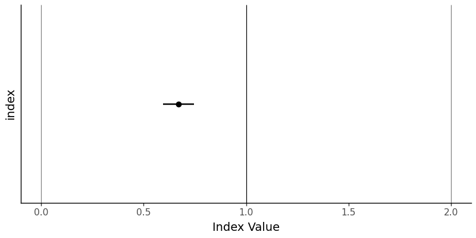
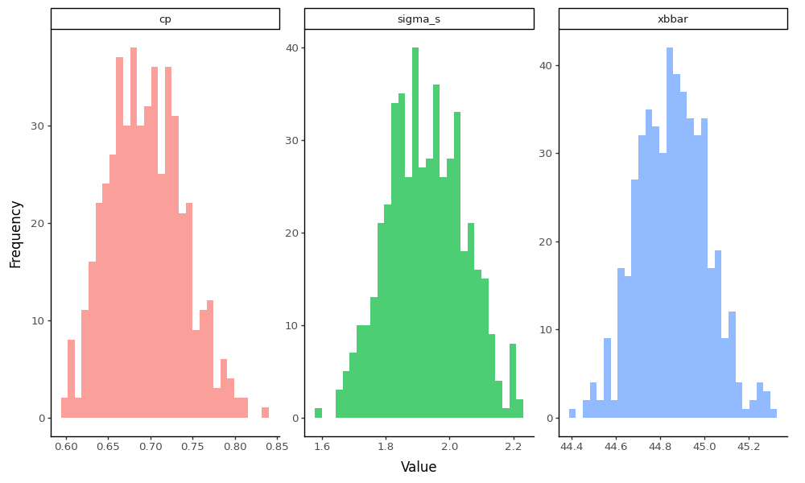

# Indices and Confidence Intervals for Statistical Process Control in `Python` 


<div class="figure">

<p class="caption">(\#fig:unnamed-chunk-1)Bootstrapping Sampling Distributions for Statistics!!</p>
</div>

This workshop extends our toolkit developed earlier, discussing Process Capability and Stability Indices, and introducing means to calculate confidence intervals for these indices using Python. We'll calculate Cp, Cpk, Pp, and Ppk, then construct normal-approximation confidence intervals and a simple bootstrap, paralleling the R chapter.

## Getting Started {-}

### Packages {-}

We'll be using `pandas` for data manipulation, `plotnine` for visualization, `scipy` for statistical functions, and custom functions from the `functions_distributions` module.


``` python
# Remember to install these packages using a terminal, if you haven't already!
!pip install pandas plotnine scipy
```


``` python
# Load our packages
import pandas as pd
from plotnine import *
import numpy as np
from scipy import stats
```

### Custom Functions {-}

This workshop uses custom functions from the `functions_distributions.py` module. To use these functions, you need to acquire them from the repository at [github.com/timothyfraser/sigma/tree/main/functions](https://github.com/timothyfraser/sigma/tree/main/functions).

**Add the functions directory to your Python path**

``` python
import sys
import os
# Add the functions directory to Python path
sys.path.append('functions')  # or path to wherever you placed the functions folder
```

Once you have the functions available, you can import them:


``` python
from functions_distributions import *
```

### Our Data {-}

We'll be continuing to analyze our quality control data from a local hot springs inn (*onsen*) in sunny Kagoshima Prefecture, Japan. Every month, for 15 months, you systematically took 20 random samples of hot spring water and recorded its **temperature**, **pH**, and **sulfur** levels. How might you determine if this *onsen* is at risk of slipping out of one sector of the market (eg. Extra Hot!) and into another (just normal Hot Springs?).

Let's read in our data from `workshops/onsen.csv`!


``` python
# Let's import our samples of bathwater over time!
water = pd.read_csv('workshops/onsen.csv')
# Take a peek!
print(water.head(3))
```

```
##    id  time  temp   ph  sulfur
## 0   1     1  43.2  5.1     0.0
## 1   2     1  45.3  4.8     0.4
## 2   3     1  45.5  6.2     0.9
```

``` python
print(f"Dataset shape: {water.shape}")
```

```
## Dataset shape: (160, 5)
```

``` python
print(f"Columns: {list(water.columns)}")
```

```
## Columns: ['id', 'time', 'temp', 'ph', 'sulfur']
```

Our dataset contains:

- `id`: unique identifier for each sample of *onsen* water.
- `time`: categorical variable describing date of sample (month `1`, month `3`, ... month `15`).
- `temp`: temperature of the hot spring water in Celsius.
- `ph`: pH level of the hot spring water.
- `sulfur`: sulfur content in mg per kg of water.

### Process Overview

Let's get a visual overview of our temperature data across time to understand the process:


``` python
# Create a process overview plot
g = (ggplot(water, aes(x='time', y='temp')) +
     geom_point(alpha=0.6, size=2) +
     geom_hline(yintercept=[42, 50], color=['red', 'red'], linetype='dashed') +
     theme_classic(base_size=14) +
     labs(x='Time (Month)', y='Temperature (°C)', 
          title='Hot Spring Temperature Over Time',
          subtitle='Red dashed lines show specification limits (42-50°C)') +
     theme(plot_title=element_text(hjust=0.5),
           plot_subtitle=element_text(hjust=0.5)))

# Save the plot
g.save('images/06_process_overview.png', width=10, height=6, dpi=100)
```


This plot shows our temperature measurements over time, with the specification limits for "Extra Hot Springs" (42-50°C) marked as red dashed lines. We can see the process variation and how it relates to our target specifications.

## Process Capability vs. Stability

### Definitions

Production processes can be categorized in terms of **Capability** (does it meet required specifications?) and **Stability** (is production consistent and predictable?) Both are vital.

- A **capable** process delivers goods that can actually perform their function, like a 20-foot ladder that is *actually* 20 feet!

- A **stable** process delivers products with *consistent* and predictable traits (regardless of whether those traits are *good*).

We need to maximize *both* process **capability** and **stability** to make an effective process, be it in manufacturing, health care, local businesses, or social life! Depending on the *shape* and *stability* of our data, we should choose one of the 4 statistics to evaluate our data.

### Table of Indices

These statistics rely on some combination of (1) the mean $\mu$, (2) the standard deviation $\sigma$, and (3) the upper and lower **"specification limits"**; the specification limits are our **expected values** $E_{upper}$ and $E_{lower}$, as compared to our actual **observed values**, summarized by $\mu$ and $\sigma$.

| Index | Shape | Sided | Stability | Formula | Meaning |
|-------|-------|-------|-----------|---------|---------|
| **$C_{p}$** | Centered | 2-sided | Stable | $\frac{E_{upper} - E_{lower}}{6 \sigma_{short}}$ | How many times wider is the expected range than the observed range, assuming it is stable? |
| **$C_{pk}$** | Uncentered | 1-sided | Stable | $\frac{\mid E_{limit} - \mu \mid}{3 \sigma_{short}}$ | How many times wider is the expected vs. observed range for the left/right side, assuming it is stable? |
| **$P_{p}$** | Centered | 2-sided | Unstable | $\frac{E_{upper} - E_{lower}}{6 \sigma_{total}}$ | How many times wider is the expected vs. observed range, stable or not? |
| **$P_{pk}$** | Uncentered | 1-sided | Unstable | $\frac{\mid E_{limit} - \mu \mid}{3 \sigma_{total}}$ | How many times wider is the expected vs. observed range for the left/right side, stable or not? |

**Capability Indices** (How *could* it perform, if stable?): $C_p$, $C_{pk}$
**Process Performance Indices** (How is it performing, stable or not?): $P_p$, $P_{pk}$

### Index Functions

Let's do ourselves a favor and write up some simple functions for these.


``` python
def cp(sigma_s, upper, lower):
  """Capability index for centered, stable processes"""
  return abs(upper - lower) / (6*sigma_s)

def pp(sigma_t, upper, lower):
  """Performance index for centered, unstable processes"""
  return abs(upper - lower) / (6*sigma_t)

def cpk(mu, sigma_s, lower=None, upper=None):
  """Capability index for uncentered, stable processes"""
  a = None; b = None
  if lower is not None:
    a = abs(mu - lower) / (3*sigma_s)
  if upper is not None:
    b = abs(upper - mu) / (3*sigma_s)
  if (lower is not None) and (upper is not None):
    return min(a,b)
  return a if upper is None else b

def ppk(mu, sigma_t, lower=None, upper=None):
  """Performance index for uncentered, unstable processes"""
  a = None; b = None
  if lower is not None:
    a = abs(mu - lower) / (3*sigma_t)
  if upper is not None:
    b = abs(upper - mu) / (3*sigma_t)
  if (lower is not None) and (upper is not None):
    return min(a,b)
  return a if upper is None else b
```

### Ingredients

Now we need to calculate the key statistics that feed into our capability indices. We'll calculate both within-subgroup statistics (for capability indices) and total statistics (for performance indices).


``` python
stat_s = (water.groupby('time').apply(lambda d: pd.Series({
  'xbar': d['temp'].mean(),
  's': d['temp'].std(),
  'n_w': len(d)
})).reset_index())

stat = pd.DataFrame({
  'xbbar': [stat_s['xbar'].mean()],
  'sigma_s': [(stat_s['s']**2).mean()**0.5],
  'sigma_t': [water['temp'].std()],
  'n': [stat_s['n_w'].sum()],
  'n_w': [stat_s['n_w'].iloc[0]],
  'k': [len(stat_s)]
})
stat
```

```
##    xbbar   sigma_s   sigma_t      n   n_w  k
## 0  44.85  1.986174  1.989501  160.0  20.0  8
```

These statistics give us:

- **xbbar**: The grand mean across all subgroups
- **sigma_s**: The pooled within-subgroup standard deviation (for capability indices)
- **sigma_t**: The total process standard deviation (for performance indices)
- **n**: Total number of observations
- **n_w**: Number of observations per subgroup
- **k**: Number of subgroups

### Cp and Pp

Now let's calculate the capability and performance indices. We'll use specification limits for "Extra Hot Springs" (42-50°C) as our target range.


``` python
limit_lower = 42; limit_upper = 50
estimate_cp = cp(stat['sigma_s'][0], upper=limit_upper, lower=limit_lower)
estimate_pp = pp(stat['sigma_t'][0], upper=limit_upper, lower=limit_lower)
print(f"Cp (capability): {estimate_cp:.3f}")
```

```
## Cp (capability): 0.671
```

``` python
print(f"Pp (performance): {estimate_pp:.3f}")
```

```
## Pp (performance): 0.670
```

### Cpk and Ppk

Now let's calculate the uncentered indices that account for process centering:


``` python
estimate_cpk = cpk(mu=stat['xbbar'][0], sigma_s=stat['sigma_s'][0], lower=limit_lower, upper=limit_upper)
estimate_ppk = ppk(mu=stat['xbbar'][0], sigma_t=stat['sigma_t'][0], lower=limit_lower, upper=limit_upper)
print(f"Cpk (capability, uncentered): {estimate_cpk:.3f}")
```

```
## Cpk (capability, uncentered): 0.478
```

``` python
print(f"Ppk (performance, uncentered): {estimate_ppk:.3f}")
```

```
## Ppk (performance, uncentered): 0.478
```

### Equality

There's an interesting mathematical relationship between these indices:


``` python
equality_check = (estimate_pp * estimate_cpk) == (estimate_ppk * estimate_cp)
print(f"Pp × Cpk = Ppk × Cp: {equality_check}")
```

```
## Pp × Cpk = Ppk × Cp: True
```

``` python
print(f"Pp × Cpk = {estimate_pp * estimate_cpk:.6f}")
```

```
## Pp × Cpk = 0.320554
```

``` python
print(f"Ppk × Cp = {estimate_ppk * estimate_cp:.6f}")
```

```
## Ppk × Cp = 0.320554
```

## Confidence Intervals (Normal Approximation)

Now let's construct confidence intervals for our capability indices using the normal approximation method. This gives us a range of plausible values for the true population parameters.

### Cp Confidence Interval


``` python
import math
v_short = stat['k'][0]*(stat['n_w'][0] - 1)
se_cp = estimate_cp * math.sqrt(1 / (2*v_short))
z = 1.959963984540054  # 95% confidence level
ci_cp = (estimate_cp - z*se_cp, estimate_cp + z*se_cp)
print(f"Cp estimate: {estimate_cp:.3f}")
```

```
## Cp estimate: 0.671
```

``` python
print(f"Standard error: {se_cp:.3f}")
```

```
## Standard error: 0.039
```

``` python
print(f"95% Confidence interval: ({ci_cp[0]:.3f}, {ci_cp[1]:.3f})")
```

```
## 95% Confidence interval: (0.596, 0.747)
```

### Cpk Confidence Interval


``` python
se_cpk = estimate_cpk * math.sqrt(1 / (2*v_short) + 1 / (9*stat['n'][0]*(estimate_cpk**2)))
ci_cpk = (estimate_cpk - z*se_cpk, estimate_cpk + z*se_cpk)
print(f"Cpk estimate: {estimate_cpk:.3f}")
```

```
## Cpk estimate: 0.478
```

``` python
print(f"Standard error: {se_cpk:.3f}")
```

```
## Standard error: 0.038
```

``` python
print(f"95% Confidence interval: ({ci_cpk[0]:.3f}, {ci_cpk[1]:.3f})")
```

```
## 95% Confidence interval: (0.404, 0.553)
```

### Pp and Ppk Confidence Intervals


``` python
v_total = stat['n_w'][0]*stat['k'][0] - 1
se_pp = estimate_pp * math.sqrt(1 / (2*v_total))
ci_pp = (estimate_pp - z*se_pp, estimate_pp + z*se_pp)
print(f"Pp estimate: {estimate_pp:.3f}")
```

```
## Pp estimate: 0.670
```

``` python
print(f"Standard error: {se_pp:.3f}")
```

```
## Standard error: 0.038
```

``` python
print(f"95% Confidence interval: ({ci_pp[0]:.3f}, {ci_pp[1]:.3f})")
```

```
## 95% Confidence interval: (0.597, 0.744)
```

``` python
se_ppk = estimate_ppk * math.sqrt(1 / (2*v_total) + 1 / (9*stat['n'][0]*(estimate_ppk**2)))
ci_ppk = (estimate_ppk - z*se_ppk, estimate_ppk + z*se_ppk)
print(f"\nPpk estimate: {estimate_ppk:.3f}")
```

```
## 
## Ppk estimate: 0.478
```

``` python
print(f"Standard error: {se_ppk:.3f}")
```

```
## Standard error: 0.038
```

``` python
print(f"95% Confidence interval: ({ci_ppk[0]:.3f}, {ci_ppk[1]:.3f})")
```

```
## 95% Confidence interval: (0.404, 0.551)
```

### Visualizing Confidence Intervals

Let's create a visualization to show our Cp estimate with its confidence interval and important benchmark lines:


``` python
# Create a DataFrame for plotting
bands_data = pd.DataFrame({
    'index': ['Cp Index'],
    'estimate': [estimate_cp],
    'lower': [ci_cp[0]],
    'upper': [ci_cp[1]]
})

# Create the plot
g = (ggplot(bands_data, aes(x='index', y='estimate', ymin='lower', ymax='upper')) +
     geom_hline(yintercept=[0, 1, 2], color=['grey', 'black', 'grey']) +
     geom_point(size=3) +
     geom_linerange(size=1) +
     theme_classic(base_size=14) +
     coord_flip() +
     labs(y='Index Value', x=None) +
     theme(axis_text_y=element_blank(), axis_ticks_y=element_blank()))

# Save the plot
g.save('images/06_confidence_interval_plot.png', width=8, height=4, dpi=100)
```



It's not the most exciting plot, but it does show very clearly that the value of $C_{p}$ and its 95% confidence interval are nowhere even close to 1.0, the key threshold. This means we can say with 95% confidence that the true value of $C_{p}$ is **less than 1**.

## Bootstrapping Cp (Example)

The normal approximation method assumes certain distributional properties. As an alternative, we can use bootstrapping to estimate confidence intervals by resampling our data. This method is more robust to distributional assumptions.


``` python
import numpy as np
reps = 500
def boot_cp(seed=1):
  np.random.seed(seed)
  vals = []
  for r in range(reps):
    sample = water.sample(n=len(water), replace=True)
    stat_s_b = (sample.groupby('time').apply(lambda d: pd.Series({'xbar': d['temp'].mean(), 's': d['temp'].std(), 'n_w': len(d)})).reset_index())
    sigma_s_b = (stat_s_b['s']**2).mean()**0.5
    vals.append(cp(sigma_s_b, upper=limit_upper, lower=limit_lower))
  s = pd.Series(vals)
  return pd.DataFrame({'cp': [estimate_cp], 'lower': [s.quantile(0.025)], 'upper': [s.quantile(0.975)], 'se': [s.std()]})

bootstrap_results = boot_cp()
# Print out the results
boot_cp()
```

```
##          cp     lower     upper       se
## 0  0.671307  0.620466  0.785899  0.04336
```

### Bootstrap Sampling Distributions Visualization

So cool! We've now generated the sampling distributions for our bootstrap statistics! Let's visualize the raw distributions to see those wicked cool bootstrapped sampling distributions:


``` python
# Create a more comprehensive bootstrap function that returns all statistics
def boot_comprehensive(seed=1):
    np.random.seed(seed)
    results = []
    for r in range(reps):
        sample = water.sample(n=len(water), replace=True)
        stat_s_b = (sample.groupby('time').apply(lambda d: pd.Series({
            'xbar': d['temp'].mean(), 
            's': d['temp'].std(), 
            'n_w': len(d)
        })).reset_index())
        
        xbbar_b = stat_s_b['xbar'].mean()
        sigma_s_b = (stat_s_b['s']**2).mean()**0.5
        cp_b = cp(sigma_s_b, upper=limit_upper, lower=limit_lower)
        
        results.append({
            'rep': r,
            'xbbar': xbbar_b,
            'sigma_s': sigma_s_b,
            'cp': cp_b
        })
    
    return pd.DataFrame(results)

# Generate bootstrap data
bootstrap_data = boot_comprehensive()

# Reshape for plotting
plot_data = []
for _, row in bootstrap_data.iterrows():
    plot_data.extend([
        {'type': 'xbbar', 'value': row['xbbar']},
        {'type': 'sigma_s', 'value': row['sigma_s']},
        {'type': 'cp', 'value': row['cp']}
    ])

plot_df = pd.DataFrame(plot_data)

# Create the plot
g = (ggplot(plot_df, aes(x='value', fill='type')) +
     geom_histogram(bins=30, alpha=0.7) +
     facet_wrap('~type', scales='free') +
     theme_classic(base_size=12) +
     labs(x='Value', y='Frequency') +
     theme(legend_position='none'))

# Save the plot
g.save('images/06_bootstrap_distributions.png', width=10, height=6, dpi=100)
```



### Bootstrap Confidence Intervals

Now let's take our bootstrapped $C_{p}$ statistics and estimate a confidence interval and standard error for this sampling distribution. Because we have the *entire distribution*, we can extract values at specific percentiles in the distribution using `quantile()`, rather than theoretical distributions.


``` python
print("Bootstrap Results for Cp:")
```

```
## Bootstrap Results for Cp:
```

``` python
print(f"Original estimate: {bootstrap_results['cp'][0]:.3f}")
```

```
## Original estimate: 0.671
```

``` python
print(f"Bootstrap 95% CI: ({bootstrap_results['lower'][0]:.3f}, {bootstrap_results['upper'][0]:.3f})")
```

```
## Bootstrap 95% CI: (0.620, 0.786)
```

``` python
print(f"Bootstrap standard error: {bootstrap_results['se'][0]:.3f}")
```

```
## Bootstrap standard error: 0.043
```

This suggests a wider confidence interval than our normal distribution assumes by default - interesting!

## Conclusion {.unnumbered}

You've successfully computed capability and performance indices (Cp, Cpk, Pp, Ppk) and their confidence intervals using both normal approximation and bootstrap methods in Python. These tools help us assess process capability and performance, providing insights into whether our processes meet specifications and how consistently they perform.


