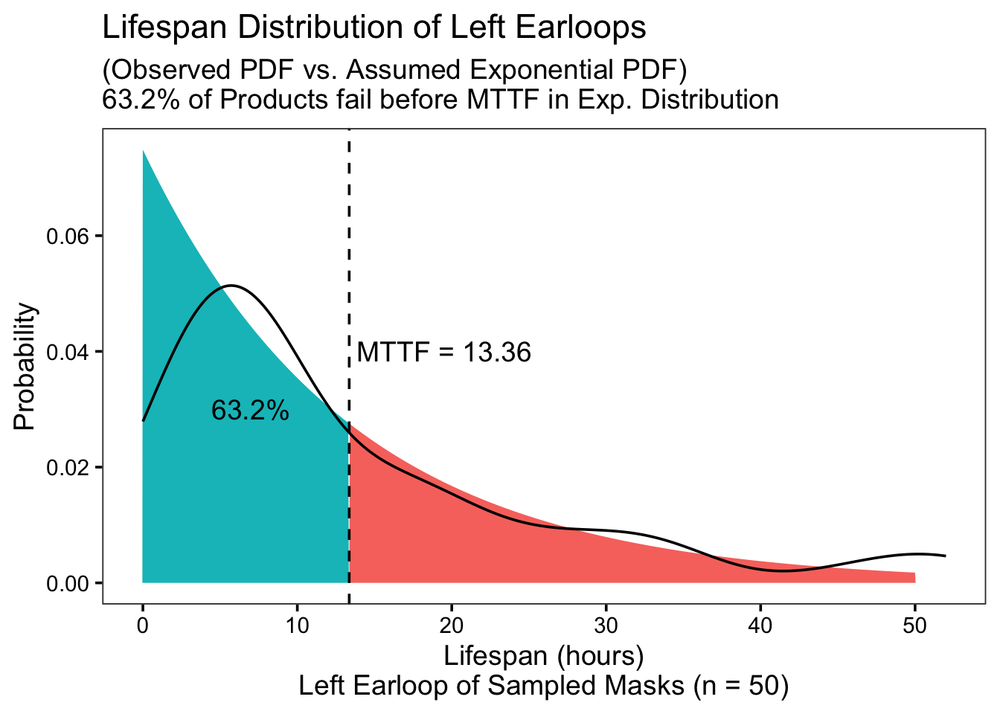
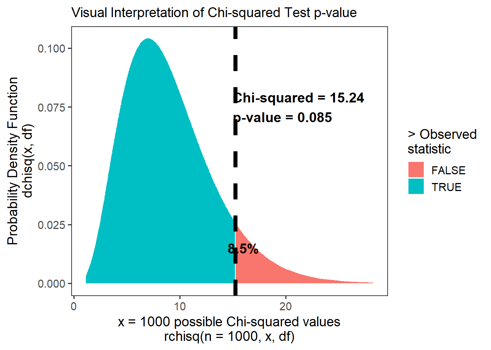

# Workshop: Useful Life Distributions (Exponential)


In this workshop, we're going to learn some `R` functions for working with common life distributions, namely the **Exponential** distributions.

## Getting Started

### Load Packages

Let's start by loading the `tidyverse` package, which will let us `mutate()`, `filter()`, and `summarize()` data quickly. We'll also load `mosaicCalc`, for taking derivatives and integrals (eg. `D()` and `antiD()`).


```r
# Load packages
library(tidyverse)
library(mosaicCalc)
```

<br>
<br>

###  Key Concepts

In this lesson, we'll be building on several key concepts from prior lessons. I've defined them below as a helpful review.

- **life distribution**: the distribution of a vector of $n$ products, whose values recording the amount of time it took for each product to fail. In other words, its **lifespan**.

- **probability density function (PDF)**: the function describing the probability (relative frequency) of any value in a distribution.

- **cumulative distribution function (CDF)**: the function describing the *cumulative* probability of each successive value in a distribution. Spans from 0 to 1.

- Have questions? I *strongly* recommend you review Workshops 2, 3, and 4 before this one! It will help it all fit together!

<br>
<br>

###  Our Data

In this workshop, we're going to work with a data.frame called `masks`. An extremely annoying moment in the COVID-era is when a part of your mask snaps, requiring you to get a fresh mask. Let's examine a (hypothetical) sample of `n = 50` masks produced by Company X to explore how often this happens!

Please import the `masks.csv` data.frame below. Each row is a mask, with its own unique `id`. Columns describe how many hours it took for the `left_earloop` to snap, the `right_earloop` to snap, the nose `wire` to snap, and the `fabric` of the mask to tear.


```r
masks <- read_csv("workshops/masks.csv")

# Let's glimpse() its contents!
masks %>% glimpse()
```

```
## Rows: 50
## Columns: 5
## $ id            <dbl> 1, 2, 3, 4, 5, 6, 7, 8, 9, 10, 11, 12, 13, 14, 15, 16, 1…
## $ left_earloop  <dbl> 6, 16, 46, 4, 1, 5, 32, 35, 27, 3, 4, 7, 1, 20, 22, 17, …
## $ right_earloop <dbl> 12, 1, 17, 14, 19, 8, 18, 14, 5, 8, 8, 2, 12, 7, 20, 4, …
## $ wire          <dbl> 4, 1, 8, 29, 23, 8, 10, 38, 11, 31, 7, 4, 3, 33, 13, 2, …
## $ fabric        <dbl> 177, 462, 65, 405, 2483, 1064, 287, 2819, 1072, 288, 863…
```

<br>
<br>

## Quantities of Interest

When we work with life distributions, we often want to find several useful quantities of interest (a.k.a. parameters) about them. Let's find out how to do that with an **exponential distribution**!

### Lack of Memory 

**Exponential distributions** are famous for a key trait. The failure rate $ \lambda $ remains **constant** in an exponential distribution. The probability that a product fails in the next hour of use is the same at `t = 0`, `t = 100`, or `t = infinity!` It doesn't worsen with time. (It's the literal meaning of the saying, "if it is not broke, don't fix it!")

### Mean Time to Fail

The Mean Time to Fail describes the **mean** of a lifespan distribution. For example, let's calculate the mean time to fail (in hours) for a mask's `left_earloop` in our sample.


```r
stat <- masks %>%
  summarize(
    # We can take the mean of this vector of time to fail in hours
    mttf = mean(left_earloop),
    # Lambda is the reciprocal of the MTTF
    lambda = 1 / mttf)

# Check out the contents!
stat
```

```
## # A tibble: 1 × 2
##    mttf lambda
##   <dbl>  <dbl>
## 1  13.4 0.0749
```

In an exponential distribution, the MTTF *always* has a cumulative probability of `1 - 1 / e = 0.632`. (This can be coded in R like so:)


```r
1 - 1 / exp(1)
```

```
## [1] 0.6321206
```

Let's assume our sample's left earloops have an exponential lifespan distribution, and use `pexp()` to calculate the cumulative probability of getting an MTTF of 13.36. We'll need to supply `pexp()` the benchmark in the distribution in question (`mttf`), plus the the `rate` parameter $\lambda$, which we always need when simulating an exponential distribution.


```r
prob <- pexp(stat$mttf, rate = stat$lambda)
prob
```

```
## [1] 0.6321206
```

Indeed, the figure below compares the observed PDF function (made using `density()`) to the assumed exponential PDF (made using `dexp()`), and we can see that that 63% of the distribution has failed by the Mean Time to Fail.



<br>
<br>

### Mean Time to Fail via *Integration*

**Mean Time to Fail (MTTF)** can be number-crunched empirically as the *mean of observed lifespans*, assuming an exponential distribution. But it is also equal to the **integral of the reliability** function: $MTTF = \int_{0}^{\infty}{R(t)dx} $.

So, let's make ourselves a nice reliability function to help us calculate the MTTF.

- We know the reliability function can be stated as $R(t) = 1 - F(t)$. 

- Assuming an exponential distribution, the failure rate $F(t) = 1 - e^{-\lambda t}$.

- We know $\lambda = \frac{1}{MTTF}$, and above, we found that lambda = 0.0748502994011976 for a left-earloop.


```r
# Reliability Function for exponential distribution
r = function(t, lambda){ exp(-1*t*lambda)}
```

We can calculate it below...


```r
# Use mosaicCalc's antiD function
# To get integral of r(t, lambda) as x goes from 0 to infinity
mttf = antiD(tilde = r(t, lambda) ~ t)
```

Great! We have developed our own `mttf` function for an exponential distribution! If we feed `t` a suitably large value, like 1000 (approaching infinity), we will reach the original observed/estimated `mttf`.


```r
mttf(t = 1000, lambda = stat$lambda)
```

```
## [1] 13.36
```

```r
mttf(t = Inf, lambda = stat$lambda)
```

```
## [1] 13.36
```
This only helps you if you *know* **lambda**, the inverse of the MTTF, or have the reliability function but not the MTTF.

<br>
<br>

### Median Time to Fail $T_{50}$

We might also want to know the **median** time to failure ($T_{50}$), the value on the x axis that splits the area under the curve in half at 50% and 50%. We can calculate this as...

$F(T_{50}) = 50\% = 0.5 = 1 - e^{-\lambda T_{50}}$

where:

$T_{50} = \frac{log(2)}{ \lambda } = \frac{0.693}{\lambda}$


```r
# Let's update stat to include the observed 'median' 
# and 't50', the median assuming an exponential distribution 

stat <- masks %>%
  summarize(
    # The literal mean time to fail 
    # in our observed distribution is this
    mttf = mean(left_earloop),
    # And lambda is this...
    lambda = 1 / mttf,
    # The observed median is this....
    median = median(left_earloop),
    # But if we assume it's an exponential distribution
    # and calculate the median from lambda,
    # we get t50, which is very close.
    t50 = log(2) / lambda)

# Check it out!
stat
```

```
## # A tibble: 1 × 4
##    mttf lambda median   t50
##   <dbl>  <dbl>  <dbl> <dbl>
## 1  13.4 0.0749      8  9.26
```

### Modal Time to Fail

Finally, the modal time to fail is pretty easy to calculate. Its the most common time to fail, also known as the **max** probability in a PDF.


```r
masks %>%
  summarize(
    # Let's get lambda, the reciprocal of the MTTF
    lambda = 1 / mean(left_earloop),
    # And let's estimate the PDF...
    t = 1:max(left_earloop),
    prob = dexp(t, rate = lambda)) %>%
  # And let's sort the data.frame from highest to lowest
  arrange(desc(prob)) %>%
  # Grab first 3 rows, for brevity
  head(3)
```

```
## # A tibble: 3 × 3
##   lambda     t   prob
##    <dbl> <int>  <dbl>
## 1 0.0749     1 0.0695
## 2 0.0749     2 0.0644
## 3 0.0749     3 0.0598
```

```r
# This reveals that t = 1 is our mode
```

<br>
<br>

---

## Learning Check 1 {.unnumbered #LC1}

**Question**
  
A competing mask manufacturer made a mask whose earloops fail at a constant failure rate of `0.08`.

1. What is the probability that 1 fails *before* 20 hours of use?

2. What is the probability that 2 fail *before* 20 hours of use?

3. After how long should we expect 1% failures?

<details><summary>**[View Answer!]**</summary>
  
1. What is the probability that 1 fails *before* 20 hours of use?


```r
# Let's generate an expondential failure function,
# because **constant** rate of failure
f = function(t, lambda){1 - exp(-1*t*lambda)}

# Use failure function (CDF) to get area under curve BEFORE 20 hours.
f(t = 20, lambda = 0.08)
```

```
## [1] 0.7981035
```

```r
# There's a 79% chance 1 fails within 20 hours
```

2. What is the probability that 2 fail *before* 20 hours of use?


```r
# For n failures, take F(t) to the nth power
f(t = 20, lambda = 0.08)^2
```

```
## [1] 0.6369692
```

```r
# There's a 63% chance 2 fail within 20 hours.
```

3. After how long should we expect 1% failures?


```r
# We can solve this using the failure function
# f(t) = 1 - e^{-t*lambda}

# But we need to invert it,
# to solve for t
# f(t) = 1 - e^{-t*lambda}
# e^{-t*lambda} = 1 - f(t) 
# log(1 - f(t)) = -t*lambda
# -log(1 - f(t)) / lambda = t

# So if we set f(t) = 1%, and lambda = 0.08,
# this will tell us at what time F(t) will equal 1%
-log(1 - 0.01) / 0.08
```

```
## [1] 0.1256292
```

```r
# Looks like that time of interest is t = 0.1256 hours.
```

</details>
  
---


## Learning Check 2 {.unnumbered #LC2}

**Question**
  
Above, we examined a sample of surgical masks, checking how often their `left_earloop` snapped. How does that compare with the `right_earloop`?

Calculate the mean time to fail for the right earloop, and $\lamba$, the mean failure rate. Is the right earloop more or less reliable than the left earloop?

<details><summary>**[View Answer!]**</summary>

1. MTTF and Lambda


```r
compare <- masks %>%
  summarize(mttf_right = mean(right_earloop),
            mttf_left = mean(left_earloop),
            lambda_right = 1 / mttf_right,
            lambda_left = 1 / mttf_left)
# Check it
compare
```

```
## # A tibble: 1 × 4
##   mttf_right mttf_left lambda_right lambda_left
##        <dbl>     <dbl>        <dbl>       <dbl>
## 1       10.6      13.4       0.0943      0.0749
```

```r
# Looks like the left earloop fails less often.
```

  
</details>
  
---


<br>
<br>

## Quantities of Interest (continued)

### Conditional Reliability (Survival) Function

We may also want to know, after age `t`, what's the probability that a product survives an additional `x` years to age `t + x`? We can restate this in terms of $T_{Fail}$, the time at which the product finally fails. 

We want to know, what's the probability that $T_{Fail}$ is greater than $t + x$, given that we *already know* $T_{Fail}$ must be greater than $t$ (since it hasn't failed yet as of time $t$)? Fortunately, this can be simplified in terms of the reliability functions. As long as we can calculate $R(x + t)$ and $R(t)$, we can find $R(x|t)$, the conditional survival function.

$$ R(x | t) = \frac{ R(x + t) }{ R(t) } = \frac{ P(T_{Fail} > x + t) }{P(T_{Fail} > t)} $$
So, let's use our nice reliability function from before to help us calculate the conditional reliability function. 


```r
# Reliability Function for exponential distribution
r = function(t, lambda){ exp(-1*t*lambda)}
```

So, what's the probability that a left-earloop that has lasted 10 hours will last another 5 hours?


```r
r(t = 10 + 5, lambda = stat$lambda) / 
  r(t = 10, lambda = stat$lambda)
```

```
## [1] 0.6878039
```

Looks like there's a 69% chance it will last another 5 hours, given that it has already lasted 10 hours. 

Let's finish up by building ourselves a nice Conditional Reliability function `cr`, which which calculates the conditional probability of any item surviving `x` more hours given that it survived `t` hours and a mean failure rate of `lambda`.


```r
cr = function(t, x, lambda){
  # We can actually nest functions inside each other, 
  # to make them easier to write
  r = function(t, lambda){ exp(-1*t*lambda)}
  
  # Calculate R(x + t) / R(t) 
  output <- r(t = t + x, lambda) / r(t = t, lambda)
  
  # and return the result!
  return(output)
}
```


```r
# Let's compare our result to above! It's the same!
cr(t = 10, x = 5, lambda = stat$lambda)
```

```
## [1] 0.6878039
```
If we were to visualize our conditional reliability function `cr` below as x ranges from 1 to 50, it would produce the following curve.


<br>
<br>

### $\mu(t)$: Mean Residual Life

The Conditional Reliability Function $R(x|t)$ also allows us to calculate the Mean Residual Life (MRL, a.k.a. $\mu$) at time $t$, in this case referring to the average $x$ more years the product is expected to survive *after* time $t$. We can calculate it using the distribution below.

$$MRL(t) = \mu(t) = \int_{0}^{\infty}{ R(x|t)dx} = \frac{1}{R(t)} \int_{0}^{\infty}{ R(x) dx} $$
Technically, the Mean Residual Life at time $t$ represents **how many times greater** is the MTTF expected than the probability of survival at time t (proportion of cases not yet failed). It shows the mean expected remaining life years, for however $x$ many more time steps come after $t$.


```r
# Calculate the probability of survival R(t = 10)
prob_survival_t = r(t = 10, lambda = stat$lambda)
# Calculate the MTTF for +x more years
mttf_inf = mttf(t = Inf, lambda = stat$lambda)

# calculate the Mean Residual Life for t=10
mttf_inf / prob_survival_t
```

```
## [1] 28.24081
```

We can formalize this as function `mu(t, lambda)`. (Since the Greek letter $\mu$ is pronounced `mu`.)


```r
# Calculate Mean Residual Life
mu = function(t, lambda){
  
  # Get the Reliability Function for exponential distribution
  r = function(t, lambda){ exp(-1*t*lambda)}
  
  # Get the MTTF (integral of reliability function)
  mttf = antiD(tilde = r(t, lambda) ~ t)

  # Now calculate mu(), the Mean Residual Life function at time t
  output <- mttf(t = Inf, lambda = lambda) / r(t = t, lambda = lambda)
  
  return(output)
}
```

Let's test it out and compare to our previous version.


```r
mu(t = 10, lambda = stat$lambda)
```

```
## [1] 28.24081
```
Works perfectly!


<br>
<br>

### $g(t)$: MRL as % of MTTF

We can also estimate $g(t)$, which describes, how *large* is the MRL $\mu(t)$, relative to the MTTF?

When $t = 0$, $\mu(t) = \mu = MTTF$, so we can write $g(t)$ as follows:

$$g(t) = \frac{MRL(t)}{MTTF} = \frac{\mu(t)}{\mu(t = 0)}$$
So, for the mask component we've been working with, `left_earloop`, we can calculate the MRL-to-MTTF ratio `g(t)` after `t = 10` hours as follows:


```r
mu(t = 10, lambda = stat$lambda) / mu(t = 0, lambda = stat$lambda)
```

```
## [1] 2.113833
```

<br>
<br>

---

## Learning Check 3 {.unnumbered #LC3}

**Question**
  
A competing firm produced a mask with a wire that fails at a constant rate of 1 failure per 240 hours. 

1. The probability that the wire survives 1 week (`t = 168` hours) in continuous use is... (

2. You buy the mask, and it works without failure for 2 weeks (`t = 336` hours) The probability the wire will snap during the next week (`t = 504` hours) is...

<details><summary>**[View Answer!]**</summary>
  
1. The probability that the wire survives 1 week (`t = 168` hours) in continuous use is... (


```r
# Write the reliability function
r = function(t, lambda){ exp(-1*t*lambda)}

# Probability it survives 1 month (760 hours) is...
r(t = 168, lambda = 1 / 240)
```

```
## [1] 0.4965853
```

```r
# ~ 50%
```

2. You buy the mask, and it works without failure for 2 weeks (`t = 336` hours) The probability the wire will snap during the next week (`t = 504` hours) is...


```r
# We can calculate it 2 ways.

# First, we can take
# R(t + x) / R(t)
r(t = 504, lambda = 1 / 240) / 
  r(t = 336, lambda = 1 / 240)
```

```
## [1] 0.4965853
```

```r
# Or, we can calculate the failure function
f = function(t, lambda){1 - exp(-1*t*lambda)}
# And just calculate the rate of F(t = x)
# Because lambda is a constant failure rate
f(t = 168, lambda = 1 / 240)
```

```
## [1] 0.5034147
```

</details>
  
---

<br>
<br>

## System Failure with Independent Failure Rates

Consider a mask with a left and right earloop, which have independent failure rates $\lambda_{left}$ and $\lambda_{right}$. What's the probability that the left loop fails before the right loop?

We can express this as:

$$ P(j \ fails \ first) = \frac{ \lambda_{j}}{  \sum_{i=1}^{n}{ \lambda{i}} }$$

In other words, the probability that component $j$ fails first reflects how **big** $\lambda_{j}$ is relative to all the other failure rates in total.

Let's test this out with our `masks` dataset.


```r
masks %>%
  summarize(
    # Calculate failure rates of left and right loops
    lambda_left = 1 / mean(left_earloop),
    lambda_right = 1 / mean(right_earloop),
    # Calculate the total probability of either loop failing
    lambda_sum = lambda_left + lambda_right,
    # Calculate probability the left loop fails first
    prob_left_first = lambda_left / lambda_sum)
```

```
## # A tibble: 1 × 4
##   lambda_left lambda_right lambda_sum prob_left_first
##         <dbl>        <dbl>      <dbl>           <dbl>
## 1      0.0749       0.0943      0.169           0.442
```

```r
# Looks like a probability of about 44% that left loop fails first.
```

<br>
<br>

### Reliability Functions with Multiple Inputs

Suppose a fraction of our masks are shipped in from manufacturer 1, while some are shipped from manufacturer 2. A fraction $p$ is coming from manufacturer 1, while $1-p$ is coming from manufacturer 2. We can use the rules of total probability to calculate the reliability function and other quantities for this mask:

$$R(t) = \sum_{i=1}^{n}{ ( \ p_{i} \times R_i(t) \ ) } = \sum_{i=1}^{n}{ ( \ p_{i} \times e^{-\lambda_{i} t} ) }$$

$$MTTF = \sum_{i=1}^{n}{ \frac{p_i}{\lambda_{i}}}$$

$$f(t) = \frac{-d}{dt}R(t) = \sum_{i=1}^{n}{p\lambda_{i}e^{-\lambda_{i}t}}$$

$$z(t) = \frac{ f(t) }{ R(t)} = \frac{  \sum_{i=1}^{n}{p\lambda_{i}e^{-\lambda_{i}t}} }{ \sum_{i=1}^{n}{ ( \ p_{i} \times R_i(t) \ ) } }  $$

It's pretty messy, but powerful!

Suppose we order 75% of our stock from a manufacturer with a failure rate of 1 fabric tear per 50 hours, but 25% from our stock from a manufacturer with a failure rate of 1 tear per 100 hours. What is the (1) overall mean time to failure and (2) overall failure rate at 100 hours for any random mask in your supply?

We can tally this up in a `stock` data.frame.


```r
stock <- data.frame(
  prob = c(0.75, 0.25),
  lambda = c(1 / 50, 1 / 100))
```

To calculate the MTTF, we just take the sum of the fraction of each proportion and each failure rate lambda.


```r
stock %>%
  summarize(mttf = sum(prob / lambda))
```

```
##   mttf
## 1 62.5
```

To calculate the overall failure rate, we will generate the reliability function, take its derivative to get the PDF.


```r
# Let's write an exponential reliability function
r = function(t, lambda){ exp(-1*t*lambda) }

# Let's derive an exponential PDF f(t), using mosaicCalc's D()
f = D(-1*r(t, lambda) ~ t)
```

Then, we use the PDFs $f_i(t)$ and the Reliability functions $R_i(t)$ to get calculate the overall failure rate $z(t)$.


```r
stock %>%
  summarize(
    total_f = sum(prob * f(t = 100, lambda = lambda)),
    total_r = sum(prob * r(t = 100, lambda = lambda)),
    z = total_f / total_r)
```

```
##       total_f   total_r          z
## 1 0.002949728 0.1934713 0.01524633
```

We could even write it as a function, where `p` and `lambda` are equal length vectors for plant 1, plant 2, plant 3, ... plant $n$.


```r
z = function(t){
  # Set the input percentages of products from plants 1 and 2
  p = c(0.75, 0.25)
  # Set the failure rates for each
  lambda = c(0.02, 0.01)
  
  
  # Let's write an exponential reliability function
  r = function(t, lambda){ exp(-1*t*lambda) }
  # Let's derive an exponential PDF f(t),
  f = D(-1*r(t, lambda) ~ t)

  # Calculate total probability
  total_f = sum( p * f(t, lambda) )
  # Calculate total reliability
  total_r = sum( p * r(t, lambda) )
  
  # Calculate overall failure rate
  z = total_f / total_r
  
  return(z)
}
# Try it out!
z(t = 1)
```

```
## [1] 0.0174812
```

```r
z(t = 10)
```

```
## [1] 0.01730786
```

```r
z(t = 100)
```

```
## [1] 0.01524633
```

<br>
<br>

### Phase-Type Distributions

One way to more accurately model the lifespan of a product is to accept that its failure rate may remain constant, but it might change between failure rates as it passes through **phases**. Let's model that!

We can write the time $T$ to critical failure (via either overstress OR degraded failure) as $T = min(T_c, T_d+T_{dc})$.


```{=html}
<div class="DiagrammeR html-widget html-fill-item-overflow-hidden html-fill-item" id="htmlwidget-e5216ba8a0f034b1535c" style="width:672px;height:480px;"></div>
<script type="application/json" data-for="htmlwidget-e5216ba8a0f034b1535c">{"x":{"diagram":"graph LR\n O((\"Overstress\"))\n C((\"Critical<br>Failure\"))\n D((\"Degraded<br>Failure\"))\n DC((\"Critical<br>Degraded\"))\n O-->|&lambda;<sub>C<\/sub>|C\n O-->|&lambda;<sub>D<\/sub>|D\n D-->|&lambda;<sub>C<\/sub>|C\n D-->|&lambda;<sub>DC<\/sub>|DC"},"evals":[],"jsHooks":[]}</script>
```

The total probability of a product being in any phase $a_{i \to n}$ equals 1.

- $a_c = 25\%$

- $a_d = 40\%$

- $a_dc = 10\%$

We can represent it in a dataframe, like so:


```r
myphase <- data.frame(
  id = 1:4,
  phase = c("c", "d", "c", "dc"),
  alpha = c(0.25, 0.40, 0.25, 0.10),
  lambda = c(0.50, 1, 0.50, 3)
)
```

And, using the same tricks from the preceding section, we can calculate `z(t)`, the overall hazard rate of a phase-type exponential distribution, by taking the sum of the weighted probabilities.


```r
r = function(t, lambda){ exp(-1*t*lambda) }
# Let's derive an exponential PDF f(t),
f = D(-1*r(t, lambda) ~ t)

z = function(t, data){
  output <- data %>%
    summarize(
      prob_f = sum(alpha * f(t = t, lambda)),
      prob_r = sum(alpha * r(t = t, lambda)),
      ratio_z = prob_f / prob_r)
  output$ratio_z %>% return()
}

# Take a peek!
z(t = 1, data = myphase)
```

```
## [1] 0.6888965
```

```r
z(t = 2, data = myphase)
```

```
## [1] 0.6161738
```

```r
z(t = 5, data = myphase)
```

```
## [1] 0.5308124
```

```r
z(t = 10, data = myphase)
```

```
## [1] 0.5026807
```


<br>
<br>

## Statistical Techniques for Exponential Distributions 

Finally, we're going to examine several key tools that will help you (1) cross-tabulate failure data over time, (2) use statistics to determine whether an archetypal distribution (eg. exponential) fits your data sufficiently, (3) how to estimate the failure rate $\lambda$ from tabulated data, and (4) how to plan experiments for product testing. Here we go!

<br>
<br>

### Factors in R

For the next section, you'll need to understand `factors`.

- Factors are ordered vectors. They are helpful in `ggplot` and elsewhere for telling `R` what order to interpret things in.

- You can make your own vector into a `factor` using `factor(vector, levels = c("first", "second", "etc"))`.


```r
# Make character vector
myvector <- c("surgical", "KN-95", "KN-95", "N-95", "surgical")
# Turn it into a factor
myfactor <- factor(myvector, levels = c("N-95", "KN-95", "surgical"))
# check it
myfactor
```

```
## [1] surgical KN-95    KN-95    N-95     surgical
## Levels: N-95 KN-95 surgical
```

`factor`s can be reduced to `numeric` vectors using `as.numeric()`. This returns the level for each value in the factor.


```r
# Turn the factor numeric
mynum <- myfactor %>% as.numeric()
# Compare
data.frame(myfactor, mynum)
```

```
##   myfactor mynum
## 1 surgical     3
## 2    KN-95     2
## 3    KN-95     2
## 4     N-95     1
## 5 surgical     3
```

```r
# for example, N-95, which was ranked first in the factor, receives a 1 anytime the value N-95 appears
```

<br>
<br>

### Crosstabulation

Sometimes, we might want to tabulate failures in terms of meaningful units of time, counting the total failures every 5 hours, every 24 hours, etc. Let's learn how!


```r
d1 <- data.frame(t = masks$left_earloop) %>%
  # classify each value into 5-point width bins (0 to 5, 6-10, 11-15, etc.)
  # then convert it to a numeric ranking of categories from 1  to n bins
  mutate(label = cut_interval(t, length = 5))

# Let's take a peek
d1 %>% glimpse()
```

```
## Rows: 50
## Columns: 2
## $ t     <dbl> 6, 16, 46, 4, 1, 5, 32, 35, 27, 3, 4, 7, 1, 20, 22, 17, 8, 18, 1…
## $ label <fct> "(5,10]", "(15,20]", "(45,50]", "[0,5]", "[0,5]", "[0,5]", "(30,…
```

**Step 2**: Tabulate Observations per Bin.


```r
d2 <- d1 %>%
  # For each bin label
  group_by(label, .drop = FALSE) %>%
  # Get total observed rows in each bin
  # .drop = FALSE records factor levels in label that have 0 cases
  summarize(count = n())

d2 %>% glimpse()
```

```
## Rows: 11
## Columns: 2
## $ label <fct> "[0,5]", "(5,10]", "(10,15]", "(15,20]", "(20,25]", "(25,30]", "…
## $ count <int> 17, 13, 3, 7, 2, 2, 3, 0, 0, 1, 2
```

**Step 3**: Get bounds and midpoint of Bins

Last, we might need the bounds (upper and lower value), or the midpoint. Here's how!


```r
d3 <- d2 %>%
  # Get bin ranking, lower and upper bounds, and midpoint
  mutate(
    bin = as.numeric(label),
    lower = (bin - 1) * 5, 
    upper = bin * 5,
    midpoint = (lower + upper) / 2) 
# Check it!
d3
```

```
## # A tibble: 11 × 6
##    label   count   bin lower upper midpoint
##    <fct>   <int> <dbl> <dbl> <dbl>    <dbl>
##  1 [0,5]      17     1     0     5      2.5
##  2 (5,10]     13     2     5    10      7.5
##  3 (10,15]     3     3    10    15     12.5
##  4 (15,20]     7     4    15    20     17.5
##  5 (20,25]     2     5    20    25     22.5
##  6 (25,30]     2     6    25    30     27.5
##  7 (30,35]     3     7    30    35     32.5
##  8 (35,40]     0     8    35    40     37.5
##  9 (40,45]     0     9    40    45     42.5
## 10 (45,50]     1    10    45    50     47.5
## 11 (50,55]     2    11    50    55     52.5
```

<br>
<br>

### Chi-squared

**Chi-squared** ($\chi^{2}$) is a special statistic used frequently to evaluate the relationship between two categorical variables. In this case, the first variable is the `type` of data (`observed` vs. `model`), while the second variable is `bin`.

Back in Workshop 2, we *visually* compared several distributions to an observed distribution, to determine which fits best. But can we do that statistically? One way to do this is to chop our observed data into bins of `length` equal width using `cut_interval()` from `ggplot2`. We must specify:

**Step 1** Crosstabulate Observed Values into Bins.


```r
# Let's repeat our process from before!
c1 <- data.frame(t = masks$left_earloop) %>%
  # Part 1.1: Split into bins
  mutate(interval = cut_interval(t, length = 5)) %>%
  # Part 1.2: Tally up observed failures 'r_obs' by bin
  group_by(interval, .drop = FALSE) %>%
  summarize(r_obs = n()) %>%
  mutate(
    bin = 1:n(), # give each bin a numeric id from 1 to inf
    # bin = as.numeric(interval), # you could alternatively turn the factor numeric
    lower = (bin - 1) * 5, 
    upper = bin * 5,
    midpoint = (lower + upper) / 2)
```

**Step 2**: Calculate Observed and Expected Values per Bin.

Sometimes you might only receive **tabulated data**, meaning a table of bins, not the original vector. In that case, start from **Step 2**!


```r
# Get any parameters you need (might need to be provided if only tabulated data)
mystat = masks %>% summarize(
  # failure rate
  lambda = 1 / mean(left_earloop),
  # total number of units under test                        
  n = n())
# Get your 'model' function
f = function(t, lambda){ 1 - exp(-1*lambda*t) }
# Note: pexp(t, rate) is equivalent to f(t, lambda) for exponential distribution

# Now calculate expected units to fail per interval, r_exp
c2 = c1 %>%
  mutate(
    # Get probability of failure by time t = upper bound
    p_upper = f(t = upper, lambda = mystat$lambda),
    # Get probability of failure by time t = lower bound
    p_lower = f(t = lower, lambda = mystat$lambda),
    # Get probability of failure during the interval,
    # i.e. between these thresholds
    p_fail = p_upper - p_lower,
    # Add in total units under test
    n_total = mystat$n,
    # Calculate expected units to fail in that interval
    r_exp = n_total * p_fail)
# Check it!
c2
```

```
## # A tibble: 11 × 11
##    interval r_obs   bin lower upper midpoint p_upper p_lower  p_fail n_total
##    <fct>    <int> <int> <dbl> <dbl>    <dbl>   <dbl>   <dbl>   <dbl>   <int>
##  1 [0,5]       17     1     0     5      2.5   0.312   0     0.312        50
##  2 (5,10]      13     2     5    10      7.5   0.527   0.312 0.215        50
##  3 (10,15]      3     3    10    15     12.5   0.675   0.527 0.148        50
##  4 (15,20]      7     4    15    20     17.5   0.776   0.675 0.102        50
##  5 (20,25]      2     5    20    25     22.5   0.846   0.776 0.0699       50
##  6 (25,30]      2     6    25    30     27.5   0.894   0.846 0.0481       50
##  7 (30,35]      3     7    30    35     32.5   0.927   0.894 0.0331       50
##  8 (35,40]      0     8    35    40     37.5   0.950   0.927 0.0227       50
##  9 (40,45]      0     9    40    45     42.5   0.966   0.950 0.0156       50
## 10 (45,50]      1    10    45    50     47.5   0.976   0.966 0.0108       50
## 11 (50,55]      2    11    50    55     52.5   0.984   0.976 0.00740      50
## # ℹ 1 more variable: r_exp <dbl>
```


```r
# We only need a few of these columns; let's look at them:
c2 %>%
  # interval: get time interval in that bin
  # r_obs: Get OBSERVED failures in that bin
  # r_exp: Get EXPECTED failures in that bin
  # n_total: Get TOTAL units, failed or not, overall
  select(interval, r_obs, r_exp, n_total)
```

```
## # A tibble: 11 × 4
##    interval r_obs  r_exp n_total
##    <fct>    <int>  <dbl>   <int>
##  1 [0,5]       17 15.6        50
##  2 (5,10]      13 10.7        50
##  3 (10,15]      3  7.38       50
##  4 (15,20]      7  5.08       50
##  5 (20,25]      2  3.49       50
##  6 (25,30]      2  2.40       50
##  7 (30,35]      3  1.65       50
##  8 (35,40]      0  1.14       50
##  9 (40,45]      0  0.782      50
## 10 (45,50]      1  0.538      50
## 11 (50,55]      2  0.370      50
```


**Step 3**: Calculate Chi-squared Statistic

- **Chi-squared** here represents the sum of ratios for each bin. Each ratio is the (1) squared difference between the observed and expected value over (2) the expected value. Ranges from 0 to infinity. The bigger (more positive) the statistic, the greater difference between the observed and expected data.

- **Degrees of Freedom (df)** is used as the standard deviation in the chi-squared distribution, to help evaluate *how extreme is our chi-squared statistic?*

- **Chi-squared Distribution** is a distribution of squared deviations from a normal distribution centered at 0. This means it only has positive values.


```r
c3 <- c2 %>%
  summarize(
      # Calculate Chi-squared statistic
    chisq = sum((r_obs - r_exp)^2 / r_exp),
    # Calculate number of bins (rows)
    nbin = n(),
    # Record number of parameters used (jjust lambda)
    np = 1,
    # Calculate degree of freedom
    df = nbin - np - 1)
# Check it!
c3
```

```
## # A tibble: 1 × 4
##   chisq  nbin    np    df
##   <dbl> <int> <dbl> <dbl>
## 1  15.2    11     1     9
```

**Step 4**: Calculate p-values and confidence intervals

Last, let's use the `pchisq()` function to evaluate the CDF of the Chi-squared distribution. We'll find out:

- `p_value`: what's the probability of getting a value **greater than or equal to** (more extreme than) our observed chi-squared statistic?

- **"statistically significant"**: if our observed statistic is more extreme than most possible chi-squared statistics (eg. >95% of the distribution), it's probably not due to chance! We call it 'statistically significant.'


```r
# Calculate area remaining under the curve
c4 <- c3 %>%
  mutate(p_value = 1 - pchisq(q = chisq, df = df))
# Check
c4
```

```
## # A tibble: 1 × 5
##   chisq  nbin    np    df p_value
##   <dbl> <int> <dbl> <dbl>   <dbl>
## 1  15.2    11     1     9  0.0847
```

For a visual representation:




### Building a Chi-squared function

That was a lot of work! It might be more helpful for us to build our own `function` doing all those steps. Here's a function I built, which should work pretty flexibly. You can improve it, tweak it, or use it for your own purposes. Our function `get_chisq()` is going to need several kinds of information.

- Our exponential failure function `f`
- Our parameters, eg. failure rate `lambda`
- Total number of parameters (if exponential, 1)
- Our total number of units under test `n`
- Then, we'll need a observed vector of times to failure `t`, plus a constant `binwidth` (previously, 5). 
- Or, if our data is pre-crosstabulated, we can ignore `t` and `binwidth` and just supply a data.frame `data` of crosstabulated vectors `lower`, `upper`, and `r_obs`.

For example, these inputs might look like this:


```r
# Get your 'model' function
f = function(t, lambda){ 1 - exp(-1*lambda*t) }
# Parameters
# lambda = 1 / mean(masks$left_earloop)
# number of parameters
# np = 1
# total number of units (sometimes provided, if the data is time-censored)
# n_total = length(masks$left_earloop)

# AND

# Raw observed data + binwidth
# t = masks$left_earloop
# binwidth = 5
# OR
# Crosstabulated data (c1 is an example we made before)
# data = c1 %>% select(lower, upper, r_obs)
```

Then, we could write out the function like this! I've added some fancy `@` tags below just for notation, but you can ditch them if you prefer. This is a fairly complex function! I've shared it with you as an example to help you build your own for your projects.


```r
#' @name get_chisq
#' @title Function to Get Chi-Squared!
#' @name Tim Fraser
#' If observed vector...
#' @param t a vector of times to failure
#' @param binwidth size of intervals (eg. 5 hours) (Only if t is provided)
#' If cross-tabulated data...
#' @param data a data.frame with the vectors `lower`, `upper`, and `r_obs`
#' Common Parameters:
#' @param n_total total number of units.
#' @param f specific failure function, such as `f = f(t, lambda)`
#' @param np total number of parameters in your function (eg. if exponential, 1 (lambda))
#' @param ... fill in here any named parameters you need, like `lambda = 2.4` or `rate = 2.3` or `mean = 0, sd = 2`
get_chisq = function(t = NULL, binwidth = 5, data = NULL, 
                     n_total, f, np = 1, ...){
  
  # If vector `t` is NOT NULL
  # Do the raw data route
  if(!is.null(t)){
    # Make a tibble called 'tab'
    tab = tibble(t = t) %>%
      # Part 1.1: Split into bins
      mutate(interval = cut_interval(t, length = binwidth)) %>%
      # Part 1.2: Tally up observed failures 'r_obs' by bin
      group_by(interval, .drop = FALSE) %>%
      summarize(r_obs = n()) %>%
      # Let's repeat our process from before!
      mutate(
        bin = 1:n(),
        lower = (bin - 1) * binwidth, 
        upper = bin * binwidth,
        midpoint = (lower + upper) / 2) 
    
    # Otherwise, if data.frame `data` is NOT NULL
    # Do the cross-tabulated data route
  }else if(!is.null(data)){
    tab = data %>%
      mutate(bin = 1:n(),
             midpoint = (lower + upper) / 2)
  }
  
  # Part 2. Calculate probabilities by interval
  output = tab %>% 
    mutate(
      p_upper = f(upper, ...), # supplied parameters
      p_lower = f(lower, ...), # supplied parameters
      p_fail = p_upper - p_lower,
      n_total = n_total,
      r_exp = n_total * p_fail) %>%
    # Part 3-4: Calculate Chi-Squared statistic and p-value
    summarize(
      chisq = sum((r_obs - r_exp)^2 / r_exp),
      nbin = n(),
      np = np,
      df = nbin - np - 1,
      p_value = 1 - pchisq(q = chisq, df = df) )
  
  return(output)
}
```

Finally, let's try using our function!

Using a raw observed vector `t`:


```r
get_chisq(
  t = masks$left_earloop, binwidth = 5, 
  n_total = 50, f = f, np = 1, lambda = mystat$lambda)
```

```
## # A tibble: 1 × 5
##   chisq  nbin    np    df p_value
##   <dbl> <int> <dbl> <dbl>   <dbl>
## 1  15.2    11     1     9  0.0847
```
Or using crosstabulated `data`:


```r
get_chisq(
  data = c1,
  n_total = 50, f = f, np = 1, lambda = mystat$lambda)
```

```
## # A tibble: 1 × 5
##   chisq  nbin    np    df p_value
##   <dbl> <int> <dbl> <dbl>   <dbl>
## 1  15.2    11     1     9  0.0847
```
Using our `pexp` function instead of our homemade `f` function:


```r
get_chisq(
  data = c1,
  n_total = 50, f = pexp, np = 1, rate = mystat$lambda)
```

```
## # A tibble: 1 × 5
##   chisq  nbin    np    df p_value
##   <dbl> <int> <dbl> <dbl>   <dbl>
## 1  15.2    11     1     9  0.0847
```

Or using a different function that is not exponential!


```r
get_chisq(
  data = c1,
  n_total = 50, f = pweibull, np = 2, shape = 0.2, scale = 0.5)
```

```
## # A tibble: 1 × 5
##   chisq  nbin    np    df p_value
##   <dbl> <int> <dbl> <dbl>   <dbl>
## 1  171.    11     2     8       0
```

<br>
<br>


### Estimating Lambda

Depending on whether we have *complete* data or not, we may need to estimate $\lambda$, rather than compute it directly.

1. If we have a complete sample of data (eg. not censored), then we can just calculate: $\hat{\lambda} = \frac{no. \ of \ failures}{total \ unit \ test \ hours} $


```r
# Eg. 
1 / mean(masks$left_earloop)
```

```
## [1] 0.0748503
```

2. If our data is censored or pre-tabulated into groups, we may need to use the `midpoint` and `count` of failures in each `bin` to calculate $\lambda$.

- Tabulated: tallied up in equally sized bins.

- Tabulated, Type I Censoring: experiment stops when time $t$ reaches $limit$.

- Tabulated, Type II Censoring: experiment stops when number of units failed $n_{failed}$ reaches $limit$.

For example, if we receive just the `d3` data.frame we made above, how do we estimate $\lambda$ from it? We will need:

- $r$: total failures (`sum(count > 0)`)

- $n$: total observations (failed or not) (provided; otherwise, $n = r$)

- $\sum_{i=1}^{r}{t_i}$: total unit-hours (`sum(midpoint*count)`)

- $T$: timestep of (1) last failure observed (sometimes written $t_r$)  or (2) last timestep recorded; usually obtained by `max(midpoint)`.

- Unless some cases do not fail, $(n - r)t_z$ will cancel out as `0`.

$$ \hat{\lambda} = \frac{ r  }{ \sum_{i=1}^{r}{t_i}  +  (n - r)t_z} $$

```r
# Let's calculate it!
d4 <- d3 %>%
  summarize(
    r = sum(count > 0), # total failures
    hours = sum(midpoint*count), # total failure-hours
    n = r, # in this case, total failures = total obs
    tz = max(midpoint), # end of study period
    # Calculate lambda hat!
    lambda_hat = r / (hours + (n - r)*tz))
```


```r
1 / mean(masks$left_earloop)
```

```
## [1] 0.0748503
```
Also, our estimate of lambda might be slightly off due to random sampling error. (Every time you take a random sample, there's a little change, right?) So, let's build a **confidence interval** around our estimate.

- We can do so by **weighting** $\hat{\lambda}$ by a factor $k$. 

- This factor $k$ may be greater depending on (1) the total number of failures $r$ and (2) our level of acceptable error ($alpha$). 

- Like any statistic, our estimate $\hat{\lambda}$ has a full *sampling distribution* of $\hat{\lambda}$ values we could get due to random sampling error, with some of them occurring more frequently than others. 

- We want to find the upper and lower bounds around the 90%, 95%, or perhaps 99% *most common* (middle-most) values in that sampling distribution. So, if $alpha = 0.10$, we're going to get a 90% confidence interval (dubbed $interval$) spanning from the 5%~95% of that sampling distribution.


```r
# To calculate a 'one-tailed' 90% CI (eg. we only care if above 90%)
alpha = 0.10
ci = 1 - alpha
```


```r
# To adjust this to be 'two-tailed' 90% CI (eg. we care if below 5% or above 95%)...
0.5 + (ci / 2)
```

```
## [1] 0.95
```

```r
0.5 - ci / 2
```

```
## [1] 0.05
```

- No Censoring: If we have complete data (all observations failed!), using this formula to calculate factor $k$:


```r
# For example, let's say r = 50
r = 50
k = qchisq(ci, df = 2*r) / (2*r)
```

- Time-Censoring: If we only record up to a specific time (eg. planning an experiment), use **this** formula to calculate factor $k$, setting as the degrees of freedom $df = 2(r+1)$. 


```r
# For example, let's say r = 50
r = 50
k = qchisq(ci, df = 2*(r+1)) / (2*r)
```


```r
# Clear these
remove(r, k)
```

So, since we do not have time censoring in our `d4` dataset, we can go ahead an calculate the `df = 2*r` and compute the 90% `lower` and `upper` confidence intervals.


```r
d4 %>%
  summarize(
    lambda_hat = lambda_hat,
    r = r,
    k_upper = qchisq(0.95, df = 2*r) / (2*r),
    k_lower = qchisq(0.05, df = 2*r) / (2*r),
    lower = lambda_hat * k_lower,
    upper = lambda_hat * k_upper)
```

```
## # A tibble: 1 × 6
##   lambda_hat     r k_upper k_lower   lower  upper
##        <dbl> <int>   <dbl>   <dbl>   <dbl>  <dbl>
## 1     0.0138     9    1.60   0.522 0.00722 0.0222
```

### Planning Experiments

When planning an experiment, we can use the following formula to determine the necessary values of $r$, $t$, $lambda$, $k$, or $n$ for our experiment to function:

$$ \frac{r}{n \ t} \times k_{r, 1 - \alpha} = \hat{\lambda} $$ 

*Note*: Experiment planning by definition makes time-censored datasets, so you'll need your adjusted $k$ formula so that $df = 2(r+1)$.

Let's try an example. Imagine a company wants to test a new line of masks. Your company can budget `500` hours to test these masks' elastic bands, and they accept that up to `10` of these masks may break in the process. Company policy anticipates a failure rate of just `0.00002` masks per hour, and we want to be `90`% confidence that the failure rate will not *exceed* this level. (But it's fine if it goes below that level.) 

If we aim to fit within these constraints, how many masks need to be tested in this product trial?


```r
# Max failures
r = 10
# Number of hours
t = 500
# Max acceptable failure rate
lambda = 0.00002

# Calcuate a one-tailed confidence interval
alpha = 0.10
ci = 1 - alpha

# Use these ingredients to calculate the factor k, using time-censored rule df = 2*(r+1)
k = qchisq(ci, df = 2*(r+1)) / (2*r)

# Reformat 
# r / (t*n) * k = lambda
n = k * r  / (lambda * t)

# Check it!
n
```

```
## [1] 1540.664
```

Looks like you'll need a sample of about 1541 masks to be able to fit those constraints.


<br>
<br>


---

## Learning Check 4 {.unnumbered #LC4}

**Question**
  
A small start-up is product testing a new super-effective mask. They product tested 25 masks over 60 days. They contract you to analyze the masks' lifespan data, recorded below as the number of days to failure. 


```r
# Lifespan in days
supermasks <- c(1, 2, 2, 2, 3, 3, 4, 4, 5, 9, 13, 15, 17, 19, 
            20, 21, 23, 24, 24, 24, 32, 33, 33, 34, 54)
```

1. Cross-tabulate the lifespan distribution in intervals of 7 days.

2. Estimate $\hat{\lambda}$ from the cross-tabulated data.

3. Estimate a 95% confidence interval for $\hat{\lambda}$.

4. *Using the cross-tabulated data*, do these masks' lifespan distribution fit an exponential distribution, or does their distribution differ to a statistically significant degree from the exponential? How much? (eg. statistic and p-value).


<details><summary>**[View Answer!]**</summary>
  
1. Cross-tabulate the lifespan distribution in intervals of 7 days.


```
## # A tibble: 8 × 6
##   label   r_obs   bin lower upper midpoint
##   <fct>   <int> <int> <dbl> <dbl>    <dbl>
## 1 [0,7]       9     1     0     7      3.5
## 2 (7,14]      2     2     7    14     10.5
## 3 (14,21]     5     3    14    21     17.5
## 4 (21,28]     4     4    21    28     24.5
## 5 (28,35]     4     5    28    35     31.5
## 6 (35,42]     0     6    35    42     38.5
## 7 (42,49]     0     7    42    49     45.5
## 8 (49,56]     1     8    49    56     52.5
```

2. Estimate $\hat{\lambda}$ from the cross-tabulated data.


```r
# Let's estimate lambda!
b <- a %>%
  summarize(
    r = sum(r_obs > 0), # total failures
    days = sum(midpoint*r_obs), # total failure-days
    n = r, # in this case, total failures = total obs
    tz = max(midpoint), # end of study period
    # Calculate lambda hat!
    lambda_hat = r / (days + (n - r)*tz)) 
# Check it
b
```

```
## # A tibble: 1 × 5
##       r  days     n    tz lambda_hat
##   <int> <dbl> <int> <dbl>      <dbl>
## 1     6  416.     6  52.5     0.0144
```

3. Estimate a 95% confidence interval for $\hat{\lambda}$.


```r
c <- b %>%
  summarize(
    lambda_hat = lambda_hat,
    r = r,
    k_upper = qchisq(0.975, df = 2*r) / (2*r),
    k_lower = qchisq(0.025, df = 2*r) / (2*r),
    lower = lambda_hat * k_lower,
    upper = lambda_hat * k_upper)
# Check it
c
```

```
## # A tibble: 1 × 6
##   lambda_hat     r k_upper k_lower   lower  upper
##        <dbl> <int>   <dbl>   <dbl>   <dbl>  <dbl>
## 1     0.0144     6    1.94   0.367 0.00529 0.0280
```

4. *Using the cross-tabulated data*, do these masks' lifespan distribution fit an exponential distribution, or does their distribution differ to a statistically significant degree from the exponential? How much? (eg. statistic and p-value).


```r
# Get your 'model' function
f = function(t, lambda){ 1 - exp(-1*lambda*t) }
# Get lambda-hat from b$lambda_hat

# Step 3a: Calculate Observed vs. Expected
get_chisq(data = a, n_total = 25, np = 1, f = f, lambda = b$lambda_hat)
```

```
## # A tibble: 1 × 5
##   chisq  nbin    np    df   p_value
##   <dbl> <int> <dbl> <dbl>     <dbl>
## 1  32.1     8     1     6 0.0000158
```


```r
# Step 3b: Calculate Chi-squared if we had received the vector supermasks all along, assuming that were the whole population
# Get lambda from directly from the data
f = function(t, lambda){ 1 - exp(-1*lambda*t) }
get_chisq(t = supermasks, binwidth = 7,
          n_total = 25, np = 1, f = f, 
          lambda = 1 / mean(supermasks) )
```

```
## # A tibble: 1 × 5
##   chisq  nbin    np    df p_value
##   <dbl> <int> <dbl> <dbl>   <dbl>
## 1  9.72     8     1     6   0.137
```


</details>
  
---

<br>
<br>

## Conclusion

Congrats! You made it! You've just picked up some of the key techniques for evaluating product lifespans in `R`!


