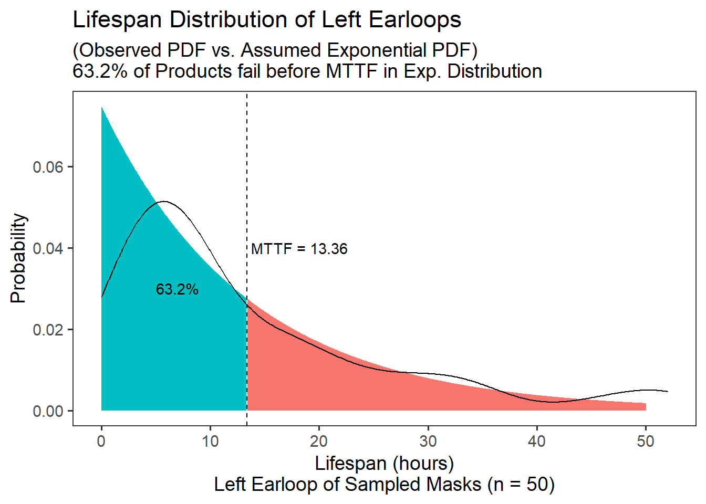
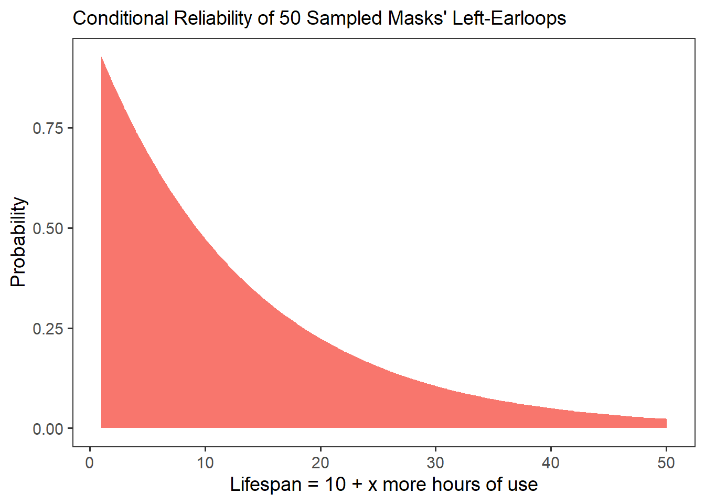

# Useful Life Distributions (Exponential)


In this workshop, we're going to learn some `R` functions for working with common life distributions, namely the **Exponential** distributions.

## Getting Started

### Load Packages

Let's start by loading the `tidyverse` package, which will let us `mutate()`, `filter()`, and `summarize()` data quickly. We'll also load `mosaicCalc`, for taking derivatives and integrals (eg. `D()` and `antiD()`).


``` r
# Load packages
library(tidyverse)
library(mosaicCalc)
```

<br>
<br>

###  Key Concepts

In this lesson, we'll be building on several key concepts from prior lessons. I've defined them below as a helpful review.

- **life distribution**: the distribution of a vector of $n$ products, whose values recording the amount of time it took for each product to fail. In other words, its **lifespan**.

- **probability density function (PDF)**: the function describing the probability (relative frequency) of any value in a distribution.

- **cumulative distribution function (CDF)**: the function describing the *cumulative* probability of each successive value in a distribution. Spans from 0 to 1.

- Have questions? I *strongly* recommend you review Workshops 2, 3, and 4 before this one! It will help it all fit together!

<br>
<br>

###  Our Data

In this workshop, we're going to work with a data.frame called `masks`. An extremely annoying moment in the COVID-era is when a part of your mask snaps, requiring you to get a fresh mask. Let's examine a (hypothetical) sample of `n = 50` masks produced by Company X to explore how often this happens!

Please import the `masks.csv` data.frame below. Each row is a mask, with its own unique `id`. Columns describe how many hours it took for the `left_earloop` to snap, the `right_earloop` to snap, the nose `wire` to snap, and the `fabric` of the mask to tear.


``` r
masks <- read_csv("workshops/masks.csv")

# Let's glimpse() its contents!
masks %>% glimpse()
```

```
## Rows: 50
## Columns: 5
## $ id            <dbl> 1, 2, 3, 4, 5, 6, 7, 8, 9, 10, 11, 12, 13, 14, 15, 16, 1…
## $ left_earloop  <dbl> 6, 16, 46, 4, 1, 5, 32, 35, 27, 3, 4, 7, 1, 20, 22, 17, …
## $ right_earloop <dbl> 12, 1, 17, 14, 19, 8, 18, 14, 5, 8, 8, 2, 12, 7, 20, 4, …
## $ wire          <dbl> 4, 1, 8, 29, 23, 8, 10, 38, 11, 31, 7, 4, 3, 33, 13, 2, …
## $ fabric        <dbl> 177, 462, 65, 405, 2483, 1064, 287, 2819, 1072, 288, 863…
```

<br>
<br>

## Quantities of Interest

When we work with life distributions, we often want to find several useful quantities of interest (a.k.a. parameters) about them. Let's find out how to do that with an **exponential distribution**!

### Lack of Memory 

**Exponential distributions** are famous for a key trait. The failure rate $ \lambda $ remains **constant** in an exponential distribution. The probability that a product fails in the next hour of use is the same at `t = 0`, `t = 100`, or `t = infinity!` It doesn't worsen with time. (It's the literal meaning of the saying, "if it is not broke, don't fix it!")

### Mean Time to Fail

The Mean Time to Fail describes the **mean** of a lifespan distribution. For example, let's calculate the mean time to fail (in hours) for a mask's `left_earloop` in our sample.


``` r
stat <- masks %>%
  summarize(
    # We can take the mean of this vector of time to fail in hours
    mttf = mean(left_earloop),
    # Lambda is the reciprocal of the MTTF
    lambda = 1 / mttf)

# Check out the contents!
stat
```

```
## # A tibble: 1 × 2
##    mttf lambda
##   <dbl>  <dbl>
## 1  13.4 0.0749
```

In an exponential distribution, the MTTF *always* has a cumulative probability of `1 - 1 / e = 0.632`. (This can be coded in R like so:)


``` r
1 - 1 / exp(1)
```

```
## [1] 0.6321206
```

Let's assume our sample's left earloops have an exponential lifespan distribution, and use `pexp()` to calculate the cumulative probability of getting an MTTF of 13.36. We'll need to supply `pexp()` the benchmark in the distribution in question (`mttf`), plus the the `rate` parameter $\lambda$, which we always need when simulating an exponential distribution.


``` r
prob <- pexp(stat$mttf, rate = stat$lambda)
prob
```

```
## [1] 0.6321206
```

Indeed, the figure below compares the observed PDF function (made using `density()`) to the assumed exponential PDF (made using `dexp()`), and we can see that that 63% of the distribution has failed by the Mean Time to Fail.



<br>
<br>

### Mean Time to Fail via *Integration*

**Mean Time to Fail (MTTF)** can be number-crunched empirically as the *mean of observed lifespans*, assuming an exponential distribution. But it is also equal to the **integral of the reliability** function: $MTTF = \int_{0}^{\infty}{R(t)dx} $.

So, let's make ourselves a nice reliability function to help us calculate the MTTF.

- We know the reliability function can be stated as $R(t) = 1 - F(t)$. 

- Assuming an exponential distribution, the failure rate $F(t) = 1 - e^{-\lambda t}$.

- We know $\lambda = \frac{1}{MTTF}$, and above, we found that lambda = 0.0748502994011976 for a left-earloop.


``` r
# Reliability Function for exponential distribution
r = function(t, lambda){ exp(-1*t*lambda)}
```

We can calculate it below...


``` r
# Use mosaicCalc's antiD function
# To get integral of r(t, lambda) as x goes from 0 to infinity
mttf = antiD(tilde = r(t, lambda) ~ t)
```

Great! We have developed our own `mttf` function for an exponential distribution! If we feed `t` a suitably large value, like 1000 (approaching infinity), we will reach the original observed/estimated `mttf`.


``` r
mttf(t = 1000, lambda = stat$lambda)
```

```
## [1] 13.36
```

``` r
mttf(t = Inf, lambda = stat$lambda)
```

```
## [1] 13.36
```
This only helps you if you *know* **lambda**, the inverse of the MTTF, or have the reliability function but not the MTTF.

<br>
<br>

### Median Time to Fail $T_{50}$

We might also want to know the **median** time to failure ($T_{50}$), the value on the x axis that splits the area under the curve in half at 50% and 50%. We can calculate this as...

$F(T_{50}) = 50\% = 0.5 = 1 - e^{-\lambda T_{50}}$

where:

$T_{50} = \frac{log(2)}{ \lambda } = \frac{0.693}{\lambda}$


``` r
# Let's update stat to include the observed 'median' 
# and 't50', the median assuming an exponential distribution 

stat <- masks %>%
  summarize(
    # The literal mean time to fail 
    # in our observed distribution is this
    mttf = mean(left_earloop),
    # And lambda is this...
    lambda = 1 / mttf,
    # The observed median is this....
    median = median(left_earloop),
    # But if we assume it's an exponential distribution
    # and calculate the median from lambda,
    # we get t50, which is very close.
    t50 = log(2) / lambda)

# Check it out!
stat
```

```
## # A tibble: 1 × 4
##    mttf lambda median   t50
##   <dbl>  <dbl>  <dbl> <dbl>
## 1  13.4 0.0749      8  9.26
```

### Modal Time to Fail

Finally, the modal time to fail is pretty easy to calculate. Its the most common time to fail, also known as the **max** probability in a PDF.


``` r
masks %>%
  summarize(
    # Let's get lambda, the reciprocal of the MTTF
    lambda = 1 / mean(left_earloop),
    # And let's estimate the PDF...
    t = 1:max(left_earloop),
    prob = dexp(t, rate = lambda)) %>%
  # And let's sort the data.frame from highest to lowest
  arrange(desc(prob)) %>%
  # Grab first 3 rows, for brevity
  head(3)
```

```
## # A tibble: 3 × 3
##   lambda     t   prob
##    <dbl> <int>  <dbl>
## 1 0.0749     1 0.0695
## 2 0.0749     2 0.0644
## 3 0.0749     3 0.0598
```

``` r
# This reveals that t = 1 is our mode
```

<br>
<br>

---

## Learning Check 1 {.unnumbered .LC}

**Question**
  
A competing mask manufacturer made a mask whose earloops fail at a constant failure rate of `0.08`.

1. What is the probability that 1 fails *before* 20 hours of use?

2. What is the probability that 2 fail *before* 20 hours of use?

3. After how long should we expect 1% failures?

<details><summary>**[View Answer!]**</summary>
  
1. What is the probability that 1 fails *before* 20 hours of use?


``` r
# Let's generate an expondential failure function,
# because **constant** rate of failure
f = function(t, lambda){1 - exp(-1*t*lambda)}

# Use failure function (CDF) to get area under curve BEFORE 20 hours.
f(t = 20, lambda = 0.08)
```

```
## [1] 0.7981035
```

``` r
# There's a 79% chance 1 fails within 20 hours
```

2. What is the probability that 2 fail *before* 20 hours of use?


``` r
# For n failures, take F(t) to the nth power
f(t = 20, lambda = 0.08)^2
```

```
## [1] 0.6369692
```

``` r
# There's a 63% chance 2 fail within 20 hours.
```

3. After how long should we expect 1% failures?


``` r
# We can solve this using the failure function
# f(t) = 1 - e^{-t*lambda}

# But we need to invert it,
# to solve for t
# f(t) = 1 - e^{-t*lambda}
# e^{-t*lambda} = 1 - f(t) 
# log(1 - f(t)) = -t*lambda
# -log(1 - f(t)) / lambda = t

# So if we set f(t) = 1%, and lambda = 0.08,
# this will tell us at what time F(t) will equal 1%
-log(1 - 0.01) / 0.08
```

```
## [1] 0.1256292
```

``` r
# Looks like that time of interest is t = 0.1256 hours.
```

</details>
  
---


## Learning Check 2 {.unnumbered .LC}

**Question**
  
Above, we examined a sample of surgical masks, checking how often their `left_earloop` snapped. How does that compare with the `right_earloop`?

Calculate the mean time to fail for the right earloop, and $\lamba$, the mean failure rate. Is the right earloop more or less reliable than the left earloop?

<details><summary>**[View Answer!]**</summary>

1. MTTF and Lambda


``` r
compare <- masks %>%
  summarize(mttf_right = mean(right_earloop),
            mttf_left = mean(left_earloop),
            lambda_right = 1 / mttf_right,
            lambda_left = 1 / mttf_left)
# Check it
compare
```

```
## # A tibble: 1 × 4
##   mttf_right mttf_left lambda_right lambda_left
##        <dbl>     <dbl>        <dbl>       <dbl>
## 1       10.6      13.4       0.0943      0.0749
```

``` r
# Looks like the left earloop fails less often.
```

  
</details>
  
---


<br>
<br>

## Quantities of Interest (continued)

### Conditional Reliability (Survival) Function

We may also want to know, after age `t`, what's the probability that a product survives an additional `x` years to age `t + x`? We can restate this in terms of $T_{Fail}$, the time at which the product finally fails. 

We want to know, what's the probability that $T_{Fail}$ is greater than $t + x$, given that we *already know* $T_{Fail}$ must be greater than $t$ (since it hasn't failed yet as of time $t$)? Fortunately, this can be simplified in terms of the reliability functions. As long as we can calculate $R(x + t)$ and $R(t)$, we can find $R(x|t)$, the conditional survival function.

$$ R(x | t) = \frac{ R(x + t) }{ R(t) } = \frac{ P(T_{Fail} > x + t) }{P(T_{Fail} > t)} $$
So, let's use our nice reliability function from before to help us calculate the conditional reliability function. 


``` r
# Reliability Function for exponential distribution
r = function(t, lambda){ exp(-1*t*lambda)}
```

So, what's the probability that a left-earloop that has lasted 10 hours will last another 5 hours?


``` r
r(t = 10 + 5, lambda = stat$lambda) / 
  r(t = 10, lambda = stat$lambda)
```

```
## [1] 0.6878039
```

Looks like there's a 69% chance it will last another 5 hours, given that it has already lasted 10 hours. 

Let's finish up by building ourselves a nice Conditional Reliability function `cr`, which which calculates the conditional probability of any item surviving `x` more hours given that it survived `t` hours and a mean failure rate of `lambda`.


``` r
cr = function(t, x, lambda){
  # We can actually nest functions inside each other, 
  # to make them easier to write
  r = function(t, lambda){ exp(-1*t*lambda)}
  
  # Calculate R(x + t) / R(t) 
  output <- r(t = t + x, lambda) / r(t = t, lambda)
  
  # and return the result!
  return(output)
}
```


``` r
# Let's compare our result to above! It's the same!
cr(t = 10, x = 5, lambda = stat$lambda)
```

```
## [1] 0.6878039
```
If we were to visualize our conditional reliability function `cr` below as x ranges from 1 to 50, it would produce the following curve.



<br>
<br>

### $\mu(t)$: Mean Residual Life

The Conditional Reliability Function $R(x|t)$ also allows us to calculate the Mean Residual Life (MRL, a.k.a. $\mu$) at time $t$.

The MRL at time $t$ refers to the average number of years the product is expected to survive *after* time $t$. We can calculate it using the distribution below.

$$MRL(t) = \mu(t) = \int_{0}^{\infty}{ R(x|t)dx} = \frac{1}{R(t)} \int_{0}^{\infty}{ R(x) dx} $$
It shows the mean expected remaining life years after $t$.

We can formalize this as function `mu(t, lambda)`. (Since the Greek letter $\mu$ is pronounced `mu`.)


``` r
# Conditional Reliability
library(mosaicCalc)
library(dplyr)

# Calculate Mean Residual Life
mu = function(t = 5, lambda = 0.001){
  #t = 5
  #lambda = 0.001
  # Get the Reliability Function for exponential distribution
  r = function(t, lambda){ exp(-1*t*lambda)}
  
  # Get the integral of R(x), the time remaining (mttf)
  integral = antiD(tilde = r(x, lambda) ~ x, lower.bound = 0)

  # Now calculate mu(), the Mean Residual Life function
  # as of time t
  output <- integral(x = Inf, lambda = lambda) * 1 / r(t = t, lambda = lambda)
  
  return(output)
}
```


Let's test it out!


``` r
# Mean residual life given it's lasted 500 hours
mu(t = 500, lambda = 0.001)
```

```
## [1] 1648.721
```

``` r
# Mean residual life given it's lasted 2000 hours
mu(t = 2000, lambda = 0.001)
```

```
## [1] 7389.056
```

``` r
# Mean residual life given it's lasted 5000 hours
mu(t = 5000, lambda = 0.001)
```

```
## [1] 148413.2
```

``` r
# [Note: mu is NOT vectorized]
```

Notice also that when t = 0, we have a mu(0) which equals the MTTF.


``` r
# Mean residual life given it's lasted 0 hours...
mu(t = 0, lambda = 0.001) # same as MTTF!
```

```
## [1] 1000
```

``` r
# Get mean time to failure function...
mttf = antiD(tilde = r(t, lambda) ~ t)
mttf(t = Inf, lambda = 0.001)
```

```
## [1] 1000
```

Works perfectly!

This can also be applied to other life distributions, which we explore in later chapters. For example, here's a exmaple using the Weibull's reliability function `r(t, m, c)`.


``` r
muw = function(t = 5, m = 2, c = 20000){
  #t = 5; m = 2; c = 20000
  # Get the Reliability Function for exponential distribution
  r = function(t, m, c){ exp(-1*(t/c)^m) }
  
  # Get the integral of R(x), from 0 to infinity
  integral = antiD(tilde = r(x, m, c) ~ x, lower.bound = 0)

  # Now calculate mu(), the Mean Residual Life function at time t
  output <- integral(x = Inf, m = m, c = c) * 1 / r(t = t, m = m, c= c)
  
  return(output)
}
# Try it!
# see how this mean residual time to failure gets a little bigger as we move forward?
muw(t = 500, m = 2, c = 20000)
```

```
## [1] 17735.62
```

``` r
muw(t = 501, m = 2, c = 20000)
```

```
## [1] 17735.66
```

``` r
muw(t = 502, m = 2, c = 20000)
```

```
## [1] 17735.71
```

<br>
<br>

---

## Learning Check 3 {.unnumbered .LC}

**Question**
  
A competing firm produced a mask with a wire that fails at a constant rate of 1 failure per 240 hours. 

1. The probability that the wire survives 1 week (`t = 168` hours) in continuous use is... (

2. You buy the mask, and it works without failure for 2 weeks (`t = 336` hours) The probability the wire will snap during the next week (`t = 504` hours) is...

<details><summary>**[View Answer!]**</summary>
  
1. The probability that the wire survives 1 week (`t = 168` hours) in continuous use is... (


``` r
# Write the reliability function
r = function(t, lambda){ exp(-1*t*lambda)}

# Probability it survives 1 month (760 hours) is...
r(t = 168, lambda = 1 / 240)
```

```
## [1] 0.4965853
```

``` r
# ~ 50%
```

2. You buy the mask, and it works without failure for 2 weeks (`t = 336` hours) The probability the wire will snap during the next week (`t = 504` hours) is...


``` r
# We can calculate it 2 ways.

# First, we can take
# R(t + x) / R(t)
r(t = 504, lambda = 1 / 240) / 
  r(t = 336, lambda = 1 / 240)
```

```
## [1] 0.4965853
```

``` r
# Or, we can calculate the failure function
f = function(t, lambda){1 - exp(-1*t*lambda)}
# And just calculate the rate of F(t = x)
# Because lambda is a constant failure rate
f(t = 168, lambda = 1 / 240)
```

```
## [1] 0.5034147
```

</details>
  
---

<br>
<br>

## System Failure with Independent Failure Rates

Consider a mask with a left and right earloop, which have independent failure rates $\lambda_{left}$ and $\lambda_{right}$. What's the probability that the left loop fails before the right loop?

We can express this as:

$$ P(j \ fails \ first) = \frac{ \lambda_{j}}{  \sum_{i=1}^{n}{ \lambda{i}} }$$

In other words, the probability that component $j$ fails first reflects how **big** $\lambda_{j}$ is relative to all the other failure rates in total.

Let's test this out with our `masks` dataset.


``` r
masks %>%
  summarize(
    # Calculate failure rates of left and right loops
    lambda_left = 1 / mean(left_earloop),
    lambda_right = 1 / mean(right_earloop),
    # Calculate the total probability of either loop failing
    lambda_sum = lambda_left + lambda_right,
    # Calculate probability the left loop fails first
    prob_left_first = lambda_left / lambda_sum)
```

```
## # A tibble: 1 × 4
##   lambda_left lambda_right lambda_sum prob_left_first
##         <dbl>        <dbl>      <dbl>           <dbl>
## 1      0.0749       0.0943      0.169           0.442
```

``` r
# Looks like a probability of about 44% that left loop fails first.
```

<br>
<br>

### Reliability Functions with Multiple Inputs

Suppose a fraction of our masks are shipped in from manufacturer 1, while some are shipped from manufacturer 2. A fraction $p$ is coming from manufacturer 1, while $1-p$ is coming from manufacturer 2. We can use the rules of total probability to calculate the reliability function and other quantities for this mask:

$$R(t) = \sum_{i=1}^{n}{ ( \ p_{i} \times R_i(t) \ ) } = \sum_{i=1}^{n}{ ( \ p_{i} \times e^{-\lambda_{i} t} ) }$$

$$MTTF = \sum_{i=1}^{n}{ \frac{p_i}{\lambda_{i}}}$$

$$f(t) = \frac{-d}{dt}R(t) = \sum_{i=1}^{n}{p\lambda_{i}e^{-\lambda_{i}t}}$$

$$z(t) = \frac{ f(t) }{ R(t)} = \frac{  \sum_{i=1}^{n}{p\lambda_{i}e^{-\lambda_{i}t}} }{ \sum_{i=1}^{n}{ ( \ p_{i} \times R_i(t) \ ) } }  $$

It's pretty messy, but powerful!

Suppose we order 75% of our stock from a manufacturer with a failure rate of 1 fabric tear per 50 hours, but 25% from our stock from a manufacturer with a failure rate of 1 tear per 100 hours. What is the (1) overall mean time to failure and (2) overall failure rate at 100 hours for any random mask in your supply?

We can tally this up in a `stock` data.frame.


``` r
stock <- data.frame(
  prob = c(0.75, 0.25),
  lambda = c(1 / 50, 1 / 100))
```

To calculate the MTTF, we just take the sum of the fraction of each proportion and each failure rate lambda.


``` r
stock %>%
  summarize(mttf = sum(prob / lambda))
```

```
##   mttf
## 1 62.5
```

To calculate the overall failure rate, we will generate the reliability function, take its derivative to get the PDF.


``` r
# Let's write an exponential reliability function
r = function(t, lambda){ exp(-1*t*lambda) }

# Let's derive an exponential PDF f(t), using mosaicCalc's D()
f = D(-1*r(t, lambda) ~ t)
```

Then, we use the PDFs $f_i(t)$ and the Reliability functions $R_i(t)$ to get calculate the overall failure rate $z(t)$.


``` r
stock %>%
  summarize(
    total_f = sum(prob * f(t = 100, lambda = lambda)),
    total_r = sum(prob * r(t = 100, lambda = lambda)),
    z = total_f / total_r)
```

```
##       total_f   total_r          z
## 1 0.002949728 0.1934713 0.01524633
```

We could even write it as a function, where `p` and `lambda` are equal length vectors for plant 1, plant 2, plant 3, ... plant $n$.


``` r
z = function(t){
  # Set the input percentages of products from plants 1 and 2
  p = c(0.75, 0.25)
  # Set the failure rates for each
  lambda = c(0.02, 0.01)
  
  
  # Let's write an exponential reliability function
  r = function(t, lambda){ exp(-1*t*lambda) }
  # Let's derive an exponential PDF f(t),
  f = D(-1*r(t, lambda) ~ t)

  # Calculate total probability
  total_f = sum( p * f(t, lambda) )
  # Calculate total reliability
  total_r = sum( p * r(t, lambda) )
  
  # Calculate overall failure rate
  z = total_f / total_r
  
  return(z)
}
# Try it out!
z(t = 1)
```

```
## [1] 0.0174812
```

``` r
z(t = 10)
```

```
## [1] 0.01730786
```

``` r
z(t = 100)
```

```
## [1] 0.01524633
```

<br>
<br>

### Phase-Type Distributions

One way to more accurately model the lifespan of a product is to accept that its failure rate may remain constant, but it might change between failure rates as it passes through **phases**. Let's model that!

We can write the time $T$ to critical failure (via either overstress OR degraded failure) as $T = min(T_c, T_d+T_{dc})$.


```{=html}
<div class="DiagrammeR html-widget html-fill-item" id="htmlwidget-da8360c6eca2ca670f28" style="width:672px;height:480px;"></div>
<script type="application/json" data-for="htmlwidget-da8360c6eca2ca670f28">{"x":{"diagram":"graph LR\n O((\"Overstress\"))\n C((\"Critical<br>Failure\"))\n D((\"Degraded<br>Failure\"))\n DC((\"Critical<br>Degraded\"))\n O-->|&lambda;<sub>C<\/sub>|C\n O-->|&lambda;<sub>D<\/sub>|D\n D-->|&lambda;<sub>C<\/sub>|C\n D-->|&lambda;<sub>DC<\/sub>|DC"},"evals":[],"jsHooks":[]}</script>
```

The total probability of a product being in any phase $a_{i \to n}$ equals 1.

- $a_c = 25\%$

- $a_d = 40\%$

- $a_dc = 10\%$

We can represent it in a dataframe, like so:


``` r
myphase <- data.frame(
  id = 1:4,
  phase = c("c", "d", "c", "dc"),
  alpha = c(0.25, 0.40, 0.25, 0.10),
  lambda = c(0.50, 1, 0.50, 3)
)
```

And, using the same tricks from the preceding section, we can calculate `z(t)`, the overall hazard rate of a phase-type exponential distribution, by taking the sum of the weighted probabilities.


``` r
r = function(t, lambda){ exp(-1*t*lambda) }
# Let's derive an exponential PDF f(t),
f = D(-1*r(t, lambda) ~ t)

z = function(t, data){
  output <- data %>%
    summarize(
      prob_f = sum(alpha * f(t = t, lambda)),
      prob_r = sum(alpha * r(t = t, lambda)),
      ratio_z = prob_f / prob_r)
  output$ratio_z %>% return()
}

# Take a peek!
z(t = 1, data = myphase)
```

```
## [1] 0.6888965
```

``` r
z(t = 2, data = myphase)
```

```
## [1] 0.6161738
```

``` r
z(t = 5, data = myphase)
```

```
## [1] 0.5308124
```

``` r
z(t = 10, data = myphase)
```

```
## [1] 0.5026807
```


<br>
<br>

## Conclusion

Congrats! You made it! You've just picked up some of the key techniques for evaluating product lifespans in `R`!


