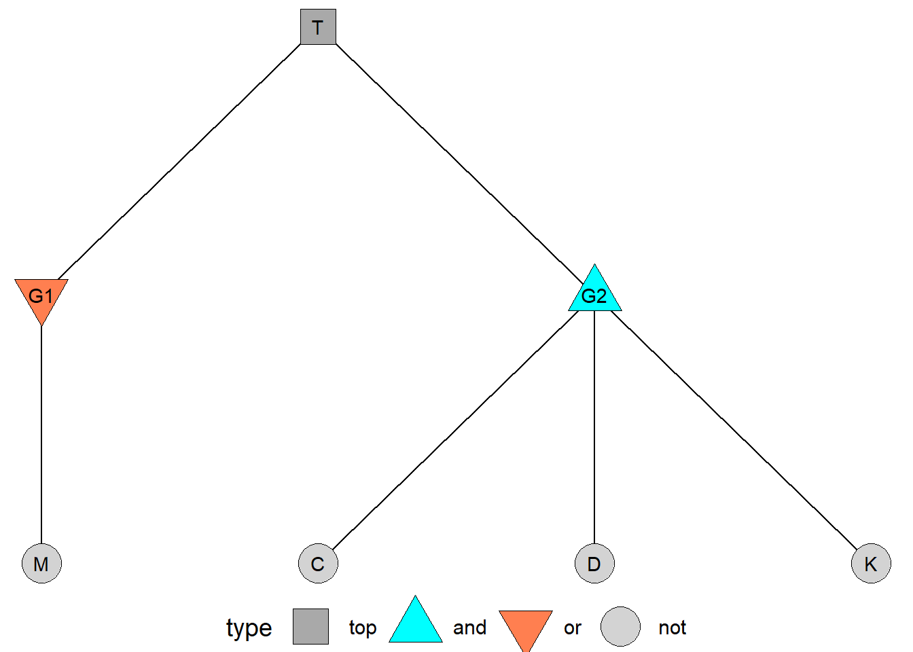
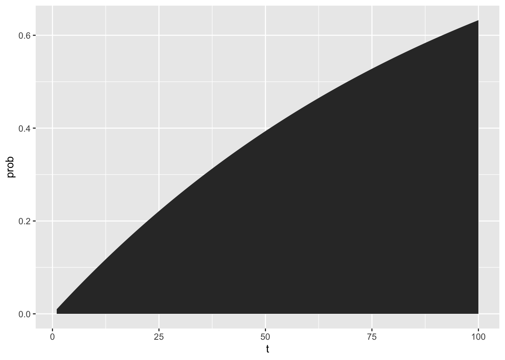
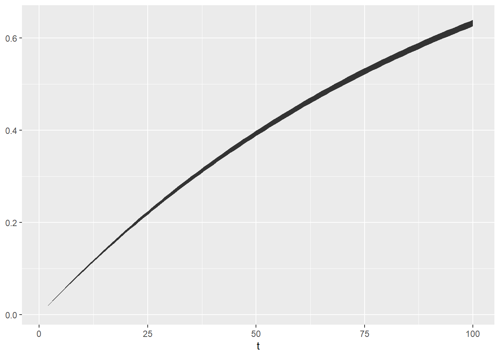
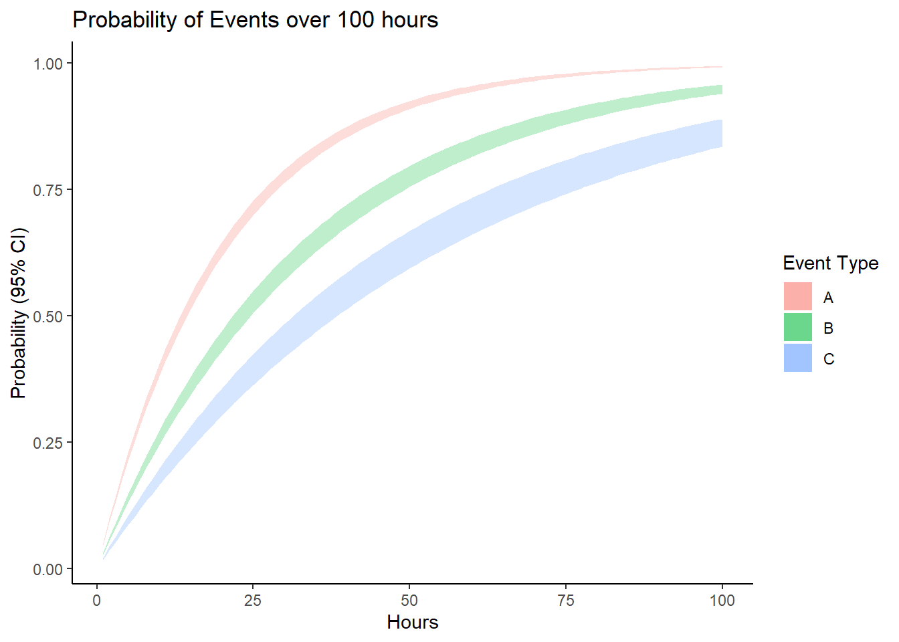

# Fault Tree Analysis in R


Fault trees are visual representation of boolean probability equations, typically depicting the sets of necessary events leading to system failure. We're going to learn how to make calculations about fault trees in `R`!

## Getting Started {-}

### Prerequisites {-}

As a prerequisite for this workshop, be sure to have read our class reading on Fault Trees! 

### Load Packages {-}


```r
library(dplyr)
library(readr)
library(ggplot2)
```

## Simulating Fault Trees

Fault Trees are a powerful way of modeling the probability of a top event, eg. a big prominent failure, like a nuclear disaster, a missile launch, etc. It supposes that a series of different chains of events can all lead to that top event. Each event in the chain has a probability, and these all can be represented graphically and numerically using boolean logic to create functions! All fault trees can be represented as a function - an equation to estimate the probability of the top event.

Fortunately, fault trees are extremely flexible. You can apply all of our past simulation approaches, probability rules, lifespan distribution concepts, and reliability analysis tools to them. 

## Example: Superman Fault Tree

A favorite simple fault tree example of mine is the 'Superman Turns Evil' fault tree. It consists of a few events:

- `T`: Superman turns evil
- `M`: Superman movies do poorly at the box office
- `C`: Boring Childhood in Kansas
- `D`: Lois Lane Dumps Superman
- `K`: Steps on Kryptonite Lego in the middle of the night



In this fault tree, it looks like Superman could turn evil if (A) Superman Movies do poorly at the box office OR (B) if all 3 other conditions happen (boring childhood, dumped by Lois Lane, steps on Kryptonite Lego). 


## Using Raw Probabilities

We could represent that using boolean logic. So if we know the probability of events `m`, `c`, `d`, and `k`, we can calculate the probability of the top event `top`.


```r
f1 = function(m, c, d, k){
  top = m + c * d * k 
  return(top)
}
# For example... given these probabilities, the chance Superman turns evil is highly contigent on event m - the success of superman movies at the box office.
probs1 = f1(m = 0.50, c = 0.99, d = 0.25, k = 0.01)
# view it!
probs1 
```

```
## [1] 0.502475
```

---

<br>
<br>

## Learning Check 1 {.unnumbered .LC}

**Question**

You are tasked with assessing the risk of a widespread outbreak of a contagious disease in a population. The top event is defined as the **widespread outbreak** of a contagious disease in a population. This top event T can occur (G1) if any of the 3 following crises occur (G2, G3, or G4).

**G2: Insufficient Vaccination Coverage**:
All of the following must occur for this crisis to happen:
Causes and Probabilities:
- A. Lack of public awareness: P(Lack of public awareness) = 0.2 (20%)
- B. Limited access to vaccines: P(Limited access) = 0.15 (15%)
- C. Vaccine hesitancy due to misinformation: P(Vaccine hesitancy) = 0.3 (30%)

**G3: Ineffective Quarantine Measures**:
Any of the following can lead to this crisis:
Causes and Probabilities:
- D. Inadequate quarantine protocols: P(Inadequate protocols) = 0.1 (10%)
- E. Non-compliance with quarantine rules: P(Non-compliance) = 0.15 (15%)
- F. Inefficient monitoring of quarantined individuals: P(Inefficient monitoring) = 0.2 (20%)

**G4: Mutation of the Pathogen:**
Both events must occur for this crisis to occur.
Causes and Probabilities:
- G. High mutation rate of the pathogen: P(High mutation rate) = 0.05 (5%)
- H. Inadequate monitoring of the pathogen mutations: P(Inadequate monitoring) = 0.1 (10%)

<details><summary>**[View Answer!]**</summary>

Use these events' probabilities to construct a boolean equation and its function in R!


```r
f = function(a = 0.2, b = 0.15, c = 0.3, d = 0.1, e = 0.15, f = 0.2, g = 0.05, h = 0.1){
  # G2. Probability of Insufficient Vaccination Coverage:
  # All of the sub-events must occur for this intermediate event to happen:
  p_insufficient_vaccine_coverage = a * b * c # Probabilities for AND logic
  
  # G3. Probability of Ineffective Quarantine Measures:
  # Any of the sub-event event can lead to this intermediate event:
  p_quarantine_measures = d + e + f   # Probabilities for OR logic
  
  # G4. Probability of Mutation of the Pathogen:
  # Both conditions need to be present in order for pathogen to mutate:
  p_pathogen_mutation <- g * h  # Probabilities for AND logic

  
  # If EITHER insufficient vaccine coverage 
  # OR no quarantine measures 
  # OR pathogen mutation occur,
  # the outbreak occurs.
  
  # T = OR Gate G1 = G2 + G3 + G4
  p_top = p_insufficient_vaccine_coverage + p_quarantine_measures + p_pathogen_mutation
  
  return(p_top)
}
```


Let's see what the probability of widespread outbreak, in this hypothetical scenario, turns out to be:


```r
f(a = 0.2, b = 0.15, c = 0.3, d = 0.1, e = 0.15, f = 0.2, g = 0.05, h = 0.1)
```

```
## [1] 0.464
```

</details>


---


## Using Failure Rates at Time `t`

But if we knew the failure rate of each event, we could calculate the probability of the top event at any time `t`!


```r
f2 = function(t, lambda_m, lambda_c, lambda_d, lambda_k){
  # Get probability at time t...
  prob_m = pexp(t, rate = lambda_m)
  prob_c = pexp(t, rate = lambda_c)
  prob_d = pexp(t, rate = lambda_d)
  prob_k = pexp(t, rate = lambda_k)
  # Use boolean equation to calculate top event
  prob_top = prob_m + (prob_c * prob_d * prob_k)
  return(prob_top)
}

# Then we could simulate the probability of the top event over time!
probs2 = tibble(t = 1:100) %>%
  mutate(prob = f2(t = t, lambda_m = 0.01, lambda_c = 0.001, 
                   lambda_d = 0.025, lambda_k = 0.00005))
# Check out the first few rows!
probs2 %>% head(3)
```

```
## # A tibble: 3 × 2
##       t    prob
##   <int>   <dbl>
## 1     1 0.00995
## 2     2 0.0198 
## 3     3 0.0296
```


```r
# Let's visualize it!
ggplot() + 
  geom_area(data = probs2, mapping = aes(x = t, y = prob))
```



---

## Learning Check 2 {.unnumbered .LC}

**Question**

Suppose we have a small fault tree, where the top event T depends on either [A and B] OR [B and C] occuring. What is the probability of the top event after `1` hour vs. after `10` hours, given the following parameters? 

- `lambda_a = 0.05`
- `lambda_b = 0.03`
- `lambda_c = 0.02`


<details><summary>**[View Answer!]**</summary>


```r
# Let's create a function calculate probability of the top event using failure rates and time period
f = function(
    t = 1, # Time period we want to analyze the events for    
    lambda_a = 0.05, # Failure rate for event A 
    lambda_b = 0.03, # Failure rate for event B
    lambda_c = 0.02 # Failure rate for event C
    ){
  
  # As these events follow exponential distribution, we need to calculate intermediate probabilities accoridingly
  prob_a = pexp(t, rate = lambda_a)
  prob_b = pexp(t, rate = lambda_b)
  prob_c = pexp(t, rate = lambda_c)
  
  # Get probability of top event
  prob_top = (prob_a * prob_b) + (prob_b * prob_c)
  
  return(prob_top)
} 
```


```r
# Probability of failure after 1 hour
f(t = 1, lambda_a = 0.05, lambda_b = 0.03, lambda_c = 0.02)
```

```
## [1] 0.002026606
```


```r
# Probability of failure after 10 hours
f(t = 10, lambda_a = 0.05, lambda_b = 0.03, lambda_c = 0.02)
```

```
## [1] 0.1489618
```

</details>

---


## Simulating Uncertainty in Probabilities

We can use simulation to answer several important questions about variation. For example, we can simulate how the probability of the top event would change if the probability of each event varies ever so slightly across 1000 simulations. 

When simulating variation in probabilities, you can use random draws from the binomial distribution, randomly sampling 1s or 0s at a given probability `prob` a total of `n` times.


```r
probs3 = tibble(
  n = 1000,
  prob_m = rbinom(n = n, size = 1, prob = 0.50),
  prob_c = rbinom(n = n, size = 1, prob = 0.99),
  prob_d = rbinom(n = n, size = 1, prob = 0.25),
  prob_k = rbinom(n = n, size = 1, prob = 0.01),
  # Calculate probability of top event for each simulation  
  prob_top = f1(m = prob_m, c = prob_c, d = prob_d, k = prob_k)
)
# Let's get some descriptive statistics - the average will be particularly informative
probs3 %>% 
  summarize(
    mu_top = mean(prob_top),
    sigma_top = sd(prob_top))
```

```
## # A tibble: 1 × 2
##   mu_top sigma_top
##    <dbl>     <dbl>
## 1  0.497     0.500
```

## Simulating Uncertainty in Failure Rates

Usually, we go a few steps further, saying, **suppose the probability of each failure $/lambda$ might vary slightly, according to a normal distribution.** What would be the average probability of failure for the top event? How much should we expect that average to vary, on average? 

Suppose each failure rate has a specific standard error: for `m`, `0.0001`; for `c`, `0.00001`, for `d` and `k`, `0.000002`.


```r
f4 = function(t, lambda_m, lambda_c, lambda_d, lambda_k){
  sim_lambda_m = rnorm(n = 1, mean = lambda_m, sd = 0.0001)
  sim_lambda_c = rnorm(n = 1, mean = lambda_c, sd = 0.00001)
  sim_lambda_d = rnorm(n = 1, mean = lambda_d, sd = 0.000002)
  sim_lambda_k = rnorm(n = 1, mean = lambda_k, sd = 0.000002)
  
  # Get probability at time t...
  sim_prob_m = pexp(t, rate = sim_lambda_m)
  sim_prob_c = pexp(t, rate = sim_lambda_c)
  sim_prob_d = pexp(t, rate = sim_lambda_d)
  sim_prob_k = pexp(t, rate = sim_lambda_k)
  # Use boolean equation to calculate top event
  prob_top = sim_prob_m + (sim_prob_c * sim_prob_d * sim_prob_k)
  return(prob_top)
}

# Then we could simulate the probability of the top event over time,
probs4 = tibble(t = 1:100) %>%
  # This would give us 1 random simulation per time period  
  mutate(prob = f4(t = 1:100, lambda_m = 0.01, lambda_c = 0.001, 
                   lambda_d = 0.025, lambda_k = 0.00005))
```


```r
# But we really probably want MANY random simulations per time period.
probs5 = tibble(reps = 1:1000) %>%
  group_by(reps) %>%
  # We can use `reframe()`, a version of summarize()
  # used when you want to return MANY rows per group
  reframe(
    t = 1:100,
    prob = f4(t = t, lambda_m = 0.01, lambda_c = 0.001, 
              lambda_d = 0.025, lambda_k = 0.00005))

probs5 %>% head(3)
```

```
## # A tibble: 3 × 3
##    reps     t    prob
##   <int> <int>   <dbl>
## 1     1     1 0.00984
## 2     1     2 0.0196 
## 3     1     3 0.0292
```


```r
# And then we could get quantities of interest for each time period!
probs6 = probs5 %>%
  group_by(t) %>%
  summarize(
    mu = mean(prob), 
    sigma = sd(prob),
    # Exact lower and upper 95% simulated confidence intervals
    lower = quantile(prob, probs = 0.025),
    upper = quantile(prob, probs = 0.975),
    # Approximated lower and upper 95% confidence intervals
    lower_approx = mu - qnorm(0.025) * sigma,
    upper_approx = mu + qnorm(0.975) * sigma)

probs6 %>% head(3)
```

```
## # A tibble: 3 × 7
##       t      mu     sigma   lower  upper lower_approx upper_approx
##   <int>   <dbl>     <dbl>   <dbl>  <dbl>        <dbl>        <dbl>
## 1     1 0.00995 0.0000986 0.00976 0.0101       0.0101       0.0101
## 2     2 0.0198  0.000195  0.0194  0.0202       0.0202       0.0202
## 3     3 0.0295  0.000290  0.0290  0.0301       0.0301       0.0301
```

Let's visualize that confidence interval over time!


```r
ggplot() +
  geom_ribbon(data = probs6, mapping = aes(x = t, ymin = lower, ymax = upper))
```



The sky is the limit! Happy fault tree simulating!


---


<br>
<br>


## Example: Contagion

You are tasked with assessing the risk of a widespread outbreak of a contagious disease in a population. The top event is defined as the "Widespread outbreak of a contagious disease in a population." This top event can occur based on the following intermediate events:

**Insufficient Vaccination Coverage:**

*All of the following must occur for this event to happen.*

**Causes and Probabilities:**

- Lack of public awareness: P(Lack of public awareness) = 0.2 (20%)
- Limited access to vaccines: P(Limited access) = 0.15 (15%)
- Vaccine hesitancy due to misinformation: P(Vaccine hesitancy) = 0.3 (30%)

**Ineffective Quarantine Measures:**

*Any of the following can lead to this event*

**Causes and Probabilities:**

- Inadequate quarantine protocols: P(Inadequate protocols) = 0.1 (10%)
- Non-compliance with quarantine rules: P(Non-compliance) = 0.15 (15%)
- Inefficient monitoring of quarantined individuals: P(Inefficient monitoring) = 0.2 (20%)

**Mutation of the Pathogen:**

*This event itself can lead to the top event*

**Causes and Probabilities:**

- High mutation rate of the pathogen: P(High mutation rate) = 0.05 (5%)
- Inadequate monitoring of the pathogen mutations: P(Inadequate monitoring) = 0.1 (10%)


```r
# Calculating probabilities of intermediate events using probabilities based on available data:
# Probability of Insufficient Vaccination Coverage:
# All of the sub-events must occur for this intermediate event to happen:
p_event1<- c(0.2, 0.15, 0.3)  # Probabilities for AND logic
p_insufficient_vaccine_coverage <- prod(p_event1)
p_insufficient_vaccine_coverage
```

```
## [1] 0.009
```

```r
# Probability of Ineffective Quarantine Measures:
# Any of the sub-event event can lead to this intermediate event:
p_event2 <- c(0.1, 0.15, 0.2)  # Probabilities for OR logic
p_quarantine_measures <- sum(p_event2)
p_quarantine_measures
```

```
## [1] 0.45
```

```r
# Probability of Mutation of the Pathogen:
# Both conditions need to be present in order for pathogen to mutate:
p_event3 <- c(0.05, 0.1)  # Probabilities for AND logic
logic_mutation <- "AND"
p_pathogen_mutation <- prod(p_event3)
p_pathogen_mutation
```

```
## [1] 0.005
```

```r
# Calculating the probability of widespread outbreak (top event) using the probabilities of intermediate events
# Let's create a function that can calculate the probability of the top event using any number of intermediate events and any logic gate
top_event <- function(intermediate_probability, logic) {
  
  if (logic == "AND") {
    return(prod(intermediate_probability))
  } else if (logic == "OR") {
    return(1 - prod(1 - intermediate_probability))
  } else {
    stop("Unsupported logic operator. Use 'AND' or 'OR'.")
  }
}
# Define probabilities and logic gates as vector
intermediate_probability<- c(p_insufficient_vaccine_coverage,p_quarantine_measures,p_pathogen_mutation)  # Probabilities for the intermediate events
logic <- "OR"  # Logic gate for the top event ("AND" or "OR")
# Calculate the probability of the top event - Widespread outbreak of disease: 
p_widespread_outbreak <- top_event(intermediate_probability, logic)
# Print the result
cat("Probability of the top event:", p_widespread_outbreak, "\n")
```

```
## Probability of the top event: 0.4576752
```

---


<br>
<br>


## Learning Check 3 {.unnumbered .LC}

Suppose we have some fault tree involving 3 key events, A, B, and C. Suppose these events have the following failure rates: `lambda_a = 0.05`, `lambda_b = 0.03`, and `lambda_c = 0.02`. 

Simulate the 95% confidence interval for the probability of each event, for each hour from `0` to `100` hours, assuming a standard error for each of `0.001`. Then visualize these confidence intervals as a `ribbon` plot.

<details><summary>**[View Answer!]**</summary>


```r
# Firstly, let's load necessary libraries for plotting
library(ggplot2)
library(dplyr)

stat = tibble(
  reps = 1:1000,
  # Simulate 1000 lambdas!
  lambda_a = rnorm(n = 1000, mean = 0.05, sd = 0.001),
  lambda_b = rnorm(n = 1000, mean = 0.03, sd = 0.001),
  lambda_c = rnorm(n = 1000, mean = 0.02, sd = 0.001)
) %>%
  # For each simulation...
  group_by(reps) %>%
  reframe(
    # Get a time frame from 1 to 100 hours
    t = 1:100,
    # Get the probabilities for that time frame given each simulated lambda
    prob_a = pexp(t, rate = lambda_a),
    prob_b = pexp(t, rate = lambda_b),
    prob_c = pexp(t, rate = lambda_c)
  ) %>%
  # For each time period, get the lower and upper confidence interval
  group_by(t) %>%
  summarize(
    # 95% CI for prob a
    lower_a = quantile(prob_a, probs = 0.025),
    upper_a = quantile(prob_a, probs = 0.975),
    # 95% CI for prob b
    lower_b = quantile(prob_b, probs = 0.025),
    upper_b = quantile(prob_b, probs = 0.975),
    # 95% CI for prob c
    lower_c = quantile(prob_c, probs = 0.025),
    upper_c = quantile(prob_c, probs = 0.975))

# Let's view it
stat %>% head(3)
```

```
## # A tibble: 3 × 7
##       t lower_a upper_a lower_b upper_b lower_c upper_c
##   <int>   <dbl>   <dbl>   <dbl>   <dbl>   <dbl>   <dbl>
## 1     1  0.0470  0.0506  0.0276  0.0314  0.0178  0.0219
## 2     2  0.0918  0.0986  0.0545  0.0618  0.0353  0.0432
## 3     3  0.135   0.144   0.0806  0.0913  0.0525  0.0642
```


```r
# Let's make the plot!
ggplot() +
  # Plot bands for event a
  geom_ribbon(
    data = stat, 
    mapping = aes(x = t, ymin = lower_a, ymax = upper_a, fill = "A"), 
    alpha = 0.25) +
  # Plot bands for event b
  geom_ribbon(
    data = stat, 
    mapping = aes(x = t, ymin = lower_b, ymax = upper_b, fill = "B"),
    alpha = 0.25) +
  # Plot bands for event c
  geom_ribbon(
    data = stat, 
    mapping = aes(x = t, ymin = lower_c, ymax = upper_c, fill = "C"),
    alpha = 0.25) +
  theme_classic() +
  labs(title = "Probability of Events over 100 hours",
       x = "Hours", y = "Probability (95% CI)", fill = "Event Type")
```



</details>

---

