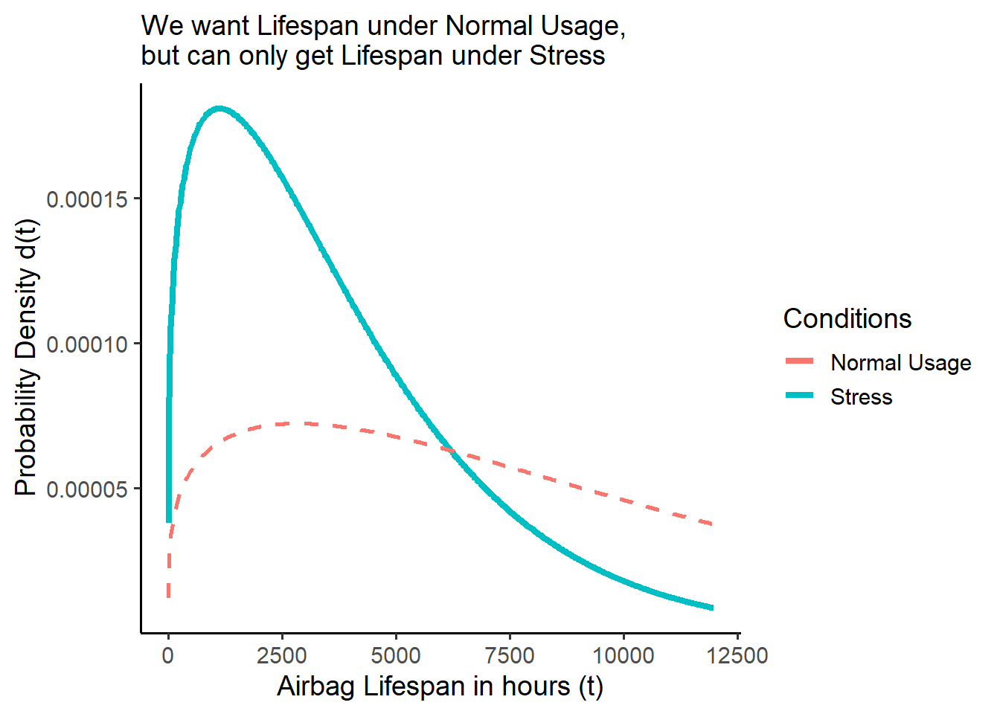
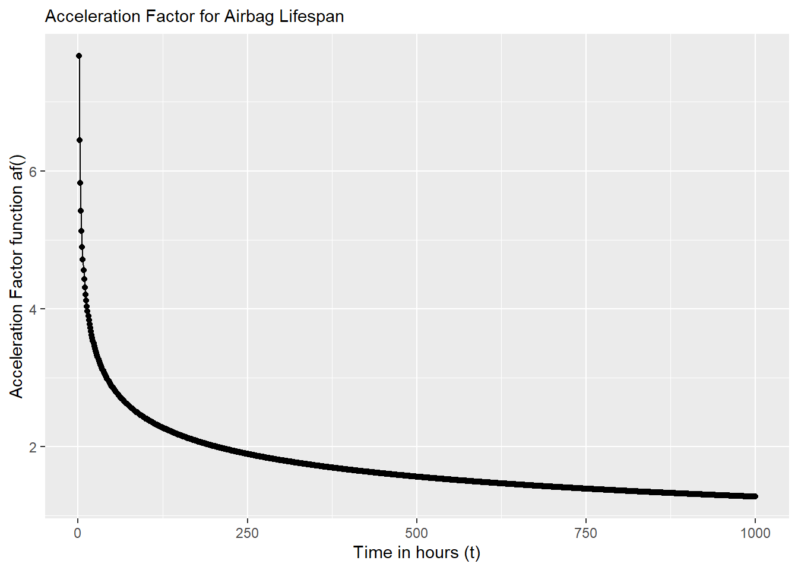
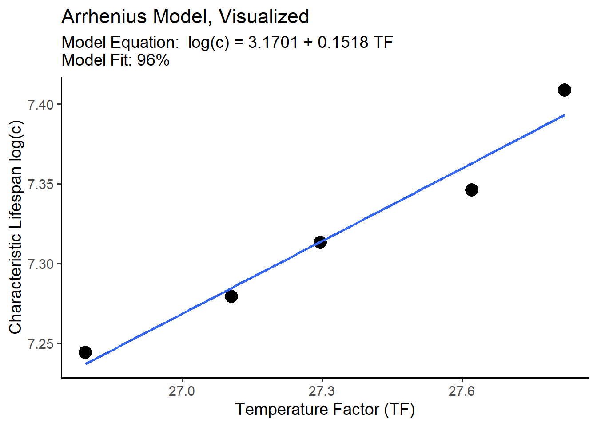
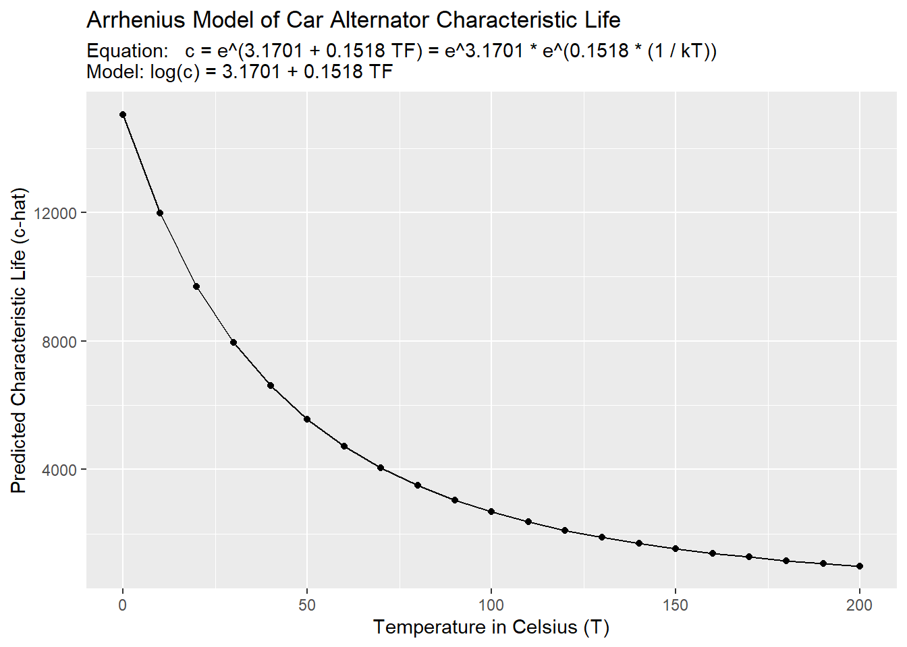
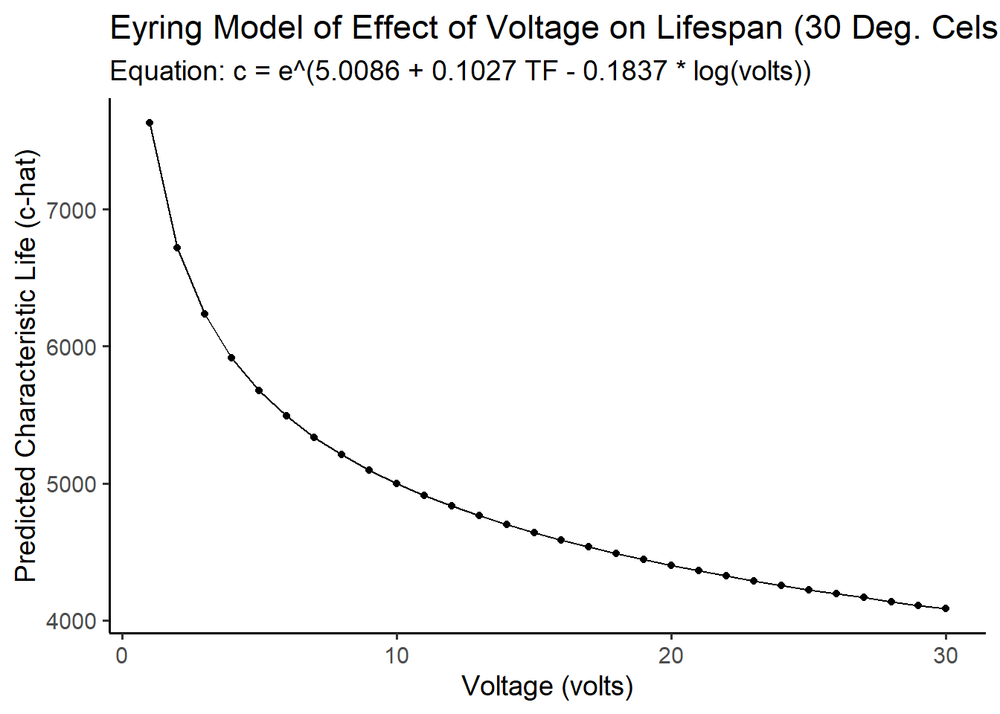

# Workshop: Physical Acceleration Models


In this workshop, we'll learn how to use **physical acceleration models** to convert results from reliability tests done under laboratory conditions (which may be slightly unrealistic) into estimates that match real outcomes in the field!

<div class="figure">

<p class="caption">(\#fig:gif)Crash Testing with LEGOs: a very safe prototype</p>
</div>

## Getting Started {-}

### Load Packages {-}

Let's start by loading the `tidyverse` and `broom` packages! Also, sometimes select gets overruled by other packages, so it can help to load it directly.


```r
# Load packages
library(tidyverse)
library(broom)
# Load specific function to environment
select = dplyr::select
```

###  Helpful Functions {-}

We'll be using the `tibble()` function; it works identically to the `data.frame()` function, but allows you to reference any vector that came before. For example:


```r
# This doesn't work...
data.frame(x = c(1,2), y = x + 2)
```

```r
# But this does.
tibble(x = c(1,2), y = x + 2)
```

```
## # A tibble: 2 × 2
##       x     y
##   <dbl> <dbl>
## 1     1     3
## 2     2     4
```


<br>
<br>

##  Acceleration Factor

###  Stress vs. Usage Conditions

**Imagine**: You work in Dearborn, Michigan, testing airbag failure rates with car crash dummies every day. Your work helps people stay safe on the road! Unfortunately, lab conditions tend to be a little more extreme than the real world. Moisture levels, temperature, speed, friction, etc. are very hard (nay impossible) to *perfectly* match to real driving conditions. A product life distribution measured under lab "stress" conditions will always be slightly *off* from the real, "use"-case life distribution by a *specific factor*. **What if we could measure and approximate that factor?**

Suppose researchers are stress testing airbags in the lab! Their empirical data reveals the airbag lifespans are Weibull distributed, with a characteristic life of `c = 4100` hours and a shape parameter of `m = 1.25`. They write the Weibull density function (PDF) `d()` below, and use it to calculate and visualize the probability the airbags fail every hour from 1 to 8000 hours. 

- They can visualize the **blue density curve** of the stress-tested airbags shown below ($s$), called $f_s(t)$. 

- But what they really want to know is the **red dashed curve** of the airbags under normal use conditions ($u$), called $f_u(t)$! But they don't know it!

- Fortunately, they know that in past *on-road* and *off-road* studies, the *median airbag*'s time to failure was `250%` times greater under *normal usage* as when *under stress condition*. We write `250%` here the **Acceleration Factor** $AF$ (or $A$), because it describes how stress-testing *accelerates* the failure  by a **factor** of `2.5`. We can write it like:

$$f_u(t) = f_s(t) \times AF = f_s(t) \times 2.5 $$

```r
# Let's write ourselves a speedy weibull density function 'd()'
d = function(t, m, c){
  (m / t) * (t / c)^m * exp(-1*(t/c)^m)
  # or dweibull(t, scale = c, shape = m)
}

airbags <- data.frame(t = seq(1, 12000, by = 20)) %>%
  mutate(d_stress = d(t, c = 4100, m = 1.25)) %>%
  # Suppose the lifespans under normal usage are just off by a factor of ~2.5
  # then we could project the PDF under normal usage like:
  mutate(d_usage = d(t = t / 2.5, c = 4100, m = 1.25) / 2.5)

ggplot() +
  # Plot the PDF under stress conditions 
  geom_line(data = airbags, mapping = aes(x = t, y = d_stress, color = "Stress"), 
            size = 1.5) +
  # Plot the PDF under normal usage conditions
  geom_line(data = airbags, mapping = aes(x = t, y = d_usage, color = "Normal Usage"), 
            size = 1, linetype = "dashed") +
  # Add a nice theme and clear labels
  theme_classic(base_size = 14) +
  labs(x = "Airbag Lifespan in hours (t)", y = "Probability Density d(t)",
       color = "Conditions", 
       subtitle = "We want Lifespan under Normal Usage,\nbut can only get Lifespan under Stress")
```



<br>
<br>

###  Acceleration as a Function $\frac{f_{s}(t)}{f_{u}(t)}$

In reality, $f_{u}(t)$ probably doesn't have exactly a constant relationship with $f_{s}(t)$. In a perfect world, we could collect raw data for both lifetimes under normal conditions $t_u$ and under stress-testing $t_s$, and then estimate their density functions $f_u(t)$ and $f_s(t)$. We could then calculate $AF$ *exactly* as a function `af()` that relates them. For example:


```r
# Let's write an acceleration factor function!
af = function(t){
  # Find density under stress
  ds <- d(t, m = 1.25, c = 4100)
  # Find density function under normal conditions
  du <- d(t, m = 1.5, c = 4500)
  
  # Since f_u(t) = f_s(t) x AF,
  # then AF = f_s(t) / f_u(t)  = ds / du
  ds / du
}
```

Were we to plot it, we can see below `AF` is *not* constant here, but varies over time, because $f_u(t)$ and $f_s(t)$ vary over time. So, when we pick an `AF`, we're usually picking the `AF` corresponding to a specific parameter, like the characteristic life or median of a distribution.


```r
data.frame(
  time = 1:1000,
  af = af(1:1000)
) %>% 
  # Visualize it!
  ggplot(mapping = aes(x = time, y = af)) +
  geom_line() + geom_point() +
  labs(subtitle = "Acceleration Factor for Airbag Lifespan",
       y = "Acceleration Factor function af()",
       x = "Time in hours (t)")
```


<br>

Supposing that $t_{u} = t_{s} \times AF$, we can say several more things:

$$ Failure \ Function = F_{u}(t) = F_{s}(t/AF) $$
$$ Density \ Function = f_{u}(t) = \frac{f_{s}(t/AF)}{AF} $$ 
$$ Failure \ Rate = z_{u}(t) = \frac{z_{s}(t/AF)}{AF} $$ 

<br>
<br>

###  Linear Acceleration

However, it's usually very difficult to obtain the density functions for both usage and stress conditions. That's *why* we want acceleration factors (AF) - because they'll let use estimate $f_u(t)$ when we only have $f_s(t)$. So in practice, we usually assume $AF$ shows a constant, linear relationship between $f_{u}(t)$ and $f_{s}(t)$, like when $AF = 2.5$. This is called **linear acceleration**.

Linear acceleration requires us to choose a constant value of $AF$ from *just 1 time-step* from the plot above. How can we choose!? We should probably choose a fairly representative lifespan, based off a parameter like the median time to fail $T_{50}$ (or the mean time to fail $m$, characteristic life $c$, etc.). Even if we don't have access to all the raw data, if we know the median lifespan under stress $T_{50_{s}}$ and under normal conditions $T_{50_{u}}$, we can estimate $AF$ by taking $AF = \frac{T_{50_{u}}}{T_{50_{s}}}$. For example:


```r
# Let's write a weibull quantile function
q = function(p, c, m){  qweibull(p, scale = c, shape = m)  }

# Get median under stress
median_s <- q(0.5, c = 4100, m = 1.25)
# Get median under normal conditions
median_u <- q(0.5, c = 4500, m = 1.5)

# Calculate it!
af = median_u / median_s
# Check the Acceleration Factor!
af
```

```
## [1] 1.152529
```

Let's clear this data.


```r
remove(af, median_s, median_u, q, d)
```

<br>
<br>

---

## Learning Check 1 {.unnumbered #LC1}

**Question**
  
A kitchen mixer has an exponential distributed lifespan. Labs stress tested the mixer at `125` degrees Celsius, yielding a *mean time to fail* of `4500` hours. But, it is usually heats to 32 degrees Celsius, and has an acceleration factor of `35`.

What proportion of mixers do we expect will fail by 40,000 hours under normal use?

<details><summary>**[View Answer!]**</summary>
  

```r
# Given an acceleration factor of 35
af <- 35

# Write a failure function
f = function(t, lambda){ 1 - exp(-t*lambda) }


# Method 1:
# Failure  Function = fu(t) = fs(t/AF)
f(t = 40000 / af, lambda = 1 / 4500)
```

```
## [1] 0.2242836
```

```r
# Method 2:
# We know that lambda = zu(t) = zs(t/AF) / AF
# so... plus that in for lambda
f(t = 40000, lambda = 1 / (4500 * af) )
```

```
## [1] 0.2242836
```

We expect ~22% of mixers will fail after 40,000 hours when running at 32 degrees Celsius.


```r
remove(af, f)
```

</details>
  
---

<br>
<br>

---

## Learning Check 2 {.unnumbered #LC2}

**Question**
  
Suppose we want no more than 10% of components to fail after 40,000 hours at normal usage conditions. So, we redesign the mixer to operate at a lower temperature. What (linear) acceleration factor is needed to project from our 125 degree conditions in lab to the normal use temperature of 32 degrees?

<details><summary>**[View Answer!]**</summary>


```r
# Write failure function
f = function(t, lambda){ 1 - exp(-t*lambda) }

# Failure  Function = fu(t) = fs(t/AF)
# 0.10 = fu(t = 40000) = 1 - exp(-40000*lambda)
# log(1 - 0.10) = -40000*lambda
lambda_u = -log(0.90) / 40000

lambda_s = 1/4500


# Get ratio between these parameters
# lambda_u = 1 / af * lambda_s
# so...
af = lambda_s / lambda_u

# Check acceleration factor!
af
```

```
## [1] 84.36641
```

We would need an acceleration factor `af` of ~`84.4`.


```r
remove(lambda_u, lambda_s, af, f)
```
  
</details>
  
---

<br>
<br>


## Modeling Normal Use Lifespan

### Models and Prediction

A model is an equation approximating the relationship between two or more vectors of data. It's not the real thing - it's an approximation! Why use models? Usually we know quite a lot about the *conditions* under which a product was tested in lab, but we can't actually observe the characteristic lifespan of that product under *normal use conditions.* But if we can make a really good model of the relationship between the outcome and those conditions, then we can predict for *any* set of conditions what the outcome - the characteristic lifespan of a product - would be under those conditions.

Fortunately, `R` was built to make statistical models! To make a model of lifespans, we need 4 ingredients.

1. an *outcome* `vector`, saved in a `data.frame`.

2. 1 (or more) vectors of condition/predictors, saved in the same `data.frame`.

3. the `lm()` function in `R`, which makes a *linear model* drawing the **line of best fit** between each value of the predictor(s) and outcome. The *model* is the equation of that line!

4. the *outcome* `vector` needs to be *log-transformed*, because (a) most useful life distributions involve exponential processes and (b) lifespans are by nature non-negative, right-skewed variables. Taking `log(outcome)` adjusts for that and lets us plot a straight line of best fit.

- *Note: We'll learn more in later weeks about *how* `lm()` makes models, but for now, we'll assume it's magic!*

For example, let's think about a *car alternator*, the device that converts mechanical energy into electrical energy in a car. We'll make a few tiny example models!

Suppose we tested 5 samples of 100 alternators each, and recorded the results in our `alt` data.frame below. We calculated the characteristic life in each of our 5 samples in the `c`, but our samples were all subjected to different stress conditions: different temperatures in Celsius (`temp`), which were converted into units of temperature factor scores (`tf`); different voltage levels in `volts`; at different points in the devices' lifespan (`time`, in hours); and with different average performance ratings (`rating`) in amps.


```r
alt <- tibble(
  # Characteristic life in hours
  c = c(1400, 1450, 1500, 1550, 1650),
  # Temperature in Celsius
  temp = c(160, 155, 152, 147, 144),
  # Temperature Factor (a standardized unit)
  tf = 1 / (1 / 11605 * (temp + 273.15)),
  # Voltage, in volts
  volts = c(17, 16.5, 14.5, 14, 13),
  # Hours of life spent by time of test
  time = c(1200, 1000, 950, 600, 500),
  # Performance Rating, in Amps
  rating = c(60, 70, 80, 90, 100))
```

Let's use this data to explore some of the different classic physical acceleration models, including the **Arrhenius Model**, **Eyring Model**, and **Degradation Model**. 

<br>
<br>

###  Arrhenius Model (Temperature)

The Arrhenius Model is a simple equation that models the impact of temperature (`tf`) on the `log()` of lifespan (`c`). Let's explore it *visually* using `ggplot()`, and then *estimate* it using `lm()`.

<br>

### Visualizing the Arrhenius Model

We could visualize the relationship between each of these conditions and the `log()` of the characteristic lifespan `c` using... 

- `geom_point()` which makes a scatterplot between `x` and `y` coordinates in the `aes()`.

- `geom_smooth(method = "lm")`, which finds the line of best fit. 


```r
g <- alt %>%
  ggplot(mapping = aes(x = tf, y = log(c) )) +
  geom_point(size = 5) + # Add scatterplot points
  geom_smooth(method = "lm", se = FALSE) # Make line of best fit, using lm() - a linear model
  # we can write 'se = FALSE' (standard error = FALSE) to get rid of the confidence interval
```

We can also add in the *equation* of this line of best fit (which we'll calculate below), plus other labels.


```r
g + 
  # Add theme
  theme_classic(base_size = 14) +
  # Add labels
  labs(title = "Arrhenius Model, Visualized",
       subtitle = "Model Equation:  log(c) = 3.1701 + 0.1518 TF    \nModel Fit: 96%",
       # We can add a line-break in the subtitle by writing \n
       x = "Temperature Factor (TF)", y = "Characteristic Lifespan log(c)")
```



<br>
<br>

### Estimating the Arrhenius Model

So how did `R` calculate that line of best fit? It used the `lm()` function to make a **linear model** - an equation, which fits the data with a specific accuracy rate (eg. `96%`). Let's make a model `m1` to *predict* the `log()` of characteristic lifespan `c`, based on our temperature factor vector `tf` in `alt`!

First, let's make the model with `lm()`, piping our vectors from `alt`.


```r
m1 <- alt %>%
  lm(formula = log(c) ~ tf)
```

Second, let's inspect the model's fit with `glance()` from the `broom` package, and `select()` the `r.squared` statistic. `0%` means terrible model fit. `100%` means the model equation perfectly predicts every value of `log(c)` in our `alt` data.frame. We aim for excellent predictive power where possible. `96%` is excellent!


```r
m1 %>% glance() %>% select(r.squared)
```

```
## # A tibble: 1 × 1
##   r.squared
##       <dbl>
## 1     0.962
```

Third, we can now read the model equation for our line of best fit.


```r
m1
```

```
## 
## Call:
## lm(formula = log(c) ~ tf, data = .)
## 
## Coefficients:
## (Intercept)           tf  
##      3.1701       0.1518
```

The `lm()` function estimated our model equation `m1`, including 2 constant `coefficients` named `(Intercept)` and `tf`. These `coefficients` show the **y-intercept** (`(Intercept)`), called $\alpha$  and the **slope/effect/rate of change** called $\beta$ for every 1 unit increase in the temperature factor `tf`. We can write this model equation formally as:

$$ \begin{align*} log(c) =& \ Intercept + Slope \ \times TF \\ or:& \\  log(c) =& \ \alpha +    \beta \times TF, \\ & where \ \alpha = 3.1701 \ and \ \beta = 0.1518, \\ so:& \\ log(c) =& \ 3.1701 + 0.1518 \ TF \\ so:& \\ c =& e^{\alpha + \beta \times TF} \\ or:& \\ c =& \ e^\alpha \times e^{\beta \times TF} \\ or:& \\ c =& e^{3.1701} + e^{0.1518 \ TF}   \\ or:&\\ Arrhenius \ Model:& \\ c =& A + e^{\Delta H \times TF} \  \\ &\ where \ A = e^{Intercept} = e^{\beta} \ \ and \ \Delta H = Slope = \beta \\ also:& \\c =& A + e^{\Delta H \times (1 / (k T))} \\ &where \ TF = 1 / (k \times T_{Kelvin}) \ and \ k = 1 / 11605 \end{align*}  $$
As you can see above, there are many ways to write the Arrhenius model, but it boils down to this: *any linear model* of the log-characteristic life will involve:

- a **y-intercept constant** called $\alpha$ ($log(A)$ in the Arrhenius model). $\alpha$ describes how much `log(c)` we get independent of any other factors (ie: if `tf = 0`).

  - *Interpreting our model:* If the temperature factor $TF = 0$, our model predicts that $log(c) = 3.1701$.

- a **slope constant** called $\beta$ describing the effect of your variable ($TF$ or `tf`), for every 1 unit increase in your variable. In the Arrhenius model, $\beta$ is written as $\Delta H$, the 'activation energy' rate at which a temperature factor increase of 1 unit affects `log(c)`.

  - *Interpreting our model:* If the temperature factor $TF$ increases by 1, our model predicts that $log(c)$ will change by $\beta = \Delta H = 0.1518$.

And that's how we read any statistical model with two variables!

<br>
<br

###  Prediction

Now that we have our model equation (and, importantly, a good fitting one), we can feed it values of our predictor $TF$ (generically called $X$) to calculate our predicted log of the characteristic life $log(\hat{c})$ (generically called $log(\hat{Y})$). We can do this two ways: (1) by writing a `function` or (2) using the `predict()` function in `R`.

Writing our own function works the same way as writing our `d()`, `f()`, or `r()` function. We'll call it `c_hat()`.


```r
# For any value of tf, we can now calculate c_hat.
# We write the model equation for log(c), then exponentiate it with exp()!
c_hat = function(tf){ exp( 3.1701 + 0.1518*tf) }

# Test it!
c_hat(tf = 28)
```

```
## [1] 1669.868
```

It works! The characteristic life for `tf = 28` is ~1670.


```r
# Or better yet, let's calculate temperature factor 'tf' too,
# so we only have to supply a temperature in Celsius
tf = function(temp){
  k = 1 / 11605   # Get Boltzmann's constant
  1 / (k * (temp + 273.15)) # Get TF!
}
# Now predict c_hat for 30, 60, and 90 degrees celsius!
c_hat = function(temp){  exp( 3.1701 + 0.1518*tf(temp))  }

c(30, 60, 90) %>% c_hat()
```

```
## [1] 7952.275 4712.271 3044.511
```

So cool!

<br>
<br>

Wouldn't it be nice though, if we could simplify that process? The `predict()` function in `R` can help! The predict function will run your `model` equation on any `newdata` that you feed it, calculating the predicted outcomes. `newdata` must be formatted as a data.frame, containing vectors named to match each predictor from your original `data` (which we named `alt`).

Let's make a data.frame of `fakedata` with `tibble()`, varying temperature from 0 to 200 degrees Celsius, and then transform that into a temperature factor `tf` with our `tf()` function. 


```r
fakedata <- tibble(
  temp = seq(0, 200, by = 10),
  tf = tf(temp))
# Check the first 3 rows!
fakedata %>% head(3)
```

```
## # A tibble: 3 × 2
##    temp    tf
##   <dbl> <dbl>
## 1     0  42.5
## 2    10  41.0
## 3    20  39.6
```
Then, we'll feet our 21 rows of `fakedata` and our model `m1` to the `predict()` function, which will output 21 predictions for `log(c)`.


```r
m1 %>% predict(newdata = fakedata)
```

```
##        1        2        3        4        5        6        7        8 
## 9.619376 9.391606 9.179376 8.981148 8.795580 8.621497 8.457864 8.303769 
##        9       10       11       12       13       14       15       16 
## 8.158401 8.021038 7.891038 7.767824 7.650877 7.539733 7.433969 7.333203 
##       17       18       19       20       21 
## 7.237091 7.145316 7.057591 6.973655 6.893267
```
But we can exponentiate it with `exp()` to get `c_hat`!


```r
m1 %>% predict(newdata = fakedata) %>% exp()
```

```
##          1          2          3          4          5          6          7 
## 15053.6495 11987.3387  9695.1035  7951.7546  6604.9840  5549.6862  4711.9837 
##          8          9         10         11         12         13         14 
##  4039.0668  3492.5958  3044.3360  2673.2172  2363.3224  2102.4897  1881.3274 
##         15         16         17         18         19         20         21 
##  1692.5112  1530.2759  1390.0440  1268.1516  1161.6437  1068.1196   985.6159
```

We could even write the whole thing inside a `tibble()` function:


```r
fakedata <- tibble(
  temp = seq(0, 200, by = 10),
  tf = tf(temp),
  # Predict c_hat
  c_hat = predict(m1, newdata = tibble(tf)) %>% exp())
# View the first 3 rows!
fakedata %>% head(3)
```

```
## # A tibble: 3 × 3
##    temp    tf  c_hat
##   <dbl> <dbl>  <dbl>
## 1     0  42.5 15054.
## 2    10  41.0 11987.
## 3    20  39.6  9695.
```

And now, we can plot the line of best fit between `temp` and `c_hat`, which are the quantities we actually care about.


```r
g2 <- fakedata %>%
  ggplot(mapping = aes(x = temp, y = c_hat)) +
  geom_line() +
  geom_point()

# add some labels!
g2 + 
  labs(x = "Temperature in Celsius (T)", y = "Predicted Characteristic Life (c-hat)",
       title = "Arrhenius Model of Car Alternator Characteristic Life",
       # Here's a little trick for cleanly adding linebreaks in subtitles:
       # Just write a paste() function
       subtitle = paste(
         "Equation:   c = e^(3.1701 + 0.1518 TF) = e^3.1701 * e^(0.1518 * (1 / kT))",
         "Model: log(c) = 3.1701 + 0.1518 TF", sep = "\n"))
```



<br>
<br>

##  Eyring Model (Multiple Stressors)

But in our `alt` data, multiple conditions varied, including `tf` but also `volts` and `time`. These might each have independent effects on `log(c)`! So let's estimate their effect by adding some more coefficients to our model!

The **Eyring Model** provides an equation derived from chemical reaction theory and quantum mechanics, which supposes that we can predict lifespan parameters pretty well if we know temperature *and* any other stresses, such as voltage. The general form of the Eyring Model can also be distilled into a *multivariate* regression equation. This means instead of drawing a line of best fit approximating the relationship between 2 vectors (`log(c)` and `tf`), we can approximate the relationship between 3 vectors (`log(c)`, `tf`, and `volts`), making a plane.

$$ \begin{align*} c =& AT^{\alpha} \times e^{\frac{\Delta H}{kT}} \times e^{(B + C/T) \times S} \\ &where: \ T = Temperature \ in \ Kelvin, \\ &so: \ if \ \alpha = 0, \ T^{\alpha} = 1 \\ &also:\\ &where: \ S = Stressor \ S, \\ &and: \ B + C/T = \ temperature \ contigent \ effect \ of \ S\\ \\ &simplifies \ to: \\ c=&e^{intercept} \times T^{\alpha} + e^{\Delta H \times (1 / (kT)) \ +  \ (B + C/T)^S } \\ \\ & so \ assuming \ \ T^{\alpha} = 1: \\ log(c) =& intercept  \ + \ \Delta H \times (1 / (kT)) + (B + C/T)\times S  \\ & can \ be \ rewritten \ as: \\ log(c) =& \alpha \ + \ \beta_1 X_1 + B_2 X_2 + ... \\ & where \ \alpha = intercept, \\ &X_1 = Temperature \ Factor = TF = 1 / (kT), \\ &\beta_1 = effect \ of X_1 \ [Temperature \ Factor], \\ &X_2 = Stressor \ S, \\ &B_2 = net \ effect \ of \ X_2 \ [Stressor \ S] \\ &... = any \ other \ stressors \end{align*}$$

This is a monster of an equation, but we can still model it relatively simply using a linear model `lm()` of the `log(c)`.

Often, we care about *voltage*, which can be written as:

$$ \beta_{2}X_{2} = B \times (-log(V)), \ where \ \beta_2 = B = effect \ of \ -log(Voltage) $$ 

We can write model this as `m2`, like so:


```r
m2 <- alt %>%
  lm(formula = log(c) ~ tf + log(volts) )
# See our model equation!
m2
```

```
## 
## Call:
## lm(formula = log(c) ~ tf + log(volts), data = .)
## 
## Coefficients:
## (Intercept)           tf   log(volts)  
##      5.0086       0.1027      -0.1837
```
Then, we can just supply `predict()` with any values of `tf` and `volts` to predict `log(c_hat)`, and exponeniate the result.


```r
fakedata <- tibble(
  # Hold temperature constant
  temp = 30,
  tf = tf(temp),
  # But vary volts
  volts = seq(from = 1, to = 30, by = 1),
  # Predict c_hat
  c_hat = predict(m2, newdata = tibble(tf, volts)) %>% exp())
```

And we can visualize our `fakedata` to see the impact of changing `volts` on `c_hat` as `temp` and `tf` were held constant.


```r
fakedata %>%
  ggplot(mapping = aes(x = volts, y = c_hat)) +
  geom_line() +
  geom_point() +
  theme_classic(base_size = 14) +
  labs(title = "Eyring Model of Effect of Voltage on Lifespan (30 Deg. Celsius)",
       subtitle = "Equation: c = e^(5.0086 + 0.1027 TF - 0.1837 * log(volts))",
       x = "Voltage (volts)", y = "Predicted Characteristic Life (c-hat)")
```



<br>
<br>

##  Degradation Model (Time Trends)

One final common impact on lifespan is simple degradation in functioning over time. With each passing day, the product is exposed to a stressor an additional time, bringing it a little closer to whatever we define as failure, and in turn, impacting the estimation of performance across our samples.

We can model this as...

$$ \begin{align*}  Q_t =& \ Q_0 \times e^{-R(S)t} \\ &where: \\& Q_t = performance \ metric \ at \ time \ t, \\&  Q_0 = starting \ value \ at \ t = 0, \ and    \\& R(S) = effect \ of \ stressor \ S \  \\ \\& modeled \ as: \\ log(Y_t) =& \ \alpha + \beta X \times t \\ &where: \\&log(Y_t) = log(Q_t), \\ & \alpha = intercept = log(Q_0), \\& \beta = -R = degradation \ effect \ of \ S,\\& X = stressor \ S \ (sometimes \ excluded), \ and \\ &t = time \ t \\&or: \\ log(Y_t) =& \ \alpha + \beta \times t \\& where: \beta = overall \ degradation \ effect \ of \ time \ t \end{align*} $$
Let's try this out using our `alt` data!

We might expect the power rating of an alternator might decline over time. We could model the *overall* degradation effect on the `log(rating)` by regressing a single vector `time` against our model. This produces a great fit of ~`94%`.


```r
alt %>%
  lm(formula = log(rating) ~ time) %>%
  glance() %>% select(r.squared)
```

```
## # A tibble: 1 × 1
##   r.squared
##       <dbl>
## 1     0.940
```

Alternatively, if the degradation effect *depends* on another condition, like *how much voltage was run on it*, we could write an *interaction effect* using `I(volts * time)`. This forces our model to be written as $log(Y) = \alpha + \beta X \times t$ instead of just $log(Y) = \alpha + \beta \times t$.


```r
alt %>%
  lm(formula = log(rating) ~ I(volts * time) )
```

```
## 
## Call:
## lm(formula = log(rating) ~ I(volts * time), data = .)
## 
## Coefficients:
##     (Intercept)  I(volts * time)  
##       4.825e+00       -3.497e-05
```
We could even apply these effects right into our estimation of characteristic life $\hat{c}$ for our alternators! Perhaps we think the characteristic life would tend to be lower if the sample were measured later in `time`, after being exposed to higher `volts`. Let's estimate this model as `m3`!


```r
m3 <- alt %>%
  lm(formula = log(c) ~ tf + log(volts) + I(volts * time))
# Really good fit!
m3 %>%  glance()
```

```
## # A tibble: 1 × 12
##   r.squared adj.r.squared  sigma statistic p.value    df logLik   AIC   BIC
##       <dbl>         <dbl>  <dbl>     <dbl>   <dbl> <dbl>  <dbl> <dbl> <dbl>
## 1     0.981         0.924 0.0174      17.3   0.174     3   17.2 -24.4 -26.3
## # ℹ 3 more variables: deviance <dbl>, df.residual <int>, nobs <int>
```

As you can see, we can build nearly as complex models as you can imagine! A good rule of thumb is to seek to build the most *parsimonious* (simplest) model that explains the most variation (maximizes the `r.squared`)

<br>
<br>


<div class="figure">

<p class="caption">(\#fig:gif2)Wasn't that fun?</p>
</div>

<br>
<br>

##  Burn-in Periods

Sometimes, manufacturers will deliberately test-run their products for several hundred hours before selling them, just to 'burn-in' to their lifespan distributions. The idea is, if they can force the defective products to fail early on, then the products that remain are less likely to fail. Acceleration Factors can help us identify the ideal burn in period.

We can say:

- $z(t)$ = failure rate curve with no burn-in.

- $z_b(t)$ = failure rate curve *after* a burn-in period of $t_b$ hours.

- $a$ = acceleration factor between normal use vs. stress (burn-in), so:

- $z_b(t = 0) = z(a \times t_b)$: failure rate after 0 hours of burn-in  $z_b(t = 0)$ should equal the normal failure rate at a time $a$ times greater than the burn-in period of $t_b$ hours.

- In other words, we can use the acceleration factor $a$ to project the **conditional probability of failure after surviving burn-in**. We can say, hey, what's the probability of failure *under normal use* $t$ hours after burn-in $F_b(t)$, *given that* we know it survived up through the burn-in period $t_b$ and its use-to-stress relationship is characterized by an acceleration factor of $a$?


```r
# Let's write the Weibull density and failure function, as always...
d = function(t, c, m){  (m / t) * (t / c)^m * exp(-1*(t/c)^m)   }
f = function(t, c, m){ 1 - exp(-1*((t/c)^m)) }
```

Since we can calculate $F(t)$ as `f(t,c,m)` and $f(t)$ as `d(t,c,m)`, we can write the conditional probability of failure post-burn-in as:

$$ F_b(t) = \frac{ F(t + a t_b) - F(at_b)}{ 1 - F(at_b) } $$
And we can code it as:


```r
fb = function(t, tb, a, c, m){ 
  # Change in probability of failure
  delta_failure <- f(t = t + a*tb, c, m) - f(t = a*tb, c, m)  
  # Reliability after burn-in period
  reliability <- 1 - f(t = a*tb, c, m)
  # conditional probability of failure
  delta_failure / reliability
}
```

Let's try it!


```r
# 1000 hours after burn-in
# with a burn-in period of 100 hours
# an acceleration factor of 20
# characteristic life c = 2000 hours
# and
# shape parameter m = 1.5
fb(t = 1000, tb = 100, a = 20, c = 2000, m = 1.5)
```

```
## [1] 0.5670432
```

Likewise, the conditional density function $f_b(t)$ can be written as:

$$ f_b(t) = \frac{ f(t + at_b)}{ 1 - F(at_b)} $$


```r
# And we'll write the condition
db = function(t, tb, a, c, m){  
  density <- d(t = t + a*tb, c, m)
  reliability <- 1 - f(t = a*tb, c, m)
  # get conditional density
  density / reliability
}
```

Let's try it! What's the conditional probability of having a lifespan of 1000 hours, given that you had a burn-in period of 100 hours? Let's assume an acceleration factor of 20, characteristic life of 2000 hours, and a shape parameter of 1.5, like before.


```r
db(t = 1000, tb = 100, a = 20, c = 2000, m = 1.5)
```

```
## [1] 0.0003976962
```

<br>
<br>

##  Maximum Likelihood Estimation (MLE) for Physical Acceleration Models

But how in the world did we *get* all these estimates of `c` in the first place? Often, we end up calculating it via maximum likelihood estimation (MLE) from **cross-tabulated readout data.**

Suppose we have several cross-tabulations of readout data available to us about the occurrence of failure for `wheels` by temperature. We know these are Weibull distributed, but we don't know the distributions' parameters for each temperature level, let alone the $\Delta H$ or the Acceleration Factor $AF$!  

The examples below will focus on samples of car wheels, each with a Weibull distribution, but they are equally applicable to other distributions.


```r
# Let's write Weibull density, failure, and reliability functions
d = function(t, c, m){  (m / t) * (t / c)^m * exp(-1*(t/c)^m)   }
f = function(t, c, m){ 1 - exp(-1*((t/c)^m)) }
r = function(t, c, m){ 1 - f(t,c,m) }
```

<br>
<br>

###  MLE for an Example Arrhenius Model


```r
# Let's load in our crosstable
wheels <- tibble(
  label = c("[0,1000]", "(1000,2000]", "(2000,3000]", "(3000,4000]", "(4000,5000]"),
  t = c(500, 1500, 2500, 3500, 4500),
  temp_100 = c(106, 66, 22, 4, 2), # out of 200 wheels
  temp_150 = c(125, 25, 25, 15, 10), # out of 175 wheels
  temp_200 = c(140, 30, 15, 10, 15)) # out of 300 wheels

# Check it!
wheels
```

```
## # A tibble: 5 × 5
##   label           t temp_100 temp_150 temp_200
##   <chr>       <dbl>    <dbl>    <dbl>    <dbl>
## 1 [0,1000]      500      106      125      140
## 2 (1000,2000]  1500       66       25       30
## 3 (2000,3000]  2500       22       25       15
## 4 (3000,4000]  3500        4       15       10
## 5 (4000,5000]  4500        2       10       15
```

We can write a maximum likelihood estimation function to find the *most likely* parameters for our products stress tested at 100 degrees Celsius, using `optim()` to perform MLE.


```r
# Let's write our crosstable's likelihood function
ll = function(t, x, par){
  r = sum(x)   # Get total failures
  n = 200       # Record total sampel size
  tmax = max(t) # Record last time step
  
  # Get the product of the log-densities at each time step, for all failures then
  prob_d = ((d(t, c = par[1], m = par[2]) %>% log()) * x) %>% sum()
  
  # For the last time step, get the probability of each remaining unit surviving 
  prob_r = r(t = tmax, c = par[1], m = par[2])^(n - r) %>% log()
  # Get joint log-likelihood
  prob_d + prob_r
}

# And let's run MLE!
mle100 <- optim(par = c(1000, 1), t = wheels$t,  x = wheels$temp_100,  fn = ll, 
                control = list(fnscale = -1))
# Our characteristic life and shape parameter m!
mle100$par
```

```
## [1] 1287.316800    1.511327
```

But doesn't it seem like a waste that we have all this data at multiple temperature readouts, but we're just relying on one temperature to estimate parameters? We can do better! Let's write a maximum likelihood estimator that maximizes *more* parameters! 

We'll assume that the shape parameter $m$ is the same for each distribution, but the characteristic life varies (a common assumption in physical acceleration models).


```r
# Let's write our crosstable's likelihood function
ll = function(t, x1, x2, x3, par){
  # Get total failures
  r1 = sum(x1)  
  r2 = sum(x2)  
  r3 = sum(x3)  
  # Record total sample size in each
  n1 = 200       
  n2 = 175
  n3 = 300
  tmax = max(t) # Record last time step
  
  # Get the product of the log-densities at each time step, for all failures then
  prob_d1 = ((d(t, c = par[1], m = par[4]) %>% log()) * x1) %>% sum()
  prob_d2 = ((d(t, c = par[2], m = par[4]) %>% log()) * x2) %>% sum()
  prob_d3 = ((d(t, c = par[3], m = par[4]) %>% log()) * x3) %>% sum()
  
  # For the last time step, get the probability of each remaining unit surviving 
  prob_r1 = r(t = tmax, c = par[1], m = par[4])^(n1 - r1) %>% log()
  prob_r2 = r(t = tmax, c = par[2], m = par[4])^(n2 - r2) %>% log()
  prob_r3 = r(t = tmax, c = par[3], m = par[4])^(n3 - r3) %>% log()
  
  # Get joint log-likelihood, across ALL vectors
  prob_d1 + prob_r1 + prob_d2 + prob_r2 + prob_d3 + prob_r3
}

# And let's run MLE!
mle <- optim(par = c(1000, 1000, 1000, 1), t = wheels$t,  
                x1 = wheels$temp_100,  
                x2 = wheels$temp_150,  
                x3 = wheels$temp_200,  
                fn = ll,  control = list(fnscale = -1))
# Check out our 3 characteristic life parameters, 
# for temp_100, temp_150, and temp_200, and our shared shape parameter!
mle$par
```

```
## [1]  794.06372 1491.73881 1747.74451    1.02723
```

We can apply MLE to estimate *as many parameters* as our computers and patience for coding functions will allow!

###  Estimating $\Delta H$ with MLE

Next, let's use our MLE values to estimate $\Delta H$, the impact of temperature on lifespan parameters.


```r
# Remember our function to calculate temperature factors
tf = function(temp){  1 / ((1 / 11605) * (temp + 273.15)) }

# Let's collect our parameter estimates
param <- tibble(
  # For each temperature
  temp = c(100, 150, 200),
  # report the MLE c estimates
  c = mle$par[1:3],
  # and the shared MLE m estimate
  m = mle$par[4],
  # and Calculate TF (for each temperature...)
  # This will be our independent variable
  tf = tf(temp))

# Check it!
param
```

```
## # A tibble: 3 × 4
##    temp     c     m    tf
##   <dbl> <dbl> <dbl> <dbl>
## 1   100  794.  1.03  31.1
## 2   150 1492.  1.03  27.4
## 3   200 1748.  1.03  24.5
```

Now, we've got three different $c$ estimates. We'd really like to project, for any temperature `temp`, what would the characteristic life `c` be? Fortunately, we know we can estimate that with a line of best fit.


```r
m4 <- param %>%
  lm(formula = log(c) ~ tf)
# Pretty good fit (93%)
m4 %>% glance()
```

```
## # A tibble: 1 × 12
##   r.squared adj.r.squared sigma statistic p.value    df logLik     AIC   BIC
##       <dbl>         <dbl> <dbl>     <dbl>   <dbl> <dbl>  <dbl>   <dbl> <dbl>
## 1     0.932         0.863 0.154      13.6   0.168     1   3.00 0.00617 -2.70
## # ℹ 3 more variables: deviance <dbl>, df.residual <int>, nobs <int>
```

Now that we've built a fairly good model, we can use it to *predict* the characteristic life $c$ for any temperature `temp`. 

And if we have `c_hat()`, then all of a sudden, we can calculate the probability of failure at any time `t`! Suppose our wheel was used at 30 degrees Celsius. Our model projects a probability of failure of 32% by the 100th hour! (Don't buy that wheel!)


```r
tibble(
  t = 100,
  temp = 10,
  tf = tf(temp),
  # Predict c-hat for our specified temperature
  c_hat = predict(m4, newdata = tibble(tf)) %>% exp(),
  # Grab our MLE estimate of m
  m = mle$par[4],
  # And calculate the probability of failure, given a use temperature of 30
  prob_f = f(t, c = c_hat, m = m)
)
```

<br>
<br>

###  Visualizing Probabilities

We can even then make some rad graphs!

For example, we can vary time but hold constant temperature to calculate the probability of failure over time at a specific temperature.


```r
tibble(
  t = seq(0, 2000, by = 10),
  tf = tf(temp = 30),
  # Get parameters
  c_hat = predict(m4, newdata = tibble(tf)) %>% exp(),
  m = mle$par[4],
  # Calculate Probability
  prob_f = f(t, c = c_hat, m = m)
) %>%
  ggplot(mapping = aes(x = t, y = prob_f)) +
  geom_area() +
  labs(x = "Time", y = "Failure Function F(t)",
       subtitle = "Probability of Failure at 30 Degrees Celsius")
```

Or, we can hold constant time but vary temperature, to show the changing probability of failure given different stress levels by temperature.


```r
tibble(
  t = 1000,
  temp = seq(0, 200, by = 10),
  tf = tf(temp),
  # Get parameters
  c_hat = predict(m4, newdata = tibble(tf)) %>% exp(),
  m = mle$par[4],
  # Calculate Probability
  prob_f = f(t, c = c_hat, m = m)
) %>%
  ggplot(mapping = aes(x = temp, y = prob_f)) +
  geom_area() +
  labs(x = "Temperature (Celsius)", y = "Failure Function F(t)",
       subtitle = "Probability of Failure after 1000 hours")
```

<br>
<br>

## Conclusion

All done! You have covered several major models for estimating change in lifespan parameters! Hooray!


