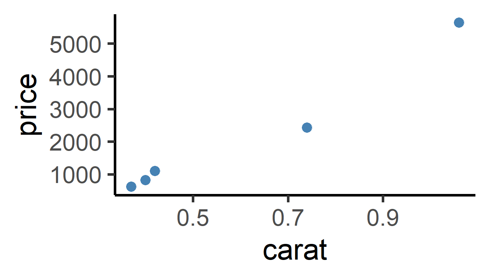
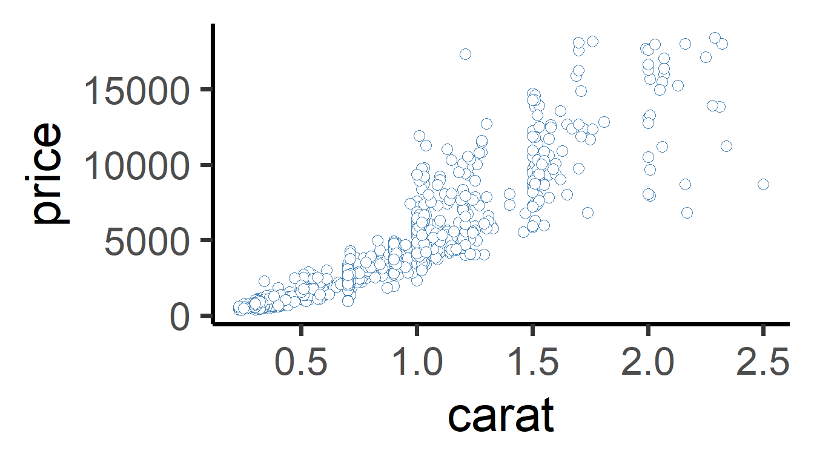
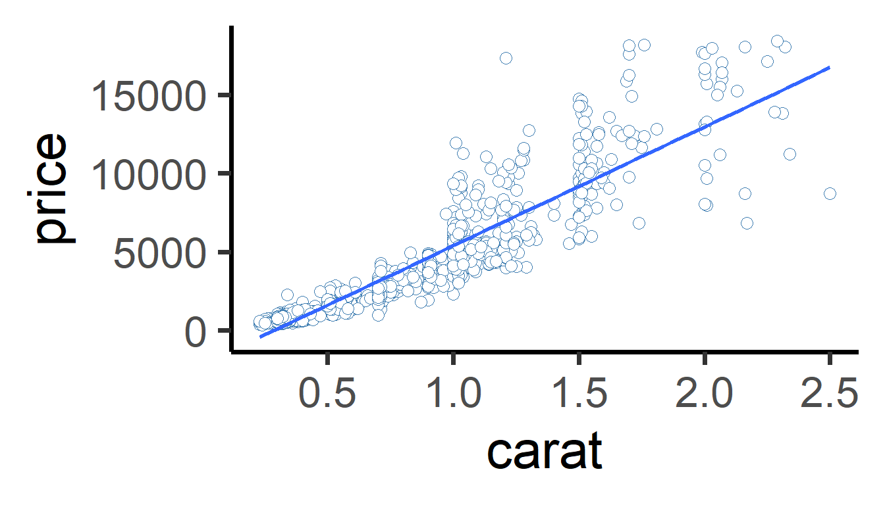
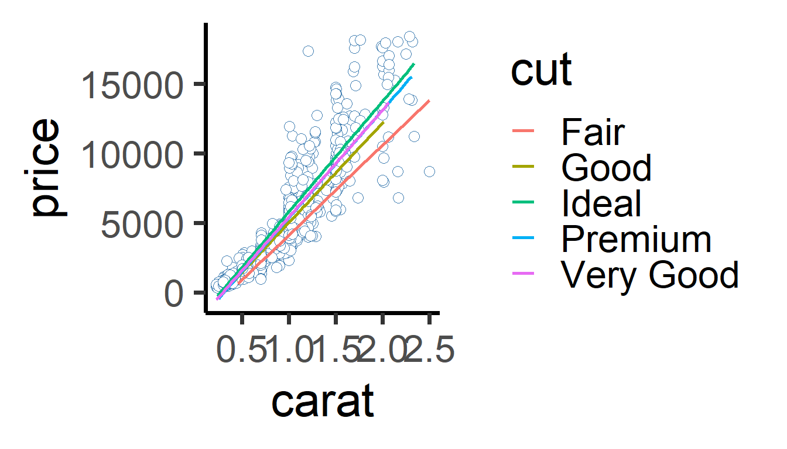
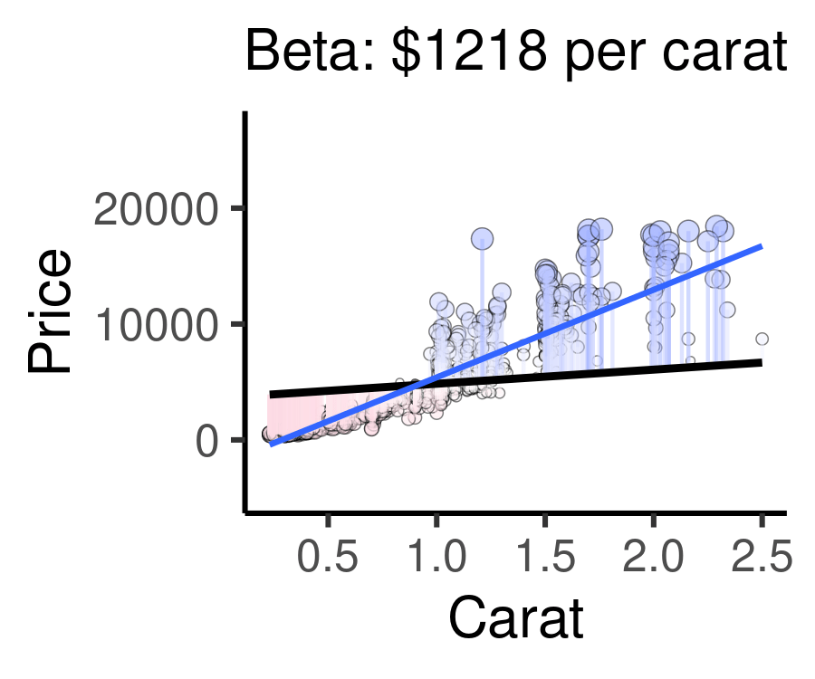

# Workshop: Bivariate Regression: Modeling Diamond Pricing


Social systems are full of numeric variables, like voter turnout, percentage of votes for party X, income, unemployment rates, and rates of policy implementation or people affected. So how do we analyze the association between two numeric variables?

Today, we're going to investigate a popular dataset on commerce. The ```ggplot2``` package's ```diamonds``` dataset contains 53,940 diamond sales gathered from the Loose Diamonds Search Engine in 2017. We're going to examine a random sample of 1000 of these diamonds, saved as ```mydiamonds.csv```. This dataset lets us investigate a popular question for consumers: Are diamonds' size, measured by ```carat```, actually related to their cost, measured by ```price```? Let's investigate using the techniques below.


## Getting Started {.tabset .tabset-fade .tabset-pills .unnumbered}

### Load Data {-}

In this dataset, each row is a diamond!


### View Data {-}


| price| carat|cut       |
|-----:|-----:|:---------|
|  4596|  1.20|Ideal     |
|  1934|  0.62|Ideal     |
|  4840|  1.14|Very Good |

### Codebook {-}

In this dataset, our variables mean:

- ```price```: price of diamond in US dollars (from `$`326 to $18,823!)

- ```carat```: weight of the diamond (0.2 to 5.01 carats)

- ```cut```: quality of the cut (Fair, Good, Very Good, Premium, Ideal)

---

## Review

We have several tools in our toolkit for measuring the association between two variables: (1) Scatterplots, (2) Correlation, and (3) Regression / Line of Best Fit (New!). Let's investigate!

<br>

### Scatterplots

First, we can visualize the relationship between 2 numeric variables using a scatterplot, putting one on the x-axis and one on the y-axis. In a scatterplot, each dot represents a row in our dataset.

So, we can visualize just five randomly selected dots, like this:



Or we can visualize all the dots, like this:




We can see that there's a strong, positive relationship. As carat increases, price increases to! 


<br>


### Correlation  {.tabset .tabset-fade .tabset-pills}

We can measure the relationship between two numeric variables using Pearson's r, the correlation coefficient! This statistic ranges from -1 to 0 to +1. -1 indicates the strongest possible negative relationship, 0 indicates no relationship, and 1 indicates the strongest possible positive relationship. That could help us learn (1) how *strongly* associated are they, and (2) how *positive or negative* is that association. The animation below shows the full range of possible correlations we might get.

### Example

<!-- -->


### Hide

<br>
<br>
<br>
<br>
<br>
<br>

---


### cor.test() and tidy()

We can use `cor.test()` to test **correlation** in R. Let's, for example, get the correlation between price and carat for each different cut of diamond. There are 5 cuts of diamonds, so we should get 5 correlations, using ```group_by(cut)```. `cor.test()` lets us test 3 things:

1. *direction* (positive or negative?)

2. *strength of association* (closer to +/-1 = stronger, closer to 0 = weaker)

3. *statistical sigificance (p-value)*, an indicator of how *extreme* our statistics are - how likely is it we got this statistic due to chance? (Likely due to chance = nearer to 1; not likely due to chance = near 0, eg. p < 0.05.)

To extract `cor.test()`'s output, we can use the ```broom``` package's ```tidy()``` function. This takes the output of the ```cor.test()``` function and puts it in a nice tidy data.frame, which we can then give to ```summarize()```, allowing us to still use ```group_by()```. 

Then, the correlation is reported in the ```estimate``` column, a standardized t-statistic is calculated in the ```statistic``` column, significance is given in the ```p.value``` column, and the upper (97.5%) and lower (2.5%) 95% confidence intervals are reported in ```conf.low``` and ```conf.high```.


|cut       | estimate| statistic| p.value| parameter| conf.low| conf.high|method    |alternative |
|:---------|--------:|---------:|-------:|---------:|--------:|---------:|:---------|:-----------|
|Fair      |    0.854|     10.10|       0|        38|    0.739|     0.739|Pearson's |two.sided   |
|Good      |    0.912|     22.23|       0|       100|    0.872|     0.872|Pearson's |two.sided   |
|Ideal     |    0.919|     45.89|       0|       385|    0.903|     0.903|Pearson's |two.sided   |
|Premium   |    0.927|     37.21|       0|       228|    0.906|     0.906|Pearson's |two.sided   |
|Very Good |    0.924|     37.28|       0|       239|    0.903|     0.903|Pearson's |two.sided   |

For correlation, most people just report the correlation coefficient, and don't go into significance, but it's always an option.


<br>
<br>


##  Regression and the Line of Best Fit

Wouldn't it be nice if we could say, *how much* does the price of a diamond tend to increase when the size of that diamond increases? Economists, consumers, and aspiring fiancees could use that information to determine what size of diamond they can afford. **We learned to do this in physical acceleration models, but can we apply it to large datasets?**

### Model Equation

We do this intuitively all the time, making projections based on data we've seen in the past. What we, and computers, are doing is building a 'model.' We're taking lots of data we've observed and building a simplified version of it, a general trend line. It's not intended to a complete replica - it's just a model! This is the meaning of a regression model.

**Regression models create a straight line that best approximates the shape of our data. The** ***line of best*** **fit is a model of the data.**

The line can be represented as:

$Y_{observed} = Alpha + X_{observed} \times Beta + Error$

<details><summary>**[Click Here to Review Definitions!]**</summary>

Let's break this down.

- $Y_{observed}$: the raw, observed outcome for each observation (```price``` for each diamond).

- $Y_{predicted}$: the predicted outcome for each observation, based on the supplied data (```carat`` for each diamond). 

- $Alpha$: the predicted value of the outcome if all predictors equal zero. Also called the $Intercept$, the point at which the line crosses the y-axis.

- $X_{Observed}$ a vector of observed values of our predictor/explanatory variable. We feed each value into our model to generate a predicted outcome.

- $Beta$: how much our outcome y (```price```) increases by when our predictor/explanatory variable x (```carat```) increases by 1. Also known as the slope of the line.

- $Error$ or $Residuals$: predicted outcome might deviate a little from the observed outcome. This deviation ($Y_{observed} - Y_{predicted}$) is call the $Residual$ for each observation. Colloquially, we call it $Error$.

In other words, plus or minus a few $residuals$, the $Alpha$ ($Intercept$) plus the value of $X$ times the $Beta$ coefficient always gives you the value of $Y$.

</details>

<br>
<br>

### Coding Regression Models {.tabset .tabset-fade .tabset-pills}

### lm()

We can use the ```lm()``` function in R to estimate the model equation for our line of best fit. 


```
## 
## Call:
## lm(formula = price ~ carat, data = .)
## 
## Coefficients:
## (Intercept)        carat  
##       -2161         7559
```

This means...


$$ Price_{predicted} = -2161 + Carats_{observed} \times 7559 $$

<br>
<br>

---

## Learning Check 1 {.unnumbered #LC1}

**Question**

Write out the meaning of the equation above in a sentence, replacing X, Y, ALPHA, and BETA, and UNIT OF Y below with their appropriate values and meanings. Use the format below:

If the value of **X** is zero, the model projects that **Y** equals **ALPHA.** As **X** increases by 1, **Y** is projected to increase by **BETA**, plus or minus a few **UNIT OF Y.**

<details><summary>**[View Answer!]**</summary>

If a diamond weighed 0 carats, the model projects that the price of that diamond would be -2161 USD. But, as the weight of that diamond increases by 1 carat, that diamond's price is projected to increase by 7559 USD, plus or minus a few dollars.

</details>

---

##  Statistical Significance

We can even assess statistical significance for our alpha and beta coefficients. We can use ```tidy()``` from the ```broom``` package.


And if you're not satisfied with that layout, we can write our own function `tidier()` to get even tidier formatting! Copy and run the `tidier()` function, and compare your output to `tidy()` above.


```
## # A tibble: 2 × 8
##   term        estimate    se statistic p_value stars  upper  lower
##   <chr>          <dbl> <dbl>     <dbl>   <dbl> <chr>  <dbl>  <dbl>
## 1 (Intercept)   -2161. -22.4     -22.4       0 ***   -1972. -2351.
## 2 carat          7559.  71.5      71.5       0 ***    7766.  7351.
```

A little cleaner, right? I hope this function can help you out.


|term        |  estimate|      se| statistic| p_value|stars |     upper|     lower|
|:-----------|---------:|-------:|---------:|-------:|:-----|---------:|---------:|
|(Intercept) | -2161.429| -22.401|   -22.401|       0|***   | -1972.090| -2350.768|
|carat       |  7558.676|  71.527|    71.527|       0|***   |  7766.047|  7351.305|

The table above outputs several columns of importance to us!

<details><summary>**Click Here to See Definitions**</summary>

- ```term```: the name of the intercept as well as the predictor whose be

- ```estimate```: the value of the alpha coefficient (-2161) and beta coefficient (7559).

- ```statistic```: a standardized 't-statistic' measuring how extreme each estimate is, based on sample size and variance in our data.

- ```se```: standard error for each beta coefficient, describing the standard deviation of that statistic's sampling distribution.

- ```p_value```: the probability that our alpha or beta coefficients were that large just due to chance (eg. random sampling error). Our measure of statistical significance. When 4 or more decimal places, sometimes gets abbreviated to just '0' in R.

- ```stars```: shorthand for significance. p < 0.001 = `***`; p < 0.01 = `**`; p < 0.05 = `*`; p < 0.10 = `.`.

- ```lower```: the lower bound for the range we're 95% sure the true estimate lies in.

- ```upper```: the upper bound for the range we're 95% sure the true estimate lies in.

</details>

<br>
<br>
<br>

---

## Learning Check 2 {.unnumbered #LC2}

**Question**

Write out the meaning of the equation above in a sentence, replacing X, Y, ALPHA, and BETA, UNIT OF Y, and UNIT OF OBSERVATION below with their appropriate values and meanings. Use the format below:

-  There is a less than **[0.001, 0.01, 0.05, or 0.10]** probability that our alpha coefficient of **ALPHA** occurred due to chance. We are 95% certain that the true **Y** for a **UNIT OF OBSERVATION** that weighs 0 **UNIT OF X** lies between **LOWER CONFIDENCE INTERVAL** and **UPPER CONFIDENCE INTERVAL** **UNIT OF Y**.

-  There is a less than **[0.001, 0.01, 0.05, or 0.10]** probability that our beta coefficient of **BETA** occurred due to chance. We are 95% certain that as **X** increases by 1, the true **Y** for a **UNIT OF OBSERVATION** increases by between **LOWER CONFIDENCE INTERVAL** and **UPPER CONFIDENCE INTERVAL** **UNIT OF Y**.

<br>
<br>
<br>

<details><summary>**[View Answer!]**</summary>

There is a less than  probability that our alpha coefficient of  USD per carat occurred due to chance. We are 95% certain that the true price for a diamond that weighs 0 carats lies between  and  dollars. 

There is a less than 0.001 probability that our beta coefficient of 7559 USD per carat occurred due to chance. We are 95% certain that as the weight of our diamond increases by 1 carat, the true price for a diamond increases by between 7351 and 7766 dollars.

**Notice that the value of the intercept might be nonsensical sometimes, like a negative price.**

</details>

---

<br>
<br>
<br>

##  Visualization

Finally, visualizing the line of best fit is quite easy! We make a scatterplot in using the ```ggplot2``` package's ```ggplot()``` function. Then, we add ```geom_smooth(method = "lm")```. This uses the ```lm()``` function internally to make a line of best fit between our ```x``` and ```y``` variables in the ```aes()``` section of our plot.





<br>
<br>
<br>
<br>

---

## Learning Check 3 {.unnumbered #LC3}

**Question**

Add `color = cut` to the `aes()` in the plot above. What happens? What does this tell us about the relationship between price and carats for each cut of diamond?

<details><summary>**[View Answer!]**</summary>

`ggplot` generates 5 different lines of best fit, one for each level of `cut`. The slope of the line differs for each cut. As carats increase, price increases at a faster rate for `"Ideal"` cut diamonds than for `"Fair"` cut diamonds.




</details>
  
---

<br>
<br>
<br>
<br>

##  Finding the Line of Best Fit  {.tabset .tabset-fade .tabset-pills}

We know that `lm()` finds the line of best fit, but ***how exactly*** does it do it? It all has to do with *predicted values*, *residuals*, and *R-squared.* 

<br>
<br>

### Predicted Values 

All models have a lot of information stored inside them, which you can access using the $ sign. (Note: ```select()``` can’t extract them, because model objects are not data.frames)


| price| carat|
|-----:|-----:|
|  4596|  1.20|
|  1934|  0.62|
|  4840|  1.14|

This code gives you the the predicted values for your outcome, dubbed `price_hat` ($Y_{Predicted}$), and your `residuals` ($Y_{Observed} − Y_{Predicted}$), given each row of data.


```
## # A tibble: 3 × 4
##   price carat price_hat residual
##   <dbl> <dbl>     <dbl>    <dbl>
## 1  4596  1.2      6909.   -2313.
## 2  1934  0.62     2525.    -591.
## 3  4840  1.14     6455.   -1615.
```

<br>
<br>

### Residuals

**Residuals** represent the *difference between the observed outcome and the outcome predicted by the model.* A regression model finds the line which ***minimizes*** these residuals, thus getting the best “model” for the overall trend in the data.

The animation below below visualizes residuals as lines stemming from the best fit line. The alpha and beta coefficients are varied to show changing residuals for each of these different lines, compared to the blue line, which is the actual line of best fit.

- Cases well predicted by the model are tiny, and close to the best fit line.

- Cases poorly predicted by the model are BIG, and far from the best fit line.

<!-- -->


<details><summary>**Extra: code this as a static visual! (optional)**</summary>


</details>


### R-squared

R-squared ($R^{2}$) is a simple statistic that ranges from 0 - 1. R2 measures the *percentage of variation in the outcome that is explained by the model.*

<details><summary>**Benchmarks for** $R^{2}$</summary>

- $R^{2}$ = 1.00 -> perfect fit. All variation perfectly explained.

- $R^{2}$ = 0.85 -> pretty great fit; 85% of variation in outcome explained!

- $R^{2}$ = 0.5 -> pretty good; 50% explained!

- $R^{2}$ = 0.2 -> not good, but 20% explained is better than nothing!

- $R^{2}$ = 0 -> nothing. Just nothing.

</details>

<details><summary>**Calculating** $R^{2}$</summary>

We calculate $R^{2}$ using this formula:

$R^{2}$ = 1 - (Residual Sum of Squares / Total Sum of Squares)

- **Total Sum of Squares (TSS)**: the sum of the squared differences between observed outcomes and their overall mean outcome. A single number describing how much the outcome varies.
```sum( (y - mean(y))^2 )```

- **Residual Sum of Squares (RSS)**: describes on average the difference between observed outcomes and predicted outcomes. A single number describing how much the model errs from the real data.
```sum( (y - ypredicted)^2 )```

We can combine these to understand our model:

- **RSS / TSS**: percentage of variation that ***remains unexplained*** by the model.

- **1 - (RSS / TSS)**: percentage of variation that ***was explained*** by the model.

- $R^{2}$: percentage of variation in the outcome that was explained by the model.

We can manually code this in R2!


|         tss|        rss|        R2|
|-----------:|----------:|---------:|
| 14222520095| 2321500034| 0.8367729|

</details>

For example, the following animation shows how each of the possible lines plotted above produces a different residual sum of squares, leading to a different $R^{2}$. The sweet spot, where $R^{2}$ is highest (and therefore the residuals are minimized) is when the slope is closest to our actual observed beta value, $7559 per carat. Otherwise, both higher and lower slopes lead to a lower $R^{2}$.

<!-- -->


---

## Learning Check 4 {.unnumbered #LC4}

**Question**

How much of the variation in the outcome did the model explain? What statistic tells us this information? Does this mean our model fits well or poorly?

<br>
<br>

<details><summary>**[View Answer!]**</summary>

This model explained 84% of the variation in the outcome. The $R^{2}$ statistic tells us this information. A higher $R^{2}$ statistic means better model fit, and 0.84 is quite close to 1.00, the max possible model fit.

</details>
  
---

<br>
<br>

##  F-statistic

Finally, we also want to measure *how useful* this model is, compared to the intercept. 

### Interpreting an F-statistic

Models are imperfect approximations of trends in data. The simplest possible model of data is the intercept line, the amount of the outcome you would have if X were zero. (Imagine a flat line through your data at the intercept.) If we have a good model, it had better explain more variation than the amount explained by the intercept line, right? To do this, we can calculate an **F-statistic** for our model.

- F statistics (just like Chi-squared) range from 0 to infinity.

- If your F statistic is small, the model ain’t much better than the intercept.

- If your F statistic is large, the model explains much, much more variation than the intercept.

- We can compare your F statistic to a null distribution of scores we'd get due to chance, and find the probability we got this statistic due to chance, our p-value. The ```broom``` package's ```glance()``` function lets us do this below, giving us a ```statistic``` and ```p.value```.


| r.squared| adj.r.squared|    sigma| statistic| p.value| df|    logLik|     AIC|      BIC|   deviance| df.residual| nobs|
|---------:|-------------:|--------:|---------:|-------:|--:|---------:|-------:|--------:|----------:|-----------:|----:|
| 0.8367729|     0.8366094| 1525.173|  5116.183|       0|  1| -8747.801| 17501.6| 17516.32| 2321500034|         998| 1000|


<br>
<br>

### How to calculate F statisic manually! (optional)**</summary>

The F statistic requires five main ingredients:

- The residual sum of squares (variation NOT explained by the model)

- The total sum of squares (all variation IN the data)

- The explained sum of squares (variation EXPLAINED by the model), which is the difference between the total and residual sum of squares.

- The sample size (number of diamonds analyzed)

- Number of variables in the model (outcome + predictor = 2)


```
## Rows: 1
## Columns: 5
## $ residual_sum_of_squares  <dbl> 2321500034
## $ total_sum_of_squares     <dbl> 14222520095
## $ n                        <int> 1000
## $ p                        <int> 2
## $ explained_sum_of_squares <dbl> 11901020061
```

What do we do with our ingredients to make the F-statistic then? We need to calculate on average, how much variation ***was*** explained, relative to the number of predictors, compared to on average, how much error was ***not*** explained, relative to the number of cases analyzed and variables used.


```
## Rows: 1
## Columns: 9
## $ residual_sum_of_squares        <dbl> 2321500034
## $ total_sum_of_squares           <dbl> 14222520095
## $ n                              <int> 1000
## $ p                              <int> 2
## $ explained_sum_of_squares       <dbl> 11901020061
## $ mean_squares_due_to_regression <dbl> 11901020061
## $ mean_squared_error             <dbl> 2326152
## $ f_statistic                    <dbl> 5116.183
## $ p_value                        <dbl> 0
```

And there you have it! That's how you calculate an F-statistic and its p-value manually. As you can see, it's a lot faster to just use the ```broom``` package's ```glance()``` function.


<br>
<br>

##  `summary()`

We learned in this workshop that every regression model generates several statistics: (1) intercept (alpha coefficient), (2) beta coefficient(s), (3) $R^{2}$, and (4) F-statistic.

### Get all stats, all at once with `summary()`

Wouldn’t it be handy if there were a convenient function that let us see all of this in one place? Try the ```summary()``` function. It can be overwhelming - it outputs lots of information. However, we only need to look in 4 places for key information.


```
## 
## Call:
## lm(formula = price ~ carat, data = .)
## 
## Residuals:
##     Min      1Q  Median      3Q     Max 
## -8024.3  -760.3   -11.9   527.1 10368.4 
## 
## Coefficients:
##             Estimate Std. Error t value Pr(>|t|)    
## (Intercept) -2161.43      96.49  -22.40   <2e-16 ***
## carat        7558.68     105.68   71.53   <2e-16 ***
## ---
## Signif. codes:  0 '***' 0.001 '**' 0.01 '*' 0.05 '.' 0.1 ' ' 1
## 
## Residual standard error: 1525 on 998 degrees of freedom
## Multiple R-squared:  0.8368,	Adjusted R-squared:  0.8366 
## F-statistic:  5116 on 1 and 998 DF,  p-value: < 2.2e-16
```

<br>
<br>

### **4 Key Statistics**

So what can you find in the `summary()` output?

- **coefficients**: Under Coefficients, we can see the intercept and predictor(s) in our model. Each row shows the name of a term in our model (eg. carat) and an Estimate. This is the Beta Coefficient, or in the case of the Intercept, the Alpha Coefficient. 

- **p-value**: Then, at the end of each row is something called “Pr(>|t|)”. This is the weirdest way I’ve ever seen it written, but in simple terms: it’s the p-value for the Alpha or Beta coefficient. Nothing else in the table matters much.

- **R2**: Below the coefficient table are the model information. You’ll notice R-squared: ~0.84. This is where you can find R2 calculated for you. 

- **F-statistic**: Beneath that is the F-statistic, 5116. At the end of the row is the p-value of the F-statistic, the more readable statistic.


<br>

---

## Learning Check 5 {.unnumbered #LC5}

**Question**

Using the ```filter()``` and ```lm()``` functions, test the effect of ```carat``` on diamond ```price```, first looking at just ```"Ideal"``` diamonds. Use the ```summary()``` function, and report alpha, beta, R2, the F-statistic, and its p-value for this model.

<br>
<br>

<details><summary>**[View Answer!]**</summary>


```
## 
## Call:
## lm(formula = price ~ carat, data = .)
## 
## Residuals:
##     Min      1Q  Median      3Q     Max 
## -6325.2  -728.3   -12.4   480.1  9892.0 
## 
## Coefficients:
##             Estimate Std. Error t value Pr(>|t|)    
## (Intercept)  -2184.9      141.3  -15.47   <2e-16 ***
## carat         7971.8      173.7   45.89   <2e-16 ***
## ---
## Signif. codes:  0 '***' 0.001 '**' 0.01 '*' 0.05 '.' 0.1 ' ' 1
## 
## Residual standard error: 1458 on 385 degrees of freedom
## Multiple R-squared:  0.8454,	Adjusted R-squared:  0.845 
## F-statistic:  2106 on 1 and 385 DF,  p-value: < 2.2e-16
```

- For ideal diamonds, the model projected that a diamond weighing 0 carats would cost -2185 USD, increasing by 7972 for every additional carat. Both coefficients were statistically significant at the p < 0.001 level. 

- The model explained 85% of the variation in ideal-cut diamond prices, and fit much better than the intercept, shown by our statistically significant f-statistic (F = 2106, p < 0.001).

</details>
  
---

<br>
<br>
<br>
<br>


