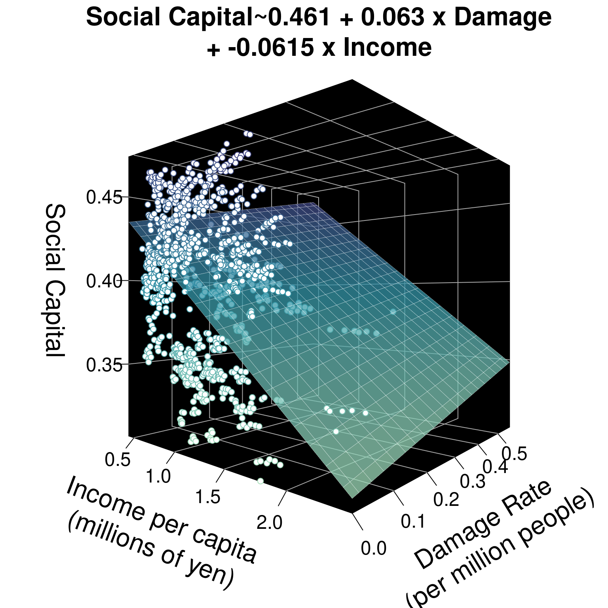

# Workshop: Multivariate Regression: Modeling Effects of Disaster on Social Capital




Why do some communities see stronger **social capital** than others? **Social capital** refers to the social ties that bind results, enabling trust and collective action among residents to tackle public issues. [Recent studies suggest](https://doi.org/10.1016/j.ijdrr.2018.11.009) that after disasters, residents' social capital actually increases, because people recognize the value of friends and family as they work to recover and rebuild. We can use regression analysis to test this hypothesis on new data!

This workshop examines 151 Japanese municipalities over 7 years, from 2011 to 2017 (```jp_matching_experiment.csv```), totaling 1057 city-year observations. This includes 85 coastal municipalities hit by the 2011 tsunami and 66 municipalities as similar as possible, just next door, that were not hit. Let's load in our data and get started.

<br>

##  Getting Started {-}

### Load Data & Packages {-}

In this dataset, each row is a city-year!


```r
# Load Packages
library(tidyverse) # for data manipulation
library(broom) # for each model summaries
library(texreg) # for nice model tables

# Load Data
cities <- read_csv("workshops/jp_matching_experiment.csv") %>%
  # Tell R to treat year and pref as ordered categories
  mutate(year = factor(year),
         pref = factor(pref))
```

### View Data {-}


```r
# View first 3 rows of dataset
cities %>% head(3)
```


|muni_code |muni      |pref   |year |by_tsunami | social_capital| damage_rate| pop_density| exp_dis_relief_per_capita| income_per_capita| unemployment| pop_women| pop_over_age_65|
|:---------|:---------|:------|:----|:----------|--------------:|-----------:|-----------:|-------------------------:|-----------------:|------------:|---------:|---------------:|
|02201     |Aomori    |Aomori |2011 |Hit        |          0.393|       0.000|      1119.2|                      0.01|              1.11|          5.9|      53.6|            27.9|
|02202     |Hirosaki  |Aomori |2011 |Not Hit    |          0.413|       0.000|       602.1|                      0.06|              0.99|          4.5|      54.1|            29.2|
|02203     |Hachinohe |Aomori |2011 |Hit        |          0.408|       0.001|      1137.5|                      2.44|              1.13|          5.5|      52.2|            27.5|

### Codebook {-}

In this dataset, our variables mean:


- ```muni_code``` unique 5 digit idenfier for each municipality.

- ```muni```: municipality where election took place

- ```pref```: prefecture that municipality is in

- ```year```: year of observation.

- ```by_tsunami```: was that city struck by the tsunami ("Hit"), not hit but just next door ("Not Hit"), or some other municipality ("Other")?

**Outcome Variable**

- ```social_capital```: index measuring overall social capital, the social ties between residents that build trust, using several dimensions. Measured on a scale from 0 (low) to 1 (high).

**Explanatory Variable**

- ```damage_rate```: rate of buildings damaged or destroyed by earthquake and tsunami, per million residents.

**Control Variables**

- ```exp_dis_relief_per_capita```: spending on disaster relief in 1000s of yen per capita.

- ```income_per_capita```: income per capita in millions of yen per capita.

- ```unemployment```: unemployment rate per 1,000 residents.

- ```pop_women```: % residents who are women

- ```pop_over_age_65```: % residents over age 65

- ```pop_density```: population in 1000s of residents per square kilometer


<br>
<br>

##  Multiple Regression

### Beta coefficients

We can use a regression model to test the association between our **outcome variable** ```social_capital``` and our **explanatory variable** ```by_tsunami```. Using the ```lm()``` function, we can get a **beta** coefficient estimating how much higher a social capital index score they received for every additional building damaged per million residents.


```r
cities %>%
  lm(formula = social_capital ~ damage_rate)
```

```
## 
## Call:
## lm(formula = social_capital ~ damage_rate, data = .)
## 
## Coefficients:
## (Intercept)  damage_rate  
##     0.39419      0.07485
```

<br>
<br>

### Controls

But... many other things might affect social capital in a community, not just getting hit by the tsunami: For example, (1) population density, (2) wealth, (3) unemployment, (4) age, (5) government capacity, (6) disaster relief, (7) time, and even (8) regional differences. We need to add **control variables** to our model to **control** for these alternative explanations for variation in social capital. This will **refine** our beta coefficient for the effect of the tsunami, getting us closer to the truth.

We can add extra control variables using ```+``` in the ```lm()``` function. For example, we test the effect of ```damage_rate``` below, controlling for ```income_per_capita```.


```r
cities %>%
  lm(formula = social_capital ~ damage_rate + income_per_capita)
```

```
## 
## Call:
## lm(formula = social_capital ~ damage_rate + income_per_capita, 
##     data = .)
## 
## Coefficients:
##       (Intercept)        damage_rate  income_per_capita  
##           0.46141            0.06303           -0.06148
```


Our model tells us that for every building damaged per million residents, the social capital index increased by 0.06. For every additional million yen per capita in income, the average city's social capital index increased by -0.06.


<br>
<br>

### Planes

Instead of a line of best fit, for 2 variables, this regression model now essentially predicts a plane of best fit for 3 variables. See below. And, given 4 or more variables, a regression model will predict a hyperplane of best fit. Not easy to visualize, but just think: 4 variables means 4 dimensions. 5 variables means 5 dimensions. 


<br>
<br>
<br>
<br>


---

## Learning Check 1 {.unnumbered .LC}

**Question**


<text style="color:#9F2042">Make a regression model testing the effect of a city's ```damage_rate``` on ```social_capital```, controlling for ```pop_density```. What's the effect of ```damage_rate``` on ```social_capital```?

<br>
<br>

<details><summary>**[View Answer!]**</summary>


```r
cities %>%
  lm(formula = social_capital ~ damage_rate + pop_density)
```

```
## 
## Call:
## lm(formula = social_capital ~ damage_rate + pop_density, data = .)
## 
## Coefficients:
## (Intercept)  damage_rate  pop_density  
##   4.029e-01    6.812e-02   -9.173e-06
```


Controlling for population density, as damage rates increase by 1 building per million residents, the social capital index increases by 0.068 points.

</details>

---

<br>
<br>
<br>


##  Effect Sizes

One big challenge with multiple regression is that it's not really clear how to compare the size of our beta coefficients. Is 1 damaged building per million residents greater than or less than 1 square kilometer per 1000 residents, or 1 million yen per capita? To compare the size of our beta coefficients, our variables must have the same *units.* We can do this by turning our numeric variables into Z-scores.

Remember that a Z-score is a measure of *how many standard deviations from the mean a specific value is for a given variable.* We can ```mutate()``` variables into Z-scores using the ```scale()``` function.


```r
rescaled <- cities %>%
  # For each numeric variable, rescale its values
  mutate(social_capital = scale(social_capital),
         damage_rate = scale(damage_rate),
         pop_density = scale(pop_density),
         exp_dis_relief_per_capita = scale(exp_dis_relief_per_capita),
         income_per_capita = scale(income_per_capita),
         unemployment = scale(unemployment),
         pop_women = scale(pop_women),
         pop_over_age_65 = scale(pop_over_age_65))
```

Check out our new rescaled variables.


```r
rescaled %>% head(3)
```


|muni_code |muni      |pref   |year |by_tsunami | social_capital| damage_rate| pop_density| exp_dis_relief_per_capita| income_per_capita| unemployment| pop_women| pop_over_age_65|
|:---------|:---------|:------|:----|:----------|--------------:|-----------:|-----------:|-------------------------:|-----------------:|------------:|---------:|---------------:|
|02201     |Aomori    |Aomori |2011 |Hit        |     -0.1296000|  -0.6351305|   0.1290887|                -0.3617464|        0.09763001|    1.0562282| 1.2937535|      -0.6429615|
|02202     |Hirosaki  |Aomori |2011 |Not Hit    |      0.3907693|  -0.6351305|  -0.1932630|                -0.3611821|       -0.34526666|   -0.1842532| 1.5495231|      -0.4271015|
|02203     |Hachinohe |Aomori |2011 |Hit        |      0.2606770|  -0.6225776|   0.1404966|                -0.3343254|        0.17144612|    0.7018050| 0.5775988|      -0.7093800|

Okay, let's repeat our model, this time using our new data.frame ```rescaled```, and save the model as ```m0```.


```r
m0 <- rescaled %>%
  lm(formula = social_capital ~ damage_rate + pop_density)
# View model
m0
```

```
## 
## Call:
## lm(formula = social_capital ~ damage_rate + pop_density, data = .)
## 
## Coefficients:
## (Intercept)  damage_rate  pop_density  
##  -3.667e-16    1.412e-01   -3.829e-01
```


We can now interpret our results as: As the damage rate increases by 1 standard deviation (*new unit of predictor*), the social capital index increases by **0.14 standard deviations** (*new unit of outcome*), controlling for population density.

<br>
<br>

---

## Learning Check 2 {.unnumbered .LC}

**Question**

<text style="color:#9F2042">Make a second regression model called ```m1```, that *also* controls for the effect of ```year```. Because we made it a ```factor()```, we control for each year. The ```beta``` coefficient tells us now *how many more standard deviations of social capital* we got in year X compared to the first year (2011), our baseline for comparison. The ```alpha``` coefficient tells us how many standard deviations we got during the our baseline year. Which year had the largest effect on social capital, and how much was that effect?

<details><summary>**[View Answer!]**</summary>


```r
m1 <- cities %>%
  lm(formula = social_capital ~ damage_rate + pop_density + year)
# View model
m1
```

```
## 
## Call:
## lm(formula = social_capital ~ damage_rate + pop_density + year, 
##     data = .)
## 
## Coefficients:
## (Intercept)  damage_rate  pop_density     year2012     year2013     year2014  
##   3.989e-01    6.812e-02   -9.173e-06    4.987e-03    2.238e-03    3.172e-03  
##    year2015     year2016     year2017  
##   5.391e-03    5.868e-03    6.351e-03
```


2017 had the largest effect on social capital, compared to 2011. In 2011, the average city saw 0.3989 standard deviations above the mean of social capital. In 2017, the average city saw 0.0064 standard deviation more social capital than in 2011 (totaling 0.4053 standard deviation above the mean).

Notice that we didn't rescale categorical variables. In regression, categorical variables can't be rescaled or compared to numeric variables.

</details>

---

<br>
<br>
<br>
<br>

## Multiple Models

To find the best model, it helps to make several, in a logical, systematic way. 

- Choose your explanatory variable whose effect you really want to test. For us, that's disaster damage (```damage_rate```). Add choose your absolutely most essential control variables, without which the model isn't very valid. For us, that's ```pop_density``` and ```year```.  (Already done and saved as ```m1```!)


```r
# For your reference
m1 <- rescaled %>%
  lm(formula = social_capital ~ damage_rate + pop_density + year)
```

- Add more controls, to wean out effects of other phenomena and get a more accurate beta coefficient for ```damage_rate```. Let's add ```exp_dis_relief_per_capita```, to control for city government spending on disaster relief. Save that as ```m2```.


```r
m2 <- rescaled %>%
  lm(formula = social_capital ~ damage_rate + pop_density + year +
       exp_dis_relief_per_capita)
```

- Examine our two tables, using the ```texreg``` package's ```htmlreg()``` function. We're going to ```list()``` our models ```m1``` and ```m2```, and ask R to save a nice table in our files as ```"table_1.html"```. Try it out, then go to your files in the right-hand corner and click `'View in Web Browser'`! 


```r
htmlreg(list(m1,m2), 
        bold = 0.05, include.fstat = TRUE, 
        file = "workshops/workshop_11_table_1.html")
```


<details><summary>**[Click to view table!]**</summary>


```{=html}
<table class="texreg" style="margin: 10px auto;border-collapse: collapse;border-spacing: 0px;caption-side: bottom;color: #000000;border-top: 2px solid #000000;">
<caption>Statistical models</caption>
<thead>
<tr>
<th style="padding-left: 5px;padding-right: 5px;">&nbsp;</th>
<th style="padding-left: 5px;padding-right: 5px;">Model 1</th>
<th style="padding-left: 5px;padding-right: 5px;">Model 2</th>
</tr>
</thead>
<tbody>
<tr style="border-top: 1px solid #000000;">
<td style="padding-left: 5px;padding-right: 5px;">(Intercept)</td>
<td style="padding-left: 5px;padding-right: 5px;">-0.10</td>
<td style="padding-left: 5px;padding-right: 5px;">-0.09</td>
</tr>
<tr>
<td style="padding-left: 5px;padding-right: 5px;">&nbsp;</td>
<td style="padding-left: 5px;padding-right: 5px;">(0.07)</td>
<td style="padding-left: 5px;padding-right: 5px;">(0.07)</td>
</tr>
<tr>
<td style="padding-left: 5px;padding-right: 5px;">damage_rate</td>
<td style="padding-left: 5px;padding-right: 5px;"><b>0.14</b><sup>***</sup></td>
<td style="padding-left: 5px;padding-right: 5px;">0.02</td>
</tr>
<tr>
<td style="padding-left: 5px;padding-right: 5px;">&nbsp;</td>
<td style="padding-left: 5px;padding-right: 5px;">(0.03)</td>
<td style="padding-left: 5px;padding-right: 5px;">(0.03)</td>
</tr>
<tr>
<td style="padding-left: 5px;padding-right: 5px;">pop_density</td>
<td style="padding-left: 5px;padding-right: 5px;"><b>-0.38</b><sup>***</sup></td>
<td style="padding-left: 5px;padding-right: 5px;"><b>-0.37</b><sup>***</sup></td>
</tr>
<tr>
<td style="padding-left: 5px;padding-right: 5px;">&nbsp;</td>
<td style="padding-left: 5px;padding-right: 5px;">(0.03)</td>
<td style="padding-left: 5px;padding-right: 5px;">(0.03)</td>
</tr>
<tr>
<td style="padding-left: 5px;padding-right: 5px;">year2012</td>
<td style="padding-left: 5px;padding-right: 5px;">0.13</td>
<td style="padding-left: 5px;padding-right: 5px;">0.08</td>
</tr>
<tr>
<td style="padding-left: 5px;padding-right: 5px;">&nbsp;</td>
<td style="padding-left: 5px;padding-right: 5px;">(0.11)</td>
<td style="padding-left: 5px;padding-right: 5px;">(0.10)</td>
</tr>
<tr>
<td style="padding-left: 5px;padding-right: 5px;">year2013</td>
<td style="padding-left: 5px;padding-right: 5px;">0.06</td>
<td style="padding-left: 5px;padding-right: 5px;">0.02</td>
</tr>
<tr>
<td style="padding-left: 5px;padding-right: 5px;">&nbsp;</td>
<td style="padding-left: 5px;padding-right: 5px;">(0.11)</td>
<td style="padding-left: 5px;padding-right: 5px;">(0.10)</td>
</tr>
<tr>
<td style="padding-left: 5px;padding-right: 5px;">year2014</td>
<td style="padding-left: 5px;padding-right: 5px;">0.08</td>
<td style="padding-left: 5px;padding-right: 5px;">0.09</td>
</tr>
<tr>
<td style="padding-left: 5px;padding-right: 5px;">&nbsp;</td>
<td style="padding-left: 5px;padding-right: 5px;">(0.11)</td>
<td style="padding-left: 5px;padding-right: 5px;">(0.10)</td>
</tr>
<tr>
<td style="padding-left: 5px;padding-right: 5px;">year2015</td>
<td style="padding-left: 5px;padding-right: 5px;">0.14</td>
<td style="padding-left: 5px;padding-right: 5px;">0.15</td>
</tr>
<tr>
<td style="padding-left: 5px;padding-right: 5px;">&nbsp;</td>
<td style="padding-left: 5px;padding-right: 5px;">(0.11)</td>
<td style="padding-left: 5px;padding-right: 5px;">(0.10)</td>
</tr>
<tr>
<td style="padding-left: 5px;padding-right: 5px;">year2016</td>
<td style="padding-left: 5px;padding-right: 5px;">0.15</td>
<td style="padding-left: 5px;padding-right: 5px;">0.15</td>
</tr>
<tr>
<td style="padding-left: 5px;padding-right: 5px;">&nbsp;</td>
<td style="padding-left: 5px;padding-right: 5px;">(0.11)</td>
<td style="padding-left: 5px;padding-right: 5px;">(0.10)</td>
</tr>
<tr>
<td style="padding-left: 5px;padding-right: 5px;">year2017</td>
<td style="padding-left: 5px;padding-right: 5px;">0.17</td>
<td style="padding-left: 5px;padding-right: 5px;">0.16</td>
</tr>
<tr>
<td style="padding-left: 5px;padding-right: 5px;">&nbsp;</td>
<td style="padding-left: 5px;padding-right: 5px;">(0.11)</td>
<td style="padding-left: 5px;padding-right: 5px;">(0.10)</td>
</tr>
<tr>
<td style="padding-left: 5px;padding-right: 5px;">exp_dis_relief_per_capita</td>
<td style="padding-left: 5px;padding-right: 5px;">&nbsp;</td>
<td style="padding-left: 5px;padding-right: 5px;"><b>0.22</b><sup>***</sup></td>
</tr>
<tr>
<td style="padding-left: 5px;padding-right: 5px;">&nbsp;</td>
<td style="padding-left: 5px;padding-right: 5px;">&nbsp;</td>
<td style="padding-left: 5px;padding-right: 5px;">(0.03)</td>
</tr>
<tr style="border-top: 1px solid #000000;">
<td style="padding-left: 5px;padding-right: 5px;">R<sup>2</sup></td>
<td style="padding-left: 5px;padding-right: 5px;">0.17</td>
<td style="padding-left: 5px;padding-right: 5px;">0.21</td>
</tr>
<tr>
<td style="padding-left: 5px;padding-right: 5px;">Adj. R<sup>2</sup></td>
<td style="padding-left: 5px;padding-right: 5px;">0.17</td>
<td style="padding-left: 5px;padding-right: 5px;">0.20</td>
</tr>
<tr>
<td style="padding-left: 5px;padding-right: 5px;">Num. obs.</td>
<td style="padding-left: 5px;padding-right: 5px;">1057</td>
<td style="padding-left: 5px;padding-right: 5px;">1057</td>
</tr>
<tr style="border-bottom: 2px solid #000000;">
<td style="padding-left: 5px;padding-right: 5px;">F statistic</td>
<td style="padding-left: 5px;padding-right: 5px;">27.50</td>
<td style="padding-left: 5px;padding-right: 5px;">30.63</td>
</tr>
</tbody>
<tfoot>
<tr>
<td style="font-size: 0.8em;" colspan="3"><sup>***</sup>p &lt; 0.001; <sup>**</sup>p &lt; 0.01; <sup>*</sup>p &lt; 0.05</td>
</tr>
</tfoot>
</table>
```

</details>

Pretty nice, right? The ```bold = 0.05``` says, if your p-value is below p < 0.05, make the estimate bold in the chart, so it's easy to see. ```include.fstat = TRUE``` means, please include the F-statistic at the bottom of the chart.

<br>
<br>

---

## Learning Check 3 {.unnumbered .LC}

**Question**

<text style="color:#9F2042">Make another model called ```m3```, adding as controls ```income_per_capita```,  ```unemployment```,  ```pop_women```, and ```pop_over_age_65```. Then make a model called ```m4```, which adds ```pref```, the prefecture each city is in (like their state). Finally, put them together in a ```htmlreg()``` table that visualizes ```m1```, ```m2```, ```m3```, and ```m4``` side by side, called ```"table_2.html"```. Look at the R-squared statistic at the bottom. Which model fits best?

<br>
<br>

<details><summary>**[View Answer!]**</summary>

Adding controls ```income_per_capita```,  ```unemployment```,  ```pop_women```, and ```pop_over_age_65```...


```r
m3 <- rescaled %>%
  lm(formula = social_capital ~ damage_rate + pop_density + year +
       exp_dis_relief_per_capita +
       income_per_capita + unemployment +  pop_women + pop_over_age_65)
```

Adding prefectural controls...


```r
m4 <- rescaled %>%
  lm(formula = social_capital ~ damage_rate + year + pop_density + 
       exp_dis_relief_per_capita +
       income_per_capita + unemployment + pop_women + pop_over_age_65 +
       pref)
```

Making a nice table!


```r
htmlreg(list(m1,m2,m3,m4), 
        bold = 0.05, include.fstat = TRUE, 
        file = "workshops/workshop_11_table_2.html")
```

Model 4 fits best, with an R<sup>2</sup> of 0.89. It explains 89% of the variation in social capital! That's wild! 

</details>

<details><summary>**[Click to view Table from Answer!]**</summary>


```{=html}
<table class="texreg" style="margin: 10px auto;border-collapse: collapse;border-spacing: 0px;caption-side: bottom;color: #000000;border-top: 2px solid #000000;">
<caption>Statistical models</caption>
<thead>
<tr>
<th style="padding-left: 5px;padding-right: 5px;">&nbsp;</th>
<th style="padding-left: 5px;padding-right: 5px;">Model 1</th>
<th style="padding-left: 5px;padding-right: 5px;">Model 2</th>
<th style="padding-left: 5px;padding-right: 5px;">Model 3</th>
<th style="padding-left: 5px;padding-right: 5px;">Model 4</th>
</tr>
</thead>
<tbody>
<tr style="border-top: 1px solid #000000;">
<td style="padding-left: 5px;padding-right: 5px;">(Intercept)</td>
<td style="padding-left: 5px;padding-right: 5px;">-0.10</td>
<td style="padding-left: 5px;padding-right: 5px;">-0.09</td>
<td style="padding-left: 5px;padding-right: 5px;"><b>-0.18</b><sup>&#42;&#42;</sup></td>
<td style="padding-left: 5px;padding-right: 5px;"><b>1.41</b><sup>&#42;&#42;&#42;</sup></td>
</tr>
<tr>
<td style="padding-left: 5px;padding-right: 5px;">&nbsp;</td>
<td style="padding-left: 5px;padding-right: 5px;">(0.07)</td>
<td style="padding-left: 5px;padding-right: 5px;">(0.07)</td>
<td style="padding-left: 5px;padding-right: 5px;">(0.06)</td>
<td style="padding-left: 5px;padding-right: 5px;">(0.10)</td>
</tr>
<tr>
<td style="padding-left: 5px;padding-right: 5px;">damage_rate</td>
<td style="padding-left: 5px;padding-right: 5px;"><b>0.14</b><sup>&#42;&#42;&#42;</sup></td>
<td style="padding-left: 5px;padding-right: 5px;">0.02</td>
<td style="padding-left: 5px;padding-right: 5px;">-0.03</td>
<td style="padding-left: 5px;padding-right: 5px;"><b>-0.10</b><sup>&#42;&#42;&#42;</sup></td>
</tr>
<tr>
<td style="padding-left: 5px;padding-right: 5px;">&nbsp;</td>
<td style="padding-left: 5px;padding-right: 5px;">(0.03)</td>
<td style="padding-left: 5px;padding-right: 5px;">(0.03)</td>
<td style="padding-left: 5px;padding-right: 5px;">(0.03)</td>
<td style="padding-left: 5px;padding-right: 5px;">(0.02)</td>
</tr>
<tr>
<td style="padding-left: 5px;padding-right: 5px;">pop_density</td>
<td style="padding-left: 5px;padding-right: 5px;"><b>-0.38</b><sup>&#42;&#42;&#42;</sup></td>
<td style="padding-left: 5px;padding-right: 5px;"><b>-0.37</b><sup>&#42;&#42;&#42;</sup></td>
<td style="padding-left: 5px;padding-right: 5px;"><b>-0.12</b><sup>&#42;&#42;&#42;</sup></td>
<td style="padding-left: 5px;padding-right: 5px;"><b>-0.20</b><sup>&#42;&#42;&#42;</sup></td>
</tr>
<tr>
<td style="padding-left: 5px;padding-right: 5px;">&nbsp;</td>
<td style="padding-left: 5px;padding-right: 5px;">(0.03)</td>
<td style="padding-left: 5px;padding-right: 5px;">(0.03)</td>
<td style="padding-left: 5px;padding-right: 5px;">(0.03)</td>
<td style="padding-left: 5px;padding-right: 5px;">(0.02)</td>
</tr>
<tr>
<td style="padding-left: 5px;padding-right: 5px;">year2012</td>
<td style="padding-left: 5px;padding-right: 5px;">0.13</td>
<td style="padding-left: 5px;padding-right: 5px;">0.08</td>
<td style="padding-left: 5px;padding-right: 5px;">0.01</td>
<td style="padding-left: 5px;padding-right: 5px;"><b>0.13</b><sup>&#42;&#42;&#42;</sup></td>
</tr>
<tr>
<td style="padding-left: 5px;padding-right: 5px;">&nbsp;</td>
<td style="padding-left: 5px;padding-right: 5px;">(0.11)</td>
<td style="padding-left: 5px;padding-right: 5px;">(0.10)</td>
<td style="padding-left: 5px;padding-right: 5px;">(0.09)</td>
<td style="padding-left: 5px;padding-right: 5px;">(0.04)</td>
</tr>
<tr>
<td style="padding-left: 5px;padding-right: 5px;">year2013</td>
<td style="padding-left: 5px;padding-right: 5px;">0.06</td>
<td style="padding-left: 5px;padding-right: 5px;">0.02</td>
<td style="padding-left: 5px;padding-right: 5px;">0.04</td>
<td style="padding-left: 5px;padding-right: 5px;">0.05</td>
</tr>
<tr>
<td style="padding-left: 5px;padding-right: 5px;">&nbsp;</td>
<td style="padding-left: 5px;padding-right: 5px;">(0.11)</td>
<td style="padding-left: 5px;padding-right: 5px;">(0.10)</td>
<td style="padding-left: 5px;padding-right: 5px;">(0.09)</td>
<td style="padding-left: 5px;padding-right: 5px;">(0.04)</td>
</tr>
<tr>
<td style="padding-left: 5px;padding-right: 5px;">year2014</td>
<td style="padding-left: 5px;padding-right: 5px;">0.08</td>
<td style="padding-left: 5px;padding-right: 5px;">0.09</td>
<td style="padding-left: 5px;padding-right: 5px;">0.14</td>
<td style="padding-left: 5px;padding-right: 5px;"><b>0.08</b><sup>&#42;</sup></td>
</tr>
<tr>
<td style="padding-left: 5px;padding-right: 5px;">&nbsp;</td>
<td style="padding-left: 5px;padding-right: 5px;">(0.11)</td>
<td style="padding-left: 5px;padding-right: 5px;">(0.10)</td>
<td style="padding-left: 5px;padding-right: 5px;">(0.09)</td>
<td style="padding-left: 5px;padding-right: 5px;">(0.04)</td>
</tr>
<tr>
<td style="padding-left: 5px;padding-right: 5px;">year2015</td>
<td style="padding-left: 5px;padding-right: 5px;">0.14</td>
<td style="padding-left: 5px;padding-right: 5px;">0.15</td>
<td style="padding-left: 5px;padding-right: 5px;"><b>0.24</b><sup>&#42;&#42;</sup></td>
<td style="padding-left: 5px;padding-right: 5px;"><b>0.13</b><sup>&#42;&#42;&#42;</sup></td>
</tr>
<tr>
<td style="padding-left: 5px;padding-right: 5px;">&nbsp;</td>
<td style="padding-left: 5px;padding-right: 5px;">(0.11)</td>
<td style="padding-left: 5px;padding-right: 5px;">(0.10)</td>
<td style="padding-left: 5px;padding-right: 5px;">(0.09)</td>
<td style="padding-left: 5px;padding-right: 5px;">(0.04)</td>
</tr>
<tr>
<td style="padding-left: 5px;padding-right: 5px;">year2016</td>
<td style="padding-left: 5px;padding-right: 5px;">0.15</td>
<td style="padding-left: 5px;padding-right: 5px;">0.15</td>
<td style="padding-left: 5px;padding-right: 5px;"><b>0.35</b><sup>&#42;&#42;&#42;</sup></td>
<td style="padding-left: 5px;padding-right: 5px;"><b>0.13</b><sup>&#42;&#42;</sup></td>
</tr>
<tr>
<td style="padding-left: 5px;padding-right: 5px;">&nbsp;</td>
<td style="padding-left: 5px;padding-right: 5px;">(0.11)</td>
<td style="padding-left: 5px;padding-right: 5px;">(0.10)</td>
<td style="padding-left: 5px;padding-right: 5px;">(0.09)</td>
<td style="padding-left: 5px;padding-right: 5px;">(0.04)</td>
</tr>
<tr>
<td style="padding-left: 5px;padding-right: 5px;">year2017</td>
<td style="padding-left: 5px;padding-right: 5px;">0.17</td>
<td style="padding-left: 5px;padding-right: 5px;">0.16</td>
<td style="padding-left: 5px;padding-right: 5px;"><b>0.46</b><sup>&#42;&#42;&#42;</sup></td>
<td style="padding-left: 5px;padding-right: 5px;"><b>0.13</b><sup>&#42;&#42;</sup></td>
</tr>
<tr>
<td style="padding-left: 5px;padding-right: 5px;">&nbsp;</td>
<td style="padding-left: 5px;padding-right: 5px;">(0.11)</td>
<td style="padding-left: 5px;padding-right: 5px;">(0.10)</td>
<td style="padding-left: 5px;padding-right: 5px;">(0.09)</td>
<td style="padding-left: 5px;padding-right: 5px;">(0.04)</td>
</tr>
<tr>
<td style="padding-left: 5px;padding-right: 5px;">exp_dis_relief_per_capita</td>
<td style="padding-left: 5px;padding-right: 5px;">&nbsp;</td>
<td style="padding-left: 5px;padding-right: 5px;"><b>0.22</b><sup>&#42;&#42;&#42;</sup></td>
<td style="padding-left: 5px;padding-right: 5px;"><b>0.11</b><sup>&#42;&#42;&#42;</sup></td>
<td style="padding-left: 5px;padding-right: 5px;"><b>0.04</b><sup>&#42;</sup></td>
</tr>
<tr>
<td style="padding-left: 5px;padding-right: 5px;">&nbsp;</td>
<td style="padding-left: 5px;padding-right: 5px;">&nbsp;</td>
<td style="padding-left: 5px;padding-right: 5px;">(0.03)</td>
<td style="padding-left: 5px;padding-right: 5px;">(0.03)</td>
<td style="padding-left: 5px;padding-right: 5px;">(0.02)</td>
</tr>
<tr>
<td style="padding-left: 5px;padding-right: 5px;">income_per_capita</td>
<td style="padding-left: 5px;padding-right: 5px;">&nbsp;</td>
<td style="padding-left: 5px;padding-right: 5px;">&nbsp;</td>
<td style="padding-left: 5px;padding-right: 5px;"><b>-0.77</b><sup>&#42;&#42;&#42;</sup></td>
<td style="padding-left: 5px;padding-right: 5px;"><b>0.10</b><sup>&#42;&#42;&#42;</sup></td>
</tr>
<tr>
<td style="padding-left: 5px;padding-right: 5px;">&nbsp;</td>
<td style="padding-left: 5px;padding-right: 5px;">&nbsp;</td>
<td style="padding-left: 5px;padding-right: 5px;">&nbsp;</td>
<td style="padding-left: 5px;padding-right: 5px;">(0.05)</td>
<td style="padding-left: 5px;padding-right: 5px;">(0.03)</td>
</tr>
<tr>
<td style="padding-left: 5px;padding-right: 5px;">unemployment</td>
<td style="padding-left: 5px;padding-right: 5px;">&nbsp;</td>
<td style="padding-left: 5px;padding-right: 5px;">&nbsp;</td>
<td style="padding-left: 5px;padding-right: 5px;"><b>-0.29</b><sup>&#42;&#42;&#42;</sup></td>
<td style="padding-left: 5px;padding-right: 5px;"><b>-0.13</b><sup>&#42;&#42;&#42;</sup></td>
</tr>
<tr>
<td style="padding-left: 5px;padding-right: 5px;">&nbsp;</td>
<td style="padding-left: 5px;padding-right: 5px;">&nbsp;</td>
<td style="padding-left: 5px;padding-right: 5px;">&nbsp;</td>
<td style="padding-left: 5px;padding-right: 5px;">(0.03)</td>
<td style="padding-left: 5px;padding-right: 5px;">(0.01)</td>
</tr>
<tr>
<td style="padding-left: 5px;padding-right: 5px;">pop_women</td>
<td style="padding-left: 5px;padding-right: 5px;">&nbsp;</td>
<td style="padding-left: 5px;padding-right: 5px;">&nbsp;</td>
<td style="padding-left: 5px;padding-right: 5px;">-0.02</td>
<td style="padding-left: 5px;padding-right: 5px;"><b>0.03</b><sup>&#42;</sup></td>
</tr>
<tr>
<td style="padding-left: 5px;padding-right: 5px;">&nbsp;</td>
<td style="padding-left: 5px;padding-right: 5px;">&nbsp;</td>
<td style="padding-left: 5px;padding-right: 5px;">&nbsp;</td>
<td style="padding-left: 5px;padding-right: 5px;">(0.03)</td>
<td style="padding-left: 5px;padding-right: 5px;">(0.01)</td>
</tr>
<tr>
<td style="padding-left: 5px;padding-right: 5px;">pop_over_age_65</td>
<td style="padding-left: 5px;padding-right: 5px;">&nbsp;</td>
<td style="padding-left: 5px;padding-right: 5px;">&nbsp;</td>
<td style="padding-left: 5px;padding-right: 5px;"><b>-0.49</b><sup>&#42;&#42;&#42;</sup></td>
<td style="padding-left: 5px;padding-right: 5px;"><b>-0.14</b><sup>&#42;&#42;&#42;</sup></td>
</tr>
<tr>
<td style="padding-left: 5px;padding-right: 5px;">&nbsp;</td>
<td style="padding-left: 5px;padding-right: 5px;">&nbsp;</td>
<td style="padding-left: 5px;padding-right: 5px;">&nbsp;</td>
<td style="padding-left: 5px;padding-right: 5px;">(0.03)</td>
<td style="padding-left: 5px;padding-right: 5px;">(0.02)</td>
</tr>
<tr>
<td style="padding-left: 5px;padding-right: 5px;">prefAomori</td>
<td style="padding-left: 5px;padding-right: 5px;">&nbsp;</td>
<td style="padding-left: 5px;padding-right: 5px;">&nbsp;</td>
<td style="padding-left: 5px;padding-right: 5px;">&nbsp;</td>
<td style="padding-left: 5px;padding-right: 5px;"><b>-1.24</b><sup>&#42;&#42;&#42;</sup></td>
</tr>
<tr>
<td style="padding-left: 5px;padding-right: 5px;">&nbsp;</td>
<td style="padding-left: 5px;padding-right: 5px;">&nbsp;</td>
<td style="padding-left: 5px;padding-right: 5px;">&nbsp;</td>
<td style="padding-left: 5px;padding-right: 5px;">&nbsp;</td>
<td style="padding-left: 5px;padding-right: 5px;">(0.10)</td>
</tr>
<tr>
<td style="padding-left: 5px;padding-right: 5px;">prefChiba</td>
<td style="padding-left: 5px;padding-right: 5px;">&nbsp;</td>
<td style="padding-left: 5px;padding-right: 5px;">&nbsp;</td>
<td style="padding-left: 5px;padding-right: 5px;">&nbsp;</td>
<td style="padding-left: 5px;padding-right: 5px;"><b>-2.82</b><sup>&#42;&#42;&#42;</sup></td>
</tr>
<tr>
<td style="padding-left: 5px;padding-right: 5px;">&nbsp;</td>
<td style="padding-left: 5px;padding-right: 5px;">&nbsp;</td>
<td style="padding-left: 5px;padding-right: 5px;">&nbsp;</td>
<td style="padding-left: 5px;padding-right: 5px;">&nbsp;</td>
<td style="padding-left: 5px;padding-right: 5px;">(0.10)</td>
</tr>
<tr>
<td style="padding-left: 5px;padding-right: 5px;">prefFukushima</td>
<td style="padding-left: 5px;padding-right: 5px;">&nbsp;</td>
<td style="padding-left: 5px;padding-right: 5px;">&nbsp;</td>
<td style="padding-left: 5px;padding-right: 5px;">&nbsp;</td>
<td style="padding-left: 5px;padding-right: 5px;"><b>-0.24</b><sup>&#42;</sup></td>
</tr>
<tr>
<td style="padding-left: 5px;padding-right: 5px;">&nbsp;</td>
<td style="padding-left: 5px;padding-right: 5px;">&nbsp;</td>
<td style="padding-left: 5px;padding-right: 5px;">&nbsp;</td>
<td style="padding-left: 5px;padding-right: 5px;">&nbsp;</td>
<td style="padding-left: 5px;padding-right: 5px;">(0.10)</td>
</tr>
<tr>
<td style="padding-left: 5px;padding-right: 5px;">prefIbaraki</td>
<td style="padding-left: 5px;padding-right: 5px;">&nbsp;</td>
<td style="padding-left: 5px;padding-right: 5px;">&nbsp;</td>
<td style="padding-left: 5px;padding-right: 5px;">&nbsp;</td>
<td style="padding-left: 5px;padding-right: 5px;"><b>-1.52</b><sup>&#42;&#42;&#42;</sup></td>
</tr>
<tr>
<td style="padding-left: 5px;padding-right: 5px;">&nbsp;</td>
<td style="padding-left: 5px;padding-right: 5px;">&nbsp;</td>
<td style="padding-left: 5px;padding-right: 5px;">&nbsp;</td>
<td style="padding-left: 5px;padding-right: 5px;">&nbsp;</td>
<td style="padding-left: 5px;padding-right: 5px;">(0.11)</td>
</tr>
<tr>
<td style="padding-left: 5px;padding-right: 5px;">prefIwate</td>
<td style="padding-left: 5px;padding-right: 5px;">&nbsp;</td>
<td style="padding-left: 5px;padding-right: 5px;">&nbsp;</td>
<td style="padding-left: 5px;padding-right: 5px;">&nbsp;</td>
<td style="padding-left: 5px;padding-right: 5px;"><b>-0.25</b><sup>&#42;&#42;</sup></td>
</tr>
<tr>
<td style="padding-left: 5px;padding-right: 5px;">&nbsp;</td>
<td style="padding-left: 5px;padding-right: 5px;">&nbsp;</td>
<td style="padding-left: 5px;padding-right: 5px;">&nbsp;</td>
<td style="padding-left: 5px;padding-right: 5px;">&nbsp;</td>
<td style="padding-left: 5px;padding-right: 5px;">(0.10)</td>
</tr>
<tr>
<td style="padding-left: 5px;padding-right: 5px;">prefMiyagi</td>
<td style="padding-left: 5px;padding-right: 5px;">&nbsp;</td>
<td style="padding-left: 5px;padding-right: 5px;">&nbsp;</td>
<td style="padding-left: 5px;padding-right: 5px;">&nbsp;</td>
<td style="padding-left: 5px;padding-right: 5px;"><b>-1.30</b><sup>&#42;&#42;&#42;</sup></td>
</tr>
<tr>
<td style="padding-left: 5px;padding-right: 5px;">&nbsp;</td>
<td style="padding-left: 5px;padding-right: 5px;">&nbsp;</td>
<td style="padding-left: 5px;padding-right: 5px;">&nbsp;</td>
<td style="padding-left: 5px;padding-right: 5px;">&nbsp;</td>
<td style="padding-left: 5px;padding-right: 5px;">(0.10)</td>
</tr>
<tr style="border-top: 1px solid #000000;">
<td style="padding-left: 5px;padding-right: 5px;">R<sup>2</sup></td>
<td style="padding-left: 5px;padding-right: 5px;">0.17</td>
<td style="padding-left: 5px;padding-right: 5px;">0.21</td>
<td style="padding-left: 5px;padding-right: 5px;">0.43</td>
<td style="padding-left: 5px;padding-right: 5px;">0.89</td>
</tr>
<tr>
<td style="padding-left: 5px;padding-right: 5px;">Adj. R<sup>2</sup></td>
<td style="padding-left: 5px;padding-right: 5px;">0.17</td>
<td style="padding-left: 5px;padding-right: 5px;">0.20</td>
<td style="padding-left: 5px;padding-right: 5px;">0.43</td>
<td style="padding-left: 5px;padding-right: 5px;">0.89</td>
</tr>
<tr>
<td style="padding-left: 5px;padding-right: 5px;">Num. obs.</td>
<td style="padding-left: 5px;padding-right: 5px;">1057</td>
<td style="padding-left: 5px;padding-right: 5px;">1057</td>
<td style="padding-left: 5px;padding-right: 5px;">1057</td>
<td style="padding-left: 5px;padding-right: 5px;">1057</td>
</tr>
<tr style="border-bottom: 2px solid #000000;">
<td style="padding-left: 5px;padding-right: 5px;">F statistic</td>
<td style="padding-left: 5px;padding-right: 5px;">27.50</td>
<td style="padding-left: 5px;padding-right: 5px;">30.63</td>
<td style="padding-left: 5px;padding-right: 5px;">61.45</td>
<td style="padding-left: 5px;padding-right: 5px;">446.20</td>
</tr>
</tbody>
<tfoot>
<tr>
<td style="font-size: 0.8em;" colspan="5"><sup>&#42;&#42;&#42;</sup>p &lt; 0.001; <sup>&#42;&#42;</sup>p &lt; 0.01; <sup>&#42;</sup>p &lt; 0.05</td>
</tr>
</tfoot>
</table>
```

</details>

---

<br>
<br>
<br>
<br>

## Great Tables

Finally, let's add a few bells and whistles to our model table, to make it look really nice.

<details><summary>**[Click here to learn about texreg() arguments!]**</summary>

- ```custom.model.names``` lets you add names for each column.

- ```custom.coef.map``` lets you rename variables. It also lets you rearrange them in whatever order makes sense to you. Only variables you rename will stay in the table, so it also will let us exclude the ```year``` effects, which are a few too numerous to report.

- ```caption``` adds a nice title. ```caption.above = TRUE``` puts it on top of the table.

- ```custom.note``` adds a footnote. Always indicate levels of statistical significance. 

- ```single.row = TRUE``` puts everything on one row, which is helpful.

</details>


```r
htmlreg(
  list(m1,m2,m3,m4),
  bold = 0.05, 
  include.fstat = TRUE,
  file = "workshops/workshop_11_table_3.html",
  # Add column labels
  custom.model.names = c(
    "Basic Model", "with Controls", 
    # You can split lines in two with <br>
    "With Extended<br>Controls", 
    "With Geographic<br>Controls"),
  # Add labels
  custom.coef.map = list(
    "damage_rate" = "Damage Rate", 
    "exp_dis_relief_per_capita" = "Disaster Spending Rate",
    "income_per_capita" = "Income per capita",
    "unemployment" = "Unemployment Rate", 
    "pop_women" = "% Women", 
    "pop_over_age_65" = "% Over Age 65",
    "prefAomori" = "Aomori",
    "prefChiba" = "Chiba",
    "prefFukushima" = "Fukushima", 
    "prefIbaraki" = "Ibaraki",
    "prefIwate" = "Iwate", 
    "prefMiyagi" = "Miyagi",
    "(Intercept)" = "Intercept"),
  # Add a table caption
  caption = "OLS Model of Social Capital in Japanese Cities over 7 years",
  # You can still add a custom note too!
  custom.note = "Statistical Significance: *** p < 0.001; ** p < 0.01; * p < 0.05. Akita is the baseline prefecture. All models also control for each year (2011-2017) as a categorical variable.")
```


<details><summary>**[Click to view table!]**</summary>


```{=html}
<table class="texreg" style="margin: 10px auto;border-collapse: collapse;border-spacing: 0px;caption-side: bottom;color: #000000;border-top: 2px solid #000000;">
<caption>OLS Model of Social Capital in Japanese Cities over 7 years</caption>
<thead>
<tr>
<th style="padding-left: 5px;padding-right: 5px;">&nbsp;</th>
<th style="padding-left: 5px;padding-right: 5px;">Basic Model</th>
<th style="padding-left: 5px;padding-right: 5px;">with Controls</th>
<th style="padding-left: 5px;padding-right: 5px;">With Extended<br>Controls</th>
<th style="padding-left: 5px;padding-right: 5px;">With Geographic<br>Controls</th>
</tr>
</thead>
<tbody>
<tr style="border-top: 1px solid #000000;">
<td style="padding-left: 5px;padding-right: 5px;">Damage Rate</td>
<td style="padding-left: 5px;padding-right: 5px;"><b>0.14</b><sup>***</sup></td>
<td style="padding-left: 5px;padding-right: 5px;">0.02</td>
<td style="padding-left: 5px;padding-right: 5px;">-0.03</td>
<td style="padding-left: 5px;padding-right: 5px;"><b>-0.10</b><sup>***</sup></td>
</tr>
<tr>
<td style="padding-left: 5px;padding-right: 5px;">&nbsp;</td>
<td style="padding-left: 5px;padding-right: 5px;">(0.03)</td>
<td style="padding-left: 5px;padding-right: 5px;">(0.03)</td>
<td style="padding-left: 5px;padding-right: 5px;">(0.03)</td>
<td style="padding-left: 5px;padding-right: 5px;">(0.02)</td>
</tr>
<tr>
<td style="padding-left: 5px;padding-right: 5px;">Disaster Spending Rate</td>
<td style="padding-left: 5px;padding-right: 5px;">&nbsp;</td>
<td style="padding-left: 5px;padding-right: 5px;"><b>0.22</b><sup>***</sup></td>
<td style="padding-left: 5px;padding-right: 5px;"><b>0.11</b><sup>***</sup></td>
<td style="padding-left: 5px;padding-right: 5px;"><b>0.04</b><sup>*</sup></td>
</tr>
<tr>
<td style="padding-left: 5px;padding-right: 5px;">&nbsp;</td>
<td style="padding-left: 5px;padding-right: 5px;">&nbsp;</td>
<td style="padding-left: 5px;padding-right: 5px;">(0.03)</td>
<td style="padding-left: 5px;padding-right: 5px;">(0.03)</td>
<td style="padding-left: 5px;padding-right: 5px;">(0.02)</td>
</tr>
<tr>
<td style="padding-left: 5px;padding-right: 5px;">Income per capita</td>
<td style="padding-left: 5px;padding-right: 5px;">&nbsp;</td>
<td style="padding-left: 5px;padding-right: 5px;">&nbsp;</td>
<td style="padding-left: 5px;padding-right: 5px;"><b>-0.77</b><sup>***</sup></td>
<td style="padding-left: 5px;padding-right: 5px;"><b>0.10</b><sup>***</sup></td>
</tr>
<tr>
<td style="padding-left: 5px;padding-right: 5px;">&nbsp;</td>
<td style="padding-left: 5px;padding-right: 5px;">&nbsp;</td>
<td style="padding-left: 5px;padding-right: 5px;">&nbsp;</td>
<td style="padding-left: 5px;padding-right: 5px;">(0.05)</td>
<td style="padding-left: 5px;padding-right: 5px;">(0.03)</td>
</tr>
<tr>
<td style="padding-left: 5px;padding-right: 5px;">Unemployment Rate</td>
<td style="padding-left: 5px;padding-right: 5px;">&nbsp;</td>
<td style="padding-left: 5px;padding-right: 5px;">&nbsp;</td>
<td style="padding-left: 5px;padding-right: 5px;"><b>-0.29</b><sup>***</sup></td>
<td style="padding-left: 5px;padding-right: 5px;"><b>-0.13</b><sup>***</sup></td>
</tr>
<tr>
<td style="padding-left: 5px;padding-right: 5px;">&nbsp;</td>
<td style="padding-left: 5px;padding-right: 5px;">&nbsp;</td>
<td style="padding-left: 5px;padding-right: 5px;">&nbsp;</td>
<td style="padding-left: 5px;padding-right: 5px;">(0.03)</td>
<td style="padding-left: 5px;padding-right: 5px;">(0.01)</td>
</tr>
<tr>
<td style="padding-left: 5px;padding-right: 5px;">% Women</td>
<td style="padding-left: 5px;padding-right: 5px;">&nbsp;</td>
<td style="padding-left: 5px;padding-right: 5px;">&nbsp;</td>
<td style="padding-left: 5px;padding-right: 5px;">-0.02</td>
<td style="padding-left: 5px;padding-right: 5px;"><b>0.03</b><sup>*</sup></td>
</tr>
<tr>
<td style="padding-left: 5px;padding-right: 5px;">&nbsp;</td>
<td style="padding-left: 5px;padding-right: 5px;">&nbsp;</td>
<td style="padding-left: 5px;padding-right: 5px;">&nbsp;</td>
<td style="padding-left: 5px;padding-right: 5px;">(0.03)</td>
<td style="padding-left: 5px;padding-right: 5px;">(0.01)</td>
</tr>
<tr>
<td style="padding-left: 5px;padding-right: 5px;">% Over Age 65</td>
<td style="padding-left: 5px;padding-right: 5px;">&nbsp;</td>
<td style="padding-left: 5px;padding-right: 5px;">&nbsp;</td>
<td style="padding-left: 5px;padding-right: 5px;"><b>-0.49</b><sup>***</sup></td>
<td style="padding-left: 5px;padding-right: 5px;"><b>-0.14</b><sup>***</sup></td>
</tr>
<tr>
<td style="padding-left: 5px;padding-right: 5px;">&nbsp;</td>
<td style="padding-left: 5px;padding-right: 5px;">&nbsp;</td>
<td style="padding-left: 5px;padding-right: 5px;">&nbsp;</td>
<td style="padding-left: 5px;padding-right: 5px;">(0.03)</td>
<td style="padding-left: 5px;padding-right: 5px;">(0.02)</td>
</tr>
<tr>
<td style="padding-left: 5px;padding-right: 5px;">Aomori</td>
<td style="padding-left: 5px;padding-right: 5px;">&nbsp;</td>
<td style="padding-left: 5px;padding-right: 5px;">&nbsp;</td>
<td style="padding-left: 5px;padding-right: 5px;">&nbsp;</td>
<td style="padding-left: 5px;padding-right: 5px;"><b>-1.24</b><sup>***</sup></td>
</tr>
<tr>
<td style="padding-left: 5px;padding-right: 5px;">&nbsp;</td>
<td style="padding-left: 5px;padding-right: 5px;">&nbsp;</td>
<td style="padding-left: 5px;padding-right: 5px;">&nbsp;</td>
<td style="padding-left: 5px;padding-right: 5px;">&nbsp;</td>
<td style="padding-left: 5px;padding-right: 5px;">(0.10)</td>
</tr>
<tr>
<td style="padding-left: 5px;padding-right: 5px;">Chiba</td>
<td style="padding-left: 5px;padding-right: 5px;">&nbsp;</td>
<td style="padding-left: 5px;padding-right: 5px;">&nbsp;</td>
<td style="padding-left: 5px;padding-right: 5px;">&nbsp;</td>
<td style="padding-left: 5px;padding-right: 5px;"><b>-2.82</b><sup>***</sup></td>
</tr>
<tr>
<td style="padding-left: 5px;padding-right: 5px;">&nbsp;</td>
<td style="padding-left: 5px;padding-right: 5px;">&nbsp;</td>
<td style="padding-left: 5px;padding-right: 5px;">&nbsp;</td>
<td style="padding-left: 5px;padding-right: 5px;">&nbsp;</td>
<td style="padding-left: 5px;padding-right: 5px;">(0.10)</td>
</tr>
<tr>
<td style="padding-left: 5px;padding-right: 5px;">Fukushima</td>
<td style="padding-left: 5px;padding-right: 5px;">&nbsp;</td>
<td style="padding-left: 5px;padding-right: 5px;">&nbsp;</td>
<td style="padding-left: 5px;padding-right: 5px;">&nbsp;</td>
<td style="padding-left: 5px;padding-right: 5px;"><b>-0.24</b><sup>*</sup></td>
</tr>
<tr>
<td style="padding-left: 5px;padding-right: 5px;">&nbsp;</td>
<td style="padding-left: 5px;padding-right: 5px;">&nbsp;</td>
<td style="padding-left: 5px;padding-right: 5px;">&nbsp;</td>
<td style="padding-left: 5px;padding-right: 5px;">&nbsp;</td>
<td style="padding-left: 5px;padding-right: 5px;">(0.10)</td>
</tr>
<tr>
<td style="padding-left: 5px;padding-right: 5px;">Ibaraki</td>
<td style="padding-left: 5px;padding-right: 5px;">&nbsp;</td>
<td style="padding-left: 5px;padding-right: 5px;">&nbsp;</td>
<td style="padding-left: 5px;padding-right: 5px;">&nbsp;</td>
<td style="padding-left: 5px;padding-right: 5px;"><b>-1.52</b><sup>***</sup></td>
</tr>
<tr>
<td style="padding-left: 5px;padding-right: 5px;">&nbsp;</td>
<td style="padding-left: 5px;padding-right: 5px;">&nbsp;</td>
<td style="padding-left: 5px;padding-right: 5px;">&nbsp;</td>
<td style="padding-left: 5px;padding-right: 5px;">&nbsp;</td>
<td style="padding-left: 5px;padding-right: 5px;">(0.11)</td>
</tr>
<tr>
<td style="padding-left: 5px;padding-right: 5px;">Iwate</td>
<td style="padding-left: 5px;padding-right: 5px;">&nbsp;</td>
<td style="padding-left: 5px;padding-right: 5px;">&nbsp;</td>
<td style="padding-left: 5px;padding-right: 5px;">&nbsp;</td>
<td style="padding-left: 5px;padding-right: 5px;"><b>-0.25</b><sup>**</sup></td>
</tr>
<tr>
<td style="padding-left: 5px;padding-right: 5px;">&nbsp;</td>
<td style="padding-left: 5px;padding-right: 5px;">&nbsp;</td>
<td style="padding-left: 5px;padding-right: 5px;">&nbsp;</td>
<td style="padding-left: 5px;padding-right: 5px;">&nbsp;</td>
<td style="padding-left: 5px;padding-right: 5px;">(0.10)</td>
</tr>
<tr>
<td style="padding-left: 5px;padding-right: 5px;">Miyagi</td>
<td style="padding-left: 5px;padding-right: 5px;">&nbsp;</td>
<td style="padding-left: 5px;padding-right: 5px;">&nbsp;</td>
<td style="padding-left: 5px;padding-right: 5px;">&nbsp;</td>
<td style="padding-left: 5px;padding-right: 5px;"><b>-1.30</b><sup>***</sup></td>
</tr>
<tr>
<td style="padding-left: 5px;padding-right: 5px;">&nbsp;</td>
<td style="padding-left: 5px;padding-right: 5px;">&nbsp;</td>
<td style="padding-left: 5px;padding-right: 5px;">&nbsp;</td>
<td style="padding-left: 5px;padding-right: 5px;">&nbsp;</td>
<td style="padding-left: 5px;padding-right: 5px;">(0.10)</td>
</tr>
<tr>
<td style="padding-left: 5px;padding-right: 5px;">Intercept</td>
<td style="padding-left: 5px;padding-right: 5px;">-0.10</td>
<td style="padding-left: 5px;padding-right: 5px;">-0.09</td>
<td style="padding-left: 5px;padding-right: 5px;"><b>-0.18</b><sup>**</sup></td>
<td style="padding-left: 5px;padding-right: 5px;"><b>1.41</b><sup>***</sup></td>
</tr>
<tr>
<td style="padding-left: 5px;padding-right: 5px;">&nbsp;</td>
<td style="padding-left: 5px;padding-right: 5px;">(0.07)</td>
<td style="padding-left: 5px;padding-right: 5px;">(0.07)</td>
<td style="padding-left: 5px;padding-right: 5px;">(0.06)</td>
<td style="padding-left: 5px;padding-right: 5px;">(0.10)</td>
</tr>
<tr style="border-top: 1px solid #000000;">
<td style="padding-left: 5px;padding-right: 5px;">R<sup>2</sup></td>
<td style="padding-left: 5px;padding-right: 5px;">0.17</td>
<td style="padding-left: 5px;padding-right: 5px;">0.21</td>
<td style="padding-left: 5px;padding-right: 5px;">0.43</td>
<td style="padding-left: 5px;padding-right: 5px;">0.89</td>
</tr>
<tr>
<td style="padding-left: 5px;padding-right: 5px;">Adj. R<sup>2</sup></td>
<td style="padding-left: 5px;padding-right: 5px;">0.17</td>
<td style="padding-left: 5px;padding-right: 5px;">0.20</td>
<td style="padding-left: 5px;padding-right: 5px;">0.43</td>
<td style="padding-left: 5px;padding-right: 5px;">0.89</td>
</tr>
<tr>
<td style="padding-left: 5px;padding-right: 5px;">Num. obs.</td>
<td style="padding-left: 5px;padding-right: 5px;">1057</td>
<td style="padding-left: 5px;padding-right: 5px;">1057</td>
<td style="padding-left: 5px;padding-right: 5px;">1057</td>
<td style="padding-left: 5px;padding-right: 5px;">1057</td>
</tr>
<tr style="border-bottom: 2px solid #000000;">
<td style="padding-left: 5px;padding-right: 5px;">F statistic</td>
<td style="padding-left: 5px;padding-right: 5px;">27.50</td>
<td style="padding-left: 5px;padding-right: 5px;">30.63</td>
<td style="padding-left: 5px;padding-right: 5px;">61.45</td>
<td style="padding-left: 5px;padding-right: 5px;">446.20</td>
</tr>
</tbody>
<tfoot>
<tr>
<td style="font-size: 0.8em;" colspan="5">Statistical Significance: *** p < 0.001; ** p < 0.01; * p < 0.05. Akita is the baseline prefecture. All models also control for each year (2011-2017) as a categorical variable.</td>
</tr>
</tfoot>
</table>
```

</details>

<br>
<br>

---

## Learning Check 4 {.unnumbered .LC}

**Question**

<text style="color:#9F2042">Make a new ```texreg``` table called ```"table_4.html"```, but this time, remove the ```pref``` categorical effects from the table, and make a note in the custom note of in which model we controlled for prefecture. Finally, what's the effect of disaster damage in our final model? How significant is that effect?

<details><summary>**[View Answer!]**</summary>


```r
htmlreg(
  list(m1,m2,m3,m4),
  bold = 0.05, 
  include.fstat = TRUE,
  file = "workshops/workshop_11_table_4.html",
  custom.model.names = c(
    "Basic Model", "with Controls", 
    "With Extended<br>Controls", 
    "With Geographic<br>Controls"),
  custom.coef.map = list(
    "damage_rate" = "Damage Rate", 
    "exp_dis_relief_per_capita" = "Disaster Spending Rate",
    "income_per_capita" = "Income per capita",
    "unemployment" = "Unemployment Rate", 
    "pop_women" = "% Women", 
    "pop_over_age_65" = "% Over Age 65",
    # Notice I removed the prefectures here
    "(Intercept)" = "Intercept"),
  caption = "OLS Model of Social Capital in Japanese Cities over 7 years",
  # Notice I added more to the note.
  custom.note = "Statistical Significance: *** p < 0.001; ** p < 0.01; * p < 0.05.
  All models also control for each year (2011-2017) as a categorical variable. Final model also controls for prefectures. Akita is the baseline prefecture.")
```

</details>

<br>
<br>

<details><summary>**[Click to view table from Answer!]**</summary>


```{=html}
<table class="texreg" style="margin: 10px auto;border-collapse: collapse;border-spacing: 0px;caption-side: bottom;color: #000000;border-top: 2px solid #000000;">
<caption>OLS Model of Social Capital in Japanese Cities over 7 years</caption>
<thead>
<tr>
<th style="padding-left: 5px;padding-right: 5px;">&nbsp;</th>
<th style="padding-left: 5px;padding-right: 5px;">Basic Model</th>
<th style="padding-left: 5px;padding-right: 5px;">with Controls</th>
<th style="padding-left: 5px;padding-right: 5px;">With Extended<br>Controls</th>
<th style="padding-left: 5px;padding-right: 5px;">With Geographic<br>Controls</th>
</tr>
</thead>
<tbody>
<tr style="border-top: 1px solid #000000;">
<td style="padding-left: 5px;padding-right: 5px;">Damage Rate</td>
<td style="padding-left: 5px;padding-right: 5px;"><b>0.14</b><sup>***</sup></td>
<td style="padding-left: 5px;padding-right: 5px;">0.02</td>
<td style="padding-left: 5px;padding-right: 5px;">-0.03</td>
<td style="padding-left: 5px;padding-right: 5px;"><b>-0.10</b><sup>***</sup></td>
</tr>
<tr>
<td style="padding-left: 5px;padding-right: 5px;">&nbsp;</td>
<td style="padding-left: 5px;padding-right: 5px;">(0.03)</td>
<td style="padding-left: 5px;padding-right: 5px;">(0.03)</td>
<td style="padding-left: 5px;padding-right: 5px;">(0.03)</td>
<td style="padding-left: 5px;padding-right: 5px;">(0.02)</td>
</tr>
<tr>
<td style="padding-left: 5px;padding-right: 5px;">Disaster Spending Rate</td>
<td style="padding-left: 5px;padding-right: 5px;">&nbsp;</td>
<td style="padding-left: 5px;padding-right: 5px;"><b>0.22</b><sup>***</sup></td>
<td style="padding-left: 5px;padding-right: 5px;"><b>0.11</b><sup>***</sup></td>
<td style="padding-left: 5px;padding-right: 5px;"><b>0.04</b><sup>*</sup></td>
</tr>
<tr>
<td style="padding-left: 5px;padding-right: 5px;">&nbsp;</td>
<td style="padding-left: 5px;padding-right: 5px;">&nbsp;</td>
<td style="padding-left: 5px;padding-right: 5px;">(0.03)</td>
<td style="padding-left: 5px;padding-right: 5px;">(0.03)</td>
<td style="padding-left: 5px;padding-right: 5px;">(0.02)</td>
</tr>
<tr>
<td style="padding-left: 5px;padding-right: 5px;">Income per capita</td>
<td style="padding-left: 5px;padding-right: 5px;">&nbsp;</td>
<td style="padding-left: 5px;padding-right: 5px;">&nbsp;</td>
<td style="padding-left: 5px;padding-right: 5px;"><b>-0.77</b><sup>***</sup></td>
<td style="padding-left: 5px;padding-right: 5px;"><b>0.10</b><sup>***</sup></td>
</tr>
<tr>
<td style="padding-left: 5px;padding-right: 5px;">&nbsp;</td>
<td style="padding-left: 5px;padding-right: 5px;">&nbsp;</td>
<td style="padding-left: 5px;padding-right: 5px;">&nbsp;</td>
<td style="padding-left: 5px;padding-right: 5px;">(0.05)</td>
<td style="padding-left: 5px;padding-right: 5px;">(0.03)</td>
</tr>
<tr>
<td style="padding-left: 5px;padding-right: 5px;">Unemployment Rate</td>
<td style="padding-left: 5px;padding-right: 5px;">&nbsp;</td>
<td style="padding-left: 5px;padding-right: 5px;">&nbsp;</td>
<td style="padding-left: 5px;padding-right: 5px;"><b>-0.29</b><sup>***</sup></td>
<td style="padding-left: 5px;padding-right: 5px;"><b>-0.13</b><sup>***</sup></td>
</tr>
<tr>
<td style="padding-left: 5px;padding-right: 5px;">&nbsp;</td>
<td style="padding-left: 5px;padding-right: 5px;">&nbsp;</td>
<td style="padding-left: 5px;padding-right: 5px;">&nbsp;</td>
<td style="padding-left: 5px;padding-right: 5px;">(0.03)</td>
<td style="padding-left: 5px;padding-right: 5px;">(0.01)</td>
</tr>
<tr>
<td style="padding-left: 5px;padding-right: 5px;">% Women</td>
<td style="padding-left: 5px;padding-right: 5px;">&nbsp;</td>
<td style="padding-left: 5px;padding-right: 5px;">&nbsp;</td>
<td style="padding-left: 5px;padding-right: 5px;">-0.02</td>
<td style="padding-left: 5px;padding-right: 5px;"><b>0.03</b><sup>*</sup></td>
</tr>
<tr>
<td style="padding-left: 5px;padding-right: 5px;">&nbsp;</td>
<td style="padding-left: 5px;padding-right: 5px;">&nbsp;</td>
<td style="padding-left: 5px;padding-right: 5px;">&nbsp;</td>
<td style="padding-left: 5px;padding-right: 5px;">(0.03)</td>
<td style="padding-left: 5px;padding-right: 5px;">(0.01)</td>
</tr>
<tr>
<td style="padding-left: 5px;padding-right: 5px;">% Over Age 65</td>
<td style="padding-left: 5px;padding-right: 5px;">&nbsp;</td>
<td style="padding-left: 5px;padding-right: 5px;">&nbsp;</td>
<td style="padding-left: 5px;padding-right: 5px;"><b>-0.49</b><sup>***</sup></td>
<td style="padding-left: 5px;padding-right: 5px;"><b>-0.14</b><sup>***</sup></td>
</tr>
<tr>
<td style="padding-left: 5px;padding-right: 5px;">&nbsp;</td>
<td style="padding-left: 5px;padding-right: 5px;">&nbsp;</td>
<td style="padding-left: 5px;padding-right: 5px;">&nbsp;</td>
<td style="padding-left: 5px;padding-right: 5px;">(0.03)</td>
<td style="padding-left: 5px;padding-right: 5px;">(0.02)</td>
</tr>
<tr>
<td style="padding-left: 5px;padding-right: 5px;">Intercept</td>
<td style="padding-left: 5px;padding-right: 5px;">-0.10</td>
<td style="padding-left: 5px;padding-right: 5px;">-0.09</td>
<td style="padding-left: 5px;padding-right: 5px;"><b>-0.18</b><sup>**</sup></td>
<td style="padding-left: 5px;padding-right: 5px;"><b>1.41</b><sup>***</sup></td>
</tr>
<tr>
<td style="padding-left: 5px;padding-right: 5px;">&nbsp;</td>
<td style="padding-left: 5px;padding-right: 5px;">(0.07)</td>
<td style="padding-left: 5px;padding-right: 5px;">(0.07)</td>
<td style="padding-left: 5px;padding-right: 5px;">(0.06)</td>
<td style="padding-left: 5px;padding-right: 5px;">(0.10)</td>
</tr>
<tr style="border-top: 1px solid #000000;">
<td style="padding-left: 5px;padding-right: 5px;">R<sup>2</sup></td>
<td style="padding-left: 5px;padding-right: 5px;">0.17</td>
<td style="padding-left: 5px;padding-right: 5px;">0.21</td>
<td style="padding-left: 5px;padding-right: 5px;">0.43</td>
<td style="padding-left: 5px;padding-right: 5px;">0.89</td>
</tr>
<tr>
<td style="padding-left: 5px;padding-right: 5px;">Adj. R<sup>2</sup></td>
<td style="padding-left: 5px;padding-right: 5px;">0.17</td>
<td style="padding-left: 5px;padding-right: 5px;">0.20</td>
<td style="padding-left: 5px;padding-right: 5px;">0.43</td>
<td style="padding-left: 5px;padding-right: 5px;">0.89</td>
</tr>
<tr>
<td style="padding-left: 5px;padding-right: 5px;">Num. obs.</td>
<td style="padding-left: 5px;padding-right: 5px;">1057</td>
<td style="padding-left: 5px;padding-right: 5px;">1057</td>
<td style="padding-left: 5px;padding-right: 5px;">1057</td>
<td style="padding-left: 5px;padding-right: 5px;">1057</td>
</tr>
<tr style="border-bottom: 2px solid #000000;">
<td style="padding-left: 5px;padding-right: 5px;">F statistic</td>
<td style="padding-left: 5px;padding-right: 5px;">27.50</td>
<td style="padding-left: 5px;padding-right: 5px;">30.63</td>
<td style="padding-left: 5px;padding-right: 5px;">61.45</td>
<td style="padding-left: 5px;padding-right: 5px;">446.20</td>
</tr>
</tbody>
<tfoot>
<tr>
<td style="font-size: 0.8em;" colspan="5">Statistical Significance: *** p < 0.001; ** p < 0.01; * p < 0.05.
  All models also control for each year (2011-2017) as a categorical variable. Final model also controls for prefectures. Akita is the baseline prefecture.</td>
</tr>
</tfoot>
</table>
```


</details>

---

<br>
<br>


