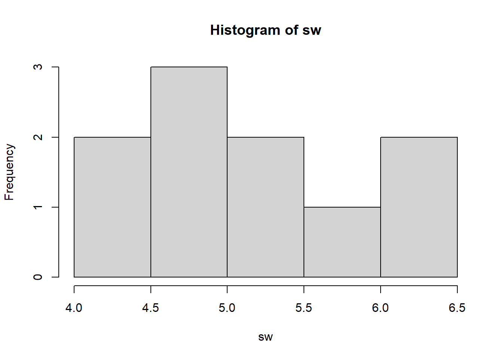

# Appendix: Using `fitdistr` to Fitting Distribution Parameters


This tutorial will introduce you to \*\*Fitting Distribution Parameters in `R`, teaching you how to use the `fitdistr()` function from the `MASS` package in R.

This training continues on our previous work on Descriptive Statistics. Often, we might want to approximate statistics describing the shape of distributions, but there may not be a clear analytical method (eg. method of moments) to do so. We can use the power of optimization to help us instead, using a brute-force method to find the value most likely to be the statistic that actually fits our distribution. We can ask `R` to compute the values of those statistics using the `MASS` package's `fitdistr()`.

## Getting Started {.unnumbered}

Please open up your project on Posit.Cloud, for our [Github class repository](https://github.com/timothyfraser/sysen). Start a new R script (File \>\> New \>\> R Script). Save the R script as `appendix_fitdistr.R`. And let's get started!

### Load Packages {.unnumbered}


``` r
# Load dplyr, which contains most data wrangling functions
library(dplyr)
# Load the fitdistr() function directly from the MASS package. 
# We'll do this, rather than loading the whole MASS package, because MASS will cancel out some dplyr functions that share the same names otherwise. See how fitdistr has now shown up in your environment as a function?
fitdistr = MASS::fitdistr
```

### Our Data

As our raw data, let's use our vector of seawall heights `sw`. Its raw distribution can be visualized with `hist(sw)`.


``` r
# Let's remake again our vector of seawall heights
sw <- c(4.5, 5, 5.5, 5, 5.5, 6.5, 6.5, 6, 5, 4)
hist(sw)
```



## Example: Exponential Distribution

We have our vector of seawall heights `sw`. We have 2 main ways of calculating statistics that describe the distribution of `sw`. These include an analytical approach (method of moments) and a brute-force approach (maximum likelihood estimation).

-   In the **analytical approach** (method of moments), which we learned in the main textbook, we use formula that have been derived by mathematicians to describe the parameters of a particular distribution.

-   In the **brute-force approach** (maximum likelihood estimation), we use a secondary parameter called **likelihood** to find the parameter values most likely to fit your data. We say, **if** the parameter had value A (for example), what's the joint probability (likelihood) of finding your observed values (`sw`) in a distribution with that trait A? We use maximum likelihood estimation to iteratively test various different values for parameter A, and choose the value that provides the *highest* likelihood - a.k.a. the *maximum likelihood*.

*Note: Remember: a parameter is a single number that describes a full population. A statistic is a single number that describes a sample. This key difference aside, the terms are largely interchangeable.*

Let's use the exponential distribution as a helpful example. It has one parameter - `rate` (also known as $\lambda$), describing $\frac{1}{ mean }$.

Let's calculate the `rate` parameter a few ways, using (1) the method of moments, (2) maximum likelihood estimation (MLE) using `fitdistr()`, and (3) maximum likelihood estimation (MLE) using `optim()`.

## Method of Moments


``` r
# Let's use the method of moments to find the inverse mean
1 / (sum(sw) / length(sw))
```

```
## [1] 0.1869159
```

``` r
# Equivalent to...
1 / mean(sw)
```

```
## [1] 0.1869159
```

## MLE with `fitdistr()`

Let's ask `fitdistr` to run maximum likelihood estimation.

Maximum likelihood estimation requires a benchmark distribution to compare against, so we need to specify the distribution type as `densfun = [type name]`. In this case, let's do `exponential`. (See a list of supported distributions using `?MASS::fitdistr`)


``` r
sw %>% MASS::fitdistr(densfun = "exponential")
```

```
##       rate   
##   0.18691589 
##  (0.05910799)
```

Pretty darn similar to the value we got from the method of moments, right?

## MLE with `optim()`

Alternatively, we could run maximum likelihood estimation manually, using `optim()`. `optim()` is `R`'s built in optimization function. We'll learn maximum likelihood estimation a little more later in the book. The key idea is this:

`dexp(x = 2, rate = 0.1)` gives the probability of the value `x = 2` showing up in an exponential distribution characterized by a parameter `rate = 0.1`.


``` r
dexp(x = 2, rate = 0.1)
```

```
## [1] 0.08187308
```

`dexp(x = sw, rate = 0.1)` gives the probabilities for *each value of x* if they showed up in an exponential distribution characterized by a parameter `rate = 0.1`.


``` r
# You can also pipe the values of x into dexp() like this
sw %>% dexp(rate = 0.1)
```

```
##  [1] 0.06376282 0.06065307 0.05769498 0.06065307 0.05769498 0.05220458
##  [7] 0.05220458 0.05488116 0.06065307 0.06703200
```

The **joint probability** of these values of x occurring together is called the **likelihood**. We can take the product using `prod()`.


``` r
# Let's get the likelihood of these values...
sw %>% dexp(rate = 0.1) %>% prod()
```

```
## [1] 4.748151e-13
```

Likelihood tend to be very small numbers, so a helpful trick is to calculate the `log-likelihood` instead, meaning the sum of logged probabilities.


``` r
# See how these two processes produce the same output?
# Get the log of probabilities multiplied together...
sw %>% dexp(rate = 0.1) %>% prod() %>% log()
```

```
## [1] -28.37585
```

``` r
# Get the sum of logged probabilities...
sw %>% dexp(rate = 0.1) %>% log() %>% sum()
```

```
## [1] -28.37585
```

``` r
# They're equivalent
```

Then, we write up a short `function` called `loglikelihood()`, including two inputs (1) `par` and (2) our data `x`. I added an example value `0.1` to `par` just as a reminder for what it means.


``` r
loglikelihood = function(par = 0.1, x){ dexp(x = x, rate = par) %>% log() %>% sum()   }
# Try it!
loglikelihood(par = 0.1, x = sw)
```

```
## [1] -28.37585
```

Finally, we run an optimizer using `optim()`, supplying a starting value for search `par = 0.1`, our raw data `x`, and our function `loglikelihood`. We want to **maximize** the loglikelihood, but `optim()` minimizes by default, so we'll say, `control = list(fnscale = -1)` to flip the scale.


``` r
optim(par = c(0.1), x = sw, fn = loglikelihood, control = list(fnscale = -1))
```

```
## $par
## [1] 0.1869531
## 
## $value
## [1] -26.77097
## 
## $counts
## function gradient 
##       24       NA 
## 
## $convergence
## [1] 0
## 
## $message
## NULL
```

Compare the final parameter value against `fitdistr`'s results! They're about the same.


``` r
fitdistr(x = sw, densfun = "exponential")
```

```
##       rate   
##   0.18691589 
##  (0.05910799)
```

Voila! You made your own maximum likelihood estimator manually. Certainly, `optim()` was a little more time consuming, but now you know how `fitdistr` truly works inside!

## Applications

Let's try applying the same general approach with `fitdistr` to other distributions.

### Normal Distribution

What parameter values would best describe our distribution's shape, if this data were from a normal distribution? Remember, normal distributions have a `mean` and a `sd`.


``` r
# Method of Moments
sw %>% mean()
```

```
## [1] 5.35
```

``` r
sw %>% sd()
```

```
## [1] 0.8181958
```

``` r
# Maximum Likelihood Estimation
sw %>% fitdistr(densfun = "normal")
```

```
##      mean         sd    
##   5.3500000   0.7762087 
##  (0.2454588) (0.1735655)
```

### Poisson Distribution

What parameter values would best describe our distribution's shape, if this data were from a Poisson distribution? Remember, poisson distributions have a `lambda` parameter describing the `mean`.


``` r
# Method of moments
sw %>% mean()
```

```
## [1] 5.35
```

``` r
# Maximum Likelihood Estimation
sw %>% fitdistr(densfun = "poisson")
```

```
##     lambda  
##   5.3500000 
##  (0.7314369)
```

### Gamma Distribution

What parameter values would best describe our distribution's shape, if this data were from a Gamma distribution? Remember, gamma distributions have a `shape` parameter \` $\approx \frac{mean^{2}}{ variance}$ and a `scale` parameter $\approx \frac{variance}{ mean }$.


``` r
# Method of Moments
# For shape, we want the rate of how much greater the mean-squared is than the variance.
mean(sw)^2 / var(sw)
```

```
## [1] 42.7556
```

``` r
# For rate, we like to get the inverse of the variance divided by the mean.
1 / (var(sw) / mean(sw) )
```

```
## [1] 7.991701
```

``` r
# Maximum Likelihood Estimation
sw %>% fitdistr(densfun = "gamma")
```

```
##      shape       rate   
##   46.711924    8.731202 
##  (20.815522) ( 3.911666)
```

### Weibull Distribution

What parameter values would best describe our distribution's shape, if this data were from a Weibull distribution? Remember, gamma distributions have a `shape` parameter and a `scale` parameter. (But we can't easily use the method of moments here right now.)


``` r
# Estimate the shape and scale parameters for a weibull distribution
sw %>% fitdistr(densfun = "weibull")
```

```
##      shape       scale  
##   7.7312532   5.6881102 
##  (1.9038045) (0.2461222)
```

## Learning Check 1 {.unnumbered .LC}

**Question**

You've been recruited to evaluate the frequency of Corgi sightings in the Ithaca Downtown. A sample of 10 students each reported the number of corgis they saw last Tuesday in town. Calculate the statistics summarizing each distribution, if it were a normal, poisson, exponential, gamma, or weibull distribution. Please use `fitdistr` for all your calculations.

Beth saw 5, Javier saw 1, June saw 10(!), Tim saw 3, Melanie saw 4, Mohammad saw 3, Jenny say 6, Yosuke saw 4, Jimena saw 5, and David saw 2.

<details>

<summary>**[View Answer!]**</summary>

First, let's make the data.


``` r
# Make distribution of Corgis
corgi <- c(5, 1, 10, 3, 4, 3, 6, 4, 5, 2)
```

Next, let's compute the estimated statistics using maximum likelihood estimation.


``` r
# Compute statistics for each distributions
corgi %>% fitdistr(densfun = "normal")
```

```
##      mean         sd    
##   4.3000000   2.3685439 
##  (0.7489993) (0.5296225)
```

``` r
corgi %>% fitdistr(densfun = "poisson")
```

```
##     lambda  
##   4.3000000 
##  (0.6557439)
```

``` r
corgi %>% fitdistr(densfun = "exponential")
```

```
##       rate   
##   0.23255814 
##  (0.07354134)
```

``` r
corgi %>% fitdistr(densfun = "gamma")
```

```
##      shape       rate   
##   3.2628624   0.7588054 
##  (1.3910572) (0.3497135)
```

``` r
corgi %>% fitdistr(densfun = "weibull")
```

```
##      shape       scale  
##   1.9207427   4.8617234 
##  (0.4566410) (0.8459497)
```

</details>

------------------------------------------------------------------------

## Conclusion

Congratulations! You now know how to use `fitdistr()` to approximate the parameters for a dataset, assuming various different types of distributions. You also learned maximum likelihood estimation, the core technique underneath `fitdistr()`, and how to perform it manually using `optim()`. Great work!


