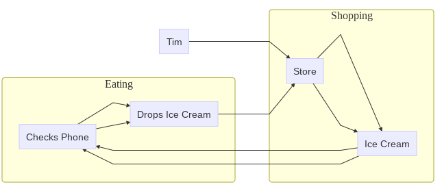

# Appendix: `mermaid` Block Diagrams (Flowcharts) in R


<br>

## Getting Started {-}

To describe and communicate the structure of social systems, we need good visuals! Failure Modes and Effects Analyses particularly rely on **block diagrams** (a fancy word for **flowchart**), so in this tutorial, we're going to learn how to make flowcharts in `R` using `mermaid`.

<br>

### Block Diagrams {-}

A **block diagram** shows how a series of components are connected in a social, physical, or technological system. Together, they visualize a *network*, where the blocks/components are *nodes* with lines, sometimes called *edges*, connecting them.


<br>

### Load Packages {-}

Let's load our packages, and then go through a few examples!


```r
# Load packages
library(tidyverse) # for data management
library(DiagrammeR) # for speedy mermaid plotting in R
```

## Mermaid

We can do this using the `mermaid` function from the `DiagrammeR` package. `mermaid` is a popular language for coding small diagrams, and `DiagrammeR` lets us draw them in `R`! `mermaid` will help you map out exactly what is happening in your six sigma case studies.

How does it work? We take a bunch of small `character` values, like `"graph TB"`, `"a"`, `"b"`, and `"a-->b"`, and we `paste()` them together into a single big string that the `mermaid` function reads. When we `paste()` them, we have to be sure that every value goes on a separate line, so we separate them by using `collapse = "\n "`. `"\n"` is a handy shortcut that means, *linebreak!* Let's do a quick example, then we'll apply it to our hypothetical Ben and Jerry's example.

### Example Block Diagram with `mermaid`


```r
# Let's make a big vector of values, using c()
example <- c(
  # say it's a graph, going Left-to-Right (LR)
  "graph LR", 
    # list out our main nodes
    "a[Tim]",
    "z[Coffee]",
    # make a subgraph 
    # (a box to contain some nodes)
    "subgraph Process",
      # Put at least one node in it
      "b[Froth Milk]",
      "c[Brew Coffee]",
      "d[Pour in Milk]",
    # Close the subgraph
    "end",
    # Draw relationships
    "a-->b",
    "b-->c",
    "c-->d",
    "d-->z")
# Check it out!
example
```

```
##  [1] "graph LR"         "a[Tim]"           "z[Coffee]"        "subgraph Process"
##  [5] "b[Froth Milk]"    "c[Brew Coffee]"   "d[Pour in Milk]"  "end"             
##  [9] "a-->b"            "b-->c"            "c-->d"            "d-->z"
```

If we `paste()` that `example` with `collapse = "\n "`, we can see it's all just one big value now.


```r
example %>% 
  paste(collapse = "\n ")
```

```
## [1] "graph LR\n a[Tim]\n z[Coffee]\n subgraph Process\n b[Froth Milk]\n c[Brew Coffee]\n d[Pour in Milk]\n end\n a-->b\n b-->c\n c-->d\n d-->z"
```

And if we append `mermaid()` to that, we can get a really nice chart!


```r
example %>% 
  paste(collapse = "\n") %>% 
  mermaid()
```

```{=html}
<div class="DiagrammeR html-widget html-fill-item" id="htmlwidget-dd6530abe1e6abab23c5" style="width:672px;height:480px;"></div>
<script type="application/json" data-for="htmlwidget-dd6530abe1e6abab23c5">{"x":{"diagram":"graph LR\na[Tim]\nz[Coffee]\nsubgraph Process\nb[Froth Milk]\nc[Brew Coffee]\nd[Pour in Milk]\nend\na-->b\nb-->c\nc-->d\nd-->z"},"evals":[],"jsHooks":[]}</script>
```

Whohoo! You made your first `mermaid` plot!

---

<br>
<br>

### Learning Check 1 {.unnumbered .LC}

**Question**

Try making your own `mermaid` plot now, which tells the following tragedy, which I hope will not happen to you:

-   You go to the store, buy ice cream, try to check your phone, drop your ice cream, go back to store, buy ice cream, check phone again, and drop ice cream again. (True story! A sad day.)

-   Make sure to include at least 1 subgraph and 3 relationships.

<details><summary>**[View Answer!]**</summary>


```r
# Here's one of several ways you could draw that!
mystory <- c("graph LR",
  "a[Tim]",
  # Start a subgraph about what happens in the store
  "subgraph Shopping",
    "b[Store]",
    "c[Ice Cream]",
    # end subgraph
  "end",
  # Start subgraph about what happens when eating
  "subgraph Eating",
    "d[Checks Phone]",
    "e[Drops Ice Cream]",
    # end subgraph
  "end",
  # Add interactions
  # Tim goes to store
  "a-->b",
  # Buys ice cream at store
  "b-->c",
  # Checks phone
  "c-->d",
  # Drops Ice cream
  "d-->e",
  # Goes back to store
  "e-->b",
  # Buys ice cream again
  "b-->c",
  # Looks at phone
  "c-->d",
  # Drops ice cream again
  "d-->e"
)
```

And visualize it!


```r
mystory %>%
  paste(collapse = "\n ") %>%
  mermaid()
```



</details>

<br>
<br>


## Diagram of Ice Cream Shipment

Let's try and visualize what the process of shipping out ice cream looks like once it has been made, using `mermaid`. To make this easier, we can do it piecemeal, a few lines at a time, saved into logically named vectors.

First, let's get the starting settings of our graph! We'll name it `intro`.


```r
# Get the basic graph, going left-to-right
intro <- "graph LR"
```

Second, let's get a `subgraph` of people! We'll call it `subgraph_people`. *(Note: whenever we make multi-line chunks, gotta bind that stuff together using `paste()!`)*


```r
subgraph_people <- c(
  # Make a subgraph
  "subgraph People",
    # Draw people in circles with ()
    "w1(Worker 1)",
    "w2(Worker 2)",
    "w3(Worker 3)",
  # Conclude the subgraph
  "end") %>%
  # remember to bind it together
  paste(collapse = "\n")
```

Third, let's get a subgraph of events these people are involved in. We'll call it `subgraph_events`.

*Note: `mermaid` understands some `HTML`, so to get breaks in the labels, we're going to use `<br>` below.*


```r
subgraph_events <- paste(
  # Make another subgraph
  "subgraph Events",
    # Draw events as boxes with []
    "freezer[Freeze<br>Ice Cream]",
    "loading[Load<br>onto Truck]",
    "transport[Transport<br>to Store]",
  # Conclude the subgraph
  "end",
  sep = "\n ")
```

Fourth, let's list out the ways our nodes are related, and we'll call it `ties`.


```r
# Draw main ties
ties  <- paste(
  # Worker 1 puts ice cream in Freezer
  "w1 --> freezer",
  # Worker 2 loads ice cream into Truck
  "w2 --> loading",
  # Worker 3 transports ice cream to Store
  "w3 --> transport",
  # Also, Worker 2 takes the ice cream from the Freezer for loading
  "freezer --> w2",
  # And Worker 3 drives the ice cream from loading dock to Store
  "loading --> w3",
  sep = "\n ")
```

Alright! Let's visualize this chart!


```r
c(intro, 
    # Add subgraphs of nodes
    subgraph_people,
    subgraph_events,
    # Add ties
  ties) %>%
  # Paste them together
  paste(collapse = "\n ") %>%
  # And visualize it!
  mermaid()
```

```{=html}
<div class="DiagrammeR html-widget html-fill-item" id="htmlwidget-427e178d4a471a026ce6" style="width:672px;height:480px;"></div>
<script type="application/json" data-for="htmlwidget-427e178d4a471a026ce6">{"x":{"diagram":"graph LR\n subgraph People\nw1(Worker 1)\nw2(Worker 2)\nw3(Worker 3)\nend\n subgraph Events\n freezer[Freeze<br>Ice Cream]\n loading[Load<br>onto Truck]\n transport[Transport<br>to Store]\n end\n w1 --> freezer\n w2 --> loading\n w3 --> transport\n freezer --> w2\n loading --> w3"},"evals":[],"jsHooks":[]}</script>
```

## Diagram Failures

Now, we could imagine that there are several potential failure modes here. Let's add them to our drawing!

First, we'll make a `subgraph` of failures aptly named `subgraph_fail`.


```r
subgraph_fail <- c(
  # Make another subgraph
  "subgraph Failures",
    "fail_break[freezer breaks]",
    "fail_time[left out too long]",
    "fail_eat[worker eats it]",
  # Conclude subgraph
  "end") %>%
  # Bind it!
  paste(collapse = "\n ")
```

Second, we'll compile a list of relationships, or ways our nodes could lead to these failures.


```r
failures <- c(
  # Worker 1 could leave ice cream out before freezing
  #"w1 --> fail_time",
  # Worker 1 could eat the ice cream before freezing
  #"w1 --> fail_eat",
  # Frezzer could break
  "freezer --> fail_break",
  # Worker 2 could leave ice cream out while loading
  "loading --> fail_time",
  # Worker 2 could eat the ice cream while loading
  "loading --> fail_eat",
  # Worker 3 could leave the ice cream out in transit
  "transport --> fail_time",
  # Worker 3 could eat the ice cream in transit
  "transport --> fail_eat") %>%
  # bind it!
  paste(collapse = "\n ")
```

So what does our new diagram look like?


```r
c("graph LR", 
    # Add subgraphs of nodes
    subgraph_people,
    subgraph_events,
    # Add ties
  ties,
    # Add subgraph of failure nodes  
      subgraph_fail,
    # Add ways possible failures
      failures
  ) %>%
  # Paste them together
  paste(collapse = "\n ") %>%
  # And visualize it!
  mermaid()
```

```{=html}
<div class="DiagrammeR html-widget html-fill-item" id="htmlwidget-2aacbaf0a4a6f55b8a16" style="width:672px;height:480px;"></div>
<script type="application/json" data-for="htmlwidget-2aacbaf0a4a6f55b8a16">{"x":{"diagram":"graph LR\n subgraph People\nw1(Worker 1)\nw2(Worker 2)\nw3(Worker 3)\nend\n subgraph Events\n freezer[Freeze<br>Ice Cream]\n loading[Load<br>onto Truck]\n transport[Transport<br>to Store]\n end\n w1 --> freezer\n w2 --> loading\n w3 --> transport\n freezer --> w2\n loading --> w3\n subgraph Failures\n fail_break[freezer breaks]\n fail_time[left out too long]\n fail_eat[worker eats it]\n end\n freezer --> fail_break\n loading --> fail_time\n loading --> fail_eat\n transport --> fail_time\n transport --> fail_eat"},"evals":[],"jsHooks":[]}</script>
```

There's so much you can do with `mermaid`, but for now, this will do. Hooray! 

You're ready to use `mermaid`!

<br>
<br>


```include
rm(list = ls())
```

