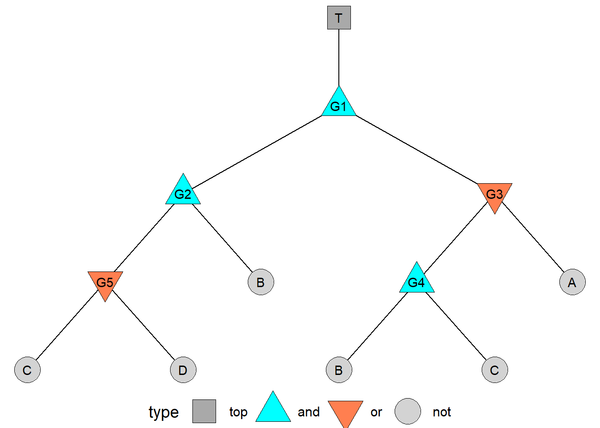

# Appendix: `tidyfault` for Fault Tree Analysis


## Getting Started {-}

Fault trees are visual representation of boolean probability equations, typically depicting the sets of necessary events leading to system failure. We learned about them earlier in the textbook, but you might be wondering, with all your ggplot skills now, can you visualize a fault tree in `ggplot`? And are there other technical solutions for computing fault tree quantities of interest?

Good news! There is! This tutorial will explain how to use the `tidyfault` package to work with fault trees.

### Prerequisites {-}

As a prerequisite for this workshop, be sure to have read the Fault Trees training earlier in this book! 
You'll need to install a few packages real quick below. Here they are.


```r
install.packages(c("devtools", "admisc", "tidygraph", "ggraph", "QCA"))
# Install the tidyfault package!
devtools::install_github("timothyfraser/tidyfault")
# Select, 'install all packages'
# on the menu that will pop up in your console
```

### Load Packages {-}


```r
library(dplyr)
library(readr)
library(ggplot2)
library(tidyfault)
```


## Visualizing Fault Trees in R

We can *draw* fault trees easily enough by hand, but how do we record their data in a machine readable format? We can use conventions from *network science* to record these data in two lists: (1) an 'edgelist' of edges connecting nodes, and (2) a 'nodelist' of nodes, connected by edges. 

<br>
<br>

### Making a Nodelist

We can use the `tribble()` function available when loading the `tidyverse` package to write out small data.frames row by row. In `nodes`, our nodelist:

- every node must have a unique ID, called `name`.

- some events reappear multiple times in the same tree; we must give these nodes *different* `name` but the *same* `event` name.

- each node should be classified by `type` as (1) an `and` gate, (2) an `or` gate, or (3) `not` a gate. We can use `factor()` to tell R to always remember `"and"`, `"or"`, and `"not"` in that order (useful for `ggplot` legends).

- classic fault trees sometimes write events and the gates that condition them as separate nodes, but as far as the graph is concerned, they are really the *same node*. So, remember to combine them for analysis.


```r
# Let's make a data.frame of nodes!
tribble(
  # Make the headers, using a tilde
  ~id, ~event, ~type,
  # Add the value entries
  "T",   "T",   "top",
  "G1",  "G1",  "and",
  # Notice how event 'B' appears twice,
  # so it has a logical but differentiated `name` "B1" and "B2"?
  "B1",  "B",   "not",
  "B2",  "B",   "not",
  "C1",  "C",   "not") %>%
  # Classify 'type' as a factor, with specific levels
  mutate(type = factor(type, levels = c("top", "and", "or", "not")))
```

```
## # A tibble: 5 × 3
##   id    event type 
##   <chr> <chr> <fct>
## 1 T     T     top  
## 2 G1    G1    and  
## 3 B1    B     not  
## 4 B2    B     not  
## 5 C1    C     not
```

<br>
<br>

### Making an Edgelist

Next, we can use `tribble()` to make an edgelist of our fault tree (or use `read_csv()` to read in an edgelist). Edgelists should follow these conventions:

- each row shows a unique edge between nodes, recording their node `id`s from the top-down in the `from` and `to` columns.


```r
# For example....
tribble(
  ~from, ~to,
  "T",   "G1",
  "G1", "G2",
  "G2", "B1",
  "G2", "G5") 
```

```
## # A tibble: 4 × 2
##   from  to   
##   <chr> <chr>
## 1 T     G1   
## 2 G1    G2   
## 3 G2    B1   
## 4 G2    G5
```

## Our Data

In this example, we're going to use the default data in `tidyfault`, called `fakenodes` and `fakeedges`. You can download it like this:


```r
data("fakenodes")
data("fakeedges")
```


```r
fakenodes
```

```
## # A tibble: 12 × 3
##       id event type 
##    <dbl> <chr> <fct>
##  1     1 T     top  
##  2     2 G1    and  
##  3     3 G2    and  
##  4     4 G3    or   
##  5     5 G4    and  
##  6     6 G5    or   
##  7     7 A     not  
##  8     8 B     not  
##  9     9 B     not  
## 10    10 C     not  
## 11    11 C     not  
## 12    12 D     not
```


```r
fakeedges
```

```
## # A tibble: 11 × 2
##     from    to
##    <dbl> <dbl>
##  1     1     2
##  2     2     3
##  3     3     8
##  4     3     6
##  5     6    10
##  6     6    12
##  7     2     4
##  8     4     7
##  9     4     5
## 10     5     9
## 11     5    11
```


<br>
<br>

## Getting a Fault Tree Layout

Using `tidyfault`'s `illustrate()` function, we can quickly assign `x` and `y` coordinates for a 'tree' layout to to our `fakenodes` and `fakeedges`. We say `type = "both"` because we want to receive coordinates for *both* the nodes and edges.


```r
gg = illustrate(nodes = fakenodes, edges = fakeedges, 
                type = "both", node_key = "id")
```

This returns a `list()` object. `list()` objects are collections of data.frames - sort of like a vector whose values are entire data.frames. We can query the values inside lists by using the `$`, just like a data.frame.


```r
# see the nodes
gg$nodes %>% head(3)
```

```
##    x y id event type
## 1  0 4  1     T  top
## 2  0 3  2    G1  and
## 3 -1 2  3    G2  and
```

```r
# see the edges
gg$edges %>% head(3)
```

```
## # A tibble: 3 × 5
## # Groups:   edge_id [2]
##   edge_id direction    id     x     y
##     <int> <chr>     <dbl> <dbl> <dbl>
## 1       1 from          1     0     4
## 2       1 to            2     0     3
## 3       2 from          2     0     3
```


## Visualize a Fault Tree


```r
ggplot() +
  # Plot each line corresponding to the unique edge id, used to group them
  geom_line(data = gg$edges, mapping = aes(x = x, y = y, group = edge_id)) +
  # Plot each point
  geom_point(data = gg$nodes, 
             mapping = aes(x = x, y = y, shape = type, fill = type),
             size = 10) +
  # Plot labels!
  geom_text(data = gg$nodes, mapping = aes(x = x, y = y, label = event)) +
  # We can also assign shapes!
  # (shapes 21, 22, 23, 24, and 25 have fill and color)
  scale_shape_manual(values = c(22, 24, 25, 21)) +
  # And assign some poppy colors here
  scale_fill_manual(values = c("darkgrey", "cyan", "coral", "lightgrey")) +
  # Finally, we can make a clean void theme, with the legend below.
  theme_void(base_size = 14) +
  theme(legend.position = "bottom")
```



<br>
<br>

---

## Cutsets

Fault Trees are *big* - and some `events` are more critical than others. We want to identify two kinds of information.

1. **cutsets**: all the possible sets of events which together trigger failure, called **cutsets**.

2. **minimal cutsets**: the most reduced set of events which trigger failure.

To do this, we're going to use an algorithm, called the MOCUS top-down algorithm. I wrote it in `R` for you! Yay!

## Gates


```r
# To get a data.frame of gates, use curate()!
g = curate(fakenodes, fakeedges)
# Check it
g
```

```
## # A tibble: 6 × 6
##   gate  type  class     n set           items    
##   <chr> <fct> <fct> <int> <chr>         <list>   
## 1 T     top   top       1 " (G1) "      <chr [1]>
## 2 G1    and   gate      2 " (G2 * G3) " <chr [2]>
## 3 G2    and   gate      2 " (B * G5) "  <chr [2]>
## 4 G3    or    gate      2 " (A + G4) "  <chr [2]>
## 5 G4    and   gate      2 " (B * C) "   <chr [2]>
## 6 G5    or    gate      2 " (C + D) "   <chr [2]>
```

## Equations

To get the full boolean equation of the fault tree, use `equate()`!


```r
g %>% equate() 
```

```
## [1] " ( ( (B *  (C + D) )  *  (A +  (B * C) ) ) ) "
```

We can format it as a function too!


```r
f = g %>% equate() %>% formulate()

# Suppose there is each of these probabilities that A, B, C, and D occur
# what's the probability of the top event?
f(A = 0.3, B = 0.5, C = 0.1, D = 0.5)
```

```
## [1] 0.105
```

## Minimal Cutsets

To simplify down to the minimal cutsets, use `concentrate()`! It's pretty quick for small graphs, but gets exponentially longer the more nodes you add. (Especially with `OR` statements.) That's MOCUS's value as well as its tradeoff.


```r
m = g %>% 
  concentrate(method = "mocus")
# 
m
```

```
## [1] "B*C"   "A*B*D"
```

## Coverage

We might want to know, *how important* are each of my minimal cutsets? We can compute the total number of cutsets that include the minimal cutset, the total cutsets leading to failure in general, and the percentage (`coverage`) of cutsets containing your minimal cutset out of all total cutsets leading to failure. It's basically a measure of the explanatory power of your cutsets!


```r
m %>% 
  tabulate(formula = f)
```

```
## # A tibble: 2 × 5
##   mincut query                                        cutsets failures coverage
##   <chr>  <chr>                                          <int>    <int>    <dbl>
## 1 A*B*D  filter(A == 1, B == 1, D == 1, outcome == 1)       2        5      0.4
## 2 B*C    filter(B == 1, C == 1, outcome == 1)               4        5      0.8
```


## Conclusion {-}

Happy Fault Tree analysis!


