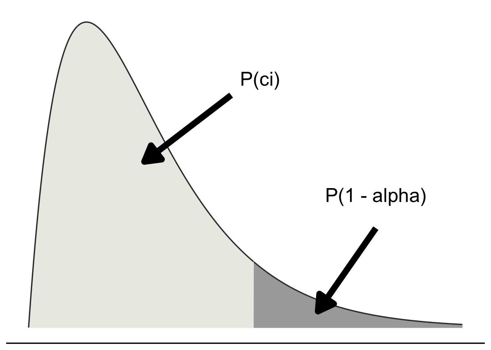

# Appendix: Statistical Tables and Common Equations


## Table 1: Chi-Squared

<table class="table table-striped table-responsive" style="font-size: 12px; margin-left: auto; margin-right: auto;">
 <thead>
<tr><th style="border-bottom:hidden;padding-bottom:0; padding-left:3px;padding-right:3px;text-align: center; font-weight: bold; " colspan="12"><div style="border-bottom: 1px solid #ddd; padding-bottom: 5px; ">Table 1: Chi<sup>2</sup> Statistics</div></th></tr>
<tr>
<th style="empty-cells: hide;border-bottom:hidden;" colspan="1"></th>
<th style="border-bottom:hidden;padding-bottom:0; padding-left:3px;padding-right:3px;text-align: center; font-style: italic; " colspan="11"><div style="border-bottom: 1px solid #ddd; padding-bottom: 5px; ">Chi<sup>2</sup> = qchisq(p = ci, df)</div></th>
</tr>
<tr>
<th style="empty-cells: hide;border-bottom:hidden;" colspan="1"></th>
<th style="border-bottom:hidden;padding-bottom:0; padding-left:3px;padding-right:3px;text-align: center; font-weight: bold; " colspan="11"><div style="border-bottom: 1px solid #ddd; padding-bottom: 5px; ">confidence interval ci = 1 - alpha level</div></th>
</tr>
  <tr>
   <th style="text-align:center;"> df </th>
   <th style="text-align:center;"> 0.5% </th>
   <th style="text-align:center;"> 2.5% </th>
   <th style="text-align:center;"> 80% </th>
   <th style="text-align:center;"> 90% </th>
   <th style="text-align:center;"> 95% </th>
   <th style="text-align:center;"> 97.5% </th>
   <th style="text-align:center;"> 98% </th>
   <th style="text-align:center;"> 99% </th>
   <th style="text-align:center;"> 99.5% </th>
   <th style="text-align:center;"> 99.8% </th>
   <th style="text-align:center;"> 99.9% </th>
  </tr>
 </thead>
<tbody>
  <tr>
   <td style="text-align:center;"> 1 </td>
   <td style="text-align:center;"> 0.0000392 </td>
   <td style="text-align:center;"> 0.0009820 </td>
   <td style="text-align:center;"> 1.64 </td>
   <td style="text-align:center;"> 2.70 </td>
   <td style="text-align:center;"> 3.84 </td>
   <td style="text-align:center;"> 5.02 </td>
   <td style="text-align:center;"> 5.41 </td>
   <td style="text-align:center;"> 6.63 </td>
   <td style="text-align:center;"> 7.87 </td>
   <td style="text-align:center;"> 9.54 </td>
   <td style="text-align:center;"> 10.82 </td>
  </tr>
  <tr>
   <td style="text-align:center;"> 2 </td>
   <td style="text-align:center;"> 0.010 </td>
   <td style="text-align:center;"> 0.050 </td>
   <td style="text-align:center;"> 3.21 </td>
   <td style="text-align:center;"> 4.60 </td>
   <td style="text-align:center;"> 5.99 </td>
   <td style="text-align:center;"> 7.37 </td>
   <td style="text-align:center;"> 7.82 </td>
   <td style="text-align:center;"> 9.21 </td>
   <td style="text-align:center;"> 10.59 </td>
   <td style="text-align:center;"> 12.42 </td>
   <td style="text-align:center;"> 13.81 </td>
  </tr>
  <tr>
   <td style="text-align:center;"> 3 </td>
   <td style="text-align:center;"> 0.071 </td>
   <td style="text-align:center;"> 0.215 </td>
   <td style="text-align:center;"> 4.64 </td>
   <td style="text-align:center;"> 6.25 </td>
   <td style="text-align:center;"> 7.81 </td>
   <td style="text-align:center;"> 9.34 </td>
   <td style="text-align:center;"> 9.83 </td>
   <td style="text-align:center;"> 11.34 </td>
   <td style="text-align:center;"> 12.83 </td>
   <td style="text-align:center;"> 14.79 </td>
   <td style="text-align:center;"> 16.26 </td>
  </tr>
  <tr>
   <td style="text-align:center;"> 4 </td>
   <td style="text-align:center;"> 0.20 </td>
   <td style="text-align:center;"> 0.48 </td>
   <td style="text-align:center;"> 5.98 </td>
   <td style="text-align:center;"> 7.77 </td>
   <td style="text-align:center;"> 9.48 </td>
   <td style="text-align:center;"> 11.14 </td>
   <td style="text-align:center;"> 11.66 </td>
   <td style="text-align:center;"> 13.27 </td>
   <td style="text-align:center;"> 14.86 </td>
   <td style="text-align:center;"> 16.92 </td>
   <td style="text-align:center;"> 18.46 </td>
  </tr>
  <tr>
   <td style="text-align:center;"> 5 </td>
   <td style="text-align:center;"> 0.41 </td>
   <td style="text-align:center;"> 0.83 </td>
   <td style="text-align:center;"> 7.28 </td>
   <td style="text-align:center;"> 9.23 </td>
   <td style="text-align:center;"> 11.07 </td>
   <td style="text-align:center;"> 12.83 </td>
   <td style="text-align:center;"> 13.38 </td>
   <td style="text-align:center;"> 15.08 </td>
   <td style="text-align:center;"> 16.74 </td>
   <td style="text-align:center;"> 18.90 </td>
   <td style="text-align:center;"> 20.51 </td>
  </tr>
  <tr>
   <td style="text-align:center;"> 6 </td>
   <td style="text-align:center;"> 0.67 </td>
   <td style="text-align:center;"> 1.23 </td>
   <td style="text-align:center;"> 8.55 </td>
   <td style="text-align:center;"> 10.64 </td>
   <td style="text-align:center;"> 12.59 </td>
   <td style="text-align:center;"> 14.44 </td>
   <td style="text-align:center;"> 15.03 </td>
   <td style="text-align:center;"> 16.81 </td>
   <td style="text-align:center;"> 18.54 </td>
   <td style="text-align:center;"> 20.79 </td>
   <td style="text-align:center;"> 22.45 </td>
  </tr>
  <tr>
   <td style="text-align:center;"> 7 </td>
   <td style="text-align:center;"> 0.98 </td>
   <td style="text-align:center;"> 1.68 </td>
   <td style="text-align:center;"> 9.80 </td>
   <td style="text-align:center;"> 12.01 </td>
   <td style="text-align:center;"> 14.06 </td>
   <td style="text-align:center;"> 16.01 </td>
   <td style="text-align:center;"> 16.62 </td>
   <td style="text-align:center;"> 18.47 </td>
   <td style="text-align:center;"> 20.27 </td>
   <td style="text-align:center;"> 22.60 </td>
   <td style="text-align:center;"> 24.32 </td>
  </tr>
  <tr>
   <td style="text-align:center;"> 8 </td>
   <td style="text-align:center;"> 1.34 </td>
   <td style="text-align:center;"> 2.17 </td>
   <td style="text-align:center;"> 11.03 </td>
   <td style="text-align:center;"> 13.36 </td>
   <td style="text-align:center;"> 15.50 </td>
   <td style="text-align:center;"> 17.53 </td>
   <td style="text-align:center;"> 18.16 </td>
   <td style="text-align:center;"> 20.09 </td>
   <td style="text-align:center;"> 21.95 </td>
   <td style="text-align:center;"> 24.35 </td>
   <td style="text-align:center;"> 26.12 </td>
  </tr>
  <tr>
   <td style="text-align:center;"> 9 </td>
   <td style="text-align:center;"> 1.73 </td>
   <td style="text-align:center;"> 2.70 </td>
   <td style="text-align:center;"> 12.24 </td>
   <td style="text-align:center;"> 14.68 </td>
   <td style="text-align:center;"> 16.91 </td>
   <td style="text-align:center;"> 19.02 </td>
   <td style="text-align:center;"> 19.67 </td>
   <td style="text-align:center;"> 21.66 </td>
   <td style="text-align:center;"> 23.58 </td>
   <td style="text-align:center;"> 26.05 </td>
   <td style="text-align:center;"> 27.87 </td>
  </tr>
  <tr>
   <td style="text-align:center;"> 10 </td>
   <td style="text-align:center;"> 2.15 </td>
   <td style="text-align:center;"> 3.24 </td>
   <td style="text-align:center;"> 13.44 </td>
   <td style="text-align:center;"> 15.98 </td>
   <td style="text-align:center;"> 18.30 </td>
   <td style="text-align:center;"> 20.48 </td>
   <td style="text-align:center;"> 21.16 </td>
   <td style="text-align:center;"> 23.20 </td>
   <td style="text-align:center;"> 25.18 </td>
   <td style="text-align:center;"> 27.72 </td>
   <td style="text-align:center;"> 29.58 </td>
  </tr>
  <tr>
   <td style="text-align:center;"> 11 </td>
   <td style="text-align:center;"> 2.60 </td>
   <td style="text-align:center;"> 3.81 </td>
   <td style="text-align:center;"> 14.63 </td>
   <td style="text-align:center;"> 17.27 </td>
   <td style="text-align:center;"> 19.67 </td>
   <td style="text-align:center;"> 21.92 </td>
   <td style="text-align:center;"> 22.61 </td>
   <td style="text-align:center;"> 24.72 </td>
   <td style="text-align:center;"> 26.75 </td>
   <td style="text-align:center;"> 29.35 </td>
   <td style="text-align:center;"> 31.26 </td>
  </tr>
  <tr>
   <td style="text-align:center;"> 12 </td>
   <td style="text-align:center;"> 3.07 </td>
   <td style="text-align:center;"> 4.40 </td>
   <td style="text-align:center;"> 15.81 </td>
   <td style="text-align:center;"> 18.54 </td>
   <td style="text-align:center;"> 21.02 </td>
   <td style="text-align:center;"> 23.33 </td>
   <td style="text-align:center;"> 24.05 </td>
   <td style="text-align:center;"> 26.21 </td>
   <td style="text-align:center;"> 28.29 </td>
   <td style="text-align:center;"> 30.95 </td>
   <td style="text-align:center;"> 32.90 </td>
  </tr>
  <tr>
   <td style="text-align:center;"> 13 </td>
   <td style="text-align:center;"> 3.56 </td>
   <td style="text-align:center;"> 5.00 </td>
   <td style="text-align:center;"> 16.98 </td>
   <td style="text-align:center;"> 19.81 </td>
   <td style="text-align:center;"> 22.36 </td>
   <td style="text-align:center;"> 24.73 </td>
   <td style="text-align:center;"> 25.47 </td>
   <td style="text-align:center;"> 27.68 </td>
   <td style="text-align:center;"> 29.81 </td>
   <td style="text-align:center;"> 32.53 </td>
   <td style="text-align:center;"> 34.52 </td>
  </tr>
  <tr>
   <td style="text-align:center;"> 14 </td>
   <td style="text-align:center;"> 4.07 </td>
   <td style="text-align:center;"> 5.62 </td>
   <td style="text-align:center;"> 18.15 </td>
   <td style="text-align:center;"> 21.06 </td>
   <td style="text-align:center;"> 23.68 </td>
   <td style="text-align:center;"> 26.11 </td>
   <td style="text-align:center;"> 26.87 </td>
   <td style="text-align:center;"> 29.14 </td>
   <td style="text-align:center;"> 31.31 </td>
   <td style="text-align:center;"> 34.09 </td>
   <td style="text-align:center;"> 36.12 </td>
  </tr>
  <tr>
   <td style="text-align:center;"> 15 </td>
   <td style="text-align:center;"> 4.60 </td>
   <td style="text-align:center;"> 6.26 </td>
   <td style="text-align:center;"> 19.31 </td>
   <td style="text-align:center;"> 22.30 </td>
   <td style="text-align:center;"> 24.99 </td>
   <td style="text-align:center;"> 27.48 </td>
   <td style="text-align:center;"> 28.25 </td>
   <td style="text-align:center;"> 30.57 </td>
   <td style="text-align:center;"> 32.80 </td>
   <td style="text-align:center;"> 35.62 </td>
   <td style="text-align:center;"> 37.69 </td>
  </tr>
  <tr>
   <td style="text-align:center;"> 16 </td>
   <td style="text-align:center;"> 5.14 </td>
   <td style="text-align:center;"> 6.90 </td>
   <td style="text-align:center;"> 20.46 </td>
   <td style="text-align:center;"> 23.54 </td>
   <td style="text-align:center;"> 26.29 </td>
   <td style="text-align:center;"> 28.84 </td>
   <td style="text-align:center;"> 29.63 </td>
   <td style="text-align:center;"> 31.99 </td>
   <td style="text-align:center;"> 34.26 </td>
   <td style="text-align:center;"> 37.14 </td>
   <td style="text-align:center;"> 39.25 </td>
  </tr>
  <tr>
   <td style="text-align:center;"> 17 </td>
   <td style="text-align:center;"> 5.69 </td>
   <td style="text-align:center;"> 7.56 </td>
   <td style="text-align:center;"> 21.61 </td>
   <td style="text-align:center;"> 24.76 </td>
   <td style="text-align:center;"> 27.58 </td>
   <td style="text-align:center;"> 30.19 </td>
   <td style="text-align:center;"> 30.99 </td>
   <td style="text-align:center;"> 33.40 </td>
   <td style="text-align:center;"> 35.71 </td>
   <td style="text-align:center;"> 38.64 </td>
   <td style="text-align:center;"> 40.79 </td>
  </tr>
  <tr>
   <td style="text-align:center;"> 18 </td>
   <td style="text-align:center;"> 6.26 </td>
   <td style="text-align:center;"> 8.23 </td>
   <td style="text-align:center;"> 22.75 </td>
   <td style="text-align:center;"> 25.98 </td>
   <td style="text-align:center;"> 28.86 </td>
   <td style="text-align:center;"> 31.52 </td>
   <td style="text-align:center;"> 32.34 </td>
   <td style="text-align:center;"> 34.80 </td>
   <td style="text-align:center;"> 37.15 </td>
   <td style="text-align:center;"> 40.13 </td>
   <td style="text-align:center;"> 42.31 </td>
  </tr>
  <tr>
   <td style="text-align:center;"> 19 </td>
   <td style="text-align:center;"> 6.84 </td>
   <td style="text-align:center;"> 8.90 </td>
   <td style="text-align:center;"> 23.90 </td>
   <td style="text-align:center;"> 27.20 </td>
   <td style="text-align:center;"> 30.14 </td>
   <td style="text-align:center;"> 32.85 </td>
   <td style="text-align:center;"> 33.68 </td>
   <td style="text-align:center;"> 36.19 </td>
   <td style="text-align:center;"> 38.58 </td>
   <td style="text-align:center;"> 41.61 </td>
   <td style="text-align:center;"> 43.82 </td>
  </tr>
  <tr>
   <td style="text-align:center;"> 20 </td>
   <td style="text-align:center;"> 7.43 </td>
   <td style="text-align:center;"> 9.59 </td>
   <td style="text-align:center;"> 25.03 </td>
   <td style="text-align:center;"> 28.41 </td>
   <td style="text-align:center;"> 31.41 </td>
   <td style="text-align:center;"> 34.16 </td>
   <td style="text-align:center;"> 35.01 </td>
   <td style="text-align:center;"> 37.56 </td>
   <td style="text-align:center;"> 39.99 </td>
   <td style="text-align:center;"> 43.07 </td>
   <td style="text-align:center;"> 45.31 </td>
  </tr>
  <tr>
   <td style="text-align:center;"> 21 </td>
   <td style="text-align:center;"> 8.03 </td>
   <td style="text-align:center;"> 10.28 </td>
   <td style="text-align:center;"> 26.17 </td>
   <td style="text-align:center;"> 29.61 </td>
   <td style="text-align:center;"> 32.67 </td>
   <td style="text-align:center;"> 35.47 </td>
   <td style="text-align:center;"> 36.34 </td>
   <td style="text-align:center;"> 38.93 </td>
   <td style="text-align:center;"> 41.40 </td>
   <td style="text-align:center;"> 44.52 </td>
   <td style="text-align:center;"> 46.79 </td>
  </tr>
</tbody>
</table>

<br>
<hr>
<br>

## Table 2: k-factor rules

<table class="table table-striped table-responsive" style="font-size: 12px; margin-left: auto; margin-right: auto;">
<caption style="font-size: initial !important;">(\#tab:table4)Table 2: Rules for Finding k-factors</caption>
 <thead>
  <tr>
   <th style="text-align:left;"> Data </th>
   <th style="text-align:left;"> Censor </th>
   <th style="text-align:center;"> Bounds </th>
   <th style="text-align:left;"> Rule </th>
   <th style="text-align:left;"> Code </th>
   <th style="text-align:left;"> Steps </th>
  </tr>
 </thead>
<tbody>
  <tr>
   <td style="text-align:left;width: 1.5cm; "> Complete </td>
   <td style="text-align:left;width: 1cm; "> None </td>
   <td style="text-align:center;width: 1.5cm; "> both </td>
   <td style="text-align:left;width: 4cm; "> $k_{ci,r} = \chi^{2}_{ci, 2r} \times \frac{1}{2r}$ </td>
   <td style="text-align:left;"> qchisq(ci, df = 2*r) / (2*r) </td>
   <td style="text-align:left;"> Lookup r in Table 3 or 4. </td>
  </tr>
  <tr>
   <td style="text-align:left;width: 1.5cm; "> Type I </td>
   <td style="text-align:left;width: 1cm; "> Time </td>
   <td style="text-align:center;width: 1.5cm; "> lower </td>
   <td style="text-align:left;width: 4cm; "> $k_{ci,r} = \chi^{2}_{ci, 2r} \times \frac{1}{2r}$ </td>
   <td style="text-align:left;"> qchisq(ci, df = 2*r) / (2*r) </td>
   <td style="text-align:left;"> Lookup r in Table 4. </td>
  </tr>
  <tr>
   <td style="text-align:left;width: 1.5cm; "> Type I </td>
   <td style="text-align:left;width: 1cm; "> Time </td>
   <td style="text-align:center;width: 1.5cm; "> upper </td>
   <td style="text-align:left;width: 4cm; "> $k_{ci,r} = \chi^{2}_{ci, 2(r + 1)} \times \frac{1}{2r}$ </td>
   <td style="text-align:left;"> qchisq(ci, df = 2*(r + 1)) / (2*r) </td>
   <td style="text-align:left;"> Lookup r + 1 in Table 3. </td>
  </tr>
  <tr>
   <td style="text-align:left;width: 1.5cm; "> Type II </td>
   <td style="text-align:left;width: 1cm; "> Failures </td>
   <td style="text-align:center;width: 1.5cm; "> lower </td>
   <td style="text-align:left;width: 4cm; "> $k_{ci,r} = \chi^{2}_{ci, 2r} \times \frac{1}{2r}$ </td>
   <td style="text-align:left;"> qchisq(ci, df = 2*r) / (2*r) </td>
   <td style="text-align:left;"> Lookup r in Table 4. </td>
  </tr>
  <tr>
   <td style="text-align:left;width: 1.5cm; "> Type II </td>
   <td style="text-align:left;width: 1cm; "> Failures </td>
   <td style="text-align:center;width: 1.5cm; "> upper </td>
   <td style="text-align:left;width: 4cm; "> $k_{ci,r} =  \chi^{2}_{ci, 2((r-1) + 1)} \times \frac{1}{2(r - 1)} \times \frac{(r - 1)}{r}$ </td>
   <td style="text-align:left;"> qchisq(ci, df = 2 * ( (r - 1) + 1)) / (2 * (r - 1) )  *  (r - 1) / r </td>
   <td style="text-align:left;"> Lookup r - 1 in Table 3. Multiply k by $\frac{(r-1)}{r}$. </td>
  </tr>
</tbody>
</table>


## Table 3: k-factor (upper)

<table class="table table-striped table-responsive" style="font-size: 12px; margin-left: auto; margin-right: auto;">
 <thead>
<tr><th style="border-bottom:hidden;padding-bottom:0; padding-left:3px;padding-right:3px;text-align: center; font-weight: bold; " colspan="8"><div style="border-bottom: 1px solid #ddd; padding-bottom: 5px; ">Table 3: k-factors for One-Sided Exponential Upper Bound</div></th></tr>
<tr>
<th style="empty-cells: hide;border-bottom:hidden;" colspan="1"></th>
<th style="border-bottom:hidden;padding-bottom:0; padding-left:3px;padding-right:3px;text-align: center; font-weight: bold; " colspan="7"><div style="border-bottom: 1px solid #ddd; padding-bottom: 5px; ">Time/Type I Censoring; If Type II Censoring, be sure to adjust.</div></th>
</tr>
<tr>
<th style="empty-cells: hide;border-bottom:hidden;" colspan="1"></th>
<th style="border-bottom:hidden;padding-bottom:0; padding-left:3px;padding-right:3px;text-align: center; font-style: italic; " colspan="7"><div style="border-bottom: 1px solid #ddd; padding-bottom: 5px; ">k-upper = qchisq(ci, df = 2*(r+1)) / (2*r)</div></th>
</tr>
<tr>
<th style="border-bottom:hidden;padding-bottom:0; padding-left:3px;padding-right:3px;text-align: center; font-weight: bold; " colspan="1"><div style="border-bottom: 1px solid #ddd; padding-bottom: 5px; ">r fails</div></th>
<th style="border-bottom:hidden;padding-bottom:0; padding-left:3px;padding-right:3px;text-align: center; font-weight: bold; " colspan="7"><div style="border-bottom: 1px solid #ddd; padding-bottom: 5px; ">confidence interval (ci = 1 - alpha level)</div></th>
</tr>
  <tr>
   <th style="text-align:center;"> r </th>
   <th style="text-align:center;"> 60% </th>
   <th style="text-align:center;"> 80% </th>
   <th style="text-align:center;"> 90% </th>
   <th style="text-align:center;"> 95% </th>
   <th style="text-align:center;"> 97.5% </th>
   <th style="text-align:center;"> 99% </th>
   <th style="text-align:center;"> 99.9% </th>
  </tr>
 </thead>
<tbody>
  <tr>
   <td style="text-align:center;border-right:1px solid;"> 1 </td>
   <td style="text-align:center;"> 2.02 </td>
   <td style="text-align:center;"> 2.99 </td>
   <td style="text-align:center;"> 3.89 </td>
   <td style="text-align:center;"> 4.74 </td>
   <td style="text-align:center;"> 5.57 </td>
   <td style="text-align:center;"> 6.64 </td>
   <td style="text-align:center;"> 9.23 </td>
  </tr>
  <tr>
   <td style="text-align:center;border-right:1px solid;"> 2 </td>
   <td style="text-align:center;"> 1.55 </td>
   <td style="text-align:center;"> 2.14 </td>
   <td style="text-align:center;"> 2.66 </td>
   <td style="text-align:center;"> 3.15 </td>
   <td style="text-align:center;"> 3.61 </td>
   <td style="text-align:center;"> 4.20 </td>
   <td style="text-align:center;"> 5.61 </td>
  </tr>
  <tr>
   <td style="text-align:center;border-right:1px solid;"> 3 </td>
   <td style="text-align:center;"> 1.39 </td>
   <td style="text-align:center;"> 1.84 </td>
   <td style="text-align:center;"> 2.23 </td>
   <td style="text-align:center;"> 2.58 </td>
   <td style="text-align:center;"> 2.92 </td>
   <td style="text-align:center;"> 3.35 </td>
   <td style="text-align:center;"> 4.35 </td>
  </tr>
  <tr>
   <td style="text-align:center;border-right:1px solid;"> 4 </td>
   <td style="text-align:center;"> 1.31 </td>
   <td style="text-align:center;"> 1.68 </td>
   <td style="text-align:center;"> 2.00 </td>
   <td style="text-align:center;"> 2.29 </td>
   <td style="text-align:center;"> 2.56 </td>
   <td style="text-align:center;"> 2.90 </td>
   <td style="text-align:center;"> 3.70 </td>
  </tr>
  <tr>
   <td style="text-align:center;border-right:1px solid;"> 5 </td>
   <td style="text-align:center;"> 1.26 </td>
   <td style="text-align:center;"> 1.58 </td>
   <td style="text-align:center;"> 1.85 </td>
   <td style="text-align:center;"> 2.10 </td>
   <td style="text-align:center;"> 2.33 </td>
   <td style="text-align:center;"> 2.62 </td>
   <td style="text-align:center;"> 3.29 </td>
  </tr>
  <tr>
   <td style="text-align:center;border-right:1px solid;"> 6 </td>
   <td style="text-align:center;"> 1.22 </td>
   <td style="text-align:center;"> 1.51 </td>
   <td style="text-align:center;"> 1.76 </td>
   <td style="text-align:center;"> 1.97 </td>
   <td style="text-align:center;"> 2.18 </td>
   <td style="text-align:center;"> 2.43 </td>
   <td style="text-align:center;"> 3.01 </td>
  </tr>
  <tr>
   <td style="text-align:center;border-right:1px solid;"> 7 </td>
   <td style="text-align:center;"> 1.20 </td>
   <td style="text-align:center;"> 1.46 </td>
   <td style="text-align:center;"> 1.68 </td>
   <td style="text-align:center;"> 1.88 </td>
   <td style="text-align:center;"> 2.06 </td>
   <td style="text-align:center;"> 2.29 </td>
   <td style="text-align:center;"> 2.80 </td>
  </tr>
  <tr>
   <td style="text-align:center;border-right:1px solid;"> 8 </td>
   <td style="text-align:center;"> 1.18 </td>
   <td style="text-align:center;"> 1.42 </td>
   <td style="text-align:center;"> 1.62 </td>
   <td style="text-align:center;"> 1.80 </td>
   <td style="text-align:center;"> 1.97 </td>
   <td style="text-align:center;"> 2.18 </td>
   <td style="text-align:center;"> 2.64 </td>
  </tr>
  <tr>
   <td style="text-align:center;border-right:1px solid;"> 9 </td>
   <td style="text-align:center;"> 1.16 </td>
   <td style="text-align:center;"> 1.39 </td>
   <td style="text-align:center;"> 1.58 </td>
   <td style="text-align:center;"> 1.75 </td>
   <td style="text-align:center;"> 1.90 </td>
   <td style="text-align:center;"> 2.09 </td>
   <td style="text-align:center;"> 2.52 </td>
  </tr>
  <tr>
   <td style="text-align:center;border-right:1px solid;"> 10 </td>
   <td style="text-align:center;"> 1.15 </td>
   <td style="text-align:center;"> 1.37 </td>
   <td style="text-align:center;"> 1.54 </td>
   <td style="text-align:center;"> 1.70 </td>
   <td style="text-align:center;"> 1.84 </td>
   <td style="text-align:center;"> 2.01 </td>
   <td style="text-align:center;"> 2.41 </td>
  </tr>
  <tr>
   <td style="text-align:center;border-right:1px solid;"> 11 </td>
   <td style="text-align:center;"> 1.14 </td>
   <td style="text-align:center;"> 1.34 </td>
   <td style="text-align:center;"> 1.51 </td>
   <td style="text-align:center;"> 1.66 </td>
   <td style="text-align:center;"> 1.79 </td>
   <td style="text-align:center;"> 1.95 </td>
   <td style="text-align:center;"> 2.33 </td>
  </tr>
  <tr>
   <td style="text-align:center;border-right:1px solid;"> 12 </td>
   <td style="text-align:center;"> 1.13 </td>
   <td style="text-align:center;"> 1.32 </td>
   <td style="text-align:center;"> 1.48 </td>
   <td style="text-align:center;"> 1.62 </td>
   <td style="text-align:center;"> 1.75 </td>
   <td style="text-align:center;"> 1.90 </td>
   <td style="text-align:center;"> 2.25 </td>
  </tr>
  <tr>
   <td style="text-align:center;border-right:1px solid;"> 13 </td>
   <td style="text-align:center;"> 1.12 </td>
   <td style="text-align:center;"> 1.31 </td>
   <td style="text-align:center;"> 1.46 </td>
   <td style="text-align:center;"> 1.59 </td>
   <td style="text-align:center;"> 1.71 </td>
   <td style="text-align:center;"> 1.86 </td>
   <td style="text-align:center;"> 2.19 </td>
  </tr>
  <tr>
   <td style="text-align:center;border-right:1px solid;"> 14 </td>
   <td style="text-align:center;"> 1.12 </td>
   <td style="text-align:center;"> 1.29 </td>
   <td style="text-align:center;"> 1.44 </td>
   <td style="text-align:center;"> 1.56 </td>
   <td style="text-align:center;"> 1.68 </td>
   <td style="text-align:center;"> 1.82 </td>
   <td style="text-align:center;"> 2.13 </td>
  </tr>
  <tr>
   <td style="text-align:center;border-right:1px solid;"> 15 </td>
   <td style="text-align:center;"> 1.11 </td>
   <td style="text-align:center;"> 1.28 </td>
   <td style="text-align:center;"> 1.42 </td>
   <td style="text-align:center;"> 1.54 </td>
   <td style="text-align:center;"> 1.65 </td>
   <td style="text-align:center;"> 1.78 </td>
   <td style="text-align:center;"> 2.08 </td>
  </tr>
  <tr>
   <td style="text-align:center;border-right:1px solid;"> 16 </td>
   <td style="text-align:center;"> 1.11 </td>
   <td style="text-align:center;"> 1.27 </td>
   <td style="text-align:center;"> 1.40 </td>
   <td style="text-align:center;"> 1.52 </td>
   <td style="text-align:center;"> 1.62 </td>
   <td style="text-align:center;"> 1.75 </td>
   <td style="text-align:center;"> 2.04 </td>
  </tr>
  <tr>
   <td style="text-align:center;border-right:1px solid;"> 17 </td>
   <td style="text-align:center;"> 1.10 </td>
   <td style="text-align:center;"> 1.26 </td>
   <td style="text-align:center;"> 1.39 </td>
   <td style="text-align:center;"> 1.50 </td>
   <td style="text-align:center;"> 1.60 </td>
   <td style="text-align:center;"> 1.72 </td>
   <td style="text-align:center;"> 2.00 </td>
  </tr>
  <tr>
   <td style="text-align:center;border-right:1px solid;"> 18 </td>
   <td style="text-align:center;"> 1.10 </td>
   <td style="text-align:center;"> 1.25 </td>
   <td style="text-align:center;"> 1.38 </td>
   <td style="text-align:center;"> 1.48 </td>
   <td style="text-align:center;"> 1.58 </td>
   <td style="text-align:center;"> 1.70 </td>
   <td style="text-align:center;"> 1.96 </td>
  </tr>
  <tr>
   <td style="text-align:center;border-right:1px solid;"> 19 </td>
   <td style="text-align:center;"> 1.10 </td>
   <td style="text-align:center;"> 1.24 </td>
   <td style="text-align:center;"> 1.36 </td>
   <td style="text-align:center;"> 1.47 </td>
   <td style="text-align:center;"> 1.56 </td>
   <td style="text-align:center;"> 1.68 </td>
   <td style="text-align:center;"> 1.93 </td>
  </tr>
  <tr>
   <td style="text-align:center;border-right:1px solid;"> 20 </td>
   <td style="text-align:center;"> 1.09 </td>
   <td style="text-align:center;"> 1.24 </td>
   <td style="text-align:center;"> 1.35 </td>
   <td style="text-align:center;"> 1.45 </td>
   <td style="text-align:center;"> 1.54 </td>
   <td style="text-align:center;"> 1.66 </td>
   <td style="text-align:center;"> 1.90 </td>
  </tr>
  <tr>
   <td style="text-align:center;border-right:1px solid;"> 21 </td>
   <td style="text-align:center;"> 1.09 </td>
   <td style="text-align:center;"> 1.23 </td>
   <td style="text-align:center;"> 1.34 </td>
   <td style="text-align:center;"> 1.44 </td>
   <td style="text-align:center;"> 1.53 </td>
   <td style="text-align:center;"> 1.64 </td>
   <td style="text-align:center;"> 1.87 </td>
  </tr>
  <tr>
   <td style="text-align:center;border-right:1px solid;"> 22 </td>
   <td style="text-align:center;"> 1.09 </td>
   <td style="text-align:center;"> 1.22 </td>
   <td style="text-align:center;"> 1.33 </td>
   <td style="text-align:center;"> 1.43 </td>
   <td style="text-align:center;"> 1.51 </td>
   <td style="text-align:center;"> 1.62 </td>
   <td style="text-align:center;"> 1.85 </td>
  </tr>
  <tr>
   <td style="text-align:center;border-right:1px solid;"> 23 </td>
   <td style="text-align:center;"> 1.08 </td>
   <td style="text-align:center;"> 1.22 </td>
   <td style="text-align:center;"> 1.32 </td>
   <td style="text-align:center;"> 1.42 </td>
   <td style="text-align:center;"> 1.50 </td>
   <td style="text-align:center;"> 1.60 </td>
   <td style="text-align:center;"> 1.83 </td>
  </tr>
  <tr>
   <td style="text-align:center;border-right:1px solid;"> 24 </td>
   <td style="text-align:center;"> 1.08 </td>
   <td style="text-align:center;"> 1.21 </td>
   <td style="text-align:center;"> 1.32 </td>
   <td style="text-align:center;"> 1.41 </td>
   <td style="text-align:center;"> 1.49 </td>
   <td style="text-align:center;"> 1.59 </td>
   <td style="text-align:center;"> 1.81 </td>
  </tr>
  <tr>
   <td style="text-align:center;border-right:1px solid;"> 25 </td>
   <td style="text-align:center;"> 1.08 </td>
   <td style="text-align:center;"> 1.21 </td>
   <td style="text-align:center;"> 1.31 </td>
   <td style="text-align:center;"> 1.40 </td>
   <td style="text-align:center;"> 1.48 </td>
   <td style="text-align:center;"> 1.57 </td>
   <td style="text-align:center;"> 1.79 </td>
  </tr>
  <tr>
   <td style="text-align:center;border-right:1px solid;"> 26 </td>
   <td style="text-align:center;"> 1.08 </td>
   <td style="text-align:center;"> 1.20 </td>
   <td style="text-align:center;"> 1.30 </td>
   <td style="text-align:center;"> 1.39 </td>
   <td style="text-align:center;"> 1.47 </td>
   <td style="text-align:center;"> 1.56 </td>
   <td style="text-align:center;"> 1.77 </td>
  </tr>
  <tr>
   <td style="text-align:center;border-right:1px solid;"> 27 </td>
   <td style="text-align:center;"> 1.07 </td>
   <td style="text-align:center;"> 1.20 </td>
   <td style="text-align:center;"> 1.29 </td>
   <td style="text-align:center;"> 1.38 </td>
   <td style="text-align:center;"> 1.45 </td>
   <td style="text-align:center;"> 1.55 </td>
   <td style="text-align:center;"> 1.75 </td>
  </tr>
  <tr>
   <td style="text-align:center;border-right:1px solid;"> 28 </td>
   <td style="text-align:center;"> 1.07 </td>
   <td style="text-align:center;"> 1.19 </td>
   <td style="text-align:center;"> 1.29 </td>
   <td style="text-align:center;"> 1.37 </td>
   <td style="text-align:center;"> 1.45 </td>
   <td style="text-align:center;"> 1.53 </td>
   <td style="text-align:center;"> 1.73 </td>
  </tr>
  <tr>
   <td style="text-align:center;border-right:1px solid;"> 29 </td>
   <td style="text-align:center;"> 1.07 </td>
   <td style="text-align:center;"> 1.19 </td>
   <td style="text-align:center;"> 1.28 </td>
   <td style="text-align:center;"> 1.36 </td>
   <td style="text-align:center;"> 1.44 </td>
   <td style="text-align:center;"> 1.52 </td>
   <td style="text-align:center;"> 1.72 </td>
  </tr>
  <tr>
   <td style="text-align:center;border-right:1px solid;"> 30 </td>
   <td style="text-align:center;"> 1.07 </td>
   <td style="text-align:center;"> 1.19 </td>
   <td style="text-align:center;"> 1.28 </td>
   <td style="text-align:center;"> 1.36 </td>
   <td style="text-align:center;"> 1.43 </td>
   <td style="text-align:center;"> 1.51 </td>
   <td style="text-align:center;"> 1.70 </td>
  </tr>
  <tr>
   <td style="text-align:center;border-right:1px solid;"> 31 </td>
   <td style="text-align:center;"> 1.07 </td>
   <td style="text-align:center;"> 1.18 </td>
   <td style="text-align:center;"> 1.27 </td>
   <td style="text-align:center;"> 1.35 </td>
   <td style="text-align:center;"> 1.42 </td>
   <td style="text-align:center;"> 1.50 </td>
   <td style="text-align:center;"> 1.69 </td>
  </tr>
  <tr>
   <td style="text-align:center;border-right:1px solid;"> 32 </td>
   <td style="text-align:center;"> 1.07 </td>
   <td style="text-align:center;"> 1.18 </td>
   <td style="text-align:center;"> 1.27 </td>
   <td style="text-align:center;"> 1.34 </td>
   <td style="text-align:center;"> 1.41 </td>
   <td style="text-align:center;"> 1.49 </td>
   <td style="text-align:center;"> 1.68 </td>
  </tr>
  <tr>
   <td style="text-align:center;border-right:1px solid;"> 33 </td>
   <td style="text-align:center;"> 1.07 </td>
   <td style="text-align:center;"> 1.18 </td>
   <td style="text-align:center;"> 1.26 </td>
   <td style="text-align:center;"> 1.34 </td>
   <td style="text-align:center;"> 1.40 </td>
   <td style="text-align:center;"> 1.49 </td>
   <td style="text-align:center;"> 1.66 </td>
  </tr>
  <tr>
   <td style="text-align:center;border-right:1px solid;"> 34 </td>
   <td style="text-align:center;"> 1.06 </td>
   <td style="text-align:center;"> 1.17 </td>
   <td style="text-align:center;"> 1.26 </td>
   <td style="text-align:center;"> 1.33 </td>
   <td style="text-align:center;"> 1.40 </td>
   <td style="text-align:center;"> 1.48 </td>
   <td style="text-align:center;"> 1.65 </td>
  </tr>
  <tr>
   <td style="text-align:center;border-right:1px solid;"> 35 </td>
   <td style="text-align:center;"> 1.06 </td>
   <td style="text-align:center;"> 1.17 </td>
   <td style="text-align:center;"> 1.25 </td>
   <td style="text-align:center;"> 1.33 </td>
   <td style="text-align:center;"> 1.39 </td>
   <td style="text-align:center;"> 1.47 </td>
   <td style="text-align:center;"> 1.64 </td>
  </tr>
  <tr>
   <td style="text-align:center;border-right:1px solid;"> 36 </td>
   <td style="text-align:center;"> 1.06 </td>
   <td style="text-align:center;"> 1.17 </td>
   <td style="text-align:center;"> 1.25 </td>
   <td style="text-align:center;"> 1.32 </td>
   <td style="text-align:center;"> 1.38 </td>
   <td style="text-align:center;"> 1.46 </td>
   <td style="text-align:center;"> 1.63 </td>
  </tr>
  <tr>
   <td style="text-align:center;border-right:1px solid;"> 37 </td>
   <td style="text-align:center;"> 1.06 </td>
   <td style="text-align:center;"> 1.16 </td>
   <td style="text-align:center;"> 1.25 </td>
   <td style="text-align:center;"> 1.32 </td>
   <td style="text-align:center;"> 1.38 </td>
   <td style="text-align:center;"> 1.45 </td>
   <td style="text-align:center;"> 1.62 </td>
  </tr>
  <tr>
   <td style="text-align:center;border-right:1px solid;"> 38 </td>
   <td style="text-align:center;"> 1.06 </td>
   <td style="text-align:center;"> 1.16 </td>
   <td style="text-align:center;"> 1.24 </td>
   <td style="text-align:center;"> 1.31 </td>
   <td style="text-align:center;"> 1.37 </td>
   <td style="text-align:center;"> 1.45 </td>
   <td style="text-align:center;"> 1.61 </td>
  </tr>
  <tr>
   <td style="text-align:center;border-right:1px solid;"> 39 </td>
   <td style="text-align:center;"> 1.06 </td>
   <td style="text-align:center;"> 1.16 </td>
   <td style="text-align:center;"> 1.24 </td>
   <td style="text-align:center;"> 1.31 </td>
   <td style="text-align:center;"> 1.37 </td>
   <td style="text-align:center;"> 1.44 </td>
   <td style="text-align:center;"> 1.60 </td>
  </tr>
  <tr>
   <td style="text-align:center;border-right:1px solid;"> 40 </td>
   <td style="text-align:center;"> 1.06 </td>
   <td style="text-align:center;"> 1.16 </td>
   <td style="text-align:center;"> 1.23 </td>
   <td style="text-align:center;"> 1.30 </td>
   <td style="text-align:center;"> 1.36 </td>
   <td style="text-align:center;"> 1.43 </td>
   <td style="text-align:center;"> 1.59 </td>
  </tr>
  <tr>
   <td style="text-align:center;border-right:1px solid;"> 41 </td>
   <td style="text-align:center;"> 1.06 </td>
   <td style="text-align:center;"> 1.15 </td>
   <td style="text-align:center;"> 1.23 </td>
   <td style="text-align:center;"> 1.30 </td>
   <td style="text-align:center;"> 1.36 </td>
   <td style="text-align:center;"> 1.43 </td>
   <td style="text-align:center;"> 1.58 </td>
  </tr>
</tbody>
</table>
<br>
<hr>
<br>

## Table 4: k-factor (lower)


``` r
fix = function(x, n){x %>% format(scientific = FALSE) %>%  
    str_extract(paste(".[0-9]+[.][0-9]{", n, "}", sep = ""))}

table_k_lower = tidyr::expand_grid(
  r = c(1:41),
  alpha = c(0.60, .80, 0.90, .95, .975, .99, .999)) %>%
  mutate(
    # Calculate chi-squared for each percentile and df
    k = qchisq(1 - alpha, df = (2*r)) / (2*r)) %>%
  mutate(k = k %>% round(2)) %>%
  mutate(ci = paste((1 - alpha) * 100, "%", sep = "")) %>%
  tidyr::pivot_wider(id_cols = c(r), names_from = ci, values_from = k)

table_k_lower %>% write_csv("workshops/k_lower.csv")

k3 = table_k_lower %>%
  kable(booktabs = TRUE, format = "html", align = "c", escape = TRUE) %>%
  add_header_above(
    bold = TRUE, escape = FALSE,
    header = c("r fails" = 1, "confidence interval (ci = 1 - alpha level)"  = 7)) %>%
  add_header_above(italic = TRUE, header = c(" " = 1, "k-upper = qchisq(ci, df = 2*r) / (2*r)" = 7)) %>%
  add_header_above(bold = TRUE, header = c(" " = 1, "Type I & II Censoring, No Censoring" = 7)) %>%
  add_header_above(bold = TRUE, header = c("Table 4: k-factors for One-Sided Exponential Lower Bound" = 8)) %>%
  column_spec(1,border_right = TRUE) %>%
  kable_styling(font_size = 12, bootstrap_options = c("striped", "responsive"),full_width = TRUE) 
# View table
k3
```

<table class="table table-striped table-responsive" style="font-size: 12px; margin-left: auto; margin-right: auto;">
 <thead>
<tr><th style="border-bottom:hidden;padding-bottom:0; padding-left:3px;padding-right:3px;text-align: center; font-weight: bold; " colspan="8"><div style="border-bottom: 1px solid #ddd; padding-bottom: 5px; ">Table 4: k-factors for One-Sided Exponential Lower Bound</div></th></tr>
<tr>
<th style="empty-cells: hide;border-bottom:hidden;" colspan="1"></th>
<th style="border-bottom:hidden;padding-bottom:0; padding-left:3px;padding-right:3px;text-align: center; font-weight: bold; " colspan="7"><div style="border-bottom: 1px solid #ddd; padding-bottom: 5px; ">Type I &amp; II Censoring, No Censoring</div></th>
</tr>
<tr>
<th style="empty-cells: hide;border-bottom:hidden;" colspan="1"></th>
<th style="border-bottom:hidden;padding-bottom:0; padding-left:3px;padding-right:3px;text-align: center; font-style: italic; " colspan="7"><div style="border-bottom: 1px solid #ddd; padding-bottom: 5px; ">k-upper = qchisq(ci, df = 2*r) / (2*r)</div></th>
</tr>
<tr>
<th style="border-bottom:hidden;padding-bottom:0; padding-left:3px;padding-right:3px;text-align: center; font-weight: bold; " colspan="1"><div style="border-bottom: 1px solid #ddd; padding-bottom: 5px; ">r fails</div></th>
<th style="border-bottom:hidden;padding-bottom:0; padding-left:3px;padding-right:3px;text-align: center; font-weight: bold; " colspan="7"><div style="border-bottom: 1px solid #ddd; padding-bottom: 5px; ">confidence interval (ci = 1 - alpha level)</div></th>
</tr>
  <tr>
   <th style="text-align:center;"> r </th>
   <th style="text-align:center;"> 40% </th>
   <th style="text-align:center;"> 20% </th>
   <th style="text-align:center;"> 10% </th>
   <th style="text-align:center;"> 5% </th>
   <th style="text-align:center;"> 2.5% </th>
   <th style="text-align:center;"> 1% </th>
   <th style="text-align:center;"> 0.1% </th>
  </tr>
 </thead>
<tbody>
  <tr>
   <td style="text-align:center;border-right:1px solid;"> 1 </td>
   <td style="text-align:center;"> 0.51 </td>
   <td style="text-align:center;"> 0.22 </td>
   <td style="text-align:center;"> 0.11 </td>
   <td style="text-align:center;"> 0.05 </td>
   <td style="text-align:center;"> 0.03 </td>
   <td style="text-align:center;"> 0.01 </td>
   <td style="text-align:center;"> 0.00 </td>
  </tr>
  <tr>
   <td style="text-align:center;border-right:1px solid;"> 2 </td>
   <td style="text-align:center;"> 0.69 </td>
   <td style="text-align:center;"> 0.41 </td>
   <td style="text-align:center;"> 0.27 </td>
   <td style="text-align:center;"> 0.18 </td>
   <td style="text-align:center;"> 0.12 </td>
   <td style="text-align:center;"> 0.07 </td>
   <td style="text-align:center;"> 0.02 </td>
  </tr>
  <tr>
   <td style="text-align:center;border-right:1px solid;"> 3 </td>
   <td style="text-align:center;"> 0.76 </td>
   <td style="text-align:center;"> 0.51 </td>
   <td style="text-align:center;"> 0.37 </td>
   <td style="text-align:center;"> 0.27 </td>
   <td style="text-align:center;"> 0.21 </td>
   <td style="text-align:center;"> 0.15 </td>
   <td style="text-align:center;"> 0.06 </td>
  </tr>
  <tr>
   <td style="text-align:center;border-right:1px solid;"> 4 </td>
   <td style="text-align:center;"> 0.80 </td>
   <td style="text-align:center;"> 0.57 </td>
   <td style="text-align:center;"> 0.44 </td>
   <td style="text-align:center;"> 0.34 </td>
   <td style="text-align:center;"> 0.27 </td>
   <td style="text-align:center;"> 0.21 </td>
   <td style="text-align:center;"> 0.11 </td>
  </tr>
  <tr>
   <td style="text-align:center;border-right:1px solid;"> 5 </td>
   <td style="text-align:center;"> 0.83 </td>
   <td style="text-align:center;"> 0.62 </td>
   <td style="text-align:center;"> 0.49 </td>
   <td style="text-align:center;"> 0.39 </td>
   <td style="text-align:center;"> 0.32 </td>
   <td style="text-align:center;"> 0.26 </td>
   <td style="text-align:center;"> 0.15 </td>
  </tr>
  <tr>
   <td style="text-align:center;border-right:1px solid;"> 6 </td>
   <td style="text-align:center;"> 0.85 </td>
   <td style="text-align:center;"> 0.65 </td>
   <td style="text-align:center;"> 0.53 </td>
   <td style="text-align:center;"> 0.44 </td>
   <td style="text-align:center;"> 0.37 </td>
   <td style="text-align:center;"> 0.30 </td>
   <td style="text-align:center;"> 0.18 </td>
  </tr>
  <tr>
   <td style="text-align:center;border-right:1px solid;"> 7 </td>
   <td style="text-align:center;"> 0.86 </td>
   <td style="text-align:center;"> 0.68 </td>
   <td style="text-align:center;"> 0.56 </td>
   <td style="text-align:center;"> 0.47 </td>
   <td style="text-align:center;"> 0.40 </td>
   <td style="text-align:center;"> 0.33 </td>
   <td style="text-align:center;"> 0.22 </td>
  </tr>
  <tr>
   <td style="text-align:center;border-right:1px solid;"> 8 </td>
   <td style="text-align:center;"> 0.87 </td>
   <td style="text-align:center;"> 0.70 </td>
   <td style="text-align:center;"> 0.58 </td>
   <td style="text-align:center;"> 0.50 </td>
   <td style="text-align:center;"> 0.43 </td>
   <td style="text-align:center;"> 0.36 </td>
   <td style="text-align:center;"> 0.25 </td>
  </tr>
  <tr>
   <td style="text-align:center;border-right:1px solid;"> 9 </td>
   <td style="text-align:center;"> 0.88 </td>
   <td style="text-align:center;"> 0.71 </td>
   <td style="text-align:center;"> 0.60 </td>
   <td style="text-align:center;"> 0.52 </td>
   <td style="text-align:center;"> 0.46 </td>
   <td style="text-align:center;"> 0.39 </td>
   <td style="text-align:center;"> 0.27 </td>
  </tr>
  <tr>
   <td style="text-align:center;border-right:1px solid;"> 10 </td>
   <td style="text-align:center;"> 0.89 </td>
   <td style="text-align:center;"> 0.73 </td>
   <td style="text-align:center;"> 0.62 </td>
   <td style="text-align:center;"> 0.54 </td>
   <td style="text-align:center;"> 0.48 </td>
   <td style="text-align:center;"> 0.41 </td>
   <td style="text-align:center;"> 0.30 </td>
  </tr>
  <tr>
   <td style="text-align:center;border-right:1px solid;"> 11 </td>
   <td style="text-align:center;"> 0.90 </td>
   <td style="text-align:center;"> 0.74 </td>
   <td style="text-align:center;"> 0.64 </td>
   <td style="text-align:center;"> 0.56 </td>
   <td style="text-align:center;"> 0.50 </td>
   <td style="text-align:center;"> 0.43 </td>
   <td style="text-align:center;"> 0.32 </td>
  </tr>
  <tr>
   <td style="text-align:center;border-right:1px solid;"> 12 </td>
   <td style="text-align:center;"> 0.90 </td>
   <td style="text-align:center;"> 0.75 </td>
   <td style="text-align:center;"> 0.65 </td>
   <td style="text-align:center;"> 0.58 </td>
   <td style="text-align:center;"> 0.52 </td>
   <td style="text-align:center;"> 0.45 </td>
   <td style="text-align:center;"> 0.34 </td>
  </tr>
  <tr>
   <td style="text-align:center;border-right:1px solid;"> 13 </td>
   <td style="text-align:center;"> 0.91 </td>
   <td style="text-align:center;"> 0.76 </td>
   <td style="text-align:center;"> 0.67 </td>
   <td style="text-align:center;"> 0.59 </td>
   <td style="text-align:center;"> 0.53 </td>
   <td style="text-align:center;"> 0.47 </td>
   <td style="text-align:center;"> 0.35 </td>
  </tr>
  <tr>
   <td style="text-align:center;border-right:1px solid;"> 14 </td>
   <td style="text-align:center;"> 0.91 </td>
   <td style="text-align:center;"> 0.77 </td>
   <td style="text-align:center;"> 0.68 </td>
   <td style="text-align:center;"> 0.60 </td>
   <td style="text-align:center;"> 0.55 </td>
   <td style="text-align:center;"> 0.48 </td>
   <td style="text-align:center;"> 0.37 </td>
  </tr>
  <tr>
   <td style="text-align:center;border-right:1px solid;"> 15 </td>
   <td style="text-align:center;"> 0.91 </td>
   <td style="text-align:center;"> 0.78 </td>
   <td style="text-align:center;"> 0.69 </td>
   <td style="text-align:center;"> 0.62 </td>
   <td style="text-align:center;"> 0.56 </td>
   <td style="text-align:center;"> 0.50 </td>
   <td style="text-align:center;"> 0.39 </td>
  </tr>
  <tr>
   <td style="text-align:center;border-right:1px solid;"> 16 </td>
   <td style="text-align:center;"> 0.92 </td>
   <td style="text-align:center;"> 0.79 </td>
   <td style="text-align:center;"> 0.70 </td>
   <td style="text-align:center;"> 0.63 </td>
   <td style="text-align:center;"> 0.57 </td>
   <td style="text-align:center;"> 0.51 </td>
   <td style="text-align:center;"> 0.40 </td>
  </tr>
  <tr>
   <td style="text-align:center;border-right:1px solid;"> 17 </td>
   <td style="text-align:center;"> 0.92 </td>
   <td style="text-align:center;"> 0.79 </td>
   <td style="text-align:center;"> 0.70 </td>
   <td style="text-align:center;"> 0.64 </td>
   <td style="text-align:center;"> 0.58 </td>
   <td style="text-align:center;"> 0.52 </td>
   <td style="text-align:center;"> 0.41 </td>
  </tr>
  <tr>
   <td style="text-align:center;border-right:1px solid;"> 18 </td>
   <td style="text-align:center;"> 0.92 </td>
   <td style="text-align:center;"> 0.80 </td>
   <td style="text-align:center;"> 0.71 </td>
   <td style="text-align:center;"> 0.65 </td>
   <td style="text-align:center;"> 0.59 </td>
   <td style="text-align:center;"> 0.53 </td>
   <td style="text-align:center;"> 0.43 </td>
  </tr>
  <tr>
   <td style="text-align:center;border-right:1px solid;"> 19 </td>
   <td style="text-align:center;"> 0.93 </td>
   <td style="text-align:center;"> 0.80 </td>
   <td style="text-align:center;"> 0.72 </td>
   <td style="text-align:center;"> 0.65 </td>
   <td style="text-align:center;"> 0.60 </td>
   <td style="text-align:center;"> 0.54 </td>
   <td style="text-align:center;"> 0.44 </td>
  </tr>
  <tr>
   <td style="text-align:center;border-right:1px solid;"> 20 </td>
   <td style="text-align:center;"> 0.93 </td>
   <td style="text-align:center;"> 0.81 </td>
   <td style="text-align:center;"> 0.73 </td>
   <td style="text-align:center;"> 0.66 </td>
   <td style="text-align:center;"> 0.61 </td>
   <td style="text-align:center;"> 0.55 </td>
   <td style="text-align:center;"> 0.45 </td>
  </tr>
  <tr>
   <td style="text-align:center;border-right:1px solid;"> 21 </td>
   <td style="text-align:center;"> 0.93 </td>
   <td style="text-align:center;"> 0.81 </td>
   <td style="text-align:center;"> 0.73 </td>
   <td style="text-align:center;"> 0.67 </td>
   <td style="text-align:center;"> 0.62 </td>
   <td style="text-align:center;"> 0.56 </td>
   <td style="text-align:center;"> 0.46 </td>
  </tr>
  <tr>
   <td style="text-align:center;border-right:1px solid;"> 22 </td>
   <td style="text-align:center;"> 0.93 </td>
   <td style="text-align:center;"> 0.82 </td>
   <td style="text-align:center;"> 0.74 </td>
   <td style="text-align:center;"> 0.68 </td>
   <td style="text-align:center;"> 0.63 </td>
   <td style="text-align:center;"> 0.57 </td>
   <td style="text-align:center;"> 0.47 </td>
  </tr>
  <tr>
   <td style="text-align:center;border-right:1px solid;"> 23 </td>
   <td style="text-align:center;"> 0.93 </td>
   <td style="text-align:center;"> 0.82 </td>
   <td style="text-align:center;"> 0.74 </td>
   <td style="text-align:center;"> 0.68 </td>
   <td style="text-align:center;"> 0.63 </td>
   <td style="text-align:center;"> 0.58 </td>
   <td style="text-align:center;"> 0.48 </td>
  </tr>
  <tr>
   <td style="text-align:center;border-right:1px solid;"> 24 </td>
   <td style="text-align:center;"> 0.94 </td>
   <td style="text-align:center;"> 0.83 </td>
   <td style="text-align:center;"> 0.75 </td>
   <td style="text-align:center;"> 0.69 </td>
   <td style="text-align:center;"> 0.64 </td>
   <td style="text-align:center;"> 0.59 </td>
   <td style="text-align:center;"> 0.49 </td>
  </tr>
  <tr>
   <td style="text-align:center;border-right:1px solid;"> 25 </td>
   <td style="text-align:center;"> 0.94 </td>
   <td style="text-align:center;"> 0.83 </td>
   <td style="text-align:center;"> 0.75 </td>
   <td style="text-align:center;"> 0.70 </td>
   <td style="text-align:center;"> 0.65 </td>
   <td style="text-align:center;"> 0.59 </td>
   <td style="text-align:center;"> 0.49 </td>
  </tr>
  <tr>
   <td style="text-align:center;border-right:1px solid;"> 26 </td>
   <td style="text-align:center;"> 0.94 </td>
   <td style="text-align:center;"> 0.83 </td>
   <td style="text-align:center;"> 0.76 </td>
   <td style="text-align:center;"> 0.70 </td>
   <td style="text-align:center;"> 0.65 </td>
   <td style="text-align:center;"> 0.60 </td>
   <td style="text-align:center;"> 0.50 </td>
  </tr>
  <tr>
   <td style="text-align:center;border-right:1px solid;"> 27 </td>
   <td style="text-align:center;"> 0.94 </td>
   <td style="text-align:center;"> 0.84 </td>
   <td style="text-align:center;"> 0.76 </td>
   <td style="text-align:center;"> 0.71 </td>
   <td style="text-align:center;"> 0.66 </td>
   <td style="text-align:center;"> 0.61 </td>
   <td style="text-align:center;"> 0.51 </td>
  </tr>
  <tr>
   <td style="text-align:center;border-right:1px solid;"> 28 </td>
   <td style="text-align:center;"> 0.94 </td>
   <td style="text-align:center;"> 0.84 </td>
   <td style="text-align:center;"> 0.77 </td>
   <td style="text-align:center;"> 0.71 </td>
   <td style="text-align:center;"> 0.66 </td>
   <td style="text-align:center;"> 0.61 </td>
   <td style="text-align:center;"> 0.52 </td>
  </tr>
  <tr>
   <td style="text-align:center;border-right:1px solid;"> 29 </td>
   <td style="text-align:center;"> 0.94 </td>
   <td style="text-align:center;"> 0.84 </td>
   <td style="text-align:center;"> 0.77 </td>
   <td style="text-align:center;"> 0.72 </td>
   <td style="text-align:center;"> 0.67 </td>
   <td style="text-align:center;"> 0.62 </td>
   <td style="text-align:center;"> 0.52 </td>
  </tr>
  <tr>
   <td style="text-align:center;border-right:1px solid;"> 30 </td>
   <td style="text-align:center;"> 0.94 </td>
   <td style="text-align:center;"> 0.84 </td>
   <td style="text-align:center;"> 0.77 </td>
   <td style="text-align:center;"> 0.72 </td>
   <td style="text-align:center;"> 0.67 </td>
   <td style="text-align:center;"> 0.62 </td>
   <td style="text-align:center;"> 0.53 </td>
  </tr>
  <tr>
   <td style="text-align:center;border-right:1px solid;"> 31 </td>
   <td style="text-align:center;"> 0.94 </td>
   <td style="text-align:center;"> 0.85 </td>
   <td style="text-align:center;"> 0.78 </td>
   <td style="text-align:center;"> 0.72 </td>
   <td style="text-align:center;"> 0.68 </td>
   <td style="text-align:center;"> 0.63 </td>
   <td style="text-align:center;"> 0.54 </td>
  </tr>
  <tr>
   <td style="text-align:center;border-right:1px solid;"> 32 </td>
   <td style="text-align:center;"> 0.95 </td>
   <td style="text-align:center;"> 0.85 </td>
   <td style="text-align:center;"> 0.78 </td>
   <td style="text-align:center;"> 0.73 </td>
   <td style="text-align:center;"> 0.68 </td>
   <td style="text-align:center;"> 0.64 </td>
   <td style="text-align:center;"> 0.54 </td>
  </tr>
  <tr>
   <td style="text-align:center;border-right:1px solid;"> 33 </td>
   <td style="text-align:center;"> 0.95 </td>
   <td style="text-align:center;"> 0.85 </td>
   <td style="text-align:center;"> 0.78 </td>
   <td style="text-align:center;"> 0.73 </td>
   <td style="text-align:center;"> 0.69 </td>
   <td style="text-align:center;"> 0.64 </td>
   <td style="text-align:center;"> 0.55 </td>
  </tr>
  <tr>
   <td style="text-align:center;border-right:1px solid;"> 34 </td>
   <td style="text-align:center;"> 0.95 </td>
   <td style="text-align:center;"> 0.85 </td>
   <td style="text-align:center;"> 0.79 </td>
   <td style="text-align:center;"> 0.74 </td>
   <td style="text-align:center;"> 0.69 </td>
   <td style="text-align:center;"> 0.64 </td>
   <td style="text-align:center;"> 0.55 </td>
  </tr>
  <tr>
   <td style="text-align:center;border-right:1px solid;"> 35 </td>
   <td style="text-align:center;"> 0.95 </td>
   <td style="text-align:center;"> 0.86 </td>
   <td style="text-align:center;"> 0.79 </td>
   <td style="text-align:center;"> 0.74 </td>
   <td style="text-align:center;"> 0.70 </td>
   <td style="text-align:center;"> 0.65 </td>
   <td style="text-align:center;"> 0.56 </td>
  </tr>
  <tr>
   <td style="text-align:center;border-right:1px solid;"> 36 </td>
   <td style="text-align:center;"> 0.95 </td>
   <td style="text-align:center;"> 0.86 </td>
   <td style="text-align:center;"> 0.79 </td>
   <td style="text-align:center;"> 0.74 </td>
   <td style="text-align:center;"> 0.70 </td>
   <td style="text-align:center;"> 0.65 </td>
   <td style="text-align:center;"> 0.56 </td>
  </tr>
  <tr>
   <td style="text-align:center;border-right:1px solid;"> 37 </td>
   <td style="text-align:center;"> 0.95 </td>
   <td style="text-align:center;"> 0.86 </td>
   <td style="text-align:center;"> 0.80 </td>
   <td style="text-align:center;"> 0.75 </td>
   <td style="text-align:center;"> 0.70 </td>
   <td style="text-align:center;"> 0.66 </td>
   <td style="text-align:center;"> 0.57 </td>
  </tr>
  <tr>
   <td style="text-align:center;border-right:1px solid;"> 38 </td>
   <td style="text-align:center;"> 0.95 </td>
   <td style="text-align:center;"> 0.86 </td>
   <td style="text-align:center;"> 0.80 </td>
   <td style="text-align:center;"> 0.75 </td>
   <td style="text-align:center;"> 0.71 </td>
   <td style="text-align:center;"> 0.66 </td>
   <td style="text-align:center;"> 0.57 </td>
  </tr>
  <tr>
   <td style="text-align:center;border-right:1px solid;"> 39 </td>
   <td style="text-align:center;"> 0.95 </td>
   <td style="text-align:center;"> 0.86 </td>
   <td style="text-align:center;"> 0.80 </td>
   <td style="text-align:center;"> 0.75 </td>
   <td style="text-align:center;"> 0.71 </td>
   <td style="text-align:center;"> 0.67 </td>
   <td style="text-align:center;"> 0.58 </td>
  </tr>
  <tr>
   <td style="text-align:center;border-right:1px solid;"> 40 </td>
   <td style="text-align:center;"> 0.95 </td>
   <td style="text-align:center;"> 0.87 </td>
   <td style="text-align:center;"> 0.80 </td>
   <td style="text-align:center;"> 0.75 </td>
   <td style="text-align:center;"> 0.71 </td>
   <td style="text-align:center;"> 0.67 </td>
   <td style="text-align:center;"> 0.58 </td>
  </tr>
  <tr>
   <td style="text-align:center;border-right:1px solid;"> 41 </td>
   <td style="text-align:center;"> 0.95 </td>
   <td style="text-align:center;"> 0.87 </td>
   <td style="text-align:center;"> 0.81 </td>
   <td style="text-align:center;"> 0.76 </td>
   <td style="text-align:center;"> 0.72 </td>
   <td style="text-align:center;"> 0.67 </td>
   <td style="text-align:center;"> 0.59 </td>
  </tr>
</tbody>
</table>

<br>
<hr>
<br>


## Table 5: Control Constants (d)

<table class="table table-striped table-responsive" style="font-size: 14px; margin-left: auto; margin-right: auto;">
 <thead>
<tr><th style="border-bottom:hidden;padding-bottom:0; padding-left:3px;padding-right:3px;text-align: center; font-weight: bold; " colspan="5"><div style="border-bottom: 1px solid #ddd; padding-bottom: 5px; ">d-factor control constants</div></th></tr>
<tr>
<th style="border-bottom:hidden;padding-bottom:0; padding-left:3px;padding-right:3px;text-align: center; font-weight: bold; " colspan="1"><div style="border-bottom: 1px solid #ddd; padding-bottom: 5px; ">Subgroup Size</div></th>
<th style="border-bottom:hidden;padding-bottom:0; padding-left:3px;padding-right:3px;text-align: center; font-weight: bold; " colspan="4"><div style="border-bottom: 1px solid #ddd; padding-bottom: 5px; ">Control Constants</div></th>
</tr>
  <tr>
   <th style="text-align:center;"> n </th>
   <th style="text-align:center;"> d2 </th>
   <th style="text-align:center;"> d3 </th>
   <th style="text-align:center;"> D3 </th>
   <th style="text-align:center;"> D4 </th>
  </tr>
 </thead>
<tbody>
  <tr>
   <td style="text-align:center;border-right:1px solid;"> 2 </td>
   <td style="text-align:center;"> 1.116 </td>
   <td style="text-align:center;"> 0.850 </td>
   <td style="text-align:center;"> 0.000 </td>
   <td style="text-align:center;"> 3.285 </td>
  </tr>
  <tr>
   <td style="text-align:center;border-right:1px solid;"> 3 </td>
   <td style="text-align:center;"> 1.691 </td>
   <td style="text-align:center;"> 0.890 </td>
   <td style="text-align:center;"> 0.000 </td>
   <td style="text-align:center;"> 2.579 </td>
  </tr>
  <tr>
   <td style="text-align:center;border-right:1px solid;"> 4 </td>
   <td style="text-align:center;"> 2.053 </td>
   <td style="text-align:center;"> 0.869 </td>
   <td style="text-align:center;"> 0.000 </td>
   <td style="text-align:center;"> 2.271 </td>
  </tr>
  <tr>
   <td style="text-align:center;border-right:1px solid;"> 5 </td>
   <td style="text-align:center;"> 2.328 </td>
   <td style="text-align:center;"> 0.869 </td>
   <td style="text-align:center;"> 0.000 </td>
   <td style="text-align:center;"> 2.120 </td>
  </tr>
  <tr>
   <td style="text-align:center;border-right:1px solid;"> 6 </td>
   <td style="text-align:center;"> 2.531 </td>
   <td style="text-align:center;"> 0.851 </td>
   <td style="text-align:center;"> 0.000 </td>
   <td style="text-align:center;"> 2.009 </td>
  </tr>
  <tr>
   <td style="text-align:center;border-right:1px solid;"> 7 </td>
   <td style="text-align:center;"> 2.712 </td>
   <td style="text-align:center;"> 0.837 </td>
   <td style="text-align:center;"> 0.074 </td>
   <td style="text-align:center;"> 1.926 </td>
  </tr>
  <tr>
   <td style="text-align:center;border-right:1px solid;"> 8 </td>
   <td style="text-align:center;"> 2.837 </td>
   <td style="text-align:center;"> 0.815 </td>
   <td style="text-align:center;"> 0.138 </td>
   <td style="text-align:center;"> 1.862 </td>
  </tr>
  <tr>
   <td style="text-align:center;border-right:1px solid;"> 9 </td>
   <td style="text-align:center;"> 2.979 </td>
   <td style="text-align:center;"> 0.819 </td>
   <td style="text-align:center;"> 0.175 </td>
   <td style="text-align:center;"> 1.825 </td>
  </tr>
  <tr>
   <td style="text-align:center;border-right:1px solid;"> 10 </td>
   <td style="text-align:center;"> 3.068 </td>
   <td style="text-align:center;"> 0.795 </td>
   <td style="text-align:center;"> 0.223 </td>
   <td style="text-align:center;"> 1.777 </td>
  </tr>
  <tr>
   <td style="text-align:center;border-right:1px solid;"> 11 </td>
   <td style="text-align:center;"> 3.190 </td>
   <td style="text-align:center;"> 0.792 </td>
   <td style="text-align:center;"> 0.256 </td>
   <td style="text-align:center;"> 1.744 </td>
  </tr>
  <tr>
   <td style="text-align:center;border-right:1px solid;"> 12 </td>
   <td style="text-align:center;"> 3.258 </td>
   <td style="text-align:center;"> 0.768 </td>
   <td style="text-align:center;"> 0.293 </td>
   <td style="text-align:center;"> 1.707 </td>
  </tr>
  <tr>
   <td style="text-align:center;border-right:1px solid;"> 13 </td>
   <td style="text-align:center;"> 3.340 </td>
   <td style="text-align:center;"> 0.771 </td>
   <td style="text-align:center;"> 0.308 </td>
   <td style="text-align:center;"> 1.692 </td>
  </tr>
  <tr>
   <td style="text-align:center;border-right:1px solid;"> 14 </td>
   <td style="text-align:center;"> 3.409 </td>
   <td style="text-align:center;"> 0.765 </td>
   <td style="text-align:center;"> 0.326 </td>
   <td style="text-align:center;"> 1.674 </td>
  </tr>
  <tr>
   <td style="text-align:center;border-right:1px solid;"> 15 </td>
   <td style="text-align:center;"> 3.475 </td>
   <td style="text-align:center;"> 0.757 </td>
   <td style="text-align:center;"> 0.346 </td>
   <td style="text-align:center;"> 1.654 </td>
  </tr>
  <tr>
   <td style="text-align:center;border-right:1px solid;"> 16 </td>
   <td style="text-align:center;"> 3.536 </td>
   <td style="text-align:center;"> 0.750 </td>
   <td style="text-align:center;"> 0.364 </td>
   <td style="text-align:center;"> 1.636 </td>
  </tr>
  <tr>
   <td style="text-align:center;border-right:1px solid;"> 17 </td>
   <td style="text-align:center;"> 3.584 </td>
   <td style="text-align:center;"> 0.739 </td>
   <td style="text-align:center;"> 0.381 </td>
   <td style="text-align:center;"> 1.619 </td>
  </tr>
  <tr>
   <td style="text-align:center;border-right:1px solid;"> 18 </td>
   <td style="text-align:center;"> 3.637 </td>
   <td style="text-align:center;"> 0.733 </td>
   <td style="text-align:center;"> 0.395 </td>
   <td style="text-align:center;"> 1.605 </td>
  </tr>
  <tr>
   <td style="text-align:center;border-right:1px solid;"> 19 </td>
   <td style="text-align:center;"> 3.667 </td>
   <td style="text-align:center;"> 0.726 </td>
   <td style="text-align:center;"> 0.406 </td>
   <td style="text-align:center;"> 1.594 </td>
  </tr>
  <tr>
   <td style="text-align:center;border-right:1px solid;"> 20 </td>
   <td style="text-align:center;"> 3.728 </td>
   <td style="text-align:center;"> 0.732 </td>
   <td style="text-align:center;"> 0.411 </td>
   <td style="text-align:center;"> 1.589 </td>
  </tr>
  <tr>
   <td style="text-align:center;border-right:1px solid;"> 21 </td>
   <td style="text-align:center;"> 3.777 </td>
   <td style="text-align:center;"> 0.716 </td>
   <td style="text-align:center;"> 0.431 </td>
   <td style="text-align:center;"> 1.569 </td>
  </tr>
  <tr>
   <td style="text-align:center;border-right:1px solid;"> 22 </td>
   <td style="text-align:center;"> 3.807 </td>
   <td style="text-align:center;"> 0.704 </td>
   <td style="text-align:center;"> 0.445 </td>
   <td style="text-align:center;"> 1.555 </td>
  </tr>
  <tr>
   <td style="text-align:center;border-right:1px solid;"> 23 </td>
   <td style="text-align:center;"> 3.853 </td>
   <td style="text-align:center;"> 0.714 </td>
   <td style="text-align:center;"> 0.444 </td>
   <td style="text-align:center;"> 1.556 </td>
  </tr>
  <tr>
   <td style="text-align:center;border-right:1px solid;"> 24 </td>
   <td style="text-align:center;"> 3.889 </td>
   <td style="text-align:center;"> 0.716 </td>
   <td style="text-align:center;"> 0.448 </td>
   <td style="text-align:center;"> 1.552 </td>
  </tr>
  <tr>
   <td style="text-align:center;border-right:1px solid;"> 25 </td>
   <td style="text-align:center;"> 3.933 </td>
   <td style="text-align:center;"> 0.714 </td>
   <td style="text-align:center;"> 0.455 </td>
   <td style="text-align:center;"> 1.545 </td>
  </tr>
  <tr>
   <td style="text-align:center;border-right:1px solid;"> 26 </td>
   <td style="text-align:center;"> 3.966 </td>
   <td style="text-align:center;"> 0.700 </td>
   <td style="text-align:center;"> 0.470 </td>
   <td style="text-align:center;"> 1.530 </td>
  </tr>
  <tr>
   <td style="text-align:center;border-right:1px solid;"> 27 </td>
   <td style="text-align:center;"> 3.987 </td>
   <td style="text-align:center;"> 0.697 </td>
   <td style="text-align:center;"> 0.475 </td>
   <td style="text-align:center;"> 1.525 </td>
  </tr>
  <tr>
   <td style="text-align:center;border-right:1px solid;"> 28 </td>
   <td style="text-align:center;"> 4.027 </td>
   <td style="text-align:center;"> 0.703 </td>
   <td style="text-align:center;"> 0.476 </td>
   <td style="text-align:center;"> 1.524 </td>
  </tr>
  <tr>
   <td style="text-align:center;border-right:1px solid;"> 29 </td>
   <td style="text-align:center;"> 4.051 </td>
   <td style="text-align:center;"> 0.690 </td>
   <td style="text-align:center;"> 0.489 </td>
   <td style="text-align:center;"> 1.511 </td>
  </tr>
  <tr>
   <td style="text-align:center;border-right:1px solid;"> 30 </td>
   <td style="text-align:center;"> 4.079 </td>
   <td style="text-align:center;"> 0.694 </td>
   <td style="text-align:center;"> 0.489 </td>
   <td style="text-align:center;"> 1.511 </td>
  </tr>
  <tr>
   <td style="text-align:center;border-right:1px solid;"> 31 </td>
   <td style="text-align:center;"> 4.109 </td>
   <td style="text-align:center;"> 0.690 </td>
   <td style="text-align:center;"> 0.496 </td>
   <td style="text-align:center;"> 1.504 </td>
  </tr>
  <tr>
   <td style="text-align:center;border-right:1px solid;"> 32 </td>
   <td style="text-align:center;"> 4.138 </td>
   <td style="text-align:center;"> 0.694 </td>
   <td style="text-align:center;"> 0.497 </td>
   <td style="text-align:center;"> 1.503 </td>
  </tr>
  <tr>
   <td style="text-align:center;border-right:1px solid;"> 33 </td>
   <td style="text-align:center;"> 4.155 </td>
   <td style="text-align:center;"> 0.678 </td>
   <td style="text-align:center;"> 0.511 </td>
   <td style="text-align:center;"> 1.489 </td>
  </tr>
  <tr>
   <td style="text-align:center;border-right:1px solid;"> 34 </td>
   <td style="text-align:center;"> 4.188 </td>
   <td style="text-align:center;"> 0.671 </td>
   <td style="text-align:center;"> 0.519 </td>
   <td style="text-align:center;"> 1.481 </td>
  </tr>
  <tr>
   <td style="text-align:center;border-right:1px solid;"> 35 </td>
   <td style="text-align:center;"> 4.211 </td>
   <td style="text-align:center;"> 0.675 </td>
   <td style="text-align:center;"> 0.519 </td>
   <td style="text-align:center;"> 1.481 </td>
  </tr>
  <tr>
   <td style="text-align:center;border-right:1px solid;"> 36 </td>
   <td style="text-align:center;"> 4.242 </td>
   <td style="text-align:center;"> 0.673 </td>
   <td style="text-align:center;"> 0.524 </td>
   <td style="text-align:center;"> 1.476 </td>
  </tr>
  <tr>
   <td style="text-align:center;border-right:1px solid;"> 37 </td>
   <td style="text-align:center;"> 4.260 </td>
   <td style="text-align:center;"> 0.669 </td>
   <td style="text-align:center;"> 0.529 </td>
   <td style="text-align:center;"> 1.471 </td>
  </tr>
  <tr>
   <td style="text-align:center;border-right:1px solid;"> 38 </td>
   <td style="text-align:center;"> 4.278 </td>
   <td style="text-align:center;"> 0.677 </td>
   <td style="text-align:center;"> 0.526 </td>
   <td style="text-align:center;"> 1.474 </td>
  </tr>
  <tr>
   <td style="text-align:center;border-right:1px solid;"> 39 </td>
   <td style="text-align:center;"> 4.301 </td>
   <td style="text-align:center;"> 0.678 </td>
   <td style="text-align:center;"> 0.527 </td>
   <td style="text-align:center;"> 1.473 </td>
  </tr>
  <tr>
   <td style="text-align:center;border-right:1px solid;"> 40 </td>
   <td style="text-align:center;"> 4.309 </td>
   <td style="text-align:center;"> 0.670 </td>
   <td style="text-align:center;"> 0.534 </td>
   <td style="text-align:center;"> 1.466 </td>
  </tr>
  <tr>
   <td style="text-align:center;border-right:1px solid;"> 41 </td>
   <td style="text-align:center;"> 4.346 </td>
   <td style="text-align:center;"> 0.674 </td>
   <td style="text-align:center;"> 0.535 </td>
   <td style="text-align:center;"> 1.465 </td>
  </tr>
  <tr>
   <td style="text-align:center;border-right:1px solid;"> 42 </td>
   <td style="text-align:center;"> 4.355 </td>
   <td style="text-align:center;"> 0.672 </td>
   <td style="text-align:center;"> 0.537 </td>
   <td style="text-align:center;"> 1.463 </td>
  </tr>
  <tr>
   <td style="text-align:center;border-right:1px solid;"> 43 </td>
   <td style="text-align:center;"> 4.374 </td>
   <td style="text-align:center;"> 0.660 </td>
   <td style="text-align:center;"> 0.547 </td>
   <td style="text-align:center;"> 1.453 </td>
  </tr>
  <tr>
   <td style="text-align:center;border-right:1px solid;"> 44 </td>
   <td style="text-align:center;"> 4.395 </td>
   <td style="text-align:center;"> 0.663 </td>
   <td style="text-align:center;"> 0.548 </td>
   <td style="text-align:center;"> 1.452 </td>
  </tr>
  <tr>
   <td style="text-align:center;border-right:1px solid;"> 45 </td>
   <td style="text-align:center;"> 4.418 </td>
   <td style="text-align:center;"> 0.657 </td>
   <td style="text-align:center;"> 0.554 </td>
   <td style="text-align:center;"> 1.446 </td>
  </tr>
  <tr>
   <td style="text-align:center;border-right:1px solid;"> 46 </td>
   <td style="text-align:center;"> 4.420 </td>
   <td style="text-align:center;"> 0.655 </td>
   <td style="text-align:center;"> 0.555 </td>
   <td style="text-align:center;"> 1.445 </td>
  </tr>
  <tr>
   <td style="text-align:center;border-right:1px solid;"> 47 </td>
   <td style="text-align:center;"> 4.453 </td>
   <td style="text-align:center;"> 0.663 </td>
   <td style="text-align:center;"> 0.554 </td>
   <td style="text-align:center;"> 1.446 </td>
  </tr>
  <tr>
   <td style="text-align:center;border-right:1px solid;"> 48 </td>
   <td style="text-align:center;"> 4.473 </td>
   <td style="text-align:center;"> 0.669 </td>
   <td style="text-align:center;"> 0.551 </td>
   <td style="text-align:center;"> 1.449 </td>
  </tr>
  <tr>
   <td style="text-align:center;border-right:1px solid;"> 49 </td>
   <td style="text-align:center;"> 4.491 </td>
   <td style="text-align:center;"> 0.650 </td>
   <td style="text-align:center;"> 0.566 </td>
   <td style="text-align:center;"> 1.434 </td>
  </tr>
  <tr>
   <td style="text-align:center;border-right:1px solid;"> 50 </td>
   <td style="text-align:center;"> 4.513 </td>
   <td style="text-align:center;"> 0.651 </td>
   <td style="text-align:center;"> 0.567 </td>
   <td style="text-align:center;"> 1.433 </td>
  </tr>
</tbody>
</table>


## Table 6: Control Constants (b)

<table class="table table-striped table-responsive" style="font-size: 14px; margin-left: auto; margin-right: auto;">
 <thead>
<tr><th style="border-bottom:hidden;padding-bottom:0; padding-left:3px;padding-right:3px;text-align: center; font-weight: bold; " colspan="7"><div style="border-bottom: 1px solid #ddd; padding-bottom: 5px; ">b-factor control constants</div></th></tr>
<tr>
<th style="border-bottom:hidden;padding-bottom:0; padding-left:3px;padding-right:3px;text-align: center; font-weight: bold; " colspan="1"><div style="border-bottom: 1px solid #ddd; padding-bottom: 5px; ">Subgroup Size</div></th>
<th style="border-bottom:hidden;padding-bottom:0; padding-left:3px;padding-right:3px;text-align: center; font-weight: bold; " colspan="6"><div style="border-bottom: 1px solid #ddd; padding-bottom: 5px; ">Control Constants</div></th>
</tr>
  <tr>
   <th style="text-align:center;"> n </th>
   <th style="text-align:center;"> b2 </th>
   <th style="text-align:center;"> b3 </th>
   <th style="text-align:center;"> C4 </th>
   <th style="text-align:center;"> A3 </th>
   <th style="text-align:center;"> B3 </th>
   <th style="text-align:center;"> B4 </th>
  </tr>
 </thead>
<tbody>
  <tr>
   <td style="text-align:center;border-right:1px solid;"> 2 </td>
   <td style="text-align:center;"> 0.796 </td>
   <td style="text-align:center;"> 0.601 </td>
   <td style="text-align:center;"> 0.796 </td>
   <td style="text-align:center;"> 2.665 </td>
   <td style="text-align:center;"> 0.000 </td>
   <td style="text-align:center;"> 3.267 </td>
  </tr>
  <tr>
   <td style="text-align:center;border-right:1px solid;"> 3 </td>
   <td style="text-align:center;"> 0.882 </td>
   <td style="text-align:center;"> 0.459 </td>
   <td style="text-align:center;"> 0.882 </td>
   <td style="text-align:center;"> 1.963 </td>
   <td style="text-align:center;"> 0.000 </td>
   <td style="text-align:center;"> 2.561 </td>
  </tr>
  <tr>
   <td style="text-align:center;border-right:1px solid;"> 4 </td>
   <td style="text-align:center;"> 0.918 </td>
   <td style="text-align:center;"> 0.388 </td>
   <td style="text-align:center;"> 0.918 </td>
   <td style="text-align:center;"> 1.633 </td>
   <td style="text-align:center;"> 0.000 </td>
   <td style="text-align:center;"> 2.269 </td>
  </tr>
  <tr>
   <td style="text-align:center;border-right:1px solid;"> 5 </td>
   <td style="text-align:center;"> 0.935 </td>
   <td style="text-align:center;"> 0.335 </td>
   <td style="text-align:center;"> 0.935 </td>
   <td style="text-align:center;"> 1.436 </td>
   <td style="text-align:center;"> 0.000 </td>
   <td style="text-align:center;"> 2.074 </td>
  </tr>
  <tr>
   <td style="text-align:center;border-right:1px solid;"> 6 </td>
   <td style="text-align:center;"> 0.949 </td>
   <td style="text-align:center;"> 0.304 </td>
   <td style="text-align:center;"> 0.949 </td>
   <td style="text-align:center;"> 1.291 </td>
   <td style="text-align:center;"> 0.039 </td>
   <td style="text-align:center;"> 1.961 </td>
  </tr>
  <tr>
   <td style="text-align:center;border-right:1px solid;"> 7 </td>
   <td style="text-align:center;"> 0.954 </td>
   <td style="text-align:center;"> 0.283 </td>
   <td style="text-align:center;"> 0.954 </td>
   <td style="text-align:center;"> 1.189 </td>
   <td style="text-align:center;"> 0.109 </td>
   <td style="text-align:center;"> 1.891 </td>
  </tr>
  <tr>
   <td style="text-align:center;border-right:1px solid;"> 8 </td>
   <td style="text-align:center;"> 0.968 </td>
   <td style="text-align:center;"> 0.264 </td>
   <td style="text-align:center;"> 0.968 </td>
   <td style="text-align:center;"> 1.095 </td>
   <td style="text-align:center;"> 0.183 </td>
   <td style="text-align:center;"> 1.817 </td>
  </tr>
  <tr>
   <td style="text-align:center;border-right:1px solid;"> 9 </td>
   <td style="text-align:center;"> 0.968 </td>
   <td style="text-align:center;"> 0.247 </td>
   <td style="text-align:center;"> 0.968 </td>
   <td style="text-align:center;"> 1.033 </td>
   <td style="text-align:center;"> 0.235 </td>
   <td style="text-align:center;"> 1.765 </td>
  </tr>
  <tr>
   <td style="text-align:center;border-right:1px solid;"> 10 </td>
   <td style="text-align:center;"> 0.975 </td>
   <td style="text-align:center;"> 0.233 </td>
   <td style="text-align:center;"> 0.975 </td>
   <td style="text-align:center;"> 0.973 </td>
   <td style="text-align:center;"> 0.284 </td>
   <td style="text-align:center;"> 1.716 </td>
  </tr>
  <tr>
   <td style="text-align:center;border-right:1px solid;"> 11 </td>
   <td style="text-align:center;"> 0.978 </td>
   <td style="text-align:center;"> 0.222 </td>
   <td style="text-align:center;"> 0.978 </td>
   <td style="text-align:center;"> 0.925 </td>
   <td style="text-align:center;"> 0.318 </td>
   <td style="text-align:center;"> 1.682 </td>
  </tr>
  <tr>
   <td style="text-align:center;border-right:1px solid;"> 12 </td>
   <td style="text-align:center;"> 0.980 </td>
   <td style="text-align:center;"> 0.212 </td>
   <td style="text-align:center;"> 0.980 </td>
   <td style="text-align:center;"> 0.884 </td>
   <td style="text-align:center;"> 0.350 </td>
   <td style="text-align:center;"> 1.650 </td>
  </tr>
  <tr>
   <td style="text-align:center;border-right:1px solid;"> 13 </td>
   <td style="text-align:center;"> 0.979 </td>
   <td style="text-align:center;"> 0.200 </td>
   <td style="text-align:center;"> 0.979 </td>
   <td style="text-align:center;"> 0.850 </td>
   <td style="text-align:center;"> 0.386 </td>
   <td style="text-align:center;"> 1.614 </td>
  </tr>
  <tr>
   <td style="text-align:center;border-right:1px solid;"> 14 </td>
   <td style="text-align:center;"> 0.982 </td>
   <td style="text-align:center;"> 0.193 </td>
   <td style="text-align:center;"> 0.982 </td>
   <td style="text-align:center;"> 0.817 </td>
   <td style="text-align:center;"> 0.409 </td>
   <td style="text-align:center;"> 1.591 </td>
  </tr>
  <tr>
   <td style="text-align:center;border-right:1px solid;"> 15 </td>
   <td style="text-align:center;"> 0.984 </td>
   <td style="text-align:center;"> 0.183 </td>
   <td style="text-align:center;"> 0.984 </td>
   <td style="text-align:center;"> 0.787 </td>
   <td style="text-align:center;"> 0.441 </td>
   <td style="text-align:center;"> 1.559 </td>
  </tr>
  <tr>
   <td style="text-align:center;border-right:1px solid;"> 16 </td>
   <td style="text-align:center;"> 0.985 </td>
   <td style="text-align:center;"> 0.180 </td>
   <td style="text-align:center;"> 0.985 </td>
   <td style="text-align:center;"> 0.761 </td>
   <td style="text-align:center;"> 0.452 </td>
   <td style="text-align:center;"> 1.548 </td>
  </tr>
  <tr>
   <td style="text-align:center;border-right:1px solid;"> 17 </td>
   <td style="text-align:center;"> 0.980 </td>
   <td style="text-align:center;"> 0.175 </td>
   <td style="text-align:center;"> 0.980 </td>
   <td style="text-align:center;"> 0.742 </td>
   <td style="text-align:center;"> 0.466 </td>
   <td style="text-align:center;"> 1.534 </td>
  </tr>
  <tr>
   <td style="text-align:center;border-right:1px solid;"> 18 </td>
   <td style="text-align:center;"> 0.986 </td>
   <td style="text-align:center;"> 0.173 </td>
   <td style="text-align:center;"> 0.986 </td>
   <td style="text-align:center;"> 0.717 </td>
   <td style="text-align:center;"> 0.474 </td>
   <td style="text-align:center;"> 1.526 </td>
  </tr>
  <tr>
   <td style="text-align:center;border-right:1px solid;"> 19 </td>
   <td style="text-align:center;"> 0.986 </td>
   <td style="text-align:center;"> 0.166 </td>
   <td style="text-align:center;"> 0.986 </td>
   <td style="text-align:center;"> 0.698 </td>
   <td style="text-align:center;"> 0.496 </td>
   <td style="text-align:center;"> 1.504 </td>
  </tr>
  <tr>
   <td style="text-align:center;border-right:1px solid;"> 20 </td>
   <td style="text-align:center;"> 0.985 </td>
   <td style="text-align:center;"> 0.161 </td>
   <td style="text-align:center;"> 0.985 </td>
   <td style="text-align:center;"> 0.681 </td>
   <td style="text-align:center;"> 0.511 </td>
   <td style="text-align:center;"> 1.489 </td>
  </tr>
  <tr>
   <td style="text-align:center;border-right:1px solid;"> 21 </td>
   <td style="text-align:center;"> 0.987 </td>
   <td style="text-align:center;"> 0.158 </td>
   <td style="text-align:center;"> 0.987 </td>
   <td style="text-align:center;"> 0.663 </td>
   <td style="text-align:center;"> 0.521 </td>
   <td style="text-align:center;"> 1.479 </td>
  </tr>
  <tr>
   <td style="text-align:center;border-right:1px solid;"> 22 </td>
   <td style="text-align:center;"> 0.988 </td>
   <td style="text-align:center;"> 0.152 </td>
   <td style="text-align:center;"> 0.988 </td>
   <td style="text-align:center;"> 0.647 </td>
   <td style="text-align:center;"> 0.538 </td>
   <td style="text-align:center;"> 1.462 </td>
  </tr>
  <tr>
   <td style="text-align:center;border-right:1px solid;"> 23 </td>
   <td style="text-align:center;"> 0.986 </td>
   <td style="text-align:center;"> 0.149 </td>
   <td style="text-align:center;"> 0.986 </td>
   <td style="text-align:center;"> 0.634 </td>
   <td style="text-align:center;"> 0.547 </td>
   <td style="text-align:center;"> 1.453 </td>
  </tr>
  <tr>
   <td style="text-align:center;border-right:1px solid;"> 24 </td>
   <td style="text-align:center;"> 0.991 </td>
   <td style="text-align:center;"> 0.147 </td>
   <td style="text-align:center;"> 0.991 </td>
   <td style="text-align:center;"> 0.618 </td>
   <td style="text-align:center;"> 0.556 </td>
   <td style="text-align:center;"> 1.444 </td>
  </tr>
  <tr>
   <td style="text-align:center;border-right:1px solid;"> 25 </td>
   <td style="text-align:center;"> 0.987 </td>
   <td style="text-align:center;"> 0.145 </td>
   <td style="text-align:center;"> 0.987 </td>
   <td style="text-align:center;"> 0.608 </td>
   <td style="text-align:center;"> 0.560 </td>
   <td style="text-align:center;"> 1.440 </td>
  </tr>
  <tr>
   <td style="text-align:center;border-right:1px solid;"> 26 </td>
   <td style="text-align:center;"> 0.990 </td>
   <td style="text-align:center;"> 0.140 </td>
   <td style="text-align:center;"> 0.990 </td>
   <td style="text-align:center;"> 0.595 </td>
   <td style="text-align:center;"> 0.576 </td>
   <td style="text-align:center;"> 1.424 </td>
  </tr>
  <tr>
   <td style="text-align:center;border-right:1px solid;"> 27 </td>
   <td style="text-align:center;"> 0.992 </td>
   <td style="text-align:center;"> 0.136 </td>
   <td style="text-align:center;"> 0.992 </td>
   <td style="text-align:center;"> 0.582 </td>
   <td style="text-align:center;"> 0.589 </td>
   <td style="text-align:center;"> 1.411 </td>
  </tr>
  <tr>
   <td style="text-align:center;border-right:1px solid;"> 28 </td>
   <td style="text-align:center;"> 0.990 </td>
   <td style="text-align:center;"> 0.135 </td>
   <td style="text-align:center;"> 0.990 </td>
   <td style="text-align:center;"> 0.572 </td>
   <td style="text-align:center;"> 0.591 </td>
   <td style="text-align:center;"> 1.409 </td>
  </tr>
  <tr>
   <td style="text-align:center;border-right:1px solid;"> 29 </td>
   <td style="text-align:center;"> 0.989 </td>
   <td style="text-align:center;"> 0.131 </td>
   <td style="text-align:center;"> 0.989 </td>
   <td style="text-align:center;"> 0.563 </td>
   <td style="text-align:center;"> 0.602 </td>
   <td style="text-align:center;"> 1.398 </td>
  </tr>
  <tr>
   <td style="text-align:center;border-right:1px solid;"> 30 </td>
   <td style="text-align:center;"> 0.992 </td>
   <td style="text-align:center;"> 0.132 </td>
   <td style="text-align:center;"> 0.992 </td>
   <td style="text-align:center;"> 0.552 </td>
   <td style="text-align:center;"> 0.601 </td>
   <td style="text-align:center;"> 1.399 </td>
  </tr>
  <tr>
   <td style="text-align:center;border-right:1px solid;"> 31 </td>
   <td style="text-align:center;"> 0.992 </td>
   <td style="text-align:center;"> 0.129 </td>
   <td style="text-align:center;"> 0.992 </td>
   <td style="text-align:center;"> 0.543 </td>
   <td style="text-align:center;"> 0.611 </td>
   <td style="text-align:center;"> 1.389 </td>
  </tr>
  <tr>
   <td style="text-align:center;border-right:1px solid;"> 32 </td>
   <td style="text-align:center;"> 0.992 </td>
   <td style="text-align:center;"> 0.128 </td>
   <td style="text-align:center;"> 0.992 </td>
   <td style="text-align:center;"> 0.535 </td>
   <td style="text-align:center;"> 0.613 </td>
   <td style="text-align:center;"> 1.387 </td>
  </tr>
  <tr>
   <td style="text-align:center;border-right:1px solid;"> 33 </td>
   <td style="text-align:center;"> 0.993 </td>
   <td style="text-align:center;"> 0.126 </td>
   <td style="text-align:center;"> 0.993 </td>
   <td style="text-align:center;"> 0.526 </td>
   <td style="text-align:center;"> 0.620 </td>
   <td style="text-align:center;"> 1.380 </td>
  </tr>
  <tr>
   <td style="text-align:center;border-right:1px solid;"> 34 </td>
   <td style="text-align:center;"> 0.992 </td>
   <td style="text-align:center;"> 0.124 </td>
   <td style="text-align:center;"> 0.992 </td>
   <td style="text-align:center;"> 0.518 </td>
   <td style="text-align:center;"> 0.625 </td>
   <td style="text-align:center;"> 1.375 </td>
  </tr>
  <tr>
   <td style="text-align:center;border-right:1px solid;"> 35 </td>
   <td style="text-align:center;"> 0.993 </td>
   <td style="text-align:center;"> 0.120 </td>
   <td style="text-align:center;"> 0.993 </td>
   <td style="text-align:center;"> 0.511 </td>
   <td style="text-align:center;"> 0.637 </td>
   <td style="text-align:center;"> 1.363 </td>
  </tr>
  <tr>
   <td style="text-align:center;border-right:1px solid;"> 36 </td>
   <td style="text-align:center;"> 0.992 </td>
   <td style="text-align:center;"> 0.118 </td>
   <td style="text-align:center;"> 0.992 </td>
   <td style="text-align:center;"> 0.504 </td>
   <td style="text-align:center;"> 0.643 </td>
   <td style="text-align:center;"> 1.357 </td>
  </tr>
  <tr>
   <td style="text-align:center;border-right:1px solid;"> 37 </td>
   <td style="text-align:center;"> 0.996 </td>
   <td style="text-align:center;"> 0.117 </td>
   <td style="text-align:center;"> 0.996 </td>
   <td style="text-align:center;"> 0.495 </td>
   <td style="text-align:center;"> 0.647 </td>
   <td style="text-align:center;"> 1.353 </td>
  </tr>
  <tr>
   <td style="text-align:center;border-right:1px solid;"> 38 </td>
   <td style="text-align:center;"> 0.991 </td>
   <td style="text-align:center;"> 0.116 </td>
   <td style="text-align:center;"> 0.991 </td>
   <td style="text-align:center;"> 0.491 </td>
   <td style="text-align:center;"> 0.648 </td>
   <td style="text-align:center;"> 1.352 </td>
  </tr>
  <tr>
   <td style="text-align:center;border-right:1px solid;"> 39 </td>
   <td style="text-align:center;"> 0.993 </td>
   <td style="text-align:center;"> 0.114 </td>
   <td style="text-align:center;"> 0.993 </td>
   <td style="text-align:center;"> 0.484 </td>
   <td style="text-align:center;"> 0.654 </td>
   <td style="text-align:center;"> 1.346 </td>
  </tr>
  <tr>
   <td style="text-align:center;border-right:1px solid;"> 40 </td>
   <td style="text-align:center;"> 0.994 </td>
   <td style="text-align:center;"> 0.113 </td>
   <td style="text-align:center;"> 0.994 </td>
   <td style="text-align:center;"> 0.477 </td>
   <td style="text-align:center;"> 0.659 </td>
   <td style="text-align:center;"> 1.341 </td>
  </tr>
  <tr>
   <td style="text-align:center;border-right:1px solid;"> 41 </td>
   <td style="text-align:center;"> 0.994 </td>
   <td style="text-align:center;"> 0.112 </td>
   <td style="text-align:center;"> 0.994 </td>
   <td style="text-align:center;"> 0.471 </td>
   <td style="text-align:center;"> 0.661 </td>
   <td style="text-align:center;"> 1.339 </td>
  </tr>
  <tr>
   <td style="text-align:center;border-right:1px solid;"> 42 </td>
   <td style="text-align:center;"> 0.995 </td>
   <td style="text-align:center;"> 0.109 </td>
   <td style="text-align:center;"> 0.995 </td>
   <td style="text-align:center;"> 0.465 </td>
   <td style="text-align:center;"> 0.671 </td>
   <td style="text-align:center;"> 1.329 </td>
  </tr>
  <tr>
   <td style="text-align:center;border-right:1px solid;"> 43 </td>
   <td style="text-align:center;"> 0.994 </td>
   <td style="text-align:center;"> 0.110 </td>
   <td style="text-align:center;"> 0.994 </td>
   <td style="text-align:center;"> 0.460 </td>
   <td style="text-align:center;"> 0.669 </td>
   <td style="text-align:center;"> 1.331 </td>
  </tr>
  <tr>
   <td style="text-align:center;border-right:1px solid;"> 44 </td>
   <td style="text-align:center;"> 0.997 </td>
   <td style="text-align:center;"> 0.108 </td>
   <td style="text-align:center;"> 0.997 </td>
   <td style="text-align:center;"> 0.454 </td>
   <td style="text-align:center;"> 0.676 </td>
   <td style="text-align:center;"> 1.324 </td>
  </tr>
  <tr>
   <td style="text-align:center;border-right:1px solid;"> 45 </td>
   <td style="text-align:center;"> 0.996 </td>
   <td style="text-align:center;"> 0.107 </td>
   <td style="text-align:center;"> 0.996 </td>
   <td style="text-align:center;"> 0.449 </td>
   <td style="text-align:center;"> 0.679 </td>
   <td style="text-align:center;"> 1.321 </td>
  </tr>
  <tr>
   <td style="text-align:center;border-right:1px solid;"> 46 </td>
   <td style="text-align:center;"> 0.995 </td>
   <td style="text-align:center;"> 0.105 </td>
   <td style="text-align:center;"> 0.995 </td>
   <td style="text-align:center;"> 0.445 </td>
   <td style="text-align:center;"> 0.684 </td>
   <td style="text-align:center;"> 1.316 </td>
  </tr>
  <tr>
   <td style="text-align:center;border-right:1px solid;"> 47 </td>
   <td style="text-align:center;"> 0.996 </td>
   <td style="text-align:center;"> 0.103 </td>
   <td style="text-align:center;"> 0.996 </td>
   <td style="text-align:center;"> 0.440 </td>
   <td style="text-align:center;"> 0.691 </td>
   <td style="text-align:center;"> 1.309 </td>
  </tr>
  <tr>
   <td style="text-align:center;border-right:1px solid;"> 48 </td>
   <td style="text-align:center;"> 0.993 </td>
   <td style="text-align:center;"> 0.102 </td>
   <td style="text-align:center;"> 0.993 </td>
   <td style="text-align:center;"> 0.436 </td>
   <td style="text-align:center;"> 0.692 </td>
   <td style="text-align:center;"> 1.308 </td>
  </tr>
  <tr>
   <td style="text-align:center;border-right:1px solid;"> 49 </td>
   <td style="text-align:center;"> 0.996 </td>
   <td style="text-align:center;"> 0.101 </td>
   <td style="text-align:center;"> 0.996 </td>
   <td style="text-align:center;"> 0.430 </td>
   <td style="text-align:center;"> 0.696 </td>
   <td style="text-align:center;"> 1.304 </td>
  </tr>
  <tr>
   <td style="text-align:center;border-right:1px solid;"> 50 </td>
   <td style="text-align:center;"> 0.992 </td>
   <td style="text-align:center;"> 0.100 </td>
   <td style="text-align:center;"> 0.992 </td>
   <td style="text-align:center;"> 0.427 </td>
   <td style="text-align:center;"> 0.697 </td>
   <td style="text-align:center;"> 1.303 </td>
  </tr>
</tbody>
</table>


## Formula


``` r
c1 = box(title = "Exponential Distribution",
    span("$$ f(t) = \\lambda e^{-\\lambda t } $$"),
    span("$$ F(t) = 1 - e^{-\\lambda t } $$"),
    span("$$ MTTF = \\frac{1}{\\lambda} $$"))

c2 = box(title = "Weibull Distribution",
    span("$$ f(t) = \\frac{m}{c} (\\frac{t}{c})^{m-1} \\times e^{-(t / c)^m } $$"),
    span("$$ F(t) = 1 - e^{-(t/c)^m} $$")
)

c3 = box(
  title = "Estimating Lambda",
  span("$$ \\hat{\\lambda} = \\frac{r}{\\sum_{i=1}^{r}{ t_i } + (n - r) \\times T_{max}  } $$"),
  span("$$ Type \\ I: \\ T_{max} = \\ end \\ of \\ study \\ period \\\\ Type \\ II: \\ T_{max} = \\ time \\ of \\ last \\ failure $$")
)

c4 = box(title = "Maximum Failure Rate",
         span("$$  \\ when \\ r \\geq 1 \\ failures \\\\ \\lambda_{(1 - \\alpha)} = \\hat{\\lambda} \\times k_{ \\ r, (1-\\alpha)} $$"),
         span("$$ when \\ r = 0 \\ failures \\\\ \\lambda_{(1 - \\alpha)} = \\frac{-ln(\\alpha ) }{n \\times T} $$"))

c5 = box(title = "Chi-squared Statistic",
         span("$$ \\chi^{2} = \\sum{ \\frac{(observed - expected)^{2} }{ expected }} $$ "),
         span("$$ Degrees \\ of \\ Freedom \\ (df) \\ for \\ \\chi^{2} \\\\ df = n_{intervals}  - 1 - n_{parameters} $$")
         )

c6 = box(title = "Process Indices",
         span("$$ C_{p} = \\frac{ E_{upper} - E_{lower} }{6 \\sigma_{short} }
              \\\\
              C_{pk} = \\frac{ | E_{limit} - \\mu | }{3 \\sigma_{short} } $$"),
         span("$$ P_{p} = \\frac{ E_{upper} - E_{lower} }{6 \\sigma_{total} }
              \\\\
              P_{pk} = \\frac{ | E_{limit} - \\mu | }{3 \\sigma_{total} } $$"),
         
         )
bslib::layout_column_wrap(
  c1, c2, c3, c4, c5, c6,
  width = 0.5,
  fill = TRUE
)
```

```{=html}
<div class="bslib-grid bslib-mb-spacing html-fill-item" data-require-bs-caller="layout_column_wrap()" data-require-bs-version="5" style="grid-template-columns:repeat(2, minmax(0, 1fr));grid-auto-rows:1fr;--bslib-grid-height:auto;--bslib-grid-height-mobile:auto;">
<div class="bslib-grid-item bslib-gap-spacing html-fill-container">
<div class="card bslib-card bslib-mb-spacing html-fill-item html-fill-container cerulean" data-bslib-card-init data-require-bs-caller="card()" data-require-bs-version="5">
<div class="card-header">
<h5>Exponential Distribution</h5>
</div>
<div class="card-body bslib-gap-spacing html-fill-item html-fill-container" style="margin-top:auto;margin-bottom:auto;flex:1 1 auto;">
<span>$$ f(t) = \lambda e^{-\lambda t } $$</span>
<span>$$ F(t) = 1 - e^{-\lambda t } $$</span>
<span>$$ MTTF = \frac{1}{\lambda} $$</span>
</div>
<script data-bslib-card-init>bslib.Card.initializeAllCards();</script>
</div>
</div>
<div class="bslib-grid-item bslib-gap-spacing html-fill-container">
<div class="card bslib-card bslib-mb-spacing html-fill-item html-fill-container cerulean" data-bslib-card-init data-require-bs-caller="card()" data-require-bs-version="5">
<div class="card-header">
<h5>Weibull Distribution</h5>
</div>
<div class="card-body bslib-gap-spacing html-fill-item html-fill-container" style="margin-top:auto;margin-bottom:auto;flex:1 1 auto;">
<span>$$ f(t) = \frac{m}{c} (\frac{t}{c})^{m-1} \times e^{-(t / c)^m } $$</span>
<span>$$ F(t) = 1 - e^{-(t/c)^m} $$</span>
</div>
<script data-bslib-card-init>bslib.Card.initializeAllCards();</script>
</div>
</div>
<div class="bslib-grid-item bslib-gap-spacing html-fill-container">
<div class="card bslib-card bslib-mb-spacing html-fill-item html-fill-container cerulean" data-bslib-card-init data-require-bs-caller="card()" data-require-bs-version="5">
<div class="card-header">
<h5>Estimating Lambda</h5>
</div>
<div class="card-body bslib-gap-spacing html-fill-item html-fill-container" style="margin-top:auto;margin-bottom:auto;flex:1 1 auto;">
<span>$$ \hat{\lambda} = \frac{r}{\sum_{i=1}^{r}{ t_i } + (n - r) \times T_{max}  } $$</span>
<span>$$ Type \ I: \ T_{max} = \ end \ of \ study \ period \\ Type \ II: \ T_{max} = \ time \ of \ last \ failure $$</span>
</div>
<script data-bslib-card-init>bslib.Card.initializeAllCards();</script>
</div>
</div>
<div class="bslib-grid-item bslib-gap-spacing html-fill-container">
<div class="card bslib-card bslib-mb-spacing html-fill-item html-fill-container cerulean" data-bslib-card-init data-require-bs-caller="card()" data-require-bs-version="5">
<div class="card-header">
<h5>Maximum Failure Rate</h5>
</div>
<div class="card-body bslib-gap-spacing html-fill-item html-fill-container" style="margin-top:auto;margin-bottom:auto;flex:1 1 auto;">
<span>$$  \ when \ r \geq 1 \ failures \\ \lambda_{(1 - \alpha)} = \hat{\lambda} \times k_{ \ r, (1-\alpha)} $$</span>
<span>$$ when \ r = 0 \ failures \\ \lambda_{(1 - \alpha)} = \frac{-ln(\alpha ) }{n \times T} $$</span>
</div>
<script data-bslib-card-init>bslib.Card.initializeAllCards();</script>
</div>
</div>
<div class="bslib-grid-item bslib-gap-spacing html-fill-container">
<div class="card bslib-card bslib-mb-spacing html-fill-item html-fill-container cerulean" data-bslib-card-init data-require-bs-caller="card()" data-require-bs-version="5">
<div class="card-header">
<h5>Chi-squared Statistic</h5>
</div>
<div class="card-body bslib-gap-spacing html-fill-item html-fill-container" style="margin-top:auto;margin-bottom:auto;flex:1 1 auto;">
<span>$$ \chi^{2} = \sum{ \frac{(observed - expected)^{2} }{ expected }} $$ </span>
<span>$$ Degrees \ of \ Freedom \ (df) \ for \ \chi^{2} \\ df = n_{intervals}  - 1 - n_{parameters} $$</span>
</div>
<script data-bslib-card-init>bslib.Card.initializeAllCards();</script>
</div>
</div>
<div class="bslib-grid-item bslib-gap-spacing html-fill-container">
<div class="card bslib-card bslib-mb-spacing html-fill-item html-fill-container cerulean" data-bslib-card-init data-require-bs-caller="card()" data-require-bs-version="5">
<div class="card-header">
<h5>Process Indices</h5>
</div>
<div class="card-body bslib-gap-spacing html-fill-item html-fill-container" style="margin-top:auto;margin-bottom:auto;flex:1 1 auto;">
<span>$$ C_{p} = \frac{ E_{upper} - E_{lower} }{6 \sigma_{short} }
              \\
              C_{pk} = \frac{ | E_{limit} - \mu | }{3 \sigma_{short} } $$</span>
<span>$$ P_{p} = \frac{ E_{upper} - E_{lower} }{6 \sigma_{total} }
              \\
              P_{pk} = \frac{ | E_{limit} - \mu | }{3 \sigma_{total} } $$</span>
</div>
<script data-bslib-card-init>bslib.Card.initializeAllCards();</script>
</div>
</div>
</div>
```

